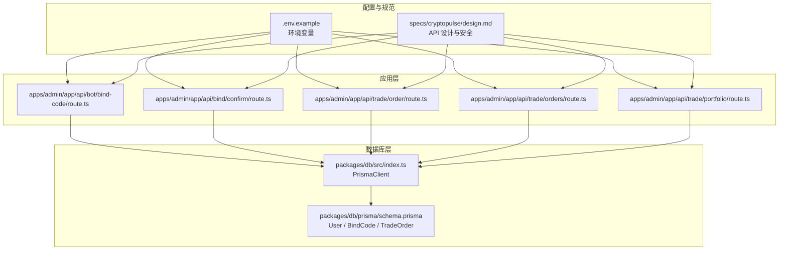
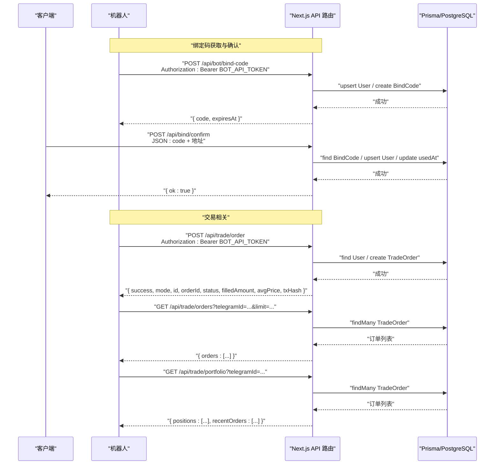
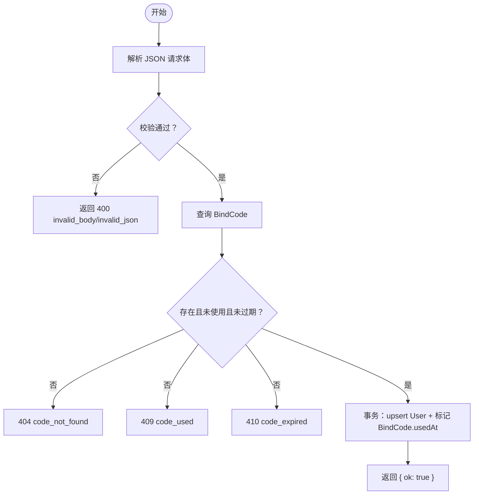
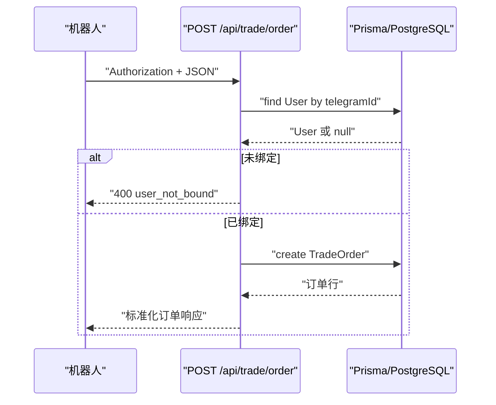
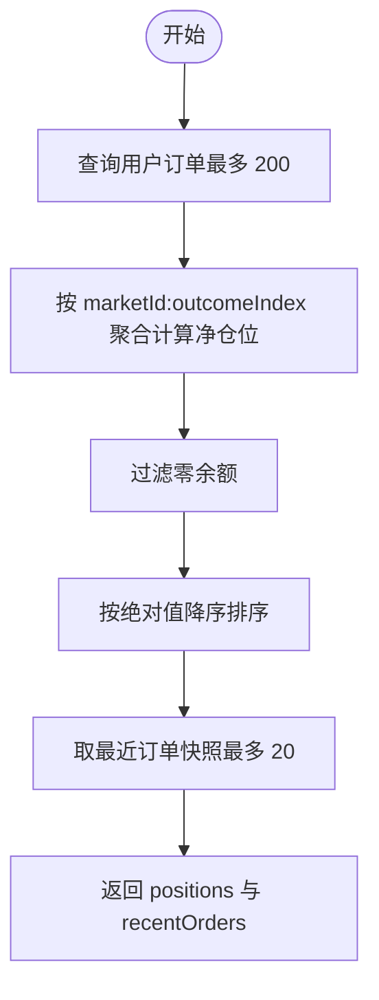
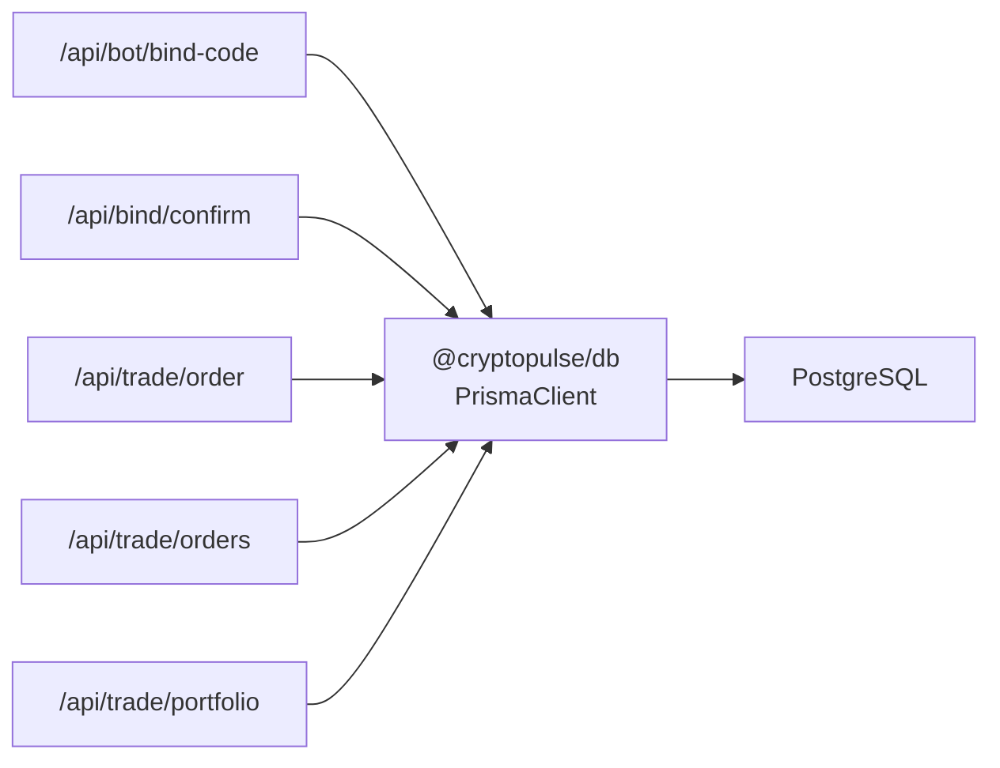

# API 参考

<cite>
**本文引用的文件**
- [apps/admin/app/api/bot/bind-code/route.ts](file://apps/admin/app/api/bot/bind-code/route.ts)
- [apps/admin/app/api/bind/confirm/route.ts](file://apps/admin/app/api/bind/confirm/route.ts)
- [apps/admin/app/api/trade/order/route.ts](file://apps/admin/app/api/trade/order/route.ts)
- [apps/admin/app/api/trade/orders/route.ts](file://apps/admin/app/api/trade/orders/route.ts)
- [apps/admin/app/api/trade/portfolio/route.ts](file://apps/admin/app/api/trade/portfolio/route.ts)
- [.env.example](file://.env.example)
- [packages/db/prisma/schema.prisma](file://packages/db/prisma/schema.prisma)
- [packages/db/src/index.ts](file://packages/db/src/index.ts)
- [specs/cryptopulse/design.md](file://specs/cryptopulse/design.md)
- [test/bind-code.test.ts](file://test/bind-code.test.ts)
- [test/bind-confirm.test.ts](file://test/bind-confirm.test.ts)
- [test/trade-order.test.ts](file://test/trade-order.test.ts)
- [test/trade-portfolio.test.ts](file://test/trade-portfolio.test.ts)
</cite>

## 目录
1. [简介](#简介)
2. [项目结构](#项目结构)
3. [核心组件](#核心组件)
4. [架构总览](#架构总览)
5. [详细组件分析](#详细组件分析)
6. [依赖分析](#依赖分析)
7. [性能考虑](#性能考虑)
8. [故障排查指南](#故障排查指南)
9. [结论](#结论)
10. [附录](#附录)

## 简介
本文件为 CryptoPulse 项目的对外 API 参考，覆盖以下公共端点：
- 绑定确认 API：用于使用绑定码完成用户地址绑定
- 绑定码获取 API：用于为机器人生成一次性绑定码
- 交易下单 API：用于提交交易订单（模拟/真实模式）
- 订单查询 API：用于查询用户历史订单
- 仓位查询 API：用于计算用户当前仓位与最近订单

文档内容包括：
- HTTP 方法、URL 模式、请求参数与响应格式
- 认证方式、请求头设置与安全注意事项
- 成功与失败示例、错误码与处理策略
- API 版本控制、向后兼容与迁移建议
- 客户端实现要点与性能优化建议

## 项目结构
本项目采用 Next.js 应用结构，API 路由位于 apps/admin/app/api 下，数据库模型定义于 packages/db/prisma/schema.prisma，环境变量集中于 .env.example。

图表来源
- [apps/admin/app/api/bot/bind-code/route.ts](file://apps/admin/app/api/bot/bind-code/route.ts#L1-L105)
- [apps/admin/app/api/bind/confirm/route.ts](file://apps/admin/app/api/bind/confirm/route.ts#L1-L91)
- [apps/admin/app/api/trade/order/route.ts](file://apps/admin/app/api/trade/order/route.ts#L1-L94)
- [apps/admin/app/api/trade/orders/route.ts](file://apps/admin/app/api/trade/orders/route.ts#L1-L74)
- [apps/admin/app/api/trade/portfolio/route.ts](file://apps/admin/app/api/trade/portfolio/route.ts#L1-L80)
- [packages/db/prisma/schema.prisma](file://packages/db/prisma/schema.prisma#L1-L55)
- [packages/db/src/index.ts](file://packages/db/src/index.ts#L1-L13)
- [.env.example](file://.env.example#L1-L43)
- [specs/cryptopulse/design.md](file://specs/cryptopulse/design.md#L128-L160)

章节来源
- [apps/admin/app/api/bot/bind-code/route.ts](file://apps/admin/app/api/bot/bind-code/route.ts#L1-L105)
- [apps/admin/app/api/bind/confirm/route.ts](file://apps/admin/app/api/bind/confirm/route.ts#L1-L91)
- [apps/admin/app/api/trade/order/route.ts](file://apps/admin/app/api/trade/order/route.ts#L1-L94)
- [apps/admin/app/api/trade/orders/route.ts](file://apps/admin/app/api/trade/orders/route.ts#L1-L74)
- [apps/admin/app/api/trade/portfolio/route.ts](file://apps/admin/app/api/trade/portfolio/route.ts#L1-L80)
- [packages/db/prisma/schema.prisma](file://packages/db/prisma/schema.prisma#L1-L55)
- [.env.example](file://.env.example#L1-L43)
- [specs/cryptopulse/design.md](file://specs/cryptopulse/design.md#L128-L160)

## 核心组件
- 绑定码生成与使用：通过机器人令牌生成一次性绑定码，随后用户使用绑定码完成地址绑定。
- 交易下单：基于机器人令牌进行下单，支持模拟/真实两种模式，自动写入订单并返回标准化响应。
- 订单查询：按用户 ID 查询历史订单，支持分页与排序。
- 仓位查询：基于订单计算用户在各市场的多空仓位，并返回最近订单快照。

章节来源
- [apps/admin/app/api/bot/bind-code/route.ts](file://apps/admin/app/api/bot/bind-code/route.ts#L1-L105)
- [apps/admin/app/api/bind/confirm/route.ts](file://apps/admin/app/api/bind/confirm/route.ts#L1-L91)
- [apps/admin/app/api/trade/order/route.ts](file://apps/admin/app/api/trade/order/route.ts#L1-L94)
- [apps/admin/app/api/trade/orders/route.ts](file://apps/admin/app/api/trade/orders/route.ts#L1-L74)
- [apps/admin/app/api/trade/portfolio/route.ts](file://apps/admin/app/api/trade/portfolio/route.ts#L1-L80)

## 架构总览
下图展示了 API 的调用链路与数据流向：

图表来源
- [apps/admin/app/api/bot/bind-code/route.ts](file://apps/admin/app/api/bot/bind-code/route.ts#L34-L103)
- [apps/admin/app/api/bind/confirm/route.ts](file://apps/admin/app/api/bind/confirm/route.ts#L47-L88)
- [apps/admin/app/api/trade/order/route.ts](file://apps/admin/app/api/trade/order/route.ts#L16-L92)
- [apps/admin/app/api/trade/orders/route.ts](file://apps/admin/app/api/trade/orders/route.ts#L18-L71)
- [apps/admin/app/api/trade/portfolio/route.ts](file://apps/admin/app/api/trade/portfolio/route.ts#L17-L77)

## 详细组件分析

### 绑定码获取 API
- 功能描述：为指定 Telegram 用户生成一次性绑定码，并设置过期时间。
- HTTP 方法与 URL
  - 方法：POST
  - URL：/api/bot/bind-code
- 请求头
  - Authorization: Bearer {BOT_API_TOKEN}
  - Content-Type: application/json
- 请求体字段
  - telegramId: number（正整数）
  - language: string（可选）
- 响应
  - 成功：200，返回 { code, expiresAt }
  - 失败：400/401/500，返回 { error }
- 安全与限制
  - 需要 BOT_API_TOKEN 鉴权；生产环境未配置 BOT_API_TOKEN 时返回 401
  - 绑定码长度固定、唯一约束，冲突时自动重试最多 5 次
- 示例
  - 成功示例：见测试用例路径
    - [test/bind-code.test.ts](file://test/bind-code.test.ts#L64-L86)
  - 失败示例（未授权）：见测试用例路径
    - [test/bind-code.test.ts](file://test/bind-code.test.ts#L49-L62)

章节来源
- [apps/admin/app/api/bot/bind-code/route.ts](file://apps/admin/app/api/bot/bind-code/route.ts#L34-L103)
- [test/bind-code.test.ts](file://test/bind-code.test.ts#L1-L88)
- [.env.example](file://.env.example#L10-L12)
- [specs/cryptopulse/design.md](file://specs/cryptopulse/design.md#L146-L153)

### 绑定确认 API
- 功能描述：使用绑定码完成用户地址绑定，同时写入用户信息并标记绑定码已使用。
- HTTP 方法与 URL
  - 方法：POST
  - URL：/api/bind/confirm
- 请求头
  - Content-Type: application/json
- 请求体字段
  - code: string（必填）
  - polymarketAddress: string（可选，以 0x 开头的 42 字符十六进制地址）
  - safeAddress: string（可选）
  - funderAddress: string（可选）
- 响应
  - 成功：200，返回 { ok: true }
  - 失败：400/404/409/410/500，返回 { error }
- 错误码
  - invalid_json / invalid_body：请求体解析或校验失败
  - code_not_found：绑定码不存在
  - code_used：绑定码已被使用
  - code_expired：绑定码已过期
  - server_error：服务器内部错误
- 示例
  - 成功示例：见测试用例路径
    - [test/bind-confirm.test.ts](file://test/bind-confirm.test.ts#L50-L83)
  - 失败示例（重复使用）：见测试用例路径
    - [test/bind-confirm.test.ts](file://test/bind-confirm.test.ts#L85-L111)

图表来源
- [apps/admin/app/api/bind/confirm/route.ts](file://apps/admin/app/api/bind/confirm/route.ts#L47-L88)

章节来源
- [apps/admin/app/api/bind/confirm/route.ts](file://apps/admin/app/api/bind/confirm/route.ts#L1-L91)
- [test/bind-confirm.test.ts](file://test/bind-confirm.test.ts#L1-L112)

### 交易下单 API
- 功能描述：为用户提交交易订单，支持 BUY/SELL，按 TRADE_MODE 返回模拟或待处理状态。
- HTTP 方法与 URL
  - 方法：POST
  - URL：/api/trade/order
- 请求头
  - Authorization: Bearer {BOT_API_TOKEN}
  - Content-Type: application/json
- 请求体字段
  - telegramId: number（正整数）
  - marketId: string（非空）
  - outcomeIndex: number（非负整数）
  - amount: number（正数）
  - side: "BUY" | "SELL"
- 响应
  - 成功：200，返回标准化订单对象
  - 失败：400/401/500，返回 { error }
- 行为细节
  - 用户必须已绑定 polymarketAddress，否则返回 user_not_bound
  - TRADE_MODE 默认为 mock，返回模拟成交状态与示例字段
- 示例
  - 成功示例（mock 模式）：见测试用例路径
    - [test/trade-order.test.ts](file://test/trade-order.test.ts#L80-L105)
  - 失败示例（未绑定）：见测试用例路径
    - [test/trade-order.test.ts](file://test/trade-order.test.ts#L63-L78)

图表来源
- [apps/admin/app/api/trade/order/route.ts](file://apps/admin/app/api/trade/order/route.ts#L50-L77)

章节来源
- [apps/admin/app/api/trade/order/route.ts](file://apps/admin/app/api/trade/order/route.ts#L1-L94)
- [test/trade-order.test.ts](file://test/trade-order.test.ts#L1-L107)
- [.env.example](file://.env.example#L19-L23)

### 订单查询 API
- 功能描述：按用户 ID 查询历史订单，默认按时间倒序，支持 limit 分页。
- HTTP 方法与 URL
  - 方法：GET
  - URL：/api/trade/orders?telegramId={}&limit={}
- 请求头
  - Authorization: Bearer {BOT_API_TOKEN}
- 查询参数
  - telegramId: number（正整数）
  - limit: number（1..100，可选，默认 20）
- 响应
  - 成功：200，返回 { orders: [...] }
  - 失败：400/401/500，返回 { error }
- 示例
  - 成功示例：见测试用例路径
    - [test/trade-orders.test.ts](file://test/trade-orders.test.ts#L1-L74)

章节来源
- [apps/admin/app/api/trade/orders/route.ts](file://apps/admin/app/api/trade/orders/route.ts#L1-L74)
- [test/trade-orders.test.ts](file://test/trade-orders.test.ts#L1-L74)

### 仓位查询 API
- 功能描述：计算用户在各市场的净仓位，并返回最近订单快照。
- HTTP 方法与 URL
  - 方法：GET
  - URL：/api/trade/portfolio?telegramId={}
- 请求头
  - Authorization: Bearer {BOT_API_TOKEN}
- 查询参数
  - telegramId: number（正整数）
- 响应
  - 成功：200，返回 { positions: [...], recentOrders: [...] }
  - 失败：400/401/500，返回 { error }
- 计算逻辑
  - positions：按 marketId:outcomeIndex 聚合，买入加仓、卖出平仓，过滤零余额
  - recentOrders：取最近若干条订单
- 示例
  - 成功示例：见测试用例路径
    - [test/trade-portfolio.test.ts](file://test/trade-portfolio.test.ts#L49-L94)

图表来源
- [apps/admin/app/api/trade/portfolio/route.ts](file://apps/admin/app/api/trade/portfolio/route.ts#L48-L74)

章节来源
- [apps/admin/app/api/trade/portfolio/route.ts](file://apps/admin/app/api/trade/portfolio/route.ts#L1-L80)
- [test/trade-portfolio.test.ts](file://test/trade-portfolio.test.ts#L1-L96)

## 依赖分析
- 数据库依赖
  - 使用 PrismaClient 连接 PostgreSQL，模型包括 User、BindCode、TradeOrder
- 环境变量
  - BOT_API_TOKEN：机器人 API 鉴权
  - DATABASE_URL：数据库连接
  - TRADE_MODE：下单模式（mock/真实）
- 外部集成
  - Polymarket CLOB/Relayer（通过上层业务逻辑集成，本 API 层不直接调用）

图表来源
- [packages/db/src/index.ts](file://packages/db/src/index.ts#L1-L13)
- [packages/db/prisma/schema.prisma](file://packages/db/prisma/schema.prisma#L10-L54)
- [apps/admin/app/api/bot/bind-code/route.ts](file://apps/admin/app/api/bot/bind-code/route.ts#L64-L69)
- [apps/admin/app/api/bind/confirm/route.ts](file://apps/admin/app/api/bind/confirm/route.ts#L26-L31)
- [apps/admin/app/api/trade/order/route.ts](file://apps/admin/app/api/trade/order/route.ts#L43-L48)
- [apps/admin/app/api/trade/orders/route.ts](file://apps/admin/app/api/trade/orders/route.ts#L29-L34)
- [apps/admin/app/api/trade/portfolio/route.ts](file://apps/admin/app/api/trade/portfolio/route.ts#L28-L33)

章节来源
- [packages/db/src/index.ts](file://packages/db/src/index.ts#L1-L13)
- [packages/db/prisma/schema.prisma](file://packages/db/prisma/schema.prisma#L1-L55)
- [.env.example](file://.env.example#L1-L43)

## 性能考虑
- 数据库索引
  - TradeOrder 对 (telegramId, createdAt) 建有索引，有利于订单查询排序与分页
- 查询限制
  - 订单查询默认 limit=20，最大 100；仓位查询最多扫描 200 条订单
- 模拟模式
  - TRADE_MODE=mock 时避免真实链上交互，降低延迟与失败率
- 建议
  - 客户端对高频查询增加本地缓存与去抖
  - 控制批量查询的并发度，避免数据库压力峰值

章节来源
- [packages/db/prisma/schema.prisma](file://packages/db/prisma/schema.prisma#L52-L53)
- [apps/admin/app/api/trade/orders/route.ts](file://apps/admin/app/api/trade/orders/route.ts#L8-L10)
- [apps/admin/app/api/trade/portfolio/route.ts](file://apps/admin/app/api/trade/portfolio/route.ts#L46-L47)
- [specs/cryptopulse/design.md](file://specs/cryptopulse/design.md#L146-L153)

## 故障排查指南
- 常见错误码与处理
  - 400 invalid_json / invalid_body：检查请求体格式与字段类型
  - 400 user_not_bound：确保用户已完成绑定码确认流程
  - 401 unauthorized：核对 Authorization 头与 BOT_API_TOKEN 设置
  - 404 code_not_found：确认绑定码是否存在
  - 409 code_used：绑定码已被使用
  - 410 code_expired：绑定码已过期，重新申请
  - 500 server_error：检查数据库可用性与 Prisma 初始化
- 关键检查点
  - DATABASE_URL 是否正确
  - BOT_API_TOKEN 是否设置且一致
  - TRADE_MODE 是否符合预期
  - 绑定码是否在有效期内且未被使用
- 参考测试用例
  - 绑定码获取：[test/bind-code.test.ts](file://test/bind-code.test.ts#L27-L86)
  - 绑定确认：[test/bind-confirm.test.ts](file://test/bind-confirm.test.ts#L33-L111)
  - 交易下单：[test/trade-order.test.ts](file://test/trade-order.test.ts#L50-L105)
  - 仓位查询：[test/trade-portfolio.test.ts](file://test/trade-portfolio.test.ts#L49-L94)

章节来源
- [apps/admin/app/api/bot/bind-code/route.ts](file://apps/admin/app/api/bot/bind-code/route.ts#L34-L103)
- [apps/admin/app/api/bind/confirm/route.ts](file://apps/admin/app/api/bind/confirm/route.ts#L21-L88)
- [apps/admin/app/api/trade/order/route.ts](file://apps/admin/app/api/trade/order/route.ts#L16-L92)
- [apps/admin/app/api/trade/orders/route.ts](file://apps/admin/app/api/trade/orders/route.ts#L18-L71)
- [apps/admin/app/api/trade/portfolio/route.ts](file://apps/admin/app/api/trade/portfolio/route.ts#L17-L77)
- [test/bind-code.test.ts](file://test/bind-code.test.ts#L1-L88)
- [test/bind-confirm.test.ts](file://test/bind-confirm.test.ts#L1-L112)
- [test/trade-order.test.ts](file://test/trade-order.test.ts#L1-L107)
- [test/trade-portfolio.test.ts](file://test/trade-portfolio.test.ts#L1-L96)

## 结论
本文档提供了 CryptoPulse 项目对外 API 的完整参考，涵盖绑定码获取与确认、交易下单、订单查询与仓位查询等核心能力。通过严格的鉴权、输入校验与错误码设计，配合数据库索引与查询限制，API 在保证安全性的同时具备良好的可扩展性。建议在生产环境中严格遵循安全与性能建议，并结合测试用例进行回归验证。

## 附录
- API 版本控制与兼容
  - 当前路由采用 Next.js App Router 文件系统约定，版本号未在路径中显式体现。建议后续引入 /v1 前缀并在变更时保持向后兼容或提供迁移指引
- 迁移指南
  - 若调整请求体字段或响应结构，需在变更前发布弃用通知，并提供过渡期的双格式支持
- 客户端实现要点
  - 固定使用 Bearer 令牌进行鉴权
  - 对关键错误码进行明确处理与用户提示
  - 对订单与仓位接口进行本地缓存与刷新策略
- 安全最佳实践
  - BOT_API_TOKEN 仅在服务端使用，不在前端暴露
  - 严格启用输入校验（Zod），避免 SQL 注入与越界访问
  - 对数据库连接与 Prisma 初始化失败进行降级处理

章节来源
- [specs/cryptopulse/design.md](file://specs/cryptopulse/design.md#L128-L160)
- [.env.example](file://.env.example#L10-L12)