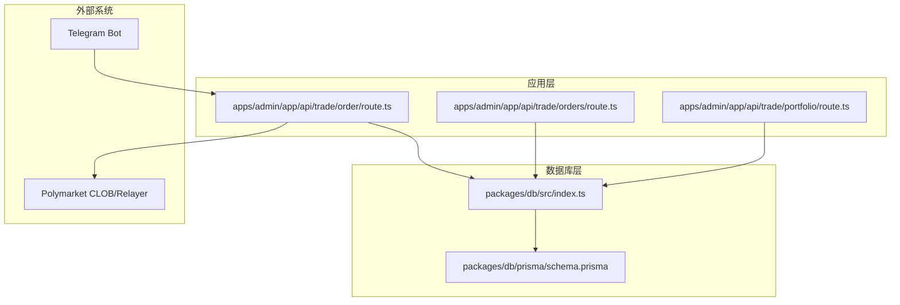
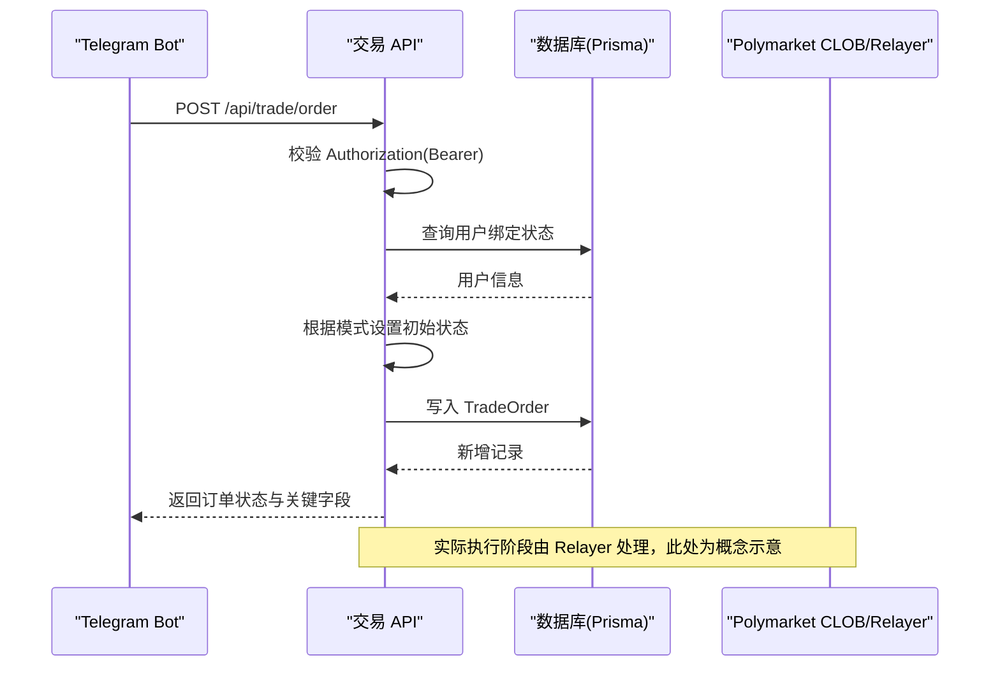
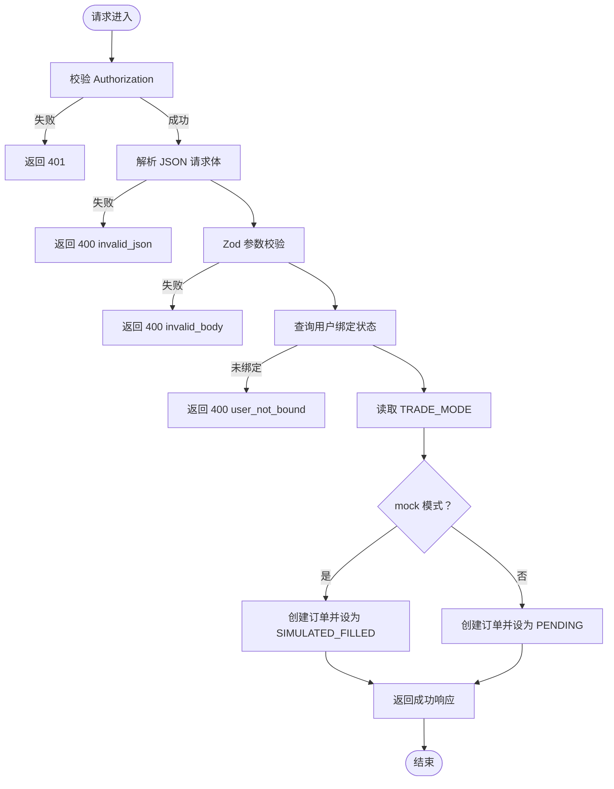
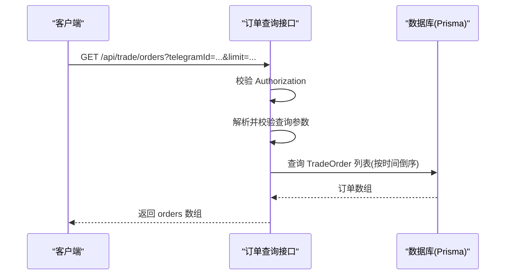
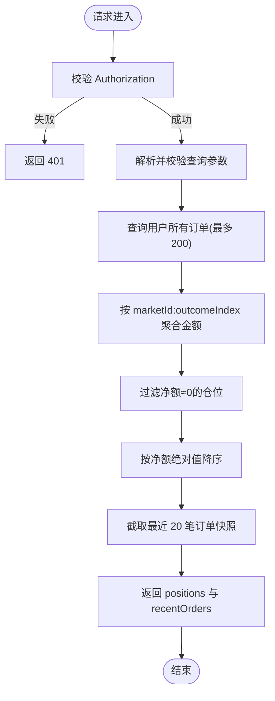
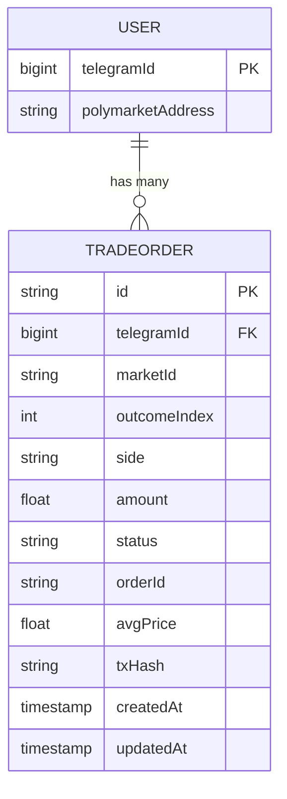
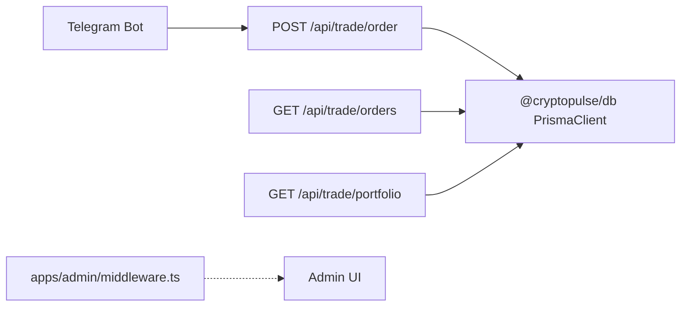

# 交易 API

<cite>
**本文引用的文件**
- [apps/admin/app/api/trade/order/route.ts](file://apps/admin/app/api/trade/order/route.ts)
- [apps/admin/app/api/trade/orders/route.ts](file://apps/admin/app/api/trade/orders/route.ts)
- [apps/admin/app/api/trade/portfolio/route.ts](file://apps/admin/app/api/trade/portfolio/route.ts)
- [packages/db/prisma/schema.prisma](file://packages/db/prisma/schema.prisma)
- [packages/db/src/index.ts](file://packages/db/src/index.ts)
- [apps/admin/middleware.ts](file://apps/admin/middleware.ts)
- [apps/bot/src/trade.ts](file://apps/bot/src/trade.ts)
- [test/trade-order.test.ts](file://test/trade-order.test.ts)
- [test/trade-portfolio.test.ts](file://test/trade-portfolio.test.ts)
</cite>

## 目录
1. [简介](#简介)
2. [项目结构](#项目结构)
3. [核心组件](#核心组件)
4. [架构总览](#架构总览)
5. [详细组件分析](#详细组件分析)
6. [依赖关系分析](#依赖关系分析)
7. [性能考虑](#性能考虑)
8. [故障排查指南](#故障排查指南)
9. [结论](#结论)

## 简介
本文件为交易 API 的权威技术文档，覆盖以下接口：
- 下单接口：POST /api/trade/order
- 订单查询接口：GET /api/trade/orders
- 仓位查询接口：GET /api/trade/portfolio

文档详细说明各接口的请求方法、参数、响应格式、错误处理、安全校验与数据模型，并提供基于真实源码的调用示例路径与状态流转说明。

## 项目结构
交易 API 位于 Next.js 应用的 app/api 路由中，采用 Next.js App Router 的路由约定。数据库访问通过 Prisma 客户端实现，数据模型定义于 Prisma Schema 中。

图表来源
- [apps/admin/app/api/trade/order/route.ts](file://apps/admin/app/api/trade/order/route.ts#L1-L94)
- [apps/admin/app/api/trade/orders/route.ts](file://apps/admin/app/api/trade/orders/route.ts#L1-L74)
- [apps/admin/app/api/trade/portfolio/route.ts](file://apps/admin/app/api/trade/portfolio/route.ts#L1-L80)
- [packages/db/prisma/schema.prisma](file://packages/db/prisma/schema.prisma#L1-L56)
- [packages/db/src/index.ts](file://packages/db/src/index.ts#L1-L13)

章节来源
- [apps/admin/app/api/trade/order/route.ts](file://apps/admin/app/api/trade/order/route.ts#L1-L94)
- [apps/admin/app/api/trade/orders/route.ts](file://apps/admin/app/api/trade/orders/route.ts#L1-L74)
- [apps/admin/app/api/trade/portfolio/route.ts](file://apps/admin/app/api/trade/portfolio/route.ts#L1-L80)
- [packages/db/prisma/schema.prisma](file://packages/db/prisma/schema.prisma#L1-L56)
- [packages/db/src/index.ts](file://packages/db/src/index.ts#L1-L13)

## 核心组件
- 订单接口：负责接收下单请求，进行鉴权与参数校验，写入数据库并返回订单状态与关键字段。
- 订单列表接口：按用户查询订单列表，支持分页限制。
- 仓位接口：聚合用户订单，计算未平仓仓位并返回最近订单快照。

章节来源
- [apps/admin/app/api/trade/order/route.ts](file://apps/admin/app/api/trade/order/route.ts#L16-L93)
- [apps/admin/app/api/trade/orders/route.ts](file://apps/admin/app/api/trade/orders/route.ts#L18-L72)
- [apps/admin/app/api/trade/portfolio/route.ts](file://apps/admin/app/api/trade/portfolio/route.ts#L17-L78)

## 架构总览
交易 API 的调用链路如下：
- Telegram Bot 发起下单请求到 /api/trade/order
- 接口进行 Bearer Token 鉴权与请求体校验
- 查询用户绑定状态，决定是否允许下单
- 写入 TradeOrder 记录，根据模式返回模拟或待处理状态
- 订单查询与仓位查询接口从数据库读取并返回聚合结果

图表来源
- [apps/admin/app/api/trade/order/route.ts](file://apps/admin/app/api/trade/order/route.ts#L16-L93)
- [apps/bot/src/trade.ts](file://apps/bot/src/trade.ts#L80-L117)

## 详细组件分析

### 下单接口：POST /api/trade/order
- 方法与路径
  - 方法：POST
  - 路径：/api/trade/order
- 安全与鉴权
  - 请求头需包含 Authorization: Bearer <BOT_API_TOKEN>
  - 若未配置或令牌不匹配，返回 401 unauthorized
- 请求体参数
  - telegramId: number，正整数，用户 Telegram ID
  - marketId: string，非空
  - outcomeIndex: number，非负整数，代表选项索引
  - amount: number，正数，单位 USDC
  - side: "BUY" | "SELL"
- 订单类型与模式
  - 当前实现仅支持市价单（BUY/SELL），通过 amount 字段指定投入金额
  - TRADE_MODE 环境变量控制行为：
    - mock：创建订单并立即标记为 SIMULATED_FILLED，返回模拟成交信息
    - 其他值：创建订单并标记为 PENDING
- 响应字段
  - success: boolean
  - mode: string，当前模式
  - id: string，数据库记录 ID
  - orderId: string，业务订单号
  - status: "PENDING" 或 "SIMULATED_FILLED"
  - filledAmount: number，已成交金额（mock 模式下等于 amount）
  - avgPrice: number|null，平均成交价格（mock 模式下为固定值）
  - txHash: string|null，交易哈希（mock 模式下为固定值）
- 错误处理
  - 400 invalid_json：请求体不是合法 JSON
  - 400 invalid_body：请求体字段校验失败
  - 400 user_not_bound：用户未绑定 Polymarket 地址
  - 401 unauthorized：Authorization 缺失或令牌不正确
  - 500 server_error：内部异常
  - 503 database_unavailable/prisma_unavailable：数据库或 Prisma 不可用
- 示例调用路径
  - 参考 Telegram Bot 的下单调用：[apps/bot/src/trade.ts](file://apps/bot/src/trade.ts#L80-L117)
  - 参考下单接口实现：[apps/admin/app/api/trade/order/route.ts](file://apps/admin/app/api/trade/order/route.ts#L16-L93)
  - 参考下单测试用例：[test/trade-order.test.ts](file://test/trade-order.test.ts#L80-L105)

图表来源
- [apps/admin/app/api/trade/order/route.ts](file://apps/admin/app/api/trade/order/route.ts#L16-L93)

章节来源
- [apps/admin/app/api/trade/order/route.ts](file://apps/admin/app/api/trade/order/route.ts#L8-L14)
- [apps/admin/app/api/trade/order/route.ts](file://apps/admin/app/api/trade/order/route.ts#L16-L93)
- [apps/bot/src/trade.ts](file://apps/bot/src/trade.ts#L80-L117)
- [test/trade-order.test.ts](file://test/trade-order.test.ts#L80-L105)

### 订单查询接口：GET /api/trade/orders
- 方法与路径
  - 方法：GET
  - 路径：/api/trade/orders
- 安全与鉴权
  - 请求头需包含 Authorization: Bearer <BOT_API_TOKEN>
  - 若未配置或令牌不匹配，返回 401 unauthorized
- 查询参数
  - telegramId: number，正整数，必填
  - limit: number，正整数，最小 1，最大 100，默认 20
- 响应字段
  - orders: 数组，每项包含：
    - id: string
    - marketId: string
    - outcomeIndex: number
    - side: "BUY" | "SELL"
    - amount: number
    - status: "PENDING" | "SIMULATED_FILLED"
    - orderId: string
    - avgPrice: number|null
    - txHash: string|null
    - createdAt: string（ISO 时间戳）
- 分页机制
  - 默认取最近 20 笔订单；可通过 limit 控制
  - 结果按创建时间倒序排列
- 错误处理
  - 400 invalid_query：查询参数校验失败
  - 401 unauthorized：Authorization 缺失或令牌不正确
  - 500 server_error：内部异常
  - 503 database_unavailable/prisma_unavailable：数据库或 Prisma 不可用
- 示例调用路径
  - 参考订单查询接口实现：[apps/admin/app/api/trade/orders/route.ts](file://apps/admin/app/api/trade/orders/route.ts#L18-L72)
  - 参考订单查询测试用例：[test/trade-orders.test.ts](file://test/trade-orders.test.ts#L1-L200)

图表来源
- [apps/admin/app/api/trade/orders/route.ts](file://apps/admin/app/api/trade/orders/route.ts#L18-L72)

章节来源
- [apps/admin/app/api/trade/orders/route.ts](file://apps/admin/app/api/trade/orders/route.ts#L7-L10)
- [apps/admin/app/api/trade/orders/route.ts](file://apps/admin/app/api/trade/orders/route.ts#L18-L72)

### 仓位查询接口：GET /api/trade/portfolio
- 方法与路径
  - 方法：GET
  - 路径：/api/trade/portfolio
- 安全与鉴权
  - 请求头需包含 Authorization: Bearer <BOT_API_TOKEN>
  - 若未配置或令牌不匹配，返回 401 unauthorized
- 查询参数
  - telegramId: number，正整数，必填
- 响应字段
  - positions: 未平仓仓位数组，每项包含：
    - marketId: string
    - outcomeIndex: number
    - amount: number（绝对值按大到小排序）
  - recentOrders: 最近订单快照数组（最多 20 笔），每项字段同订单查询接口
- 数据聚合逻辑
  - 以 "marketId:outcomeIndex" 为键，对 BUY/Sell 金额进行加减
  - 过滤掉净额接近 0 的仓位
  - positions 按净额绝对值降序排列
- 错误处理
  - 400 invalid_query：查询参数校验失败
  - 401 unauthorized：Authorization 缺失或令牌不正确
  - 500 server_error：内部异常
  - 503 database_unavailable/prisma_unavailable：数据库或 Prisma 不可用
- 示例调用路径
  - 参考仓位查询接口实现：[apps/admin/app/api/trade/portfolio/route.ts](file://apps/admin/app/api/trade/portfolio/route.ts#L17-L78)
  - 参考仓位查询测试用例：[test/trade-portfolio.test.ts](file://test/trade-portfolio.test.ts#L49-L94)

图表来源
- [apps/admin/app/api/trade/portfolio/route.ts](file://apps/admin/app/api/trade/portfolio/route.ts#L42-L78)

章节来源
- [apps/admin/app/api/trade/portfolio/route.ts](file://apps/admin/app/api/trade/portfolio/route.ts#L7-L9)
- [apps/admin/app/api/trade/portfolio/route.ts](file://apps/admin/app/api/trade/portfolio/route.ts#L17-L78)
- [test/trade-portfolio.test.ts](file://test/trade-portfolio.test.ts#L49-L94)

### 数据模型与关系
- User
  - telegramId: BigInt（唯一）
  - polymarketAddress: String?
  - tradeOrders: 关联 TradeOrder[]
- TradeOrder
  - id: String（主键）
  - telegramId: BigInt（外键）
  - marketId: String
  - outcomeIndex: Int
  - side: String（"BUY"|"SELL"）
  - amount: Float
  - status: String（默认 "PENDING"）
  - orderId: String?
  - avgPrice: Float?
  - txHash: String?
  - createdAt/updatedAt: DateTime
  - user: 关联 User

图表来源
- [packages/db/prisma/schema.prisma](file://packages/db/prisma/schema.prisma#L10-L54)

章节来源
- [packages/db/prisma/schema.prisma](file://packages/db/prisma/schema.prisma#L10-L54)

## 依赖关系分析
- 接口依赖 Prisma 客户端访问数据库
- 数据库连接通过全局 PrismaClient 实例管理
- Telegram Bot 通过 HTTP 调用下单接口
- 中间件用于后台管理页面的登录校验（与交易 API 无关）

图表来源
- [apps/admin/app/api/trade/order/route.ts](file://apps/admin/app/api/trade/order/route.ts#L43-L48)
- [apps/admin/app/api/trade/orders/route.ts](file://apps/admin/app/api/trade/orders/route.ts#L29-L34)
- [apps/admin/app/api/trade/portfolio/route.ts](file://apps/admin/app/api/trade/portfolio/route.ts#L28-L33)
- [packages/db/src/index.ts](file://packages/db/src/index.ts#L1-L13)
- [apps/admin/middleware.ts](file://apps/admin/middleware.ts#L1-L23)

章节来源
- [apps/admin/app/api/trade/order/route.ts](file://apps/admin/app/api/trade/order/route.ts#L43-L48)
- [apps/admin/app/api/trade/orders/route.ts](file://apps/admin/app/api/trade/orders/route.ts#L29-L34)
- [apps/admin/app/api/trade/portfolio/route.ts](file://apps/admin/app/api/trade/portfolio/route.ts#L28-L33)
- [packages/db/src/index.ts](file://packages/db/src/index.ts#L1-L13)
- [apps/admin/middleware.ts](file://apps/admin/middleware.ts#L1-L23)

## 性能考虑
- 查询优化
  - 订单查询接口使用 createdAt 倒序与 take 限制，避免全表扫描
  - 仓位聚合在内存中进行，建议控制查询范围（如 recentOrders 截断）
- 数据库索引
  - TradeOrder 上存在复合索引，有助于按 telegramId 与时间排序的查询
- 并发与事务
  - 当前实现未显式使用事务，若后续扩展为真实链上执行，建议引入事务保证一致性

[本节为通用性能建议，不直接分析具体文件]

## 故障排查指南
- 401 Unauthorized
  - 检查 Authorization 头是否为 Bearer <BOT_API_TOKEN>
  - 确认 BOT_API_TOKEN 已正确设置
- 400 invalid_json
  - 检查请求体是否为合法 JSON
- 400 invalid_body
  - 检查字段类型与取值范围（正整数、枚举值等）
- 400 user_not_bound
  - 确认用户已在数据库中绑定 Polymarket 地址
- 500 server_error
  - 查看服务端日志定位异常
- 503 database_unavailable/prisma_unavailable
  - 检查 DATABASE_URL 是否正确配置，数据库是否可达

章节来源
- [apps/admin/app/api/trade/order/route.ts](file://apps/admin/app/api/trade/order/route.ts#L17-L23)
- [apps/admin/app/api/trade/order/route.ts](file://apps/admin/app/api/trade/order/route.ts#L25-L35)
- [apps/admin/app/api/trade/order/route.ts](file://apps/admin/app/api/trade/order/route.ts#L39-L48)
- [apps/admin/app/api/trade/orders/route.ts](file://apps/admin/app/api/trade/orders/route.ts#L19-L23)
- [apps/admin/app/api/trade/orders/route.ts](file://apps/admin/app/api/trade/orders/route.ts#L36-L43)
- [apps/admin/app/api/trade/orders/route.ts](file://apps/admin/app/api/trade/orders/route.ts#L25-L34)
- [apps/admin/app/api/trade/portfolio/route.ts](file://apps/admin/app/api/trade/portfolio/route.ts#L18-L22)
- [apps/admin/app/api/trade/portfolio/route.ts](file://apps/admin/app/api/trade/portfolio/route.ts#L35-L39)
- [apps/admin/app/api/trade/portfolio/route.ts](file://apps/admin/app/api/trade/portfolio/route.ts#L24-L33)

## 结论
交易 API 提供了简洁明确的下单、订单查询与仓位查询能力，配合 Telegram Bot 可实现自动化交易流程。当前实现以 mock 模式为主，便于开发与测试；生产环境可依据需求扩展为真实链上执行，并补充订单状态流转与更多订单类型支持。