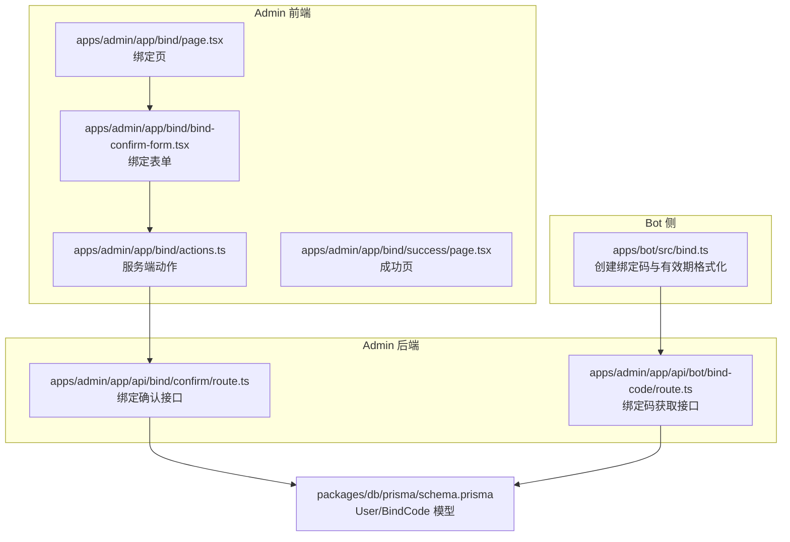
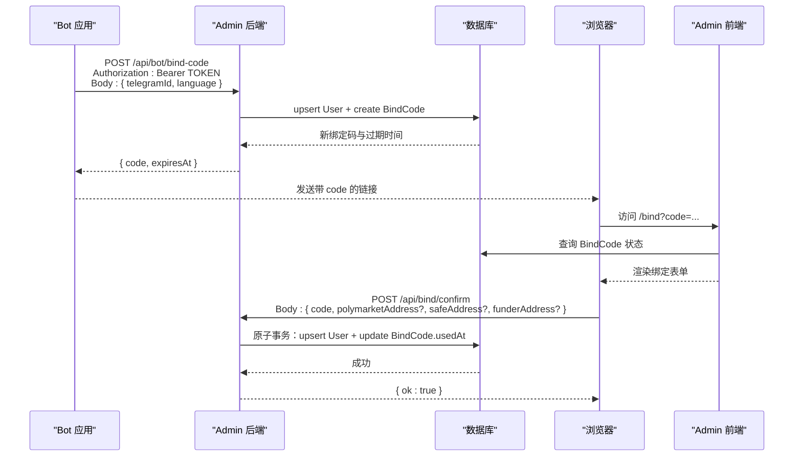
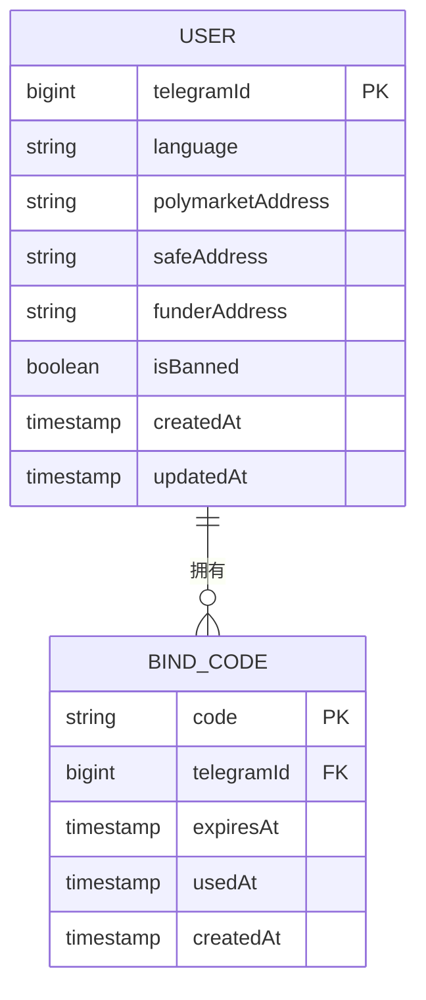
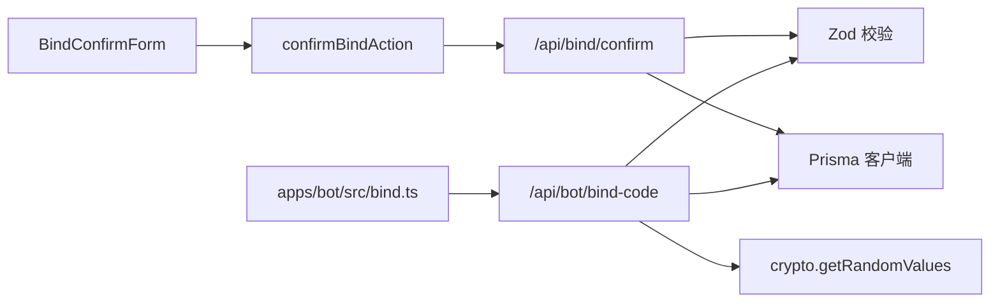

# 绑定 API

<cite>
**本文引用的文件**
- [apps/admin/app/api/bind/confirm/route.ts](file://apps/admin/app/api/bind/confirm/route.ts)
- [apps/admin/app/api/bot/bind-code/route.ts](file://apps/admin/app/api/bot/bind-code/route.ts)
- [apps/admin/app/bind/actions.ts](file://apps/admin/app/bind/actions.ts)
- [apps/admin/app/bind/page.tsx](file://apps/admin/app/bind/page.tsx)
- [apps/admin/app/bind/success/page.tsx](file://apps/admin/app/bind/success/page.tsx)
- [apps/admin/app/bind/bind-confirm-form.tsx](file://apps/admin/app/bind/bind-confirm-form.tsx)
- [apps/bot/src/bind.ts](file://apps/bot/src/bind.ts)
- [packages/db/prisma/schema.prisma](file://packages/db/prisma/schema.prisma)
- [.env.example](file://.env.example)
- [test/bind-confirm.test.ts](file://test/bind-confirm.test.ts)
- [test/bind-code.test.ts](file://test/bind-code.test.ts)
- [test/bot-bind.test.ts](file://test/bot-bind.test.ts)
</cite>

## 目录
1. [简介](#简介)
2. [项目结构](#项目结构)
3. [核心组件](#核心组件)
4. [架构总览](#架构总览)
5. [详细组件分析](#详细组件分析)
6. [依赖关系分析](#依赖关系分析)
7. [性能考量](#性能考量)
8. [故障排查指南](#故障排查指南)
9. [结论](#结论)
10. [附录](#附录)

## 简介
本文件为“绑定 API”的权威技术文档，覆盖以下两个核心接口：
- 绑定确认 API：用于用户在网页端完成绑定码校验并保存钱包地址信息
- 绑定码获取 API：用于 Bot 后端服务生成一次性绑定码并返回给用户

文档内容包括：
- 接口方法、请求参数/查询参数、响应格式与错误码
- 参数校验规则、地址格式要求与安全考虑
- 完整的请求/响应示例（成功绑定、无效绑定码、已使用绑定码、过期绑定码等）
- 客户端集成示例与常见错误处理方案

## 项目结构
绑定 API 涉及前端页面、服务端路由与数据库模型，整体结构如下：

图表来源
- [apps/bot/src/bind.ts](file://apps/bot/src/bind.ts#L1-L39)
- [apps/admin/app/bind/page.tsx](file://apps/admin/app/bind/page.tsx#L1-L127)
- [apps/admin/app/bind/bind-confirm-form.tsx](file://apps/admin/app/bind/bind-confirm-form.tsx#L1-L172)
- [apps/admin/app/bind/actions.ts](file://apps/admin/app/bind/actions.ts#L1-L90)
- [apps/admin/app/bind/success/page.tsx](file://apps/admin/app/bind/success/page.tsx#L1-L38)
- [apps/admin/app/api/bind/confirm/route.ts](file://apps/admin/app/api/bind/confirm/route.ts#L1-L91)
- [apps/admin/app/api/bot/bind-code/route.ts](file://apps/admin/app/api/bot/bind-code/route.ts#L1-L105)
- [packages/db/prisma/schema.prisma](file://packages/db/prisma/schema.prisma#L10-L34)

章节来源
- [apps/admin/app/api/bind/confirm/route.ts](file://apps/admin/app/api/bind/confirm/route.ts#L1-L91)
- [apps/admin/app/api/bot/bind-code/route.ts](file://apps/admin/app/api/bot/bind-code/route.ts#L1-L105)
- [apps/admin/app/bind/actions.ts](file://apps/admin/app/bind/actions.ts#L1-L90)
- [apps/admin/app/bind/page.tsx](file://apps/admin/app/bind/page.tsx#L1-L127)
- [apps/admin/app/bind/bind-confirm-form.tsx](file://apps/admin/app/bind/bind-confirm-form.tsx#L1-L172)
- [apps/admin/app/bind/success/page.tsx](file://apps/admin/app/bind/success/page.tsx#L1-L38)
- [apps/bot/src/bind.ts](file://apps/bot/src/bind.ts#L1-L39)
- [packages/db/prisma/schema.prisma](file://packages/db/prisma/schema.prisma#L10-L34)

## 核心组件
- 绑定确认接口（服务端路由）：接收绑定码与钱包地址，校验绑定码状态，原子性更新用户与绑定码
- 绑定码获取接口（服务端路由）：鉴权后为用户生成一次性绑定码，设置过期时间并落库
- 前端绑定页与表单：展示引导步骤、错误提示、地址输入与校验
- Bot 侧工具：封装绑定码创建请求、错误透传与有效期文案格式化
- 数据库模型：User 与 BindCode 关联，支持唯一索引与外键约束

章节来源
- [apps/admin/app/api/bind/confirm/route.ts](file://apps/admin/app/api/bind/confirm/route.ts#L1-L91)
- [apps/admin/app/api/bot/bind-code/route.ts](file://apps/admin/app/api/bot/bind-code/route.ts#L1-L105)
- [apps/admin/app/bind/page.tsx](file://apps/admin/app/bind/page.tsx#L1-L127)
- [apps/admin/app/bind/bind-confirm-form.tsx](file://apps/admin/app/bind/bind-confirm-form.tsx#L1-L172)
- [apps/bot/src/bind.ts](file://apps/bot/src/bind.ts#L1-L39)
- [packages/db/prisma/schema.prisma](file://packages/db/prisma/schema.prisma#L10-L34)

## 架构总览
下图展示了从 Bot 生成绑定码到用户在网页端完成绑定确认的完整流程：

图表来源
- [apps/bot/src/bind.ts](file://apps/bot/src/bind.ts#L3-L30)
- [apps/admin/app/api/bot/bind-code/route.ts](file://apps/admin/app/api/bot/bind-code/route.ts#L34-L103)
- [apps/admin/app/bind/page.tsx](file://apps/admin/app/bind/page.tsx#L30-L66)
- [apps/admin/app/bind/bind-confirm-form.tsx](file://apps/admin/app/bind/bind-confirm-form.tsx#L18-L169)
- [apps/admin/app/api/bind/confirm/route.ts](file://apps/admin/app/api/bind/confirm/route.ts#L21-L89)
- [packages/db/prisma/schema.prisma](file://packages/db/prisma/schema.prisma#L10-L34)

## 详细组件分析

### 绑定确认 API（POST /api/bind/confirm）
- 方法：POST
- 请求头：Content-Type: application/json
- 请求体参数
  - code：字符串，必填，非空
  - polymarketAddress：可选，0x 开头的 42 字符十六进制地址；为空字符串时视为未填写
  - safeAddress：可选，0x 开头的 42 字符十六进制地址；为空字符串时视为未填写
  - funderAddress：可选，0x 开头的 42 字符十六进制地址；为空字符串时视为未填写
- 响应
  - 成功：{ ok: true }
  - 错误：{ error: "<错误码>" }
- 错误码
  - invalid_json：请求体不是合法 JSON
  - invalid_body：请求体字段不符合校验规则
  - database_unavailable：未配置 DATABASE_URL
  - prisma_unavailable：无法加载 Prisma 客户端
  - code_not_found：绑定码不存在
  - code_used：绑定码已被使用
  - code_expired：绑定码已过期
  - server_error：服务器内部错误
- 参数校验与安全
  - 绑定码存在性、使用状态、过期时间三重校验
  - 地址格式统一校验为 0x 开头 + 40 个十六进制字符
  - 使用数据库事务保证用户信息与绑定码状态的一致性
- 请求/响应示例
  - 成功绑定
    - 请求：POST /api/bind/confirm
    - 请求体：{ "code": "ABC123DEF4", "polymarketAddress": "0x...", "safeAddress": "", "funderAddress": "" }
    - 响应：200 { "ok": true }
  - 无效绑定码
    - 请求：POST /api/bind/confirm
    - 请求体：{ "code": "INVALID", "polymarketAddress": "", "safeAddress": "", "funderAddress": "" }
    - 响应：404 { "error": "code_not_found" }
  - 已使用绑定码
    - 请求：POST /api/bind/confirm
    - 请求体：{ "code": "USED123456", "polymarketAddress": "", "safeAddress": "", "funderAddress": "" }
    - 响应：409 { "error": "code_used" }
  - 过期绑定码
    - 请求：POST /api/bind/confirm
    - 请求体：{ "code": "EXPIRED123", "polymarketAddress": "", "safeAddress": "", "funderAddress": "" }
    - 响应：410 { "error": "code_expired" }
  - 地址格式错误
    - 请求：POST /api/bind/confirm
    - 请求体：{ "code": "ABC123DEF4", "polymarketAddress": "invalid", "safeAddress": "", "funderAddress": "" }
    - 响应：400 { "error": "invalid_body" }
- 客户端集成要点
  - 在用户点击“确认绑定”前进行本地校验（0x 开头 + 42 十六进制字符），减少无效请求
  - 提交后等待响应，根据错误码提示用户或重定向至相应页面
  - 若返回 200，跳转至绑定成功页
- 常见错误处理
  - 404：提示用户重新生成绑定码
  - 409：提示用户重新生成绑定码
  - 410：提示用户回到 Bot 重新生成
  - 400：修正输入格式后再提交
  - 5xx：稍后重试或联系管理员

章节来源
- [apps/admin/app/api/bind/confirm/route.ts](file://apps/admin/app/api/bind/confirm/route.ts#L14-L89)
- [apps/admin/app/bind/bind-confirm-form.tsx](file://apps/admin/app/bind/bind-confirm-form.tsx#L39-L53)
- [apps/admin/app/bind/actions.ts](file://apps/admin/app/bind/actions.ts#L14-L88)
- [test/bind-confirm.test.ts](file://test/bind-confirm.test.ts#L33-L111)

### 绑定码获取 API（POST /api/bot/bind-code）
- 方法：POST
- 请求头
  - Content-Type: application/json
  - Authorization: Bearer <BOT_API_TOKEN>（可选，若未配置则生产环境必须提供）
- 请求体参数
  - telegramId：正整数，必填
  - language：可选，字符串，最小长度 1
- 响应
  - 成功：{ code, expiresAt }
  - 错误：{ error: "<错误码>" }
- 错误码
  - unauthorized：鉴权失败或未配置令牌且处于生产环境
  - invalid_json：请求体不是合法 JSON
  - invalid_body：请求体字段不符合校验规则
  - database_unavailable：未配置 DATABASE_URL
  - prisma_unavailable：无法加载 Prisma 客户端
  - code_generation_failed：多次尝试生成唯一绑定码仍失败
  - server_error：服务器内部错误
- 参数校验与安全
  - 严格校验 telegramId 为正整数
  - 生成 10 位随机绑定码（字母数字，排除易混淆字符），最多重试 5 次以避免唯一约束冲突
  - 绑定码有效期默认 10 分钟
  - 生产环境必须配置 BOT_API_TOKEN，否则拒绝请求
- 请求/响应示例
  - 成功获取
    - 请求：POST /api/bot/bind-code
    - 请求头：Authorization: Bearer YOUR_TOKEN
    - 请求体：{ "telegramId": 123456, "language": "zh-CN" }
    - 响应：200 { "code": "ABC123DEFG", "expiresAt": "2025-01-01T12:00:00Z" }
  - 鉴权失败
    - 请求：POST /api/bot/bind-code
    - 请求头：Authorization: Bearer WRONG
    - 响应：401 { "error": "unauthorized" }
  - 未配置 BOT_API_TOKEN（生产环境）
    - 请求：POST /api/bot/bind-code
    - 请求头：无 Authorization
    - 响应：401 { "error": "unauthorized" }
- 客户端集成要点
  - Bot 侧通过 fetch 调用该接口，携带 Authorization 头
  - 解析响应中的 code 与 expiresAt，向用户展示有效期提示
  - 将 code 作为查询参数拼接到绑定链接中
- 常见错误处理
  - 401：检查 BOT_API_TOKEN 是否正确配置
  - 400：修正 telegramId 与 language 格式
  - 500：重试或检查数据库连接

章节来源
- [apps/admin/app/api/bot/bind-code/route.ts](file://apps/admin/app/api/bot/bind-code/route.ts#L7-L103)
- [apps/bot/src/bind.ts](file://apps/bot/src/bind.ts#L3-L30)
- [test/bind-code.test.ts](file://test/bind-code.test.ts#L27-L86)

### 前端绑定页与表单
- 页面逻辑
  - 支持直接访问 /bind?code=... 或通过输入框提交 code
  - 根据 code 状态渲染错误提示或绑定表单
  - 支持复制绑定码、显示高级选项（Safe/Funder 地址）
- 表单校验
  - 地址格式：0x 开头 + 40 个十六进制字符
  - 允许留空，留空表示解绑当前账户
- 成功跳转
  - 绑定成功后跳转至 /bind/success

章节来源
- [apps/admin/app/bind/page.tsx](file://apps/admin/app/bind/page.tsx#L30-L125)
- [apps/admin/app/bind/bind-confirm-form.tsx](file://apps/admin/app/bind/bind-confirm-form.tsx#L18-L169)
- [apps/admin/app/bind/success/page.tsx](file://apps/admin/app/bind/success/page.tsx#L5-L35)

### 数据模型与关系
- User
  - 字段：telegramId（唯一）、polymarketAddress、safeAddress、funderAddress、language、isBanned、createdAt、updatedAt
- BindCode
  - 字段：code（唯一）、telegramId、expiresAt、usedAt、createdAt
  - 关系：BindCode.user -> User.telegramId（级联删除）

图表来源
- [packages/db/prisma/schema.prisma](file://packages/db/prisma/schema.prisma#L10-L34)

章节来源
- [packages/db/prisma/schema.prisma](file://packages/db/prisma/schema.prisma#L10-L34)

## 依赖关系分析
- 绑定确认接口依赖
  - 数据库：查询 BindCode、upsert User、更新 usedAt
  - 校验库：Zod 对请求体与地址格式进行强类型校验
- 绑定码获取接口依赖
  - 数据库：upsert User、创建 BindCode
  - 安全：Bearer Token 鉴权、生产环境令牌强制策略
  - 随机数：crypto.getRandomValues 生成唯一绑定码
- 前端依赖
  - 服务端动作：服务端表单提交触发 confirmBindAction
  - 表单校验：客户端实时校验地址格式
- Bot 依赖
  - fetch 调用 Admin 后端绑定码接口
  - 错误透传：将 HTTP 状态码与响应文本封装为错误消息

图表来源
- [apps/admin/app/api/bind/confirm/route.ts](file://apps/admin/app/api/bind/confirm/rote.ts#L14-L89)
- [apps/admin/app/api/bot/bind-code/route.ts](file://apps/admin/app/api/bot/bind-code/route.ts#L7-L103)
- [apps/admin/app/bind/bind-confirm-form.tsx](file://apps/admin/app/bind/bind-confirm-form.tsx#L39-L53)
- [apps/admin/app/bind/actions.ts](file://apps/admin/app/bind/actions.ts#L21-L88)
- [apps/bot/src/bind.ts](file://apps/bot/src/bind.ts#L3-L30)

章节来源
- [apps/admin/app/api/bind/confirm/route.ts](file://apps/admin/app/api/bind/confirm/route.ts#L14-L89)
- [apps/admin/app/api/bot/bind-code/route.ts](file://apps/admin/app/api/bot/bind-code/route.ts#L7-L103)
- [apps/admin/app/bind/bind-confirm-form.tsx](file://apps/admin/app/bind/bind-confirm-form.tsx#L39-L53)
- [apps/admin/app/bind/actions.ts](file://apps/admin/app/bind/actions.ts#L21-L88)
- [apps/bot/src/bind.ts](file://apps/bot/src/bind.ts#L3-L30)

## 性能考量
- 绑定确认接口
  - 使用数据库事务确保一致性，避免并发竞争条件
  - 查询 BindCode 与 upsert User 为轻量级写操作，建议在数据库层添加必要索引（如 code、telegramId）
- 绑定码获取接口
  - 绑定码生成采用随机算法，重试上限为 5 次，避免无限循环
  - 绑定码有效期短（10 分钟），降低数据库冗余
- 前端交互
  - 客户端地址格式校验可减少无效请求，提升用户体验

[本节为通用性能建议，无需特定文件来源]

## 故障排查指南
- 绑定确认常见问题
  - 404 code_not_found：检查绑定码是否正确，是否被删除或清理
  - 409 code_used：提示用户重新生成绑定码
  - 410 code_expired：提示用户回到 Bot 重新生成
  - 400 invalid_body：修正地址格式（0x 开头 + 42 十六进制字符）
  - 5xx server_error：检查数据库连接与 Prisma 客户端可用性
- 绑定码获取常见问题
  - 401 unauthorized：确认 BOT_API_TOKEN 是否配置，生产环境必须配置
  - 400 invalid_body：检查 telegramId 与 language
  - 500 code_generation_failed：检查唯一约束冲突与数据库可用性
- 端到端验证
  - 使用测试用例参考：绑定确认与绑定码获取的单元测试覆盖了关键分支

章节来源
- [test/bind-confirm.test.ts](file://test/bind-confirm.test.ts#L33-L111)
- [test/bind-code.test.ts](file://test/bind-code.test.ts#L27-L86)
- [test/bot-bind.test.ts](file://test/bot-bind.test.ts#L10-L46)

## 结论
绑定 API 通过“Bot 生成绑定码 + 用户在 Admin 网页确认”的双端协作，实现了对 Telegram 用户身份与钱包地址的安全绑定。接口设计强调：
- 强类型与严格的参数校验
- 绑定码生命周期管理（生成、过期、使用）
- 原子性事务保障数据一致性
- 明确的错误码与友好的前端提示

建议在生产环境中：
- 严格配置 BOT_API_TOKEN
- 监控数据库连接与 Prisma 可用性
- 在前端增加更完善的本地校验与提示

[本节为总结性内容，无需特定文件来源]

## 附录

### 环境变量
- DATABASE_URL：数据库连接串
- BOT_API_TOKEN：Bot 侧调用绑定码接口所需的 Bearer Token
- NODE_ENV：生产环境需配置 BOT_API_TOKEN
- API_BASE_URL/WEB_BASE_URL：Admin 与 Bot 的基础 URL

章节来源
- [.env.example](file://.env.example#L4-L13)

### 参数与格式规范
- 地址格式：0x 开头 + 40 个十六进制字符（大小写均可）
- 绑定码：10 位，字母数字组合（排除易混淆字符）
- 有效期：默认 10 分钟

章节来源
- [apps/admin/app/api/bind/confirm/route.ts](file://apps/admin/app/api/bind/confirm/route.ts#L7-L12)
- [apps/admin/app/api/bot/bind-code/route.ts](file://apps/admin/app/api/bot/bind-code/route.ts#L18-L26)
- [apps/bot/src/bind.ts](file://apps/bot/src/bind.ts#L32-L37)