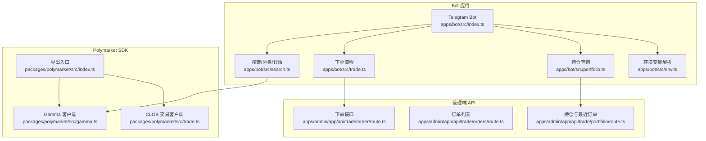
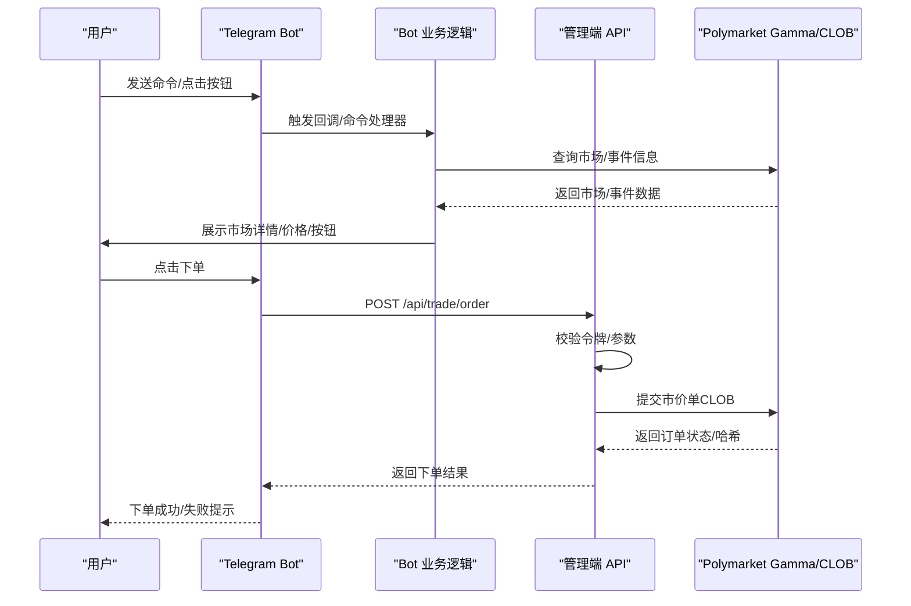
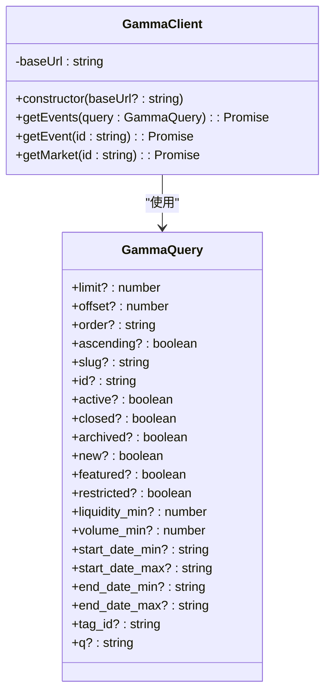
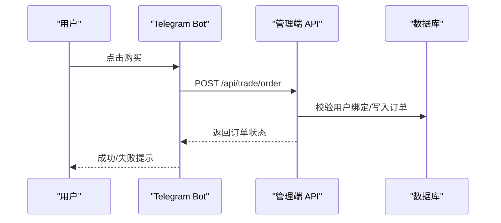
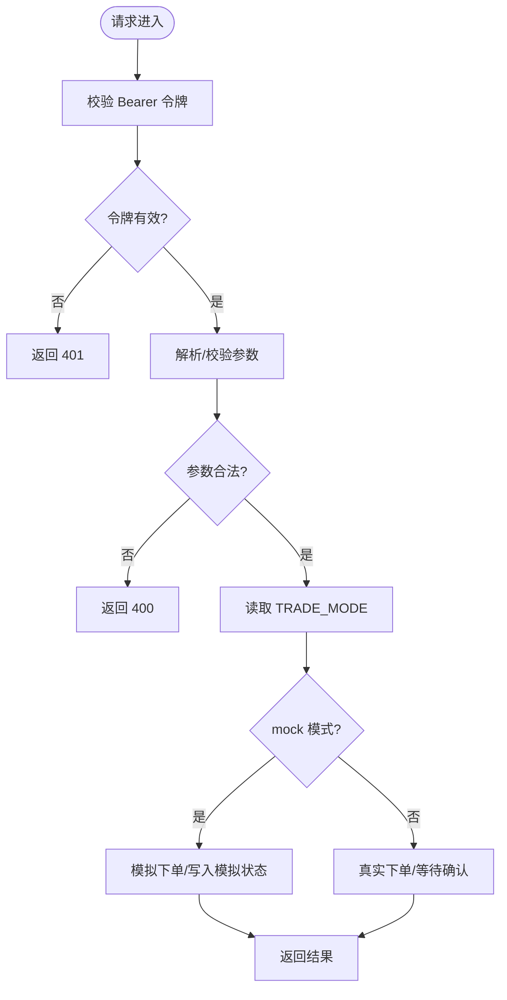
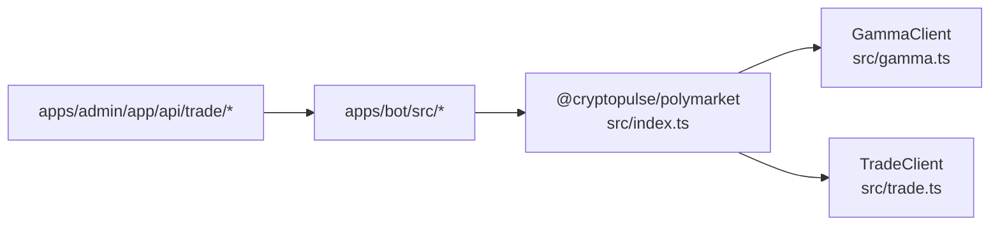

# API 客户端集成

<cite>
**本文引用的文件**
- [README.md](file://README.md)
- [.env.example](file://.env.example)
- [packages/polymarket/package.json](file://packages/polymarket/package.json)
- [packages/polymarket/src/index.ts](file://packages/polymarket/src/index.ts)
- [packages/polymarket/src/gamma.ts](file://packages/polymarket/src/gamma.ts)
- [packages/polymarket/src/trade.ts](file://packages/polymarket/src/trade.ts)
- [apps/bot/src/index.ts](file://apps/bot/src/index.ts)
- [apps/bot/src/env.ts](file://apps/bot/src/env.ts)
- [apps/bot/src/search.ts](file://apps/bot/src/search.ts)
- [apps/bot/src/trade.ts](file://apps/bot/src/trade.ts)
- [apps/bot/src/portfolio.ts](file://apps/bot/src/portfolio.ts)
- [apps/admin/app/api/trade/order/route.ts](file://apps/admin/app/api/trade/order/route.ts)
- [apps/admin/app/api/trade/orders/route.ts](file://apps/admin/app/api/trade/orders/route.ts)
- [apps/admin/app/api/trade/portfolio/route.ts](file://apps/admin/app/api/trade/portfolio/route.ts)
</cite>

## 目录
1. [简介](#简介)
2. [项目结构](#项目结构)
3. [核心组件](#核心组件)
4. [架构总览](#架构总览)
5. [详细组件分析](#详细组件分析)
6. [依赖关系分析](#依赖关系分析)
7. [性能考虑](#性能考虑)
8. [故障排查指南](#故障排查指南)
9. [结论](#结论)
10. [附录](#附录)

## 简介
本文件面向希望在 CryptoPulse 项目中集成 Polymarket API 的开发者，系统化介绍 Polymarket CLOB 客户端的使用方法与最佳实践。内容覆盖：
- 初始化与配置（网络、链上环境、签名私钥）
- 连接建立与客户端实例管理
- API 方法调用（市场查询、订单提交、账户信息与交易历史）
- 配置项（网络、超时、重连等）
- 异步与并发控制策略
- 错误处理与排障建议

## 项目结构
该项目采用多包工作区结构，Polymarket 相关能力集中在 @cryptopulse/polymarket 包中，并通过 Telegram Bot 与 Next.js 管理端进行业务编排。



图表来源
- [apps/bot/src/index.ts](file://apps/bot/src/index.ts#L1-L156)
- [apps/bot/src/search.ts](file://apps/bot/src/search.ts#L1-L233)
- [apps/bot/src/trade.ts](file://apps/bot/src/trade.ts#L1-L118)
- [apps/bot/src/portfolio.ts](file://apps/bot/src/portfolio.ts#L1-L76)
- [apps/bot/src/env.ts](file://apps/bot/src/env.ts#L1-L14)
- [packages/polymarket/src/index.ts](file://packages/polymarket/src/index.ts#L1-L11)
- [packages/polymarket/src/gamma.ts](file://packages/polymarket/src/gamma.ts#L1-L177)
- [packages/polymarket/src/trade.ts](file://packages/polymarket/src/trade.ts#L1-L29)
- [apps/admin/app/api/trade/order/route.ts](file://apps/admin/app/api/trade/order/route.ts#L1-L94)
- [apps/admin/app/api/trade/orders/route.ts](file://apps/admin/app/api/trade/orders/route.ts#L1-L74)
- [apps/admin/app/api/trade/portfolio/route.ts](file://apps/admin/app/api/trade/portfolio/route.ts#L1-L80)

章节来源
- [README.md](file://README.md#L1-L65)
- [packages/polymarket/package.json](file://packages/polymarket/package.json#L1-L23)

## 核心组件
- GammaClient：用于查询 Polymarket 的事件与市场数据，支持分页与筛选。
- TradeClient：基于 @polymarket/clob-client 封装，负责派生 API Key 与提交市价单。
- Bot 侧集成：通过 Telegram Bot 触发查询与下单，管理用户会话与消息交互。
- 管理端 API：提供受控的下单、订单查询与持仓视图，供 Bot 侧调用。

章节来源
- [packages/polymarket/src/gamma.ts](file://packages/polymarket/src/gamma.ts#L116-L177)
- [packages/polymarket/src/trade.ts](file://packages/polymarket/src/trade.ts#L5-L29)
- [apps/bot/src/search.ts](file://apps/bot/src/search.ts#L1-L233)
- [apps/bot/src/trade.ts](file://apps/bot/src/trade.ts#L1-L118)
- [apps/admin/app/api/trade/order/route.ts](file://apps/admin/app/api/trade/order/route.ts#L1-L94)

## 架构总览
下图展示了从 Telegram Bot 到 Polymarket API 的完整调用链路与数据流：



图表来源
- [apps/bot/src/index.ts](file://apps/bot/src/index.ts#L1-L156)
- [apps/bot/src/search.ts](file://apps/bot/src/search.ts#L1-L233)
- [apps/bot/src/trade.ts](file://apps/bot/src/trade.ts#L1-L118)
- [apps/admin/app/api/trade/order/route.ts](file://apps/admin/app/api/trade/order/route.ts#L1-L94)
- [packages/polymarket/src/gamma.ts](file://packages/polymarket/src/gamma.ts#L116-L177)
- [packages/polymarket/src/trade.ts](file://packages/polymarket/src/trade.ts#L5-L29)

## 详细组件分析

### GammaClient（市场与事件查询）
- 功能概述
  - 支持按条件查询事件列表（分页、排序、标签过滤）。
  - 支持按 ID 查询事件与市场详情。
  - 默认基础地址为 https://gamma-api.polymarket.com。
- 关键方法
  - getEvents(query: GammaQuery): Promise<GammaEvent[]>
  - getEvent(id: string): Promise<GammaEvent | null>
  - getMarket(id: string): Promise<GammaMarket | null>
- 参数与行为
  - 未显式传入 limit/active/closed/archived 时，使用默认值。
  - 对 404 响应返回空值，便于上层判断资源是否存在。
- 错误处理
  - 非 2xx 响应抛出错误，便于上层统一捕获。
- 性能与并发
  - 建议对频繁查询进行缓存与去抖，避免重复请求。
  - 并发请求时注意限速与重试策略。



图表来源
- [packages/polymarket/src/gamma.ts](file://packages/polymarket/src/gamma.ts#L93-L114)
- [packages/polymarket/src/gamma.ts](file://packages/polymarket/src/gamma.ts#L116-L177)

章节来源
- [packages/polymarket/src/gamma.ts](file://packages/polymarket/src/gamma.ts#L116-L177)

### TradeClient（CLOB 交易）
- 功能概述
  - 基于私钥初始化签名器，封装 ClobClient。
  - 提供派生 API Key 与提交市价单的能力。
- 关键方法
  - deriveApiKey(): Promise<string>
  - createAndPostMarketOrder(args): Promise<any>
- 参数与行为
  - tokenID：标的 ID。
  - side：BUY 或 SELL。
  - amount：数量（USDC）。
  - price：可选，市价单通常省略。
  - OrderType：使用 FOK（Fill or Kill）以确保立即成交。
- 错误处理
  - 依赖底层 CLOB 客户端抛错，建议外层捕获并回退或重试。

```mermaid
classDiagram
class TradeClient {
-clob : ClobClient
+constructor(args : {privateKey, clobHost?, chainId?})
+deriveApiKey() : Promise<string>
+createAndPostMarketOrder(args) : Promise<any>
}
class UserMarketOrder {
+tokenID : string
+side : "BUY"|"SELL"
+amount : number
+price? : number
}
TradeClient --> UserMarketOrder : "构造并提交"
```

图表来源
- [packages/polymarket/src/trade.ts](file://packages/polymarket/src/trade.ts#L5-L29)

章节来源
- [packages/polymarket/src/trade.ts](file://packages/polymarket/src/trade.ts#L5-L29)

### Bot 侧集成（查询与下单）
- 查询市场与事件
  - 通过 GammaClient 获取事件列表、分类、详情与价格。
  - 在 Telegram 中以内联键盘展示市场与购买按钮。
- 下单流程
  - 用户点击购买后，Bot 侧组装参数并调用管理端 /api/trade/order 接口。
  - 管理端校验令牌与参数后，返回模拟或真实下单状态。
- 持仓查询
  - 调用 /api/trade/portfolio 接口，聚合用户持仓与最近订单。



图表来源
- [apps/bot/src/trade.ts](file://apps/bot/src/trade.ts#L68-L118)
- [apps/admin/app/api/trade/order/route.ts](file://apps/admin/app/api/trade/order/route.ts#L16-L93)

章节来源
- [apps/bot/src/search.ts](file://apps/bot/src/search.ts#L1-L233)
- [apps/bot/src/trade.ts](file://apps/bot/src/trade.ts#L1-L118)
- [apps/bot/src/portfolio.ts](file://apps/bot/src/portfolio.ts#L1-L76)

### 管理端 API（下单/订单/持仓）
- /api/trade/order
  - 方法：POST
  - 认证：Bearer 令牌校验
  - 请求体字段：telegramId, marketId, outcomeIndex, amount, side
  - 行为：根据 TRADE_MODE 决定模拟或真实下单，写入数据库并返回状态
- /api/trade/orders
  - 方法：GET
  - 查询参数：telegramId, limit（1~100，默认20）
  - 行为：返回用户订单列表
- /api/trade/portfolio
  - 方法：GET
  - 查询参数：telegramId
  - 行为：聚合持仓与最近订单，返回 positions 与 recentOrders



图表来源
- [apps/admin/app/api/trade/order/route.ts](file://apps/admin/app/api/trade/order/route.ts#L16-L93)

章节来源
- [apps/admin/app/api/trade/order/route.ts](file://apps/admin/app/api/trade/order/route.ts#L1-L94)
- [apps/admin/app/api/trade/orders/route.ts](file://apps/admin/app/api/trade/orders/route.ts#L1-L74)
- [apps/admin/app/api/trade/portfolio/route.ts](file://apps/admin/app/api/trade/portfolio/route.ts#L1-L80)

## 依赖关系分析
- @cryptopulse/polymarket
  - 依赖 @polymarket/clob-client、@polymarket/builder-relayer-client、@polymarket/builder-signing-sdk、@ethersproject/wallet、viem。
  - 导出 GammaClient 与 TradeClient，并提供 PolymarketEnv 类型。
- apps/bot
  - 依赖 @cryptopulse/polymarket，调用 GammaClient 查询市场，调用管理端 API 提交订单。
- apps/admin
  - 提供受控的下单、订单与持仓接口，Bot 侧通过 Bearer 令牌访问。



图表来源
- [packages/polymarket/src/index.ts](file://packages/polymarket/src/index.ts#L1-L11)
- [packages/polymarket/src/gamma.ts](file://packages/polymarket/src/gamma.ts#L116-L177)
- [packages/polymarket/src/trade.ts](file://packages/polymarket/src/trade.ts#L5-L29)
- [apps/bot/src/index.ts](file://apps/bot/src/index.ts#L1-L156)

章节来源
- [packages/polymarket/package.json](file://packages/polymarket/package.json#L11-L17)
- [packages/polymarket/src/index.ts](file://packages/polymarket/src/index.ts#L1-L11)

## 性能考虑
- 缓存策略
  - 对 GammaClient 的 getEvents/getEvent/getMarket 结果进行短期缓存，减少重复请求。
- 并发控制
  - Bot 侧批量查询/下单时，使用队列或信号量限制并发数，避免触发上游限流。
- 超时与重试
  - 为 fetch 请求设置合理超时（如 10~30 秒），对非幂等下单操作仅在必要时重试。
- 数据聚合
  - 管理端聚合持仓与最近订单时，优先使用数据库索引与 LIMIT，避免全表扫描。

## 故障排查指南
- 常见错误与定位
  - 401 未授权：检查 BOT_API_TOKEN 是否正确配置与传递。
  - 400 参数错误：核对请求体字段类型与范围（如 amount 必须为正数）。
  - 503 数据库不可用：确认 DATABASE_URL 与服务可达性。
  - Gamma API 错误：关注 getEvents/getEvent/getMarket 的异常日志。
- 日志与可观测性
  - Bot 侧与管理端均输出错误日志，便于定位问题。
- 环境变量
  - 确认 .env.example 中的关键变量均已正确设置，尤其是 Polymarket 相关的链 ID、CLOB 主机、WS 地址、Relayer 地址与 RPC 地址。

章节来源
- [apps/admin/app/api/trade/order/route.ts](file://apps/admin/app/api/trade/order/route.ts#L16-L93)
- [apps/admin/app/api/trade/orders/route.ts](file://apps/admin/app/api/trade/orders/route.ts#L18-L71)
- [apps/admin/app/api/trade/portfolio/route.ts](file://apps/admin/app/api/trade/portfolio/route.ts#L17-L77)
- [.env.example](file://.env.example#L18-L28)

## 结论
本项目通过 @cryptopulse/polymarket 提供的 GammaClient 与 TradeClient，结合 Bot 与管理端 API，实现了从市场查询到订单提交的完整闭环。建议在生产环境中强化缓存、并发控制与错误重试策略，并严格管理环境变量与令牌，确保系统的稳定性与安全性。

## 附录

### 配置项与环境变量
- Polymarket 网络与链上
  - POLYMARKET_CHAIN_ID：链 ID（默认 Polygon 主网）
  - POLYMARKET_CLOB_HOST：CLOB 主机地址
  - POLYMARKET_WS_URL：WebSocket 订阅地址
  - POLYMARKET_RELAYER_URL：Relayer 地址
  - POLYMARKET_RPC_URL：RPC 地址（可选）
- Bot 与管理端
  - TELEGRAM_BOT_TOKEN：Telegram Bot 令牌
  - BOT_API_TOKEN：Bot 侧调用管理端 API 的认证令牌
  - API_BASE_URL/WEB_BASE_URL：管理端与前端地址
  - DATABASE_URL/REDIS_URL：数据库与缓存
  - ADMIN_TOKEN：管理端访问令牌（可选）

章节来源
- [.env.example](file://.env.example#L1-L43)

### API 方法参考（Bot 侧调用）
- 查询市场/事件
  - 用途：搜索关键词、查看分类、查看详情
  - 实现：GammaClient.getEvents/GammaClient.getEvent/GammaClient.getMarket
  - 典型调用：apps/bot/src/search.ts
- 下单
  - 用途：提交市价单
  - 实现：Bot 侧调用 /api/trade/order，内部由管理端对接 CLOB
  - 典型调用：apps/bot/src/trade.ts
- 持仓与订单
  - 用途：查询持仓与最近订单
  - 实现：Bot 侧调用 /api/trade/portfolio 与 /api/trade/orders
  - 典型调用：apps/bot/src/portfolio.ts

章节来源
- [apps/bot/src/search.ts](file://apps/bot/src/search.ts#L27-L111)
- [apps/bot/src/trade.ts](file://apps/bot/src/trade.ts#L68-L118)
- [apps/bot/src/portfolio.ts](file://apps/bot/src/portfolio.ts#L14-L73)

### 最佳实践
- 初始化与客户端管理
  - 在应用启动时加载环境变量，按需创建 GammaClient/TradeClient 实例。
  - 对私钥与敏感配置使用安全存储与只读权限。
- 异步与并发
  - 对外部 API 调用使用超时与指数退避重试。
  - 对高频查询使用内存缓存与 TTL 控制。
- 错误处理
  - 明确区分网络错误、参数错误与业务错误，分别返回不同状态码。
  - 对用户可见的错误信息进行友好化处理，避免泄露内部细节。