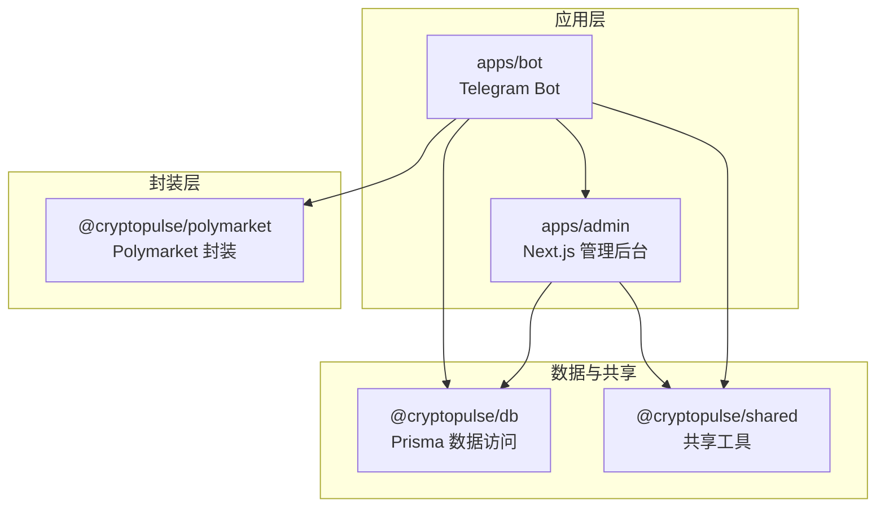
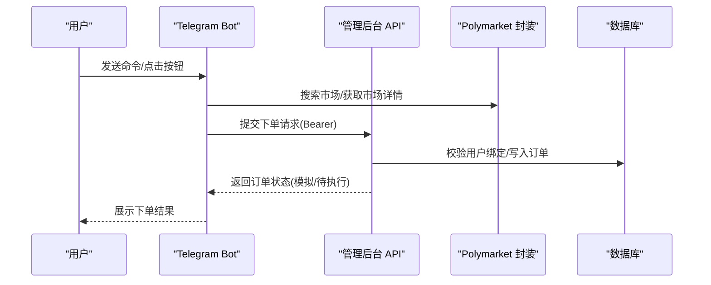
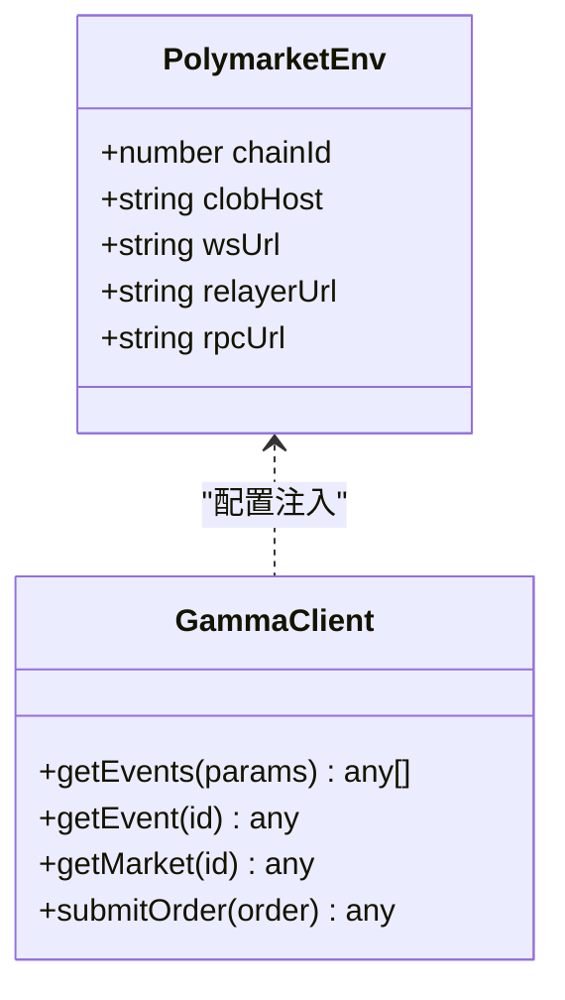
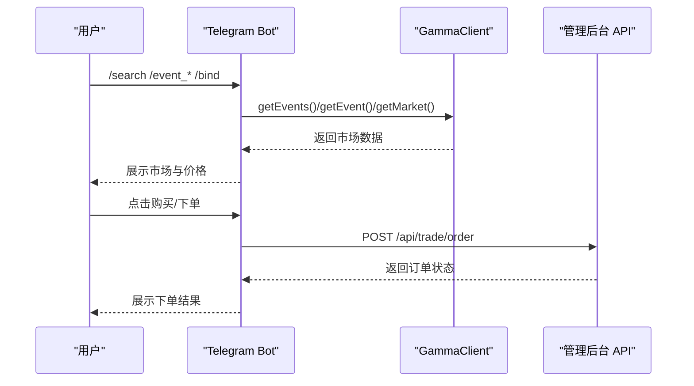
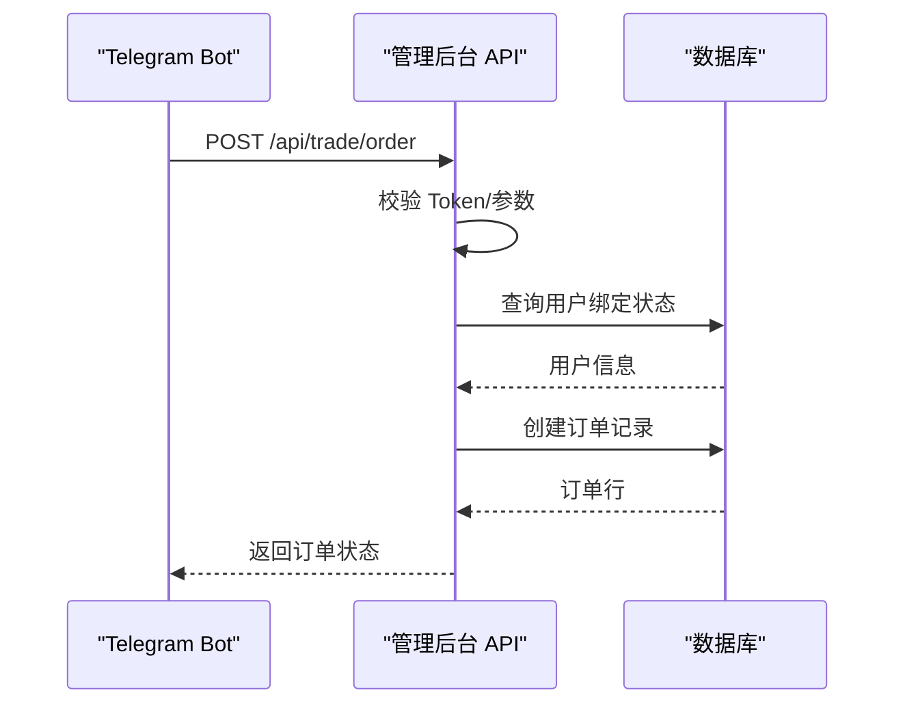
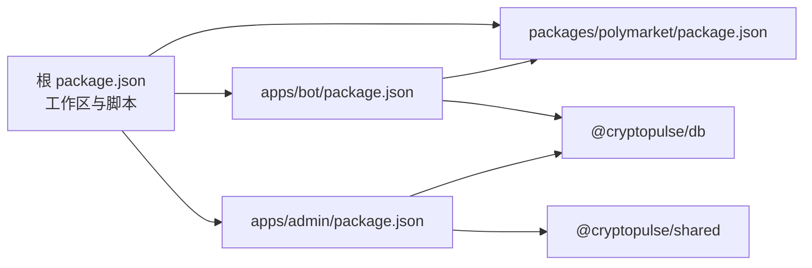

# Polymarket 协议集成

<cite>
**本文引用的文件**
- [README.md](file://README.md)
- [package.json](file://package.json)
- [apps/admin/package.json](file://apps/admin/package.json)
- [apps/bot/package.json](file://apps/bot/package.json)
- [packages/polymarket/package.json](file://packages/polymarket/package.json)
- [packages/polymarket/src/index.ts](file://packages/polymarket/src/index.ts)
- [apps/bot/src/index.ts](file://apps/bot/src/index.ts)
- [apps/bot/src/env.ts](file://apps/bot/src/env.ts)
- [apps/bot/src/search.ts](file://apps/bot/src/search.ts)
- [apps/bot/src/trade.ts](file://apps/bot/src/trade.ts)
- [apps/bot/src/bind.ts](file://apps/bot/src/bind.ts)
- [apps/bot/src/portfolio.ts](file://apps/bot/src/portfolio.ts)
- [apps/admin/app/api/trade/order/route.ts](file://apps/admin/app/api/trade/order/route.ts)
- [apps/admin/app/api/trade/orders/route.ts](file://apps/admin/app/api/trade/orders/route.ts)
</cite>

## 目录
1. [简介](#简介)
2. [项目结构](#项目结构)
3. [核心组件](#核心组件)
4. [架构总览](#架构总览)
5. [详细组件分析](#详细组件分析)
6. [依赖关系分析](#依赖关系分析)
7. [性能考量](#性能考量)
8. [故障排查指南](#故障排查指南)
9. [结论](#结论)
10. [附录](#附录)

## 简介
本文件面向希望集成 Polymarket 协议的开发者，系统化说明预测市场机制、流动性提供与价格发现流程，以及在本仓库中的技术实现路径。内容覆盖：
- 协议工作原理与核心概念
- 与 Polymarket 的交互封装（GammaClient）
- 与以太坊网络的交互方式（RPC、交易签名、Relayer）
- Relayer 机制的作用与实现要点
- 配置参数、网络选择与节点配置
- 错误处理、重试与异常恢复
- 安全考虑、密钥管理与交易保护
- 集成示例与最佳实践

## 项目结构
本仓库采用多包工作区（monorepo）组织，核心模块如下：
- apps/bot：Telegram 机器人前端交互层，负责用户命令解析、市场搜索、下单与持仓查询
- apps/admin：Next.js 管理后台，提供订单与持仓的 API 接口
- packages/polymarket：对 Polymarket 生态的封装（GammaClient、交易与定价相关能力）
- packages/db：数据库访问（Prisma）
- packages/shared：共享工具与类型定义

图表来源
- [apps/bot/src/index.ts](file://apps/bot/src/index.ts#L1-L156)
- [apps/admin/app/api/trade/order/route.ts](file://apps/admin/app/api/trade/order/route.ts#L1-L94)
- [packages/polymarket/src/index.ts](file://packages/polymarket/src/index.ts#L1-L11)

章节来源
- [README.md](file://README.md#L1-L65)
- [package.json](file://package.json#L1-L18)
- [apps/admin/package.json](file://apps/admin/package.json#L1-L42)
- [apps/bot/package.json](file://apps/bot/package.json#L1-L26)
- [packages/polymarket/package.json](file://packages/polymarket/package.json#L1-L23)

## 核心组件
- Polymarket 封装（packages/polymarket）：导出 GammaClient 与交易相关类型，提供链上环境配置接口（PolymarketEnv），用于指定 chainId、clobHost、wsUrl、relayerUrl、rpcUrl 等。
- 机器人（apps/bot）：通过 Telegram 与用户交互，调用 Polymarket 封装进行市场检索与下单，同时通过管理后台 API 查询持仓与历史订单。
- 管理后台（apps/admin）：提供受令牌保护的 REST API，用于创建订单、查询订单列表与用户持仓。

章节来源
- [packages/polymarket/src/index.ts](file://packages/polymarket/src/index.ts#L1-L11)
- [apps/bot/src/index.ts](file://apps/bot/src/index.ts#L1-L156)
- [apps/admin/app/api/trade/order/route.ts](file://apps/admin/app/api/trade/order/route.ts#L1-L94)
- [apps/admin/app/api/trade/orders/route.ts](file://apps/admin/app/api/trade/orders/route.ts#L1-L74)

## 架构总览
整体交互流程分为三层：
- 用户交互层：Telegram Bot 提供命令与内联键盘操作
- 业务服务层：管理后台 API 处理订单与持仓请求
- 协议封装层：Polymarket 封装对接 Polymarket 生态（Gamma、CLOB、Relayer）

图表来源
- [apps/bot/src/search.ts](file://apps/bot/src/search.ts#L1-L233)
- [apps/bot/src/trade.ts](file://apps/bot/src/trade.ts#L1-L118)
- [apps/admin/app/api/trade/order/route.ts](file://apps/admin/app/api/trade/order/route.ts#L1-L94)

## 详细组件分析

### Polymarket 封装（GammaClient 与环境配置）
- 功能职责
  - 对外暴露 PolymarketEnv 类型，用于统一配置链上环境参数（chainId、clobHost、wsUrl、relayerUrl、rpcUrl）
  - 作为上层调用入口，承载市场检索、订单提交等逻辑（由具体实现文件提供）
- 设计要点
  - 通过环境配置隔离不同网络（主网/测试网）
  - 为 Relayer 与 CLOB 交互提供统一入口

图表来源
- [packages/polymarket/src/index.ts](file://packages/polymarket/src/index.ts#L1-L11)

章节来源
- [packages/polymarket/src/index.ts](file://packages/polymarket/src/index.ts#L1-L11)

### 机器人（Telegram Bot）与市场交互
- 命令与回调处理
  - /start：展示菜单与分类按钮
  - /search：关键词搜索市场
  - 回调：分类浏览、分页、购买确认、下单
- 关键流程
  - 搜索与分类：调用 GammaClient 获取事件与市场列表，格式化为富文本与内联键盘
  - 购买确认：根据所选市场与选项，弹出金额选择并发起下单请求
  - 持仓查询：调用管理后台 API 获取用户仓位与最近订单

图表来源
- [apps/bot/src/index.ts](file://apps/bot/src/index.ts#L1-L156)
- [apps/bot/src/search.ts](file://apps/bot/src/search.ts#L1-L233)
- [apps/bot/src/trade.ts](file://apps/bot/src/trade.ts#L1-L118)

章节来源
- [apps/bot/src/index.ts](file://apps/bot/src/index.ts#L1-L156)
- [apps/bot/src/search.ts](file://apps/bot/src/search.ts#L1-L233)
- [apps/bot/src/trade.ts](file://apps/bot/src/trade.ts#L1-L118)

### 管理后台 API（订单与持仓）
- /api/trade/order（POST）
  - 校验 Bearer Token
  - 参数校验（telegramId、marketId、outcomeIndex、amount、side）
  - 读取数据库校验用户绑定状态
  - 写入订单记录，根据 TRADE_MODE 返回模拟成交或待执行状态
- /api/trade/orders（GET）
  - 校验 Bearer Token
  - 查询用户最近订单列表

图表来源
- [apps/admin/app/api/trade/order/route.ts](file://apps/admin/app/api/trade/order/route.ts#L1-L94)
- [apps/admin/app/api/trade/orders/route.ts](file://apps/admin/app/api/trade/orders/route.ts#L1-L74)

章节来源
- [apps/admin/app/api/trade/order/route.ts](file://apps/admin/app/api/trade/order/route.ts#L1-L94)
- [apps/admin/app/api/trade/orders/route.ts](file://apps/admin/app/api/trade/orders/route.ts#L1-L74)

### 与以太坊网络的交互（RPC、Relayer、签名）
- 网络与节点配置
  - 通过 PolymarketEnv 中的 rpcUrl、clobHost、wsUrl、relayerUrl 指定网络与服务端点
- 交易签名与 Relayer
  - 通过 @polymarket/builder-signing-sdk 与 @polymarket/builder-relayer-client 实现签名与中继
  - 交易提交后由 Relayer 广播至链上，等待区块确认
- 价格发现与流动性
  - 市场价格由订单簿与流动性池共同决定
  - GammaClient 提供市场与价格数据，便于前端展示与决策

章节来源
- [packages/polymarket/package.json](file://packages/polymarket/package.json#L11-L16)
- [packages/polymarket/src/index.ts](file://packages/polymarket/src/index.ts#L3-L9)

### 绑定流程与安全令牌
- 绑定码生成
  - 机器人通过管理后台 API 申请绑定码，携带 Bearer Token
  - 绑定码带过期时间，生成后引导用户在网页完成绑定
- 安全令牌
  - 管理后台 API 与机器人均依赖 BOT_API_TOKEN 进行鉴权
  - 未配置令牌时，相关功能受限或返回未授权

章节来源
- [apps/bot/src/bind.ts](file://apps/bot/src/bind.ts#L1-L39)
- [apps/admin/app/api/trade/order/route.ts](file://apps/admin/app/api/trade/order/route.ts#L17-L23)
- [apps/bot/src/portfolio.ts](file://apps/bot/src/portfolio.ts#L9-L12)

## 依赖关系分析
- 工作区与脚本
  - 顶层 package.json 定义工作区与常用脚本（启动管理后台、启动机器人、类型检查、测试）
- 包依赖
  - apps/bot 依赖 @cryptopulse/polymarket 与 @cryptopulse/db，用于与 Polymarket 生态与数据库交互
  - apps/admin 依赖 @cryptopulse/db 与 @cryptopulse/shared，提供订单与持仓 API
  - packages/polymarket 依赖 @polymarket/* SDK 与 viem，封装链上交互

图表来源
- [package.json](file://package.json#L1-L18)
- [apps/bot/package.json](file://apps/bot/package.json#L12-L18)
- [apps/admin/package.json](file://apps/admin/package.json#L13-L24)
- [packages/polymarket/package.json](file://packages/polymarket/package.json#L11-L16)

章节来源
- [package.json](file://package.json#L1-L18)
- [apps/bot/package.json](file://apps/bot/package.json#L1-L26)
- [apps/admin/package.json](file://apps/admin/package.json#L1-L42)
- [packages/polymarket/package.json](file://packages/polymarket/package.json#L1-L23)

## 性能考量
- 缓存与分页
  - 市场搜索与分类默认每页 5 条，避免一次性加载过多数据
- 异步与并发
  - 机器人与管理后台 API 均为无状态服务，建议结合外部缓存（如 Redis）存储绑定码与短期会话
- 数据库负载
  - 订单写入与查询应配合索引优化，限制查询条数上限（如 GET /orders 默认 20，最大 100）

## 故障排查指南
- 认证失败
  - 确认 BOT_API_TOKEN 是否正确配置，请求头是否包含 Bearer Token
- 数据库不可用
  - 确认 DATABASE_URL，Prisma 初始化与迁移是否完成
- 绑定码失效
  - 绑定码带过期时间，重新申请并尽快完成绑定
- 订单状态异常
  - 检查 TRADE_MODE（mock 或真实模式），确认数据库订单状态与管理后台返回一致

章节来源
- [apps/admin/app/api/trade/order/route.ts](file://apps/admin/app/api/trade/order/route.ts#L17-L23)
- [apps/admin/app/api/trade/order/route.ts](file://apps/admin/app/api/trade/order/route.ts#L39-L48)
- [apps/bot/src/bind.ts](file://apps/bot/src/bind.ts#L22-L29)
- [apps/admin/app/api/trade/orders/route.ts](file://apps/admin/app/api/trade/orders/route.ts#L18-L23)

## 结论
本项目通过清晰的分层设计，将用户交互、业务服务与协议封装解耦，既满足快速迭代的开发需求，也为后续接入真实链上交易与 Relayer 提供了扩展空间。建议在生产环境中完善监控、重试与告警机制，并强化密钥与令牌的安全管理。

## 附录

### 环境变量与配置
- 机器人侧
  - TELEGRAM_BOT_TOKEN：Telegram 机器人令牌
  - API_BASE_URL：管理后台基础地址
  - WEB_BASE_URL：绑定页面域名
  - BOT_API_TOKEN：管理后台 API 鉴权令牌
  - DATABASE_URL/REDIS_URL：可选，用于数据库与缓存
- 管理后台侧
  - BOT_API_TOKEN：API 鉴权令牌
  - DATABASE_URL：PostgreSQL 连接串
  - TRADE_MODE：订单执行模式（mock/真实）

章节来源
- [apps/bot/src/env.ts](file://apps/bot/src/env.ts#L1-L14)
- [apps/admin/app/api/trade/order/route.ts](file://apps/admin/app/api/trade/order/route.ts#L61-L72)

### 集成步骤与最佳实践
- 快速集成
  - 配置环境变量与数据库
  - 启动管理后台与机器人
  - 通过 /bind 生成绑定码，完成用户绑定
  - 使用 /search 或分类浏览市场，点击购买下单
- 最佳实践
  - 使用 Bearer Token 严格鉴权
  - 控制分页与查询范围，避免超大响应
  - 对外暴露的 API 增加速率限制与熔断
  - 对关键路径增加重试与幂等设计