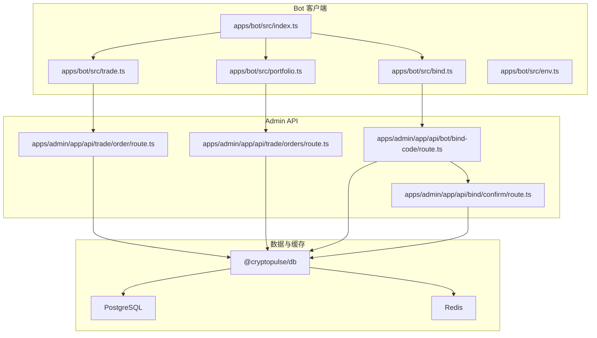
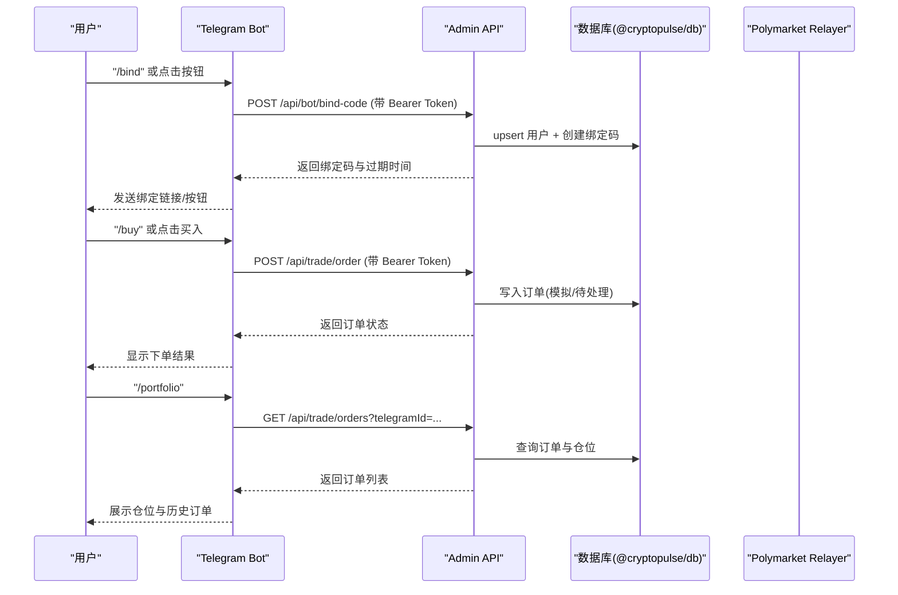
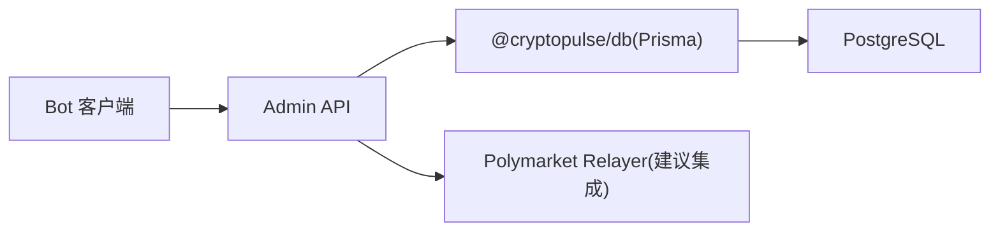
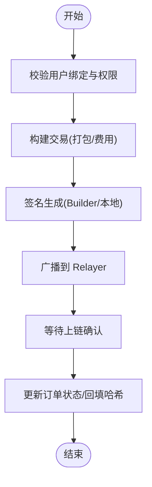

# Relayer 中继机制

<cite>
**本文引用的文件**
- [README.md](file://README.md)
- [docker-compose.yml](file://docker-compose.yml)
- [.env.example](file://.env.example)
- [apps/admin/app/api/bot/bind-code/route.ts](file://apps/admin/app/api/bot/bind-code/route.ts)
- [apps/admin/app/api/bind/confirm/route.ts](file://apps/admin/app/api/bind/confirm/route.ts)
- [apps/admin/app/api/trade/order/route.ts](file://apps/admin/app/api/trade/order/route.ts)
- [apps/admin/app/api/trade/orders/route.ts](file://apps/admin/app/api/trade/orders/route.ts)
- [apps/bot/src/index.ts](file://apps/bot/src/index.ts)
- [apps/bot/src/env.ts](file://apps/bot/src/env.ts)
- [apps/bot/src/bind.ts](file://apps/bot/src/bind.ts)
- [apps/bot/src/trade.ts](file://apps/bot/src/trade.ts)
- [apps/bot/src/portfolio.ts](file://apps/bot/src/portfolio.ts)
- [packages/db/package.json](file://packages/db/package.json)
</cite>

## 目录
1. [简介](#简介)
2. [项目结构](#项目结构)
3. [核心组件](#核心组件)
4. [架构总览](#架构总览)
5. [详细组件分析](#详细组件分析)
6. [依赖关系分析](#依赖关系分析)
7. [性能考量](#性能考量)
8. [故障排查指南](#故障排查指南)
9. [结论](#结论)
10. [附录](#附录)

## 简介
本文件面向 Polymarket Relayer 中继机制的技术文档，聚焦于以下目标：
- 解释 Relayer 的作用与重要性：交易中继、签名验证、费用支付
- 阐述 Relayer 客户端实现原理：交易打包、签名生成、广播机制
- 描述 Relayer 的配置与部署：节点选择、费用设置、负载均衡策略
- 解释 Relayer 的安全机制：密钥管理、访问控制、防重放攻击
- 提供 Relayer 的监控与维护指南：健康检查、日志分析、故障恢复
- 给出 Relayer 的性能优化建议与扩展性考虑
- 展示 Relayer 集成的实际代码示例路径与常见问题解决方案

说明：当前仓库中未发现直接实现 Polymarket Relayer 的服务端代码。本文基于现有 Bot 与 Admin API 的交互链路，结合环境变量中的 Relayer 相关参数，给出 Relayer 在该系统中的角色定位、客户端侧实现思路与运维建议。

## 项目结构
该项目采用多包工作区结构，包含：
- apps/bot：Telegram Bot 客户端，负责用户交互与调用后端 API
- apps/admin：Next.js 应用，提供管理员界面与后端 API（绑定、下单、查询）
- packages/db：数据库与 Prisma 客户端封装
- docker-compose.yml：PostgreSQL 与 Redis 的本地开发环境编排
- .env.example：系统运行所需的关键环境变量（含 POLYMARKET_RELAYER_URL 等）

图表来源
- [apps/bot/src/index.ts](file://apps/bot/src/index.ts#L1-L156)
- [apps/bot/src/trade.ts](file://apps/bot/src/trade.ts#L1-L118)
- [apps/bot/src/portfolio.ts](file://apps/bot/src/portfolio.ts#L1-L76)
- [apps/bot/src/bind.ts](file://apps/bot/src/bind.ts#L1-L39)
- [apps/bot/src/env.ts](file://apps/bot/src/env.ts#L1-L14)
- [apps/admin/app/api/trade/order/route.ts](file://apps/admin/app/api/trade/order/route.ts#L1-L94)
- [apps/admin/app/api/trade/orders/route.ts](file://apps/admin/app/api/trade/orders/route.ts#L1-L74)
- [apps/admin/app/api/bot/bind-code/route.ts](file://apps/admin/app/api/bot/bind-code/route.ts#L1-L105)
- [apps/admin/app/api/bind/confirm/route.ts](file://apps/admin/app/api/bind/confirm/route.ts#L1-L91)
- [packages/db/package.json](file://packages/db/package.json#L1-L22)

章节来源
- [README.md](file://README.md#L1-L65)
- [docker-compose.yml](file://docker-compose.yml#L1-L24)
- [.env.example](file://.env.example#L1-L43)

## 核心组件
- Bot 客户端（Telegram）：处理用户命令、回调与消息，负责引导用户完成绑定、下单与查询
- Admin API：提供绑定码生成、绑定确认、下单、订单查询等接口，内部通过 Prisma 访问数据库
- 数据层（@cryptopulse/db）：封装 Prisma 客户端，统一数据库访问
- 部署与运行时：PostgreSQL 存储用户与绑定码、Redis 缓存（如启用）、Docker Compose 编排

章节来源
- [apps/bot/src/index.ts](file://apps/bot/src/index.ts#L1-L156)
- [apps/bot/src/trade.ts](file://apps/bot/src/trade.ts#L1-L118)
- [apps/bot/src/portfolio.ts](file://apps/bot/src/portfolio.ts#L1-L76)
- [apps/admin/app/api/bot/bind-code/route.ts](file://apps/admin/app/api/bot/bind-code/route.ts#L1-L105)
- [apps/admin/app/api/bind/confirm/route.ts](file://apps/admin/app/api/bind/confirm/route.ts#L1-L91)
- [apps/admin/app/api/trade/order/route.ts](file://apps/admin/app/api/trade/order/route.ts#L1-L94)
- [apps/admin/app/api/trade/orders/route.ts](file://apps/admin/app/api/trade/orders/route.ts#L1-L74)
- [packages/db/package.json](file://packages/db/package.json#L1-L22)

## 架构总览
下图展示了从 Telegram Bot 到 Admin API、再到数据库的数据流与职责边界：

图表来源
- [apps/bot/src/index.ts](file://apps/bot/src/index.ts#L1-L156)
- [apps/bot/src/trade.ts](file://apps/bot/src/trade.ts#L1-L118)
- [apps/bot/src/portfolio.ts](file://apps/bot/src/portfolio.ts#L1-L76)
- [apps/admin/app/api/bot/bind-code/route.ts](file://apps/admin/app/api/bot/bind-code/route.ts#L1-L105)
- [apps/admin/app/api/bind/confirm/route.ts](file://apps/admin/app/api/bind/confirm/route.ts#L1-L91)
- [apps/admin/app/api/trade/order/route.ts](file://apps/admin/app/api/trade/order/route.ts#L1-L94)
- [apps/admin/app/api/trade/orders/route.ts](file://apps/admin/app/api/trade/orders/route.ts#L1-L74)
- [packages/db/package.json](file://packages/db/package.json#L1-L22)

## 详细组件分析

### Bot 客户端（Telegram）
- 功能要点
  - 命令与回调处理：启动、搜索、分类浏览、买入、订单、组合查询
  - 绑定流程：生成绑定码并通过 Bot 发送绑定链接
  - 交易流程：校验用户绑定状态后，调用 Admin API 提交订单
  - 组合查询：调用 Admin API 获取订单与仓位信息

- 关键实现路径
  - 入口与路由：[apps/bot/src/index.ts](file://apps/bot/src/index.ts#L1-L156)
  - 绑定码生成与过期格式化：[apps/bot/src/bind.ts](file://apps/bot/src/bind.ts#L1-L39)
  - 买入与下单调用：[apps/bot/src/trade.ts](file://apps/bot/src/trade.ts#L1-L118)
  - 组合查询与渲染：[apps/bot/src/portfolio.ts](file://apps/bot/src/portfolio.ts#L1-L76)
  - 环境变量解析：[apps/bot/src/env.ts](file://apps/bot/src/env.ts#L1-L14)

- Relayer 角色映射
  - 当前 Bot 仅通过 Admin API 间接与 Polymarket 生态交互，未直接调用 Relayer
  - 若需要 Relayer 参与，可在 Bot 调用 Admin API 的基础上，由 Admin API 将订单进一步转发至 Relayer 并完成签名与广播

章节来源
- [apps/bot/src/index.ts](file://apps/bot/src/index.ts#L1-L156)
- [apps/bot/src/bind.ts](file://apps/bot/src/bind.ts#L1-L39)
- [apps/bot/src/trade.ts](file://apps/bot/src/trade.ts#L1-L118)
- [apps/bot/src/portfolio.ts](file://apps/bot/src/portfolio.ts#L1-L76)
- [apps/bot/src/env.ts](file://apps/bot/src/env.ts#L1-L14)

### Admin API（绑定、下单、查询）
- 绑定码生成（/api/bot/bind-code）
  - 校验 Bearer Token（可选），确保仅受信客户端调用
  - upsert 用户记录，生成唯一绑定码并写入数据库，设置过期时间
  - 返回绑定码与过期时间，供 Bot 推送用户

- 绑定确认（/api/bind/confirm）
  - 校验绑定码存在性、未使用、未过期
  - 事务更新用户地址信息并标记绑定码已使用

- 下单（/api/trade/order）
  - 校验 Bearer Token，解析请求体，校验参数
  - 查询用户是否已绑定 Polymarket 地址
  - 根据 TRADE_MODE 写入模拟或待处理订单

- 订单查询（/api/trade/orders）
  - 校验 Bearer Token，解析查询参数
  - 查询用户历史订单并返回

- 关键实现路径
  - 绑定码生成：[apps/admin/app/api/bot/bind-code/route.ts](file://apps/admin/app/api/bot/bind-code/route.ts#L1-L105)
  - 绑定确认：[apps/admin/app/api/bind/confirm/route.ts](file://apps/admin/app/api/bind/confirm/route.ts#L1-L91)
  - 下单接口：[apps/admin/app/api/trade/order/route.ts](file://apps/admin/app/api/trade/order/route.ts#L1-L94)
  - 订单查询：[apps/admin/app/api/trade/orders/route.ts](file://apps/admin/app/api/trade/orders/route.ts#L1-L74)

- Relayer 角色映射
  - 当前实现为“模拟模式”，实际交易由 Admin API 直接落库
  - 若接入 Relayer，应在下单接口中增加对 Relayer 的调用，完成签名与广播，并回填交易哈希与成交均价

章节来源
- [apps/admin/app/api/bot/bind-code/route.ts](file://apps/admin/app/api/bot/bind-code/route.ts#L1-L105)
- [apps/admin/app/api/bind/confirm/route.ts](file://apps/admin/app/api/bind/confirm/route.ts#L1-L91)
- [apps/admin/app/api/trade/order/route.ts](file://apps/admin/app/api/trade/order/route.ts#L1-L94)
- [apps/admin/app/api/trade/orders/route.ts](file://apps/admin/app/api/trade/orders/route.ts#L1-L74)

### 数据层（@cryptopulse/db）
- 通过 Prisma 客户端访问 PostgreSQL，提供用户、绑定码、订单等实体的读写能力
- 与 Admin API 的路由配合，支撑绑定、下单、查询等业务逻辑

- 关键实现路径
  - 包配置与脚本：[packages/db/package.json](file://packages/db/package.json#L1-L22)

章节来源
- [packages/db/package.json](file://packages/db/package.json#L1-L22)

### 配置与部署
- 环境变量（.env.example）
  - 数据库与缓存：DATABASE_URL、REDIS_URL
  - Bot 与 Admin：TELEGRAM_BOT_TOKEN、BOT_API_TOKEN、API_BASE_URL、WEB_BASE_URL
  - Polymarket Relayer：POLYMARKET_RELAYER_URL、POLYMARKET_CLOB_HOST、POLYMARKET_RPC_URL、POLYMARKET_WS_URL
  - Builder 签名：POLY_BUILDER_API_KEY、POLY_BUILDER_SECRET、POLY_BUILDER_PASSPHRASE、SIGNING_TOKEN
  - 可观测性：SENTRY_DSN

- Docker Compose
  - 提供 PostgreSQL 与 Redis 的本地开发环境

- 关键实现路径
  - 环境变量样例：[.env.example](file://.env.example#L1-L43)
  - Docker 编排：[docker-compose.yml](file://docker-compose.yml#L1-L24)

章节来源
- [.env.example](file://.env.example#L1-L43)
- [docker-compose.yml](file://docker-compose.yml#L1-L24)

### 安全机制
- 访问控制
  - Admin API 对外接口均要求 Bearer Token 校验，避免未授权调用
  - 绑定码生成在生产环境可强制要求 Token 校验

- 防重放与时效
  - 绑定码生成时设置过期时间（默认 10 分钟），并在确认接口中校验过期与使用状态
  - 绑定码创建时进行唯一约束冲突重试，降低并发冲突概率

- 密钥管理
  - Builder 签名相关密钥与口令通过环境变量注入，避免硬编码
  - 建议使用密钥轮换与最小权限原则

- Relayer 安全建议
  - Relayer 侧应实施严格的签名验证与费用上限控制
  - 引入 nonce 与时间戳校验，防止重放攻击
  - 对外暴露的 RPC/WS 接口应限制来源 IP 与速率

章节来源
- [apps/admin/app/api/bot/bind-code/route.ts](file://apps/admin/app/api/bot/bind-code/route.ts#L1-L105)
- [apps/admin/app/api/bind/confirm/route.ts](file://apps/admin/app/api/bind/confirm/route.ts#L1-L91)
- [.env.example](file://.env.example#L1-L43)

### 监控与维护
- 健康检查
  - Admin API 可通过数据库连接状态返回 503，便于外部探针检测
  - Bot 侧可通过日志与错误回调收集异常

- 日志分析
  - Bot 错误回调与各 API 路由中的错误分支输出日志，便于定位问题
  - 建议引入结构化日志与统一采集（如 SENTRY_DSN）

- 故障恢复
  - 绑定码过期自动失效，避免长期占用资源
  - 事务写入绑定确认，保证一致性

章节来源
- [apps/bot/src/index.ts](file://apps/bot/src/index.ts#L150-L152)
- [apps/admin/app/api/bot/bind-code/route.ts](file://apps/admin/app/api/bot/bind-code/route.ts#L94-L102)
- [apps/admin/app/api/bind/confirm/route.ts](file://apps/admin/app/api/bind/confirm/route.ts#L86-L88)
- [.env.example](file://.env.example#L41-L43)

### 性能优化与扩展性
- 性能优化
  - 缓存热点数据：Redis 缓存绑定码与用户会话
  - 批量与异步：下单与查询可引入队列与异步处理
  - 数据库索引：为 telegramId、code、expiresAt 等字段建立索引

- 扩展性
  - 多 Relayer 节点：通过负载均衡器分发请求，实现高可用
  - 多链支持：根据 chainId 选择对应 Relayer 节点
  - 熔断与降级：在 Relayer 不可用时走本地模拟模式

章节来源
- [docker-compose.yml](file://docker-compose.yml#L1-L24)
- [.env.example](file://.env.example#L18-L28)

## 依赖关系分析
- Bot 与 Admin API：Bot 通过 API_BASE_URL 调用 Admin API，Admin API 通过 Prisma 访问数据库
- Admin API 与数据库：统一通过 @cryptopulse/db 提供的 Prisma 客户端访问 PostgreSQL
- Relayer 集成点：当前未在 Bot/Admin 中直接调用 Relayer，建议在下单流程中新增 Relayer 调用

图表来源
- [apps/bot/src/index.ts](file://apps/bot/src/index.ts#L1-L156)
- [apps/admin/app/api/trade/order/route.ts](file://apps/admin/app/api/trade/order/route.ts#L1-L94)
- [packages/db/package.json](file://packages/db/package.json#L1-L22)
- [.env.example](file://.env.example#L18-L28)

章节来源
- [apps/bot/src/index.ts](file://apps/bot/src/index.ts#L1-L156)
- [apps/admin/app/api/trade/order/route.ts](file://apps/admin/app/api/trade/order/route.ts#L1-L94)
- [packages/db/package.json](file://packages/db/package.json#L1-L22)
- [.env.example](file://.env.example#L18-L28)

## 性能考量
- I/O 优化
  - 减少不必要的数据库往返，合并 upsert 与写入操作
  - 对高频查询（如订单列表）使用分页与缓存

- 并发与一致性
  - 绑定码生成采用唯一约束冲突重试，避免重复
  - 绑定确认使用事务，确保用户地址与绑定码状态一致

- Relayer 侧优化
  - 批量打包交易，降低 Gas 成本
  - 实施速率限制与队列，避免过载

章节来源
- [apps/admin/app/api/bot/bind-code/route.ts](file://apps/admin/app/api/bot/bind-code/route.ts#L83-L97)
- [apps/admin/app/api/bind/confirm/route.ts](file://apps/admin/app/api/bind/confirm/route.ts#L64-L83)

## 故障排查指南
- 常见问题与定位
  - 未配置 BOT_API_TOKEN：Admin API 返回 401，Bot 无法下单或查仓
  - DATABASE_URL 未配置：Admin API 返回 503，数据库不可用
  - 绑定码无效/过期/已使用：绑定确认接口返回相应错误码
  - 请求体非法：Admin API 返回 400，检查 JSON 结构与字段类型
  - 服务器内部错误：Admin API 返回 500，查看日志与数据库状态

- 排障步骤
  - 检查环境变量是否正确加载
  - 验证数据库与 Redis 是否可达
  - 查看 Bot 与 Admin API 的错误日志
  - 使用 curl 直接调用 Admin API 排除 Bot 侧问题

章节来源
- [apps/admin/app/api/trade/order/route.ts](file://apps/admin/app/api/trade/order/route.ts#L16-L23)
- [apps/admin/app/api/trade/order/route.ts](file://apps/admin/app/api/trade/order/route.ts#L39-L41)
- [apps/admin/app/api/bot/bind-code/route.ts](file://apps/admin/app/api/bot/bind-code/route.ts#L34-L44)
- [apps/admin/app/api/bot/bind-code/route.ts](file://apps/admin/app/api/bot/bind-code/route.ts#L46-L48)
- [apps/admin/app/api/bind/confirm/route.ts](file://apps/admin/app/api/bind/confirm/route.ts#L52-L62)

## 结论
- 当前系统通过 Bot 与 Admin API 实现了完整的用户绑定、下单与查询闭环
- Polymarket Relayer 在该系统中尚未直接参与交易执行，建议在下单流程中集成 Relayer，以实现签名与广播
- 通过合理的安全机制、监控与性能优化，可构建稳定可靠的中继体系

## 附录
- Relayer 集成建议（概念性流程）
  - Bot -> Admin API -> Relayer -> Polymarket CLOB
  - Relayer 负责：交易打包、签名生成、费用估算与设置、广播上链、回填结果

[此图为概念性流程示意，不对应具体源码文件]