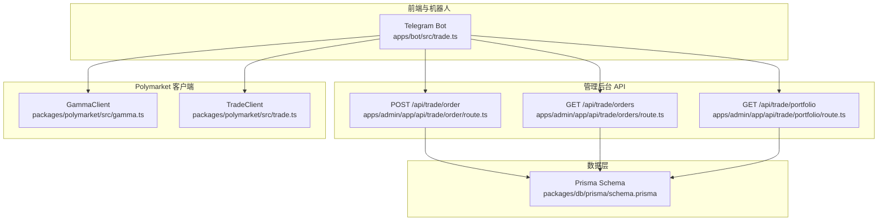
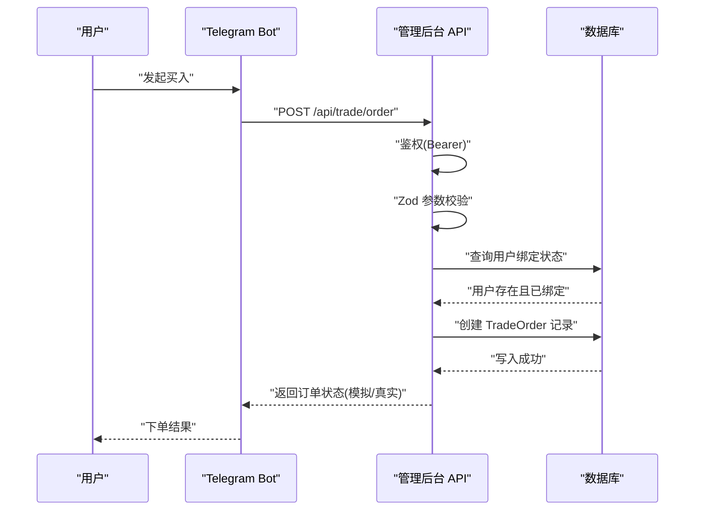
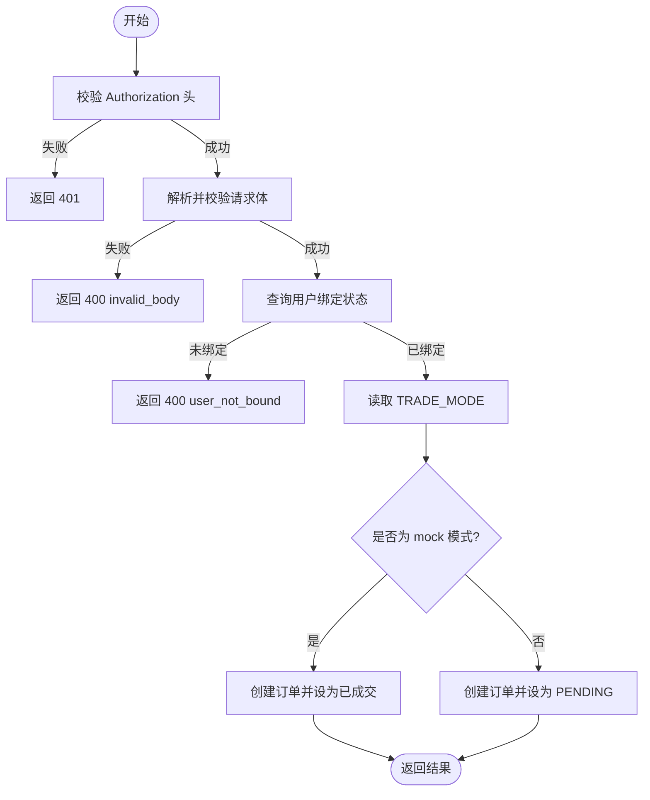
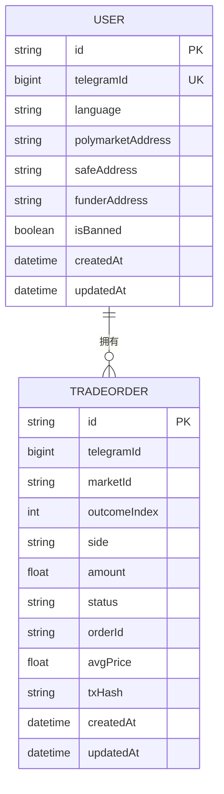
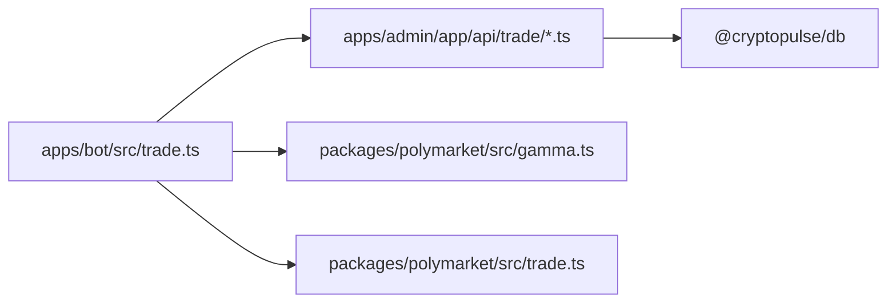

# 交易执行机制

<cite>
**本文引用的文件**
- [apps/admin/app/api/trade/order/route.ts](file://apps/admin/app/api/trade/order/route.ts)
- [apps/admin/app/api/trade/orders/route.ts](file://apps/admin/app/api/trade/orders/route.ts)
- [apps/admin/app/api/trade/portfolio/route.ts](file://apps/admin/app/api/trade/portfolio/route.ts)
- [apps/admin/lib/utils.ts](file://apps/admin/lib/utils.ts)
- [apps/bot/src/trade.ts](file://apps/bot/src/trade.ts)
- [apps/bot/src/env.ts](file://apps/bot/src/env.ts)
- [packages/polymarket/src/index.ts](file://packages/polymarket/src/index.ts)
- [packages/polymarket/src/gamma.ts](file://packages/polymarket/src/gamma.ts)
- [packages/polymarket/src/trade.ts](file://packages/polymarket/src/trade.ts)
- [packages/db/prisma/schema.prisma](file://packages/db/prisma/schema.prisma)
- [test/trade-order.test.ts](file://test/trade-order.test.ts)
- [README.md](file://README.md)
- [package.json](file://package.json)
</cite>

## 目录
1. [引言](#引言)
2. [项目结构](#项目结构)
3. [核心组件](#核心组件)
4. [架构总览](#架构总览)
5. [详细组件分析](#详细组件分析)
6. [依赖关系分析](#依赖关系分析)
7. [性能考虑](#性能考虑)
8. [故障排查指南](#故障排查指南)
9. [结论](#结论)
10. [附录](#附录)

## 引言
本文件面向 Polymarket 交易执行机制的技术文档，聚焦于订单提交流程、订单类型与参数校验、交易执行算法（价格匹配/成交量/成交价）、交易状态管理（生命周期/状态更新/事件通知）、交易费用与滑点处理、错误处理策略、性能优化与监控指标，以及完整执行链路的代码示例路径与调试技巧。当前仓库实现了从 Telegram Bot 到管理后台 API 的端到端闭环，支持模拟模式下的订单落库与查询，并通过 Polymarket 官方 Gamma API 获取市场数据。

## 项目结构
该仓库采用多包工作区（monorepo）组织方式，核心模块包括：
- apps/admin：Next.js 管理后台，提供交易订单与持仓查询接口
- apps/bot：Telegram 机器人，负责用户交互与调用管理后台交易接口
- packages/polymarket：Polymarket 官方客户端封装（Gamma API 与 CLOB 交易）
- packages/db：Prisma 数据模型与数据库 schema
- test：交易订单相关集成测试

图表来源
- [apps/bot/src/trade.ts](file://apps/bot/src/trade.ts#L1-L118)
- [apps/admin/app/api/trade/order/route.ts](file://apps/admin/app/api/trade/order/route.ts#L1-L94)
- [apps/admin/app/api/trade/orders/route.ts](file://apps/admin/app/api/trade/orders/route.ts#L1-L74)
- [apps/admin/app/api/trade/portfolio/route.ts](file://apps/admin/app/api/trade/portfolio/route.ts#L1-L80)
- [packages/polymarket/src/gamma.ts](file://packages/polymarket/src/gamma.ts#L116-L177)
- [packages/polymarket/src/trade.ts](file://packages/polymarket/src/trade.ts#L5-L29)
- [packages/db/prisma/schema.prisma](file://packages/db/prisma/schema.prisma#L36-L54)

章节来源
- [README.md](file://README.md#L1-L65)
- [package.json](file://package.json#L1-L18)

## 核心组件
- 订单提交 API：接收授权校验、请求体校验、用户绑定检查、根据 TRADE_MODE 写入订单状态（模拟/真实），返回标准化响应
- 订单列表与持仓查询 API：按 telegramId 查询历史订单，聚合持仓并返回最近订单快照
- Telegram Bot：与用户交互，发起下单确认，调用管理后台交易接口
- Polymarket 客户端：封装 Gamma API（市场/事件数据）与 CLOB 交易（市价单/签名/下单）
- 数据模型：用户、绑定码、交易订单，含索引与外键约束

章节来源
- [apps/admin/app/api/trade/order/route.ts](file://apps/admin/app/api/trade/order/route.ts#L16-L93)
- [apps/admin/app/api/trade/orders/route.ts](file://apps/admin/app/api/trade/orders/route.ts#L18-L71)
- [apps/admin/app/api/trade/portfolio/route.ts](file://apps/admin/app/api/trade/portfolio/route.ts#L42-L74)
- [apps/bot/src/trade.ts](file://apps/bot/src/trade.ts#L68-L116)
- [packages/polymarket/src/gamma.ts](file://packages/polymarket/src/gamma.ts#L116-L177)
- [packages/polymarket/src/trade.ts](file://packages/polymarket/src/trade.ts#L5-L29)
- [packages/db/prisma/schema.prisma](file://packages/db/prisma/schema.prisma#L10-L54)

## 架构总览
交易执行端到端流程如下：
- 用户在 Telegram Bot 发起买入，Bot 调用管理后台 /api/trade/order 提交订单
- 管理后台进行鉴权与参数校验，查询用户绑定状态，写入 TradeOrder 表
- 根据 TRADE_MODE 决定订单状态（模拟/真实），返回结果
- 用户可通过 /api/trade/orders 与 /api/trade/portfolio 查询历史与持仓

图表来源
- [apps/bot/src/trade.ts](file://apps/bot/src/trade.ts#L68-L116)
- [apps/admin/app/api/trade/order/route.ts](file://apps/admin/app/api/trade/order/route.ts#L16-L93)
- [packages/db/prisma/schema.prisma](file://packages/db/prisma/schema.prisma#L36-L54)

## 详细组件分析

### 订单提交流程与参数校验
- 授权：请求头携带 Bearer Token，与环境变量 BOT_API_TOKEN 对比
- 请求体校验：使用 Zod 校验 telegramId、marketId、outcomeIndex、amount、side
- 用户绑定检查：查询用户是否存在且已绑定 Polymarket 地址
- 订单落库：根据 TRADE_MODE 设置初始状态（模拟模式下直接标记为已成交），填充 orderId、avgPrice、txHash 等字段
- 返回：统一 JSON 结构，包含订单关键字段与当前模式

图表来源
- [apps/admin/app/api/trade/order/route.ts](file://apps/admin/app/api/trade/order/route.ts#L16-L93)

章节来源
- [apps/admin/app/api/trade/order/route.ts](file://apps/admin/app/api/trade/order/route.ts#L8-L14)
- [apps/admin/app/api/trade/order/route.ts](file://apps/admin/app/api/trade/order/route.ts#L16-L93)
- [test/trade-order.test.ts](file://test/trade-order.test.ts#L50-L78)

### 订单类型、参数与验证规则
- 订单类型：当前实现仅支持市价单（FOK），由 TradeClient.createAndPostMarketOrder 调用 CLOB 客户端完成
- 参数：
  - tokenID：市场标的标识
  - side：BUY 或 SELL
  - amount：数量（浮点）
  - price：可选，市价单通常忽略
- 验证规则：
  - telegramId 必须为正整数
  - marketId 非空字符串
  - outcomeIndex 非负整数
  - amount 必须为正数
  - side 限定枚举值

章节来源
- [packages/polymarket/src/trade.ts](file://packages/polymarket/src/trade.ts#L19-L27)
- [apps/admin/app/api/trade/order/route.ts](file://apps/admin/app/api/trade/order/route.ts#L8-L14)

### 交易执行算法（价格匹配、成交量、成交价）
- 当前仓库未实现自研撮合引擎，交易执行通过 Polymarket 官方 CLOB 客户端完成
- 市价单（FOK）：以最优价格立即成交，若无法完全成交则不成交
- 成交价与成交量：由 CLOB 客户端返回，TradeClient.createAndPostMarketOrder 返回交易结果
- 滑点处理：FOK 类型不接受部分成交，滑点风险由市场流动性决定

章节来源
- [packages/polymarket/src/trade.ts](file://packages/polymarket/src/trade.ts#L19-L27)

### 交易状态管理（生命周期、状态更新、事件通知）
- 订单生命周期：PENDING → 已成交（模拟模式下直接为已成交）→ 完成
- 状态更新：管理后台根据 TRADE_MODE 写入初始状态；真实执行阶段应由外部系统回调或轮询更新
- 事件通知：当前未实现订单事件推送；可在真实执行后扩展 Webhook/消息队列

章节来源
- [apps/admin/app/api/trade/order/route.ts](file://apps/admin/app/api/trade/order/route.ts#L65-L77)
- [packages/db/prisma/schema.prisma](file://packages/db/prisma/schema.prisma#L43-L43)

### 交易费用、滑点与最小订单量
- 费用结构：当前未实现费用计算逻辑，可在真实执行后接入 Polymarket 的 Maker/Taker 费率
- 滑点：FOK 市价单不接受部分成交，滑点风险由市场深度与流动性决定
- 最小订单量：GammaMarket 中包含 orderMinSize、orderMinSizeStep 等字段，可在下单前校验

章节来源
- [packages/polymarket/src/gamma.ts](file://packages/polymarket/src/gamma.ts#L59-L60)

### 错误处理策略
- 网络异常：Gamma API 与数据库连接失败时返回 503/500
- 鉴权失败：返回 401
- 参数非法：返回 400 invalid_body
- 用户未绑定：返回 400 user_not_bound
- 订单取消/部分成交：当前未实现；可在真实执行阶段增加状态分支与补偿逻辑

章节来源
- [apps/admin/app/api/trade/order/route.ts](file://apps/admin/app/api/trade/order/route.ts#L16-L93)
- [apps/admin/app/api/trade/orders/route.ts](file://apps/admin/app/api/trade/orders/route.ts#L18-L71)
- [apps/admin/app/api/trade/portfolio/route.ts](file://apps/admin/app/api/trade/portfolio/route.ts#L17-L77)

### 数据模型与索引
- 用户表：包含 telegramId、polymarketAddress 等字段
- 交易订单表：包含 telegramId、marketId、outcomeIndex、side、amount、status、orderId、avgPrice、txHash 等
- 索引：按 telegramId+createdAt、marketId+outcomeIndex 建立索引，提升查询性能

图表来源
- [packages/db/prisma/schema.prisma](file://packages/db/prisma/schema.prisma#L10-L54)

章节来源
- [packages/db/prisma/schema.prisma](file://packages/db/prisma/schema.prisma#L10-L54)

### 代码示例与调试技巧
- 订单提交示例路径：apps/admin/app/api/trade/order/route.ts
- 订单查询示例路径：apps/admin/app/api/trade/orders/route.ts
- 持仓查询示例路径：apps/admin/app/api/trade/portfolio/route.ts
- 机器人下单示例路径：apps/bot/src/trade.ts
- Polymarket 客户端示例路径：packages/polymarket/src/trade.ts
- Gamma API 示例路径：packages/polymarket/src/gamma.ts
- 测试用例示例路径：test/trade-order.test.ts

调试建议：
- 使用 TRADE_MODE=mock 快速验证端到端流程
- 通过 /api/trade/orders 与 /api/trade/portfolio 校验数据一致性
- 在本地数据库中手动插入测试数据，结合测试用例验证边界条件

章节来源
- [apps/admin/app/api/trade/order/route.ts](file://apps/admin/app/api/trade/order/route.ts#L61-L63)
- [apps/admin/app/api/trade/orders/route.ts](file://apps/admin/app/api/trade/orders/route.ts#L48-L53)
- [apps/admin/app/api/trade/portfolio/route.ts](file://apps/admin/app/api/trade/portfolio/route.ts#L49-L55)
- [apps/bot/src/trade.ts](file://apps/bot/src/trade.ts#L80-L93)
- [packages/polymarket/src/trade.ts](file://packages/polymarket/src/trade.ts#L19-L27)
- [packages/polymarket/src/gamma.ts](file://packages/polymarket/src/gamma.ts#L163-L175)
- [test/trade-order.test.ts](file://test/trade-order.test.ts#L80-L105)

## 依赖关系分析
- 应用层依赖：管理后台 API 依赖 Prisma；Bot 依赖管理后台 API 与 Polymarket 客户端
- 外部依赖：Gamma API（市场数据）、Polymarket CLOB（交易执行）、PostgreSQL（持久化）

图表来源
- [apps/bot/src/trade.ts](file://apps/bot/src/trade.ts#L1-L118)
- [apps/admin/app/api/trade/order/route.ts](file://apps/admin/app/api/trade/order/route.ts#L43-L48)
- [packages/polymarket/src/gamma.ts](file://packages/polymarket/src/gamma.ts#L116-L177)
- [packages/polymarket/src/trade.ts](file://packages/polymarket/src/trade.ts#L5-L29)

章节来源
- [apps/bot/src/env.ts](file://apps/bot/src/env.ts#L3-L12)
- [apps/admin/app/api/trade/order/route.ts](file://apps/admin/app/api/trade/order/route.ts#L43-L48)

## 性能考虑
- 数据库索引：已为 TradeOrder 建立常用查询索引，建议在高频查询场景下评估复合索引
- 缓存策略：对 Gamma API 市场数据进行短期缓存，减少重复拉取
- 并发控制：Bot 下单并发高时，建议引入队列与幂等设计，避免重复下单
- 监控指标：记录订单提交成功率、平均响应时间、数据库写入延迟、Gamma API 调用耗时

## 故障排查指南
- 401 未授权：检查环境变量 BOT_API_TOKEN 是否正确配置
- 400 参数非法：核对请求体字段类型与范围
- 400 用户未绑定：确认用户已在数据库中绑定 Polymarket 地址
- 503 数据库不可用：检查 DATABASE_URL 与数据库连通性
- 模拟模式验证：设置 TRADE_MODE=mock，观察订单状态是否为已成交

章节来源
- [apps/admin/app/api/trade/order/route.ts](file://apps/admin/app/api/trade/order/route.ts#L16-L93)
- [test/trade-order.test.ts](file://test/trade-order.test.ts#L50-L78)

## 结论
当前实现提供了从 Telegram Bot 到管理后台 API 的完整交易入口，支持模拟模式下的快速验证。真实执行阶段可基于 Polymarket CLOB 客户端完成市价单撮合，并通过扩展状态管理与事件通知完善交易生命周期。建议在真实执行后补充费用计算、滑点处理与最小订单量校验，并建立完善的监控与告警体系。

## 附录
- 环境变量参考：BOT_API_TOKEN、DATABASE_URL、TRADE_MODE、API_BASE_URL
- 关键文件路径：见“代码示例与调试技巧”

章节来源
- [apps/bot/src/env.ts](file://apps/bot/src/env.ts#L3-L12)
- [apps/admin/app/api/trade/order/route.ts](file://apps/admin/app/api/trade/order/route.ts#L61-L63)