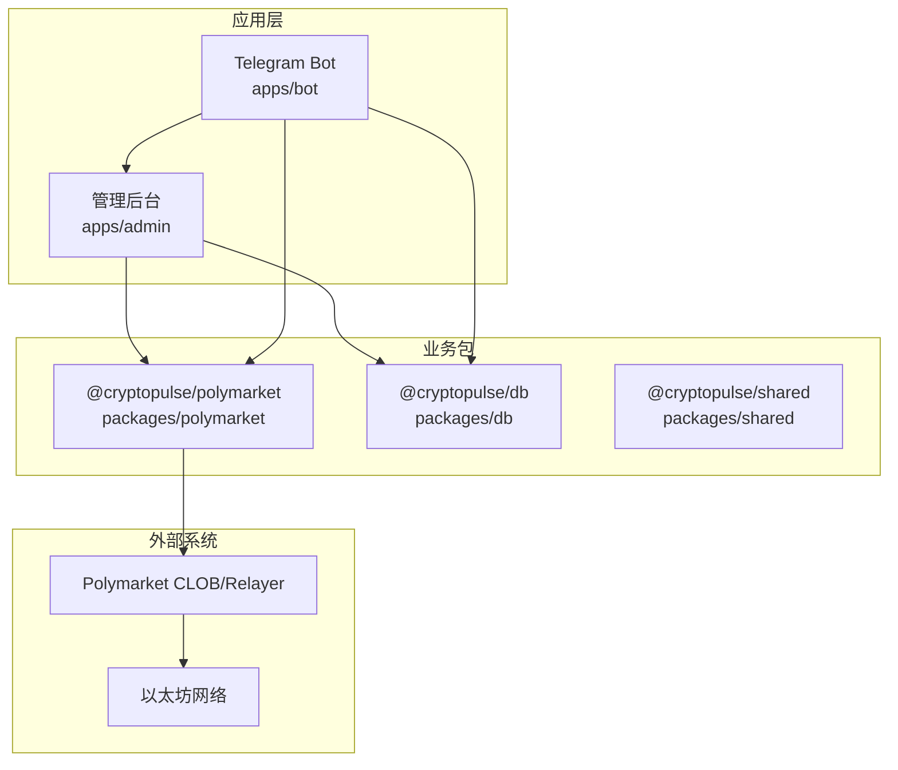
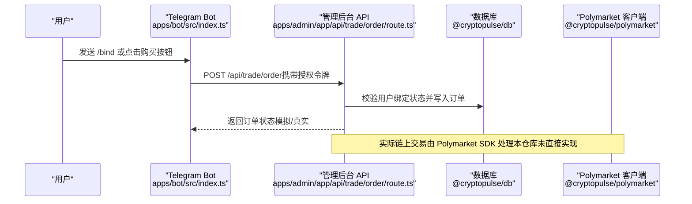
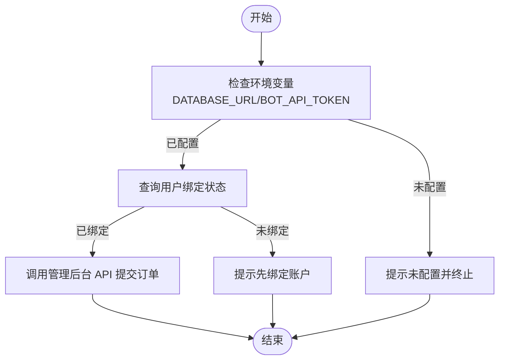
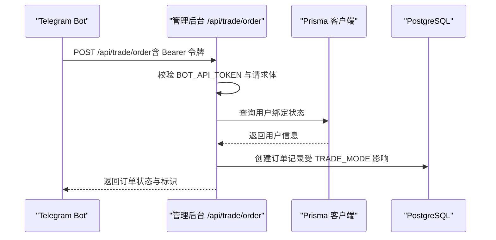
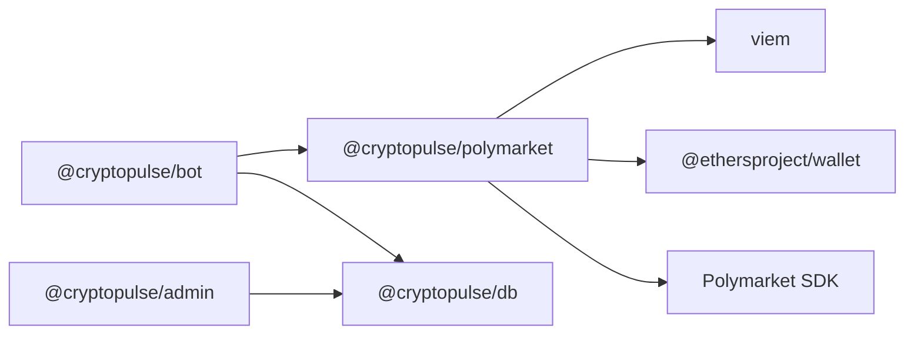

# 以太坊网络交互

<cite>
**本文引用的文件**
- [README.md](file://README.md)
- [.env.example](file://.env.example)
- [apps/bot/src/env.ts](file://apps/bot/src/env.ts)
- [apps/bot/src/index.ts](file://apps/bot/src/index.ts)
- [apps/bot/src/trade.ts](file://apps/bot/src/trade.ts)
- [apps/admin/app/api/trade/order/route.ts](file://apps/admin/app/api/trade/order/route.ts)
- [apps/admin/app/bind/actions.ts](file://apps/admin/app/bind/actions.ts)
- [apps/admin/app/api/bind/confirm/route.ts](file://apps/admin/app/api/bind/confirm/route.ts)
- [packages/polymarket/package.json](file://packages/polymarket/package.json)
- [package.json](file://package.json)
- [package-lock.json](file://package-lock.json)
</cite>

## 目录
1. [简介](#简介)
2. [项目结构](#项目结构)
3. [核心组件](#核心组件)
4. [架构总览](#架构总览)
5. [详细组件分析](#详细组件分析)
6. [依赖关系分析](#依赖关系分析)
7. [性能考虑](#性能考虑)
8. [故障排查指南](#故障排查指南)
9. [结论](#结论)
10. [附录](#附录)

## 简介
本文件面向以太坊网络交互场景，聚焦 Polymarket 与以太坊生态的集成方式，涵盖以下主题：
- Polymarket 与以太坊网络交互的总体架构与数据流
- RPC 连接配置、节点选择与网络切换
- 交易签名机制（私钥管理、签名生成、多重签名支持现状）
- 区块确认过程（确认深度、重试机制、最终性保证）
- Gas 费用管理（Gas 价格估算、费用上限设置、动态调整策略）
- 网络异常处理（节点故障、网络拥堵、超时重试）
- 不同网络环境配置（主网、测试网、本地开发网络）
- 以太坊交互的代码示例路径与调试技巧
- 性能优化建议

说明：当前仓库中以太坊交互主要通过 Polymarket 提供的 SDK 与客户端进行，实际链上交易由 Polymarket 的 Relayer 与 CLOB 客户端负责，钱包签名与链上交互细节不在本仓库内实现。

## 项目结构
该项目采用多包工作区（monorepo）组织，包含：
- apps/admin：Next.js 管理后台，提供绑定、下单等 API
- apps/bot：Telegram Bot，负责用户交互与下单触发
- packages/polymarket：封装 Polymarket SDK 与客户端
- packages/db：数据库与 Prisma 配置
- packages/shared：共享工具与类型定义

图表来源
- [package.json](file://package.json#L1-L18)
- [packages/polymarket/package.json](file://packages/polymarket/package.json#L1-L23)

章节来源
- [README.md](file://README.md#L1-L65)
- [package.json](file://package.json#L1-L18)

## 核心组件
- Polymarket 客户端（GammaClient）：用于查询市场、下单等操作
- 管理后台 API：接收 Bot 触发的下单请求，写入数据库并返回模拟/真实状态
- Telegram Bot：与用户交互，收集下单参数并调用管理后台 API
- Polymarket SDK：封装 CLOB 客户端、Relayer 客户端与签名 SDK

章节来源
- [apps/bot/src/trade.ts](file://apps/bot/src/trade.ts#L1-L118)
- [apps/admin/app/api/trade/order/route.ts](file://apps/admin/app/api/trade/order/route.ts#L1-L94)
- [packages/polymarket/package.json](file://packages/polymarket/package.json#L1-L23)

## 架构总览
从用户交互到链上执行的关键流程如下：

图表来源
- [apps/bot/src/index.ts](file://apps/bot/src/index.ts#L1-L156)
- [apps/bot/src/trade.ts](file://apps/bot/src/trade.ts#L1-L118)
- [apps/admin/app/api/trade/order/route.ts](file://apps/admin/app/api/trade/order/route.ts#L1-L94)

## 详细组件分析

### 1) Polymarket 客户端与 SDK
- 依赖项包含：
  - @polymarket/clob-client：CLOB 客户端
  - @polymarket/builder-relayer-client：Relayer 客户端
  - @polymarket/builder-signing-sdk：签名 SDK
  - viem：现代以太坊库（用于交易构造与交互）
- 作用：封装 Polymarket 的下单、查询、签名等能力，供 Bot 与管理后台调用

章节来源
- [packages/polymarket/package.json](file://packages/polymarket/package.json#L1-L23)

### 2) Telegram Bot 与下单流程
- 用户通过 Bot 选择市场与方向，Bot 将下单请求转发至管理后台 API
- Bot 对环境变量进行校验（如数据库、API 令牌），并在失败时给出明确提示

图表来源
- [apps/bot/src/trade.ts](file://apps/bot/src/trade.ts#L25-L46)
- [apps/bot/src/trade.ts](file://apps/bot/src/trade.ts#L75-L78)

章节来源
- [apps/bot/src/index.ts](file://apps/bot/src/index.ts#L1-L156)
- [apps/bot/src/trade.ts](file://apps/bot/src/trade.ts#L1-L118)

### 3) 管理后台 API：下单接口
- 接收 Bot 的下单请求，进行鉴权与参数校验
- 查询用户绑定状态，写入订单记录，并根据 TRADE_MODE 返回模拟或真实状态
- 支持 mock 模式下的快速验证与真实模式下的链上执行

图表来源
- [apps/admin/app/api/trade/order/route.ts](file://apps/admin/app/api/trade/order/route.ts#L16-L93)

章节来源
- [apps/admin/app/api/trade/order/route.ts](file://apps/admin/app/api/trade/order/route.ts#L1-L94)

### 4) 绑定流程与地址管理
- Web 端绑定页面通过表单提交绑定码与钱包地址
- 后端对地址格式进行校验，确保符合以太坊地址规范
- 绑定成功后，Bot 侧可读取用户绑定状态以启用交易功能

章节来源
- [apps/admin/app/bind/actions.ts](file://apps/admin/app/bind/actions.ts#L1-L46)
- [apps/admin/app/api/bind/confirm/route.ts](file://apps/admin/app/api/bind/confirm/route.ts#L1-L52)

### 5) 环境变量与网络配置
- Polymarket 相关配置项：
  - POLYMARKET_CHAIN_ID：目标链 ID
  - POLYMARKET_CLOB_HOST：CLOB API 主机
  - POLYMARKET_WS_URL：订阅 WebSocket 地址
  - POLYMARKET_RELAYER_URL：Relayer 服务地址
  - POLYMARKET_RPC_URL：RPC 节点地址（可选）
- 其他关键变量：
  - DATABASE_URL：PostgreSQL 连接串
  - BOT_API_TOKEN：Bot 请求的鉴权令牌
  - API_BASE_URL/WEB_BASE_URL：Bot 与管理后台的基础 URL

章节来源
- [.env.example](file://.env.example#L1-L43)

## 依赖关系分析
- 工作区与包依赖：
  - apps/bot 依赖 @cryptopulse/polymarket 与 @cryptopulse/db
  - packages/polymarket 依赖 Polymarket SDK 与 viem
  - apps/admin 依赖 @cryptopulse/db 与 Prisma
- 关键外部依赖：
  - viem：提供交易构造、签名、节点通信等能力
  - ethers 生态相关库：用于签名与加密操作

图表来源
- [packages/polymarket/package.json](file://packages/polymarket/package.json#L11-L16)
- [package.json](file://package.json#L4-L7)
- [package-lock.json](file://package-lock.json#L3440-L3449)

章节来源
- [packages/polymarket/package.json](file://packages/polymarket/package.json#L1-L23)
- [package.json](file://package.json#L1-L18)
- [package-lock.json](file://package-lock.json#L3440-L3449)

## 性能考虑
- 交易路径优化
  - 使用批量下单与缓存常用市场数据，减少重复请求
  - 在 Bot 侧对用户输入进行即时校验，避免无效请求进入后端
- 数据库性能
  - 对用户与订单表建立必要索引，提升查询效率
  - 控制订单写入频率，避免高并发写入导致阻塞
- 网络与超时
  - 为 API 请求设置合理的超时时间与重试退避策略
  - 对 Polymarket API 与 Relayer 服务进行健康检查与熔断保护

## 故障排查指南
- 认证失败
  - 检查 BOT_API_TOKEN 是否正确配置且请求头携带 Bearer 令牌
- 数据库不可用
  - 确认 DATABASE_URL 可用，Prisma 初始化是否完成
- 用户未绑定
  - 检查绑定流程是否完成，Polymarket 地址是否有效
- 网络异常
  - 校验 POLYMARKET_* 环境变量是否指向正确的网络与服务
  - 对 RPC 节点与 Relayer 服务进行连通性测试

章节来源
- [apps/admin/app/api/trade/order/route.ts](file://apps/admin/app/api/trade/order/route.ts#L17-L23)
- [apps/admin/app/bind/actions.ts](file://apps/admin/app/bind/actions.ts#L33-L35)
- [apps/bot/src/trade.ts](file://apps/bot/src/trade.ts#L25-L28)

## 结论
本项目通过 Bot 与管理后台 API 协作，结合 Polymarket SDK 实现了从用户交互到链上执行的闭环。当前仓库未直接实现以太坊签名与链上交互逻辑，而是依赖 Polymarket 的 Relayer 与 CLOB 客户端完成交易。建议在后续版本中补充：
- 明确的 RPC 节点配置与网络切换策略
- 交易签名与多重签名支持的实现
- 区块确认与最终性的监控与告警
- Gas 费用估算与上限控制的自动化策略

## 附录

### A. 不同网络环境配置指南
- 主网（Polygon 主网）
  - 设置 POLYMARKET_CHAIN_ID=137
  - 使用 Polygon 主网 RPC 与 Polymarket 主网服务
- 测试网（Polygon Mumbai）
  - 设置 POLYMARKET_CHAIN_ID=80001
  - 使用 Mumbai 测试网 RPC 与 Polymarket 测试网服务
- 本地开发网络
  - 使用本地或远程 RPC 节点
  - 配置 POLYMARKET_RPC_URL 与 POLYMARKET_* 服务地址

章节来源
- [.env.example](file://.env.example#L18-L24)

### B. 以太坊交互代码示例与调试技巧
- 示例路径（仅提供路径，不展示具体代码内容）
  - Bot 环境变量解析：[apps/bot/src/env.ts](file://apps/bot/src/env.ts#L1-L14)
  - Bot 入口与命令处理：[apps/bot/src/index.ts](file://apps/bot/src/index.ts#L1-L156)
  - Bot 下单流程（调用管理后台 API）：[apps/bot/src/trade.ts](file://apps/bot/src/trade.ts#L80-L93)
  - 管理后台下单接口（鉴权与落库）：[apps/admin/app/api/trade/order/route.ts](file://apps/admin/app/api/trade/order/route.ts#L16-L93)
  - 绑定页面表单校验与提交：[apps/admin/app/bind/actions.ts](file://apps/admin/app/bind/actions.ts#L21-L46)
  - 绑定确认 API 校验与查询：[apps/admin/app/api/bind/confirm/route.ts](file://apps/admin/app/api/bind/confirm/route.ts#L21-L52)
  - Polymarket SDK 依赖声明：[packages/polymarket/package.json](file://packages/polymarket/package.json#L11-L16)

### C. 以太坊交互最佳实践
- RPC 连接
  - 使用多个备用节点，实现自动切换与故障转移
  - 对节点响应时间与成功率进行监控
- 交易签名
  - 私钥存储于安全密钥管理系统，避免明文存储
  - 支持多重签名阈值，提高安全性
- 区块确认
  - 设置最小确认数与最长等待时间
  - 对交易回滚与分叉进行检测与处理
- Gas 管理
  - 动态估算 Gas Price 与 Gas Limit
  - 设定最大费用上限，防止意外高额费用
- 异常处理
  - 对网络超时、节点不可达、服务限流进行统一处理
  - 记录详细日志，便于问题定位与复盘