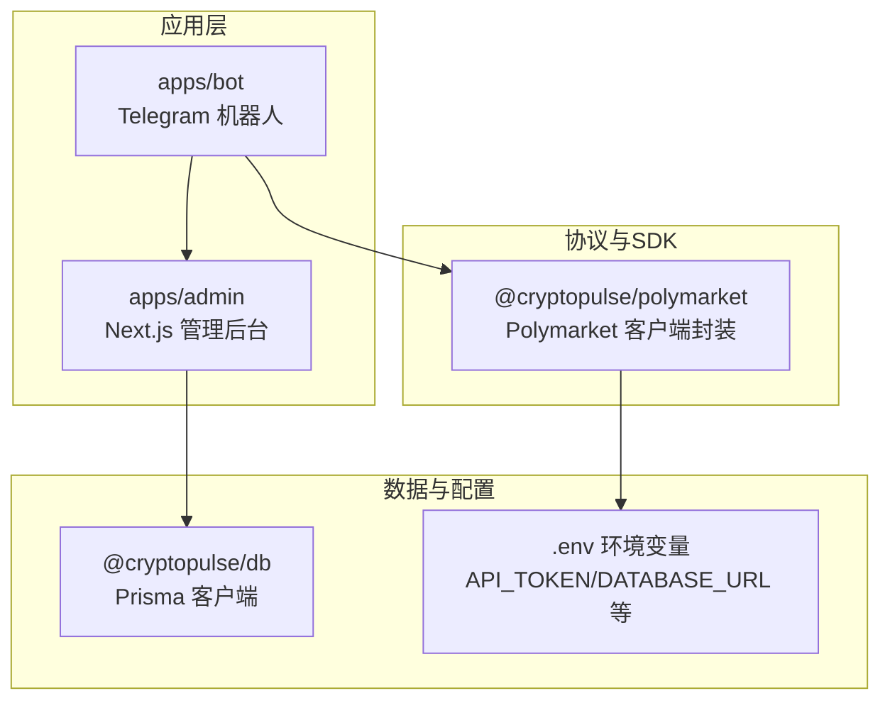
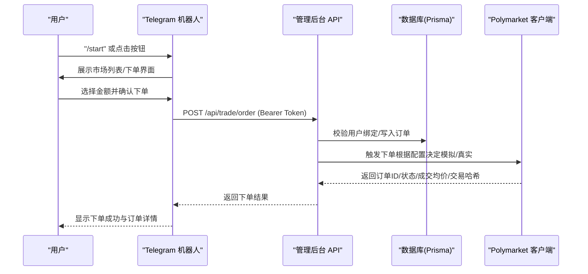
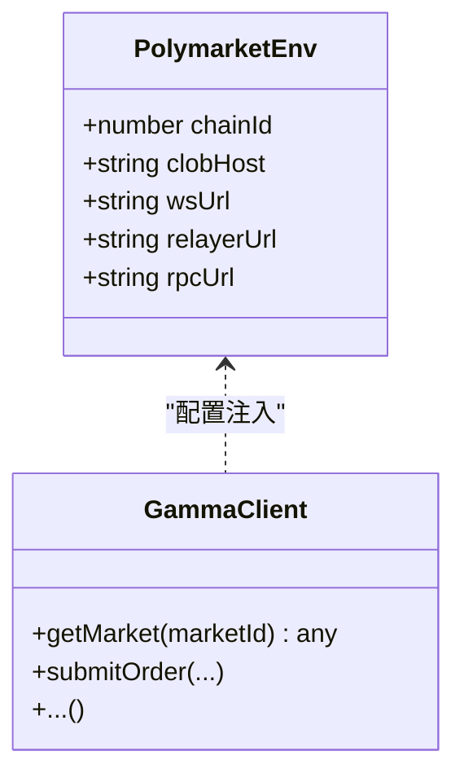
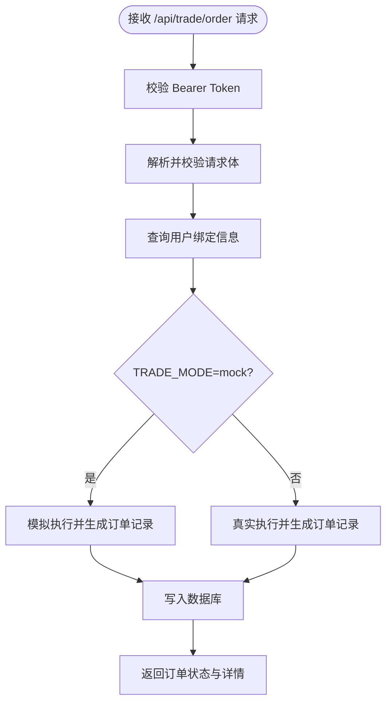
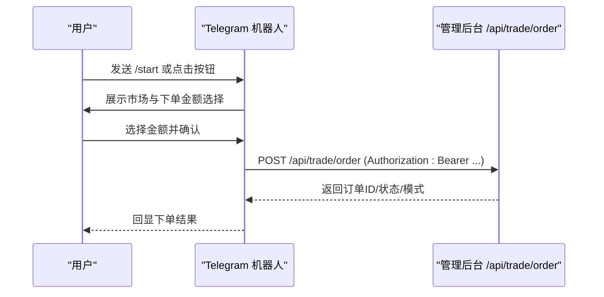
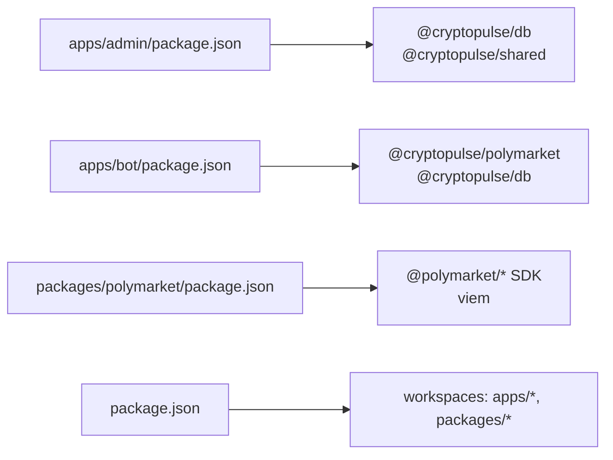

# 协议原理与架构

<cite>
**本文引用的文件**
- [README.md](file://README.md)
- [package.json](file://package.json)
- [packages/polymarket/package.json](file://packages/polymarket/package.json)
- [packages/polymarket/src/index.ts](file://packages/polymarket/src/index.ts)
- [apps/admin/app/api/trade/order/route.ts](file://apps/admin/app/api/trade/order/route.ts)
- [apps/admin/app/api/trade/orders/route.ts](file://apps/admin/app/api/trade/orders/route.ts)
- [apps/admin/app/api/trade/portfolio/route.ts](file://apps/admin/app/api/trade/portfolio/route.ts)
- [apps/admin/app/api/bind/confirm/route.ts](file://apps/admin/app/api/bind/confirm/route.ts)
- [apps/admin/package.json](file://apps/admin/package.json)
- [apps/bot/package.json](file://apps/bot/package.json)
- [apps/bot/src/index.ts](file://apps/bot/src/index.ts)
- [apps/bot/src/trade.ts](file://apps/bot/src/trade.ts)
</cite>

## 目录
1. [引言](#引言)
2. [项目结构](#项目结构)
3. [核心组件](#核心组件)
4. [架构总览](#架构总览)
5. [详细组件分析](#详细组件分析)
6. [依赖关系分析](#依赖关系分析)
7. [性能考虑](#性能考虑)
8. [故障排查指南](#故障排查指南)
9. [结论](#结论)
10. [附录](#附录)

## 引言
本文件面向希望理解 Polymarket 预测市场协议工作原理与系统架构的开发者，围绕以下目标展开：解释二元预测市场、流动性提供、价格发现与结算的基本机制；梳理本仓库中与交易、订单、资金管理相关的模块化设计；结合现有代码路径，给出可操作的调用序列与时序图；并提供术语表与版本兼容性说明，帮助快速上手与扩展。

## 项目结构
该仓库采用多包工作区（monorepo）组织方式，主要由三个应用与两个共享包组成：
- apps/admin：Next.js 管理后台，提供交易订单与持仓查询等接口
- apps/bot：Telegram 机器人，负责用户交互、市场浏览与下单触发
- packages/polymarket：Polymarket 协议客户端封装（通过 @polymarket/* SDK）
- packages/db、packages/shared：数据库与通用工具（本仓库未包含其源码）

图表来源
- [apps/admin/package.json](file://apps/admin/package.json#L1-L42)
- [apps/bot/package.json](file://apps/bot/package.json#L1-L26)
- [packages/polymarket/package.json](file://packages/polymarket/package.json#L1-L23)

章节来源
- [package.json](file://package.json#L1-L18)
- [README.md](file://README.md#L1-L65)

## 核心组件
- Polymarket 客户端封装：导出 GammaClient 与交易相关能力，并暴露链上环境参数（链 ID、CLOB 主机、WS、Relayer、RPC）。
- 管理后台 API：提供绑定确认、下单、查询订单、查询持仓等接口，均受统一 Bearer Token 保护。
- Telegram 机器人：负责用户交互、市场搜索、下单确认与触发后台下单请求。
- 数据持久化：通过 Prisma 访问 PostgreSQL，存储用户绑定信息与交易订单状态。

章节来源
- [packages/polymarket/src/index.ts](file://packages/polymarket/src/index.ts#L1-L11)
- [apps/admin/app/api/bind/confirm/route.ts](file://apps/admin/app/api/bind/confirm/route.ts#L1-L91)
- [apps/admin/app/api/trade/order/route.ts](file://apps/admin/app/api/trade/order/route.ts#L1-L94)
- [apps/admin/app/api/trade/orders/route.ts](file://apps/admin/app/api/trade/orders/route.ts#L1-L74)
- [apps/admin/app/api/trade/portfolio/route.ts](file://apps/admin/app/api/trade/portfolio/route.ts#L1-L80)
- [apps/bot/src/index.ts](file://apps/bot/src/index.ts#L1-L156)
- [apps/bot/src/trade.ts](file://apps/bot/src/trade.ts#L1-L118)

## 架构总览
整体交互从 Telegram 机器人开始，用户通过机器人选择市场与下单金额，机器人调用管理后台的下单接口；后台接口校验身份、读取数据库、根据配置决定模拟或真实执行模式，并返回订单状态与结果。

图表来源
- [apps/bot/src/trade.ts](file://apps/bot/src/trade.ts#L68-L118)
- [apps/admin/app/api/trade/order/route.ts](file://apps/admin/app/api/trade/order/route.ts#L16-L93)
- [packages/polymarket/src/index.ts](file://packages/polymarket/src/index.ts#L1-L11)

## 详细组件分析

### 组件A：Polymarket 客户端封装（GammaClient）
- 职责：对外暴露 GammaClient 与交易相关能力；导出 PolymarketEnv 以承载链上环境参数。
- 关键点：
  - 通过 @polymarket/* SDK 提供 CLOB 客户端、签名 SDK、Builder Relayer 客户端等能力。
  - PolymarketEnv 包含 chainId、clobHost、wsUrl、relayerUrl、rpcUrl 等，用于连接不同链与服务端点。
- 复杂度与性能：客户端封装降低上层耦合，实际网络调用与签名逻辑由 SDK 实现，性能取决于外部服务延迟与链上确认时间。

图表来源
- [packages/polymarket/src/index.ts](file://packages/polymarket/src/index.ts#L1-L11)
- [packages/polymarket/package.json](file://packages/polymarket/package.json#L11-L16)

章节来源
- [packages/polymarket/src/index.ts](file://packages/polymarket/src/index.ts#L1-L11)
- [packages/polymarket/package.json](file://packages/polymarket/package.json#L1-L23)

### 组件B：管理后台 API（交易与绑定）
- 认证与授权：所有交易相关接口均要求 Bearer Token，未提供或不匹配则返回 401。
- 绑定确认：
  - 校验绑定码是否存在、未被使用、未过期；
  - 事务性更新用户绑定信息并标记绑定码已使用。
- 下单接口：
  - 校验请求体字段（telegramId、marketId、outcomeIndex、amount、side）；
  - 读取数据库确认用户已绑定；
  - 根据 TRADE_MODE 决定是否模拟执行（模拟模式下直接返回已成交状态与虚拟成交均价与交易哈希）；
  - 将订单持久化到数据库并返回结果。
- 查询订单与持仓：
  - 订单列表按时间倒序返回；
  - 持仓基于历史订单聚合计算，仅保留非零头寸并按绝对值排序。

图表来源
- [apps/admin/app/api/trade/order/route.ts](file://apps/admin/app/api/trade/order/route.ts#L16-L93)

章节来源
- [apps/admin/app/api/bind/confirm/route.ts](file://apps/admin/app/api/bind/confirm/route.ts#L1-L91)
- [apps/admin/app/api/trade/order/route.ts](file://apps/admin/app/api/trade/order/route.ts#L1-L94)
- [apps/admin/app/api/trade/orders/route.ts](file://apps/admin/app/api/trade/orders/route.ts#L1-L74)
- [apps/admin/app/api/trade/portfolio/route.ts](file://apps/admin/app/api/trade/portfolio/route.ts#L1-L80)

### 组件C：Telegram 机器人（用户交互与下单触发）
- 功能概览：
  - /start 展示菜单与分类入口；
  - /search 与文本消息触发市场搜索；
  - 通过内联键盘展示市场与下单金额；
  - 点击下单金额后调用管理后台 /api/trade/order 接口提交订单。
- 错误处理：对网络异常、数据库不可用、未绑定等情况进行用户提示与日志记录。

图表来源
- [apps/bot/src/index.ts](file://apps/bot/src/index.ts#L11-L156)
- [apps/bot/src/trade.ts](file://apps/bot/src/trade.ts#L68-L118)
- [apps/admin/app/api/trade/order/route.ts](file://apps/admin/app/api/trade/order/route.ts#L16-L93)

章节来源
- [apps/bot/src/index.ts](file://apps/bot/src/index.ts#L1-L156)
- [apps/bot/src/trade.ts](file://apps/bot/src/trade.ts#L1-L118)

## 依赖关系分析
- 应用与包的关系：
  - apps/admin 依赖 @cryptopulse/db 与 @cryptopulse/shared；
  - apps/bot 依赖 @cryptopulse/polymarket 与 @cryptopulse/db；
  - packages/polymarket 依赖 @polymarket/* SDK 与 viem。
- 工作区脚本：通过根目录 package.json 的 workspaces 管理多包开发与构建。

图表来源
- [apps/admin/package.json](file://apps/admin/package.json#L13-L38)
- [apps/bot/package.json](file://apps/bot/package.json#L12-L23)
- [packages/polymarket/package.json](file://packages/polymarket/package.json#L11-L16)
- [package.json](file://package.json#L4-L6)

章节来源
- [apps/admin/package.json](file://apps/admin/package.json#L1-L42)
- [apps/bot/package.json](file://apps/bot/package.json#L1-L26)
- [packages/polymarket/package.json](file://packages/polymarket/package.json#L1-L23)
- [package.json](file://package.json#L1-L18)

## 性能考虑
- 网络延迟与吞吐：
  - 订单提交与查询依赖管理后台 API，实际性能受 API 响应时间与数据库读写影响；
  - 机器人与 API 间为 HTTP 请求，建议在高并发场景增加缓存与限流策略。
- 模拟模式：
  - 当 TRADE_MODE 设为 mock 时，后台直接返回模拟成交状态，避免链上交互带来的延迟与不确定性，适合测试与演示。
- 数据库优化：
  - 对用户与订单表建立合适索引（如 telegramId、createdAt），减少查询耗时；
  - 控制单次查询数量上限，避免一次性返回过多数据。

## 故障排查指南
- 认证失败（401）：
  - 检查 Bearer Token 是否正确配置与传递；
  - 确认 BOT_API_TOKEN 与管理后台一致。
- 数据库不可用（503）：
  - 检查 DATABASE_URL 是否正确；
  - 确认 Prisma 客户端可正常加载。
- 用户未绑定（400）：
  - 确认绑定码有效且未过期；
  - 检查用户是否已完成绑定确认流程。
- 订单提交失败：
  - 查看后台日志中的错误堆栈；
  - 确认 TRADE_MODE 配置与期望行为一致。

章节来源
- [apps/admin/app/api/trade/order/route.ts](file://apps/admin/app/api/trade/order/route.ts#L16-L93)
- [apps/admin/app/api/bind/confirm/route.ts](file://apps/admin/app/api/bind/confirm/route.ts#L47-L88)
- [apps/bot/src/trade.ts](file://apps/bot/src/trade.ts#L75-L98)

## 结论
本仓库展示了 Polymarket 预测市场在应用层的典型集成方式：通过 Polymarket 客户端封装对接 CLOB 与链上服务，借助管理后台提供统一的交易与查询接口，再由 Telegram 机器人完成用户交互与下单触发。系统采用模拟模式便于测试，同时具备清晰的认证与数据持久化机制。后续可在现有基础上扩展真实链上执行、风控校验与更丰富的市场数据接入。

## 附录

### 术语表
- 预测市场：允许用户对事件结果进行投注的金融平台，常见为二元市场（是/否）。
- 流动性提供者：向市场提供买卖挂单以促进交易的参与者，通常获得手续费或激励。
- 价格发现：通过市场供需形成的价格反映对未来事件的概率预期。
- 结算：事件结果确定后，按规则对头寸进行清仓与资金划转的过程。
- CLOB（中央订单簿）：集中管理挂单、撮合交易的系统，保证透明与公平。
- GammaClient：对 Polymarket 协议的客户端封装，提供市场查询与下单等能力。
- Relayer：中继链上交易请求的服务端组件，负责广播与确认。

### 版本与兼容性说明
- 工作区版本：各包版本号均为 0.0.1，适用于开发与集成阶段。
- 依赖兼容：
  - @polymarket/* SDK 与 viem 用于链上交互与签名；
  - Next.js 15.x、TypeScript 5.x、Playwright 等用于前端与测试。
- 环境变量：
  - BOT_API_TOKEN：管理后台接口访问令牌；
  - DATABASE_URL：PostgreSQL 连接串；
  - TRADE_MODE：控制是否启用模拟模式（mock）；
  - WEB_BASE_URL、TELEGRAM_BOT_TOKEN：机器人与前端交互所需配置。

章节来源
- [apps/admin/package.json](file://apps/admin/package.json#L13-L38)
- [apps/bot/package.json](file://apps/bot/package.json#L12-L23)
- [packages/polymarket/package.json](file://packages/polymarket/package.json#L11-L16)
- [apps/admin/app/api/trade/order/route.ts](file://apps/admin/app/api/trade/order/route.ts#L61-L61)
- [README.md](file://README.md#L20-L25)