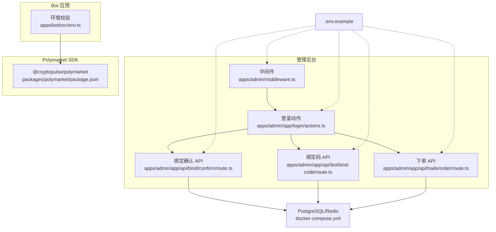
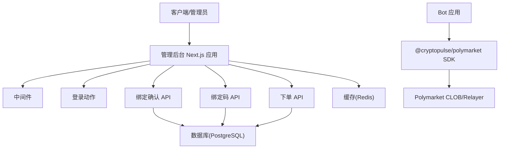
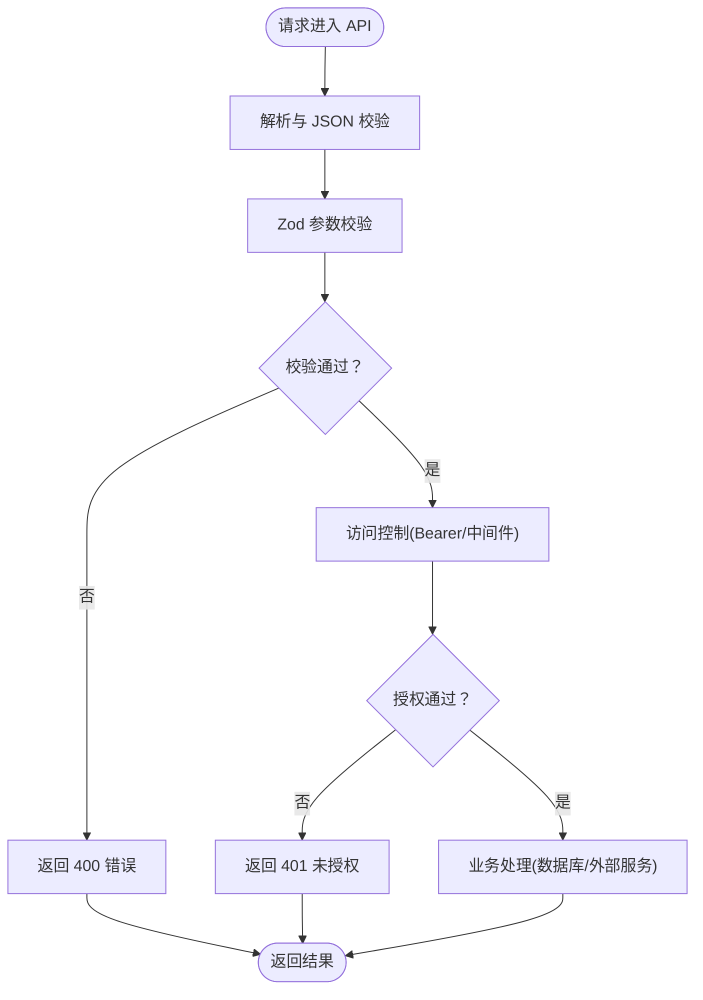
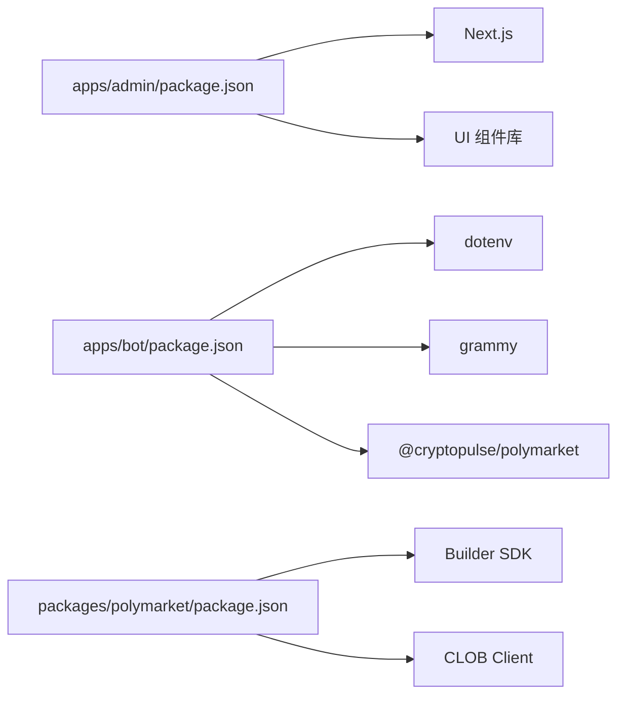

# 安全考虑与最佳实践

<cite>
**本文引用的文件**
- [README.md](file://README.md)
- [.env.example](file://.env.example)
- [docker-compose.yml](file://docker-compose.yml)
- [apps/admin/middleware.ts](file://apps/admin/middleware.ts)
- [apps/admin/app/login/actions.ts](file://apps/admin/app/login/actions.ts)
- [apps/admin/app/api/bind/confirm/route.ts](file://apps/admin/app/api/bind/confirm/route.ts)
- [apps/admin/app/api/bot/bind-code/route.ts](file://apps/admin/app/api/bot/bind-code/route.ts)
- [apps/admin/app/api/trade/order/route.ts](file://apps/admin/app/api/trade/order/route.ts)
- [apps/admin/package.json](file://apps/admin/package.json)
- [apps/bot/src/env.ts](file://apps/bot/src/env.ts)
- [apps/bot/package.json](file://apps/bot/package.json)
- [packages/polymarket/package.json](file://packages/polymarket/package.json)
- [specs/cryptopulse/ops-checklist.md](file://specs/cryptopulse/ops-checklist.md)
- [specs/cryptopulse/requirements.md](file://specs/cryptopulse/requirements.md)
</cite>

## 目录
1. [简介](#简介)
2. [项目结构](#项目结构)
3. [核心组件](#核心组件)
4. [架构总览](#架构总览)
5. [详细组件分析](#详细组件分析)
6. [依赖分析](#依赖分析)
7. [性能考量](#性能考量)
8. [故障排查指南](#故障排查指南)
9. [结论](#结论)
10. [附录](#附录)

## 简介
本文件聚焦 Polymarket 集成场景下的安全考虑与最佳实践，围绕密钥与凭据管理、交易安全机制、网络与数据安全、安全配置检查清单、事件响应与应急处理、安全编码实践以及安全测试与渗透建议展开。文档结合仓库现有实现与规范文件，提供可落地的安全加固建议与流程指引。

## 项目结构
项目采用多包工作区组织，包含管理后台应用、Bot 应用与 Polymarket 相关 SDK 包。数据库与缓存通过 Docker Compose 提供本地开发环境。管理员后台通过中间件与登录动作实现基础鉴权，API 层负责业务请求的输入校验与访问控制。

**图示来源**
- [apps/admin/middleware.ts](file://apps/admin/middleware.ts#L1-L23)
- [apps/admin/app/login/actions.ts](file://apps/admin/app/login/actions.ts#L1-L29)
- [apps/admin/app/api/bind/confirm/route.ts](file://apps/admin/app/api/bind/confirm/route.ts#L1-L91)
- [apps/admin/app/api/bot/bind-code/route.ts](file://apps/admin/app/api/bot/bind-code/route.ts#L1-L105)
- [apps/admin/app/api/trade/order/route.ts](file://apps/admin/app/api/trade/order/route.ts#L1-L94)
- [apps/bot/src/env.ts](file://apps/bot/src/env.ts#L1-L14)
- [packages/polymarket/package.json](file://packages/polymarket/package.json#L1-L23)
- [docker-compose.yml](file://docker-compose.yml#L1-L24)
- [.env.example](file://.env.example#L1-L43)

**章节来源**
- [README.md](file://README.md#L1-L65)
- [docker-compose.yml](file://docker-compose.yml#L1-L24)
- [apps/admin/package.json](file://apps/admin/package.json#L1-L42)
- [apps/bot/package.json](file://apps/bot/package.json#L1-L26)
- [packages/polymarket/package.json](file://packages/polymarket/package.json#L1-L23)

## 核心组件
- 管理后台鉴权与会话
  - 中间件对受保护路径进行鉴权，支持开发环境豁免与生产环境强制校验。
  - 登录动作设置 HttpOnly Cookie 并根据环境决定 Secure 标记。
- API 层安全
  - 绑定确认与下单 API 对请求体进行 Zod 校验，严格限制字段类型与范围。
  - 绑定码 API 实现 Bearer Token 校验与唯一性约束处理。
- 环境变量与密钥
  - Bot 环境校验使用 Zod Schema，确保关键变量存在且格式正确。
  - 示例环境文件定义了 Polymarket、Builder、钱包与可观测性等敏感配置项。
- Polymarket SDK
  - 依赖官方 Builder Relayer 客户端与 CLOB 客户端，用于构建与提交订单。

**章节来源**
- [apps/admin/middleware.ts](file://apps/admin/middleware.ts#L1-L23)
- [apps/admin/app/login/actions.ts](file://apps/admin/app/login/actions.ts#L1-L29)
- [apps/admin/app/api/bind/confirm/route.ts](file://apps/admin/app/api/bind/confirm/route.ts#L1-L91)
- [apps/admin/app/api/bot/bind-code/route.ts](file://apps/admin/app/api/bot/bind-code/route.ts#L1-L105)
- [apps/admin/app/api/trade/order/route.ts](file://apps/admin/app/api/trade/order/route.ts#L1-L94)
- [apps/bot/src/env.ts](file://apps/bot/src/env.ts#L1-L14)
- [.env.example](file://.env.example#L1-L43)
- [packages/polymarket/package.json](file://packages/polymarket/package.json#L1-L23)

## 架构总览
下图展示了管理后台与 Bot 之间的交互关系，以及与 Polymarket 生态的关键集成点。API 层承担输入校验与访问控制，数据库与缓存提供持久化与会话存储，Bot 侧负责与外部服务通信与订单执行。

**图示来源**
- [apps/admin/middleware.ts](file://apps/admin/middleware.ts#L1-L23)
- [apps/admin/app/login/actions.ts](file://apps/admin/app/login/actions.ts#L1-L29)
- [apps/admin/app/api/bind/confirm/route.ts](file://apps/admin/app/api/bind/confirm/route.ts#L1-L91)
- [apps/admin/app/api/bot/bind-code/route.ts](file://apps/admin/app/api/bot/bind-code/route.ts#L1-L105)
- [apps/admin/app/api/trade/order/route.ts](file://apps/admin/app/api/trade/order/route.ts#L1-L94)
- [apps/bot/src/env.ts](file://apps/bot/src/env.ts#L1-L14)
- [packages/polymarket/package.json](file://packages/polymarket/package.json#L1-L23)
- [docker-compose.yml](file://docker-compose.yml#L1-L24)

## 详细组件分析

### 密钥与凭据管理
- 环境变量与敏感配置
  - 示例环境文件集中声明了 Polymarket 链 ID、CLOB/Relayer/WS 地址、Builder 凭据、钱包与可观测性等配置项。
  - Bot 环境校验通过 Zod Schema 对关键变量进行存在性与格式校验，避免空值或错误类型导致的运行时问题。
- 存储与传输
  - 管理后台登录动作设置 HttpOnly Cookie，减少 XSS 风险；生产环境启用 Secure 标记。
  - API 层通过 Bearer Token 进行服务间鉴权，避免在请求体或日志中暴露令牌。
- 最佳实践建议
  - 使用专用密钥管理服务（如 KMS/HashiCorp Vault）存储 Builder 凭据与签名令牌。
  - 采用环境变量注入与只读挂载，避免将密钥写入镜像或源码。
  - 定期轮换密钥并记录轮换日志，限制访问范围与审计轨迹。

**章节来源**
- [.env.example](file://.env.example#L1-L43)
- [apps/bot/src/env.ts](file://apps/bot/src/env.ts#L1-L14)
- [apps/admin/app/login/actions.ts](file://apps/admin/app/login/actions.ts#L1-L29)
- [apps/admin/app/api/bot/bind-code/route.ts](file://apps/admin/app/api/bot/bind-code/route.ts#L12-L16)

### 交易安全机制
- 输入验证与参数约束
  - 绑定确认 API 对地址字段进行正则校验，确保符合以太坊地址格式。
  - 下单 API 对方向、金额、索引等参数进行枚举与数值范围校验。
- 访问控制与会话
  - 管理后台中间件与登录动作共同保证受保护路由的访问合法性。
  - 绑定码 API 通过 Bearer Token 限制调用方，防止未授权使用。
- 防重放与幂等
  - 绑定码具备过期时间与一次性使用标记，结合数据库事务确保状态一致性。
  - 建议在订单层面引入订单号去重与重复提交检测（例如基于订单哈希或外部引用）。
- 异常检测与告警
  - 结合可观测性配置（如 DSN）记录结构化错误日志，设置阈值告警与自动恢复策略。

**图示来源**
- [apps/admin/app/api/bind/confirm/route.ts](file://apps/admin/app/api/bind/confirm/route.ts#L14-L43)
- [apps/admin/app/api/trade/order/route.ts](file://apps/admin/app/api/trade/order/route.ts#L8-L35)
- [apps/admin/app/api/bot/bind-code/route.ts](file://apps/admin/app/api/bot/bind-code/route.ts#L12-L44)
- [apps/admin/middleware.ts](file://apps/admin/middleware.ts#L3-L16)

**章节来源**
- [apps/admin/app/api/bind/confirm/route.ts](file://apps/admin/app/api/bind/confirm/route.ts#L7-L19)
- [apps/admin/app/api/trade/order/route.ts](file://apps/admin/app/api/trade/order/route.ts#L8-L14)
- [apps/admin/app/api/bot/bind-code/route.ts](file://apps/admin/app/api/bot/bind-code/route.ts#L12-L44)
- [apps/admin/middleware.ts](file://apps/admin/middleware.ts#L3-L16)

### 网络安全性
- RPC 节点与连接
  - 示例环境文件提供 Polymarket RPC/Relayer/WS 地址，建议在生产环境使用高可用、可信的 RPC 提供商。
- SSL/TLS 与传输安全
  - 管理后台登录动作在生产环境设置 Cookie Secure 标记，建议统一启用 HTTPS 与 HSTS。
- 中间人攻击防护
  - 通过 Bearer Token 与受保护路由降低明文传输风险；建议对关键 API 启用双向 TLS 或证书固定。
- 依赖与供应链
  - 使用受信任的包管理器与镜像源，定期更新依赖并扫描漏洞。

**章节来源**
- [.env.example](file://.env.example#L18-L28)
- [apps/admin/app/login/actions.ts](file://apps/admin/app/login/actions.ts#L18-L24)
- [apps/admin/package.json](file://apps/admin/package.json#L1-L42)
- [apps/bot/package.json](file://apps/bot/package.json#L1-L26)

### 数据安全保护
- 敏感信息加密
  - Builder 凭据与签名令牌仅在服务端运行时使用，避免进入前端打包与日志。
- 日志脱敏
  - 避免在日志中打印令牌、地址或密钥；对错误日志进行脱敏处理。
- 访问审计
  - 通过登录 Cookie 与 API Token 追踪访问来源；结合可观测性平台记录结构化审计事件。

**章节来源**
- [specs/cryptopulse/requirements.md](file://specs/cryptopulse/requirements.md#L119-L131)
- [specs/cryptopulse/ops-checklist.md](file://specs/cryptopulse/ops-checklist.md#L1-L48)
- [apps/admin/app/login/actions.ts](file://apps/admin/app/login/actions.ts#L18-L24)

### 安全配置检查清单
- 环境变量管理
  - 确保示例文件中的所有必需项均已在部署环境配置；区分开发与生产环境变量。
- 依赖更新与漏洞扫描
  - 定期更新依赖并运行漏洞扫描；对高危漏洞制定修复计划。
- 服务端凭据
  - Builder API Key/Secret/Passphrase 仅在服务端持久化，后台界面掩码显示与支持轮换。
- 网络与传输
  - 生产环境启用 HTTPS、HSTS 与安全 Cookie 标记；对关键 API 启用额外认证与速率限制。

**章节来源**
- [specs/cryptopulse/ops-checklist.md](file://specs/cryptopulse/ops-checklist.md#L1-L48)
- [.env.example](file://.env.example#L1-L43)

### 安全事件响应流程与应急处理
- 快速定位
  - 通过可观测性平台检索错误日志与请求追踪，识别受影响用户与时间窗口。
- 隔离与恢复
  - 暂停相关 API 或临时封禁可疑凭据；回滚变更并恢复备份。
- 修复与复盘
  - 修复漏洞并补充安全测试；更新应急预案与演练计划。

**章节来源**
- [specs/cryptopulse/ops-checklist.md](file://specs/cryptopulse/ops-checklist.md#L39-L48)
- [specs/cryptopulse/requirements.md](file://specs/cryptopulse/requirements.md#L119-L131)

### 安全编码实践与常见陷阱
- 输入校验
  - 使用 Zod Schema 对所有外部输入进行严格校验，避免类型错误与注入风险。
- 认证与授权
  - 采用 Bearer Token 与受保护路由；避免在日志中记录敏感信息。
- 幂等与重试
  - 对外部调用实现指数退避与幂等键，防止重复提交与资源竞争。
- 依赖与版本
  - 固定依赖版本并定期扫描；对高危漏洞及时升级。

**章节来源**
- [apps/admin/app/api/bind/confirm/route.ts](file://apps/admin/app/api/bind/confirm/route.ts#L14-L43)
- [apps/admin/app/api/bot/bind-code/route.ts](file://apps/admin/app/api/bot/bind-code/route.ts#L12-L44)
- [apps/admin/app/api/trade/order/route.ts](file://apps/admin/app/api/trade/order/route.ts#L16-L35)
- [apps/bot/src/env.ts](file://apps/bot/src/env.ts#L1-L14)

### 安全测试指南与渗透建议
- 单元与集成测试
  - 对 API 层输入校验与访问控制编写测试用例；模拟无效 JSON、越权访问与异常数据库状态。
- 端到端测试
  - 使用 Playwright 对关键流程进行 E2E 验证，覆盖绑定、下单与会话管理。
- 渗透测试
  - 对外暴露的 API 进行参数注入、暴力破解与会话劫持测试；检查 CORS、CSRF 与敏感信息泄露风险。
- 漏洞扫描
  - 使用 SAST/DAST 工具扫描代码与运行时；对第三方依赖执行 SBOM 与漏洞扫描。

**章节来源**
- [apps/admin/package.json](file://apps/admin/package.json#L11-L11)
- [README.md](file://README.md#L41-L65)

## 依赖分析
- 管理后台依赖 Next.js 与 UI 组件库，通过中间件与登录动作实现基础鉴权。
- Bot 应用依赖 Polymarket SDK 与 dotenv，通过环境校验确保运行时配置正确。
- Polymarket SDK 依赖官方客户端库，用于与 CLOB/Relayer 通信。

**图示来源**
- [apps/admin/package.json](file://apps/admin/package.json#L13-L38)
- [apps/bot/package.json](file://apps/bot/package.json#L12-L22)
- [packages/polymarket/package.json](file://packages/polymarket/package.json#L11-L17)

**章节来源**
- [apps/admin/package.json](file://apps/admin/package.json#L1-L42)
- [apps/bot/package.json](file://apps/bot/package.json#L1-L26)
- [packages/polymarket/package.json](file://packages/polymarket/package.json#L1-L23)

## 性能考量
- 缓存与限流
  - 对高频查询与静态资源启用缓存；对外部接口实施速率限制与退避重试。
- 数据库与会话
  - 使用连接池与只读副本；对会话 Cookie 设置合理过期时间。
- 观测性
  - 结构化日志与指标采集，结合告警策略保障性能与稳定性。

[本节为通用指导，无需特定文件来源]

## 故障排查指南
- 环境变量缺失
  - 检查示例文件与实际注入，确认数据库、RPC、Builder 与钱包相关变量完整。
- 鉴权失败
  - 核对登录 Cookie 与 Bearer Token 是否正确设置与传递。
- 请求异常
  - 查看 API 返回的错误码与日志，定位输入校验失败或数据库异常。

**章节来源**
- [.env.example](file://.env.example#L1-L43)
- [apps/admin/app/login/actions.ts](file://apps/admin/app/login/actions.ts#L18-L24)
- [apps/admin/app/api/bot/bind-code/route.ts](file://apps/admin/app/api/bot/bind-code/route.ts#L34-L44)

## 结论
本项目在鉴权、输入校验与环境配置方面已具备基础安全能力。建议进一步强化密钥管理、网络传输安全、数据脱敏与访问审计，并完善安全测试与应急响应流程，以满足 Polymarket 集成场景下的安全要求。

[本节为总结，无需特定文件来源]

## 附录
- 开发与运行
  - 参考项目说明进行本地开发与数据库初始化。
- Docker Compose
  - 使用内置服务快速搭建数据库与缓存环境。

**章节来源**
- [README.md](file://README.md#L1-L65)
- [docker-compose.yml](file://docker-compose.yml#L1-L24)