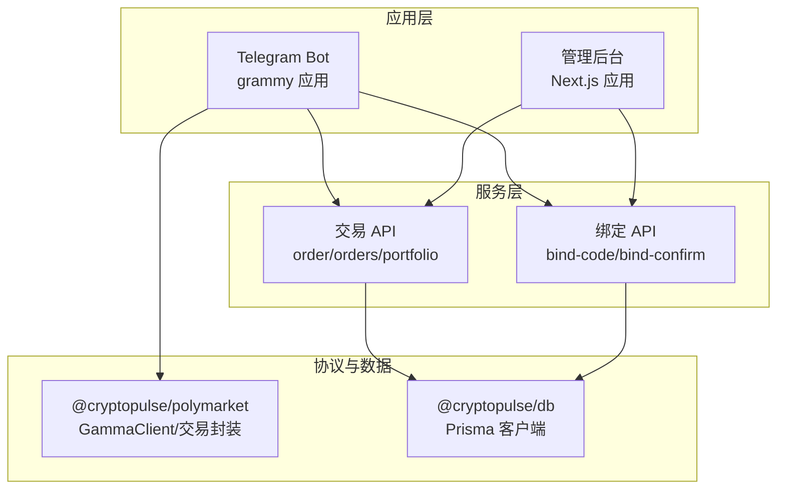
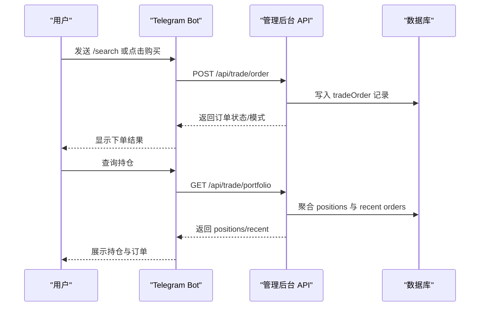
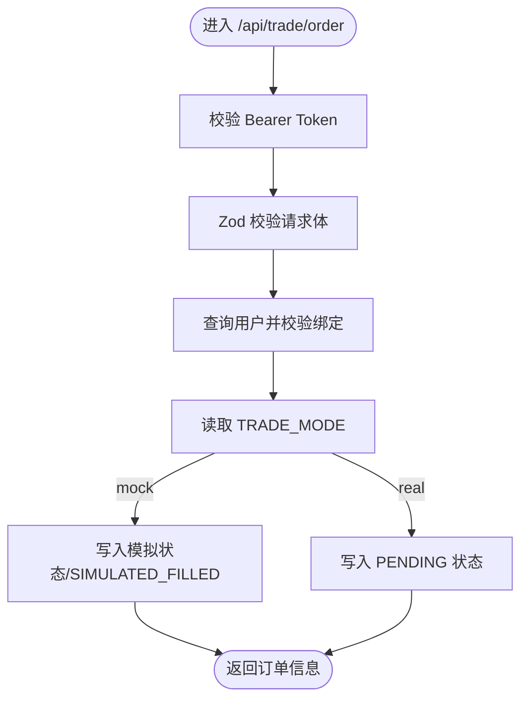
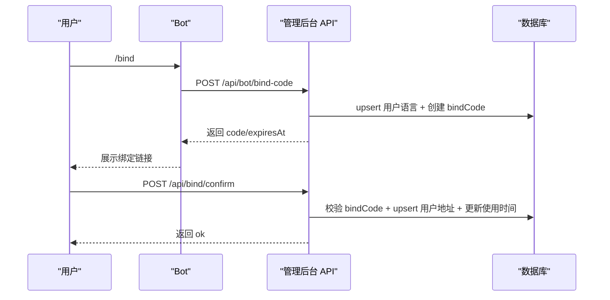
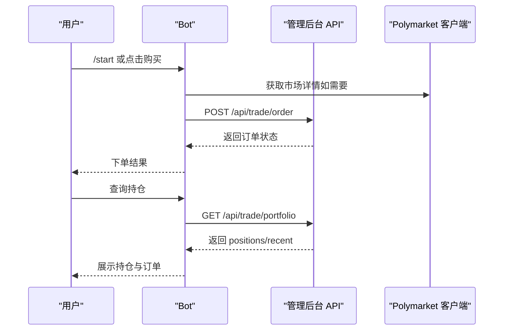
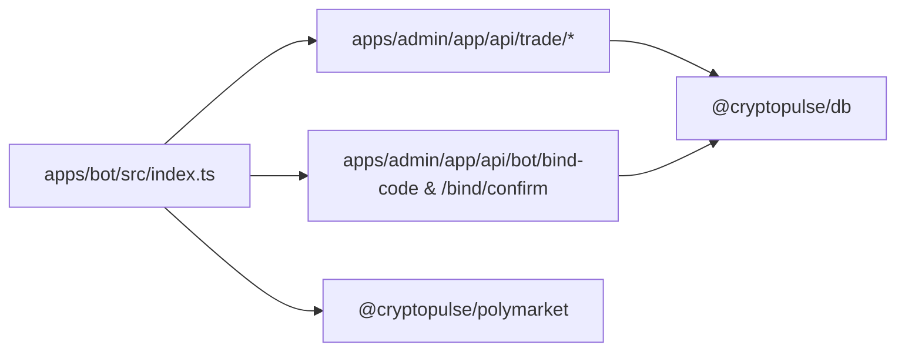

# CTF 操作系统

<cite>
**本文引用的文件**
- [README.md](file://README.md)
- [package.json](file://package.json)
- [apps/admin/app/api/trade/order/route.ts](file://apps/admin/app/api/trade/order/route.ts)
- [apps/admin/app/api/trade/orders/route.ts](file://apps/admin/app/api/trade/orders/route.ts)
- [apps/admin/app/api/trade/portfolio/route.ts](file://apps/admin/app/api/trade/portfolio/route.ts)
- [apps/admin/app/api/bind/confirm/route.ts](file://apps/admin/app/api/bind/confirm/route.ts)
- [apps/admin/app/api/bot/bind-code/route.ts](file://apps/admin/app/api/bot/bind-code/route.ts)
- [apps/admin/app/bind/actions.ts](file://apps/admin/app/bind/actions.ts)
- [apps/bot/src/index.ts](file://apps/bot/src/index.ts)
- [apps/bot/src/trade.ts](file://apps/bot/src/trade.ts)
- [apps/bot/src/portfolio.ts](file://apps/bot/src/portfolio.ts)
- [packages/polymarket/package.json](file://packages/polymarket/package.json)
- [packages/polymarket/src/index.ts](file://packages/polymarket/src/index.ts)
- [packages/db/package.json](file://packages/db/package.json)
</cite>

## 目录
1. [简介](#简介)
2. [项目结构](#项目结构)
3. [核心组件](#核心组件)
4. [架构总览](#架构总览)
5. [详细组件分析](#详细组件分析)
6. [依赖关系分析](#依赖关系分析)
7. [性能考量](#性能考量)
8. [故障排查指南](#故障排查指南)
9. [结论](#结论)
10. [附录](#附录)

## 简介
本技术文档围绕“CTF 操作系统”的目标，系统化梳理仓库中与预测市场交易、用户绑定、订单管理及数据持久化相关的模块与接口。尽管仓库中未直接出现“CTF”“可转换代币”等字眼，但通过分析交易 API、用户绑定流程与 Polymarket 协议交互能力，可以明确该系统以“模拟/真实交易模式”为核心，围绕 Telegram Bot 与管理后台提供从市场浏览、下单、到持仓与订单查询的闭环能力。

本系统的关键特性包括：
- 用户绑定：通过一次性绑定码完成 Telegram 用户与 Polymarket 地址的关联。
- 交易接口：支持买入下单，支持模拟/真实两种交易模式，订单状态与链上哈希在数据库中落盘。
- 持仓与订单查询：基于数据库聚合用户的持仓与最近订单，便于风控与复盘。
- Polymarket 协议集成：通过 @cryptopulse/polymarket 包暴露 GammaClient 与交易相关能力，具备与 Builder/CLOB/Relayer 的交互基础。

## 项目结构
项目采用多包工作区（monorepo）组织，主要目录与职责如下：
- apps/admin：Next.js 管理后台，提供绑定确认、交易订单与持仓查询的 API。
- apps/bot：Telegram Bot，负责用户交互、市场搜索、下单引导与调用后台 API。
- packages/polymarket：封装与 Polymarket 生态交互的客户端与类型定义。
- packages/db：Prisma 客户端与数据库模型，支撑用户、绑定码、交易订单等数据持久化。

图表来源
- [apps/admin/app/api/trade/order/route.ts](file://apps/admin/app/api/trade/order/route.ts#L1-L94)
- [apps/admin/app/api/trade/orders/route.ts](file://apps/admin/app/api/trade/orders/route.ts#L1-L74)
- [apps/admin/app/api/trade/portfolio/route.ts](file://apps/admin/app/api/trade/portfolio/route.ts#L1-L80)
- [apps/admin/app/api/bot/bind-code/route.ts](file://apps/admin/app/api/bot/bind-code/route.ts#L1-L105)
- [apps/admin/app/api/bind/confirm/route.ts](file://apps/admin/app/api/bind/confirm/route.ts#L1-L91)
- [apps/bot/src/index.ts](file://apps/bot/src/index.ts#L1-L156)
- [apps/bot/src/trade.ts](file://apps/bot/src/trade.ts#L1-L118)
- [apps/bot/src/portfolio.ts](file://apps/bot/src/portfolio.ts#L1-L76)
- [packages/polymarket/src/index.ts](file://packages/polymarket/src/index.ts#L1-L11)
- [packages/db/package.json](file://packages/db/package.json#L1-L22)

章节来源
- [README.md](file://README.md#L1-L65)
- [package.json](file://package.json#L1-L18)

## 核心组件
- 交易 API（订单提交、历史查询、持仓聚合）
  - 订单提交：校验授权、解析请求体、读取数据库、根据模式写入订单并返回状态。
  - 历史查询：按用户查询最近订单列表。
  - 持仓聚合：对同一市场的不同选项进行方向性抵消，输出净持仓与最近订单快照。
- 绑定 API（绑定码生成、绑定确认）
  - 绑定码生成：校验授权与参数，生成唯一绑定码并设置过期时间，写入数据库。
  - 绑定确认：校验绑定码有效性与过期，事务更新用户地址信息并标记使用。
- Bot 交互与调用
  - Bot 主命令与回调：提供搜索、分类浏览、下单确认、查询持仓等交互。
  - 下单流程：调用后台 /api/trade/order 提交订单；查询持仓调用 /api/trade/portfolio。
- Polymarket 客户端
  - 导出 GammaClient 与交易相关能力，作为与 Polymarket 生态交互的入口。

章节来源
- [apps/admin/app/api/trade/order/route.ts](file://apps/admin/app/api/trade/order/route.ts#L1-L94)
- [apps/admin/app/api/trade/orders/route.ts](file://apps/admin/app/api/trade/orders/route.ts#L1-L74)
- [apps/admin/app/api/trade/portfolio/route.ts](file://apps/admin/app/api/trade/portfolio/route.ts#L1-L80)
- [apps/admin/app/api/bot/bind-code/route.ts](file://apps/admin/app/api/bot/bind-code/route.ts#L1-L105)
- [apps/admin/app/api/bind/confirm/route.ts](file://apps/admin/app/api/bind/confirm/route.ts#L1-L91)
- [apps/bot/src/index.ts](file://apps/bot/src/index.ts#L1-L156)
- [apps/bot/src/trade.ts](file://apps/bot/src/trade.ts#L1-L118)
- [apps/bot/src/portfolio.ts](file://apps/bot/src/portfolio.ts#L1-L76)
- [packages/polymarket/src/index.ts](file://packages/polymarket/src/index.ts#L1-L11)

## 架构总览
系统采用“Bot 前端 + 管理后台 API + 数据库”的三层架构。Bot 通过 HTTP 调用管理后台提供的 API 实现交易与查询；管理后台通过 Prisma 访问 PostgreSQL；Polymarket 客户端提供与预测市场生态的交互能力。

图表来源
- [apps/bot/src/trade.ts](file://apps/bot/src/trade.ts#L68-L118)
- [apps/admin/app/api/trade/order/route.ts](file://apps/admin/app/api/trade/order/route.ts#L16-L93)
- [apps/admin/app/api/trade/portfolio/route.ts](file://apps/admin/app/api/trade/portfolio/route.ts#L17-L78)
- [apps/bot/src/portfolio.ts](file://apps/bot/src/portfolio.ts#L4-L74)

## 详细组件分析

### 交易 API 组件
- 订单提交（POST /api/trade/order）
  - 授权校验：从请求头提取 Bearer Token，与环境变量 BOT_API_TOKEN 对比。
  - 参数校验：使用 Zod 校验 telegramId、marketId、outcomeIndex、amount、side。
  - 用户绑定检查：查询用户是否存在且已绑定 Polymarket 地址。
  - 模式选择：TRADE_MODE 控制是否为模拟模式（SIMULATED_FILLED），模拟模式下填充 avgPrice 与 txHash。
  - 数据写入：创建 tradeOrder 记录并返回订单关键字段。
- 历史订单查询（GET /api/trade/orders）
  - 授权校验与参数校验同上。
  - 查询最近 limit 条订单并返回标准化结构。
- 持仓聚合（GET /api/trade/portfolio）
  - 授权校验与参数校验同上。
  - 按 marketId:outcomeIndex 聚合方向性抵消后的净持仓，过滤极小值并排序。
  - 返回 positions 与 recentOrders 快照。

图表来源
- [apps/admin/app/api/trade/order/route.ts](file://apps/admin/app/api/trade/order/route.ts#L16-L77)

章节来源
- [apps/admin/app/api/trade/order/route.ts](file://apps/admin/app/api/trade/order/route.ts#L1-L94)
- [apps/admin/app/api/trade/orders/route.ts](file://apps/admin/app/api/trade/orders/route.ts#L1-L74)
- [apps/admin/app/api/trade/portfolio/route.ts](file://apps/admin/app/api/trade/portfolio/route.ts#L1-L80)

### 绑定 API 组件
- 绑定码生成（POST /api/bot/bind-code）
  - 授权校验：要求 BOT_API_TOKEN 或生产环境必须授权。
  - 参数校验：telegramId 与语言。
  - 绑定码生成：随机生成 10 字符唯一码，设置过期时间（10 分钟）。
  - 写入数据库：upsert 用户语言，创建 bindCode 记录，处理唯一约束冲突。
- 绑定确认（POST /api/bind/confirm）
  - 参数校验：code 与可选地址格式校验。
  - 绑定码有效性：查找 bindCode，校验未使用、未过期。
  - 事务更新：upsert 用户地址信息并标记使用时间。

图表来源
- [apps/admin/app/api/bot/bind-code/route.ts](file://apps/admin/app/api/bot/bind-code/route.ts#L34-L102)
- [apps/admin/app/api/bind/confirm/route.ts](file://apps/admin/app/api/bind/confirm/route.ts#L21-L88)

章节来源
- [apps/admin/app/api/bot/bind-code/route.ts](file://apps/admin/app/api/bot/bind-code/route.ts#L1-L105)
- [apps/admin/app/api/bind/confirm/route.ts](file://apps/admin/app/api/bind/confirm/route.ts#L1-L91)
- [apps/admin/app/bind/actions.ts](file://apps/admin/app/bind/actions.ts#L1-L90)

### Bot 交互与调用组件
- Bot 主流程
  - /start：提供绑定、分类浏览、持仓查询等快捷入口。
  - /search：关键词搜索市场。
  - 回调：生成绑定链接、分类浏览、购买确认、取消等。
- 下单流程
  - handleBuy：获取市场详情与选项，校验用户绑定状态，弹出金额选择。
  - handleOrder：构造请求体调用 /api/trade/order，展示下单结果。
- 持仓查询
  - handlePortfolio：调用 /api/trade/portfolio，聚合展示 positions 与 recentOrders。

图表来源
- [apps/bot/src/index.ts](file://apps/bot/src/index.ts#L11-L156)
- [apps/bot/src/trade.ts](file://apps/bot/src/trade.ts#L7-L66)
- [apps/bot/src/portfolio.ts](file://apps/bot/src/portfolio.ts#L4-L74)
- [packages/polymarket/src/index.ts](file://packages/polymarket/src/index.ts#L1-L11)

章节来源
- [apps/bot/src/index.ts](file://apps/bot/src/index.ts#L1-L156)
- [apps/bot/src/trade.ts](file://apps/bot/src/trade.ts#L1-L118)
- [apps/bot/src/portfolio.ts](file://apps/bot/src/portfolio.ts#L1-L76)
- [packages/polymarket/src/index.ts](file://packages/polymarket/src/index.ts#L1-L11)

### Polymarket 客户端与数据持久化
- Polymarket 客户端
  - 导出 GammaClient 与交易相关能力，作为与 Polymarket 生态交互的基础。
- 数据持久化
  - @cryptopulse/db 提供 Prisma 客户端与脚本，支撑用户、绑定码、交易订单等模型。

章节来源
- [packages/polymarket/package.json](file://packages/polymarket/package.json#L1-L23)
- [packages/polymarket/src/index.ts](file://packages/polymarket/src/index.ts#L1-L11)
- [packages/db/package.json](file://packages/db/package.json#L1-L22)

## 依赖关系分析
- Bot 依赖管理后台 API 与 Polymarket 客户端。
- 管理后台 API 依赖数据库（Prisma）。
- Polymarket 客户端依赖 @polymarket/* 与 viem 等库。

图表来源
- [apps/bot/src/index.ts](file://apps/bot/src/index.ts#L1-L156)
- [apps/admin/app/api/trade/order/route.ts](file://apps/admin/app/api/trade/order/route.ts#L1-L94)
- [apps/admin/app/api/bot/bind-code/route.ts](file://apps/admin/app/api/bot/bind-code/route.ts#L1-L105)
- [apps/admin/app/api/bind/confirm/route.ts](file://apps/admin/app/api/bind/confirm/route.ts#L1-L91)
- [packages/polymarket/src/index.ts](file://packages/polymarket/src/index.ts#L1-L11)
- [packages/db/package.json](file://packages/db/package.json#L1-L22)

章节来源
- [package.json](file://package.json#L1-L18)
- [packages/polymarket/package.json](file://packages/polymarket/package.json#L1-L23)
- [packages/db/package.json](file://packages/db/package.json#L1-L22)

## 性能考量
- API 并发与限流：Bot 与管理后台 API 均为无状态服务，建议在网关层引入速率限制与超时控制。
- 数据库写入：订单写入与绑定码生成涉及唯一约束冲突处理，建议在高并发场景下增加重试与幂等设计。
- 持仓聚合复杂度：聚合逻辑为 O(n) 遍历与 Map 操作，n 为订单数，通常可满足中小规模需求；若订单量增长，可考虑数据库侧聚合或缓存优化。
- 交易模式切换：模拟模式下无需链上交互，响应更快；真实模式需等待链上确认，应合理设置超时与重试策略。

## 故障排查指南
- 授权失败
  - 现象：返回 unauthorized。
  - 排查：确认请求头 Authorization 与 BOT_API_TOKEN 是否一致。
- 数据库不可用
  - 现象：返回 database_unavailable 或 prisma_unavailable。
  - 排查：检查 DATABASE_URL 与数据库连通性；确认 Prisma 生成与迁移是否完成。
- 绑定码问题
  - 现象：code_not_found、code_used、code_expired。
  - 排查：确认绑定码是否过期、是否已被使用；检查生成与使用的事务一致性。
- 订单提交失败
  - 现象：invalid_body、invalid_query、user_not_bound、server_error。
  - 排查：核对请求体字段与范围；确认用户已绑定 Polymarket 地址；查看服务端日志定位异常。

章节来源
- [apps/admin/app/api/trade/order/route.ts](file://apps/admin/app/api/trade/order/route.ts#L16-L93)
- [apps/admin/app/api/trade/orders/route.ts](file://apps/admin/app/api/trade/orders/route.ts#L18-L71)
- [apps/admin/app/api/trade/portfolio/route.ts](file://apps/admin/app/api/trade/portfolio/route.ts#L17-L78)
- [apps/admin/app/api/bot/bind-code/route.ts](file://apps/admin/app/api/bot/bind-code/route.ts#L34-L102)
- [apps/admin/app/api/bind/confirm/route.ts](file://apps/admin/app/api/bind/confirm/route.ts#L21-L88)

## 结论
本“CTF 操作系统”以 Bot 与管理后台 API 为核心，结合 Polymarket 客户端与数据库，实现了从用户绑定、市场浏览、下单到持仓查询的完整闭环。系统通过模拟/真实双模式灵活适配测试与生产场景，具备良好的扩展性与可维护性。后续可在链上交互、风控策略与收益计量方面进一步深化，以满足更复杂的预测市场操作需求。

## 附录
- 环境变量与部署要点
  - 数据库初始化：参考根目录 README 中 Prisma 初始化与迁移说明。
  - 开发与运行：管理后台与 Bot 的启动脚本与访问路径见根目录 README。
- 最佳实践
  - 强制授权：所有交易与绑定 API 均需 BOT_API_TOKEN。
  - 幂等与重试：订单与绑定码生成应具备幂等与重试机制。
  - 日志与监控：完善服务端错误日志与关键指标埋点，便于快速定位问题。

章节来源
- [README.md](file://README.md#L1-L65)
- [package.json](file://package.json#L1-L18)