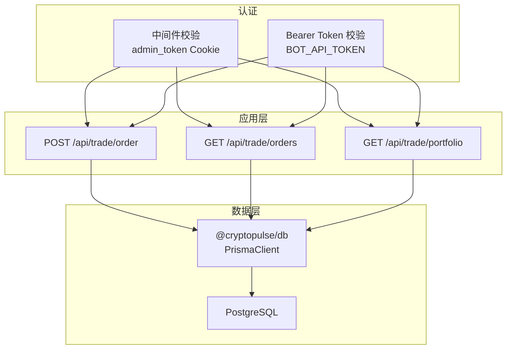
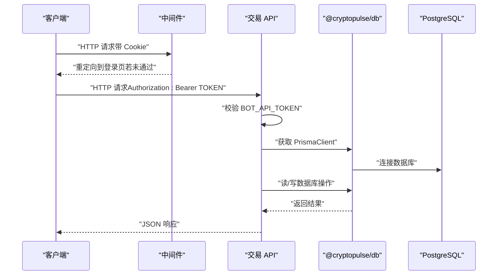
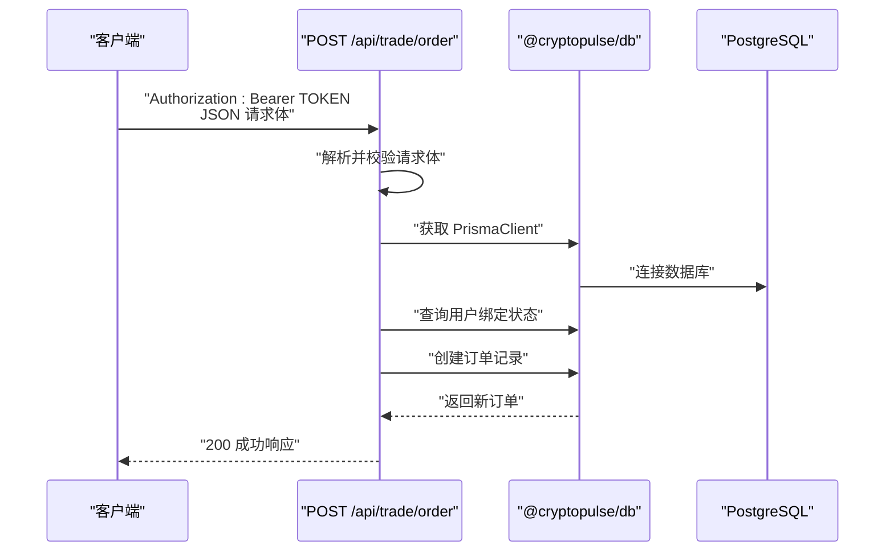
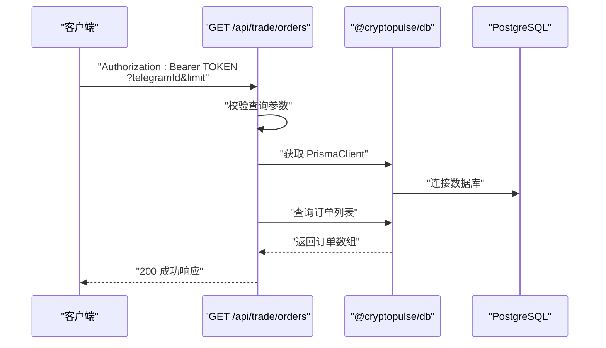
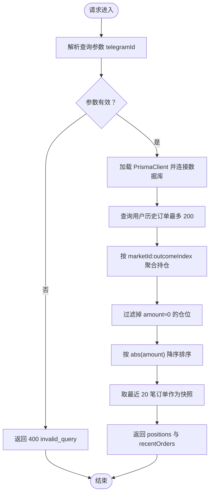
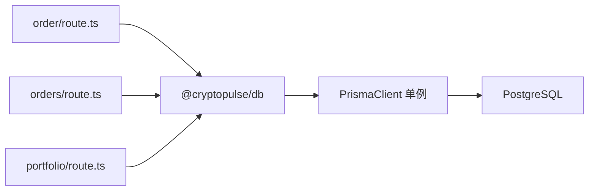

# 交易 API 接口

<cite>
**本文档引用的文件**
- [apps/admin/app/api/trade/order/route.ts](file://apps/admin/app/api/trade/order/route.ts)
- [apps/admin/app/api/trade/orders/route.ts](file://apps/admin/app/api/trade/orders/route.ts)
- [apps/admin/app/api/trade/portfolio/route.ts](file://apps/admin/app/api/trade/portfolio/route.ts)
- [apps/admin/middleware.ts](file://apps/admin/middleware.ts)
- [packages/db/src/index.ts](file://packages/db/src/index.ts)
- [test/trade-order.test.ts](file://test/trade-order.test.ts)
- [test/trade-portfolio.test.ts](file://test/trade-portfolio.test.ts)
- [README.md](file://README.md)
</cite>

## 目录
1. [简介](#简介)
2. [项目结构](#项目结构)
3. [核心组件](#核心组件)
4. [架构总览](#架构总览)
5. [详细组件分析](#详细组件分析)
6. [依赖关系分析](#依赖关系分析)
7. [性能考虑](#性能考虑)
8. [故障排除指南](#故障排除指南)
9. [结论](#结论)
10. [附录](#附录)

## 简介
本文件为交易 API 接口的完整技术文档，覆盖以下端点：
- 订单创建：POST /api/trade/order
- 订单查询：GET /api/trade/orders
- 仓位查询：GET /api/trade/portfolio

文档内容包括：
- 请求/响应格式、参数说明、数据类型与约束
- 认证机制（Bearer Token）与权限控制
- 错误处理策略（错误码、错误消息、异常场景）
- 使用示例（curl 命令与客户端调用参考）
- 性能考量、速率限制与最佳实践

## 项目结构
交易 API 位于 Next.js 应用的 app/api 路由中，采用路径式路由组织：
- /api/trade/order → 订单创建
- /api/trade/orders → 订单列表查询
- /api/trade/portfolio → 仓位与最近订单查询

认证中间件保护管理后台路由，交易 API 通过环境变量 BOT_API_TOKEN 进行 Bearer Token 校验。

图表来源
- [apps/admin/app/api/trade/order/route.ts](file://apps/admin/app/api/trade/order/route.ts#L16-L93)
- [apps/admin/app/api/trade/orders/route.ts](file://apps/admin/app/api/trade/orders/route.ts#L18-L71)
- [apps/admin/app/api/trade/portfolio/route.ts](file://apps/admin/app/api/trade/portfolio/route.ts#L17-L77)
- [apps/admin/middleware.ts](file://apps/admin/middleware.ts#L3-L16)
- [packages/db/src/index.ts](file://packages/db/src/index.ts#L1-L12)

章节来源
- [apps/admin/app/api/trade/order/route.ts](file://apps/admin/app/api/trade/order/route.ts#L1-L94)
- [apps/admin/app/api/trade/orders/route.ts](file://apps/admin/app/api/trade/orders/route.ts#L1-L74)
- [apps/admin/app/api/trade/portfolio/route.ts](file://apps/admin/app/api/trade/portfolio/route.ts#L1-L80)
- [apps/admin/middleware.ts](file://apps/admin/middleware.ts#L1-L23)
- [packages/db/src/index.ts](file://packages/db/src/index.ts#L1-L13)

## 核心组件
- 订单创建接口：接收订单参数，进行 Bearer Token 校验与请求体验证，查询用户绑定状态，写入数据库并返回订单结果。
- 订单列表接口：根据 telegramId 查询历史订单，支持 limit 参数限制返回数量。
- 仓位查询接口：基于用户历史订单计算持仓汇总，并返回最近订单快照。
- 认证与中间件：管理后台访问受 Cookie 校验保护，交易 API 受 Bearer Token 校验保护。
- 数据访问：统一通过 @cryptopulse/db 提供的 PrismaClient 访问 PostgreSQL。

章节来源
- [apps/admin/app/api/trade/order/route.ts](file://apps/admin/app/api/trade/order/route.ts#L16-L93)
- [apps/admin/app/api/trade/orders/route.ts](file://apps/admin/app/api/trade/orders/route.ts#L18-L71)
- [apps/admin/app/api/trade/portfolio/route.ts](file://apps/admin/app/api/trade/portfolio/route.ts#L17-L77)
- [apps/admin/middleware.ts](file://apps/admin/middleware.ts#L3-L16)
- [packages/db/src/index.ts](file://packages/db/src/index.ts#L1-L12)

## 架构总览
交易 API 的调用链路如下：

图表来源
- [apps/admin/middleware.ts](file://apps/admin/middleware.ts#L3-L16)
- [apps/admin/app/api/trade/order/route.ts](file://apps/admin/app/api/trade/order/route.ts#L16-L93)
- [apps/admin/app/api/trade/orders/route.ts](file://apps/admin/app/api/trade/orders/route.ts#L18-L71)
- [apps/admin/app/api/trade/portfolio/route.ts](file://apps/admin/app/api/trade/portfolio/route.ts#L17-L77)
- [packages/db/src/index.ts](file://packages/db/src/index.ts#L1-L12)

## 详细组件分析

### 接口一：订单创建 POST /api/trade/order
- 功能：创建交易订单，支持模拟模式与真实模式。
- 认证：需要 Authorization: Bearer <TOKEN>，TOKEN 必须与 BOT_API_TOKEN 匹配。
- 请求体参数
  - telegramId: number（正整数）
  - marketId: string（非空）
  - outcomeIndex: number（非负整数）
  - amount: number（正数）
  - side: "BUY" | "SELL"
- 成功响应字段
  - success: boolean
  - mode: "mock" | "real"
  - id: string（数据库主键）
  - orderId: string（业务订单号）
  - status: "PENDING" | "SIMULATED_FILLED"
  - filledAmount: number
  - avgPrice: number|null
  - txHash: string|null
- 错误码
  - 400: invalid_json、invalid_body、user_not_bound、server_error
  - 401: unauthorized
  - 500: server_error
  - 503: database_unavailable、prisma_unavailable

图表来源
- [apps/admin/app/api/trade/order/route.ts](file://apps/admin/app/api/trade/order/route.ts#L16-L93)
- [packages/db/src/index.ts](file://packages/db/src/index.ts#L1-L12)

章节来源
- [apps/admin/app/api/trade/order/route.ts](file://apps/admin/app/api/trade/order/route.ts#L8-L14)
- [apps/admin/app/api/trade/order/route.ts](file://apps/admin/app/api/trade/order/route.ts#L16-L93)
- [test/trade-order.test.ts](file://test/trade-order.test.ts#L50-L105)

### 接口二：订单列表 GET /api/trade/orders
- 功能：按 telegramId 查询历史订单，默认最多 20 条，最大 100 条。
- 认证：需要 Authorization: Bearer <TOKEN>，TOKEN 必须与 BOT_API_TOKEN 匹配。
- 查询参数
  - telegramId: number（正整数）
  - limit: number（1~100，可选）
- 响应字段
  - orders: 数组，每项包含 id、marketId、outcomeIndex、side、amount、status、orderId、avgPrice、txHash、createdAt
- 错误码
  - 400: invalid_query
  - 401: unauthorized
  - 500: server_error
  - 503: database_unavailable、prisma_unavailable

图表来源
- [apps/admin/app/api/trade/orders/route.ts](file://apps/admin/app/api/trade/orders/route.ts#L18-L71)
- [packages/db/src/index.ts](file://packages/db/src/index.ts#L1-L12)

章节来源
- [apps/admin/app/api/trade/orders/route.ts](file://apps/admin/app/api/trade/orders/route.ts#L7-L10)
- [apps/admin/app/api/trade/orders/route.ts](file://apps/admin/app/api/trade/orders/route.ts#L36-L46)
- [apps/admin/app/api/trade/orders/route.ts](file://apps/admin/app/api/trade/orders/route.ts#L48-L68)

### 接口三：仓位查询 GET /api/trade/portfolio
- 功能：计算用户持仓汇总（按市场+结果聚合），并返回最近订单快照。
- 认证：需要 Authorization: Bearer <TOKEN>，TOKEN 必须与 BOT_API_TOKEN 匹配。
- 查询参数
  - telegramId: number（正整数）
- 响应字段
  - positions: 持仓数组，每项包含 marketId、outcomeIndex、amount（仅保留非零绝对值）
  - recentOrders: 最近订单快照数组（最多 20 条）
- 错误码
  - 400: invalid_query
  - 401: unauthorized
  - 500: server_error
  - 503: database_unavailable、prisma_unavailable

图表来源
- [apps/admin/app/api/trade/portfolio/route.ts](file://apps/admin/app/api/trade/portfolio/route.ts#L17-L77)

章节来源
- [apps/admin/app/api/trade/portfolio/route.ts](file://apps/admin/app/api/trade/portfolio/route.ts#L7-L9)
- [apps/admin/app/api/trade/portfolio/route.ts](file://apps/admin/app/api/trade/portfolio/route.ts#L42-L74)

### 认证与权限控制
- 管理后台访问
  - 通过中间件校验 Cookie 中的 admin_token，未设置或不匹配则重定向至登录页。
- 交易 API 访问
  - 通过 Authorization 头中的 Bearer Token 校验，要求与 BOT_API_TOKEN 完全一致。
- 环境变量
  - BOT_API_TOKEN：交易 API 的访问令牌
  - DATABASE_URL：数据库连接串
  - TRADE_MODE：可选，"mock" 时订单状态为模拟填充

章节来源
- [apps/admin/middleware.ts](file://apps/admin/middleware.ts#L3-L16)
- [apps/admin/app/api/trade/order/route.ts](file://apps/admin/app/api/trade/order/route.ts#L17-L23)
- [apps/admin/app/api/trade/orders/route.ts](file://apps/admin/app/api/trade/orders/route.ts#L19-L22)
- [apps/admin/app/api/trade/portfolio/route.ts](file://apps/admin/app/api/trade/portfolio/route.ts#L17-L22)

### 错误处理策略
- 通用错误响应格式
  - { error: string, details?: any }
- 典型错误码与场景
  - 400：invalid_json（请求体非 JSON）、invalid_body（参数校验失败）、invalid_query（查询参数非法）、user_not_bound（用户未绑定钱包地址）、server_error（内部异常）
  - 401：unauthorized（令牌缺失或不匹配）
  - 500：server_error（数据库或业务异常）
  - 503：database_unavailable（DATABASE_URL 未配置）、prisma_unavailable（无法加载 PrismaClient）

章节来源
- [apps/admin/app/api/trade/order/route.ts](file://apps/admin/app/api/trade/order/route.ts#L25-L35)
- [apps/admin/app/api/trade/order/route.ts](file://apps/admin/app/api/trade/order/route.ts#L39-L48)
- [apps/admin/app/api/trade/order/route.ts](file://apps/admin/app/api/trade/order/route.ts#L89-L92)
- [apps/admin/app/api/trade/orders/route.ts](file://apps/admin/app/api/trade/orders/route.ts#L41-L43)
- [apps/admin/app/api/trade/orders/route.ts](file://apps/admin/app/api/trade/orders/route.ts#L25-L34)
- [apps/admin/app/api/trade/portfolio/route.ts](file://apps/admin/app/api/trade/portfolio/route.ts#L36-L39)
- [apps/admin/app/api/trade/portfolio/route.ts](file://apps/admin/app/api/trade/portfolio/route.ts#L24-L33)

### 使用示例
- curl 示例（请替换为实际值）
  - 创建订单
    - curl -X POST http://localhost:3000/api/trade/order \
      -H "Authorization: Bearer YOUR_BOT_API_TOKEN" \
      -H "Content-Type: application/json" \
      -d '{"telegramId":12345,"marketId":"m1","outcomeIndex":0,"amount":10,"side":"BUY"}'
  - 查询订单列表
    - curl "http://localhost:3000/api/trade/orders?telegramId=12345&limit=20" \
      -H "Authorization: Bearer YOUR_BOT_API_TOKEN"
  - 查询仓位
    - curl "http://localhost:3000/api/trade/portfolio?telegramId=12345" \
      -H "Authorization: Bearer YOUR_BOT_API_TOKEN"
- 客户端调用要点
  - 设置 Authorization: Bearer <TOKEN>
  - 正确传递查询参数 telegramId
  - 对于订单创建，确保 amount、outcomeIndex、side 等参数满足约束

章节来源
- [apps/admin/app/api/trade/order/route.ts](file://apps/admin/app/api/trade/order/route.ts#L37-L37)
- [apps/admin/app/api/trade/orders/route.ts](file://apps/admin/app/api/trade/orders/route.ts#L36-L46)
- [apps/admin/app/api/trade/portfolio/route.ts](file://apps/admin/app/api/trade/portfolio/route.ts#L35-L41)

## 依赖关系分析
- 交易 API 依赖 @cryptopulse/db 提供的 PrismaClient 实例
- PrismaClient 通过全局单例持有，避免重复初始化
- 数据库为 PostgreSQL，使用 Prisma 管理迁移与生成

图表来源
- [apps/admin/app/api/trade/order/route.ts](file://apps/admin/app/api/trade/order/route.ts#L45-L48)
- [apps/admin/app/api/trade/orders/route.ts](file://apps/admin/app/api/trade/orders/route.ts#L31-L34)
- [apps/admin/app/api/trade/portfolio/route.ts](file://apps/admin/app/api/trade/portfolio/route.ts#L29-L33)
- [packages/db/src/index.ts](file://packages/db/src/index.ts#L1-L12)

章节来源
- [packages/db/src/index.ts](file://packages/db/src/index.ts#L1-L12)
- [apps/admin/app/api/trade/order/route.ts](file://apps/admin/app/api/trade/order/route.ts#L43-L48)
- [apps/admin/app/api/trade/orders/route.ts](file://apps/admin/app/api/trade/orders/route.ts#L29-L34)
- [apps/admin/app/api/trade/portfolio/route.ts](file://apps/admin/app/api/trade/portfolio/route.ts#L28-L33)

## 性能考虑
- 数据库连接
  - 通过 @cryptopulse/db 的全局单例复用 PrismaClient，减少连接开销
- 查询优化
  - 订单列表默认限制 20 条，最大 100 条，避免一次性返回过多数据
  - 仓位查询最多扫描 200 条历史订单，再做内存聚合与排序
- 模拟模式
  - 当 TRADE_MODE="mock" 时，订单状态为模拟填充，无需外部链上交互，降低延迟
- 建议
  - 控制查询范围（合理设置 limit）
  - 对高频查询增加缓存策略（如最近订单快照）
  - 在生产环境启用数据库连接池与索引优化

章节来源
- [apps/admin/app/api/trade/orders/route.ts](file://apps/admin/app/api/trade/orders/route.ts#L8-L10)
- [apps/admin/app/api/trade/orders/route.ts](file://apps/admin/app/api/trade/orders/route.ts#L46-L53)
- [apps/admin/app/api/trade/portfolio/route.ts](file://apps/admin/app/api/trade/portfolio/route.ts#L46-L59)
- [apps/admin/app/api/trade/order/route.ts](file://apps/admin/app/api/trade/order/route.ts#L61-L76)

## 故障排除指南
- 401 未授权
  - 检查 Authorization 头是否为 Bearer TOKEN，且与 BOT_API_TOKEN 完全一致
- 400 参数错误
  - invalid_json：请求体不是合法 JSON
  - invalid_body：请求体字段不符合约束
  - invalid_query：查询参数 telegramId/limit 不合法
  - user_not_bound：用户未绑定 Polymarket 地址
- 500 服务器错误
  - 数据库异常或业务逻辑抛出异常
- 503 服务不可用
  - DATABASE_URL 未配置或 PrismaClient 加载失败
- 测试参考
  - 订单创建与用户绑定测试
  - 仓位查询与持仓聚合测试

章节来源
- [apps/admin/app/api/trade/order/route.ts](file://apps/admin/app/api/trade/order/route.ts#L25-L35)
- [apps/admin/app/api/trade/order/route.ts](file://apps/admin/app/api/trade/order/route.ts#L39-L48)
- [apps/admin/app/api/trade/orders/route.ts](file://apps/admin/app/api/trade/orders/route.ts#L41-L43)
- [apps/admin/app/api/trade/portfolio/route.ts](file://apps/admin/app/api/trade/portfolio/route.ts#L36-L39)
- [test/trade-order.test.ts](file://test/trade-order.test.ts#L50-L78)
- [test/trade-portfolio.test.ts](file://test/trade-portfolio.test.ts#L49-L94)

## 结论
交易 API 提供了简洁明确的订单创建、查询与仓位计算能力，配合严格的 Bearer Token 认证与参数校验，保证了安全性与稳定性。通过模拟模式与合理的查询限制，兼顾了开发效率与性能表现。建议在生产环境中完善缓存、限流与监控策略，持续优化用户体验与系统可靠性。

## 附录
- 环境变量
  - BOT_API_TOKEN：交易 API 访问令牌
  - DATABASE_URL：PostgreSQL 连接串
  - TRADE_MODE：可选，"mock" 时订单状态为模拟填充
- 数据库初始化
  - 生成 Prisma 客户端与部署迁移
- 管理后台
  - 通过 ADMIN_TOKEN 与 Cookie 校验保护

章节来源
- [README.md](file://README.md#L20-L39)
- [apps/admin/middleware.ts](file://apps/admin/middleware.ts#L4-L14)
- [apps/admin/app/api/trade/order/route.ts](file://apps/admin/app/api/trade/order/route.ts#L17-L23)
- [apps/admin/app/api/trade/order/route.ts](file://apps/admin/app/api/trade/order/route.ts#L61-L61)