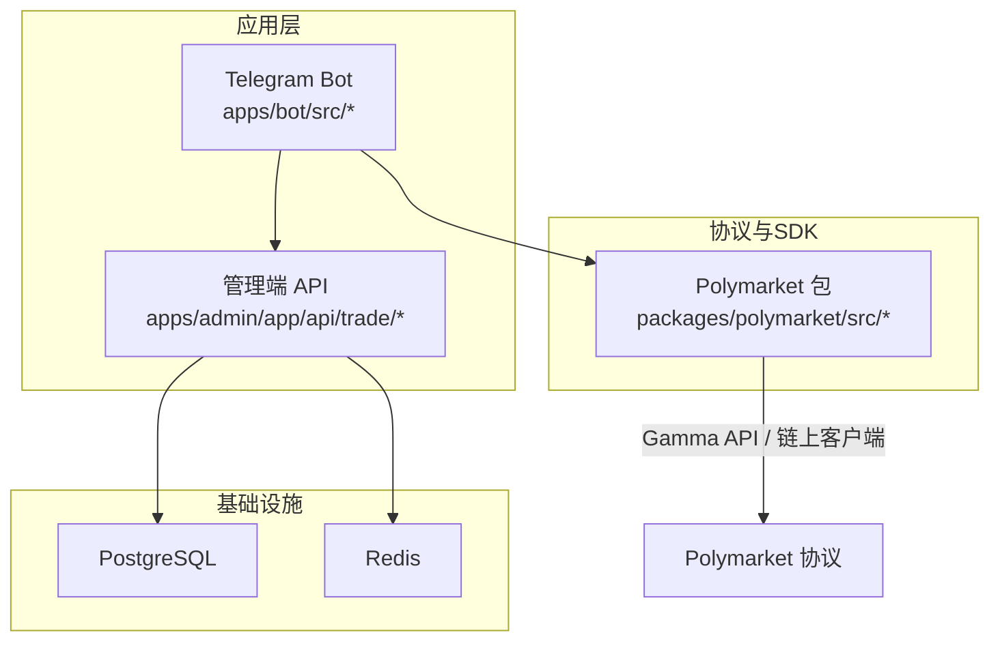
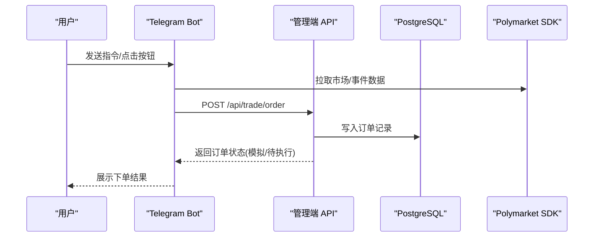
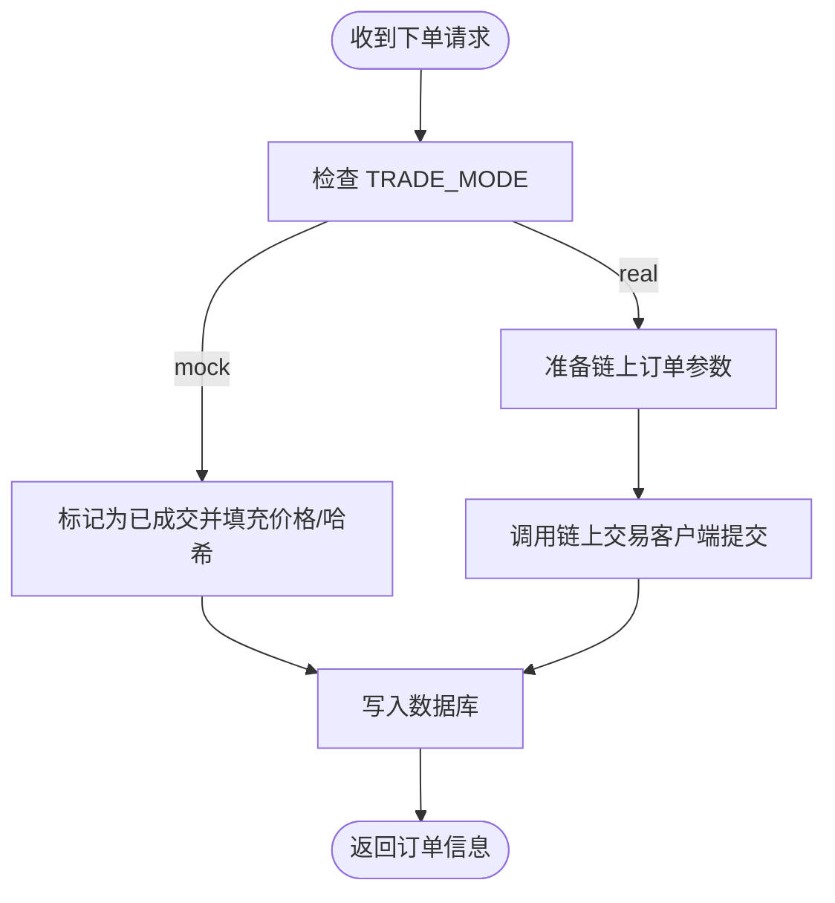
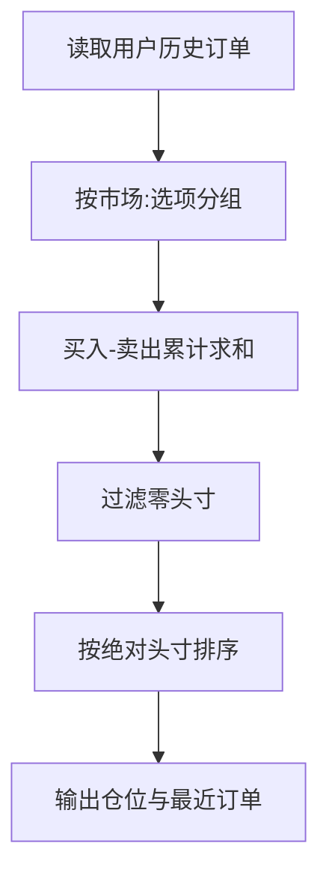
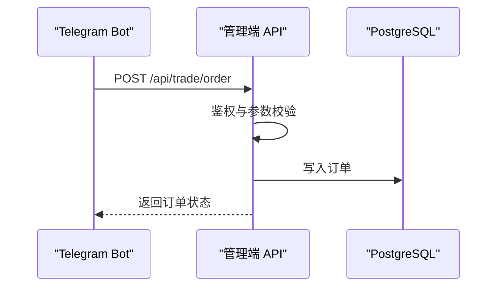
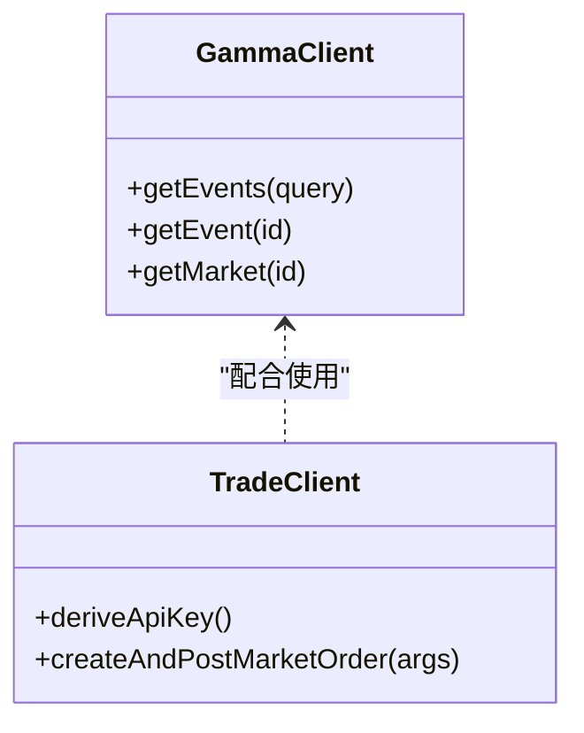
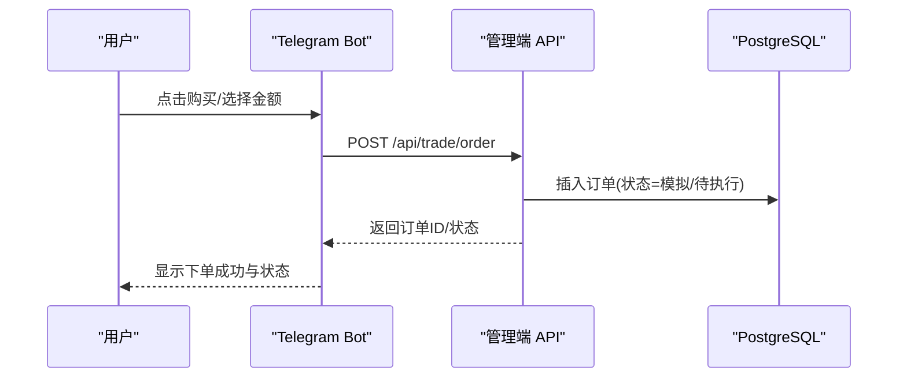
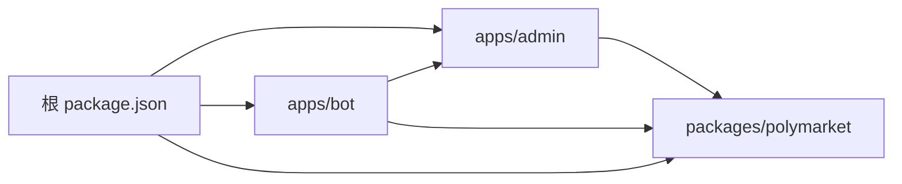

# 交易执行系统

<cite>
**本文引用的文件**
- [README.md](file://README.md)
- [docker-compose.yml](file://docker-compose.yml)
- [package.json](file://package.json)
- [apps/admin/app/api/trade/order/route.ts](file://apps/admin/app/api/trade/order/route.ts)
- [apps/admin/app/api/trade/orders/route.ts](file://apps/admin/app/api/trade/orders/route.ts)
- [apps/admin/app/api/trade/portfolio/route.ts](file://apps/admin/app/api/trade/portfolio/route.ts)
- [apps/bot/src/index.ts](file://apps/bot/src/index.ts)
- [apps/bot/src/env.ts](file://apps/bot/src/env.ts)
- [apps/bot/src/trade.ts](file://apps/bot/src/trade.ts)
- [apps/bot/src/portfolio.ts](file://apps/bot/src/portfolio.ts)
- [packages/polymarket/package.json](file://packages/polymarket/package.json)
- [packages/polymarket/src/index.ts](file://packages/polymarket/src/index.ts)
- [packages/polymarket/src/gamma.ts](file://packages/polymarket/src/gamma.ts)
- [packages/polymarket/src/trade.ts](file://packages/polymarket/src/trade.ts)
- [test/trade-order.test.ts](file://test/trade-order.test.ts)
- [test/trade-portfolio.test.ts](file://test/trade-portfolio.test.ts)
</cite>

## 目录
1. [简介](#简介)
2. [项目结构](#项目结构)
3. [核心组件](#核心组件)
4. [架构总览](#架构总览)
5. [详细组件分析](#详细组件分析)
6. [依赖关系分析](#依赖关系分析)
7. [性能考虑](#性能考虑)
8. [故障排查指南](#故障排查指南)
9. [结论](#结论)
10. [附录](#附录)

## 简介
本文件为交易执行系统的详细技术文档，覆盖订单管理机制（市价/限价）、仓位跟踪、CTF操作（可转换代币）原理、交易 API 设计与实现、配置参数与校验、错误处理以及与 Polymarket 协议的交互方式与区块链网络集成。系统采用多工作区结构，前端管理端通过 Next.js 提供交易 API，Telegram Bot 作为用户入口，Polymarket SDK 用于市场数据与链上交易。

## 项目结构
- 工作区布局：根目录通过 workspaces 管理 apps 与 packages 子项目
- apps/admin：Next.js 应用，提供交易 API（订单创建、订单查询、仓位查询）
- apps/bot：Telegram Bot，负责用户交互、下单触发与仓位查询
- packages/polymarket：封装 Polymarket Gamma API 与链上交易客户端
- 测试：针对订单与仓位接口的单元测试

图表来源
- [package.json](file://package.json#L4-L6)
- [apps/admin/app/api/trade/order/route.ts](file://apps/admin/app/api/trade/order/route.ts#L1-L94)
- [apps/bot/src/index.ts](file://apps/bot/src/index.ts#L1-L156)
- [packages/polymarket/src/index.ts](file://packages/polymarket/src/index.ts#L1-L11)

章节来源
- [README.md](file://README.md#L1-L65)
- [package.json](file://package.json#L1-L18)
- [docker-compose.yml](file://docker-compose.yml#L1-L24)

## 核心组件
- 订单 API：接收 Bot 请求，鉴权后写入数据库，返回订单状态（模拟模式下直接返回已成交）
- 订单列表 API：按用户查询历史订单
- 仓位 API：聚合用户订单，计算持仓并返回最近订单
- Bot 交互：提供绑定、搜索、下单、查询仓位等能力
- Polymarket SDK：封装 Gamma API（市场/事件数据）与链上交易客户端（CLOB）

章节来源
- [apps/admin/app/api/trade/order/route.ts](file://apps/admin/app/api/trade/order/route.ts#L16-L93)
- [apps/admin/app/api/trade/orders/route.ts](file://apps/admin/app/api/trade/orders/route.ts#L18-L72)
- [apps/admin/app/api/trade/portfolio/route.ts](file://apps/admin/app/api/trade/portfolio/route.ts#L17-L78)
- [apps/bot/src/index.ts](file://apps/bot/src/index.ts#L11-L156)
- [packages/polymarket/src/gamma.ts](file://packages/polymarket/src/gamma.ts#L116-L177)
- [packages/polymarket/src/trade.ts](file://packages/polymarket/src/trade.ts#L5-L28)

## 架构总览
系统以 Bot 为入口，调用管理端 API 完成订单创建与查询；管理端通过 Prisma 访问 PostgreSQL，Redis 作为可选缓存；Bot 侧通过 Polymarket SDK 获取市场数据与执行链上交易。

图表来源
- [apps/bot/src/trade.ts](file://apps/bot/src/trade.ts#L68-L116)
- [apps/admin/app/api/trade/order/route.ts](file://apps/admin/app/api/trade/order/route.ts#L50-L88)
- [packages/polymarket/src/gamma.ts](file://packages/polymarket/src/gamma.ts#L163-L175)

## 详细组件分析

### 订单管理机制（市价/限价）
- 市价订单：由 Bot 触发，管理端 API 接收请求后根据 TRADE_MODE 决定状态（模拟模式直接返回已成交），非模拟模式应接入链上交易客户端
- 限价订单：当前最小实现未体现限价逻辑，可在现有框架中扩展（新增字段与状态机）
- 执行策略：模拟模式下直接落库并返回固定状态；真实模式下应调用链上交易客户端创建并提交订单

图表来源
- [apps/admin/app/api/trade/order/route.ts](file://apps/admin/app/api/trade/order/route.ts#L61-L77)
- [packages/polymarket/src/trade.ts](file://packages/polymarket/src/trade.ts#L19-L27)

章节来源
- [apps/admin/app/api/trade/order/route.ts](file://apps/admin/app/api/trade/order/route.ts#L16-L93)
- [packages/polymarket/src/trade.ts](file://packages/polymarket/src/trade.ts#L5-L28)

### 仓位跟踪与资金管理
- 仓位计算：按市场ID+选项索引聚合买入/卖出数量，正负抵消后保留净头寸
- 资金管理：当前实现未包含资金余额与保证金控制，建议在用户表中引入资金字段并在下单前进行可用余额校验
- 风险控制：建议增加最大持仓限制、止损止盈与最大回撤阈值（当前未实现）

图表来源
- [apps/admin/app/api/trade/portfolio/route.ts](file://apps/admin/app/api/trade/portfolio/route.ts#L49-L59)

章节来源
- [apps/admin/app/api/trade/portfolio/route.ts](file://apps/admin/app/api/trade/portfolio/route.ts#L17-L78)

### CTF 操作与可转换代币
- 当前代码未实现 CTF（可转换代币）相关逻辑
- 建议：在 Polymarket SDK 中扩展 TokenID 与 CLOB 交易映射，新增 CTF 兑换/归还流程，并在订单模型中增加 tokenID 字段以区分不同资产类型

章节来源
- [packages/polymarket/src/trade.ts](file://packages/polymarket/src/trade.ts#L19-L27)
- [apps/admin/app/api/trade/order/route.ts](file://apps/admin/app/api/trade/order/route.ts#L65-L76)

### 交易 API 设计与实现
- 订单创建（POST /api/trade/order）
  - 鉴权：Authorization Bearer 校验
  - 参数校验：Zod Schema 校验 telegramId、marketId、outcomeIndex、amount、side
  - 用户绑定校验：要求用户已绑定 Polymarket 地址
  - 模式切换：TRADE_MODE 控制是否模拟成交
  - 返回：订单ID、状态、均价、交易哈希等
- 订单查询（GET /api/trade/orders）
  - 支持 telegramId 与 limit 查询
- 仓位查询（GET /api/trade/portfolio）
  - 返回 positions 与 recentOrders

图表来源
- [apps/bot/src/trade.ts](file://apps/bot/src/trade.ts#L80-L93)
- [apps/admin/app/api/trade/order/route.ts](file://apps/admin/app/api/trade/order/route.ts#L16-L88)

章节来源
- [apps/admin/app/api/trade/order/route.ts](file://apps/admin/app/api/trade/order/route.ts#L16-L93)
- [apps/admin/app/api/trade/orders/route.ts](file://apps/admin/app/api/trade/orders/route.ts#L18-L72)
- [apps/admin/app/api/trade/portfolio/route.ts](file://apps/admin/app/api/trade/portfolio/route.ts#L17-L78)

### 与 Polymarket 协议的交互
- 市场数据：通过 GammaClient 拉取事件与市场信息
- 链上交易：通过 TradeClient 创建并提交市价订单（FOK 成交）
- 网络集成：CLOB 主机与链ID可通过环境变量配置

图表来源
- [packages/polymarket/src/gamma.ts](file://packages/polymarket/src/gamma.ts#L116-L177)
- [packages/polymarket/src/trade.ts](file://packages/polymarket/src/trade.ts#L5-L28)

章节来源
- [packages/polymarket/src/gamma.ts](file://packages/polymarket/src/gamma.ts#L116-L177)
- [packages/polymarket/src/trade.ts](file://packages/polymarket/src/trade.ts#L5-L28)
- [packages/polymarket/package.json](file://packages/polymarket/package.json#L11-L17)

### 配置参数、参数验证与错误处理
- 环境变量
  - TELEGRAM_BOT_TOKEN：Bot 密钥
  - API_BASE_URL：管理端 API 基础地址
  - WEB_BASE_URL：绑定页面域名
  - BOT_API_TOKEN：管理端 API 访问令牌
  - DATABASE_URL：PostgreSQL 连接串
  - REDIS_URL：Redis 连接串（可选）
  - TRADE_MODE：交易模式（mock/real）
- 参数校验
  - Zod Schema 对请求体与查询参数进行严格校验
- 错误处理
  - 401 未授权、400 参数错误、503 数据库不可用、500 服务器错误
  - Bot 侧统一捕获异常并反馈用户

章节来源
- [apps/bot/src/env.ts](file://apps/bot/src/env.ts#L3-L12)
- [apps/admin/app/api/trade/order/route.ts](file://apps/admin/app/api/trade/order/route.ts#L17-L35)
- [apps/admin/app/api/trade/orders/route.ts](file://apps/admin/app/api/trade/orders/route.ts#L19-L43)
- [apps/admin/app/api/trade/portfolio/route.ts](file://apps/admin/app/api/trade/portfolio/route.ts#L18-L39)
- [apps/bot/src/index.ts](file://apps/bot/src/index.ts#L150-L152)

### 交易流程完整示例
以下为从用户下单到订单执行的完整流程（含模拟模式）：

图表来源
- [apps/bot/src/trade.ts](file://apps/bot/src/trade.ts#L68-L116)
- [apps/admin/app/api/trade/order/route.ts](file://apps/admin/app/api/trade/order/route.ts#L50-L88)

章节来源
- [apps/bot/src/trade.ts](file://apps/bot/src/trade.ts#L68-L116)
- [apps/admin/app/api/trade/order/route.ts](file://apps/admin/app/api/trade/order/route.ts#L50-L88)

## 依赖关系分析
- 工作区依赖：根 package.json 声明工作区，管理各子项目构建与脚本
- Polymarket 包：依赖 @polymarket/clob-client、@polymarket/builder-* 等 SDK
- Bot 与管理端：通过 API_BASE_URL 与 BOT_API_TOKEN 进行通信

图表来源
- [package.json](file://package.json#L4-L6)

章节来源
- [package.json](file://package.json#L1-L18)
- [packages/polymarket/package.json](file://packages/polymarket/package.json#L11-L17)

## 性能考虑
- 数据库连接：使用 Prisma 客户端，建议启用连接池与只读副本
- 缓存策略：Redis 可用于缓存市场数据与近期订单，降低数据库压力
- 并发控制：Bot 侧批量下单时应限制并发，避免 API 限流
- 日志与监控：对订单创建与查询接口增加指标埋点

## 故障排查指南
- 订单创建失败
  - 检查 BOT_API_TOKEN 是否正确配置
  - 确认用户已绑定 Polymarket 地址
  - 查看管理端日志与数据库连接状态
- 仓位查询异常
  - 核对 telegramId 与 limit 参数范围
  - 确保数据库迁移已执行
- Bot 交互问题
  - 检查 TELEGRAM_BOT_TOKEN 与 API_BASE_URL
  - 关注 Bot 异常捕获日志

章节来源
- [apps/admin/app/api/trade/order/route.ts](file://apps/admin/app/api/trade/order/route.ts#L17-L35)
- [apps/admin/app/api/trade/portfolio/route.ts](file://apps/admin/app/api/trade/portfolio/route.ts#L18-L39)
- [apps/bot/src/index.ts](file://apps/bot/src/index.ts#L150-L152)
- [test/trade-order.test.ts](file://test/trade-order.test.ts#L50-L78)
- [test/trade-portfolio.test.ts](file://test/trade-portfolio.test.ts#L49-L94)

## 结论
该交易执行系统以 Bot 与管理端 API 为核心，结合 Polymarket SDK 实现市场数据拉取与链上交易提交。当前最小实现支持市价订单与模拟成交，具备基础的订单与仓位管理能力。后续可扩展限价订单、资金与风控模块、CTF 代币处理以及真实链上执行流程。

## 附录
- Docker Compose 提供 PostgreSQL 与 Redis 服务，便于本地开发与测试
- 测试用例覆盖订单创建与仓位查询的关键路径，确保接口行为符合预期

章节来源
- [docker-compose.yml](file://docker-compose.yml#L1-L24)
- [test/trade-order.test.ts](file://test/trade-order.test.ts#L1-L107)
- [test/trade-portfolio.test.ts](file://test/trade-portfolio.test.ts#L1-L96)