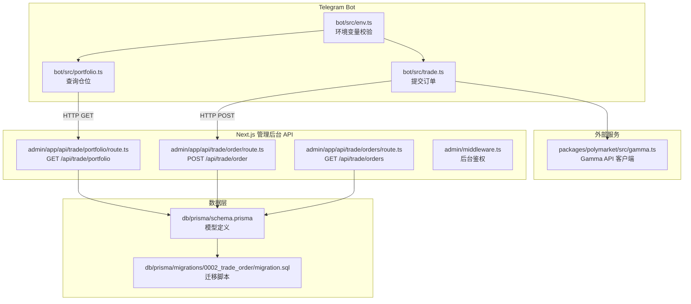
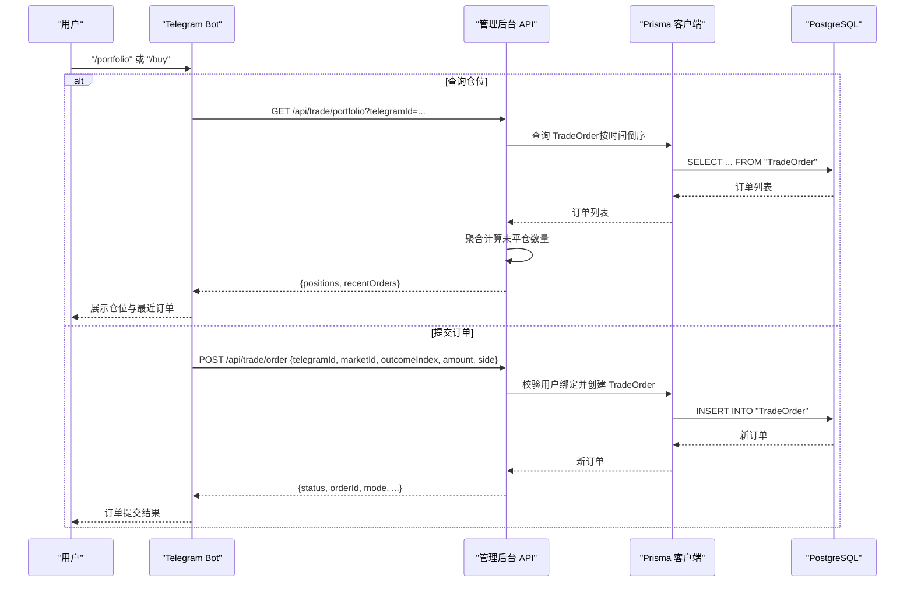
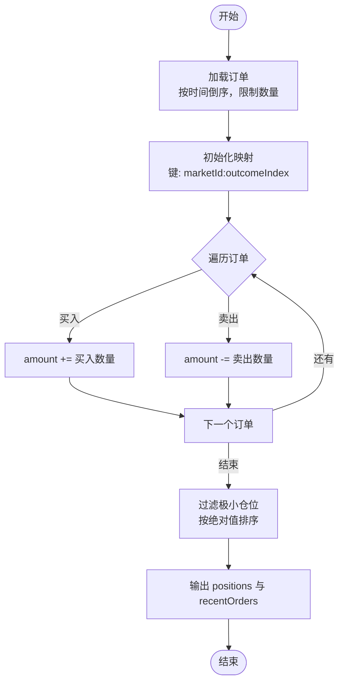
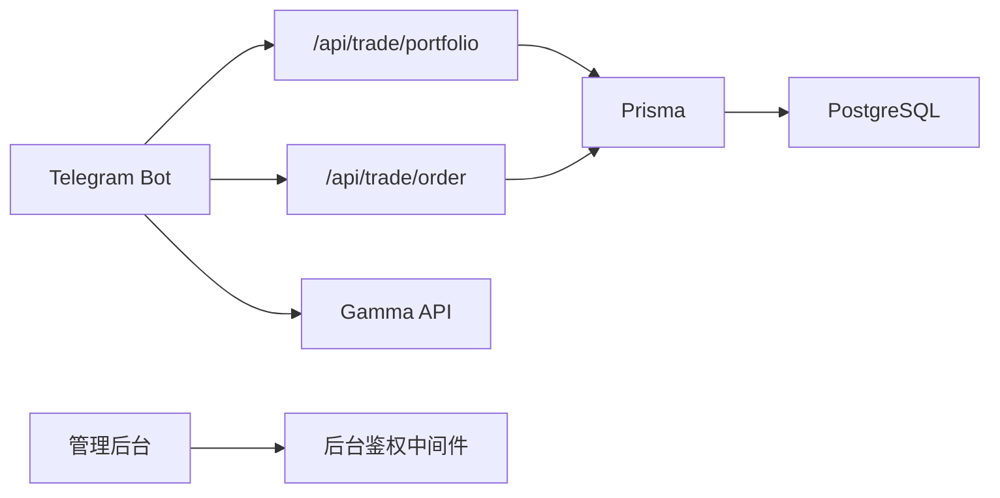

# 仓位跟踪系统

<cite>
**本文引用的文件**
- [apps/admin/app/api/trade/portfolio/route.ts](file://apps/admin/app/api/trade/portfolio/route.ts)
- [apps/admin/app/api/trade/order/route.ts](file://apps/admin/app/api/trade/order/route.ts)
- [apps/admin/app/api/trade/orders/route.ts](file://apps/admin/app/api/trade/orders/route.ts)
- [apps/admin/middleware.ts](file://apps/admin/middleware.ts)
- [apps/bot/src/portfolio.ts](file://apps/bot/src/portfolio.ts)
- [apps/bot/src/trade.ts](file://apps/bot/src/trade.ts)
- [apps/bot/src/env.ts](file://apps/bot/src/env.ts)
- [packages/db/prisma/schema.prisma](file://packages/db/prisma/schema.prisma)
- [packages/db/prisma/migrations/0002_trade_order/migration.sql](file://packages/db/prisma/migrations/0002_trade_order/migration.sql)
- [packages/polymarket/src/gamma.ts](file://packages/polymarket/src/gamma.ts)
- [packages/polymarket/src/index.ts](file://packages/polymarket/src/index.ts)
- [test/trade-portfolio.test.ts](file://test/trade-portfolio.test.ts)
- [test/trade-order.test.ts](file://test/trade-order.test.ts)
- [specs/cryptopulse/design.md](file://specs/cryptopulse/design.md)
- [specs/cryptopulse/requirements.md](file://specs/cryptopulse/requirements.md)
- [README.md](file://README.md)
</cite>

## 目录
1. [简介](#简介)
2. [项目结构](#项目结构)
3. [核心组件](#核心组件)
4. [架构总览](#架构总览)
5. [详细组件分析](#详细组件分析)
6. [依赖关系分析](#依赖关系分析)
7. [性能考虑](#性能考虑)
8. [故障排查指南](#故障排查指南)
9. [结论](#结论)
10. [附录](#附录)

## 简介
本技术文档围绕“仓位跟踪系统”的实现进行深入解析，涵盖以下主题：
- 持仓计算逻辑：多头与空头的处理方式
- 风险控制机制：最大仓位限制、止损止盈设置、保证金管理（现状与扩展建议）
- 仓位查询 API：实时持仓更新、历史订单记录、收益计算（现状与扩展建议）
- 仓位与订单关系：订单执行对仓位的影响与状态同步
- 完整示例：仓位监控、风险预警、自动平仓机制（扩展建议）
- 存储结构与查询优化策略

说明：当前仓库实现了基于订单的“实时持仓汇总”能力，但未实现完整的“实时盈亏/收益计算”“风险控制阈值”“自动平仓”等高级功能。本文在现有实现基础上，提供扩展建议与最佳实践。

## 项目结构
系统主要由三部分组成：
- 管理后台 API：提供订单与仓位查询接口
- Telegram Bot：面向用户的交互入口，调用后台 API 获取仓位与提交订单
- 数据层：PostgreSQL + Prisma，持久化用户与订单数据

图表来源
- [apps/bot/src/portfolio.ts](file://apps/bot/src/portfolio.ts#L1-L76)
- [apps/bot/src/trade.ts](file://apps/bot/src/trade.ts#L1-L118)
- [apps/bot/src/env.ts](file://apps/bot/src/env.ts#L1-L14)
- [apps/admin/app/api/trade/portfolio/route.ts](file://apps/admin/app/api/trade/portfolio/route.ts#L1-L80)
- [apps/admin/app/api/trade/order/route.ts](file://apps/admin/app/api/trade/order/route.ts#L1-L94)
- [apps/admin/app/api/trade/orders/route.ts](file://apps/admin/app/api/trade/orders/route.ts#L1-L74)
- [apps/admin/middleware.ts](file://apps/admin/middleware.ts#L1-L23)
- [packages/db/prisma/schema.prisma](file://packages/db/prisma/schema.prisma#L1-L55)
- [packages/db/prisma/migrations/0002_trade_order/migration.sql](file://packages/db/prisma/migrations/0002_trade_order/migration.sql#L1-L23)
- [packages/polymarket/src/gamma.ts](file://packages/polymarket/src/gamma.ts#L1-L177)

章节来源
- [README.md](file://README.md#L1-L65)
- [apps/admin/middleware.ts](file://apps/admin/middleware.ts#L1-L23)
- [packages/db/prisma/schema.prisma](file://packages/db/prisma/schema.prisma#L1-L55)

## 核心组件
- 仓位查询 API：根据 telegramId 聚合订单，计算未平仓“数量”（多头为正，空头为负），并返回最近订单
- 订单提交 API：校验权限与用户绑定状态，创建订单记录（mock 模式下返回模拟成交状态）
- Bot 交互：Bot 侧发起请求，格式化返回结果，向用户展示仓位与订单
- 数据模型：User 与 TradeOrder，带索引优化查询

章节来源
- [apps/admin/app/api/trade/portfolio/route.ts](file://apps/admin/app/api/trade/portfolio/route.ts#L17-L78)
- [apps/admin/app/api/trade/order/route.ts](file://apps/admin/app/api/trade/order/route.ts#L16-L93)
- [apps/admin/app/api/trade/orders/route.ts](file://apps/admin/app/api/trade/orders/route.ts#L18-L72)
- [apps/bot/src/portfolio.ts](file://apps/bot/src/portfolio.ts#L4-L74)
- [apps/bot/src/trade.ts](file://apps/bot/src/trade.ts#L68-L116)
- [packages/db/prisma/schema.prisma](file://packages/db/prisma/schema.prisma#L36-L54)

## 架构总览
下图展示了从 Bot 到 API，再到数据库的数据流与职责边界：

图表来源
- [apps/bot/src/portfolio.ts](file://apps/bot/src/portfolio.ts#L14-L74)
- [apps/bot/src/trade.ts](file://apps/bot/src/trade.ts#L80-L116)
- [apps/admin/app/api/trade/portfolio/route.ts](file://apps/admin/app/api/trade/portfolio/route.ts#L42-L78)
- [apps/admin/app/api/trade/order/route.ts](file://apps/admin/app/api/trade/order/route.ts#L50-L93)
- [packages/db/prisma/schema.prisma](file://packages/db/prisma/schema.prisma#L36-L54)

## 详细组件分析

### 1) 持仓计算逻辑（多头与空头）
- 计算方式：以“市场ID:选项索引”为键，遍历订单，买入加仓（正数），卖出平仓/开空（负数），累计得到未平仓数量
- 过滤与排序：过滤掉数量绝对值极小的仓位，按数量绝对值降序排列
- 输出：positions（未平仓汇总）、recentOrders（最近订单快照）

图表来源
- [apps/admin/app/api/trade/portfolio/route.ts](file://apps/admin/app/api/trade/portfolio/route.ts#L42-L78)

章节来源
- [apps/admin/app/api/trade/portfolio/route.ts](file://apps/admin/app/api/trade/portfolio/route.ts#L42-L78)
- [test/trade-portfolio.test.ts](file://test/trade-portfolio.test.ts#L49-L94)

### 2) 风险控制机制（现状与扩展建议）
- 现状：代码中未实现最大仓位限制、止损止盈设置、保证金管理等风控逻辑
- 扩展建议：
  - 最大仓位限制：在订单创建前，结合用户风险等级与账户余额，限制单仓/总仓上限
  - 止损止盈：在订单中增加止盈/止损参数，配合监控模块触发自动平仓
  - 保证金管理：引入保证金比例与维持水平，当保证金不足时触发预警或强平
  - 实时监控：基于 WebSocket 或轮询，持续更新未实现盈亏，驱动风控阈值判断

章节来源
- [specs/cryptopulse/requirements.md](file://specs/cryptopulse/requirements.md#L59-L68)
- [specs/cryptopulse/design.md](file://specs/cryptopulse/design.md#L100-L126)

### 3) 仓位查询 API 实现
- 接口路径与方法
  - GET /api/trade/portfolio?telegramId={number}
  - GET /api/trade/orders?telegramId={number}&limit={1..100}
  - POST /api/trade/order（提交订单）
- 鉴权：均要求 Bearer Token，后台环境变量 BOT_API_TOKEN
- 数据来源：读取 TradeOrder 表，按 telegramId 聚合
- 返回内容：
  - 仓位汇总 positions：marketId、outcomeIndex、amount
  - 最近订单 recentOrders：包含 id、marketId、outcomeIndex、side、amount、status、orderId、avgPrice、txHash、createdAt

章节来源
- [apps/admin/app/api/trade/portfolio/route.ts](file://apps/admin/app/api/trade/portfolio/route.ts#L17-L78)
- [apps/admin/app/api/trade/orders/route.ts](file://apps/admin/app/api/trade/orders/route.ts#L18-L72)
- [apps/admin/app/api/trade/order/route.ts](file://apps/admin/app/api/trade/order/route.ts#L16-L93)

### 4) 仓位与订单的关系
- 订单执行对仓位的影响：买入增加未平仓数量，卖出减少未平仓数量；同市场同选项的多空头寸可抵消
- 状态同步：当前实现为“订单写库即视为已提交”，mock 模式下订单状态为模拟成交；真实链上执行需要额外的链上事件监听与状态回填
- Bot 侧展示：Bot 会将 positions 与 recentOrders 格式化为用户可读消息

章节来源
- [apps/admin/app/api/trade/portfolio/route.ts](file://apps/admin/app/api/trade/portfolio/route.ts#L42-L78)
- [apps/bot/src/portfolio.ts](file://apps/bot/src/portfolio.ts#L4-L74)
- [apps/bot/src/trade.ts](file://apps/bot/src/trade.ts#L68-L116)

### 5) 完整示例：仓位监控、风险预警与自动平仓（扩展建议）
- 仓位监控：定时任务扫描 positions，计算未实现盈亏（需引入市场价格），对比风控阈值
- 风险预警：当未实现盈亏接近止损线或保证金率低于阈值时，向用户推送告警
- 自动平仓：达到强平阈值时，自动挂单平仓；支持用户确认或静默执行两种模式
- 注意：以上为扩展建议，当前仓库未实现相关逻辑

章节来源
- [specs/cryptopulse/requirements.md](file://specs/cryptopulse/requirements.md#L59-L68)
- [specs/cryptopulse/design.md](file://specs/cryptopulse/design.md#L100-L126)

### 6) 存储结构与查询优化策略
- 数据模型
  - User：telegramId、polymarketAddress 等
  - TradeOrder：包含 telegramId、marketId、outcomeIndex、side、amount、status、orderId、avgPrice、txHash、createdAt、updatedAt
- 索引
  - TradeOrder_telegramId_createdAt：按用户与时间倒序查询
  - TradeOrder_marketId_outcomeIndex：按市场与选项分组聚合
- 查询优化
  - 读取最近订单：按 telegramId 降序取有限条数
  - 聚合计算：在应用层使用 Map 聚合，避免复杂 SQL 聚合导致的性能问题
  - 分页与限制：对最近订单限制数量，避免一次性返回过多数据

章节来源
- [packages/db/prisma/schema.prisma](file://packages/db/prisma/schema.prisma#L36-L54)
- [packages/db/prisma/migrations/0002_trade_order/migration.sql](file://packages/db/prisma/migrations/0002_trade_order/migration.sql#L18-L22)
- [apps/admin/app/api/trade/portfolio/route.ts](file://apps/admin/app/api/trade/portfolio/route.ts#L42-L78)
- [apps/admin/app/api/trade/orders/route.ts](file://apps/admin/app/api/trade/orders/route.ts#L48-L53)

## 依赖关系分析
- Bot 依赖后台 API 提供的鉴权与数据接口
- 后台 API 依赖 Prisma 访问 PostgreSQL
- Bot 在下单前会调用 Gamma API 获取市场详情，确保选项有效
- 管理后台中间件保护 /admin 路由

图表来源
- [apps/bot/src/portfolio.ts](file://apps/bot/src/portfolio.ts#L14-L74)
- [apps/bot/src/trade.ts](file://apps/bot/src/trade.ts#L80-L116)
- [apps/admin/app/api/trade/portfolio/route.ts](file://apps/admin/app/api/trade/portfolio/route.ts#L28-L33)
- [apps/admin/app/api/trade/order/route.ts](file://apps/admin/app/api/trade/order/route.ts#L43-L48)
- [packages/db/prisma/schema.prisma](file://packages/db/prisma/schema.prisma#L36-L54)
- [packages/polymarket/src/gamma.ts](file://packages/polymarket/src/gamma.ts#L163-L175)
- [apps/admin/middleware.ts](file://apps/admin/middleware.ts#L3-L16)

章节来源
- [apps/bot/src/env.ts](file://apps/bot/src/env.ts#L3-L12)
- [packages/polymarket/src/gamma.ts](file://packages/polymarket/src/gamma.ts#L116-L177)
- [apps/admin/middleware.ts](file://apps/admin/middleware.ts#L1-L23)

## 性能考虑
- 读取路径
  - 通过索引 TradeOrder_telegramId_createdAt 支持快速按用户与时间排序
  - 对最近订单限制数量，避免大结果集
- 写入路径
  - 订单创建为单条写入，Prisma 自动生成安全的 SQL
- 计算路径
  - 应用层聚合，避免复杂 SQL 聚合带来的性能损耗
- 建议
  - 对高频查询可引入 Redis 缓存（如最近订单快照）
  - 对大量用户场景，可考虑分页与懒加载

章节来源
- [packages/db/prisma/migrations/0002_trade_order/migration.sql](file://packages/db/prisma/migrations/0002_trade_order/migration.sql#L18-L22)
- [apps/admin/app/api/trade/portfolio/route.ts](file://apps/admin/app/api/trade/portfolio/route.ts#L42-L78)
- [specs/cryptopulse/design.md](file://specs/cryptopulse/design.md#L100-L126)

## 故障排查指南
- 鉴权失败
  - 现象：返回 unauthorized
  - 排查：确认请求头 Authorization 与环境变量 BOT_API_TOKEN 是否一致
- 数据库不可用
  - 现象：返回 database_unavailable 或 prisma_unavailable
  - 排查：确认 DATABASE_URL 可用，Prisma 客户端可正常导入
- 用户未绑定
  - 现象：返回 user_not_bound
  - 排查：确认用户已在系统中绑定 Polymarket 地址
- 请求体/查询参数非法
  - 现象：返回 invalid_body 或 invalid_query
  - 排查：核对 telegramId、amount、side、limit 等参数类型与范围
- 服务器内部错误
  - 现象：返回 server_error
  - 排查：查看服务端日志，定位具体异常

章节来源
- [apps/admin/app/api/trade/order/route.ts](file://apps/admin/app/api/trade/order/route.ts#L17-L23)
- [apps/admin/app/api/trade/portfolio/route.ts](file://apps/admin/app/api/trade/portfolio/route.ts#L17-L26)
- [apps/admin/app/api/trade/orders/route.ts](file://apps/admin/app/api/trade/orders/route.ts#L18-L27)
- [apps/bot/src/portfolio.ts](file://apps/bot/src/portfolio.ts#L22-L26)
- [apps/bot/src/trade.ts](file://apps/bot/src/trade.ts#L75-L78)

## 结论
- 当前系统已具备“基于订单的实时仓位汇总”能力，满足基本的仓位查询与订单记录需求
- 尚未实现“实时盈亏/收益计算”“风险控制阈值”“自动平仓”等高级功能，可在现有数据模型与 API 基础上逐步扩展
- 建议引入市场行情源与缓存策略，提升用户体验与系统性能

## 附录
- 环境变量
  - TELEGRAM_BOT_TOKEN：Telegram Bot 的令牌
  - API_BASE_URL：后台 API 基础地址
  - BOT_API_TOKEN：后台 API 鉴权令牌
  - DATABASE_URL：PostgreSQL 连接串
  - TRADE_MODE：交易模式（mock 用于演示）
- 测试用例
  - 仓位查询测试：验证 positions 与 recentOrders 的正确性
  - 订单提交测试：验证鉴权、用户绑定、mock 模式下的状态

章节来源
- [apps/bot/src/env.ts](file://apps/bot/src/env.ts#L3-L12)
- [test/trade-portfolio.test.ts](file://test/trade-portfolio.test.ts#L49-L94)
- [test/trade-order.test.ts](file://test/trade-order.test.ts#L50-L107)
- [README.md](file://README.md#L20-L65)