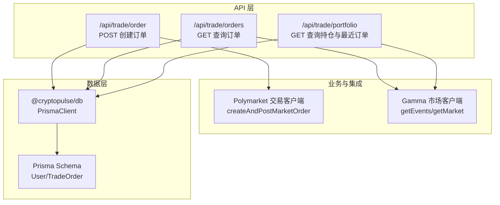
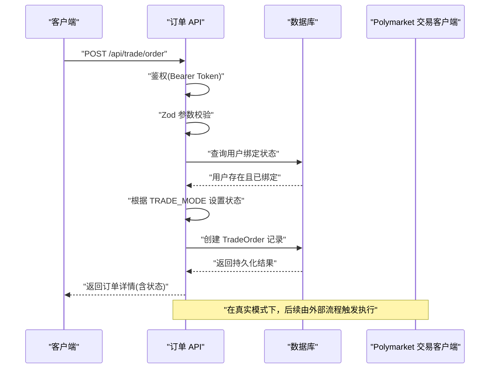
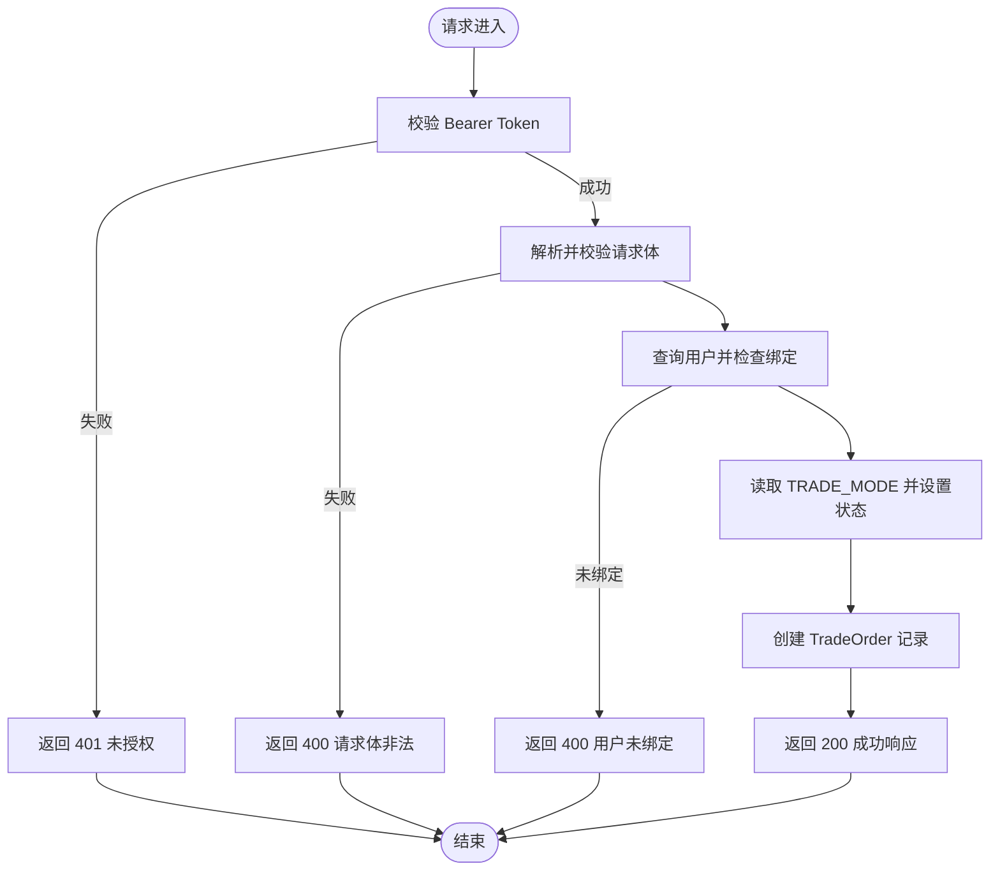
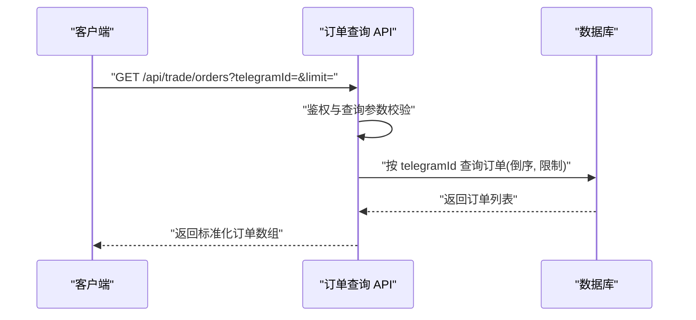
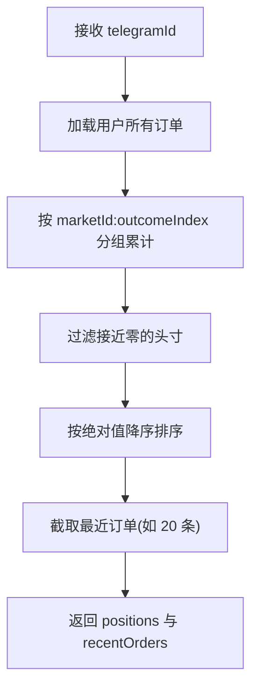
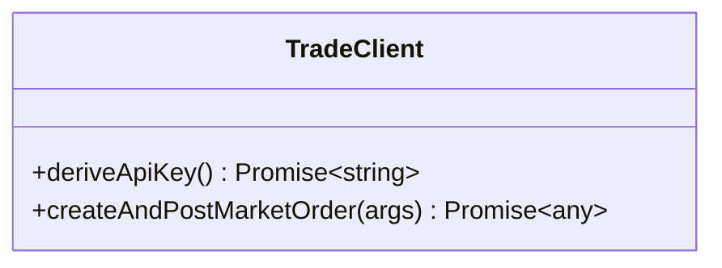
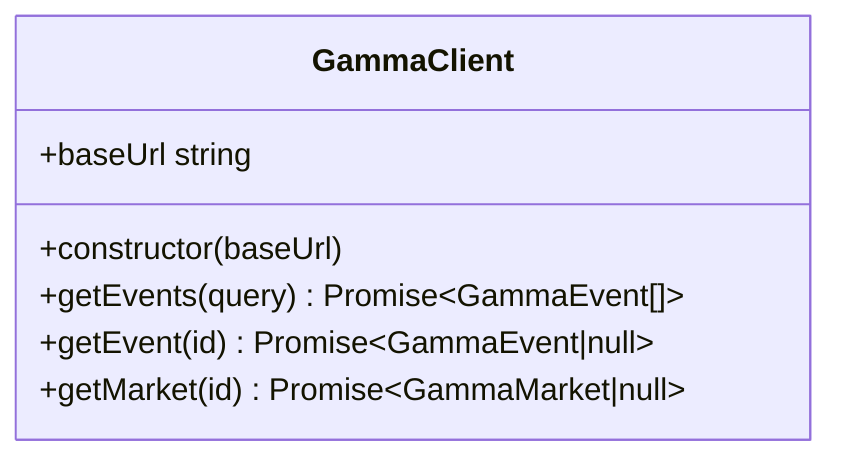
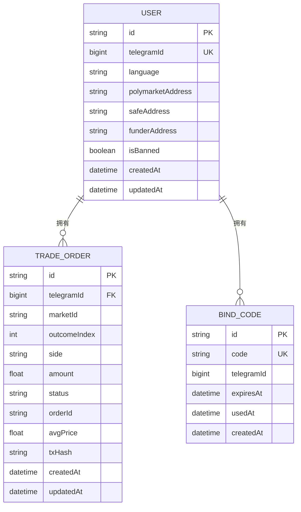
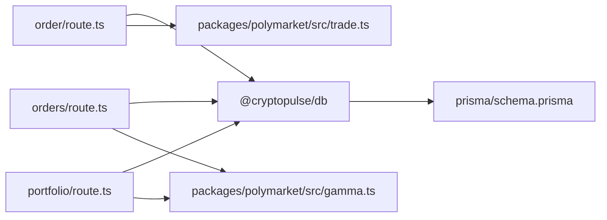

# 订单管理系统

<cite>
**本文档引用的文件**
- [apps/admin/app/api/trade/order/route.ts](file://apps/admin/app/api/trade/order/route.ts)
- [apps/admin/app/api/trade/orders/route.ts](file://apps/admin/app/api/trade/orders/route.ts)
- [apps/admin/app/api/trade/portfolio/route.ts](file://apps/admin/app/api/trade/portfolio/route.ts)
- [packages/polymarket/src/trade.ts](file://packages/polymarket/src/trade.ts)
- [packages/polymarket/src/gamma.ts](file://packages/polymarket/src/gamma.ts)
- [packages/db/src/index.ts](file://packages/db/src/index.ts)
- [packages/db/prisma/schema.prisma](file://packages/db/prisma/schema.prisma)
- [test/trade-order.test.ts](file://test/trade-order.test.ts)
- [test/trade-portfolio.test.ts](file://test/trade-portfolio.test.ts)
- [README.md](file://README.md)
</cite>

## 目录
1. [简介](#简介)
2. [项目结构](#项目结构)
3. [核心组件](#核心组件)
4. [架构总览](#架构总览)
5. [详细组件分析](#详细组件分析)
6. [依赖关系分析](#依赖关系分析)
7. [性能考虑](#性能考虑)
8. [故障排查指南](#故障排查指南)
9. [结论](#结论)
10. [附录](#附录)

## 简介
本文件为订单管理系统的完整技术文档，聚焦于订单创建流程（含市价单与限价单）、订单验证机制（身份认证、市场有效性与金额限制）、订单状态管理（待确认、已提交、执行中、已完成、已取消等状态转换）、订单 API 设计与实现（请求参数校验、响应格式与错误处理），并提供从用户下单到订单执行的完整示例流程。同时涵盖订单查询与历史记录管理的实现细节。

## 项目结构
该系统采用多包架构，核心模块包括：
- 订单 API 层：Next.js 路由处理器，负责鉴权、参数校验、调用数据库与返回标准化响应
- Polymarket 交易客户端：封装与 Polymarket CLOB 的交互，支持市价单创建
- Gamma 市场数据客户端：提供事件与市场的查询能力
- 数据库层：基于 Prisma 的 PostgreSQL 模型定义与全局连接管理

图表来源
- [apps/admin/app/api/trade/order/route.ts](file://apps/admin/app/api/trade/order/route.ts#L1-L94)
- [apps/admin/app/api/trade/orders/route.ts](file://apps/admin/app/api/trade/orders/route.ts#L1-L74)
- [apps/admin/app/api/trade/portfolio/route.ts](file://apps/admin/app/api/trade/portfolio/route.ts#L1-L80)
- [packages/polymarket/src/trade.ts](file://packages/polymarket/src/trade.ts#L1-L29)
- [packages/polymarket/src/gamma.ts](file://packages/polymarket/src/gamma.ts#L1-L177)
- [packages/db/src/index.ts](file://packages/db/src/index.ts#L1-L13)
- [packages/db/prisma/schema.prisma](file://packages/db/prisma/schema.prisma#L1-L56)

章节来源
- [README.md](file://README.md#L1-L65)

## 核心组件
- 订单 API（创建）：负责鉴权、请求体校验、用户绑定检查、订单持久化与模拟执行
- 订单 API（查询）：按用户查询其历史订单列表
- 持仓 API：聚合用户在各市场/结果上的头寸并返回最近订单快照
- Polymarket 交易客户端：封装市价单创建与签名流程
- Gamma 市场客户端：提供事件与市场元数据查询
- 数据库层：统一的 Prisma 客户端与模型定义

章节来源
- [apps/admin/app/api/trade/order/route.ts](file://apps/admin/app/api/trade/order/route.ts#L1-L94)
- [apps/admin/app/api/trade/orders/route.ts](file://apps/admin/app/api/trade/orders/route.ts#L1-L74)
- [apps/admin/app/api/trade/portfolio/route.ts](file://apps/admin/app/api/trade/portfolio/route.ts#L1-L80)
- [packages/polymarket/src/trade.ts](file://packages/polymarket/src/trade.ts#L1-L29)
- [packages/polymarket/src/gamma.ts](file://packages/polymarket/src/gamma.ts#L1-L177)
- [packages/db/src/index.ts](file://packages/db/src/index.ts#L1-L13)
- [packages/db/prisma/schema.prisma](file://packages/db/prisma/schema.prisma#L1-L56)

## 架构总览
系统通过 Next.js API 路由作为入口，统一进行 Bearer Token 鉴权与参数校验，随后访问数据库持久化订单。在“模拟模式”下，订单状态直接写入为已完成；在真实模式下，订单状态为待处理，后续由外部流程推进至完成或取消。Gamma 客户端用于市场与事件查询，Polymarket 交易客户端用于与链上 CLOB 交互。

图表来源
- [apps/admin/app/api/trade/order/route.ts](file://apps/admin/app/api/trade/order/route.ts#L16-L93)
- [packages/db/prisma/schema.prisma](file://packages/db/prisma/schema.prisma#L36-L54)
- [packages/polymarket/src/trade.ts](file://packages/polymarket/src/trade.ts#L19-L28)

## 详细组件分析

### 订单创建 API（POST /api/trade/order）
- 鉴权：要求 Authorization 头携带 Bearer Token，与 BOT_API_TOKEN 对比
- 请求体校验：使用 Zod 校验 telegramId、marketId、outcomeIndex、amount、side
- 用户绑定检查：查询用户是否存在且已绑定钱包地址
- 订单持久化：创建 TradeOrder，字段包括 telegramId、marketId、outcomeIndex、side、amount、status、orderId、avgPrice、txHash
- 模式控制：TRADE_MODE 为 mock 时，status 写入已完成态并填充模拟价格与哈希；否则写入待处理态
- 错误处理：统一返回 JSON 错误对象，状态码覆盖鉴权失败、请求体非法、数据库不可用、服务端错误等

图表来源
- [apps/admin/app/api/trade/order/route.ts](file://apps/admin/app/api/trade/order/route.ts#L16-L93)

章节来源
- [apps/admin/app/api/trade/order/route.ts](file://apps/admin/app/api/trade/order/route.ts#L1-L94)
- [test/trade-order.test.ts](file://test/trade-order.test.ts#L50-L107)

### 订单查询 API（GET /api/trade/orders）
- 鉴权：同上
- 查询参数校验：telegramId 必填且为正整数，limit 可选且范围 1-100
- 数据查询：按 telegramId 查询订单，按创建时间倒序，限制数量
- 响应格式：标准化订单数组，包含 id、marketId、outcomeIndex、side、amount、status、orderId、avgPrice、txHash、createdAt

图表来源
- [apps/admin/app/api/trade/orders/route.ts](file://apps/admin/app/api/trade/orders/route.ts#L18-L72)

章节来源
- [apps/admin/app/api/trade/orders/route.ts](file://apps/admin/app/api/trade/orders/route.ts#L1-L74)

### 持仓与最近订单 API（GET /api/trade/portfolio）
- 鉴权：同上
- 查询参数校验：telegramId 必填且为正整数
- 逻辑说明：统计每个 marketId:outcomeIndex 组合的净头寸（买入加仓、卖出减仓），过滤掉接近零的头寸并按绝对值排序；同时返回最近订单快照
- 响应格式：positions（头寸数组）、recentOrders（最近订单数组）

图表来源
- [apps/admin/app/api/trade/portfolio/route.ts](file://apps/admin/app/api/trade/portfolio/route.ts#L42-L74)

章节来源
- [apps/admin/app/api/trade/portfolio/route.ts](file://apps/admin/app/api/trade/portfolio/route.ts#L1-L80)
- [test/trade-portfolio.test.ts](file://test/trade-portfolio.test.ts#L49-L96)

### Polymarket 交易客户端
- 功能：封装与 Polymarket CLOB 的交互，支持派生 API Key 与创建并挂单市价单
- 市价单创建：构造 UserMarketOrder，指定 tokenID、side、amount、price（可选），以立即成交优先（FOK）方式提交

图表来源
- [packages/polymarket/src/trade.ts](file://packages/polymarket/src/trade.ts#L5-L28)

章节来源
- [packages/polymarket/src/trade.ts](file://packages/polymarket/src/trade.ts#L1-L29)

### Gamma 市场客户端
- 功能：提供事件与市场的查询接口，支持分页与筛选
- 方法：getEvents、getEvent、getMarket；内部使用 URLSearchParams 组装查询参数并发起 HTTP 请求

图表来源
- [packages/polymarket/src/gamma.ts](file://packages/polymarket/src/gamma.ts#L116-L176)

章节来源
- [packages/polymarket/src/gamma.ts](file://packages/polymarket/src/gamma.ts#L1-L177)

### 数据库模型与连接
- 模型：User、BindCode、TradeOrder；TradeOrder 与 User 外键关联
- 连接：全局单例 PrismaClient，避免重复实例化

图表来源
- [packages/db/prisma/schema.prisma](file://packages/db/prisma/schema.prisma#L10-L54)
- [packages/db/src/index.ts](file://packages/db/src/index.ts#L1-L13)

章节来源
- [packages/db/prisma/schema.prisma](file://packages/db/prisma/schema.prisma#L1-L56)
- [packages/db/src/index.ts](file://packages/db/src/index.ts#L1-L13)

## 依赖关系分析
- API 层依赖数据库层（Prisma）与 Polymarket/Gamma 客户端
- Polymarket 交易客户端依赖 @polymarket/clob-client 与 @ethersproject/wallet
- Gamma 客户端依赖标准 fetch 接口
- 测试用例覆盖鉴权失败、用户未绑定、mock 模式下单、持仓聚合与最近订单等场景

图表来源
- [apps/admin/app/api/trade/order/route.ts](file://apps/admin/app/api/trade/order/route.ts#L1-L94)
- [apps/admin/app/api/trade/orders/route.ts](file://apps/admin/app/api/trade/orders/route.ts#L1-L74)
- [apps/admin/app/api/trade/portfolio/route.ts](file://apps/admin/app/api/trade/portfolio/route.ts#L1-L80)
- [packages/polymarket/src/trade.ts](file://packages/polymarket/src/trade.ts#L1-L29)
- [packages/polymarket/src/gamma.ts](file://packages/polymarket/src/gamma.ts#L1-L177)
- [packages/db/prisma/schema.prisma](file://packages/db/prisma/schema.prisma#L1-L56)

章节来源
- [test/trade-order.test.ts](file://test/trade-order.test.ts#L1-L107)
- [test/trade-portfolio.test.ts](file://test/trade-portfolio.test.ts#L1-L96)

## 性能考虑
- 数据库索引：TradeOrder 表对 telegramId、createdAt 与 marketId、outcomeIndex 建有索引，有利于按用户查询与聚合统计
- 查询限制：订单查询接口对 limit 进行上限控制，防止大范围扫描
- 全局 Prisma 实例：避免重复创建连接，降低连接开销
- 模拟模式：在开发阶段减少对外部链上交互的依赖，提升吞吐与稳定性

章节来源
- [packages/db/prisma/schema.prisma](file://packages/db/prisma/schema.prisma#L52-L53)
- [apps/admin/app/api/trade/orders/route.ts](file://apps/admin/app/api/trade/orders/route.ts#L8-L10)
- [packages/db/src/index.ts](file://packages/db/src/index.ts#L1-L13)

## 故障排查指南
- 鉴权失败（401）：检查 Authorization 头是否为 Bearer Token，且与 BOT_API_TOKEN 匹配
- 请求体非法（400）：核对 telegramId、marketId、outcomeIndex、amount、side 是否满足约束
- 用户未绑定（400）：确认用户已在数据库中存在且已绑定钱包地址
- 数据库不可用（503）：检查 DATABASE_URL 是否配置正确，数据库可达
- 服务端错误（500）：查看服务器日志定位异常堆栈

章节来源
- [apps/admin/app/api/trade/order/route.ts](file://apps/admin/app/api/trade/order/route.ts#L16-L93)
- [apps/admin/app/api/trade/orders/route.ts](file://apps/admin/app/api/trade/orders/route.ts#L18-L72)
- [apps/admin/app/api/trade/portfolio/route.ts](file://apps/admin/app/api/trade/portfolio/route.ts#L17-L78)

## 结论
本订单管理系统通过清晰的 API 分层、严格的参数校验与状态机设计，实现了从下单到查询的闭环。结合 Polymarket 与 Gamma 的外部集成，系统具备扩展市场数据与链上交易的能力。建议在生产环境中完善订单状态推进流程（如定时任务或 Webhook 回调）以驱动真实执行，并增加更细粒度的风控与审计日志。

## 附录

### 订单状态管理
- 待确认：尚未落库或等待外部确认
- 已提交：订单已创建，等待执行
- 执行中：订单已提交至链上，正在撮合
- 已完成：订单全部成交或模拟完成
- 已取消：订单被取消

说明：当前路由层仅在 mock 模式下直接写入已完成状态；真实模式下应由外部流程更新状态。

章节来源
- [apps/admin/app/api/trade/order/route.ts](file://apps/admin/app/api/trade/order/route.ts#L61-L77)

### 市价订单与限价订单处理
- 市价订单：通过 Polymarket 交易客户端以立即成交优先（FOK）方式提交
- 限价订单：当前路由层未显式支持限价参数；可在请求体中扩展 price 字段并在客户端中构造相应订单类型

章节来源
- [packages/polymarket/src/trade.ts](file://packages/polymarket/src/trade.ts#L19-L28)
- [apps/admin/app/api/trade/order/route.ts](file://apps/admin/app/api/trade/order/route.ts#L32-L35)

### 完整示例：从下单到执行
- 步骤 1：客户端调用 POST /api/trade/order，携带 Bearer Token 与订单参数
- 步骤 2：API 校验通过后，按 TRADE_MODE 写入订单状态（mock 直接完成）
- 步骤 3：客户端轮询 GET /api/trade/orders 获取最新状态
- 步骤 4：（可选）调用 GET /api/trade/portfolio 查看头寸与最近订单
- 步骤 5：（真实模式）由外部流程推进订单状态并更新 avgPrice、txHash

章节来源
- [apps/admin/app/api/trade/order/route.ts](file://apps/admin/app/api/trade/order/route.ts#L16-L93)
- [apps/admin/app/api/trade/orders/route.ts](file://apps/admin/app/api/trade/orders/route.ts#L18-L72)
- [apps/admin/app/api/trade/portfolio/route.ts](file://apps/admin/app/api/trade/portfolio/route.ts#L17-L78)
- [test/trade-order.test.ts](file://test/trade-order.test.ts#L80-L105)
- [test/trade-portfolio.test.ts](file://test/trade-portfolio.test.ts#L49-L96)