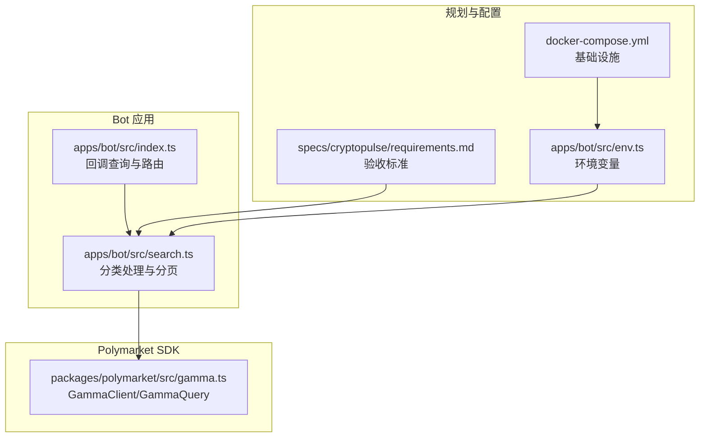
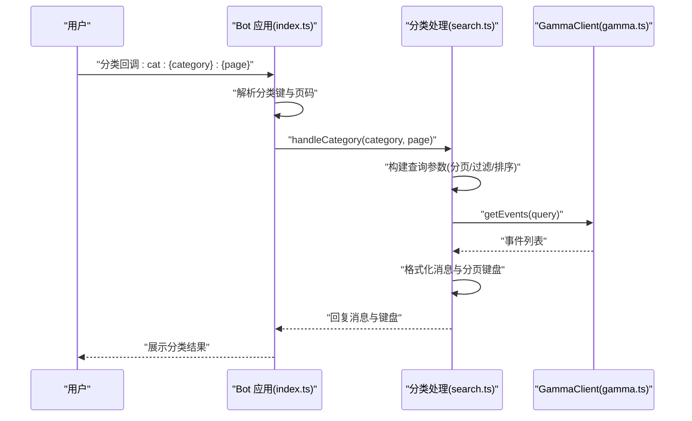
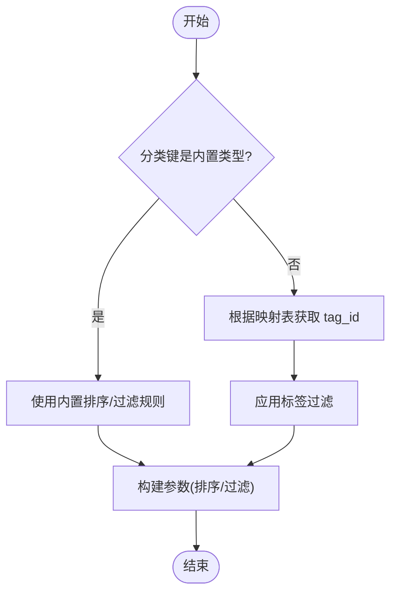
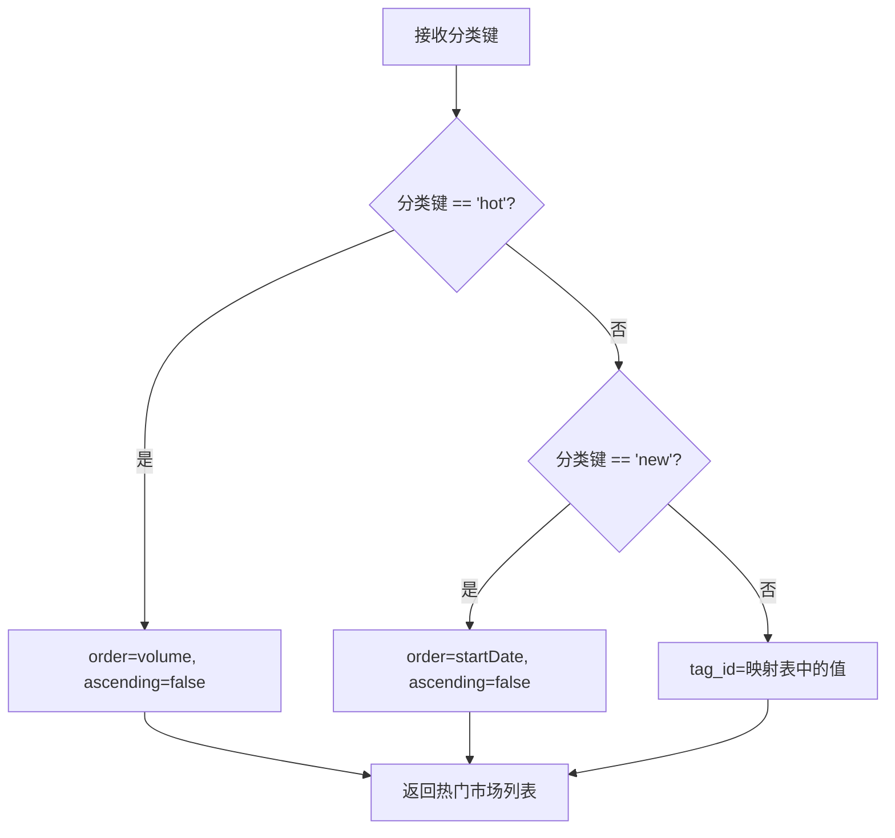
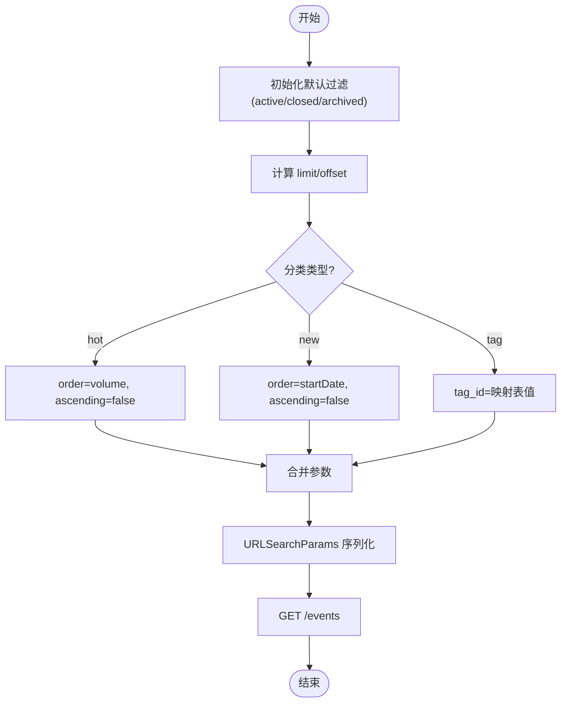
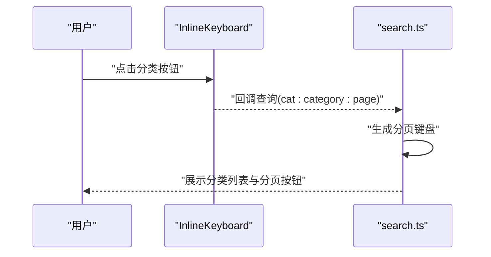
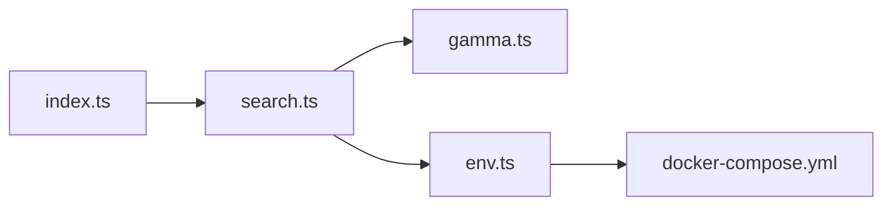

# 分类筛选机制

<cite>
**本文档引用的文件**
- [apps/bot/src/search.ts](file://apps/bot/src/search.ts)
- [apps/bot/src/index.ts](file://apps/bot/src/index.ts)
- [packages/polymarket/src/gamma.ts](file://packages/polymarket/src/gamma.ts)
- [specs/cryptopulse/requirements.md](file://specs/cryptopulse/requirements.md)
- [apps/bot/src/env.ts](file://apps/bot/src/env.ts)
- [docker-compose.yml](file://docker-compose.yml)
</cite>

## 目录
1. [简介](#简介)
2. [项目结构](#项目结构)
3. [核心组件](#核心组件)
4. [架构总览](#架构总览)
5. [详细组件分析](#详细组件分析)
6. [依赖关系分析](#依赖关系分析)
7. [性能考虑](#性能考虑)
8. [故障排除指南](#故障排除指南)
9. [结论](#结论)
10. [附录](#附录)

## 简介
本文件针对预测市场分类筛选机制进行全面技术文档化，涵盖分类映射表、分类 ID 对应关系、分类名称本地化、不同分类类型的处理逻辑（热门市场、最新市场、普通标签分类）、参数构建过程（动态参数设置、排序规则应用、过滤条件组合）、分类导航的用户界面设计（按钮布局、状态指示、交互反馈）、扩展方法（新增分类类型、自定义排序规则、过滤条件）以及缓存策略与性能优化方案。

## 项目结构
分类筛选功能主要分布在以下模块：
- Bot 应用层：负责用户交互、分类路由、参数构建与分页展示
- Polymarket SDK：封装 Gamma API 的查询模型与客户端调用
- 规划文档：定义验收标准与性能目标
- 环境与基础设施：提供运行时所需的环境变量与容器编排

**图示来源**
- [apps/bot/src/index.ts](file://apps/bot/src/index.ts#L108-L130)
- [apps/bot/src/search.ts](file://apps/bot/src/search.ts#L64-L111)
- [packages/polymarket/src/gamma.ts](file://packages/polymarket/src/gamma.ts#L93-L147)
- [specs/cryptopulse/requirements.md](file://specs/cryptopulse/requirements.md#L24-L48)
- [apps/bot/src/env.ts](file://apps/bot/src/env.ts#L1-L13)
- [docker-compose.yml](file://docker-compose.yml#L1-L23)

**章节来源**
- [apps/bot/src/index.ts](file://apps/bot/src/index.ts#L108-L130)
- [apps/bot/src/search.ts](file://apps/bot/src/search.ts#L64-L111)
- [packages/polymarket/src/gamma.ts](file://packages/polymarket/src/gamma.ts#L93-L147)
- [specs/cryptopulse/requirements.md](file://specs/cryptopulse/requirements.md#L24-L48)
- [apps/bot/src/env.ts](file://apps/bot/src/env.ts#L1-L13)
- [docker-compose.yml](file://docker-compose.yml#L1-L23)

## 核心组件
- 分类映射表与本地化
  - 分类映射表将分类键映射到后端 tag_id，用于标签过滤
  - 分类名称本地化字典提供中文显示名，增强用户体验
- 参数构建器
  - 动态组装查询参数，包含分页、过滤条件与排序规则
- GammaClient 查询接口
  - 将参数序列化为 URL 查询字符串并调用 Gamma API
- 回调路由与分页键盘
  - 通过回调查询解析分类键与页码，生成分页键盘

**章节来源**
- [apps/bot/src/search.ts](file://apps/bot/src/search.ts#L7-L25)
- [apps/bot/src/search.ts](file://apps/bot/src/search.ts#L69-L85)
- [packages/polymarket/src/gamma.ts](file://packages/polymarket/src/gamma.ts#L93-L147)
- [apps/bot/src/index.ts](file://apps/bot/src/index.ts#L108-L122)

## 架构总览
分类筛选的整体流程如下：
- 用户通过 Bot 发送分类请求或点击分类按钮
- Bot 解析回调查询，构建查询参数（分页、过滤、排序）
- 调用 GammaClient 获取事件列表
- 格式化输出并生成分页键盘，支持上一页/下一页

**图示来源**
- [apps/bot/src/index.ts](file://apps/bot/src/index.ts#L108-L114)
- [apps/bot/src/search.ts](file://apps/bot/src/search.ts#L64-L111)
- [packages/polymarket/src/gamma.ts](file://packages/polymarket/src/gamma.ts#L123-L147)

## 详细组件分析

### 分类映射表与分类名称本地化
- 分类映射表
  - 将分类键（如 crypto、politics、sports 等）映射到后端 tag_id，用于标签过滤
- 分类名称本地化
  - 提供中文分类名称，提升多语言体验
- 用途
  - 在处理普通分类时，将分类键转换为 tag_id 传入查询参数
  - 在 UI 文案中使用本地化名称

**图示来源**
- [apps/bot/src/search.ts](file://apps/bot/src/search.ts#L7-L25)
- [apps/bot/src/search.ts](file://apps/bot/src/search.ts#L84)

**章节来源**
- [apps/bot/src/search.ts](file://apps/bot/src/search.ts#L7-L25)
- [apps/bot/src/search.ts](file://apps/bot/src/search.ts#L84)

### 不同分类类型的处理逻辑
- 热门市场（hot）
  - 排序字段：volume（24h 成交量）
  - 排序方向：降序
- 最新市场（new）
  - 排序字段：startDate（开始日期）
  - 排序方向：降序
- 普通分类（tag_id）
  - 通过标签过滤（tag_id）返回对应分类的市场列表

**图示来源**
- [apps/bot/src/search.ts](file://apps/bot/src/search.ts#L77-L85)

**章节来源**
- [apps/bot/src/search.ts](file://apps/bot/src/search.ts#L77-L85)

### 参数构建过程
- 默认过滤条件
  - active=true、closed=false、archived=false
- 分页参数
  - limit=5、offset=page*limit
- 排序规则
  - hot：按 volume 降序
  - new：按 startDate 降序
- 过滤条件组合
  - 普通分类：追加 tag_id
  - 搜索：追加 q 关键词
- GammaClient 序列化
  - 将查询对象转换为 URLSearchParams 并拼接到 /events 请求

**图示来源**
- [apps/bot/src/search.ts](file://apps/bot/src/search.ts#L69-L85)
- [packages/polymarket/src/gamma.ts](file://packages/polymarket/src/gamma.ts#L123-L135)

**章节来源**
- [apps/bot/src/search.ts](file://apps/bot/src/search.ts#L69-L85)
- [packages/polymarket/src/gamma.ts](file://packages/polymarket/src/gamma.ts#L123-L135)

### 分类导航的用户界面设计
- 分类按钮布局
  - 通过回调查询 cat:{category}:{page} 实现分类导航
- 状态指示
  - 当分类下无市场时，返回友好提示
  - 分页键盘显示当前页码与上下页按钮
- 交互反馈
  - 使用 InlineKeyboard 生成分页按钮
  - 支持回调查询确认与编辑消息

**图示来源**
- [apps/bot/src/index.ts](file://apps/bot/src/index.ts#L108-L114)
- [apps/bot/src/search.ts](file://apps/bot/src/search.ts#L213-L226)

**章节来源**
- [apps/bot/src/index.ts](file://apps/bot/src/index.ts#L108-L114)
- [apps/bot/src/search.ts](file://apps/bot/src/search.ts#L213-L226)

### 扩展方法
- 新增分类类型
  - 在分类映射表中添加新的分类键与 tag_id
  - 在本地化字典中添加对应的中文名称
  - 在分类处理逻辑中为新类型配置排序或过滤规则
- 自定义排序规则
  - 在参数构建阶段增加 order 与 ascending 字段
  - 确保 Gamma API 支持相应的排序字段
- 自定义过滤条件
  - 在查询参数中追加新的过滤字段（如 liquidity_min、volume_min 等）
  - 在 GammaClient 中处理新增字段的序列化

**章节来源**
- [apps/bot/src/search.ts](file://apps/bot/src/search.ts#L7-L25)
- [apps/bot/src/search.ts](file://apps/bot/src/search.ts#L77-L85)
- [packages/polymarket/src/gamma.ts](file://packages/polymarket/src/gamma.ts#L93-L114)

### 缓存策略与性能优化
- 缓存策略
  - 使用 Redis 缓存分类结果与搜索结果，减少对上游 Gamma API 的请求压力
  - 为热门分类与常用搜索关键词设置合理的过期时间
- 性能优化
  - 控制分页大小（当前为 5），降低单次响应体积
  - 在 Bot 层进行本地化与格式化，减少重复计算
  - 结合上游限流与退避重试，提升稳定性

**章节来源**
- [specs/cryptopulse/requirements.md](file://specs/cryptopulse/requirements.md#L125-L130)
- [apps/bot/src/env.ts](file://apps/bot/src/env.ts#L1-L13)
- [docker-compose.yml](file://docker-compose.yml#L13-L18)

## 依赖关系分析
- Bot 应用依赖 Polymarket SDK 提供的 GammaClient 与 GammaQuery
- 分类处理逻辑依赖回调路由解析与分页键盘生成
- 环境变量与基础设施为运行时提供基础支撑

**图示来源**
- [apps/bot/src/index.ts](file://apps/bot/src/index.ts#L108-L130)
- [apps/bot/src/search.ts](file://apps/bot/src/search.ts#L64-L111)
- [packages/polymarket/src/gamma.ts](file://packages/polymarket/src/gamma.ts#L116-L176)
- [apps/bot/src/env.ts](file://apps/bot/src/env.ts#L1-L13)
- [docker-compose.yml](file://docker-compose.yml#L1-L23)

**章节来源**
- [apps/bot/src/index.ts](file://apps/bot/src/index.ts#L108-L130)
- [apps/bot/src/search.ts](file://apps/bot/src/search.ts#L64-L111)
- [packages/polymarket/src/gamma.ts](file://packages/polymarket/src/gamma.ts#L116-L176)
- [apps/bot/src/env.ts](file://apps/bot/src/env.ts#L1-L13)
- [docker-compose.yml](file://docker-compose.yml#L1-L23)

## 性能考虑
- 响应时间目标
  - 搜索首屏响应控制在 1 秒内（可通过缓存实现）
- 错误处理与限流
  - 对上游限流进行自动退避重试，并向用户提供友好提示
- 资源限制
  - 分页大小限制在合理范围，避免单次请求过大

**章节来源**
- [specs/cryptopulse/requirements.md](file://specs/cryptopulse/requirements.md#L125-L130)

## 故障排除指南
- 分类无结果
  - 检查分类键是否正确，确认映射表与本地化字典配置
  - 验证过滤条件（active/closed/archived）是否导致结果为空
- 排序异常
  - 确认排序字段与方向是否符合预期
  - 检查 Gamma API 是否支持相应排序字段
- 分页问题
  - 核对分页参数（limit/offset）与回调查询格式
  - 确认分页键盘生成逻辑是否正确
- 环境与依赖
  - 检查环境变量（如 API_BASE_URL、REDIS_URL）是否配置正确
  - 确认 Redis 与数据库服务可用

**章节来源**
- [apps/bot/src/search.ts](file://apps/bot/src/search.ts#L89-L96)
- [apps/bot/src/search.ts](file://apps/bot/src/search.ts#L107-L110)
- [apps/bot/src/env.ts](file://apps/bot/src/env.ts#L1-L13)
- [docker-compose.yml](file://docker-compose.yml#L1-L23)

## 结论
分类筛选机制通过明确的分类映射表、本地化名称与参数构建逻辑，实现了对热门市场、最新市场与普通标签分类的统一处理。结合回调路由与分页键盘，提供了良好的用户体验。未来可在缓存策略、排序扩展与过滤条件方面进一步优化，以满足更高的性能与可扩展性需求。

## 附录
- 相关验收标准
  - 搜索与分类的响应时间、排序与过滤行为需满足规划文档中的验收标准
- 环境与部署
  - 使用 Docker Compose 启动 Postgres 与 Redis，为 Bot 与 Admin 提供基础设施

**章节来源**
- [specs/cryptopulse/requirements.md](file://specs/cryptopulse/requirements.md#L24-L48)
- [docker-compose.yml](file://docker-compose.yml#L1-L23)