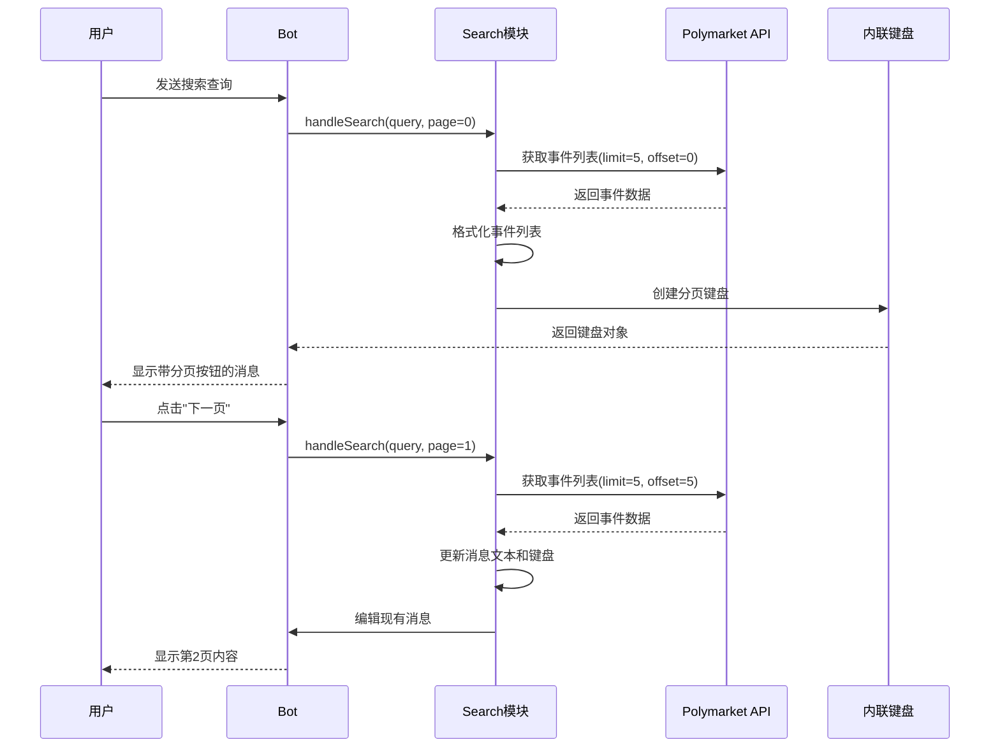
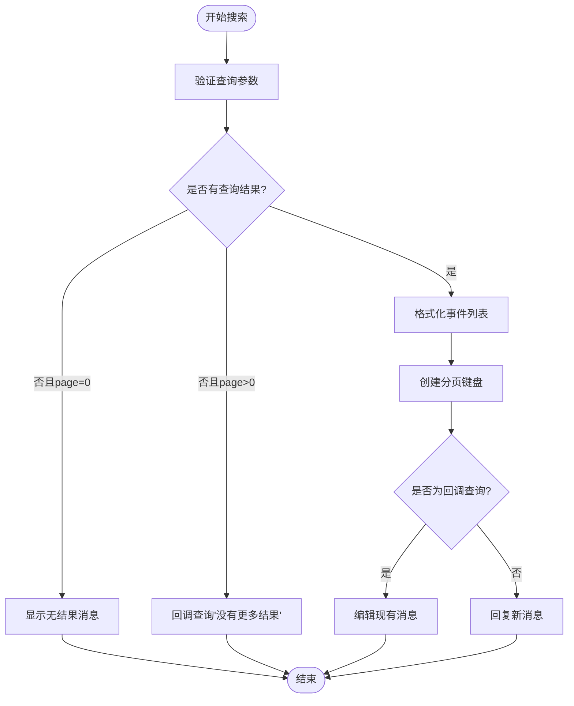
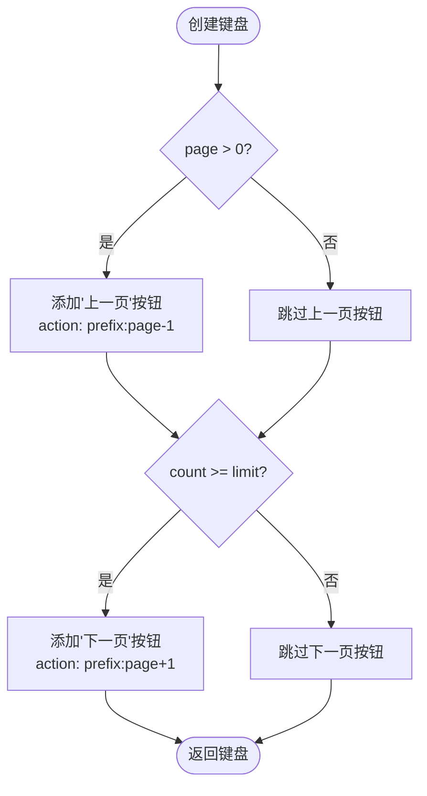
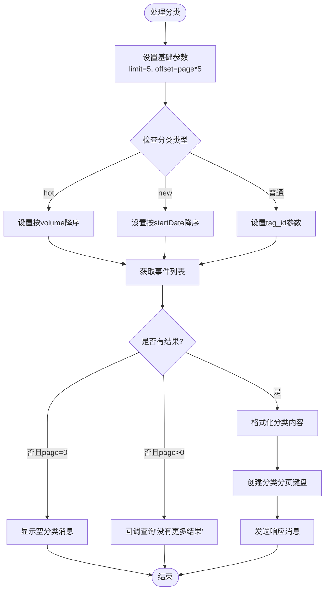
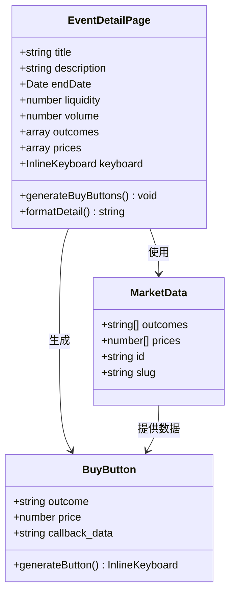
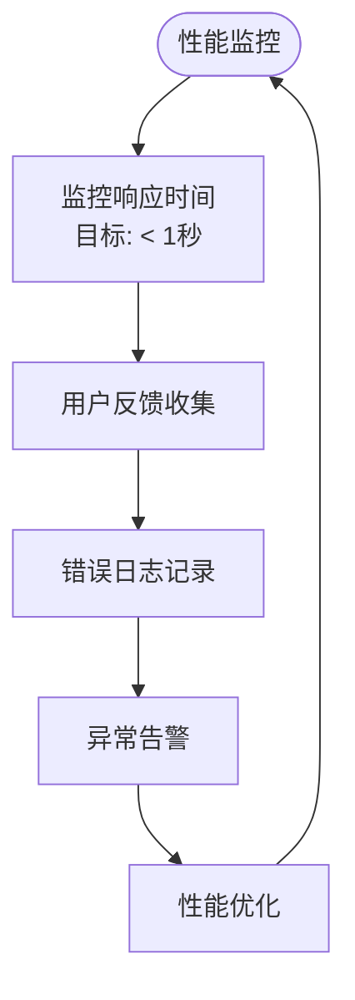

# 分页导航系统

<cite>
**本文档引用的文件**
- [apps/bot/src/search.ts](file://apps/bot/src/search.ts)
- [apps/bot/src/index.ts](file://apps/bot/src/index.ts)
- [apps/bot/src/env.ts](file://apps/bot/src/env.ts)
- [apps/bot/package.json](file://apps/bot/package.json)
- [.env.example](file://.env.example)
- [specs/cryptopulse/requirements.md](file://specs/cryptopulse/requirements.md)
</cite>

## 目录
1. [简介](#简介)
2. [项目结构](#项目结构)
3. [核心组件](#核心组件)
4. [架构概览](#架构概览)
5. [详细组件分析](#详细组件分析)
6. [依赖关系分析](#依赖关系分析)
7. [性能考虑](#性能考虑)
8. [故障排除指南](#故障排除指南)
9. [结论](#结论)

## 简介

分页导航系统是 CryptoPulse 预测机器人的重要组成部分，负责处理搜索结果和分类内容的分页显示。该系统实现了完整的分页逻辑，包括页面大小控制、偏移量计算、边界条件处理，以及内联键盘的动态构建和事件处理。

系统采用 Telegram Bot 架构，通过回调查询实现无刷新的分页导航，提供流畅的用户体验。分页逻辑基于固定页面大小（默认5条记录），通过偏移量计算实现高效的数据检索。

## 项目结构

分页系统主要分布在以下文件中：

```mermaid
graph TB
subgraph "Bot 应用"
A[src/index.ts - 主入口]
B[src/search.ts - 搜索和分页逻辑]
C[src/env.ts - 环境配置]
end
subgraph "外部依赖"
D[grammy - Telegram Bot SDK]
E[@cryptopulse/polymarket - Polymarket API]
end
subgraph "配置文件"
F[.env.example - 环境变量]
G[apps/bot/package.json - 依赖配置]
end
A --> B
B --> D
B --> E
A --> C
C --> F
A --> G
```

**图表来源**
- [apps/bot/src/index.ts](file://apps/bot/src/index.ts#L1-L156)
- [apps/bot/src/search.ts](file://apps/bot/src/search.ts#L1-L233)
- [apps/bot/src/env.ts](file://apps/bot/src/env.ts#L1-L14)

**章节来源**
- [apps/bot/src/index.ts](file://apps/bot/src/index.ts#L1-L156)
- [apps/bot/src/search.ts](file://apps/bot/src/search.ts#L1-L233)
- [apps/bot/src/env.ts](file://apps/bot/src/env.ts#L1-L14)

## 核心组件

### 分页逻辑实现

分页系统的核心功能由以下组件构成：

#### 页面大小控制
- 固定页面大小：每页默认显示5条记录
- 可扩展设计：页面大小可通过常量配置进行调整
- 性能优化：合理限制单页数据量，平衡用户体验和响应速度

#### 偏移量计算
- 计算公式：offset = page × limit
- 动态偏移：根据当前页码实时计算数据库偏移量
- 起始页处理：第0页偏移量为0，确保从数据集开始检索

#### 边界条件处理
- 空结果处理：当查询无结果时，区分初始查询和后续分页场景
- 上一页边界：第0页禁用"上一页"按钮
- 下一页边界：当结果数量小于页面大小时禁用"下一页"按钮
- 错误处理：统一的异常捕获和用户友好的错误提示

**章节来源**
- [apps/bot/src/search.ts](file://apps/bot/src/search.ts#L27-L62)
- [apps/bot/src/search.ts](file://apps/bot/src/search.ts#L64-L111)

### 内联键盘构建

内联键盘是分页导航的用户界面组件，负责动态生成上一页/下一页按钮：

#### 动态按钮生成
- 条件渲染：根据当前页码和结果数量动态决定按钮显示
- 状态管理：自动管理按钮的启用/禁用状态
- 事件绑定：为每个按钮绑定相应的回调查询处理器

#### 按钮状态管理
- 上一页按钮：仅在page > 0时显示
- 下一页按钮：仅在count >= limit时显示
- 交互反馈：通过回调查询提供即时的用户反馈

#### 事件处理机制
- 回调查询路由：正则表达式匹配不同的操作类型
- 参数解析：从回调数据中提取页码和操作参数
- 异步处理：支持异步的分页请求和响应

**章节来源**
- [apps/bot/src/search.ts](file://apps/bot/src/search.ts#L213-L226)
- [apps/bot/src/index.ts](file://apps/bot/src/index.ts#L108-L130)

### 分页状态维护

系统通过动作前缀编码实现分页状态的完整维护：

#### 动作前缀编码
- 搜索分页：`search:{query}:{page}`
- 分类分页：`cat:{category}:{page}`
- 买卖操作：`buy:{marketId}:{outcomeIndex}`
- 订单操作：`order:{marketId}:{outcomeIndex}:{amount}`

#### 状态同步机制
- 统一编码格式：确保所有分页操作使用一致的参数传递方式
- 参数完整性：每个动作都包含足够的上下文信息
- 类型安全：通过正则表达式确保参数格式正确

#### 回调查询处理
- 正则路由：使用正则表达式精确匹配不同类型的回调查询
- 参数提取：从匹配结果中提取操作类型和参数
- 异步响应：支持异步的分页请求处理和消息更新

**章节来源**
- [apps/bot/src/search.ts](file://apps/bot/src/search.ts#L50-L51)
- [apps/bot/src/search.ts](file://apps/bot/src/search.ts#L99-L100)
- [apps/bot/src/index.ts](file://apps/bot/src/index.ts#L108-L130)

## 架构概览

分页系统采用模块化架构设计，各组件职责清晰：



**图表来源**
- [apps/bot/src/index.ts](file://apps/bot/src/index.ts#L98-L101)
- [apps/bot/src/search.ts](file://apps/bot/src/search.ts#L27-L62)
- [apps/bot/src/search.ts](file://apps/bot/src/search.ts#L213-L226)

## 详细组件分析

### 搜索分页组件

搜索分页功能是最复杂的分页实现，需要处理多种场景：

#### 核心处理流程



**图表来源**
- [apps/bot/src/search.ts](file://apps/bot/src/search.ts#L27-L62)

#### 分页键盘生成算法

分页键盘的生成遵循严格的逻辑规则：



**图表来源**
- [apps/bot/src/search.ts](file://apps/bot/src/search.ts#L213-L226)

**章节来源**
- [apps/bot/src/search.ts](file://apps/bot/src/search.ts#L27-L62)
- [apps/bot/src/search.ts](file://apps/bot/src/search.ts#L213-L226)

### 分类分页组件

分类分页功能相对简单，但需要处理特殊分类的排序逻辑：

#### 特殊分类处理

系统支持三种特殊分类，每种都有独特的排序规则：

| 分类 | 排序字段 | 排序方向 | 描述 |
|------|----------|----------|------|
| hot | volume | 降序 | 今日热点市场 |
| new | startDate | 降序 | 最新上线市场 |
| 普通分类 | tag_id | - | 按标签分类 |

#### 分类处理流程



**图表来源**
- [apps/bot/src/search.ts](file://apps/bot/src/search.ts#L64-L111)

**章节来源**
- [apps/bot/src/search.ts](file://apps/bot/src/search.ts#L64-L111)

### 事件详情组件

事件详情页面展示了单个市场的详细信息，并提供了购买按钮：

#### 详情页面构建

事件详情页面包含以下元素：
- 市场基本信息（标题、描述、截止日期）
- 财务指标（流动性、交易量、24小时成交量）
- 当前价格信息（各结果选项的概率）
- 交互按钮（购买、查看详情、返回热门市场）

#### 动态购买按钮生成

系统会根据市场的结果选项动态生成购买按钮：



**图表来源**
- [apps/bot/src/search.ts](file://apps/bot/src/search.ts#L113-L156)
- [apps/bot/src/search.ts](file://apps/bot/src/search.ts#L133-L138)

**章节来源**
- [apps/bot/src/search.ts](file://apps/bot/src/search.ts#L113-L156)

## 依赖关系分析

分页系统的主要依赖关系如下：

```mermaid
graph TB
subgraph "应用层"
A[apps/bot/src/index.ts]
B[apps/bot/src/search.ts]
C[apps/bot/src/env.ts]
end
subgraph "外部库"
D[grammy]
E[zod]
F[dotenv]
end
subgraph "API层"
G[@cryptopulse/polymarket]
end
subgraph "配置层"
H[.env.example]
I[apps/bot/package.json]
end
A --> B
B --> D
B --> E
B --> F
B --> G
A --> C
C --> H
A --> I
```

**图表来源**
- [apps/bot/src/index.ts](file://apps/bot/src/index.ts#L1-L8)
- [apps/bot/src/search.ts](file://apps/bot/src/search.ts#L1-L6)
- [apps/bot/src/env.ts](file://apps/bot/src/env.ts#L1-L10)
- [apps/bot/package.json](file://apps/bot/package.json#L12-L18)

**章节来源**
- [apps/bot/src/index.ts](file://apps/bot/src/index.ts#L1-L8)
- [apps/bot/src/search.ts](file://apps/bot/src/search.ts#L1-L6)
- [apps/bot/src/env.ts](file://apps/bot/src/env.ts#L1-L10)
- [apps/bot/package.json](file://apps/bot/package.json#L12-L18)

## 性能考虑

### 响应时间优化

根据项目要求，系统需要在正常网络条件下将首屏结果响应控制在1秒内。为此采用了以下优化策略：

#### 结果集限制
- 固定页面大小：每页5条记录，避免大量数据传输
- 限制查询范围：active=true, closed=false, archived=false 确保只查询活跃市场
- 合理的排序：热点和最新市场使用适当的排序字段

#### 内存管理
- 流式处理：分页数据按需加载，避免一次性加载所有数据
- 对象复用：重用InlineKeyboard对象，减少内存分配
- 及时清理：及时删除不需要的中间变量

#### 响应速度优化
- CDN加速：静态资源通过CDN分发
- 连接池：数据库连接池复用
- 缓存策略：Redis缓存常用查询结果

### 性能监控

系统通过以下方式监控性能表现：



**章节来源**
- [specs/cryptopulse/requirements.md](file://specs/cryptopulse/requirements.md#L123-L132)

## 故障排除指南

### 常见问题及解决方案

#### 分页按钮不工作
**症状**：点击分页按钮无响应
**可能原因**：
- 回调查询路由配置错误
- 动作前缀编码不匹配
- 参数解析失败

**解决方法**：
1. 检查回调查询正则表达式
2. 验证动作前缀格式
3. 确认参数类型转换正确

#### 搜索结果为空
**症状**：搜索无结果但不显示错误信息
**可能原因**：
- 查询参数格式错误
- API接口不可用
- 网络连接问题

**解决方法**：
1. 验证查询字符串格式
2. 检查API服务状态
3. 确认网络连接稳定

#### 性能问题
**症状**：分页响应缓慢
**可能原因**：
- 页面大小过大
- 查询条件过于复杂
- 数据库性能瓶颈

**解决方法**：
1. 调整页面大小到合理值
2. 简化查询条件
3. 优化数据库索引

**章节来源**
- [apps/bot/src/search.ts](file://apps/bot/src/search.ts#L41-L48)
- [apps/bot/src/search.ts](file://apps/bot/src/search.ts#L58-L62)

## 结论

分页导航系统通过精心设计的架构和实现，为用户提供了流畅的分页体验。系统的主要优势包括：

### 技术优势
- **模块化设计**：清晰的组件分离，便于维护和扩展
- **状态管理**：完善的分页状态维护机制
- **用户体验**：无刷新的分页操作，响应迅速
- **错误处理**：健壮的异常处理和用户反馈机制

### 架构特点
- **可扩展性**：支持自定义页面大小和排序规则
- **性能优化**：合理的数据限制和缓存策略
- **类型安全**：使用Zod进行参数验证
- **配置灵活**：通过环境变量控制行为

### 改进建议
1. **缓存机制**：实现Redis缓存以提升响应速度
2. **并发控制**：添加请求频率限制防止API限流
3. **监控告警**：建立完整的性能监控和告警系统
4. **国际化**：支持多语言界面和错误消息

该分页系统为整个CryptoPulse平台提供了坚实的基础，其设计理念和实现模式可以作为类似应用场景的参考模板。