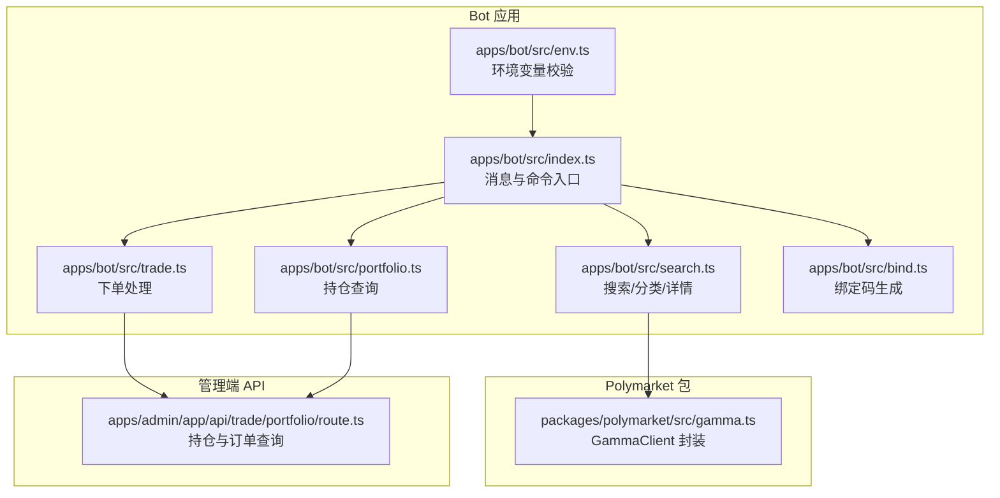
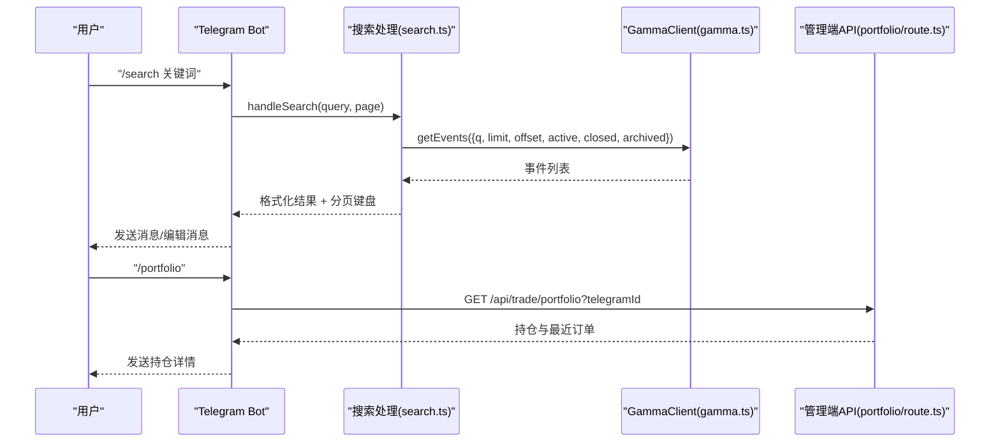
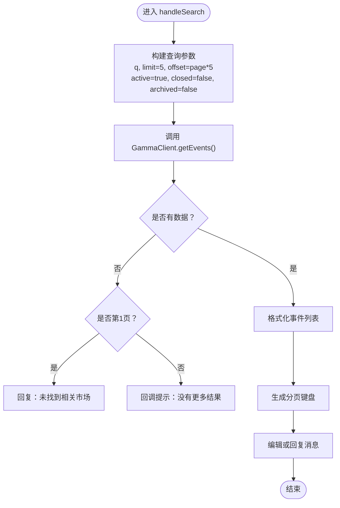
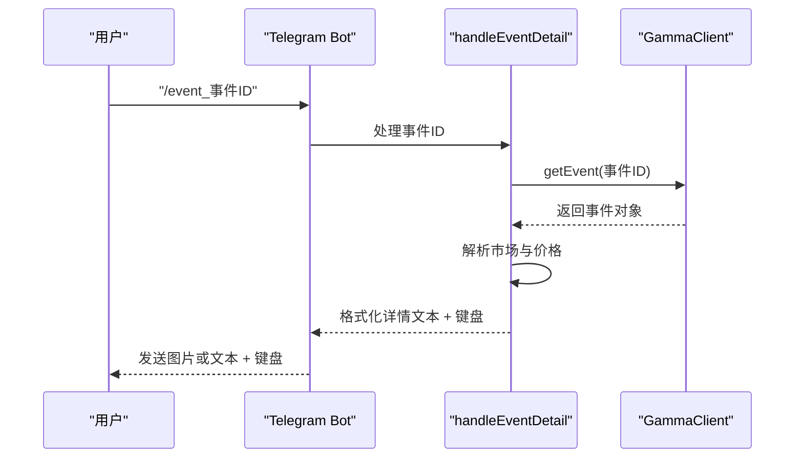
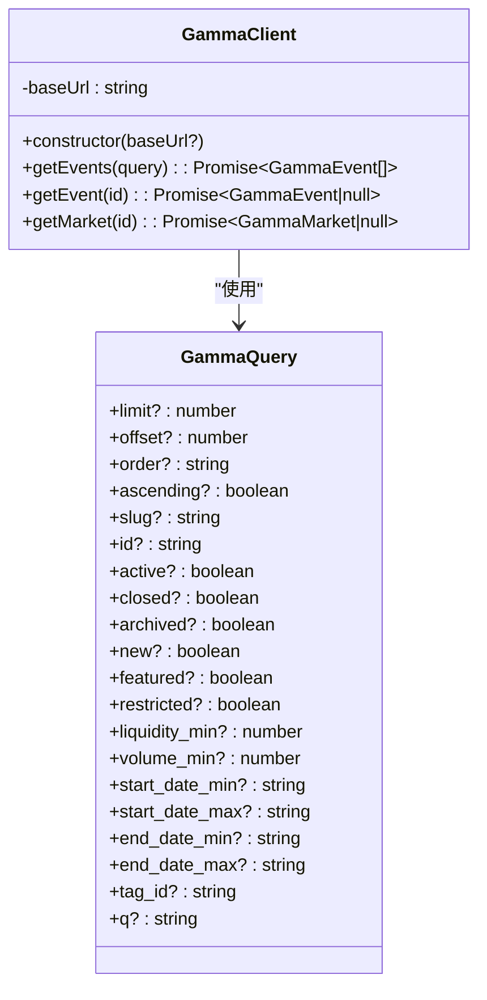
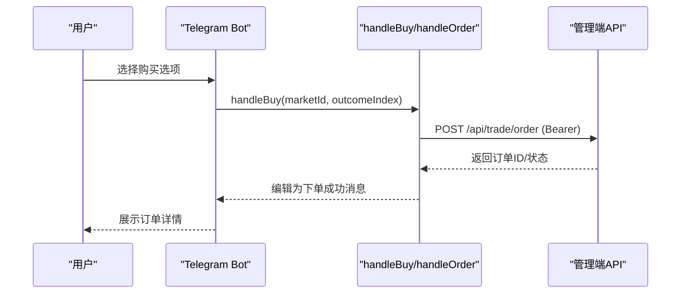
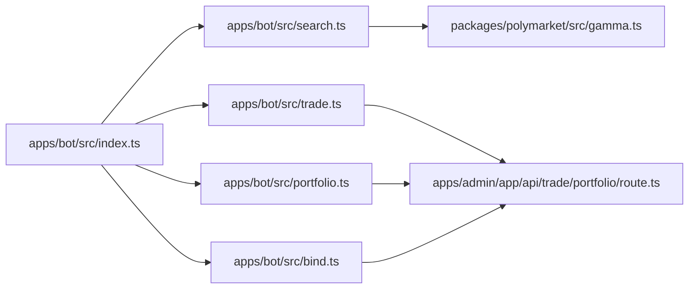
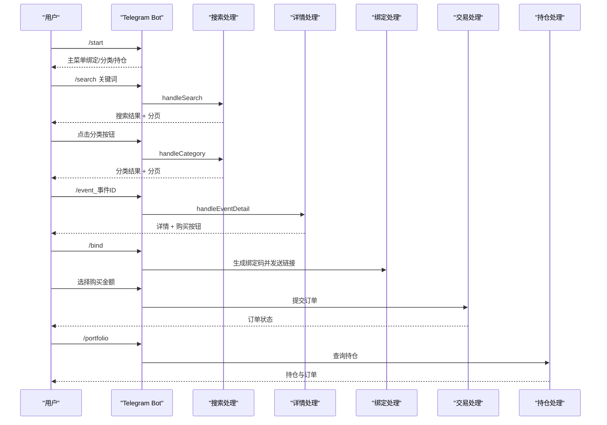

# 市场搜索系统

<cite>
**本文档引用的文件**
- [README.md](file://README.md)
- [.env.example](file://.env.example)
- [apps/bot/src/index.ts](file://apps/bot/src/index.ts)
- [apps/bot/src/search.ts](file://apps/bot/src/search.ts)
- [apps/bot/src/env.ts](file://apps/bot/src/env.ts)
- [apps/bot/src/bind.ts](file://apps/bot/src/bind.ts)
- [apps/bot/src/trade.ts](file://apps/bot/src/trade.ts)
- [apps/bot/src/portfolio.ts](file://apps/bot/src/portfolio.ts)
- [packages/polymarket/src/gamma.ts](file://packages/polymarket/src/gamma.ts)
- [packages/polymarket/package.json](file://packages/polymarket/package.json)
- [apps/admin/app/api/trade/portfolio/route.ts](file://apps/admin/app/api/trade/portfolio/route.ts)
</cite>

## 目录
1. [简介](#简介)
2. [项目结构](#项目结构)
3. [核心组件](#核心组件)
4. [架构总览](#架构总览)
5. [详细组件分析](#详细组件分析)
6. [依赖关系分析](#依赖关系分析)
7. [性能考虑](#性能考虑)
8. [故障排除指南](#故障排除指南)
9. [结论](#结论)
10. [附录](#附录)

## 简介
本项目是一个基于 Telegram 的预测市场搜索与交易机器人，核心能力包括：
- 关键词搜索与分类浏览：通过 Polymarket Gamma API 获取活跃市场，支持分页与排序。
- 市场详情展示：解析事件与市场数据，格式化为易读的文本与内联键盘。
- 交易集成：结合管理端 API 实现下单与持仓查询。
- 用户交互：通过命令、回调查询与内联键盘完成搜索、查看详情与下单。

系统采用模块化设计，Bot 应用负责用户交互，Polymarket 包封装 Gamma API 客户端，管理端提供交易与持仓查询接口。

## 项目结构
- apps/bot：Telegram Bot 应用，包含消息处理、搜索、详情展示、交易与持仓查询。
- packages/polymarket：封装 Polymarket Gamma API 的客户端，提供事件、市场查询。
- apps/admin：Next.js 应用，提供交易与持仓查询 API。
- 根目录：环境变量示例、开发与部署说明。

**图表来源**
- [apps/bot/src/index.ts](file://apps/bot/src/index.ts#L1-L156)
- [apps/bot/src/search.ts](file://apps/bot/src/search.ts#L1-L233)
- [apps/bot/src/trade.ts](file://apps/bot/src/trade.ts#L1-L118)
- [apps/bot/src/portfolio.ts](file://apps/bot/src/portfolio.ts#L1-L76)
- [apps/bot/src/bind.ts](file://apps/bot/src/bind.ts#L1-L39)
- [apps/bot/src/env.ts](file://apps/bot/src/env.ts#L1-L14)
- [packages/polymarket/src/gamma.ts](file://packages/polymarket/src/gamma.ts#L93-L176)
- [apps/admin/app/api/trade/portfolio/route.ts](file://apps/admin/app/api/trade/portfolio/route.ts#L1-L80)

**章节来源**
- [README.md](file://README.md#L1-L65)
- [apps/bot/src/index.ts](file://apps/bot/src/index.ts#L1-L156)

## 核心组件
- GammaClient：封装 Gamma API 的事件、市场查询，自动设置默认过滤条件与分页参数。
- 搜索与分类：支持关键词搜索与分类浏览（热门、最新、按标签），内置分页与排序。
- 市场详情：解析事件与市场数据，格式化描述、截止日期、流动性、交易量与价格。
- 交易与持仓：通过 Bot 管道调用管理端 API，完成下单与持仓查询。
- 环境配置：统一校验与加载环境变量，确保 Bot、API 基础地址、数据库与缓存等配置正确。

**章节来源**
- [packages/polymarket/src/gamma.ts](file://packages/polymarket/src/gamma.ts#L93-L176)
- [apps/bot/src/search.ts](file://apps/bot/src/search.ts#L27-L111)
- [apps/bot/src/trade.ts](file://apps/bot/src/trade.ts#L68-L118)
- [apps/admin/app/api/trade/portfolio/route.ts](file://apps/admin/app/api/trade/portfolio/route.ts#L17-L78)
- [apps/bot/src/env.ts](file://apps/bot/src/env.ts#L3-L12)

## 架构总览
Bot 应用通过命令与回调查询触发业务逻辑，搜索与详情展示依赖 GammaClient 获取数据，交易与持仓查询通过 Bot API 调用管理端接口。

**图表来源**
- [apps/bot/src/index.ts](file://apps/bot/src/index.ts#L45-L51)
- [apps/bot/src/search.ts](file://apps/bot/src/search.ts#L27-L62)
- [packages/polymarket/src/gamma.ts](file://packages/polymarket/src/gamma.ts#L123-L147)
- [apps/admin/app/api/trade/portfolio/route.ts](file://apps/admin/app/api/trade/portfolio/route.ts#L17-L78)

## 详细组件分析

### 搜索与分类组件
- 关键词搜索：默认每页 5 条，按活跃且未关闭/归档过滤，支持分页回调。
- 分类浏览：支持“热门（按成交量降序）”、“最新（按开始时间降序）”、“按标签分类”，分页逻辑同上。
- 错误处理：空结果时根据页码区分首次提示或“无更多结果”。

**图表来源**
- [apps/bot/src/search.ts](file://apps/bot/src/search.ts#L27-L62)

**章节来源**
- [apps/bot/src/search.ts](file://apps/bot/src/search.ts#L27-L111)

### 市场详情组件
- 事件详情：解析事件标题、描述、截止日期、流动性、交易量与 24h 交易量。
- 价格格式化：从市场 outcomes/outcomePrices 解析并格式化为百分比。
- 内联键盘：为每个选项生成购买按钮，附加“网页查看”与“返回热门”按钮。

**图表来源**
- [apps/bot/src/search.ts](file://apps/bot/src/search.ts#L113-L156)
- [packages/polymarket/src/gamma.ts](file://packages/polymarket/src/gamma.ts#L149-L161)

**章节来源**
- [apps/bot/src/search.ts](file://apps/bot/src/search.ts#L113-L194)

### GammaClient 组件
- 默认行为：未指定 limit 时默认 20；默认 active=true、closed=false、archived=false。
- 查询参数：支持 limit、offset、order、ascending、slug、id、active、closed、archived、new、featured、restricted、liquidity_min、volume_min、start_date_min/max、end_date_min/max、tag_id、q 等。
- 错误处理：非 2xx 响应抛出错误，便于上层捕获与提示。

**图表来源**
- [packages/polymarket/src/gamma.ts](file://packages/polymarket/src/gamma.ts#L93-L176)

**章节来源**
- [packages/polymarket/src/gamma.ts](file://packages/polymarket/src/gamma.ts#L116-L176)

### 交易与持仓组件
- 下单流程：选择金额后调用管理端 /api/trade/order，携带 Bearer Token 与用户身份信息。
- 持仓查询：调用 /api/trade/portfolio，返回持仓与最近订单，Bot 端进行格式化展示。
- 绑定流程：生成绑定码并通过 Bot API 提交，生成可点击的绑定链接。

**图表来源**
- [apps/bot/src/trade.ts](file://apps/bot/src/trade.ts#L68-L118)
- [apps/admin/app/api/trade/portfolio/route.ts](file://apps/admin/app/api/trade/portfolio/route.ts#L17-L78)

**章节来源**
- [apps/bot/src/trade.ts](file://apps/bot/src/trade.ts#L7-L118)
- [apps/bot/src/portfolio.ts](file://apps/bot/src/portfolio.ts#L4-L76)
- [apps/bot/src/bind.ts](file://apps/bot/src/bind.ts#L3-L30)

## 依赖关系分析
- Bot 应用依赖：
  - @cryptopulse/polymarket：提供 GammaClient。
  - grammy：Telegram Bot SDK。
  - dotenv：加载环境变量。
- Polymarket 包依赖：
  - @polymarket/builder-relayer-client、@polymarket/builder-signing-sdk、@polymarket/clob-client、viem 等用于链上交互（交易相关）。
- 管理端 API 依赖：
  - @prisma/client：数据库访问。
  - zod：请求参数校验。

**图表来源**
- [apps/bot/src/index.ts](file://apps/bot/src/index.ts#L1-L156)
- [apps/bot/src/search.ts](file://apps/bot/src/search.ts#L1-L233)
- [apps/bot/src/trade.ts](file://apps/bot/src/trade.ts#L1-L118)
- [apps/bot/src/portfolio.ts](file://apps/bot/src/portfolio.ts#L1-L76)
- [apps/bot/src/bind.ts](file://apps/bot/src/bind.ts#L1-L39)
- [packages/polymarket/src/gamma.ts](file://packages/polymarket/src/gamma.ts#L1-L10)
- [apps/admin/app/api/trade/portfolio/route.ts](file://apps/admin/app/api/trade/portfolio/route.ts#L1-L80)

**章节来源**
- [packages/polymarket/package.json](file://packages/polymarket/package.json#L11-L17)
- [apps/admin/app/api/trade/portfolio/route.ts](file://apps/admin/app/api/trade/portfolio/route.ts#L1-L80)

## 性能考虑
- 分页与批量：搜索与分类默认每页 5 条，减少单次消息长度与渲染压力。
- 排序优化：热门按成交量降序、最新按开始时间降序，减少用户翻页成本。
- 数据格式化：对数值进行千/百万单位缩写，提升可读性。
- 错误快速返回：空结果时立即提示，避免无意义的等待。
- 建议优化（通用实践）：
  - 对 Gamma API 结果增加本地缓存（如 Redis）以降低重复查询。
  - 对热门分类与高频搜索关键词建立预取与索引。
  - 对市场详情图片与长描述进行懒加载与截断处理。

[本节为通用性能建议，无需特定文件引用]

## 故障排除指南
- 搜索失败：检查 Gamma API 可达性与网络超时，Bot 侧会捕获异常并提示“搜索失败，请稍后重试”。
- 分类为空：当某分类在当前页无数据时，Bot 会提示“无更多结果”；若为第一页则提示分类下暂无市场。
- 详情获取失败：事件或市场不存在时，Bot 会提示“市场不存在或已下架”或“该事件下暂无有效市场”。
- 交易失败：检查 Bot API Token、数据库配置与管理端接口状态；下单失败会提示具体错误。
- 持仓查询失败：检查 Bearer Token 与管理端接口返回，Bot 会将错误状态码与简要内容反馈给用户。

**章节来源**
- [apps/bot/src/search.ts](file://apps/bot/src/search.ts#L58-L61)
- [apps/bot/src/search.ts](file://apps/bot/src/search.ts#L107-L110)
- [apps/bot/src/search.ts](file://apps/bot/src/search.ts#L152-L155)
- [apps/bot/src/trade.ts](file://apps/bot/src/trade.ts#L112-L115)
- [apps/bot/src/portfolio.ts](file://apps/bot/src/portfolio.ts#L22-L26)

## 结论
本系统通过清晰的模块划分实现了从搜索到详情再到交易的完整闭环。Bot 应用负责用户交互与数据格式化，GammaClient 提供稳定的外部数据接入，管理端 API 提供交易与持仓支撑。通过分页、排序与错误处理机制，系统在可用性与用户体验方面表现良好。建议后续引入缓存与预取策略以进一步提升性能。

[本节为总结性内容，无需特定文件引用]

## 附录

### 环境变量与配置
- 必填项：TELEGRAM_BOT_TOKEN、API_BASE_URL、WEB_BASE_URL、BOT_API_TOKEN。
- 数据库与缓存：DATABASE_URL、REDIS_URL（可选）。
- Polymarket 链上参数：POLYMARKET_CHAIN_ID、POLYMARKET_CLOB_HOST、POLYMARKET_WS_URL、POLYMARKET_RELAYER_URL、POLYMARKET_RPC_URL。
- 其他：ADMIN_TOKEN（管理后台）、Builder 与签名相关密钥（服务端）。

**章节来源**
- [.env.example](file://.env.example#L1-L43)
- [apps/bot/src/env.ts](file://apps/bot/src/env.ts#L3-L12)

### 搜索 API 说明
- 请求路径：/api/trade/portfolio
- 方法：GET
- 认证：Bearer Token（BOT_API_TOKEN）
- 查询参数：
  - telegramId：正整数，用户 Telegram ID
- 成功响应字段：
  - positions：持仓数组，包含 marketId、outcomeIndex、amount
  - recentOrders：最近订单数组，包含 marketId、outcomeIndex、side、amount、status、createdAt
- 错误状态码：
  - 400：invalid_query（查询参数无效）
  - 401：unauthorized（令牌缺失或不匹配）
  - 500：server_error（服务器内部错误）
  - 503：database_unavailable（数据库不可用）

**章节来源**
- [apps/admin/app/api/trade/portfolio/route.ts](file://apps/admin/app/api/trade/portfolio/route.ts#L7-L78)

### 与 Telegram 机器人的集成与交互流程
- 启动与菜单：/start 命令展示绑定、热门分类与我的仓位按钮。
- 关键词搜索：/search 命令或直接发送文本触发搜索，支持分页回调。
- 分类浏览：点击分类按钮（热门/最新/各标签）进入对应列表，支持分页。
- 市场详情：点击 /event_事件ID 查看详情，支持购买按钮与“网页查看”。
- 绑定流程：/bind 生成绑定码并通过 Bot API 提交，生成可点击绑定链接。
- 交易流程：选择购买金额后提交订单，Bot 显示订单状态。
- 持仓查询：/portfolio 查询当前持仓与最近订单。

**图表来源**
- [apps/bot/src/index.ts](file://apps/bot/src/index.ts#L11-L156)
- [apps/bot/src/search.ts](file://apps/bot/src/search.ts#L27-L156)
- [apps/bot/src/bind.ts](file://apps/bot/src/bind.ts#L3-L30)
- [apps/bot/src/trade.ts](file://apps/bot/src/trade.ts#L68-L118)
- [apps/bot/src/portfolio.ts](file://apps/bot/src/portfolio.ts#L4-L76)