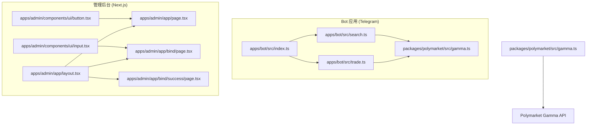
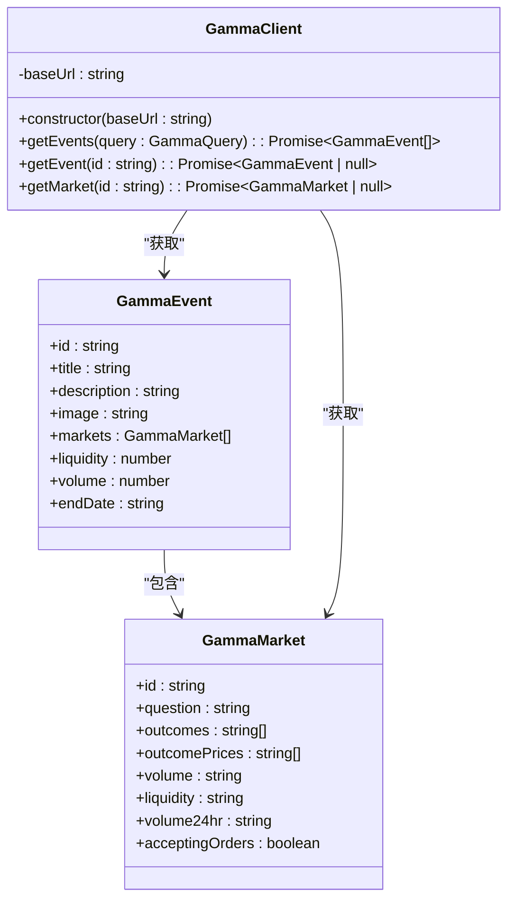
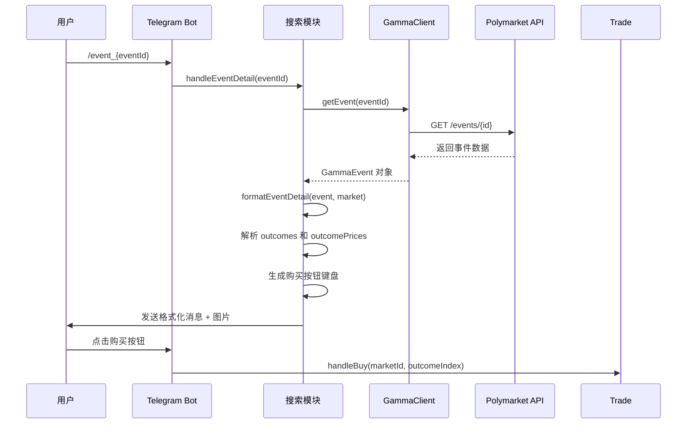
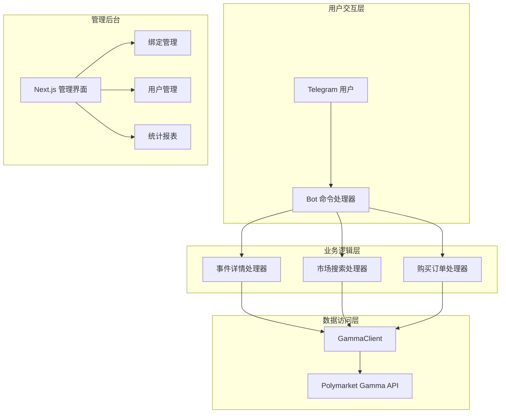
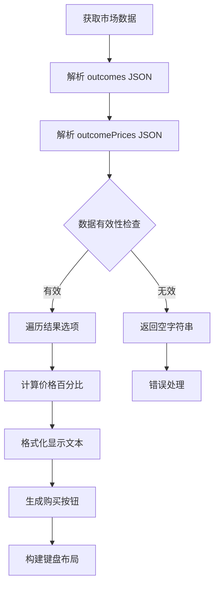
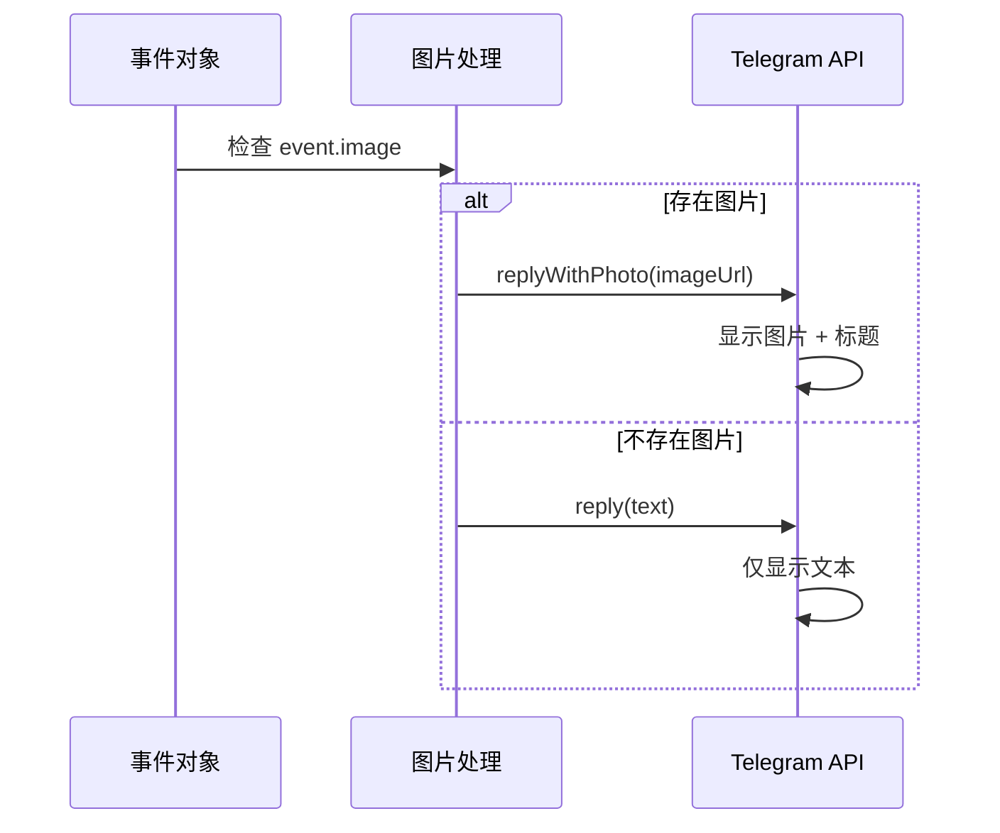
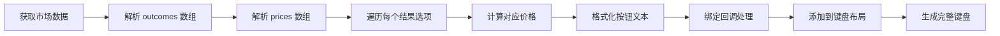
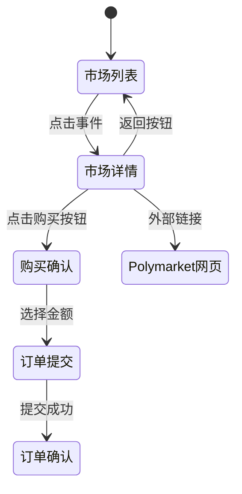
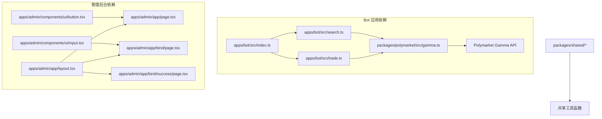

# 市场详情展示

<cite>
**本文档引用的文件**
- [README.md](file://README.md)
- [search.ts](file://apps/bot/src/search.ts)
- [trade.ts](file://apps/bot/src/trade.ts)
- [index.ts](file://apps/bot/src/index.ts)
- [gamma.ts](file://packages/polymarket/src/gamma.ts)
- [button.tsx](file://apps/admin/components/ui/button.tsx)
- [input.tsx](file://apps/admin/components/ui/input.tsx)
- [layout.tsx](file://apps/admin/app/layout.tsx)
- [page.tsx](file://apps/admin/app/page.tsx)
- [page.tsx](file://apps/admin/app/bind/success/page.tsx)
- [page.tsx](file://apps/admin/app/bind/page.tsx)
</cite>

## 目录
1. [简介](#简介)
2. [项目结构](#项目结构)
3. [核心组件](#核心组件)
4. [架构概览](#架构概览)
5. [详细组件分析](#详细组件分析)
6. [依赖关系分析](#依赖关系分析)
7. [性能考虑](#性能考虑)
8. [故障排除指南](#故障排除指南)
9. [结论](#结论)

## 简介

本项目是一个基于 Telegram 的 Polymarket 预测市场机器人，专注于提供市场详情展示功能。系统通过与 Polymarket Gamma API 集成，实时获取市场数据，为用户提供详细的市场信息展示、价格解析、购买按钮动态生成等核心功能。

该系统采用模块化设计，主要包含以下核心功能：
- 市场详情数据获取与解析
- HTML 格式化文本处理
- 图片处理与响应式适配
- 动态购买按钮生成
- 导航设计与页面跳转
- Polymarket 网站深度集成

## 项目结构

项目采用多应用架构，主要包含两个核心应用：

**图表来源**
- [index.ts](file://apps/bot/src/index.ts#L1-L150)
- [search.ts](file://apps/bot/src/search.ts#L1-L160)
- [trade.ts](file://apps/bot/src/trade.ts#L1-L120)
- [gamma.ts](file://packages/polymarket/src/gamma.ts#L1-L177)

**章节来源**
- [README.md](file://README.md#L1-L65)
- [index.ts](file://apps/bot/src/index.ts#L1-L150)

## 核心组件

### GammaClient 数据接口层

GammaClient 是系统的核心数据接口，负责与 Polymarket Gamma API 进行通信，提供事件和市场的数据获取能力。

**图表来源**
- [gamma.ts](file://packages/polymarket/src/gamma.ts#L116-L176)

### 市场详情展示组件

市场详情展示功能是系统的核心组件，负责将原始市场数据转换为用户友好的格式化信息。

**图表来源**
- [search.ts](file://apps/bot/src/search.ts#L113-L156)
- [trade.ts](file://apps/bot/src/trade.ts#L7-L66)

**章节来源**
- [gamma.ts](file://packages/polymarket/src/gamma.ts#L1-L177)
- [search.ts](file://apps/bot/src/search.ts#L113-L156)
- [trade.ts](file://apps/bot/src/trade.ts#L1-L117)

## 架构概览

系统采用分层架构设计，确保各组件职责清晰、耦合度低：

**图表来源**
- [index.ts](file://apps/bot/src/index.ts#L91-L130)
- [search.ts](file://apps/bot/src/search.ts#L1-L160)
- [trade.ts](file://apps/bot/src/trade.ts#L1-L117)

## 详细组件分析

### 市场详情数据结构

系统通过 GammaClient 获取的市场数据包含丰富的信息，支持全面的详情展示：

#### 事件信息结构
- **基础信息**: id、title、slug、description
- **时间信息**: startDate、creationDate、endDate
- **状态信息**: active、closed、archived、new、featured
- **媒体信息**: image、icon
- **统计数据**: liquidity、volume、open_interest

#### 市场数据结构
- **市场标识**: id、question、conditionId、slug
- **价格信息**: outcomes、outcomePrices、volume24hr
- **流动性**: liquidity、umaBond、umaReward
- **订单信息**: acceptingOrders、negRisk、clobRewards
- **技术参数**: orderPriceMin、orderPriceMax、orderMinSize

#### 价格信息解析流程

**图表来源**
- [search.ts](file://apps/bot/src/search.ts#L196-L211)
- [search.ts](file://apps/bot/src/search.ts#L130-L138)

**章节来源**
- [gamma.ts](file://packages/polymarket/src/gamma.ts#L2-L91)
- [search.ts](file://apps/bot/src/search.ts#L196-L211)

### 文本格式化与 HTML 处理

系统采用 HTML 格式进行消息渲染，支持丰富的文本格式化：

#### 格式化函数实现
- **formatEventDetail**: 生成完整的市场详情文本
- **formatPrices**: 格式化价格信息，支持详细和简略模式
- **formatNumber**: 数字格式化，支持 K/M 缩写

#### HTML 标签处理策略
- **标题格式**: 使用 `<b>` 标签进行粗体显示
- **链接格式**: 使用 `<a href="">` 标签创建可点击链接
- **段落格式**: 使用换行符 `\n` 进行段落分隔
- **特殊符号**: 使用表情符号增强可读性

**章节来源**
- [search.ts](file://apps/bot/src/search.ts#L174-L194)
- [search.ts](file://apps/bot/src/search.ts#L228-L232)

### 图片处理机制

系统支持事件图片的自动获取、显示和响应式适配：

#### 图片获取流程

**图表来源**
- [search.ts](file://apps/bot/src/search.ts#L143-L151)

#### 图片显示特性
- **自动检测**: 智能检测事件是否包含图片
- **条件显示**: 根据图片存在性选择不同的消息类型
- **响应式适配**: 依赖 Telegram 平台的自动适配机制

**章节来源**
- [search.ts](file://apps/bot/src/search.ts#L143-L151)

### 购买按钮动态生成

系统根据市场结果选项动态生成购买按钮，提供直观的交互体验：

#### 按钮生成逻辑

**图表来源**
- [search.ts](file://apps/bot/src/search.ts#L130-L138)

#### 交互事件绑定
- **回调格式**: `buy:{marketId}:{outcomeIndex}`
- **参数传递**: 自动传递市场ID和选项索引
- **错误处理**: 包含无效选项的保护机制

**章节来源**
- [search.ts](file://apps/bot/src/search.ts#L130-L138)
- [trade.ts](file://apps/bot/src/trade.ts#L124-L130)

### 导航设计与页面跳转

系统提供完整的导航机制，支持多种页面跳转方式：

#### 内部导航
- **返回按钮**: "🔙 热门市场" 返回到热门市场列表
- **分类导航**: 支持不同分类的快速切换
- **分页导航**: 支持多页结果的翻页浏览

#### 外部链接集成
- **Polymarket 网页**: "🌐 在网页查看" 直接跳转到 Polymarket 官网
- **Bot 链接**: 自动识别并跳转到对应的 Telegram Bot

#### 页面跳转机制

**图表来源**
- [search.ts](file://apps/bot/src/search.ts#L140-L141)
- [index.ts](file://apps/bot/src/index.ts#L108-L130)

**章节来源**
- [search.ts](file://apps/bot/src/search.ts#L140-L141)
- [index.ts](file://apps/bot/src/index.ts#L108-L130)

### 自定义选项与样式定制

系统提供灵活的自定义选项，支持格式化模板和样式定制：

#### 格式化模板
- **描述截断**: 自动截取过长的事件描述
- **数字格式化**: 支持 K/M 缩写的大数显示
- **日期格式化**: 统一的日期显示格式

#### 样式定制
- **颜色方案**: 使用 Telegram 支持的颜色显示
- **字体大小**: 通过 HTML 标签控制标题和正文大小
- **间距控制**: 通过换行符和缩进控制布局

**章节来源**
- [search.ts](file://apps/bot/src/search.ts#L182-L184)
- [search.ts](file://apps/bot/src/search.ts#L228-L232)

## 依赖关系分析

系统各组件之间的依赖关系清晰明确：

**图表来源**
- [index.ts](file://apps/bot/src/index.ts#L1-L10)
- [gamma.ts](file://packages/polymarket/src/gamma.ts#L1-L10)

**章节来源**
- [index.ts](file://apps/bot/src/index.ts#L1-L10)
- [gamma.ts](file://packages/polymarket/src/gamma.ts#L1-L10)

## 性能考虑

系统在设计时充分考虑了性能优化：

### 数据缓存策略
- **API 响应缓存**: 合理利用 Polymarket API 的缓存机制
- **内存缓存**: 在 Bot 内部维护短期数据缓存
- **图片缓存**: 依赖 Telegram 的图片缓存机制

### 网络优化
- **批量请求**: 合并相关的 API 请求
- **超时控制**: 设置合理的请求超时时间
- **错误重试**: 实现智能的错误重试机制

### 内存管理
- **及时释放**: 及时清理不再使用的数据结构
- **循环引用**: 避免创建循环引用导致的内存泄漏
- **大对象处理**: 对大型数据对象进行分批处理

## 故障排除指南

### 常见问题及解决方案

#### 事件获取失败
**症状**: 显示 "❌ 市场不存在或已下架。"
**原因**: 事件ID无效或事件已被下架
**解决**: 验证事件ID正确性，检查事件状态

#### 市场数据解析错误
**症状**: 价格显示异常或购买按钮不显示
**原因**: outcomes 或 outcomePrices 数据格式异常
**解决**: 添加数据格式验证，提供默认值处理

#### 图片加载失败
**症状**: 仅显示文字内容，缺少图片
**原因**: 事件图片URL无效或网络问题
**解决**: 实现图片加载失败的降级处理

#### 购买功能异常
**症状**: 购买按钮点击无响应
**原因**: 市场ID或选项索引参数错误
**解决**: 添加参数验证和错误提示

**章节来源**
- [search.ts](file://apps/bot/src/search.ts#L116-L118)
- [search.ts](file://apps/bot/src/search.ts#L122-L125)
- [trade.ts](file://apps/bot/src/trade.ts#L17-L20)

## 结论

市场详情展示功能通过精心设计的架构和实现，为用户提供了完整、直观的 Polymarket 市场信息展示体验。系统的主要优势包括：

1. **数据完整性**: 全面的市场数据展示，包括价格、流动性、交易量等关键指标
2. **用户体验**: 直观的界面设计和流畅的交互流程
3. **扩展性**: 模块化的架构设计，便于功能扩展和维护
4. **可靠性**: 完善的错误处理和异常恢复机制
5. **性能优化**: 合理的缓存策略和网络优化

该系统为 Polymarket 生态系统的用户提供了优质的移动端市场信息获取体验，通过与 Polymarket 网站的深度集成，实现了从数据获取到用户交互的完整闭环。