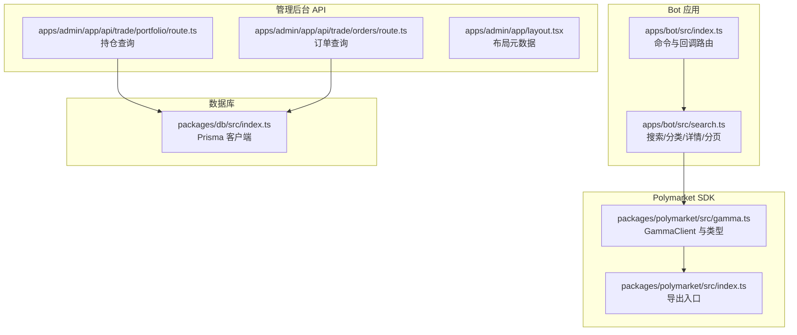
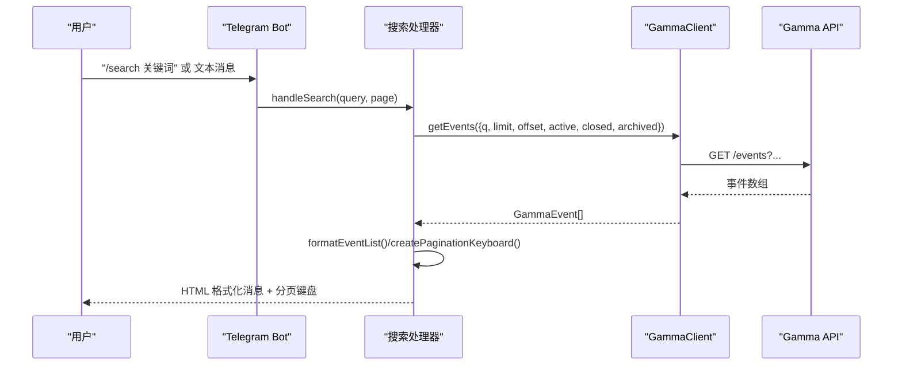
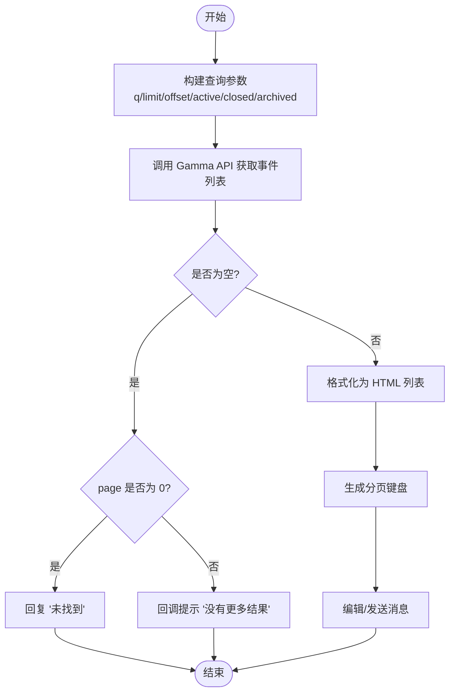
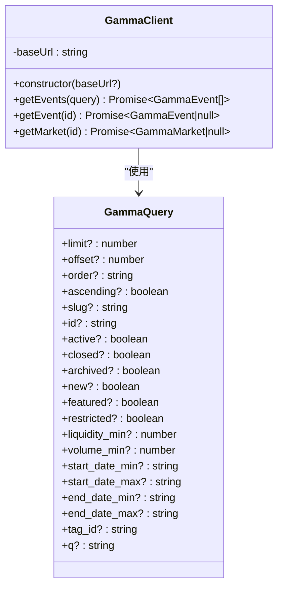
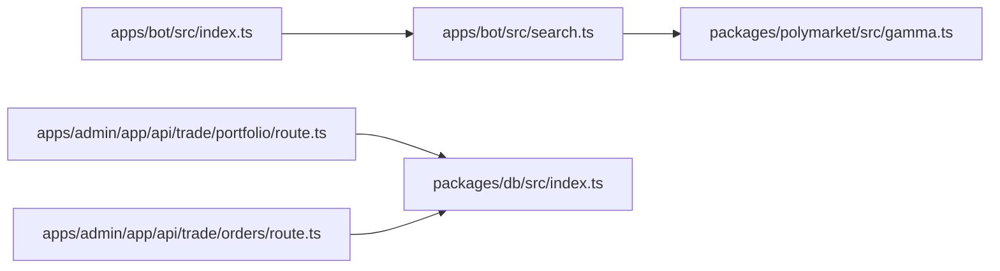

# 搜索算法与实现

<cite>
**本文引用的文件**
- [apps/bot/src/search.ts](file://apps/bot/src/search.ts)
- [apps/bot/src/index.ts](file://apps/bot/src/index.ts)
- [packages/polymarket/src/gamma.ts](file://packages/polymarket/src/gamma.ts)
- [packages/polymarket/src/index.ts](file://packages/polymarket/src/index.ts)
- [apps/admin/app/api/trade/portfolio/route.ts](file://apps/admin/app/api/trade/portfolio/route.ts)
- [apps/admin/app/api/trade/orders/route.ts](file://apps/admin/app/api/trade/orders/route.ts)
- [apps/admin/app/layout.tsx](file://apps/admin/app/layout.tsx)
- [packages/db/src/index.ts](file://packages/db/src/index.ts)
- [.env.example](file://.env.example)
- [README.md](file://README.md)
</cite>

## 目录
1. [简介](#简介)
2. [项目结构](#项目结构)
3. [核心组件](#核心组件)
4. [架构总览](#架构总览)
5. [详细组件分析](#详细组件分析)
6. [依赖关系分析](#依赖关系分析)
7. [性能考虑](#性能考虑)
8. [故障排查指南](#故障排查指南)
9. [结论](#结论)
10. [附录](#附录)

## 简介
本技术文档聚焦于 Polymarket 预测市场的搜索算法与实现，涵盖关键词搜索的查询参数构建、事件过滤逻辑、结果排序机制、分页搜索的实现原理（limit 与 offset）、页面导航与边界处理、搜索结果的 HTML 格式化与链接生成、以及与 Polymarket Gamma API 的交互流程。同时提供性能优化策略、配置参数说明、自定义选项与扩展方法，并给出与管理后台数据库交互的相关接口参考。

## 项目结构
Bot 侧搜索功能主要由 Telegram Bot 控制器与 Polymarket SDK 组成，管理后台提供与数据库交互的 API 接口用于持仓与订单查询。整体采用模块化组织，Bot 通过 GammaClient 调用外部 Gamma API，返回事件列表并进行格式化输出。

图表来源
- [apps/bot/src/index.ts](file://apps/bot/src/index.ts#L1-L156)
- [apps/bot/src/search.ts](file://apps/bot/src/search.ts#L1-L233)
- [packages/polymarket/src/gamma.ts](file://packages/polymarket/src/gamma.ts#L1-L177)
- [packages/polymarket/src/index.ts](file://packages/polymarket/src/index.ts#L1-L11)
- [apps/admin/app/api/trade/portfolio/route.ts](file://apps/admin/app/api/trade/portfolio/route.ts#L1-L80)
- [apps/admin/app/api/trade/orders/route.ts](file://apps/admin/app/api/trade/orders/route.ts#L1-L44)
- [apps/admin/app/layout.tsx](file://apps/admin/app/layout.tsx#L1-L24)
- [packages/db/src/index.ts](file://packages/db/src/index.ts#L1-L13)

章节来源
- [apps/bot/src/index.ts](file://apps/bot/src/index.ts#L1-L156)
- [apps/bot/src/search.ts](file://apps/bot/src/search.ts#L1-L233)
- [packages/polymarket/src/gamma.ts](file://packages/polymarket/src/gamma.ts#L1-L177)
- [packages/polymarket/src/index.ts](file://packages/polymarket/src/index.ts#L1-L11)
- [apps/admin/app/api/trade/portfolio/route.ts](file://apps/admin/app/api/trade/portfolio/route.ts#L1-L80)
- [apps/admin/app/api/trade/orders/route.ts](file://apps/admin/app/api/trade/orders/route.ts#L1-L44)
- [apps/admin/app/layout.tsx](file://apps/admin/app/layout.tsx#L1-L24)
- [packages/db/src/index.ts](file://packages/db/src/index.ts#L1-L13)

## 核心组件
- Bot 控制器：负责命令解析、消息文本监听、内联键盘回调路由，调用搜索处理函数。
- 搜索处理器：封装关键词搜索、分类浏览、事件详情展示、分页键盘生成与结果格式化。
- Polymarket SDK：封装 GammaClient，统一构建查询参数、调用 Gamma API 并解析响应。
- 管理后台 API：提供基于 Prisma 的数据库查询接口，支持按 Telegram ID 查询订单与计算持仓。

章节来源
- [apps/bot/src/index.ts](file://apps/bot/src/index.ts#L45-L122)
- [apps/bot/src/search.ts](file://apps/bot/src/search.ts#L27-L111)
- [packages/polymarket/src/gamma.ts](file://packages/polymarket/src/gamma.ts#L116-L176)
- [apps/admin/app/api/trade/portfolio/route.ts](file://apps/admin/app/api/trade/portfolio/route.ts#L17-L78)

## 架构总览
Bot 侧搜索工作流：用户输入关键词或点击分类按钮 → Bot 解析命令/回调 → 构建查询参数 → 调用 GammaClient 获取事件列表 → 格式化为 HTML 文本并生成分页内联键盘 → 发送消息给用户。管理后台通过 API 对接数据库，提供订单与持仓查询能力。

图表来源
- [apps/bot/src/index.ts](file://apps/bot/src/index.ts#L45-L101)
- [apps/bot/src/search.ts](file://apps/bot/src/search.ts#L27-L62)
- [packages/polymarket/src/gamma.ts](file://packages/polymarket/src/gamma.ts#L123-L147)

## 详细组件分析

### 关键词搜索与查询参数构建
- 查询参数来源：关键词 q、分页 limit/offset、过滤 active/closed/archived、可选排序 order/ascending。
- 默认行为：若未显式传入 limit，则默认取 20；active/closed/archived 默认过滤为仅显示活跃且未关闭/归档的事件。
- 用户交互：支持命令 /search 与普通文本消息两种入口；首次搜索为空时提示“未找到”，翻页为空时提示“没有更多结果”。

章节来源
- [apps/bot/src/search.ts](file://apps/bot/src/search.ts#L27-L62)
- [packages/polymarket/src/gamma.ts](file://packages/polymarket/src/gamma.ts#L93-L114)
- [packages/polymarket/src/gamma.ts](file://packages/polymarket/src/gamma.ts#L123-L147)

### 事件过滤逻辑
- 过滤字段：active、closed、archived 三者组合确保只返回当前可交易的事件；q 字段用于全文检索。
- 时间范围：可通过 start_date_min/max、end_date_min/max 进一步限定时间窗口（SDK 默认未强制传入）。
- 结果数量：limit 控制每页条数；offset = page × limit 实现分页。

章节来源
- [apps/bot/src/search.ts](file://apps/bot/src/search.ts#L29-L39)
- [packages/polymarket/src/gamma.ts](file://packages/polymarket/src/gamma.ts#L123-L147)

### 结果排序机制
- 热门分类：按交易量降序排列（order=volume, ascending=false）。
- 最新分类：按开始日期降序排列（order=startDate, ascending=false）。
- 普通分类：按 tag_id 过滤，不改变默认排序。
- 其他排序：可通过 order/ascending 自定义（SDK 支持）。

章节来源
- [apps/bot/src/search.ts](file://apps/bot/src/search.ts#L77-L85)
- [packages/polymarket/src/gamma.ts](file://packages/polymarket/src/gamma.ts#L93-L114)

### 分页搜索实现原理
- 分页参数：limit 固定为 5；offset = page × limit。
- 导航逻辑：上一页按钮仅在 page > 0 时显示；下一页按钮仅在本次请求返回 count ≥ limit 时显示。
- 边界处理：当 page=0 且无结果时提示“未找到”；当非第 1 页无结果时提示“没有更多结果”。

图表来源
- [apps/bot/src/search.ts](file://apps/bot/src/search.ts#L27-L62)
- [apps/bot/src/search.ts](file://apps/bot/src/search.ts#L213-L226)

章节来源
- [apps/bot/src/search.ts](file://apps/bot/src/search.ts#L27-L62)
- [apps/bot/src/search.ts](file://apps/bot/src/search.ts#L213-L226)

### 搜索结果格式化与链接生成
- 列表格式：标题、交易量、价格信息、内联命令 /event_{id}。
- 详情格式：标题、描述（截断至最大长度）、截止日期、流动性、交易量、当前价格明细。
- 链接生成：每个事件标题生成 https://polymarket.com/event/{slug} 的外链；图片存在时以照片形式发送带标题的消息。
- HTML 格式：parse_mode 使用 HTML，link_preview_options 禁用预览提升性能与体验。

章节来源
- [apps/bot/src/search.ts](file://apps/bot/src/search.ts#L158-L172)
- [apps/bot/src/search.ts](file://apps/bot/src/search.ts#L174-L194)
- [apps/bot/src/search.ts](file://apps/bot/src/search.ts#L143-L151)

### 与 Polymarket Gamma API 的交互
- 客户端封装：GammaClient 提供 getEvents/getEvent/getMarket 方法；内部将查询对象转换为 URLSearchParams。
- 默认参数：若未传入 limit，默认 20；active/closed/archived 默认过滤。
- 错误处理：对非 2xx 响应抛出错误；对 404 返回 null（getEvent/getMarket）。

图表来源
- [packages/polymarket/src/gamma.ts](file://packages/polymarket/src/gamma.ts#L93-L114)
- [packages/polymarket/src/gamma.ts](file://packages/polymarket/src/gamma.ts#L116-L176)

章节来源
- [packages/polymarket/src/gamma.ts](file://packages/polymarket/src/gamma.ts#L116-L176)
- [packages/polymarket/src/gamma.ts](file://packages/polymarket/src/gamma.ts#L123-L147)

### 与 Bot 控制器的集成
- 命令路由：/search 触发关键词搜索；/event_{id} 打开事件详情。
- 文本监听：非命令文本作为关键词传递给 handleSearch。
- 回调路由：分类按钮 cat:{category}:{page}、搜索分页 search:{query}:{page}、购买 buy:{marketId}:{index}。
- 错误捕获：全局 bot.catch 输出错误日志。

章节来源
- [apps/bot/src/index.ts](file://apps/bot/src/index.ts#L45-L101)
- [apps/bot/src/index.ts](file://apps/bot/src/index.ts#L108-L139)
- [apps/bot/src/index.ts](file://apps/bot/src/index.ts#L150-L152)

### 管理后台数据库交互（与搜索无关但相关）
- 持仓查询：按 telegramId 查询订单，聚合多笔订单得到净头寸，返回最近订单与持仓列表。
- 订单查询：支持 limit 参数（1..100），默认取 200。
- 数据库客户端：PrismaClient 单例模式，日志级别 warn/error。

章节来源
- [apps/admin/app/api/trade/portfolio/route.ts](file://apps/admin/app/api/trade/portfolio/route.ts#L17-L78)
- [apps/admin/app/api/trade/orders/route.ts](file://apps/admin/app/api/trade/orders/route.ts#L7-L44)
- [packages/db/src/index.ts](file://packages/db/src/index.ts#L1-L13)

## 依赖关系分析
- Bot 依赖 Polymarket SDK 提供的 GammaClient 与类型定义。
- Bot 通过回调路由与搜索处理器解耦，便于扩展新的搜索维度（如按标签、时间区间等）。
- 管理后台 API 依赖 Prisma 客户端进行数据库操作，与搜索功能无直接耦合。

图表来源
- [apps/bot/src/index.ts](file://apps/bot/src/index.ts#L1-L156)
- [apps/bot/src/search.ts](file://apps/bot/src/search.ts#L1-L233)
- [packages/polymarket/src/gamma.ts](file://packages/polymarket/src/gamma.ts#L1-L177)
- [apps/admin/app/api/trade/portfolio/route.ts](file://apps/admin/app/api/trade/portfolio/route.ts#L1-L80)
- [apps/admin/app/api/trade/orders/route.ts](file://apps/admin/app/api/trade/orders/route.ts#L1-L44)
- [packages/db/src/index.ts](file://packages/db/src/index.ts#L1-L13)

## 性能考虑
- 查询缓存：对热门关键词或高频分类（如 hot/new）可在服务端引入短期缓存（如 Redis），减少重复调用 Gamma API 的次数。
- 结果限制：limit 默认 5（搜索列表），Gamma API 默认 20；可根据需要调整以平衡响应速度与信息密度。
- 响应时间优化：禁用链接预览（link_preview_options.disable=true）减少渲染开销；避免在消息中发送大图，必要时使用小图或占位符。
- 分页策略：固定较小的 limit 可降低单次渲染压力；在 Bot 端使用内联键盘分页，避免一次性拉取过多数据。
- 错误与超时：为 Gamma API 调用增加超时与重试策略，避免阻塞用户交互。

## 故障排查指南
- 搜索失败：检查 Gamma API 可达性与返回状态；确认查询参数（q/limit/offset）合法。
- 无结果：确认 active/closed/archived 过滤条件是否过于严格；尝试扩大时间范围或放宽关键词。
- 分页异常：确认 page 与 limit 的计算是否正确；检查 count 与 limit 的比较逻辑。
- 管理后台查询失败：检查 BOT_API_TOKEN、DATABASE_URL 环境变量；确认 Prisma 客户端初始化与迁移状态。

章节来源
- [apps/bot/src/search.ts](file://apps/bot/src/search.ts#L58-L61)
- [apps/admin/app/api/trade/portfolio/route.ts](file://apps/admin/app/api/trade/portfolio/route.ts#L17-L26)
- [apps/admin/app/api/trade/orders/route.ts](file://apps/admin/app/api/trade/orders/route.ts#L18-L26)
- [.env.example](file://.env.example#L1-L43)

## 结论
本搜索实现以简洁的查询参数与分页机制为核心，结合 HTML 格式化与内联键盘导航，提供了良好的用户体验。通过扩展 GammaQuery 支持更多过滤与排序维度，可进一步增强搜索能力。配合缓存与限流策略，可在高并发场景下保持稳定与快速的响应。

## 附录

### 配置参数与环境变量
- TELEGRAM_BOT_TOKEN：Bot 认证令牌。
- BOT_API_TOKEN：Bot 相关 API 的 Bearer Token（用于受保护接口）。
- API_BASE_URL/WEB_BASE_URL：Bot 与 Web 服务的基础地址。
- DATABASE_URL：PostgreSQL 连接串（管理后台使用）。
- REDIS_URL：Redis 连接串（可用于缓存，如需启用）。
- POLYMARKET_*：Polymarket 相关链与服务地址（与搜索无直接关系）。

章节来源
- [.env.example](file://.env.example#L1-L43)
- [README.md](file://README.md#L20-L57)

### 自定义选项与扩展方法
- 新增过滤维度：在 GammaQuery 中添加新的字段（如 liquidity_min/volume_min），并在搜索处理器中映射到查询参数。
- 新增排序维度：在分类处理逻辑中新增分支，设置 order 与 ascending。
- 新增分页步长：修改 limit 常量以调整每页条数。
- 新增结果格式：在 formatEventList/formatEventDetail 中扩展字段与排版。
- 新增分类：在 CATEGORY_NAMES/CATEGORIES 中添加新分类，并在回调路由中注册对应按钮。

章节来源
- [packages/polymarket/src/gamma.ts](file://packages/polymarket/src/gamma.ts#L93-L114)
- [apps/bot/src/search.ts](file://apps/bot/src/search.ts#L7-L25)
- [apps/bot/src/search.ts](file://apps/bot/src/search.ts#L29-L39)
- [apps/bot/src/search.ts](file://apps/bot/src/search.ts#L77-L85)
- [apps/bot/src/search.ts](file://apps/bot/src/search.ts#L158-L194)