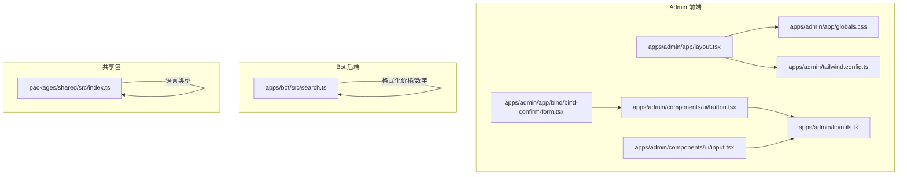
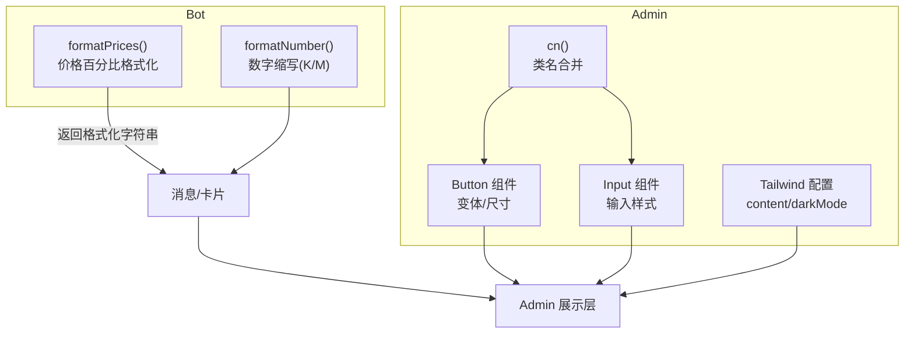
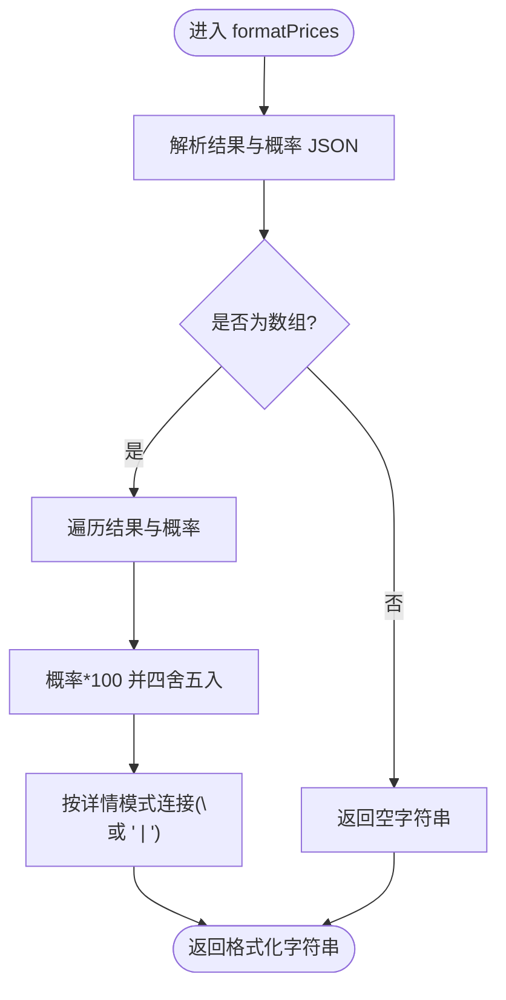
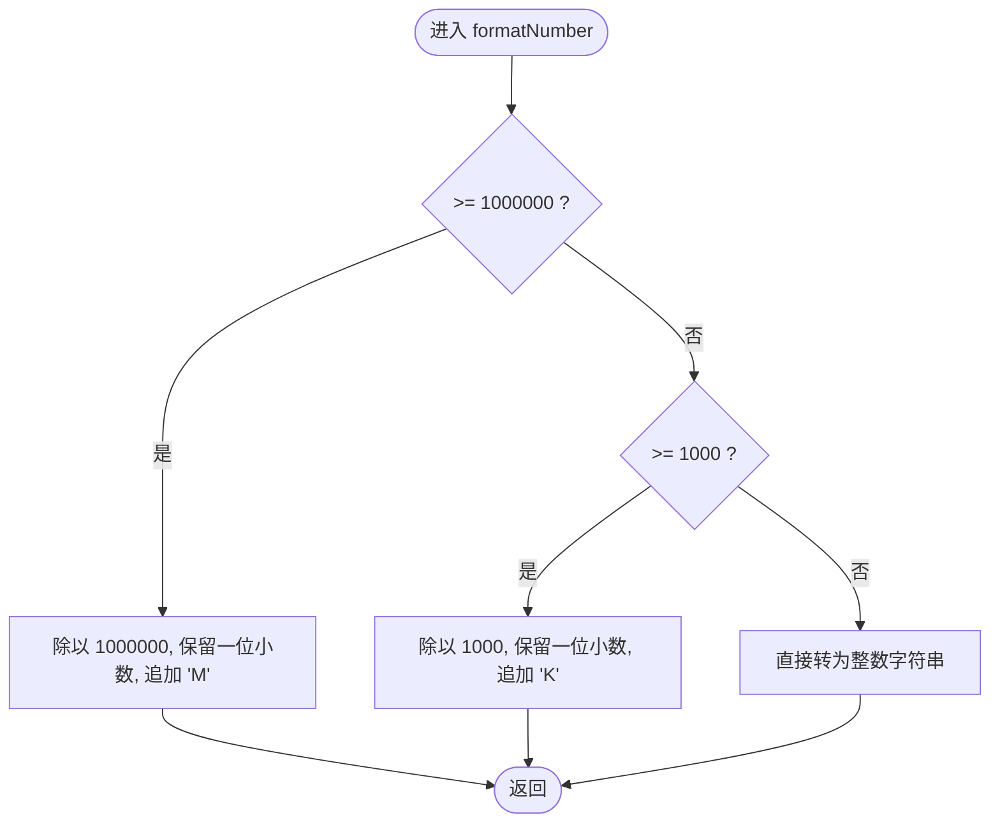
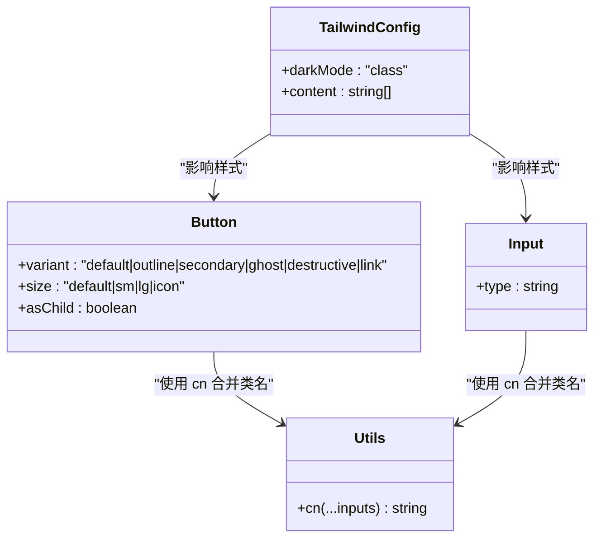
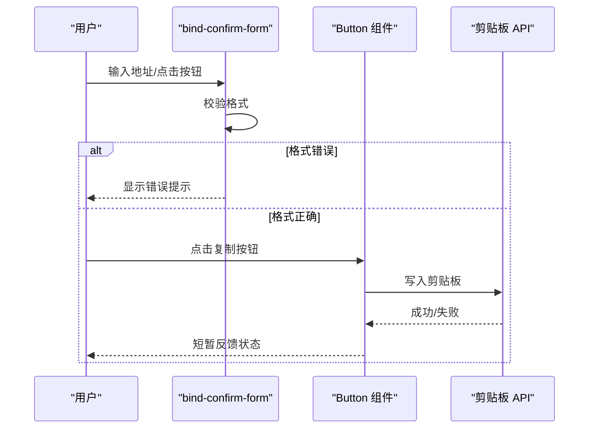
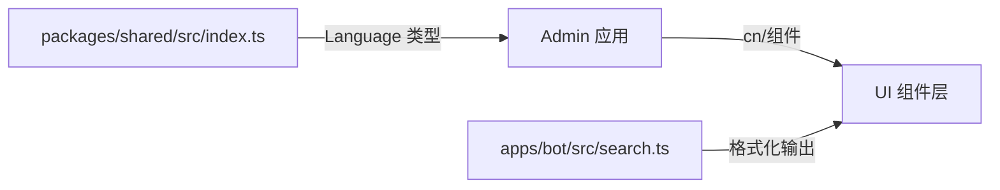

# 数据格式化与展示

<cite>
**本文引用的文件**
- [apps/admin/lib/utils.ts](file://apps/admin/lib/utils.ts)
- [apps/admin/components/ui/button.tsx](file://apps/admin/components/ui/button.tsx)
- [apps/admin/components/ui/input.tsx](file://apps/admin/components/ui/input.tsx)
- [apps/admin/app/layout.tsx](file://apps/admin/app/layout.tsx)
- [apps/admin/app/globals.css](file://apps/admin/app/globals.css)
- [apps/admin/tailwind.config.ts](file://apps/admin/tailwind.config.ts)
- [apps/admin/app/bind/bind-confirm-form.tsx](file://apps/admin/app/bind/bind-confirm-form.tsx)
- [apps/bot/src/search.ts](file://apps/bot/src/search.ts)
- [packages/shared/src/index.ts](file://packages/shared/src/index.ts)
</cite>

## 目录
1. [简介](#简介)
2. [项目结构](#项目结构)
3. [核心组件](#核心组件)
4. [架构总览](#架构总览)
5. [详细组件分析](#详细组件分析)
6. [依赖关系分析](#依赖关系分析)
7. [性能考量](#性能考量)
8. [故障排查指南](#故障排查指南)
9. [结论](#结论)
10. [附录](#附录)

## 简介
本技术文档聚焦于“数据格式化与展示”能力，围绕以下目标展开：
- 数字格式化：千位分隔、货币符号、科学计数法（缩写 K/M）等
- 价格格式化：百分比计算、小数位控制、价格显示优化
- 文本截断与省略：描述文本长度限制、智能截断与可读性优化
- HTML 安全格式化：标签转义、链接生成、富文本渲染
- 扩展能力：自定义格式模板、国际化支持、主题定制
- 性能优化：缓存机制、批量处理、内存优化
- 与 UI 集成：响应式设计与 TailwindCSS 主题体系

在本仓库中，格式化相关逻辑主要分布在机器人侧的价格展示与数字缩写，以及前端 Admin 应用的 UI 组件与样式体系。

## 项目结构
本项目采用多包/多应用结构，Admin 前端使用 Next.js + TailwindCSS，Bot 后端以 TypeScript 实现格式化工具函数；共享包提供语言类型定义。

图表来源
- [apps/admin/app/layout.tsx](file://apps/admin/app/layout.tsx#L1-L23)
- [apps/admin/app/globals.css](file://apps/admin/app/globals.css#L1-L5)
- [apps/admin/tailwind.config.ts](file://apps/admin/tailwind.config.ts#L1-L14)
- [apps/admin/lib/utils.ts](file://apps/admin/lib/utils.ts#L1-L8)
- [apps/admin/components/ui/button.tsx](file://apps/admin/components/ui/button.tsx#L1-L57)
- [apps/admin/components/ui/input.tsx](file://apps/admin/components/ui/input.tsx#L1-L27)
- [apps/admin/app/bind/bind-confirm-form.tsx](file://apps/admin/app/bind/bind-confirm-form.tsx#L42-L80)
- [apps/bot/src/search.ts](file://apps/bot/src/search.ts#L187-L232)
- [packages/shared/src/index.ts](file://packages/shared/src/index.ts#L1-L8)

章节来源
- [apps/admin/app/layout.tsx](file://apps/admin/app/layout.tsx#L1-L23)
- [apps/admin/app/globals.css](file://apps/admin/app/globals.css#L1-L5)
- [apps/admin/tailwind.config.ts](file://apps/admin/tailwind.config.ts#L1-L14)
- [apps/admin/lib/utils.ts](file://apps/admin/lib/utils.ts#L1-L8)
- [apps/admin/components/ui/button.tsx](file://apps/admin/components/ui/button.tsx#L1-L57)
- [apps/admin/components/ui/input.tsx](file://apps/admin/components/ui/input.tsx#L1-L27)
- [apps/admin/app/bind/bind-confirm-form.tsx](file://apps/admin/app/bind/bind-confirm-form.tsx#L42-L80)
- [apps/bot/src/search.ts](file://apps/bot/src/search.ts#L187-L232)
- [packages/shared/src/index.ts](file://packages/shared/src/index.ts#L1-L8)

## 核心组件
- 数字格式化与价格展示（Bot）
  - 价格百分比格式化：将概率值转换为百分比字符串，支持换行或行内分隔
  - 数字缩写格式化：将大数转换为带单位的简写（K/M），保留一位小数
- UI 组件与样式（Admin）
  - 按钮与输入框组件：通过变体与尺寸控制外观，统一类名合并
  - TailwindCSS 全局样式与配置：基础、组件、工具类三段式引入，暗色模式与内容扫描范围
  - 工具函数 cn：合并与去重 Tailwind 类名，避免冲突
- 国际化类型（Shared）
  - 语言枚举与 Zod 校验：提供 zh-CN/en 的语言类型与校验

章节来源
- [apps/bot/src/search.ts](file://apps/bot/src/search.ts#L196-L232)
- [apps/admin/components/ui/button.tsx](file://apps/admin/components/ui/button.tsx#L7-L32)
- [apps/admin/components/ui/input.tsx](file://apps/admin/components/ui/input.tsx#L7-L21)
- [apps/admin/app/globals.css](file://apps/admin/app/globals.css#L1-L5)
- [apps/admin/tailwind.config.ts](file://apps/admin/tailwind.config.ts#L3-L10)
- [apps/admin/lib/utils.ts](file://apps/admin/lib/utils.ts#L4-L6)
- [packages/shared/src/index.ts](file://packages/shared/src/index.ts#L5-L7)

## 架构总览
Bot 侧负责数据格式化输出，Admin 侧负责 UI 展示与交互。两者通过统一的样式与组件体系保证一致的视觉与行为体验。

图表来源
- [apps/bot/src/search.ts](file://apps/bot/src/search.ts#L196-L232)
- [apps/admin/components/ui/button.tsx](file://apps/admin/components/ui/button.tsx#L7-L32)
- [apps/admin/components/ui/input.tsx](file://apps/admin/components/ui/input.tsx#L7-L21)
- [apps/admin/lib/utils.ts](file://apps/admin/lib/utils.ts#L4-L6)
- [apps/admin/tailwind.config.ts](file://apps/admin/tailwind.config.ts#L3-L10)

## 详细组件分析

### Bot：价格与数字格式化
- 价格格式化（百分比）
  - 输入：市场结果数组与对应概率数组
  - 处理：解析 JSON、遍历映射、概率乘 100 并四舍五入为整数百分比
  - 输出：按详情模式换行或行内分隔的价格列表
- 数字格式化（K/M 缩写）
  - 输入：数值
  - 处理：百万以上转 M（保留一位小数），千以上转 K（保留一位小数），否则整数
  - 输出：带单位的字符串

图表来源
- [apps/bot/src/search.ts](file://apps/bot/src/search.ts#L196-L211)

图表来源
- [apps/bot/src/search.ts](file://apps/bot/src/search.ts#L228-L232)

章节来源
- [apps/bot/src/search.ts](file://apps/bot/src/search.ts#L196-L232)

### Admin：UI 组件与样式体系
- Button 组件
  - 变体：默认、描边、次级、幽灵、破坏、链接
  - 尺寸：默认、小、大、图标
  - 行为：支持 asChild 渲染为其他元素；统一过渡与焦点样式
- Input 组件
  - 默认输入样式：边框、背景、占位符、聚焦环等
  - 支持文件选择器样式与图标对齐
- 工具函数 cn
  - 合并多个类名，使用 tailwind-merge 去重，避免重复样式覆盖
- Tailwind 配置
  - 内容扫描范围：app 与 components 目录
  - 暗色模式：基于 class
  - 插件：空
- 全局样式
  - 引入 base、components、utilities 三段式

图表来源
- [apps/admin/components/ui/button.tsx](file://apps/admin/components/ui/button.tsx#L7-L32)
- [apps/admin/components/ui/input.tsx](file://apps/admin/components/ui/input.tsx#L7-L21)
- [apps/admin/lib/utils.ts](file://apps/admin/lib/utils.ts#L4-L6)
- [apps/admin/tailwind.config.ts](file://apps/admin/tailwind.config.ts#L3-L10)

章节来源
- [apps/admin/components/ui/button.tsx](file://apps/admin/components/ui/button.tsx#L1-L57)
- [apps/admin/components/ui/input.tsx](file://apps/admin/components/ui/input.tsx#L1-L27)
- [apps/admin/lib/utils.ts](file://apps/admin/lib/utils.ts#L1-L8)
- [apps/admin/tailwind.config.ts](file://apps/admin/tailwind.config.ts#L1-L14)
- [apps/admin/app/globals.css](file://apps/admin/app/globals.css#L1-L5)

### Admin：表单与交互中的格式化
- 绑定确认表单中对地址输入进行格式校验，并在 UI 中提示错误信息
- 使用 Button 组件实现复制绑定码到剪贴板的交互

图表来源
- [apps/admin/app/bind/bind-confirm-form.tsx](file://apps/admin/app/bind/bind-confirm-form.tsx#L42-L80)
- [apps/admin/components/ui/button.tsx](file://apps/admin/components/ui/button.tsx#L40-L51)

章节来源
- [apps/admin/app/bind/bind-confirm-form.tsx](file://apps/admin/app/bind/bind-confirm-form.tsx#L42-L80)

### 国际化与主题
- 语言类型
  - 提供 zh-CN 与 en 的语言类型与 Zod 校验，便于后续扩展多语言格式化规则
- 主题与样式
  - Tailwind 配置启用暗色模式 class，全局样式引入工具类，组件通过 cn 合并类名，确保主题一致性

章节来源
- [packages/shared/src/index.ts](file://packages/shared/src/index.ts#L5-L7)
- [apps/admin/tailwind.config.ts](file://apps/admin/tailwind.config.ts#L4-L4)
- [apps/admin/app/globals.css](file://apps/admin/app/globals.css#L1-L5)

## 依赖关系分析
- Bot 与 Admin 之间无直接运行时耦合，Bot 负责格式化数据，Admin 负责展示
- Admin 内部组件依赖 utils.cn 与 Tailwind 配置，形成稳定的 UI 基础设施
- 共享包提供语言类型，为未来国际化格式化提供基础

图表来源
- [packages/shared/src/index.ts](file://packages/shared/src/index.ts#L5-L7)
- [apps/admin/lib/utils.ts](file://apps/admin/lib/utils.ts#L4-L6)
- [apps/bot/src/search.ts](file://apps/bot/src/search.ts#L196-L232)

章节来源
- [packages/shared/src/index.ts](file://packages/shared/src/index.ts#L5-L7)
- [apps/admin/lib/utils.ts](file://apps/admin/lib/utils.ts#L1-L8)
- [apps/bot/src/search.ts](file://apps/bot/src/search.ts#L196-L232)

## 性能考量
- 缓存机制
  - 对热点格式化结果（如常用价格/数字组合）进行内存缓存，减少重复计算
- 批量处理
  - 在渲染列表时，优先使用虚拟滚动与分页，避免一次性格式化大量节点
- 内存优化
  - 使用不可变数据结构与浅拷贝，避免深层克隆；及时释放临时字符串与数组
- UI 渲染
  - 利用 React.memo 与 useMemo 缓存组件与计算结果；Tailwind 工具类按需引入，减少打包体积

## 故障排查指南
- 价格格式化为空
  - 检查输入 JSON 是否可解析、数组长度是否匹配；确认异常捕获分支返回空字符串
- 数字缩写不生效
  - 核对阈值判断顺序（先 M 再 K），确保输入为有效数值
- UI 类名冲突
  - 确认使用 cn 合并类名，避免重复传入相同类；检查 Tailwind 内容扫描路径
- 暗色模式未生效
  - 确认根元素添加了暗色模式 class；检查 Tailwind 配置与全局样式加载顺序

章节来源
- [apps/bot/src/search.ts](file://apps/bot/src/search.ts#L196-L232)
- [apps/admin/lib/utils.ts](file://apps/admin/lib/utils.ts#L4-L6)
- [apps/admin/tailwind.config.ts](file://apps/admin/tailwind.config.ts#L4-L4)

## 结论
本项目在 Bot 侧实现了简洁高效的数字与价格格式化，在 Admin 侧通过组件化与 TailwindCSS 形成了统一的展示基础设施。建议后续在以下方面持续演进：
- 引入国际化格式化规则（Intl.NumberFormat、Intl.RelativeTimeFormat）
- 增加文本截断与省略号策略，结合 CSS 的 text-overflow 与 JS 智能截断
- 加强 HTML 富文本渲染的安全性（白名单、转义、链接生成）
- 为格式化函数提供可插拔的模板与主题系统，支持动态切换

## 附录
- 术语
  - 百分比格式化：将概率值乘以 100 并四舍五入为整数，附加百分号
  - 数字缩写：将大数转换为 K/M 单位，保留一位小数
  - 类名合并：通过工具函数合并与去重 Tailwind 类，避免冲突