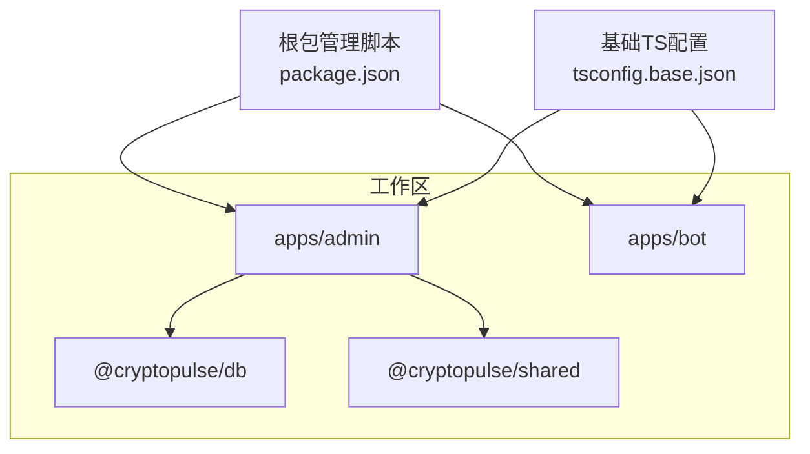
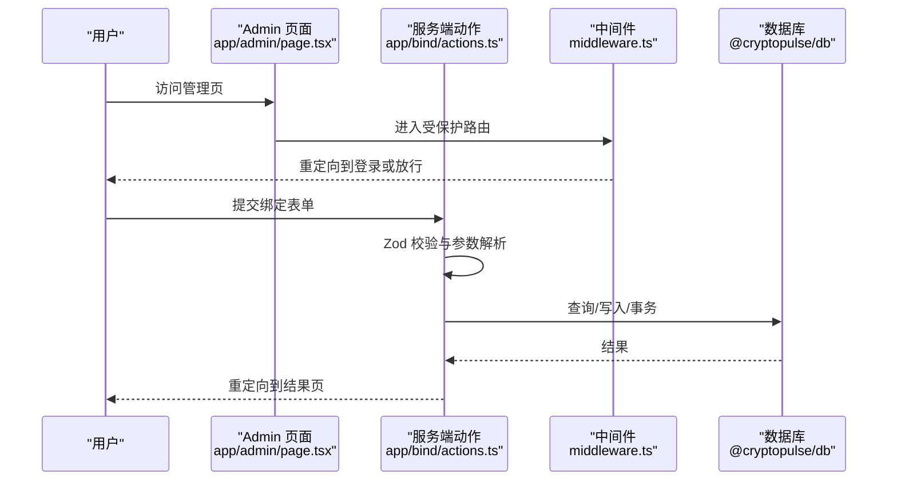
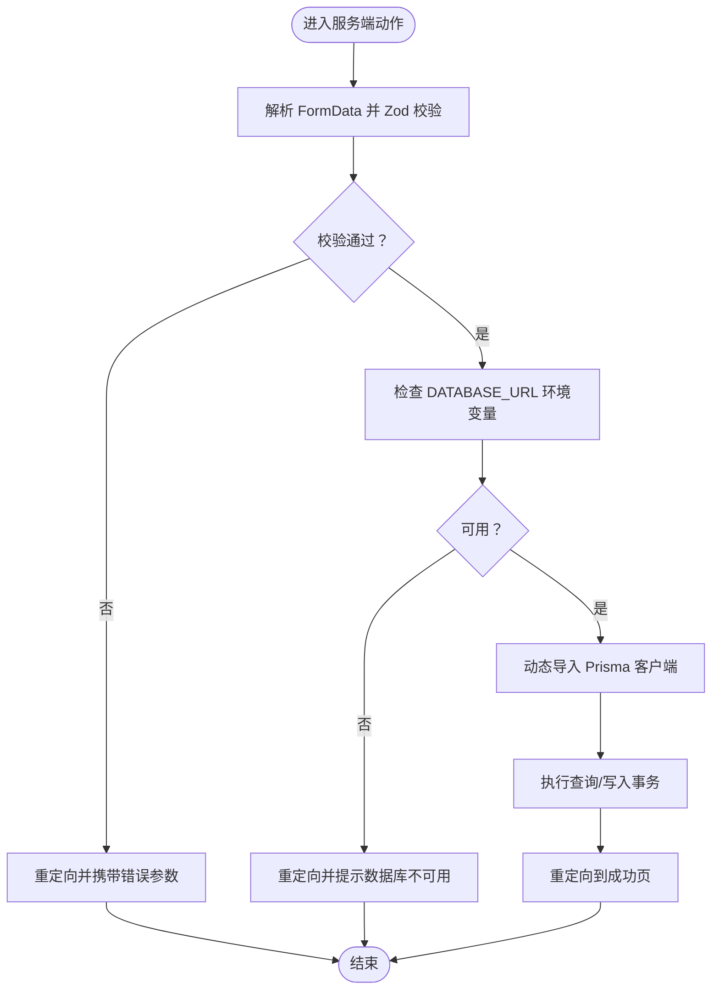
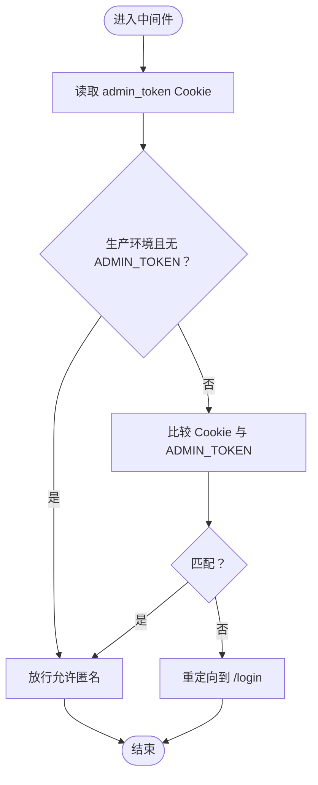
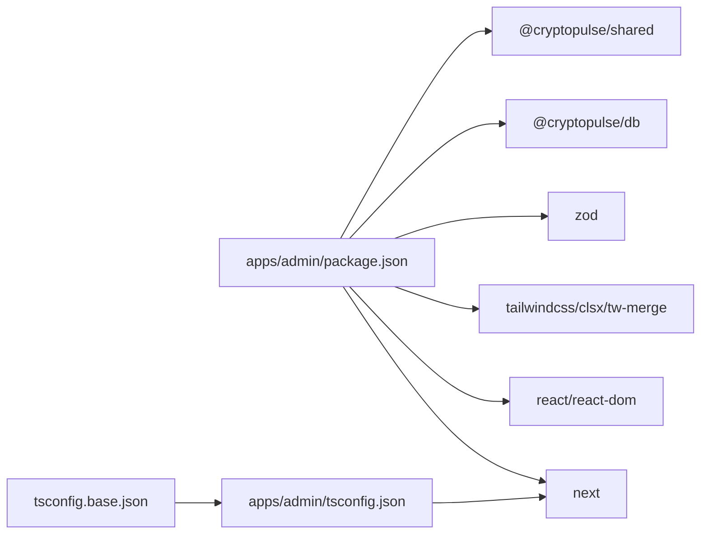

# 代码规范

<cite>
**本文引用的文件**
- [根包管理脚本](file://package.json)
- [Admin 应用包配置](file://apps/admin/package.json)
- [Admin 应用 ESLint 配置](file://apps/admin/eslint.config.mjs)
- [基础 TypeScript 配置](file://tsconfig.base.json)
- [Admin 应用 TypeScript 配置](file://apps/admin/tsconfig.json)
- [Admin 应用 Next.js 配置](file://apps/admin/next.config.ts)
- [Admin 应用页面组件示例](file://apps/admin/app/admin/page.tsx)
- [Admin 应用 UI 组件示例](file://apps/admin/components/ui/button.tsx)
- [Admin 应用通用工具函数](file://apps/admin/lib/utils.ts)
- [Admin 应用服务端动作示例](file://apps/admin/app/bind/actions.ts)
- [Admin 应用中间件示例](file://apps/admin/middleware.ts)
- [Bot 应用入口示例](file://apps/bot/src/index.ts)
- [Admin 应用 Playwright 配置](file://apps/admin/playwright.config.ts)
- [Admin 应用 E2E 测试示例](file://test/bind-code.test.ts)
</cite>

## 目录
1. [引言](#引言)
2. [项目结构](#项目结构)
3. [核心组件](#核心组件)
4. [架构总览](#架构总览)
5. [详细组件分析](#详细组件分析)
6. [依赖关系分析](#依赖关系分析)
7. [性能考量](#性能考量)
8. [故障排查指南](#故障排查指南)
9. [结论](#结论)
10. [附录](#附录)

## 引言
本文件为 CryptoPulse 项目的代码规范文档，聚焦于 TypeScript 编码标准、类型定义与接口设计、泛型使用、命名约定、代码格式化、ESLint 配置与规则、模块导入导出与文件结构组织、代码审查清单与质量检查标准，并结合仓库现有实现给出可操作的示例与反例路径，帮助团队统一风格、提升可维护性与协作效率。

## 项目结构
项目采用多包工作区（monorepo）布局，核心由以下部分组成：
- apps/admin：基于 Next.js 的管理端应用，包含页面、API 路由、UI 组件、中间件、测试与构建配置。
- apps/bot：基于 GramYy 的 Telegram 机器人应用，包含命令处理、键盘交互与业务流程。
- packages：共享包（如 @cryptopulse/db、@cryptopulse/shared），供应用复用。
- test：Node Test 套件，覆盖 API 与业务逻辑。
- 根级脚本与全局配置：工作区脚本、基础 tsconfig、CI 工作流等。

图表来源
- [根包管理脚本](file://package.json#L1-L18)
- [基础 TypeScript 配置](file://tsconfig.base.json#L1-L16)
- [Admin 应用包配置](file://apps/admin/package.json#L1-L42)
- [Bot 应用入口示例](file://apps/bot/src/index.ts#L1-L156)

章节来源
- [根包管理脚本](file://package.json#L1-L18)
- [基础 TypeScript 配置](file://tsconfig.base.json#L1-L16)

## 核心组件
- 类型系统与严格模式
  - 使用严格编译选项，启用 noEmit、skipLibCheck、isolatedModules 等，确保类型安全与增量编译稳定性。
  - 通过 baseUrl 与路径映射简化导入，避免相对路径地狱。
- ESLint 与 Next.js 规则
  - 采用 Flat Config 与 @eslint/eslintrc 兼容层，继承 next/core-web-vitals 与 next/typescript，统一前端规则。
- 构建与运行
  - Next.js transpilePackages 支持跨包源码直传，webpack watchOptions 忽略系统文件，减少无关重建。
- 服务端动作与表单校验
  - 使用 Zod 对入参进行强类型校验，配合 Next.js Server Actions 实现安全的数据写入与事务处理。
- 中间件鉴权
  - 基于 Cookie 令牌与环境变量控制管理员访问，匹配器限定受保护路由前缀。
- UI 组件与样式合并
  - 使用 class-variance-authority 定义变体，clsx/tailwind-merge 合并类名，保证样式一致性与可维护性。

章节来源
- [Admin 应用 TypeScript 配置](file://apps/admin/tsconfig.json#L1-L28)
- [Admin 应用 ESLint 配置](file://apps/admin/eslint.config.mjs#L1-L13)
- [Admin 应用 Next.js 配置](file://apps/admin/next.config.ts#L1-L30)
- [Admin 应用服务端动作示例](file://apps/admin/app/bind/actions.ts#L1-L90)
- [Admin 应用中间件示例](file://apps/admin/middleware.ts#L1-L23)
- [Admin 应用 UI 组件示例](file://apps/admin/components/ui/button.tsx#L1-L57)
- [Admin 应用通用工具函数](file://apps/admin/lib/utils.ts#L1-L8)

## 架构总览
下图展示了前端页面、服务端动作、数据库与中间件之间的交互关系，以及 Next.js 的请求生命周期。

图表来源
- [Admin 应用页面组件示例](file://apps/admin/app/admin/page.tsx#L1-L47)
- [Admin 应用服务端动作示例](file://apps/admin/app/bind/actions.ts#L1-L90)
- [Admin 应用中间件示例](file://apps/admin/middleware.ts#L1-L23)

## 详细组件分析

### 类型系统与接口设计
- 接口与属性
  - 在 UI 组件中，通过扩展 HTML 原生属性与变体类型，组合出可复用的接口，既保证 DOM 兼容又提供样式变体约束。
  - 示例路径：[Admin 应用 UI 组件示例](file://apps/admin/components/ui/button.tsx#L34-L38)
- 泛型与类型推断
  - React.forwardRef 与 Variants 组合使用，利用泛型约束 props 与 ref 类型，确保组件调用安全。
  - 示例路径：[Admin 应用 UI 组件示例](file://apps/admin/components/ui/button.tsx#L40-L51)
- 严格类型检查
  - 通过 tsconfig.base.json 的严格选项与 noEmit，确保类型错误在开发阶段暴露，避免运行时问题。
  - 示例路径：[基础 TypeScript 配置](file://tsconfig.base.json#L2-L13)

章节来源
- [Admin 应用 UI 组件示例](file://apps/admin/components/ui/button.tsx#L1-L57)
- [基础 TypeScript 配置](file://tsconfig.base.json#L1-L16)

### 命名约定
- 变量与函数
  - 使用小驼峰命名；异步函数以动词短语表达意图，如 confirmBindAction。
  - 示例路径：[Admin 应用服务端动作示例](file://apps/admin/app/bind/actions.ts#L21-L27)
- 组件与文件
  - React 组件首字母大写；文件名与组件名一致；页面组件使用 page.tsx，API 路由使用 route.ts。
  - 示例路径：[Admin 应用页面组件示例](file://apps/admin/app/admin/page.tsx#L1-L47)
- 路径别名
  - 使用 @/* 作为根别名，简化导入路径，避免深层相对路径。
  - 示例路径：[Admin 应用 TypeScript 配置](file://apps/admin/tsconfig.json#L10-L14)

章节来源
- [Admin 应用服务端动作示例](file://apps/admin/app/bind/actions.ts#L1-L90)
- [Admin 应用页面组件示例](file://apps/admin/app/admin/page.tsx#L1-L47)
- [Admin 应用 TypeScript 配置](file://apps/admin/tsconfig.json#L1-L28)

### 代码格式化与注释规范
- 缩进与空格
  - 使用 2 空格缩进，保持一致的层级结构，便于阅读与对齐。
- 换行与分组
  - 复杂逻辑分行书写，条件分支与 try/catch 块清晰分隔，增强可读性。
- 注释
  - 对外暴露的函数与复杂流程添加简要注释，说明用途与边界条件。
- 示例路径
  - [Admin 应用服务端动作示例](file://apps/admin/app/bind/actions.ts#L37-L42)
  - [Admin 应用中间件示例](file://apps/admin/middleware.ts#L3-L17)

章节来源
- [Admin 应用服务端动作示例](file://apps/admin/app/bind/actions.ts#L1-L90)
- [Admin 应用中间件示例](file://apps/admin/middleware.ts#L1-L23)

### ESLint 配置与规则
- 配置方式
  - 采用 Flat Config 并通过 @eslint/eslintrc 兼容层加载 Next.js 推荐规则，确保与框架最佳实践一致。
  - 示例路径：[Admin 应用 ESLint 配置](file://apps/admin/eslint.config.mjs#L1-L13)
- Next.js 特定规则
  - 继承 next/core-web-vitals 与 next/typescript，自动覆盖 React Hooks、Web Vitals、TypeScript 语法等规则。
- 自定义规则建议
  - 团队可根据需要新增规则（如禁用 console.warn、限制魔法数字等），但需保持与现有规则兼容。
  - 示例路径：[Admin 应用包配置](file://apps/admin/package.json#L34-L35)

章节来源
- [Admin 应用 ESLint 配置](file://apps/admin/eslint.config.mjs#L1-L13)
- [Admin 应用包配置](file://apps/admin/package.json#L1-L42)

### 代码组织原则
- 模块导入导出
  - 优先使用命名导出与具名导入，保持显式依赖；跨包共享逻辑通过 packages 导出公共 API。
  - 示例路径：[Admin 应用服务端动作示例](file://apps/admin/app/bind/actions.ts#L1-L5)
- 文件结构与目录组织
  - 页面按功能分层：app/admin、app/api、components/ui、lib 等；API 路由遵循 route.ts 命名；E2E 测试位于 e2e 目录。
  - 示例路径：[Admin 应用页面组件示例](file://apps/admin/app/admin/page.tsx#L1-L47)
- 路径别名与编译配置
  - 通过 baseUrl 与 paths 映射 @/*，提升可读性与迁移能力。
  - 示例路径：[Admin 应用 TypeScript 配置](file://apps/admin/tsconfig.json#L9-L14)

章节来源
- [Admin 应用服务端动作示例](file://apps/admin/app/bind/actions.ts#L1-L90)
- [Admin 应用页面组件示例](file://apps/admin/app/admin/page.tsx#L1-L47)
- [Admin 应用 TypeScript 配置](file://apps/admin/tsconfig.json#L1-L28)

### 服务端动作与数据校验流程

图表来源
- [Admin 应用服务端动作示例](file://apps/admin/app/bind/actions.ts#L21-L88)

章节来源
- [Admin 应用服务端动作示例](file://apps/admin/app/bind/actions.ts#L1-L90)

### 中间件鉴权流程

图表来源
- [Admin 应用中间件示例](file://apps/admin/middleware.ts#L3-L17)

章节来源
- [Admin 应用中间件示例](file://apps/admin/middleware.ts#L1-L23)

### UI 组件与样式合并
- 组件设计
  - 使用 cva 定义变体与尺寸，结合 Radix Slot 支持透传子元素，实现高可定制性。
- 样式合并
  - 通过 cn(...) 合并类名，避免重复与冲突，提升样式一致性。
- 示例路径
  - [Admin 应用 UI 组件示例](file://apps/admin/components/ui/button.tsx#L7-L32)
  - [Admin 应用通用工具函数](file://apps/admin/lib/utils.ts#L4-L6)

章节来源
- [Admin 应用 UI 组件示例](file://apps/admin/components/ui/button.tsx#L1-L57)
- [Admin 应用通用工具函数](file://apps/admin/lib/utils.ts#L1-L8)

### 测试与质量保障
- 单元与集成测试
  - 使用 Node Test 与 assert，结合 Prisma 进行数据库相关测试；通过环境变量控制测试范围与隔离。
  - 示例路径：[Admin 应用 E2E 测试示例](file://test/bind-code.test.ts#L1-L88)
- E2E 测试
  - 使用 Playwright 配置多浏览器项目与超时策略，webServer 复用已有进程，缩短启动时间。
  - 示例路径：[Admin 应用 Playwright 配置](file://apps/admin/playwright.config.ts#L1-L23)
- 机器人应用
  - Bot 入口集中处理命令与回调，错误捕获统一记录，保证稳定性。
  - 示例路径：[Bot 应用入口示例](file://apps/bot/src/index.ts#L103-L152)

章节来源
- [Admin 应用 E2E 测试示例](file://test/bind-code.test.ts#L1-L88)
- [Admin 应用 Playwright 配置](file://apps/admin/playwright.config.ts#L1-L23)
- [Bot 应用入口示例](file://apps/bot/src/index.ts#L1-L156)

## 依赖关系分析
- 包依赖
  - Admin 应用依赖 @cryptopulse/db 与 @cryptopulse/shared，Next.js 15、React 19、Tailwind 生态与 Zod。
- 构建与打包
  - Next.js transpilePackages 支持跨包源码直传；tsconfig base 与 app tsconfig 组合提供统一编译行为。
- 开发体验
  - ESLint Flat Config 与 Next.js 规则统一；Playwright 与 Node Test 并行保障质量。

图表来源
- [Admin 应用包配置](file://apps/admin/package.json#L13-L39)
- [基础 TypeScript 配置](file://tsconfig.base.json#L1-L16)
- [Admin 应用 TypeScript 配置](file://apps/admin/tsconfig.json#L1-L28)

章节来源
- [Admin 应用包配置](file://apps/admin/package.json#L1-L42)
- [Admin 应用 TypeScript 配置](file://apps/admin/tsconfig.json#L1-L28)
- [基础 TypeScript 配置](file://tsconfig.base.json#L1-L16)

## 性能考量
- 构建与热更新
  - 通过 watchOptions 忽略系统文件，减少不必要的监听事件；transpilePackages 减少打包体积与编译时间。
  - 示例路径：[Admin 应用 Next.js 配置](file://apps/admin/next.config.ts#L10-L25)
- 类名合并
  - 使用 twMerge 与 clsx 合并类名，避免重复样式导致的渲染开销。
  - 示例路径：[Admin 应用通用工具函数](file://apps/admin/lib/utils.ts#L4-L6)
- 事务与数据库访问
  - 将关联写入放入事务，减少往返次数与锁竞争，提升吞吐。
  - 示例路径：[Admin 应用服务端动作示例](file://apps/admin/app/bind/actions.ts#L63-L82)

章节来源
- [Admin 应用 Next.js 配置](file://apps/admin/next.config.ts#L1-L30)
- [Admin 应用通用工具函数](file://apps/admin/lib/utils.ts#L1-L8)
- [Admin 应用服务端动作示例](file://apps/admin/app/bind/actions.ts#L1-L90)

## 故障排查指南
- 本地开发常见问题
  - DATABASE_URL 未配置：页面会显示占位信息；服务端动作会重定向并携带错误参数。
  - ADMIN_TOKEN 未设置：生产环境默认放行；非生产环境需正确配置。
  - 示例路径：
    - [Admin 应用页面组件示例](file://apps/admin/app/admin/page.tsx#L5-L14)
    - [Admin 应用中间件示例](file://apps/admin/middleware.ts#L7-L9)
- 测试失败定位
  - 使用 Playwright trace 保留失败时的快照；Node Test 断言明确错误码与响应体。
  - 示例路径：
    - [Admin 应用 Playwright 配置](file://apps/admin/playwright.config.ts#L9-L10)
    - [Admin 应用 E2E 测试示例](file://test/bind-code.test.ts#L27-L47)

章节来源
- [Admin 应用页面组件示例](file://apps/admin/app/admin/page.tsx#L1-L47)
- [Admin 应用中间件示例](file://apps/admin/middleware.ts#L1-L23)
- [Admin 应用 Playwright 配置](file://apps/admin/playwright.config.ts#L1-L23)
- [Admin 应用 E2E 测试示例](file://test/bind-code.test.ts#L1-L88)

## 结论
本规范在现有项目实践基础上，总结了类型系统、命名约定、ESLint 规则、模块组织与质量保障的最佳实践。建议团队在后续迭代中持续完善自定义规则、补充单元测试覆盖率，并保持配置与依赖版本的同步升级，以维持高质量与高可维护性的代码库。

## 附录

### 代码审查清单
- 类型与接口
  - 是否使用严格类型与必要约束？
  - 接口是否最小化、可复用？
- 命名与结构
  - 变量/函数/组件命名是否清晰、一致？
  - 文件与目录结构是否符合现有约定？
- 校验与安全
  - 输入是否经过 Zod 或等效校验？
  - 是否存在敏感信息硬编码？
- 性能与可维护性
  - 是否避免重复样式与类名冲突？
  - 是否使用事务与最小化数据库往返？
- 测试与质量
  - 是否有对应单元/集成/E2E 测试？
  - 是否通过 ESLint 与类型检查？

### 质量检查标准
- ESLint
  - 通过 next/core-web-vitals 与 next/typescript 规则集；无新增严重警告。
- 类型检查
  - tsc --noEmit 通过；无 any 或宽泛类型滥用。
- 测试
  - Node Test 与 Playwright 覆盖关键路径；失败用例具备明确断言与 trace。