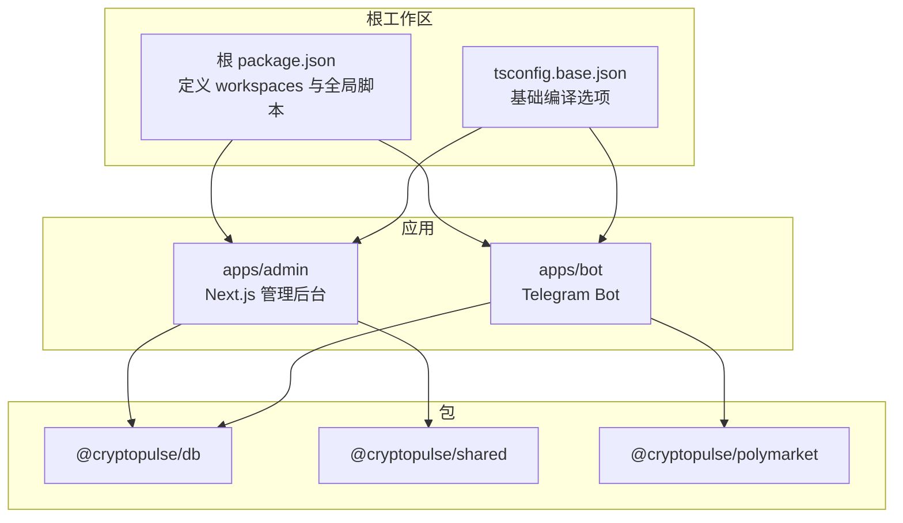
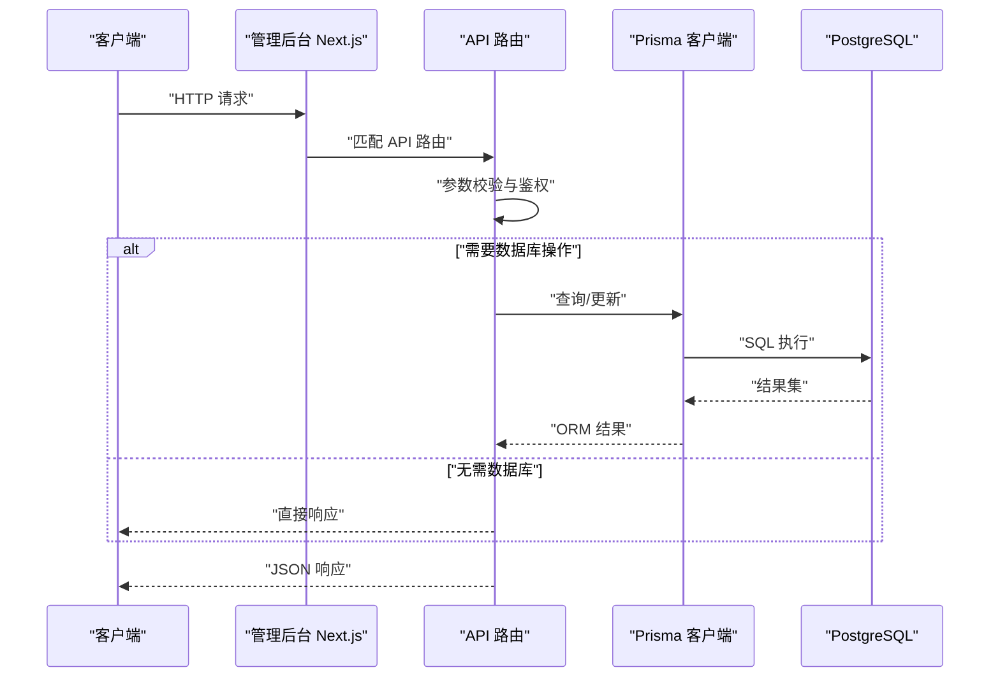
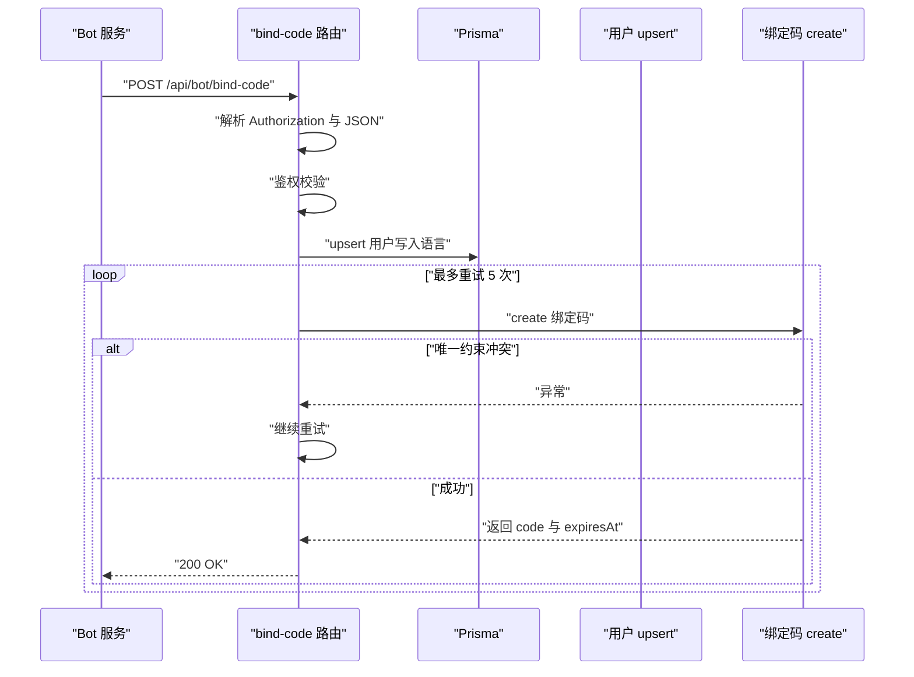
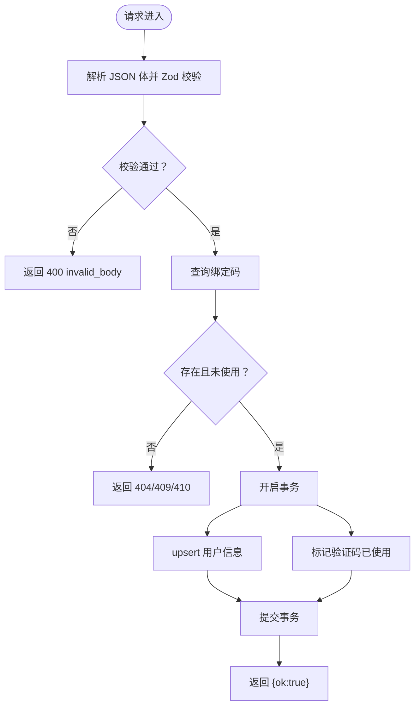
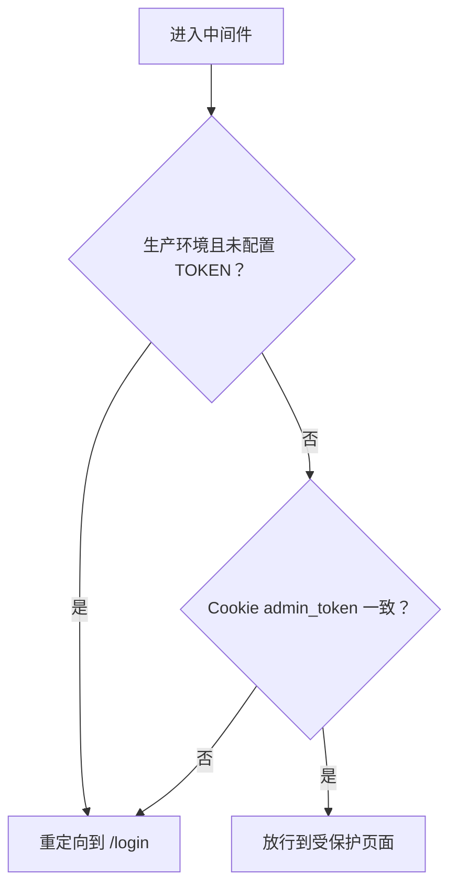
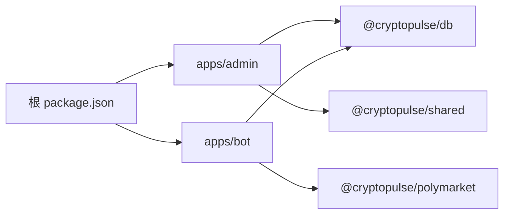

# 开发指南

<cite>
**本文引用的文件**
- [README.md](file://README.md)
- [package.json](file://package.json)
- [tsconfig.base.json](file://tsconfig.base.json)
- [.github/workflows/ci.yml](file://.github/workflows/ci.yml)
- [apps/admin/package.json](file://apps/admin/package.json)
- [apps/admin/tsconfig.json](file://apps/admin/tsconfig.json)
- [apps/admin/eslint.config.mjs](file://apps/admin/eslint.config.mjs)
- [apps/admin/playwright.config.ts](file://apps/admin/playwright.config.ts)
- [apps/admin/tailwind.config.ts](file://apps/admin/tailwind.config.ts)
- [apps/admin/next.config.ts](file://apps/admin/next.config.ts)
- [apps/admin/postcss.config.mjs](file://apps/admin/postcss.config.mjs)
- [apps/admin/app/api/bot/bind-code/route.ts](file://apps/admin/app/api/bot/bind-code/route.ts)
- [apps/admin/app/api/bind/confirm/route.ts](file://apps/admin/app/api/bind/confirm/route.ts)
- [apps/admin/lib/utils.ts](file://apps/admin/lib/utils.ts)
- [apps/admin/middleware.ts](file://apps/admin/middleware.ts)
- [test/bind-code.test.ts](file://test/bind-code.test.ts)
- [test/bind-confirm.test.ts](file://test/bind-confirm.test.ts)
- [apps/bot/package.json](file://apps/bot/package.json)
</cite>

## 目录
1. [简介](#简介)
2. [项目结构](#项目结构)
3. [核心组件](#核心组件)
4. [架构总览](#架构总览)
5. [详细组件分析](#详细组件分析)
6. [依赖关系分析](#依赖关系分析)
7. [性能考虑](#性能考虑)
8. [故障排查指南](#故障排查指南)
9. [结论](#结论)
10. [附录](#附录)

## 简介
本开发指南面向 CryptoPulse 项目的核心开发者与贡献者，目标是帮助团队建立统一的编码规范、测试策略、调试方法与发布流程。项目采用 Monorepo 架构，包含管理后台应用（Next.js）、Telegram Bot 应用以及共享包与数据库层。CI 流水线覆盖类型检查、代码风格、单元测试与端到端测试。

## 项目结构
项目采用工作区（workspaces）组织，根级脚本统一调度各子应用与包的构建、测试与开发任务。管理后台基于 Next.js，Bot 基于原生 Node.js + TypeScript；数据库通过 Prisma 管理；前端样式使用 TailwindCSS。

图表来源
- [package.json](file://package.json#L1-L18)
- [tsconfig.base.json](file://tsconfig.base.json#L1-L16)
- [apps/admin/package.json](file://apps/admin/package.json#L1-L42)
- [apps/bot/package.json](file://apps/bot/package.json#L1-L26)

章节来源
- [README.md](file://README.md#L1-L65)
- [package.json](file://package.json#L1-L18)
- [tsconfig.base.json](file://tsconfig.base.json#L1-L16)

## 核心组件
- 管理后台（Next.js）
  - 路由与 API：管理后台通过 App Router 的 API 路由提供服务端逻辑，如绑定码签发与确认绑定。
  - 中间件：对受保护路径进行鉴权拦截。
  - 样式与工具：TailwindCSS + 自定义 cn 工具函数。
- Bot 应用（Node.js + TypeScript）
  - 提供 Telegram Bot 的运行与构建脚本，依赖 Prisma 与 Polymarket 包。
- 数据库与共享包
  - @cryptopulse/db：Prisma 客户端与模型。
  - @cryptopulse/shared：跨应用共享工具与类型。
  - @cryptopulse/polymarket：Polymarket 相关业务逻辑封装。

章节来源
- [apps/admin/package.json](file://apps/admin/package.json#L1-L42)
- [apps/admin/middleware.ts](file://apps/admin/middleware.ts#L1-L23)
- [apps/admin/lib/utils.ts](file://apps/admin/lib/utils.ts#L1-L8)
- [apps/bot/package.json](file://apps/bot/package.json#L1-L26)

## 架构总览
下图展示了从浏览器请求到数据库的典型调用链，涵盖 API 路由、Prisma 访问与事务处理。

图表来源
- [apps/admin/app/api/bot/bind-code/route.ts](file://apps/admin/app/api/bot/bind-code/route.ts#L1-L105)
- [apps/admin/app/api/bind/confirm/route.ts](file://apps/admin/app/api/bind/confirm/route.ts#L1-L91)

## 详细组件分析

### 组件一：绑定码签发 API（/api/bot/bind-code）
该路由负责：
- Bearer Token 鉴权（生产环境要求配置令牌）。
- 用户语言信息预写入用户表。
- 生成唯一 10 位验证码并写入绑定码表，带过期时间。
- 处理唯一约束冲突并重试。

图表来源
- [apps/admin/app/api/bot/bind-code/route.ts](file://apps/admin/app/api/bot/bind-code/route.ts#L1-L105)

章节来源
- [apps/admin/app/api/bot/bind-code/route.ts](file://apps/admin/app/api/bot/bind-code/route.ts#L1-L105)

### 组件二：绑定确认 API（/api/bind/confirm）
该路由负责：
- 校验验证码是否存在、是否已使用、是否过期。
- 使用事务同时更新用户信息与标记验证码已使用。
- 返回成功或对应错误码。

图表来源
- [apps/admin/app/api/bind/confirm/route.ts](file://apps/admin/app/api/bind/confirm/route.ts#L1-L91)

章节来源
- [apps/admin/app/api/bind/confirm/route.ts](file://apps/admin/app/api/bind/confirm/route.ts#L1-L91)

### 组件三：中间件鉴权（受保护路径）
- 生产环境必须配置 ADMIN_TOKEN，否则拒绝访问。
- 开发环境未配置时放行，便于本地调试。
- 匹配 /admin/* 路径，校验 Cookie 中的 admin_token。

图表来源
- [apps/admin/middleware.ts](file://apps/admin/middleware.ts#L1-L23)

章节来源
- [apps/admin/middleware.ts](file://apps/admin/middleware.ts#L1-L23)

### 组件四：UI 工具函数（Tailwind 合并类名）
- 提供 cn(...) 将多个类值合并并去重，避免 Tailwind 冲突。

章节来源
- [apps/admin/lib/utils.ts](file://apps/admin/lib/utils.ts#L1-L8)

## 依赖关系分析
- 根脚本统一调度各应用与包的开发、构建、类型检查与测试。
- 管理后台依赖 @cryptopulse/db 与 @cryptopulse/shared，Bot 依赖 @cryptopulse/db 与 @cryptopulse/polymarket。
- Next.js 通过实验性配置与 Webpack 优化提升开发体验与体积控制。

图表来源
- [package.json](file://package.json#L1-L18)
- [apps/admin/package.json](file://apps/admin/package.json#L1-L42)
- [apps/bot/package.json](file://apps/bot/package.json#L1-L26)

章节来源
- [package.json](file://package.json#L1-L18)
- [apps/admin/package.json](file://apps/admin/package.json#L1-L42)
- [apps/bot/package.json](file://apps/bot/package.json#L1-L26)

## 性能考虑
- API 路由中对 JSON 解析与 Zod 校验前置，尽早失败减少后续开销。
- 绑定码生成采用随机值并带唯一约束冲突重试，避免死循环。
- Next.js 通过 transpilePackages 与 Webpack watchOptions 优化开发时的打包与监听。
- Bot 使用源映射启动以便调试，建议仅在开发环境启用。

章节来源
- [apps/admin/app/api/bot/bind-code/route.ts](file://apps/admin/app/api/bot/bind-code/route.ts#L1-L105)
- [apps/admin/next.config.ts](file://apps/admin/next.config.ts#L1-L30)
- [apps/bot/package.json](file://apps/bot/package.json#L1-L26)

## 故障排查指南
- 数据库连接问题
  - 确认 DATABASE_URL 指向可用的 PostgreSQL 实例。
  - 本地初始化可使用 Prisma 生成与迁移命令。
- 管理后台鉴权失败
  - 生产环境需设置 ADMIN_TOKEN；开发环境未设置时可直接访问。
  - 受保护路径被重定向到登录页时，检查 Cookie 中的 admin_token。
- 绑定流程失败
  - 绑定码签发：检查 BOT_API_TOKEN 是否正确配置；确认数据库唯一约束冲突处理逻辑。
  - 绑定确认：检查验证码是否存在、是否已使用、是否过期；确认事务是否成功提交。
- 端到端测试
  - CI 中使用 Playwright 安装 Chromium 并运行 e2e 测试；本地可在 apps/admin 目录执行测试脚本。

章节来源
- [README.md](file://README.md#L1-L65)
- [apps/admin/middleware.ts](file://apps/admin/middleware.ts#L1-L23)
- [apps/admin/app/api/bot/bind-code/route.ts](file://apps/admin/app/api/bot/bind-code/route.ts#L1-L105)
- [apps/admin/app/api/bind/confirm/route.ts](file://apps/admin/app/api/bind/confirm/route.ts#L1-L91)
- [.github/workflows/ci.yml](file://.github/workflows/ci.yml#L1-L46)

## 结论
本指南总结了 CryptoPulse 项目的开发规范、测试策略与调试方法。建议团队在日常开发中遵循统一的 TypeScript 规范、代码风格与测试覆盖率要求，结合 CI 流水线确保质量与稳定性。

## 附录

### A. 代码规范与最佳实践
- TypeScript 编码标准
  - 使用严格模式与 ESNext 模块解析，禁用隐式 any。
  - 使用 Zod 进行请求体与输入校验，保证接口健壮性。
- 命名约定
  - 路由文件与 API 路由采用语义化命名，如 bind-code、bind-confirm。
  - 变量与函数使用清晰的动宾结构，避免缩写。
- 注释规范
  - 对复杂业务逻辑与边界条件添加简要注释，说明意图与限制。
- 代码风格
  - 使用 ESLint（Next 风格）统一前端代码风格。
  - Tailwind 类名合并使用 cn 工具函数，避免冲突。

章节来源
- [tsconfig.base.json](file://tsconfig.base.json#L1-L16)
- [apps/admin/eslint.config.mjs](file://apps/admin/eslint.config.mjs#L1-L13)
- [apps/admin/lib/utils.ts](file://apps/admin/lib/utils.ts#L1-L8)

### B. 开发流程与工作流
- 分支管理
  - 主分支仅接受通过 CI 的 Pull Request 合并。
  - 功能分支以功能名命名，提交前确保类型检查与单元测试通过。
- 代码审查
  - PR 必须包含测试用例与变更说明；至少一名维护者批准。
- 合并策略
  - 使用 Squash Merge 保持主分支整洁；合并前确保 CI 全部通过。

### C. 测试策略与工具
- 单元测试
  - 使用 Node.js 内置测试框架，覆盖 API 路由的关键分支与错误场景。
- 集成测试
  - 使用 Prisma 在本地数据库上进行端到端场景验证（需本地数据库）。
- 端到端测试
  - 使用 Playwright 在 Chromium 与 Chrome 上运行 e2e 测试，支持保留失败时的 trace。

章节来源
- [test/bind-code.test.ts](file://test/bind-code.test.ts#L1-L88)
- [test/bind-confirm.test.ts](file://test/bind-confirm.test.ts#L1-L112)
- [.github/workflows/ci.yml](file://.github/workflows/ci.yml#L1-L46)
- [apps/admin/playwright.config.ts](file://apps/admin/playwright.config.ts#L1-L23)

### D. 调试技巧与开发工具
- IDE 配置
  - 使用 VS Code 并安装 TypeScript、ESLint、TailwindCSS 插件。
- 调试器使用
  - Bot 使用 tsx watch 进行热重载；管理后台使用 Next.js dev 模式。
- 性能分析
  - Bot 启动时启用源映射以便定位堆栈；必要时在本地数据库上进行慢查询分析。

章节来源
- [apps/admin/package.json](file://apps/admin/package.json#L1-L42)
- [apps/bot/package.json](file://apps/bot/package.json#L1-L26)

### E. 开发环境搭建与依赖管理
- 环境要求
  - Node.js 20+、PostgreSQL 14+、Redis 6+。
- 依赖安装
  - 在受限网络环境下可设置 Prisma 镜像环境变量后安装。
- 数据库初始化
  - 生成 Prisma 客户端并执行迁移；开发阶段可使用带名称的迁移初始化。

章节来源
- [README.md](file://README.md#L1-L65)

### F. 构建流程
- 管理后台
  - 支持 dev/build/start/lint/typecheck/test:e2e 等脚本。
- Bot 应用
  - 支持 dev/build/start/typecheck 脚本，使用 tsx watch 进行开发。

章节来源
- [apps/admin/package.json](file://apps/admin/package.json#L1-L42)
- [apps/bot/package.json](file://apps/bot/package.json#L1-L26)

### G. 版本控制策略、发布流程与变更管理
- 版本控制
  - 使用语义化版本管理，变更记录在变更日志中维护。
- 发布流程
  - 通过 CI 自动化测试与构建，产物发布至相应环境。
- 变更管理
  - 所有功能变更需附带测试与文档更新；重大变更需评审与回归测试。

### H. 团队协作与沟通
- 沟通渠道
  - 使用项目内文档与 Issue/PR 模板进行需求与缺陷跟踪。
- 文档与规范
  - 保持设计文档、需求文档与实现同步更新，确保知识沉淀。