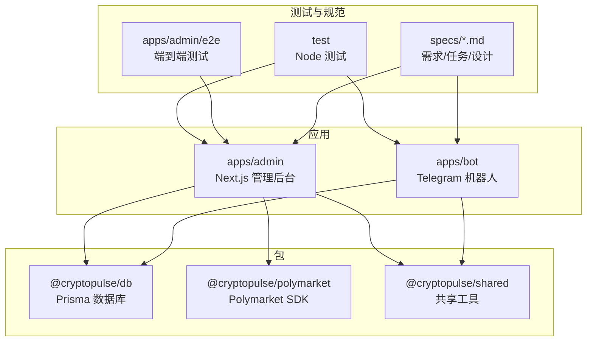
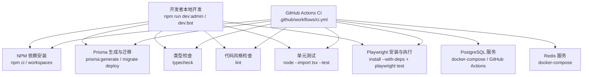
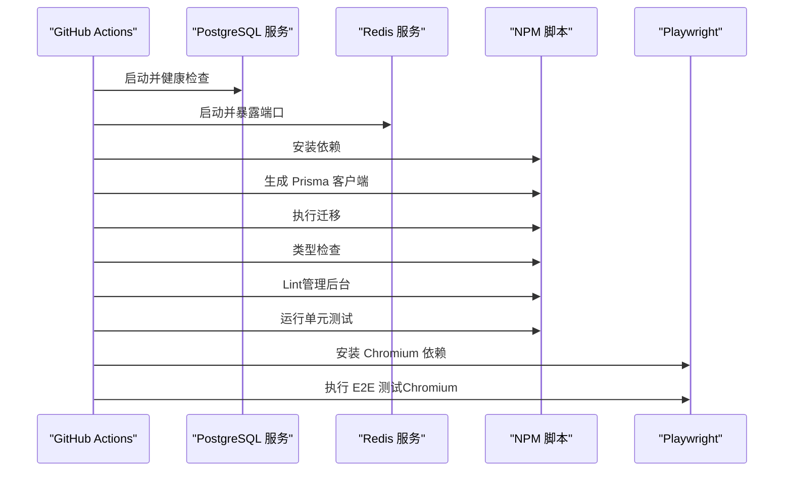
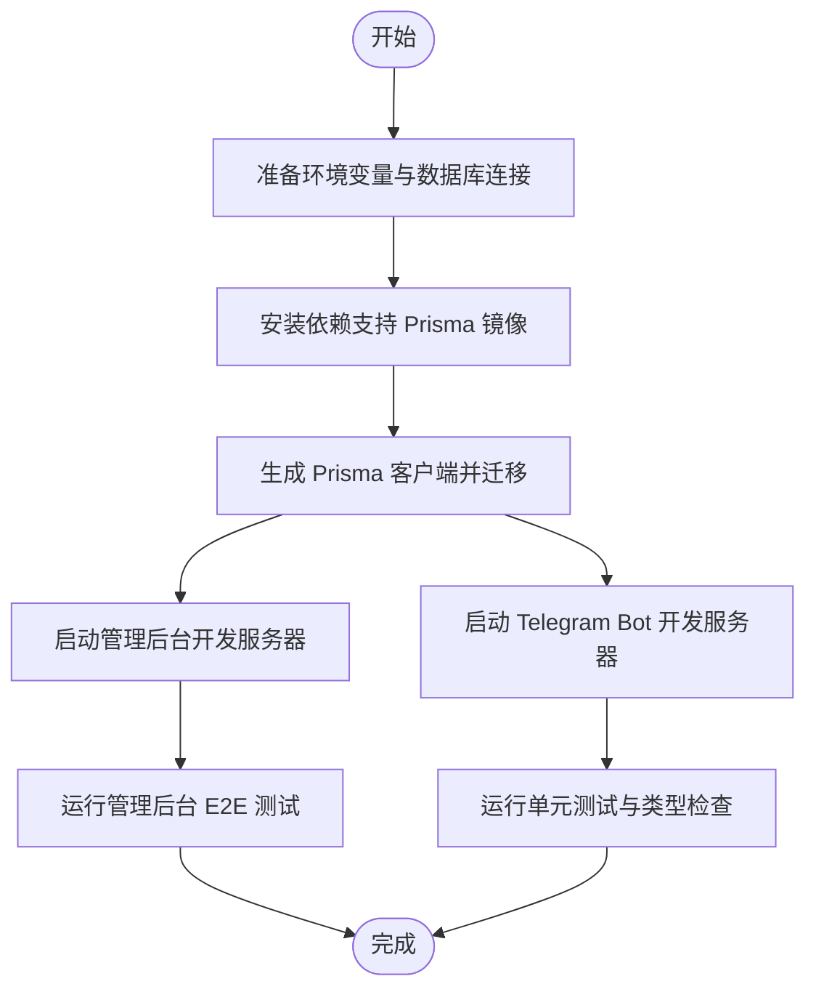
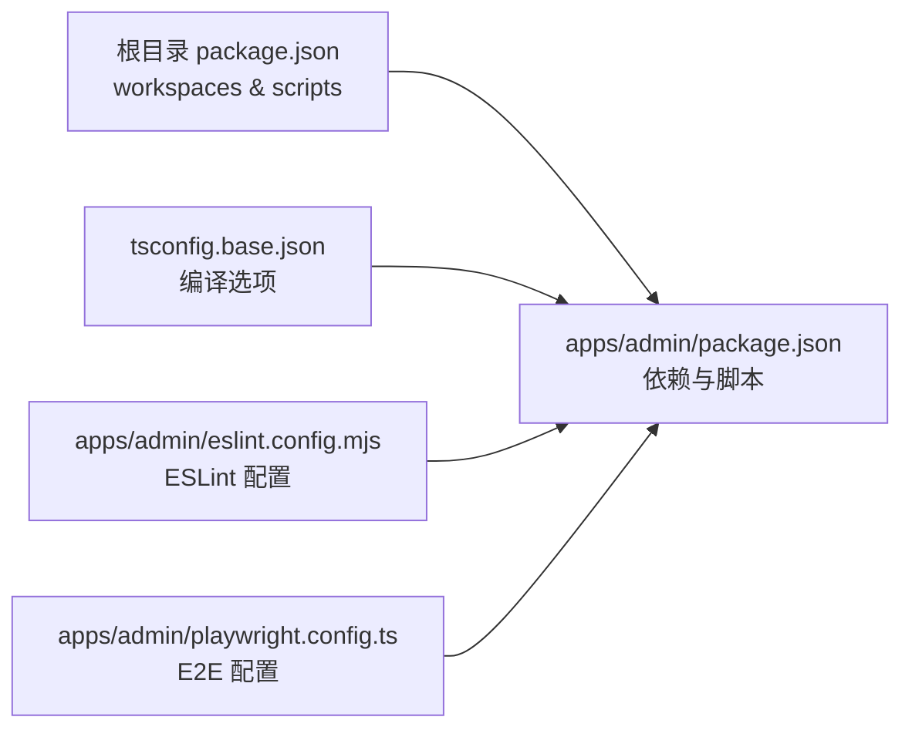
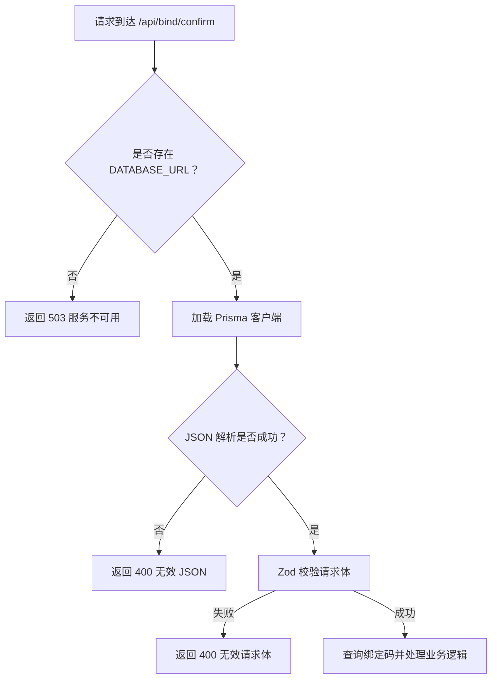

# 开发流程

<cite>
**本文档引用的文件**
- [ci.yml](file://.github/workflows/ci.yml)
- [package.json](file://package.json)
- [README.md](file://README.md)
- [docker-compose.yml](file://docker-compose.yml)
- [apps/admin/package.json](file://apps/admin/package.json)
- [apps/admin/playwright.config.ts](file://apps/admin/playwright.config.ts)
- [apps/admin/eslint.config.mjs](file://apps/admin/eslint.config.mjs)
- [tsconfig.base.json](file://tsconfig.base.json)
- [apps/admin/app/api/bind/confirm/confirm.route.ts](file://apps/admin/app/api/bind/confirm/confirm.route.ts)
- [apps/admin/app/api/bot/bind-code/route.ts](file://apps/admin/app/api/bot/bind-code/route.ts)
- [apps/admin/e2e/bind.e2e.spec.ts](file://apps/admin/e2e/bind.e2e.spec.ts)
- [test/admin-next-config.test.ts](file://test/admin-next-config.test.ts)
- [test/bind-confirm.test.ts](file://test/bind-confirm.test.ts)
- [.gitignore](file://.gitignore)
- [specs/requirements.md](file://specs/requirements.md)
- [specs/tasks.md](file://specs/tasks.md)
- [specs/design.md](file://specs/design.md)
</cite>

## 目录
1. [简介](#简介)
2. [项目结构](#项目结构)
3. [核心组件](#核心组件)
4. [架构总览](#架构总览)
5. [详细组件分析](#详细组件分析)
6. [依赖关系分析](#依赖关系分析)
7. [性能考虑](#性能考虑)
8. [故障排查指南](#故障排查指南)
9. [结论](#结论)
10. [附录](#附录)

## 简介
本文件为 CryptoPulse 项目的开发流程文档，覆盖分支管理、代码审查、持续集成、本地开发、版本控制与发布、以及团队协作与沟通流程。文档基于仓库中的实际配置与实现进行总结，帮助新成员快速理解并参与开发。

## 项目结构
项目采用多工作区（monorepo）组织，包含两个应用与若干共享包：
- 应用层
  - apps/admin：Next.js 管理后台
  - apps/bot：Telegram 机器人（源码位于 src/）
- 包层
  - packages/db：数据库与 Prisma
  - packages/polymarket：Polymarket SDK 封装
  - packages/shared：共享工具与类型
- 测试与规范
  - test：Node 核心测试
  - apps/admin/e2e：端到端测试
  - specs：需求、任务与设计文档

**图示来源**
- [package.json](file://package.json#L4-L7)
- [apps/admin/package.json](file://apps/admin/package.json#L13-L25)

**章节来源**
- [package.json](file://package.json#L1-L18)
- [apps/admin/package.json](file://apps/admin/package.json#L1-L42)

## 核心组件
- 管理后台（apps/admin）
  - Next.js 应用，包含 API 路由、UI 组件、样式与测试配置
  - 通过工作区脚本统一管理开发、构建与测试
- 机器人（apps/bot）
  - TypeScript 源码位于 src/，构建产物 dist/，开发脚本在 package.json 中定义
- 数据库与 SDK（packages/db、packages/polymarket）
  - Prisma 管理数据库迁移与访问
  - Polymarket SDK 封装交易相关能力
- 共享工具（packages/shared）
  - 提供跨应用复用的工具与类型定义
- 测试与规范
  - Node 测试用于核心逻辑验证
  - Playwright E2E 用于管理后台关键流程验证
  - 规范文档指导需求、任务与 API 设计

**章节来源**
- [apps/admin/package.json](file://apps/admin/package.json#L1-L42)
- [apps/admin/playwright.config.ts](file://apps/admin/playwright.config.ts#L1-L23)
- [specs/requirements.md](file://specs/requirements.md#L1-L132)
- [specs/tasks.md](file://specs/tasks.md#L1-L68)
- [specs/design.md](file://specs/design.md#L128-L167)

## 架构总览
下图展示了开发与测试流水线的关键节点，包括本地开发、CI 流水线、数据库与 Redis 服务、以及管理后台的端到端测试。

**图示来源**
- [ci.yml](file://.github/workflows/ci.yml#L1-L46)
- [package.json](file://package.json#L8-L15)
- [docker-compose.yml](file://docker-compose.yml#L1-L24)
- [apps/admin/playwright.config.ts](file://apps/admin/playwright.config.ts#L1-L23)

**章节来源**
- [ci.yml](file://.github/workflows/ci.yml#L1-L46)
- [package.json](file://package.json#L8-L15)
- [docker-compose.yml](file://docker-compose.yml#L1-L24)

## 详细组件分析

### 分支管理策略
- 主分支保护
  - CI 仅在推送到 main 分支时触发，确保主分支稳定性
- 功能分支
  - 建议以 feature/xxx 或 fix/xxx 命名，从 main 派生
- 合并流程
  - 通过 Pull Request 合并，要求 CI 通过、代码审查通过
  - 合并前清理不必要的提交，必要时进行 rebase 保持线性历史

**章节来源**
- [ci.yml](file://.github/workflows/ci.yml#L3-L6)

### 代码审查流程
- Pull Request 模板
  - 建议在仓库中补充 PR 模板，明确变更范围、测试验证与风险说明
- 审查标准
  - 代码风格：遵循 ESLint 配置
  - 类型安全：通过类型检查
  - 测试覆盖：新增功能配套单元/集成/E2E 测试
  - 安全性：敏感信息仅通过环境变量传递，不落库明文
- 批准流程
  - 至少一名维护者批准
  - CI 与测试全部通过后方可合并

**章节来源**
- [apps/admin/eslint.config.mjs](file://apps/admin/eslint.config.mjs#L1-L13)
- [specs/design.md](file://specs/design.md#L146-L153)

### 持续集成配置
- 工作流触发
  - push 到 main 分支与 pull_request
- 服务依赖
  - PostgreSQL 与 Redis 通过 docker-compose 或 GitHub Actions services 提供
- 步骤概览
  - 检出代码、安装 Node.js 并缓存依赖
  - 生成 Prisma 客户端、执行迁移
  - 类型检查、Linter、单元测试
  - 安装并执行 Playwright（Chromium），运行管理后台 E2E 测试

**图示来源**
- [ci.yml](file://.github/workflows/ci.yml#L3-L44)

**章节来源**
- [ci.yml](file://.github/workflows/ci.yml#L1-L46)
- [docker-compose.yml](file://docker-compose.yml#L1-L24)

### 本地开发流程
- 环境要求
  - Node.js 20+、PostgreSQL 14+、Redis 6+
  - Prisma 引擎在特定网络环境下可能需要镜像或代理
- 依赖安装
  - 使用工作区安装，Prisma 引擎可配置镜像源
- 环境变量
  - 复制并按需填写 .env.example
- 数据库初始化
  - 生成 Prisma 客户端、执行迁移
  - 支持 prisma:migrate 初始化
- 启动服务
  - 管理后台：npm run dev:admin
  - Telegram Bot：设置 TELEGRAM_BOT_TOKEN 后 npm run dev:bot
- 端到端测试
  - 管理后台 E2E：在 apps/admin 目录下执行测试脚本

**图示来源**
- [README.md](file://README.md#L3-L65)
- [package.json](file://package.json#L8-L15)
- [apps/admin/package.json](file://apps/admin/package.json#L5-L11)
- [apps/admin/playwright.config.ts](file://apps/admin/playwright.config.ts#L15-L21)

**章节来源**
- [README.md](file://README.md#L1-L65)
- [package.json](file://package.json#L8-L15)
- [apps/admin/package.json](file://apps/admin/package.json#L5-L11)
- [apps/admin/playwright.config.ts](file://apps/admin/playwright.config.ts#L1-L23)

### 版本控制最佳实践
- 提交消息
  - 建议采用清晰的类型前缀（feat/fix/docs/chore），简述变更并引用 Issue
- 标签管理
  - 使用语义化版本标签（vX.Y.Z），配合变更日志
- 发布流程
  - 在 main 分支上打标签并触发发布工件（如 Docker 镜像或包）
  - 发布前确保 CI 通过、测试通过、文档更新

**章节来源**
- [ci.yml](file://.github/workflows/ci.yml#L3-L6)

### 团队协作与沟通
- 任务规划
  - 使用 specs/tasks.md 明确阶段目标与里程碑
- 需求与设计
  - 需求文档与 API 设计文档指导开发与评审
- 安全与质量
  - 敏感信息仅通过环境变量传递，输入严格校验，实施速率限制与退避重试

**章节来源**
- [specs/tasks.md](file://specs/tasks.md#L1-L68)
- [specs/requirements.md](file://specs/requirements.md#L1-L132)
- [specs/design.md](file://specs/design.md#L146-L153)

## 依赖关系分析
- 工作区脚本
  - 顶层 package.json 定义了开发、构建、类型检查与测试的统一入口
- 应用依赖
  - 管理后台依赖 @cryptopulse/db、@cryptopulse/shared、Next.js 与 TailwindCSS
- 测试与工具
  - ESLint 配置、TypeScript 基础配置、Playwright E2E 配置

**图示来源**
- [package.json](file://package.json#L4-L15)
- [apps/admin/package.json](file://apps/admin/package.json#L1-L42)
- [tsconfig.base.json](file://tsconfig.base.json#L1-L16)
- [apps/admin/eslint.config.mjs](file://apps/admin/eslint.config.mjs#L1-L13)
- [apps/admin/playwright.config.ts](file://apps/admin/playwright.config.ts#L1-L23)

**章节来源**
- [package.json](file://package.json#L1-L18)
- [apps/admin/package.json](file://apps/admin/package.json#L1-L42)
- [tsconfig.base.json](file://tsconfig.base.json#L1-L16)
- [apps/admin/eslint.config.mjs](file://apps/admin/eslint.config.mjs#L1-L13)
- [apps/admin/playwright.config.ts](file://apps/admin/playwright.config.ts#L1-L23)

## 性能考虑
- 端到端测试
  - 使用 Chromium 通道与超时配置，确保测试稳定性
- 缓存与限流
  - 建议在市场数据与交易相关接口引入缓存与限流策略，降低上游依赖压力
- 类型与 Lint
  - 通过类型检查与 ESLint 提前发现潜在性能问题与错误

**章节来源**
- [apps/admin/playwright.config.ts](file://apps/admin/playwright.config.ts#L1-L23)
- [specs/design.md](file://specs/design.md#L152-L153)

## 故障排查指南
- 环境变量未设置
  - 管理后台 API 在缺少 DATABASE_URL 时返回服务不可用
- 数据库连接失败
  - 确认 DATABASE_URL 指向可用的 PostgreSQL 实例
- E2E 测试跳过
  - 当 DATABASE_URL 非本地地址时，测试会跳过以避免破坏线上数据
- 端到端测试失败
  - 查看 Playwright trace 与日志，确认服务启动与路由可达

**图示来源**
- [apps/admin/app/api/bind/confirm/confirm.route.ts](file://apps/admin/app/api/bind/confirm/confirm.route.ts#L21-L52)

**章节来源**
- [apps/admin/app/api/bind/confirm/confirm.route.ts](file://apps/admin/app/api/bind/confirm/confirm.route.ts#L21-L52)
- [apps/admin/e2e/bind.e2e.spec.ts](file://apps/admin/e2e/bind.e2e.spec.ts#L4-L10)
- [test/bind-confirm.test.ts](file://test/bind-confirm.test.ts#L86-L111)

## 结论
本开发流程文档基于仓库现有配置与实现，明确了分支策略、代码审查、CI 流程、本地开发、版本控制与团队协作要点。建议在后续迭代中补充 PR 模板与发布工件配置，以进一步提升协作效率与交付质量。

## 附录
- 本地开发命令
  - 管理后台：npm run dev:admin
  - Telegram Bot：npm run dev:bot
  - 类型检查：npm run typecheck
  - 单元测试：npm test
- 端到端测试
  - 管理后台：npm run test:e2e（Chromium）
- 依赖安装
  - npm ci
  - Prisma 客户端生成与迁移
- 环境变量
  - DATABASE_URL、ADMIN_TOKEN、TELEGRAM_BOT_TOKEN 等

**章节来源**
- [README.md](file://README.md#L41-L65)
- [package.json](file://package.json#L8-L15)
- [apps/admin/package.json](file://apps/admin/package.json#L5-L11)
- [apps/admin/playwright.config.ts](file://apps/admin/playwright.config.ts#L1-L23)
- [.gitignore](file://.gitignore#L1-L12)