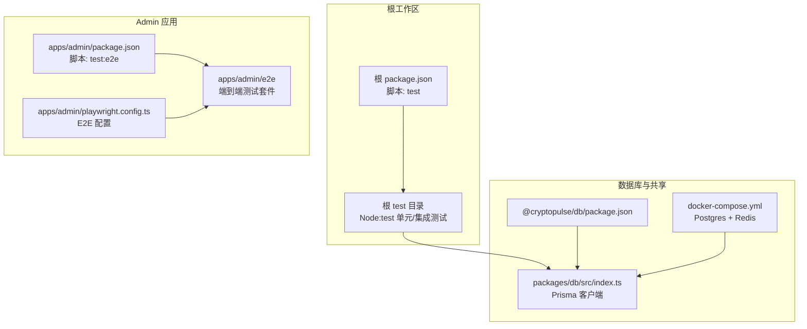
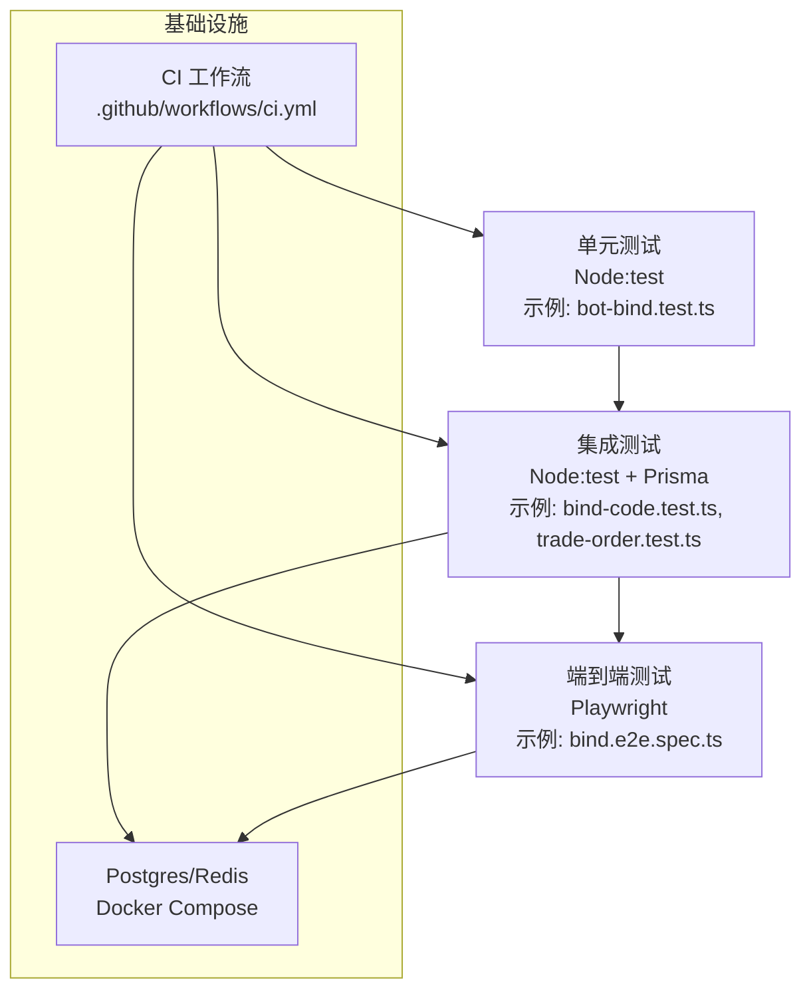
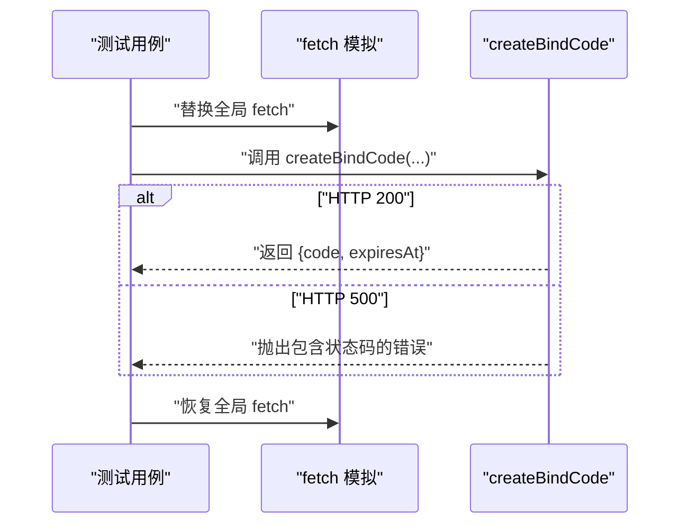
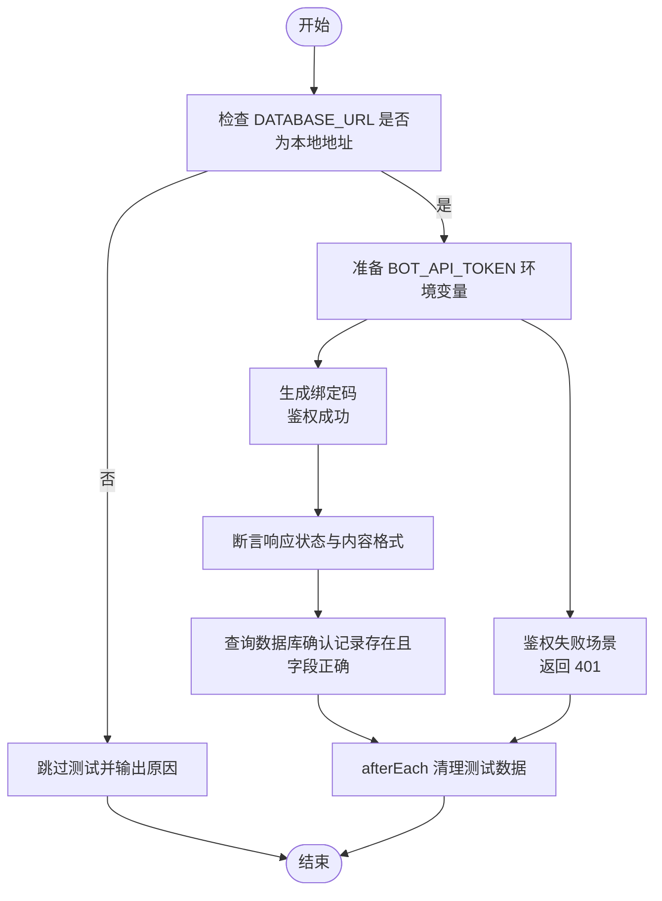
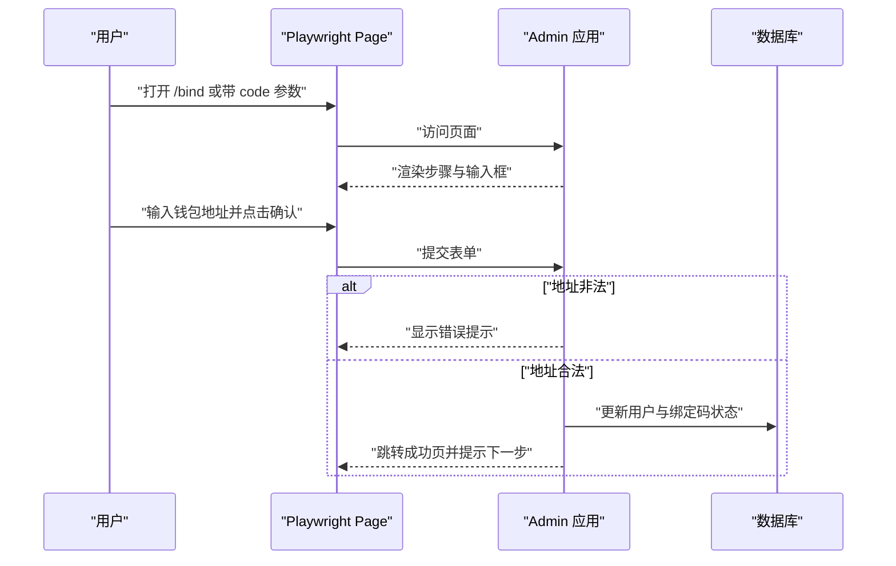
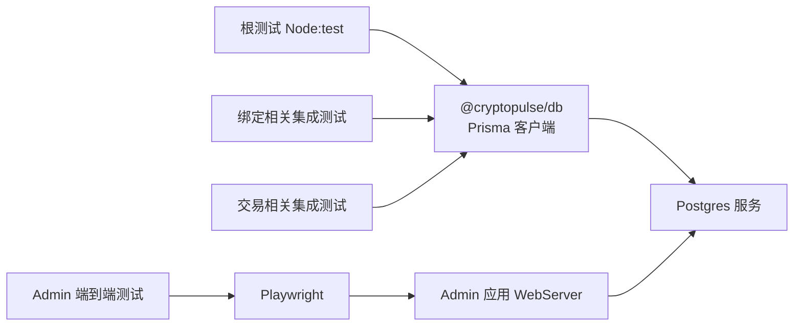

# 测试策略

<cite>
**本文引用的文件**
- [package.json](file://package.json)
- [apps/admin/package.json](file://apps/admin/package.json)
- [apps/admin/playwright.config.ts](file://apps/admin/playwright.config.ts)
- [.github/workflows/ci.yml](file://.github/workflows/ci.yml)
- [docker-compose.yml](file://docker-compose.yml)
- [packages/db/package.json](file://packages/db/package.json)
- [packages/db/src/index.ts](file://packages/db/src/index.ts)
- [test/admin-next-config.test.ts](file://test/admin-next-config.test.ts)
- [test/bind-code.test.ts](file://test/bind-code.test.ts)
- [test/bind-confirm.test.ts](file://test/bind-confirm.test.ts)
- [test/bot-bind.test.ts](file://test/bot-bind.test.ts)
- [test/trade-order.test.ts](file://test/trade-order.test.ts)
- [test/trade-portfolio.test.ts](file://test/trade-portfolio.test.ts)
- [apps/admin/e2e/bind.e2e.spec.ts](file://apps/admin/e2e/bind.e2e.spec.ts)
</cite>

## 目录
1. [引言](#引言)
2. [项目结构](#项目结构)
3. [核心组件](#核心组件)
4. [架构总览](#架构总览)
5. [详细组件分析](#详细组件分析)
6. [依赖分析](#依赖分析)
7. [性能考虑](#性能考虑)
8. [故障排查指南](#故障排查指南)
9. [结论](#结论)
10. [附录](#附录)

## 引言
本测试策略文档面向 CryptoPulse 项目，围绕测试金字塔（单元测试、集成测试、端到端测试）进行分层设计，明确测试框架配置（Jest 已弃用，采用 Node:test、Playwright）、测试用例编写规范、覆盖与质量指标、测试数据管理与环境配置，以及调试与常见问题处理方法。目标是在保证开发效率的同时，确保核心业务逻辑（绑定、下单、组合查询）的正确性与稳定性。

## 项目结构
当前仓库采用 monorepo 结构，测试分布在根级测试目录与应用端到端测试目录中：
- 根级测试：使用 Node:test 运行，覆盖 Admin Next 配置、Bot 绑定逻辑、Admin API 的鉴权与数据库交互。
- 应用端到端测试：在 Admin 应用内使用 Playwright，验证页面交互与数据库联动。

图表来源
- [package.json](file://package.json#L1-L18)
- [apps/admin/package.json](file://apps/admin/package.json#L1-L42)
- [apps/admin/playwright.config.ts](file://apps/admin/playwright.config.ts#L1-L23)
- [packages/db/src/index.ts](file://packages/db/src/index.ts#L1-L12)
- [docker-compose.yml](file://docker-compose.yml#L1-L24)

章节来源
- [package.json](file://package.json#L1-L18)
- [apps/admin/package.json](file://apps/admin/package.json#L1-L42)
- [apps/admin/playwright.config.ts](file://apps/admin/playwright.config.ts#L1-L23)
- [packages/db/src/index.ts](file://packages/db/src/index.ts#L1-L12)
- [docker-compose.yml](file://docker-compose.yml#L1-L24)

## 核心组件
- 测试运行器与脚本
  - 根级使用 Node:test 运行测试，命令通过根脚本统一入口执行。
  - Admin 应用提供端到端测试脚本，结合 Playwright 执行。
- 测试框架与配置
  - 单元/集成测试：Node:test + assert 断言。
  - 端到端测试：Playwright，配置浏览器项目、超时、webServer 启动与 trace 保留。
- 数据库与环境
  - 使用 Prisma 客户端连接 Postgres；CI 与本地均通过 Docker Compose 提供数据库与缓存服务。
  - 测试对 DATABASE_URL 有严格校验，仅允许本地回环地址以避免误伤生产数据。

章节来源
- [package.json](file://package.json#L8-L15)
- [apps/admin/package.json](file://apps/admin/package.json#L5-L11)
- [apps/admin/playwright.config.ts](file://apps/admin/playwright.config.ts#L1-L23)
- [packages/db/src/index.ts](file://packages/db/src/index.ts#L1-L12)
- [.github/workflows/ci.yml](file://.github/workflows/ci.yml#L9-L45)
- [docker-compose.yml](file://docker-compose.yml#L1-L24)

## 架构总览
测试体系分为三层，自底向上逐步扩大覆盖面与复杂度：

图表来源
- [test/bot-bind.test.ts](file://test/bot-bind.test.ts#L1-L48)
- [test/bind-code.test.ts](file://test/bind-code.test.ts#L1-L88)
- [test/trade-order.test.ts](file://test/trade-order.test.ts#L1-L107)
- [apps/admin/e2e/bind.e2e.spec.ts](file://apps/admin/e2e/bind.e2e.spec.ts#L1-L74)
- [.github/workflows/ci.yml](file://.github/workflows/ci.yml#L9-L45)
- [docker-compose.yml](file://docker-compose.yml#L1-L24)

## 详细组件分析

### 单元测试：Bot 绑定逻辑
- 目标：验证 Bot 层绑定流程中的工具函数行为与错误传播。
- 关键点：
  - 使用全局 fetch 替换模拟外部 API 调用，断言成功与失败路径。
  - 对错误消息中包含状态码的约定进行断言，确保上层可识别具体错误类型。
- 示例路径
  - [test/bot-bind.test.ts](file://test/bot-bind.test.ts#L1-L48)

图表来源
- [test/bot-bind.test.ts](file://test/bot-bind.test.ts#L10-L26)

章节来源
- [test/bot-bind.test.ts](file://test/bot-bind.test.ts#L1-L48)

### 集成测试：Admin Next 配置
- 目标：验证 Admin 应用构建阶段的 webpack 配置是否正确忽略系统目录，减少监听噪音。
- 关键点：
  - 通过调用 next.config 的 webpack 回调，断言 watchOptions.ignored 中包含典型系统目录关键字。
- 示例路径
  - [test/admin-next-config.test.ts](file://test/admin-next-config.test.ts#L1-L20)

章节来源
- [test/admin-next-config.test.ts](file://test/admin-next-config.test.ts#L1-L20)

### 集成测试：绑定码生成与鉴权
- 目标：验证 Admin API 的绑定码生成接口在不同环境下的鉴权与落库行为。
- 关键点：
  - 环境隔离：生产环境未配置令牌时返回 401；鉴权头错误时返回 401。
  - 功能验证：成功生成绑定码并落库，格式与有效期字段符合预期。
  - 数据清理：每个用例前后清理测试数据，避免污染。
- 示例路径
  - [test/bind-code.test.ts](file://test/bind-code.test.ts#L1-L88)

图表来源
- [test/bind-code.test.ts](file://test/bind-code.test.ts#L7-L25)

章节来源
- [test/bind-code.test.ts](file://test/bind-code.test.ts#L1-L88)

### 集成测试：绑定确认与重复使用防护
- 目标：验证绑定确认流程对不存在 code、重复使用等边界条件的处理。
- 关键点：
  - 不存在 code 返回 404；成功绑定后用户信息更新，绑定码标记 usedAt。
  - 重复使用同一 code 返回 409，防止二次消费。
- 示例路径
  - [test/bind-confirm.test.ts](file://test/bind-confirm.test.ts#L1-L112)

章节来源
- [test/bind-confirm.test.ts](file://test/bind-confirm.test.ts#L1-L112)

### 集成测试：交易下单（Mock 模式）
- 目标：验证交易下单 API 在鉴权失败、未绑定用户、Mock 模式下单等场景的行为。
- 关键点：
  - 鉴权失败返回 401；未绑定用户返回 400 并携带错误码。
  - Mock 模式下创建订单并返回模拟成交状态，同时持久化 TradeOrder 记录。
  - 用例前置准备 TradeOrder 表，确保测试一致性。
- 示例路径
  - [test/trade-order.test.ts](file://test/trade-order.test.ts#L1-L107)

章节来源
- [test/trade-order.test.ts](file://test/trade-order.test.ts#L1-L107)

### 集成测试：交易组合查询
- 目标：验证交易组合查询 API 返回正确的仓位汇总与最近订单列表。
- 关键点：
  - 用例前置准备 TradeOrder 表与用户绑定信息。
  - 断言返回 positions 与 recentOrders 的数量与关键字段。
- 示例路径
  - [test/trade-portfolio.test.ts](file://test/trade-portfolio.test.ts#L1-L96)

章节来源
- [test/trade-portfolio.test.ts](file://test/trade-portfolio.test.ts#L1-L96)

### 端到端测试：绑定流程
- 目标：验证前端绑定页面在不同输入下的用户反馈与路由跳转。
- 关键点：
  - 无 code 场景展示步骤与输入框；无效地址输入显示友好提示。
  - 成功绑定后跳转成功页并提示下一步，同时数据库中标记绑定码已使用。
  - 用例中对 DATABASE_URL 进行本地地址校验，必要时跳过测试。
- 示例路径
  - [apps/admin/e2e/bind.e2e.spec.ts](file://apps/admin/e2e/bind.e2e.spec.ts#L1-L74)

图表来源
- [apps/admin/e2e/bind.e2e.spec.ts](file://apps/admin/e2e/bind.e2e.spec.ts#L20-L68)

章节来源
- [apps/admin/e2e/bind.e2e.spec.ts](file://apps/admin/e2e/bind.e2e.spec.ts#L1-L74)

## 依赖分析
- 组件耦合
  - 集成测试强依赖 @cryptopulse/db 的 Prisma 客户端与数据库 schema。
  - 端到端测试依赖 Admin 应用的 webServer 启动与 Playwright 配置。
- 外部依赖
  - CI 使用 Postgres 作为数据库服务，Redis 由 docker-compose 提供。
  - Node 版本与 Playwright 依赖在 CI 中显式安装与配置。

图表来源
- [packages/db/src/index.ts](file://packages/db/src/index.ts#L1-L12)
- [apps/admin/playwright.config.ts](file://apps/admin/playwright.config.ts#L15-L20)
- [.github/workflows/ci.yml](file://.github/workflows/ci.yml#L11-L25)

章节来源
- [packages/db/src/index.ts](file://packages/db/src/index.ts#L1-L12)
- [apps/admin/playwright.config.ts](file://apps/admin/playwright.config.ts#L1-L23)
- [.github/workflows/ci.yml](file://.github/workflows/ci.yml#L1-L45)

## 性能考虑
- 测试执行顺序与隔离
  - 使用 beforeEach/afterEach 清理数据库，避免跨用例干扰，提升执行稳定性。
- 端到端测试并发
  - Playwright 配置了多项目（chromium、chrome），可在 CI 中并行加速，但需注意资源占用。
- 数据库健康
  - CI 中通过 health check 确保 Postgres 就绪后再执行迁移与测试，降低失败率。

## 故障排查指南
- 数据库连接问题
  - 症状：集成测试跳过或报错，提示 DATABASE_URL 非本地。
  - 排查：确认 DATABASE_URL 指向本地回环地址；CI 中检查服务注入与环境变量。
  - 参考
    - [test/bind-code.test.ts](file://test/bind-code.test.ts#L7-L13)
    - [.github/workflows/ci.yml](file://.github/workflows/ci.yml#L26)
- 端到端测试失败
  - 症状：页面元素不可见或路由未跳转。
  - 排查：查看 trace 日志；确认 webServer 已启动；检查 baseURL 与路由。
  - 参考
    - [apps/admin/playwright.config.ts](file://apps/admin/playwright.config.ts#L7-L20)
    - [apps/admin/e2e/bind.e2e.spec.ts](file://apps/admin/e2e/bind.e2e.spec.ts#L12-L18)
- 鉴权失败
  - 症状：401 响应频繁出现。
  - 排查：核对 BOT_API_TOKEN 环境变量；确认请求头 Authorization 正确传递。
  - 参考
    - [test/bind-code.test.ts](file://test/bind-code.test.ts#L30-L46)
    - [test/trade-order.test.ts](file://test/trade-order.test.ts#L50-L61)
- 端到端与集成测试冲突
  - 症状：数据库被不同测试修改导致断言失败。
  - 排查：确认 afterEach 清理逻辑完整；必要时增加更细粒度的事务或临时表隔离。
  - 参考
    - [test/bind-confirm.test.ts](file://test/bind-confirm.test.ts#L27-L31)
    - [test/trade-portfolio.test.ts](file://test/trade-portfolio.test.ts#L43-L47)

章节来源
- [test/bind-code.test.ts](file://test/bind-code.test.ts#L7-L13)
- [apps/admin/playwright.config.ts](file://apps/admin/playwright.config.ts#L7-L20)
- [apps/admin/e2e/bind.e2e.spec.ts](file://apps/admin/e2e/bind.e2e.spec.ts#L12-L18)
- [test/bind-confirm.test.ts](file://test/bind-confirm.test.ts#L27-L31)
- [test/trade-portfolio.test.ts](file://test/trade-portfolio.test.ts#L43-L47)

## 结论
本测试策略以 Node:test 为核心执行器，配合 Playwright 实现端到端覆盖，结合 Prisma 客户端完成数据库集成测试。通过严格的环境校验、用例隔离与 CI 自动化，确保绑定、下单与组合查询等关键路径的稳定性。建议持续完善覆盖率与质量门禁，并在团队内推广一致的测试命名与断言规范。

## 附录

### 测试金字塔与层次关系
- 单元测试（Node:test）
  - 覆盖：Bot 工具函数、Admin Next 配置。
  - 特点：快速、稳定、易维护。
- 集成测试（Node:test + Prisma）
  - 覆盖：Admin API 鉴权、绑定码生成、绑定确认、交易下单与组合查询。
  - 特点：贴近真实数据流，关注边界与异常。
- 端到端测试（Playwright）
  - 覆盖：用户交互、路由跳转、数据库联动。
  - 特点：从用户视角验证完整流程。

章节来源
- [test/bot-bind.test.ts](file://test/bot-bind.test.ts#L1-L48)
- [test/admin-next-config.test.ts](file://test/admin-next-config.test.ts#L1-L20)
- [test/bind-code.test.ts](file://test/bind-code.test.ts#L1-L88)
- [test/bind-confirm.test.ts](file://test/bind-confirm.test.ts#L1-L112)
- [test/trade-order.test.ts](file://test/trade-order.test.ts#L1-L107)
- [test/trade-portfolio.test.ts](file://test/trade-portfolio.test.ts#L1-L96)
- [apps/admin/e2e/bind.e2e.spec.ts](file://apps/admin/e2e/bind.e2e.spec.ts#L1-L74)

### 测试框架配置
- Node:test
  - 入口：根脚本统一执行。
  - 断言：使用 assert/strict。
- Playwright
  - 配置：超时、expect 超时、trace 保留、多浏览器项目、webServer 启动。
  - 执行：Admin 应用脚本触发，CI 中指定项目运行。

章节来源
- [package.json](file://package.json#L14)
- [apps/admin/package.json](file://apps/admin/package.json#L11)
- [apps/admin/playwright.config.ts](file://apps/admin/playwright.config.ts#L1-L23)
- [.github/workflows/ci.yml](file://.github/workflows/ci.yml#L41-L43)

### 测试用例编写规范
- 命名
  - 采用“模块: 场景: 预期结果”的结构，便于定位与检索。
- 断言
  - 使用 strict 断言；对状态码、响应体字段、数据库记录进行断言。
- 模拟策略
  - 使用全局替换 fetch 模拟外部依赖；对环境变量进行 beforeEach/afterEach 管理。
- 数据隔离
  - 每个用例前后清理测试数据；必要时在用例前创建临时表。

章节来源
- [test/bot-bind.test.ts](file://test/bot-bind.test.ts#L10-L26)
- [test/bind-code.test.ts](file://test/bind-code.test.ts#L17-L25)
- [test/bind-confirm.test.ts](file://test/bind-confirm.test.ts#L18-L31)
- [test/trade-order.test.ts](file://test/trade-order.test.ts#L37-L48)
- [test/trade-portfolio.test.ts](file://test/trade-portfolio.test.ts#L43-L47)

### 不同类型测试实施指南
- 组件测试（单元）
  - 重点：纯函数与工具函数；通过替换全局依赖实现可控输入输出。
- API 测试（集成）
  - 重点：鉴权、参数校验、数据库落库与查询；用例前后清理。
- 端到端测试
  - 重点：页面元素可见性、用户交互、路由与数据库联动；开启 trace 便于排障。

章节来源
- [test/bot-bind.test.ts](file://test/bot-bind.test.ts#L1-L48)
- [test/bind-code.test.ts](file://test/bind-code.test.ts#L1-L88)
- [apps/admin/e2e/bind.e2e.spec.ts](file://apps/admin/e2e/bind.e2e.spec.ts#L1-L74)

### 测试覆盖率与质量指标
- 覆盖率
  - 当前未发现专用覆盖率配置文件；建议在 Node:test 中引入覆盖率统计工具，并在 CI 中设置阈值。
- 质量指标
  - 用例失败率、端到端测试通过率、trace 保留命中率、数据库清理成功率。

章节来源
- [package.json](file://package.json#L14)
- [apps/admin/playwright.config.ts](file://apps/admin/playwright.config.ts#L9)

### 测试数据管理与环境配置
- 数据库
  - 本地：Docker Compose 提供 Postgres 与 Redis。
  - CI：GitHub Actions 注入 Postgres 服务与 DATABASE_URL。
  - 安全：所有集成测试在非本地 DATABASE_URL 时跳过，避免误伤生产数据。
- 环境变量
  - BOT_API_TOKEN：用于 Admin API 鉴权。
  - TRADE_MODE：交易模块的运行模式（如 mock）。
  - E2E_BASE_URL：端到端测试基础 URL。

章节来源
- [docker-compose.yml](file://docker-compose.yml#L1-L24)
- [.github/workflows/ci.yml](file://.github/workflows/ci.yml#L25-L28)
- [test/bind-code.test.ts](file://test/bind-code.test.ts#L7-L13)
- [test/trade-order.test.ts](file://test/trade-order.test.ts#L37-L42)
- [apps/admin/playwright.config.ts](file://apps/admin/playwright.config.ts#L8)

### 测试调试技巧与常见问题
- 调试技巧
  - 端到端：启用 trace，失败时查看 trace.zip；缩小页面选择器范围；分步断点。
  - 集成测试：打印关键环境变量与请求体；分场景拆分用例。
- 常见问题
  - DATABASE_URL 非本地：跳过测试并输出原因。
  - webServer 未就绪：调整启动命令与超时；确认端口未被占用。
  - 鉴权失败：核对令牌与请求头；在 beforeEach 设置环境变量。

章节来源
- [test/bind-code.test.ts](file://test/bind-code.test.ts#L7-L13)
- [apps/admin/playwright.config.ts](file://apps/admin/playwright.config.ts#L15-L20)
- [apps/admin/e2e/bind.e2e.spec.ts](file://apps/admin/e2e/bind.e2e.spec.ts#L20-L22)