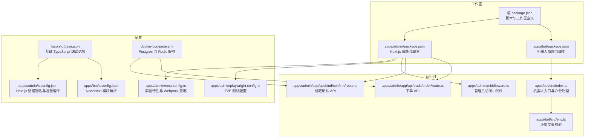
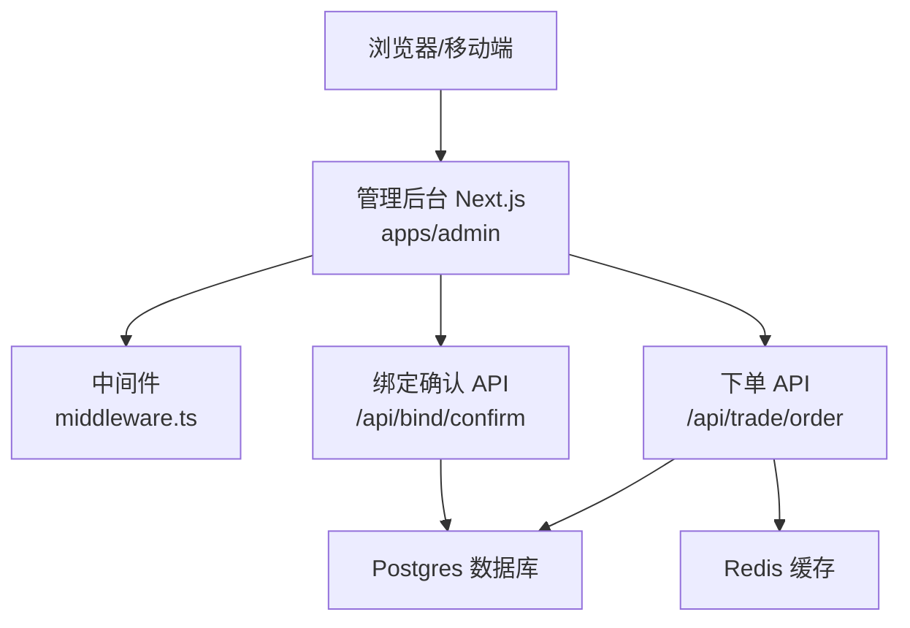
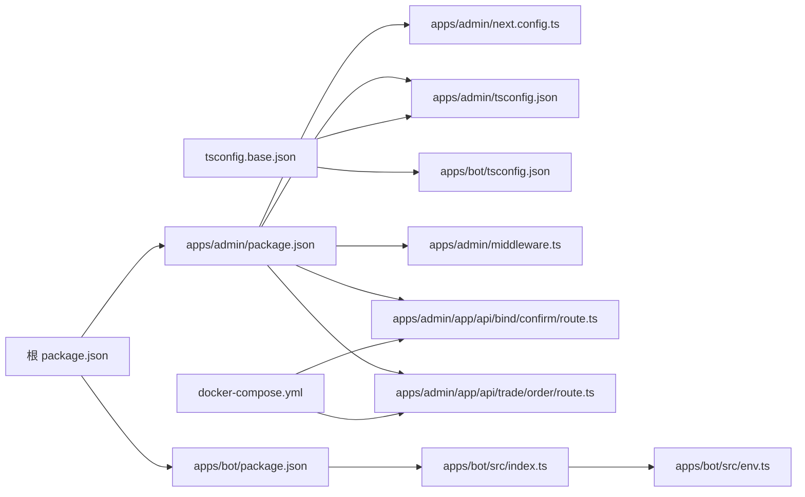

# 调试工具

<cite>
**本文引用的文件**
- [package.json](file://package.json)
- [apps/admin/package.json](file://apps/admin/package.json)
- [apps/bot/package.json](file://apps/bot/package.json)
- [tsconfig.base.json](file://tsconfig.base.json)
- [apps/admin/tsconfig.json](file://apps/admin/tsconfig.json)
- [apps/bot/tsconfig.json](file://apps/bot/tsconfig.json)
- [apps/admin/next.config.ts](file://apps/admin/next.config.ts)
- [apps/admin/middleware.ts](file://apps/admin/middleware.ts)
- [apps/admin/playwright.config.ts](file://apps/admin/playwright.config.ts)
- [apps/admin/app/api/bind/confirm/route.ts](file://apps/admin/app/api/bind/confirm/route.ts)
- [apps/admin/app/api/trade/order/route.ts](file://apps/admin/app/api/trade/order/route.ts)
- [apps/bot/src/index.ts](file://apps/bot/src/index.ts)
- [apps/bot/src/env.ts](file://apps/bot/src/env.ts)
- [docker-compose.yml](file://docker-compose.yml)
</cite>

## 目录
1. [简介](#简介)
2. [项目结构](#项目结构)
3. [核心组件](#核心组件)
4. [架构总览](#架构总览)
5. [详细组件分析](#详细组件分析)
6. [依赖分析](#依赖分析)
7. [性能考虑](#性能考虑)
8. [故障排查指南](#故障排查指南)
9. [结论](#结论)
10. [附录](#附录)

## 简介
本指南面向 CryptoPulse 项目的开发者与运维人员，系统性介绍调试工具与实践方法，覆盖以下方面：
- 开发工具配置：VS Code 设置、TypeScript 配置与调试器配置
- 日志记录策略：日志级别、格式化与输出位置
- 性能分析：内存分析、CPU 分析与网络监控
- 数据库调试：查询日志、事务管理与数据验证
- 前端调试：React DevTools、浏览器开发者工具与网络面板
- 后端调试：API 调试、中间件调试与错误追踪
- 常见问题诊断与解决方案

## 项目结构
项目采用多包工作区（workspaces）组织，包含前端应用（Next.js）、机器人（Telegram Bot）以及共享与数据库包。关键调试相关文件分布如下：
- 应用层：apps/admin（Next.js 管理后台）、apps/bot（TypeScript 机器人）
- 工具与配置：TypeScript 基础配置、Next 配置、Playwright E2E 配置、Docker Compose 数据库与缓存服务
- 核心路由与中间件：管理员访问控制与 API 接口

图表来源
- [package.json](file://package.json#L1-L18)
- [apps/admin/package.json](file://apps/admin/package.json#L1-L42)
- [apps/bot/package.json](file://apps/bot/package.json#L1-L26)
- [tsconfig.base.json](file://tsconfig.base.json#L1-L16)
- [apps/admin/tsconfig.json](file://apps/admin/tsconfig.json#L1-L28)
- [apps/bot/tsconfig.json](file://apps/bot/tsconfig.json#L1-L10)
- [apps/admin/next.config.ts](file://apps/admin/next.config.ts#L1-L30)
- [apps/admin/playwright.config.ts](file://apps/admin/playwright.config.ts#L1-L23)
- [apps/admin/middleware.ts](file://apps/admin/middleware.ts#L1-L23)
- [apps/admin/app/api/bind/confirm/route.ts](file://apps/admin/app/api/bind/confirm/route.ts#L1-L91)
- [apps/admin/app/api/trade/order/route.ts](file://apps/admin/app/api/trade/order/route.ts#L1-L94)
- [apps/bot/src/index.ts](file://apps/bot/src/index.ts#L1-L156)
- [apps/bot/src/env.ts](file://apps/bot/src/env.ts#L1-L14)
- [docker-compose.yml](file://docker-compose.yml#L1-L24)

章节来源
- [package.json](file://package.json#L1-L18)
- [apps/admin/package.json](file://apps/admin/package.json#L1-L42)
- [apps/bot/package.json](file://apps/bot/package.json#L1-L26)

## 核心组件
- 管理后台（Next.js）：提供管理员登录、绑定确认、下单等 API；通过中间件保护受控路由；使用 Playwright 进行端到端测试。
- 机器人（Telegram Bot）：基于 grammY，处理命令、内联键盘回调与错误捕获；通过环境变量校验确保运行时安全。
- 数据库与缓存：Postgres 存储业务数据，Redis 作为缓存（可选），通过 Docker Compose 提供本地服务。

章节来源
- [apps/admin/middleware.ts](file://apps/admin/middleware.ts#L1-L23)
- [apps/admin/app/api/bind/confirm/route.ts](file://apps/admin/app/api/bind/confirm/route.ts#L1-L91)
- [apps/admin/app/api/trade/order/route.ts](file://apps/admin/app/api/trade/order/route.ts#L1-L94)
- [apps/bot/src/index.ts](file://apps/bot/src/index.ts#L1-L156)
- [apps/bot/src/env.ts](file://apps/bot/src/env.ts#L1-L14)
- [docker-compose.yml](file://docker-compose.yml#L1-L24)

## 架构总览
下图展示了从浏览器到 API、再到数据库与缓存的整体调用链路，以及机器人与 Web 的交互。

图表来源
- [apps/admin/middleware.ts](file://apps/admin/middleware.ts#L1-L23)
- [apps/admin/app/api/bind/confirm/route.ts](file://apps/admin/app/api/bind/confirm/route.ts#L1-L91)
- [apps/admin/app/api/trade/order/route.ts](file://apps/admin/app/api/trade/order/route.ts#L1-L94)
- [docker-compose.yml](file://docker-compose.yml#L1-L24)

## 详细组件分析

### 开发工具与调试器配置
- VS Code 设置建议
  - 安装推荐扩展：TypeScript Vue Plugin、ESLint、Prettier、Playwright Test Explorer
  - 在工作区设置中启用“自动导入”与“类型检查”，以匹配项目 TypeScript 配置
  - 使用任务与启动配置分别运行前端与机器人进程
- TypeScript 配置
  - 基础配置：目标语言、模块解析、严格模式、JSX 保留等
  - 管理后台：启用增量编译、允许 JS、路径别名 @/*
  - 机器人：NodeNext 模块解析，便于原生 ES 模块与源映射
- 调试器配置
  - 管理后台：使用 Node 调试器附加 Next 开发服务器，监听端口 3000
  - 机器人：使用 tsx watch 启动，结合 source maps 进行断点调试

章节来源
- [tsconfig.base.json](file://tsconfig.base.json#L1-L16)
- [apps/admin/tsconfig.json](file://apps/admin/tsconfig.json#L1-L28)
- [apps/bot/tsconfig.json](file://apps/bot/tsconfig.json#L1-L10)
- [apps/admin/package.json](file://apps/admin/package.json#L1-L42)
- [apps/bot/package.json](file://apps/bot/package.json#L1-L26)

### 日志记录策略
- 日志级别与用途
  - 调试：开发阶段用于跟踪流程与参数
  - 信息：常规操作结果与状态变更
  - 错误：异常、未授权、数据库不可用等
- 格式化与输出位置
  - 统一前缀：如 [Trade] 前缀用于区分业务域
  - 输出位置：标准输出与错误输出，便于容器日志采集
- 典型场景
  - 订单接口：记录下单用户、方向、金额与市场标识
  - 绑定确认：记录绑定码生命周期与事务执行结果
  - 机器人：统一错误前缀与堆栈输出，便于定位回调处理问题

章节来源
- [apps/admin/app/api/trade/order/route.ts](file://apps/admin/app/api/trade/order/route.ts#L59-L91)
- [apps/admin/app/api/bind/confirm/route.ts](file://apps/admin/app/api/bind/confirm/route.ts#L64-L88)
- [apps/bot/src/index.ts](file://apps/bot/src/index.ts#L150-L152)

### 性能分析工具
- 内存分析
  - 使用 Node.js 内置分析器或 heapdump 生成快照，定位异常增长
  - 关注机器人长时间运行时的事件循环与回调累积
- CPU 分析
  - 对热点函数进行火焰图分析，识别高耗时回调与网络请求
  - 结合 Next.js Profiling 工具评估页面渲染与 API 处理开销
- 网络监控
  - 浏览器网络面板观察 API 请求与响应时间
  - 监控数据库连接池与 Redis 命中率，避免阻塞与超时

[本节为通用指导，无需列出具体文件来源]

### 数据库调试技巧
- 查询日志
  - 启用 Postgres 日志：log_statement = all 或按需 log_min_duration_statement
  - 观察慢查询：结合 EXPLAIN/EXPLAIN ANALYZE 分析索引与执行计划
- 事务管理
  - 使用原子事务保证绑定与用户更新一致性
  - 异常回滚与幂等设计，避免重复使用绑定码
- 数据验证
  - 校验字段范围与类型（如 telegramId、正数金额、枚举值）
  - 使用 Prisma 客户端约束与唯一索引防止脏数据

章节来源
- [apps/admin/app/api/bind/confirm/route.ts](file://apps/admin/app/api/bind/confirm/route.ts#L48-L83)
- [apps/admin/app/api/trade/order/route.ts](file://apps/admin/app/api/trade/order/route.ts#L51-L57)

### 前端调试方法
- React DevTools
  - 检查组件树、Props 与状态变化，定位渲染异常与重复渲染
- 浏览器开发者工具
  - Elements：检查样式与布局问题
  - Console：查看日志与错误堆栈
  - Sources：断点调试 Next.js 页面与 API 路由
- 网络面板
  - 观察 API 请求头、体、状态码与响应时间
  - 使用条件断点拦截特定请求，快速定位问题

[本节为通用指导，无需列出具体文件来源]

### 后端调试技巧
- API 调试
  - 使用 curl 或 Postman 调用 /api/bind/confirm 与 /api/trade/order
  - 校验鉴权头、JSON 体与必填字段
- 中间件调试
  - 在中间件中打印请求 URL、Cookie 与令牌，验证访问控制逻辑
- 错误追踪
  - 统一错误响应结构，记录上下文与时间戳
  - 结合容器日志与错误监控平台聚合异常

章节来源
- [apps/admin/middleware.ts](file://apps/admin/middleware.ts#L3-L16)
- [apps/admin/app/api/bind/confirm/route.ts](file://apps/admin/app/api/bind/confirm/route.ts#L21-L38)
- [apps/admin/app/api/trade/order/route.ts](file://apps/admin/app/api/trade/order/route.ts#L16-L35)

### 常见问题诊断与解决方案
- 管理员访问被拒绝
  - 检查 ADMIN_TOKEN 是否正确设置，Cookie 名称是否为 admin_token
  - 确认中间件匹配规则与重定向行为
- 绑定确认失败
  - 校验 DATABASE_URL 可用性与 Prisma 初始化
  - 查看绑定码是否存在、是否过期或已被使用
- 下单返回未授权
  - 校验 BOT_API_TOKEN 与 Authorization 头格式
  - 确认用户已绑定并具备 Polymarket 地址
- 机器人报错
  - 检查 TELEGRAM_BOT_TOKEN、API_BASE_URL、WEB_BASE_URL 等环境变量
  - 查看机器人错误捕获日志，定位回调处理异常

章节来源
- [apps/admin/middleware.ts](file://apps/admin/middleware.ts#L3-L16)
- [apps/admin/app/api/bind/confirm/route.ts](file://apps/admin/app/api/bind/confirm/route.ts#L22-L31)
- [apps/admin/app/api/trade/order/route.ts](file://apps/admin/app/api/trade/order/route.ts#L17-L23)
- [apps/bot/src/env.ts](file://apps/bot/src/env.ts#L3-L12)
- [apps/bot/src/index.ts](file://apps/bot/src/index.ts#L150-L152)

## 依赖分析
- 包管理与脚本
  - 根目录通过 workspaces 管理 apps 与 packages，提供统一开发脚本
  - 管理后台与机器人各自维护独立依赖与构建脚本
- 配置耦合
  - Next.js 与 Prisma、Zod 等库紧密耦合于管理后台
  - 机器人依赖 grammY、dotenv、Prisma 与 Polymarket 相关包
- 外部依赖
  - Postgres 与 Redis 通过 Docker Compose 提供本地服务

图表来源
- [package.json](file://package.json#L1-L18)
- [apps/admin/package.json](file://apps/admin/package.json#L1-L42)
- [apps/bot/package.json](file://apps/bot/package.json#L1-L26)
- [apps/admin/next.config.ts](file://apps/admin/next.config.ts#L1-L30)
- [tsconfig.base.json](file://tsconfig.base.json#L1-L16)
- [apps/admin/tsconfig.json](file://apps/admin/tsconfig.json#L1-L28)
- [apps/bot/tsconfig.json](file://apps/bot/tsconfig.json#L1-L10)
- [apps/admin/middleware.ts](file://apps/admin/middleware.ts#L1-L23)
- [apps/admin/app/api/bind/confirm/route.ts](file://apps/admin/app/api/bind/confirm/route.ts#L1-L91)
- [apps/admin/app/api/trade/order/route.ts](file://apps/admin/app/api/trade/order/route.ts#L1-L94)
- [apps/bot/src/index.ts](file://apps/bot/src/index.ts#L1-L156)
- [apps/bot/src/env.ts](file://apps/bot/src/env.ts#L1-L14)
- [docker-compose.yml](file://docker-compose.yml#L1-L24)

章节来源
- [package.json](file://package.json#L1-L18)
- [apps/admin/package.json](file://apps/admin/package.json#L1-L42)
- [apps/bot/package.json](file://apps/bot/package.json#L1-L26)

## 性能考虑
- 优化建议
  - 启用 Next.js 与 Prisma 的连接池与查询缓存
  - 对高频 API 接口增加 Redis 缓存（如用户信息、市场数据）
  - 控制日志量与格式化成本，避免在生产环境输出过多结构化日志
  - 机器人侧减少不必要的网络请求与回调处理层级

[本节为通用指导，无需列出具体文件来源]

## 故障排查指南
- 环境变量缺失
  - 管理后台：DATABASE_URL、ADMIN_TOKEN、BOT_API_TOKEN
  - 机器人：TELEGRAM_BOT_TOKEN、API_BASE_URL、WEB_BASE_URL
- 数据库连通性
  - 使用 docker-compose 启动 Postgres 与 Redis，确认端口映射与卷挂载
  - 在 API 路由中优先检查 DATABASE_URL 并返回明确错误码
- 中间件与权限
  - 核对中间件匹配路径与 Cookie 名称，避免误判
- 日志与追踪
  - 统一错误前缀与响应结构，结合容器日志与错误监控平台定位问题

章节来源
- [apps/admin/app/api/bind/confirm/route.ts](file://apps/admin/app/api/bind/confirm/route.ts#L22-L31)
- [apps/admin/app/api/trade/order/route.ts](file://apps/admin/app/api/trade/order/route.ts#L17-L23)
- [apps/bot/src/env.ts](file://apps/bot/src/env.ts#L3-L12)
- [docker-compose.yml](file://docker-compose.yml#L1-L24)

## 结论
通过规范的开发工具配置、完善的日志策略、系统化的性能分析与数据库调试手段，以及前后端协同的调试流程，可以显著提升 CryptoPulse 项目的可维护性与稳定性。建议在团队内形成标准化的调试手册与问题升级流程，持续优化开发体验与线上可靠性。

[本节为总结性内容，无需列出具体文件来源]

## 附录
- E2E 测试配置
  - Playwright 项目：chromium 与 chrome 通道，失败时保留 trace
  - Web 服务器：复用现有开发服务器，避免重复启动
- Next.js 实验特性
  - serverActions.bodySizeLimit：提升表单负载上限
  - webpack 忽略：排除系统文件与临时文件，降低监听开销

章节来源
- [apps/admin/playwright.config.ts](file://apps/admin/playwright.config.ts#L1-L23)
- [apps/admin/next.config.ts](file://apps/admin/next.config.ts#L3-L25)