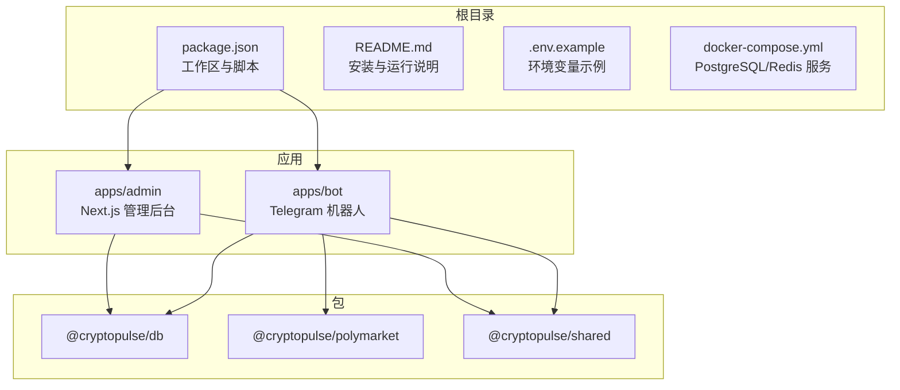
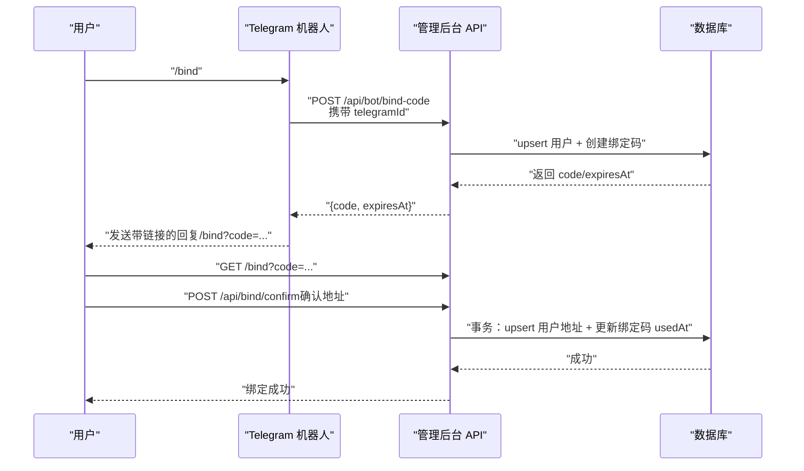
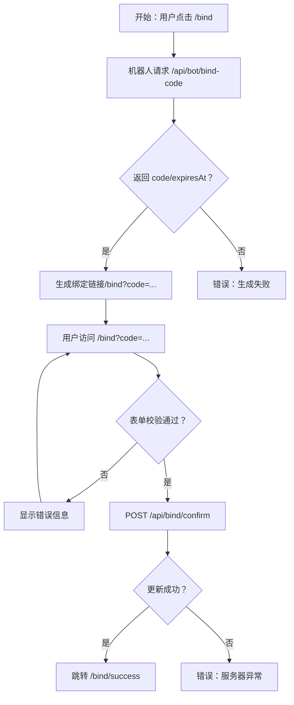
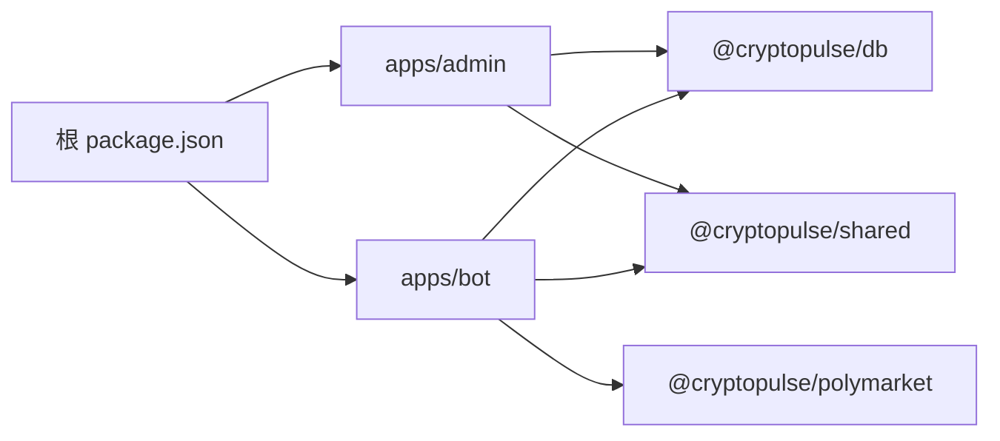

# 快速开始

<cite>
**本文引用的文件**
- [README.md](file://README.md)
- [package.json](file://package.json)
- [.env.example](file://.env.example)
- [docker-compose.yml](file://docker-compose.yml)
- [apps/admin/package.json](file://apps/admin/package.json)
- [apps/bot/package.json](file://apps/bot/package.json)
- [apps/admin/app/bind/actions.ts](file://apps/admin/app/bind/actions.ts)
- [apps/admin/app/bind/page.tsx](file://apps/admin/app/bind/page.tsx)
- [apps/admin/app/api/bind/confirm/route.ts](file://apps/admin/app/api/bind/confirm/route.ts)
- [apps/admin/app/api/bot/bind-code/route.ts](file://apps/admin/app/api/bot/bind-code/route.ts)
- [apps/bot/src/index.ts](file://apps/bot/src/index.ts)
- [apps/bot/src/env.ts](file://apps/bot/src/env.ts)
</cite>

## 目录
1. [简介](#简介)
2. [项目结构](#项目结构)
3. [核心组件](#核心组件)
4. [架构总览](#架构总览)
5. [详细组件分析](#详细组件分析)
6. [依赖分析](#依赖分析)
7. [性能考虑](#性能考虑)
8. [故障排除指南](#故障排除指南)
9. [结论](#结论)
10. [附录](#附录)

## 简介
本指南面向首次接触 CryptoPulse 项目的开发者，帮助你在最短时间内完成环境准备、依赖安装、数据库初始化、本地开发启动，并通过最小化的“绑定流程”验证环境配置正确性。项目采用多工作区（workspaces）组织，包含管理后台（Next.js）与 Telegram 机器人（Node.js）两个应用，以及共享与数据库相关包。

## 项目结构
仓库采用 monorepo 结构，核心目录与职责如下：
- apps/admin：管理后台（Next.js 应用）
- apps/bot：Telegram 机器人（Node.js 应用）
- packages/db、packages/polymarket、packages/shared：共享与数据库相关包
- 根级脚本与环境：README、package.json、.env.example、docker-compose.yml

图表来源
- [package.json](file://package.json#L1-L18)
- [apps/admin/package.json](file://apps/admin/package.json#L1-L42)
- [apps/bot/package.json](file://apps/bot/package.json#L1-L26)

章节来源
- [README.md](file://README.md#L1-L65)
- [package.json](file://package.json#L1-L18)

## 核心组件
- 管理后台（Next.js）：提供绑定页、登录、API 接口等前端与后端逻辑。
- Telegram 机器人：处理 /start、/bind、搜索、下单、查询持仓等命令与回调。
- 数据库与缓存：PostgreSQL 存储用户与绑定码，Redis 用于缓存（可选）。
- 环境变量：统一在 .env.example 中定义，包含数据库、缓存、Telegram、Polymarket、钱包接入等配置项。

章节来源
- [apps/admin/package.json](file://apps/admin/package.json#L1-L42)
- [apps/bot/package.json](file://apps/bot/package.json#L1-L26)
- [.env.example](file://.env.example#L1-L43)

## 架构总览
下图展示了最小绑定流程的关键交互：用户在 Telegram 机器人中发起 /bind，机器人调用管理后台 API 生成绑定码，随后用户在网页绑定页输入地址并确认，系统写入用户信息并标记绑定码已使用。

图表来源
- [apps/bot/src/index.ts](file://apps/bot/src/index.ts#L57-L91)
- [apps/admin/app/api/bot/bind-code/route.ts](file://apps/admin/app/api/bot/bind-code/route.ts#L34-L103)
- [apps/admin/app/bind/page.tsx](file://apps/admin/app/bind/page.tsx#L30-L125)
- [apps/admin/app/api/bind/confirm/route.ts](file://apps/admin/app/api/bind/confirm/route.ts#L21-L90)

## 详细组件分析

### 环境要求与安装
- 运行时要求
  - Node.js 20+
  - PostgreSQL 14+（本地或远程）
  - Redis 6+（本地或远程）
- 依赖安装
  - Prisma 引擎在部分网络环境下可能下载失败，可通过设置镜像环境变量后执行安装。
- 环境变量
  - 复制并按需填写 .env.example，确保 DATABASE_URL、REDIS_URL、TELEGRAM_BOT_TOKEN、API_BASE_URL、WEB_BASE_URL 等关键项有效。
- 数据库初始化
  - 设置 DATABASE_URL 指向可用的 PostgreSQL 后，执行 Prisma 生成与迁移部署。
  - 开发环境也可使用带名称的迁移初始化。
- 本地运行
  - 管理后台：通过根脚本启动，访问 http://localhost:3000。
  - Telegram 机器人：设置 TELEGRAM_BOT_TOKEN 后启动。

章节来源
- [README.md](file://README.md#L3-L18)
- [.env.example](file://.env.example#L1-L43)

### 绑定流程（最小实现）
- 流程步骤
  - 在机器人内发送 /bind 或在 /start 点击“生成绑定链接”，机器人调用管理后台 API 生成绑定码并返回带链接的消息。
  - 用户打开链接进入公开绑定页，输入绑定码后填写地址信息并确认，系统写入用户地址并标记绑定码已使用，最终跳转至成功页。
- 关键接口
  - 生成绑定码：POST /api/bot/bind-code（需要 BOT_API_TOKEN 或非生产环境校验）。
  - 确认绑定：POST /api/bind/confirm（校验绑定码有效性并写入用户地址）。
  - 绑定页：GET /bind（根据 code 展示表单或错误提示）。

图表来源
- [apps/bot/src/index.ts](file://apps/bot/src/index.ts#L57-L91)
- [apps/admin/app/api/bot/bind-code/route.ts](file://apps/admin/app/api/bot/bind-code/route.ts#L34-L103)
- [apps/admin/app/bind/page.tsx](file://apps/admin/app/bind/page.tsx#L30-L125)
- [apps/admin/app/api/bind/confirm/route.ts](file://apps/admin/app/api/bind/confirm/route.ts#L21-L90)

章节来源
- [README.md](file://README.md#L59-L65)
- [apps/bot/src/index.ts](file://apps/bot/src/index.ts#L57-L91)
- [apps/admin/app/api/bot/bind-code/route.ts](file://apps/admin/app/api/bot/bind-code/route.ts#L34-L103)
- [apps/admin/app/bind/page.tsx](file://apps/admin/app/bind/page.tsx#L30-L125)
- [apps/admin/app/api/bind/confirm/route.ts](file://apps/admin/app/api/bind/confirm/route.ts#L21-L90)

### 管理后台（Next.js）
- 路由与功能
  - /bind：根据 code 渲染绑定页，支持错误提示与初始数据回显。
  - /api/bot/bind-code：生成绑定码并返回有效期。
  - /api/bind/confirm：确认绑定并写入用户地址。
- 错误处理
  - 输入校验失败、数据库不可用、Prisma 未就绪、绑定码不存在/已使用/已过期、服务器错误等均有明确的错误码与提示。

章节来源
- [apps/admin/app/bind/page.tsx](file://apps/admin/app/bind/page.tsx#L30-L125)
- [apps/admin/app/bind/actions.ts](file://apps/admin/app/bind/actions.ts#L21-L90)
- [apps/admin/app/api/bot/bind-code/route.ts](file://apps/admin/app/api/bot/bind-code/route.ts#L34-L103)
- [apps/admin/app/api/bind/confirm/route.ts](file://apps/admin/app/api/bind/confirm/route.ts#L21-L90)

### Telegram 机器人（Node.js）
- 命令与回调
  - /start：展示菜单与绑定入口。
  - /bind：生成绑定码并发送带链接的回复。
  - 搜索、分类浏览、下单、查询持仓等回调处理。
- 环境变量
  - 通过 Zod 校验 TELEGRAM_BOT_TOKEN、API_BASE_URL、WEB_BASE_URL、BOT_API_TOKEN 等必要项。

章节来源
- [apps/bot/src/index.ts](file://apps/bot/src/index.ts#L11-L156)
- [apps/bot/src/env.ts](file://apps/bot/src/env.ts#L3-L12)

## 依赖分析
- 工作区与脚本
  - 根 package.json 定义了 workspaces 与常用脚本，如 dev:admin、dev:bot。
- 应用依赖
  - 管理后台依赖 @cryptopulse/db、@cryptopulse/shared、Next.js 等。
  - 机器人依赖 dotenv、grammy、@cryptopulse/db、@cryptopulse/polymarket、@cryptopulse/shared 等。
- 外部服务
  - PostgreSQL 与 Redis 通过 docker-compose 提供本地服务，或可替换为远程实例。

图表来源
- [package.json](file://package.json#L4-L6)
- [apps/admin/package.json](file://apps/admin/package.json#L14-L24)
- [apps/bot/package.json](file://apps/bot/package.json#L12-L18)

章节来源
- [package.json](file://package.json#L1-L18)
- [apps/admin/package.json](file://apps/admin/package.json#L1-L42)
- [apps/bot/package.json](file://apps/bot/package.json#L1-L26)

## 性能考虑
- 数据库连接与事务
  - 绑定确认使用事务保证一致性，避免竞态条件导致的状态不一致。
- 绑定码生成
  - 随机生成并去重，若唯一约束冲突最多重试有限次数，防止无限循环。
- 缓存与会话
  - 可结合 Redis 缓存热点数据与会话信息，降低数据库压力（具体取决于业务扩展）。

章节来源
- [apps/admin/app/api/bot/bind-code/route.ts](file://apps/admin/app/api/bot/bind-code/route.ts#L83-L97)
- [apps/admin/app/api/bind/confirm/route.ts](file://apps/admin/app/api/bind/confirm/route.ts#L64-L83)

## 故障排除指南
- Prisma 引擎下载失败
  - 设置镜像环境变量后重试安装。
- 数据库未配置或连接失败
  - 确认 DATABASE_URL 指向可用的 PostgreSQL 实例；执行 Prisma 生成与迁移。
- 管理后台无法访问或空白
  - 检查 ADMIN_TOKEN（生产环境必需）与 API_BASE_URL、WEB_BASE_URL 是否正确。
- 机器人无法启动或无响应
  - 确认 TELEGRAM_BOT_TOKEN 有效；检查 API_BASE_URL 与 WEB_BASE_URL；查看控制台日志。
- 绑定失败
  - 检查 BOT_API_TOKEN 是否正确；确认绑定码未过期且未被使用；核对地址格式（0x 开头的 42 字符十六进制，可为空）。

章节来源
- [README.md](file://README.md#L13-L18)
- [README.md](file://README.md#L26-L40)
- [apps/admin/app/bind/actions.ts](file://apps/admin/app/bind/actions.ts#L29-L35)
- [apps/admin/app/api/bot/bind-code/route.ts](file://apps/admin/app/api/bot/bind-code/route.ts#L38-L44)
- [apps/admin/app/api/bind/confirm/route.ts](file://apps/admin/app/api/bind/confirm/route.ts#L40-L43)
- [apps/bot/src/env.ts](file://apps/bot/src/env.ts#L3-L12)

## 结论
通过本快速开始指南，你已经完成了环境准备、依赖安装、数据库初始化与本地启动，并以最小化流程验证了绑定链路。建议在后续开发中逐步完善缓存策略、监控与可观测性配置，持续优化用户体验与系统稳定性。

## 附录

### 环境变量清单与说明
- 核心
  - NODE_ENV：运行环境（development/production）
- 数据库与缓存
  - DATABASE_URL：PostgreSQL 连接串
  - REDIS_URL：Redis 连接串
- Telegram
  - TELEGRAM_BOT_TOKEN：机器人 Token
  - BOT_API_TOKEN：机器人 API 认证 Token（可选，生产环境建议配置）
  - TELEGRAM_TEST_GROUP_ID：测试群组 ID（可选）
  - API_BASE_URL：管理后台 API 基础地址
  - WEB_BASE_URL：管理后台网页基础地址
  - NEXT_PUBLIC_BOT_USERNAME：前端显示的 Bot 用户名（用于绑定页引导）
- 管理后台（单管理员）
  - ADMIN_TOKEN：管理员访问令牌（生产环境必需）
- Polymarket
  - POLYMARKET_CHAIN_ID：链 ID
  - POLYMARKET_CLOB_HOST：CLOB 主机
  - POLYMARKET_WS_URL：WebSocket 地址
  - POLYMARKET_RELAYER_URL：Relayer 地址
  - POLYMARKET_RPC_URL：RPC 地址（可选）
- Builder（服务端专用）
  - POLY_BUILDER_API_KEY、POLY_BUILDER_SECRET、POLY_BUILDER_PASSPHRASE：签名凭据（可选）
- 远程签名（可选）
  - SIGNING_TOKEN：签名服务认证 Token
- 钱包接入（二选一）
  - Privy：PRIVY_APP_ID、PRIVY_APP_SECRET（推荐）
  - Magic Link：MAGIC_PUBLISHABLE_KEY、MAGIC_SECRET_KEY（备用）
- 可观测性（可选）
  - SENTRY_DSN：Sentry DSN

章节来源
- [.env.example](file://.env.example#L1-L43)

### 本地服务与端口
- PostgreSQL：默认 5432（容器映射）
- Redis：默认 6379（容器映射）
- 管理后台：默认 3000（Next.js）

章节来源
- [docker-compose.yml](file://docker-compose.yml#L1-L24)
- [apps/admin/package.json](file://apps/admin/package.json#L6-L6)