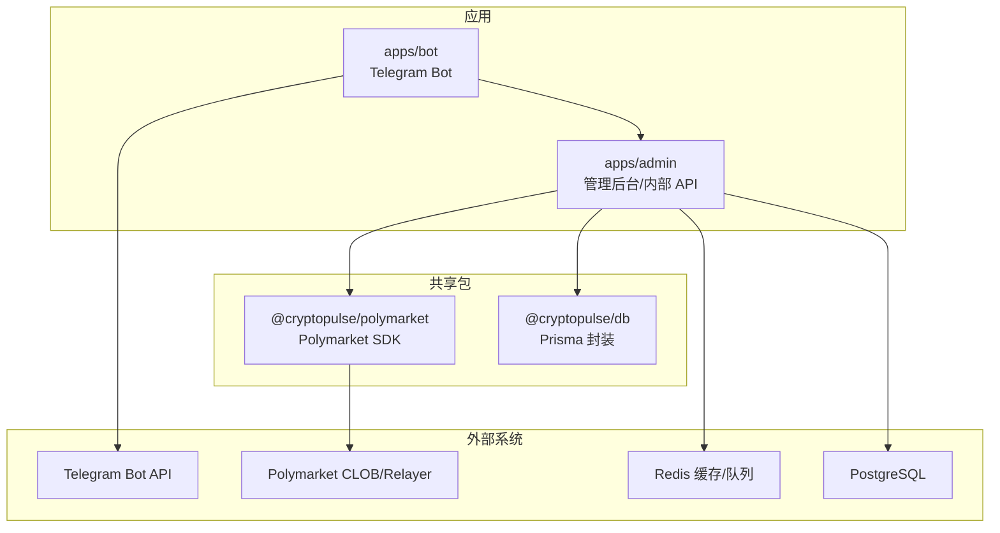
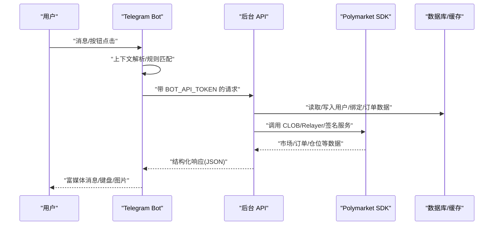
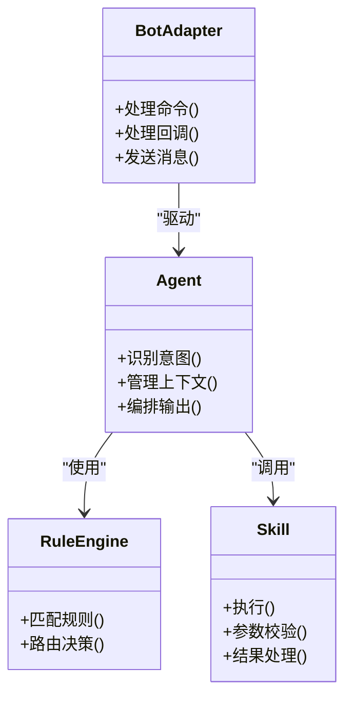
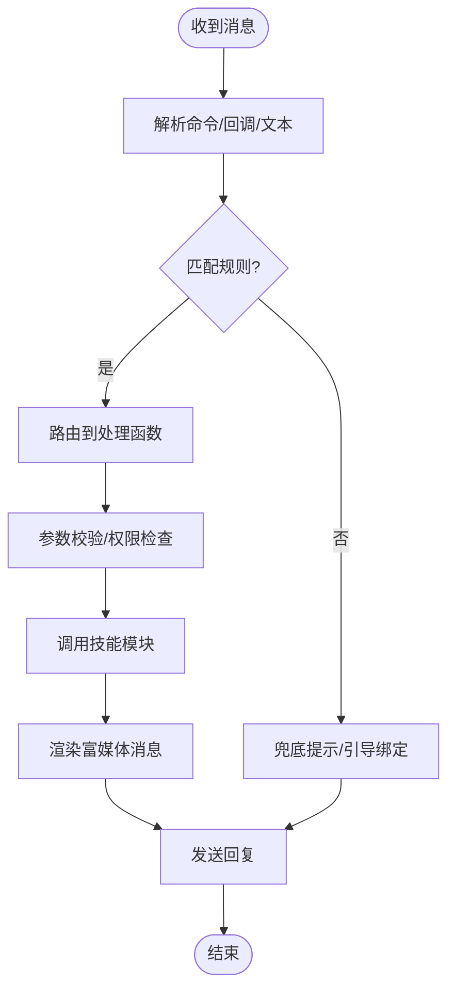
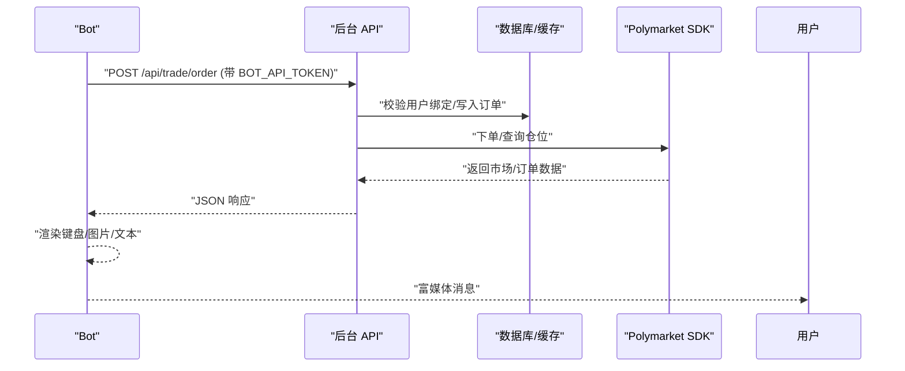
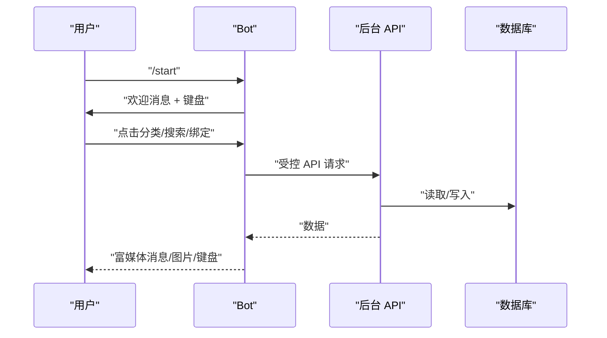
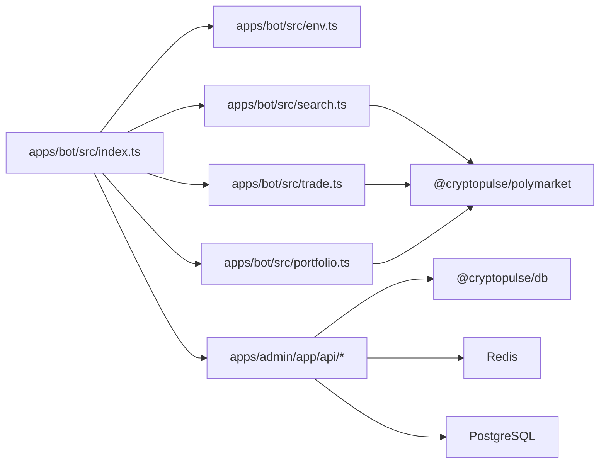

# AI 助手集成

<cite>
**本文档引用的文件**
- [README.md](file://README.md)
- [apps/bot/src/index.ts](file://apps/bot/src/index.ts)
- [apps/bot/src/env.ts](file://apps/bot/src/env.ts)
- [apps/bot/src/bind.ts](file://apps/bot/src/bind.ts)
- [apps/bot/src/search.ts](file://apps/bot/src/search.ts)
- [apps/bot/src/trade.ts](file://apps/bot/src/trade.ts)
- [apps/bot/src/portfolio.ts](file://apps/bot/src/portfolio.ts)
- [apps/admin/app/api/bot/bind-code/route.ts](file://apps/admin/app/api/bot/bind-code/route.ts)
- [apps/admin/app/api/trade/order/route.ts](file://apps/admin/app/api/trade/order/route.ts)
- [specs/cryptopulse/design.md](file://specs/cryptopulse/design.md)
- [specs/cryptopulse/requirements.md](file://specs/cryptopulse/requirements.md)
- [specs/cryptopulse/tasks.md](file://specs/cryptopulse/tasks.md)
</cite>

## 目录
1. [简介](#简介)
2. [项目结构](#项目结构)
3. [核心组件](#核心组件)
4. [架构总览](#架构总览)
5. [组件详解](#组件详解)
6. [依赖关系分析](#依赖关系分析)
7. [性能考量](#性能考量)
8. [故障排查指南](#故障排查指南)
9. [结论](#结论)
10. [附录](#附录)

## 简介
本指南围绕 CryptoPulse 项目的 AI 助手集成，系统阐述智能代理(Agents)、规则引擎(Rules)与技能模块(Skills)的设计与实现思路，并结合现有 Telegram Bot 与后台 API 的交互模式，给出可落地的开发与集成方案。同时涵盖训练数据准备、模型选择与性能优化建议，以及监控、调试与故障排除方法，帮助团队在现有架构基础上快速扩展 AI 助手能力。

## 项目结构
项目采用单仓多应用的组织方式，核心与 AI 助手相关的模块分布如下：
- apps/bot：Telegram Bot 应用，负责消息处理、上下文管理与会话控制
- apps/admin：管理后台与内部 API，提供 Bot 专用的鉴权与业务接口
- packages：共享包与 Polymarket SDK 封装，支撑交易与数据访问
- specs/cryptopulse：技术方案、需求与实施计划文档，明确 AI 助手定位与扩展路径

**图示来源**
- [apps/bot/src/index.ts](file://apps/bot/src/index.ts#L1-L156)
- [apps/admin/app/api/bot/bind-code/route.ts](file://apps/admin/app/api/bot/bind-code/route.ts#L1-L105)
- [apps/admin/app/api/trade/order/route.ts](file://apps/admin/app/api/trade/order/route.ts#L1-L94)
- [specs/cryptopulse/design.md](file://specs/cryptopulse/design.md#L24-L47)

**章节来源**
- [README.md](file://README.md#L1-L65)
- [specs/cryptopulse/design.md](file://specs/cryptopulse/design.md#L24-L47)

## 核心组件
- 智能代理(Agents)：在 Bot 中以“会话上下文 + 技能编排”的形式存在，负责根据用户意图识别、上下文记忆与结果输出。
- 规则引擎(Rules)：用于对用户输入进行意图识别、上下文过滤与路由决策，决定调用哪个技能或返回兜底提示。
- 技能模块(Skills)：具体的能力实现单元，如市场搜索、事件详情、下单确认、仓位查询等，未来可扩展为 AI 摘要/解读能力。
- 会话与上下文：Bot 侧维护用户会话状态，结合后台 API 提供的数据与鉴权，保障一致性与安全性。

**章节来源**
- [specs/cryptopulse/requirements.md](file://specs/cryptopulse/requirements.md#L101-L109)
- [specs/cryptopulse/design.md](file://specs/cryptopulse/design.md#L100-L111)

## 架构总览
AI 助手集成遵循现有 Bot 与后台 API 的交互范式，Bot 作为入口，通过受控的 Bearer Token 调用后台 API，后台 API 再对接 Polymarket SDK、数据库与缓存系统，形成“消息处理 → 意图识别 → 技能执行 → 结果回传”的闭环。

**图示来源**
- [apps/bot/src/index.ts](file://apps/bot/src/index.ts#L1-L156)
- [apps/bot/src/search.ts](file://apps/bot/src/search.ts#L1-L233)
- [apps/bot/src/trade.ts](file://apps/bot/src/trade.ts#L1-L118)
- [apps/bot/src/portfolio.ts](file://apps/bot/src/portfolio.ts#L1-L76)
- [apps/admin/app/api/bot/bind-code/route.ts](file://apps/admin/app/api/bot/bind-code/route.ts#L1-L105)
- [apps/admin/app/api/trade/order/route.ts](file://apps/admin/app/api/trade/order/route.ts#L1-L94)

## 组件详解

### 智能代理(Agents)设计与实现
- 代理职责
  - 意图识别：将用户自然语言映射为结构化动作（搜索、查看详情、下单、查仓等）
  - 上下文管理：在一次会话中保持用户状态（当前市场、页码、语言偏好等）
  - 结果编排：将多源数据整合为富媒体消息，包含文本、图片、内联键盘
- 实现要点
  - 基于现有 Bot 路由与回调查询，扩展“意图 + 参数 + 技能”三段式处理
  - 通过环境变量与后台 API 控制权限，避免直接暴露敏感凭据
  - 与 Polymarket SDK 集成，统一处理市场、订单与仓位数据
- 可插拔扩展
  - 为 AI 助手预留“意图 → AI 技能 → 结果”的插槽，逐步替换为 LLM 驱动的摘要/解读

**图示来源**
- [apps/bot/src/index.ts](file://apps/bot/src/index.ts#L1-L156)
- [specs/cryptopulse/design.md](file://specs/cryptopulse/design.md#L100-L111)

**章节来源**
- [apps/bot/src/index.ts](file://apps/bot/src/index.ts#L1-L156)
- [specs/cryptopulse/design.md](file://specs/cryptopulse/design.md#L100-L111)

### 规则引擎(Rules)工作原理
- 规则定义
  - 基于正则表达式与关键词匹配，识别命令、按钮动作与自然语言片段
  - 通过“前缀 + 参数 + 页码”等约定，统一路由到具体处理函数
- 匹配算法
  - 优先级：命令 > 回调查询 > 文本消息
  - 分页与翻页：通过回调查询中的页码参数控制
- 执行流程
  - 解析 → 校验 → 调用技能 → 错误捕获 → 回传结果

**图示来源**
- [apps/bot/src/index.ts](file://apps/bot/src/index.ts#L45-L156)
- [apps/bot/src/search.ts](file://apps/bot/src/search.ts#L27-L62)
- [apps/bot/src/trade.ts](file://apps/bot/src/trade.ts#L7-L66)

**章节来源**
- [apps/bot/src/index.ts](file://apps/bot/src/index.ts#L45-L156)
- [apps/bot/src/search.ts](file://apps/bot/src/search.ts#L27-L111)

### 技能模块(Skills)开发方法
- 技能接口
  - 统一签名：接收上下文(Context)、必要参数与页码
  - 统一返回：富媒体文本、图片、内联键盘与分页控制
- 参数传递
  - 命令参数：/command arg
  - 回调参数：callback_query 的分段参数
  - 查询参数：REST API 的查询字符串
- 结果处理
  - 成功：编辑消息或发送新消息
  - 失败：捕获错误并返回友好提示
- 与后台 API 的协作
  - 通过 BOT_API_TOKEN 访问受控接口，避免泄露敏感凭据
  - 对数据库/缓存的读写通过后台 API 完成，Bot 仅负责 UI 与路由

**图示来源**
- [apps/bot/src/trade.ts](file://apps/bot/src/trade.ts#L68-L118)
- [apps/admin/app/api/trade/order/route.ts](file://apps/admin/app/api/trade/order/route.ts#L16-L94)

**章节来源**
- [apps/bot/src/search.ts](file://apps/bot/src/search.ts#L158-L233)
- [apps/bot/src/trade.ts](file://apps/bot/src/trade.ts#L68-L118)
- [apps/bot/src/portfolio.ts](file://apps/bot/src/portfolio.ts#L4-L76)

### AI 助手与 Telegram 机器人集成
- 消息处理
  - 命令：/start、/search、/portfolio、/bind
  - 文本：直接搜索关键词
  - 回调：分类浏览、分页、下单确认、查看仓位
- 上下文管理
  - 通过回调查询参数携带页码与市场标识，Bot 在内存中维护会话状态
  - 对于需要持久化的状态，建议通过后台 API 的会话表或 Redis 键空间管理
- 会话控制
  - 使用内联键盘与回调查询，减少消息冗余
  - 对长列表进行分页，提升用户体验

**图示来源**
- [apps/bot/src/index.ts](file://apps/bot/src/index.ts#L11-L156)
- [apps/bot/src/search.ts](file://apps/bot/src/search.ts#L64-L156)
- [apps/bot/src/bind.ts](file://apps/bot/src/bind.ts#L3-L30)

**章节来源**
- [apps/bot/src/index.ts](file://apps/bot/src/index.ts#L11-L156)
- [apps/bot/src/search.ts](file://apps/bot/src/search.ts#L64-L156)

### 训练数据准备、模型选择与性能优化
- 训练数据准备
  - 基于 Bot 历史消息与用户行为构建对话样本，标注意图与槽位
  - 使用 Polymarket 市场描述、事件标题与价格序列作为上下文增强
- 模型选择
  - 初期：模板化摘要 + 规则引擎，保证稳定性与可控性
  - 后期：可选用轻量 LLM（如适配本地推理的模型）或云端 API，结合检索增强生成
- 性能优化
  - 缓存：对热门市场与搜索结果进行 Redis 缓存
  - 分页：限制每页条数，使用回调查询翻页
  - 限流：对 Bot 用户操作进行节流，避免上游限流

**章节来源**
- [specs/cryptopulse/design.md](file://specs/cryptopulse/design.md#L94-L111)
- [specs/cryptopulse/requirements.md](file://specs/cryptopulse/requirements.md#L119-L131)

### 监控、调试与故障排除
- 监控
  - 结构化日志：Bot 与后台 API 均记录错误与关键事件
  - 错误上报：可选 Sentry 或结构化日志管道
- 调试
  - Bot 级别：开启详细日志，观察回调查询与 API 响应
  - 后台 API：检查鉴权头、数据库连接与 Polymarket SDK 调用
- 故障排除
  - 未授权：核对 BOT_API_TOKEN 是否正确配置与传递
  - 绑定问题：确认 bind_code 是否有效、用户是否绑定地址
  - 交易失败：检查 TRADE_MODE、数据库可用性与 Polymarket SDK 返回

**章节来源**
- [apps/bot/src/index.ts](file://apps/bot/src/index.ts#L150-L156)
- [apps/admin/app/api/bot/bind-code/route.ts](file://apps/admin/app/api/bot/bind-code/route.ts#L34-L103)
- [apps/admin/app/api/trade/order/route.ts](file://apps/admin/app/api/trade/order/route.ts#L16-L94)

## 依赖关系分析
- Bot 依赖
  - grammY：消息处理与内联键盘
  - @cryptopulse/polymarket：市场与交易数据访问
  - 环境变量：TELEGRAM_BOT_TOKEN、API_BASE_URL、WEB_BASE_URL、BOT_API_TOKEN
- 后台 API 依赖
  - Prisma：用户、绑定码、订单等数据模型
  - Polymarket SDK：CLOB/Relayer/签名服务
  - Redis：缓存与队列
  - PostgreSQL：持久化

**图示来源**
- [apps/bot/src/index.ts](file://apps/bot/src/index.ts#L1-L9)
- [apps/bot/src/env.ts](file://apps/bot/src/env.ts#L1-L14)
- [apps/bot/src/search.ts](file://apps/bot/src/search.ts#L1-L6)
- [apps/bot/src/trade.ts](file://apps/bot/src/trade.ts#L1-L6)
- [apps/bot/src/portfolio.ts](file://apps/bot/src/portfolio.ts#L1-L3)
- [apps/admin/app/api/bot/bind-code/route.ts](file://apps/admin/app/api/bot/bind-code/route.ts#L1-L105)
- [apps/admin/app/api/trade/order/route.ts](file://apps/admin/app/api/trade/order/route.ts#L1-L94)

**章节来源**
- [apps/bot/src/env.ts](file://apps/bot/src/env.ts#L1-L14)
- [specs/cryptopulse/design.md](file://specs/cryptopulse/design.md#L9-L23)

## 性能考量
- 响应时间
  - 搜索与分类：首屏控制在 1 秒内，通过 Redis 缓存与限流实现
  - 下单确认：用户侧反馈在 3 秒内，异步成交回执
- 资源使用
  - 对上游接口进行退避重试，避免雪崩
  - 对 Bot 用户操作进行节流，防止滥用
- 可观测性
  - 结构化日志与错误上报，便于定位瓶颈

**章节来源**
- [specs/cryptopulse/requirements.md](file://specs/cryptopulse/requirements.md#L125-L129)

## 故障排查指南
- 常见问题
  - 生成绑定链接失败：检查 BOT_API_TOKEN 与 API_BASE_URL 配置
  - 未授权访问：确认 Bearer Token 与环境变量一致
  - 交易失败：检查数据库可用性、用户绑定状态与 TRADE_MODE
- 排查步骤
  - 查看 Bot 与后台 API 日志
  - 核对环境变量与数据库连接
  - 验证 Polymarket SDK 与 Relayer 可用性

**章节来源**
- [apps/bot/src/bind.ts](file://apps/bot/src/bind.ts#L58-L89)
- [apps/bot/src/trade.ts](file://apps/bot/src/trade.ts#L75-L116)
- [apps/admin/app/api/bot/bind-code/route.ts](file://apps/admin/app/api/bot/bind-code/route.ts#L34-L103)
- [apps/admin/app/api/trade/order/route.ts](file://apps/admin/app/api/trade/order/route.ts#L16-L94)

## 结论
通过在现有 Bot 与后台 API 基础上引入智能代理、规则引擎与技能模块，CryptoPulse 可以平滑扩展 AI 助手能力。初期以模板化摘要与规则驱动为主，后期逐步引入 LLM 与检索增强，配合完善的监控与限流机制，既能保证稳定性，又能持续提升用户体验。

## 附录
- 开发示例与最佳实践
  - 意图识别：优先使用回调查询参数承载状态，减少消息往返
  - 技能开发：统一参数校验与错误处理，确保一致的用户反馈
  - 安全性：所有敏感凭据仅在服务端持有，Bot 仅通过受控 API 交互
  - 可扩展性：为 AI 技能预留插槽，逐步替换为 LLM 驱动的摘要/解读

**章节来源**
- [specs/cryptopulse/tasks.md](file://specs/cryptopulse/tasks.md#L53-L56)
- [specs/cryptopulse/design.md](file://specs/cryptopulse/design.md#L146-L153)