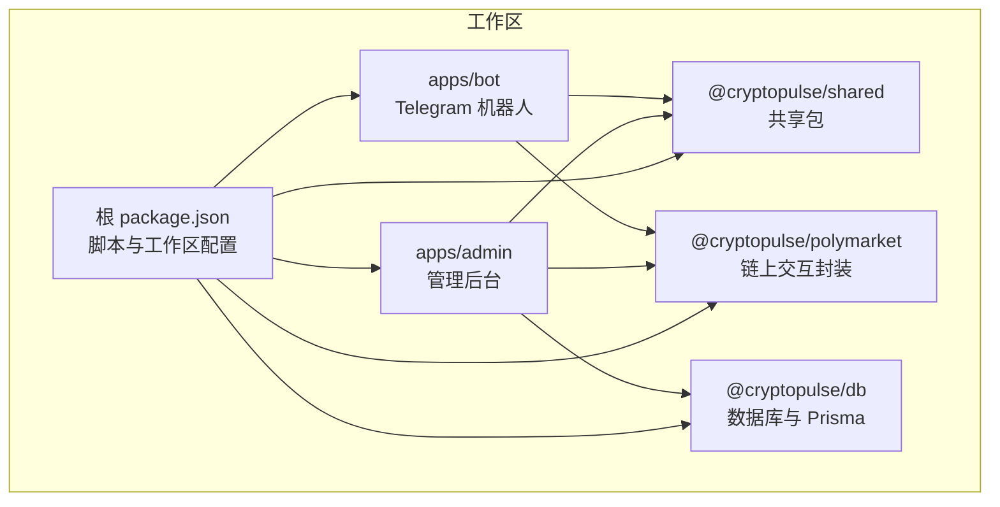
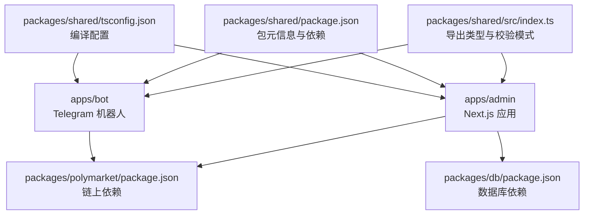
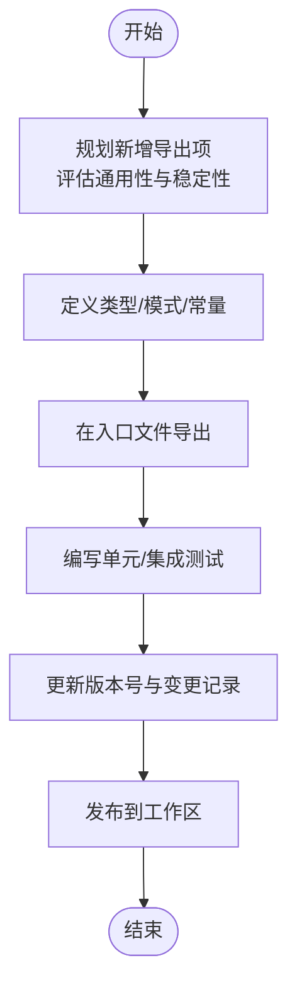
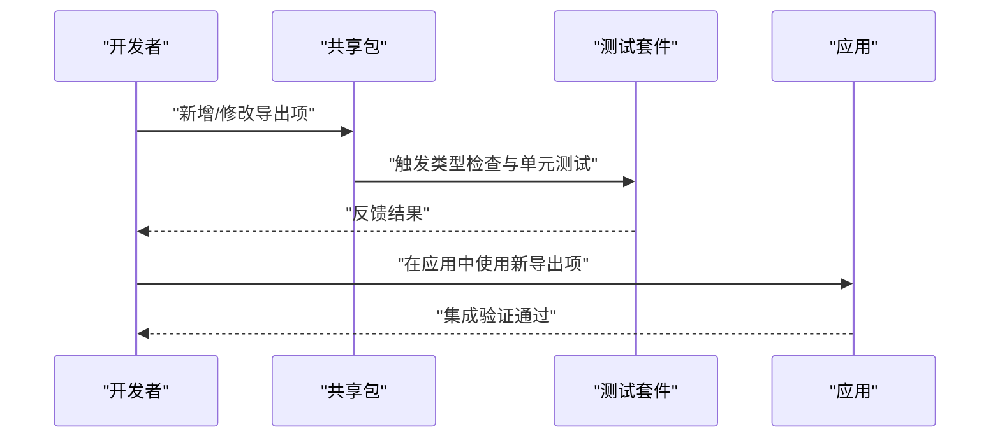
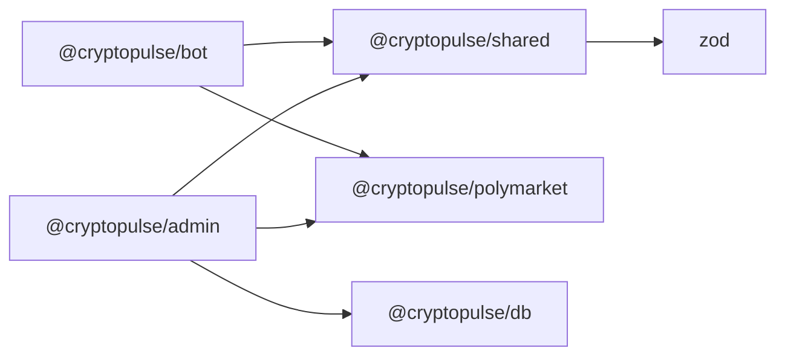

# 共享包扩展

<cite>
**本文引用的文件**
- [README.md](file://README.md)
- [package.json](file://package.json)
- [.github/workflows/ci.yml](file://.github/.workflows/ci.yml)
- [packages/shared/package.json](file://packages/shared/package.json)
- [packages/shared/tsconfig.json](file://packages/shared/tsconfig.json)
- [packages/shared/src/index.ts](file://packages/shared/src/index.ts)
- [packages/polymarket/package.json](file://packages/polymarket/package.json)
- [packages/polymarket/tsconfig.json](file://packages/polymarket/tsconfig.json)
- [packages/db/package.json](file://packages/db/package.json)
- [packages/db/tsconfig.json](file://packages/db/tsconfig.json)
- [tsconfig.base.json](file://tsconfig.base.json)
- [test/bind-code.test.ts](file://test/bind-code.test.ts)
- [test/bot-bind.test.ts](file://test/bot-bind.test.ts)
</cite>

## 目录
1. [简介](#简介)
2. [项目结构](#项目结构)
3. [核心组件](#核心组件)
4. [架构总览](#架构总览)
5. [详细组件分析](#详细组件分析)
6. [依赖分析](#依赖分析)
7. [性能考虑](#性能考虑)
8. [故障排查指南](#故障排查指南)
9. [结论](#结论)
10. [附录](#附录)

## 简介
本开发指南面向 CryptoPulse 项目的共享包扩展，目标是帮助开发者系统地设计、实现与维护共享能力。共享包承担跨应用复用的职责，包括但不限于：
- 类型定义与校验模型（如 Zod Schema）
- 工具函数与通用常量
- 跨应用通用组件与服务的抽象

通过本指南，你将了解共享包的设计理念、模块化组织方式、版本与发布策略、依赖管理原则、扩展与演进规范、性能与资源控制建议，以及在不同应用中的共享机制与使用方法。

## 项目结构
项目采用多包工作区（monorepo）布局，核心包包括：
- packages/shared：共享包，提供类型、校验与通用工具
- packages/polymarket：链上交互相关封装
- packages/db：数据库与 Prisma 客户端
- apps/admin：管理后台 Next.js 应用
- apps/bot：Telegram 机器人应用

工作区脚本统一由根 package.json 管理，支持跨包开发与测试。

**图表来源**
- [package.json](file://package.json#L1-L18)
- [packages/shared/package.json](file://packages/shared/package.json#L1-L19)
- [packages/polymarket/package.json](file://packages/polymarket/package.json#L1-L23)
- [packages/db/package.json](file://packages/db/package.json#L1-L22)

**章节来源**
- [README.md](file://README.md#L1-L65)
- [package.json](file://package.json#L1-L18)

## 核心组件
共享包目前提供基础类型与校验模型，作为跨应用的公共契约与数据约束层：
- TelegramIdSchema：用于校验 Telegram 用户 ID 的 Zod 模式
- Language：语言枚举类型
- LanguageSchema：语言取值的 Zod 校验模式

这些导出项构成了共享包的“公共 API”，供 apps/admin 与 apps/bot 等应用复用。

**章节来源**
- [packages/shared/src/index.ts](file://packages/shared/src/index.ts#L1-L9)

## 架构总览
共享包在整体架构中扮演“公共契约层”的角色，向上游应用提供稳定的类型与校验能力，向下不直接依赖具体业务实现，从而确保跨应用的一致性与可替换性。

**图表来源**
- [packages/shared/src/index.ts](file://packages/shared/src/index.ts#L1-L9)
- [packages/shared/package.json](file://packages/shared/package.json#L1-L19)
- [packages/shared/tsconfig.json](file://packages/shared/tsconfig.json#L1-L10)
- [packages/polymarket/package.json](file://packages/polymarket/package.json#L1-L23)
- [packages/db/package.json](file://packages/db/package.json#L1-L22)

## 详细组件分析

### 共享包模块与导出
共享包通过单一入口导出类型与校验模式，便于集中管理与演进。新增或修改导出项时，应遵循以下原则：
- 新增导出前先评估是否属于“跨应用通用”
- 对外导出保持稳定，避免频繁破坏性变更
- 为导出项提供清晰的命名与语义说明

**章节来源**
- [packages/shared/src/index.ts](file://packages/shared/src/index.ts#L1-L9)
- [packages/shared/package.json](file://packages/shared/package.json#L1-L19)

### 版本管理与发布策略
- 版本号：当前共享包版本为 0.0.1，处于内部私有发布状态
- 发布策略：由于 private: true，发布通常仅限于内部工作区使用；若需要对外发布，需调整为公开包并建立正式的发布流程
- 变更记录：建议每次变更在变更日志中记录影响范围与迁移指引
- 语义化版本：建议在稳定后采用语义化版本，以明确破坏性变更、功能新增与修复

**章节来源**
- [packages/shared/package.json](file://packages/shared/package.json#L1-L19)

### 依赖管理策略
- 运行时依赖：共享包目前依赖 zod，用于类型与运行时校验
- 开发依赖：TypeScript 用于类型检查与编译配置
- 建议：尽量保持共享包的依赖最小化，避免引入与业务强耦合的第三方库

**章节来源**
- [packages/shared/package.json](file://packages/shared/package.json#L11-L16)

### 扩展共享功能的实践
- 新增工具函数：优先考虑纯函数、无副作用、可测试性强
- 改进现有功能：在不破坏现有导出的前提下进行重构与优化
- 向后兼容：对破坏性变更提供迁移路径与过渡期策略

[本图为概念流程图，无需图表来源]

### 在不同应用中的共享机制与使用方法
- apps/admin 与 apps/bot 通过工作区脚本与包名导入共享包
- 共享包的入口文件统一导出类型与校验模式，应用按需引入
- 建议在应用内对共享导出进行二次封装，以适配具体业务场景

**章节来源**
- [package.json](file://package.json#L8-L15)
- [packages/shared/src/index.ts](file://packages/shared/src/index.ts#L1-L9)

### 开发规范
- 代码风格：遵循 TypeScript 严格模式与工作区统一的编译配置
- 文档标准：为每个导出项提供简要说明，必要时补充使用示例
- 测试要求：新增导出项需配套单元测试；涉及校验逻辑的变更需覆盖边界条件

**章节来源**
- [tsconfig.base.json](file://tsconfig.base.json#L1-L16)
- [packages/shared/tsconfig.json](file://packages/shared/tsconfig.json#L1-L10)
- [test/bind-code.test.ts](file://test/bind-code.test.ts#L1-L88)
- [test/bot-bind.test.ts](file://test/bot-bind.test.ts#L1-L48)

### 性能优化、内存管理与资源控制
- 导入与打包：共享包应避免引入重型依赖，减少应用打包体积
- 校验性能：Zod 校验在高频路径上应谨慎使用，必要时缓存校验结果或延迟校验
- 内存管理：避免在共享包中持有全局状态或长生命周期对象
- 资源控制：对外部 API 的调用应设置超时与重试策略（如适用）

[本节为通用指导，无需章节来源]

## 依赖分析
共享包的依赖关系简单清晰，主要依赖 zod 用于运行时校验；应用侧依赖由各自包管理文件定义。

**图表来源**
- [packages/shared/package.json](file://packages/shared/package.json#L11-L12)
- [packages/polymarket/package.json](file://packages/polymarket/package.json#L11-L16)
- [packages/db/package.json](file://packages/db/package.json#L13-L14)

**章节来源**
- [packages/shared/package.json](file://packages/shared/package.json#L1-L19)
- [packages/polymarket/package.json](file://packages/polymarket/package.json#L1-L23)
- [packages/db/package.json](file://packages/db/package.json#L1-L22)

## 性能考虑
- 将共享包定位为“轻量化公共层”，避免引入重型依赖
- 对高频使用的校验逻辑进行性能评估，必要时采用更高效的替代方案
- 在应用侧对共享导出进行按需引入，避免不必要的打包与加载

[本节为通用指导，无需章节来源]

## 故障排查指南
- 类型检查失败：确认共享包与应用的 TypeScript 配置一致，尤其是 moduleResolution 与 module 设置
- 校验失败：检查输入数据是否符合共享包导出的 Zod 模式
- 测试失败：参考现有测试用例的断言与环境准备，确保测试环境变量与数据库配置正确

**章节来源**
- [packages/shared/tsconfig.json](file://packages/shared/tsconfig.json#L1-L10)
- [tsconfig.base.json](file://tsconfig.base.json#L1-L16)
- [test/bind-code.test.ts](file://test/bind-code.test.ts#L1-L88)
- [test/bot-bind.test.ts](file://test/bot-bind.test.ts#L1-L48)

## 结论
共享包是 CryptoPulse 项目跨应用复用能力的关键基石。通过严格的导出管理、最小依赖策略与完善的测试体系，可以确保其在不同应用间稳定共享。建议在扩展新功能时遵循本文规范，持续提升共享包的稳定性与可维护性。

## 附录

### CI/CD 与测试运行
- CI 工作流在 Ubuntu 环境下启动 Postgres 服务，设置 DATABASE_URL 并执行类型检查、Lint 与测试
- 建议在本地与 CI 中保持一致的环境变量与数据库配置

**章节来源**
- [.github/workflows/ci.yml](file://.github/.workflows/ci.yml#L1-L46)