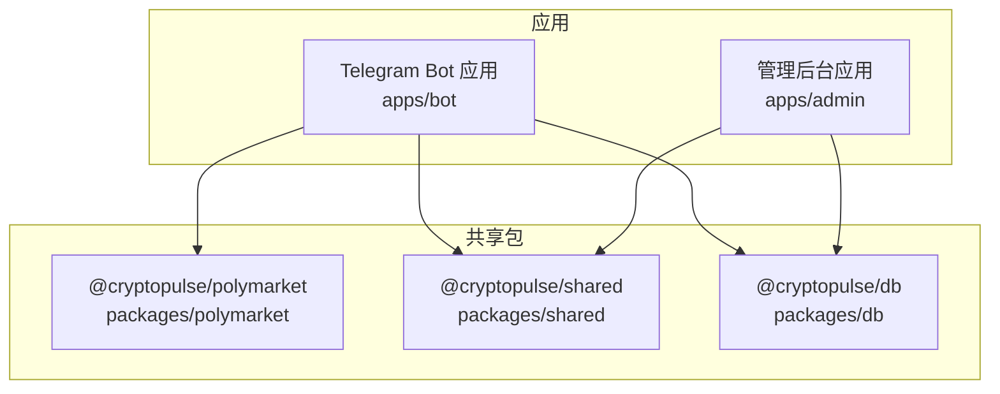
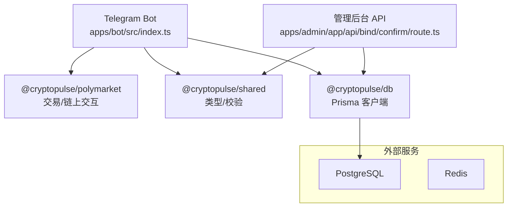
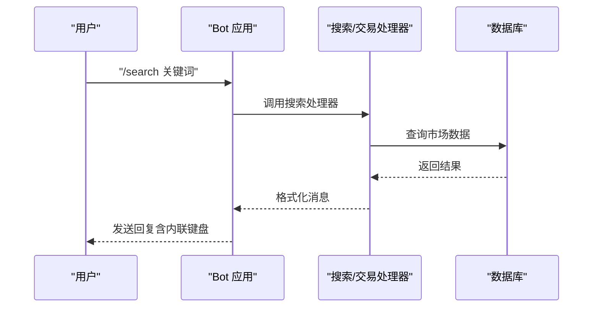
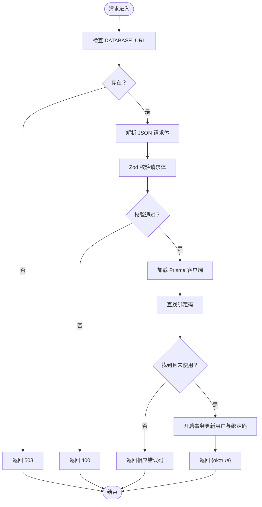
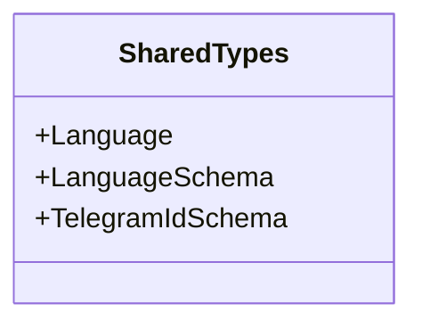
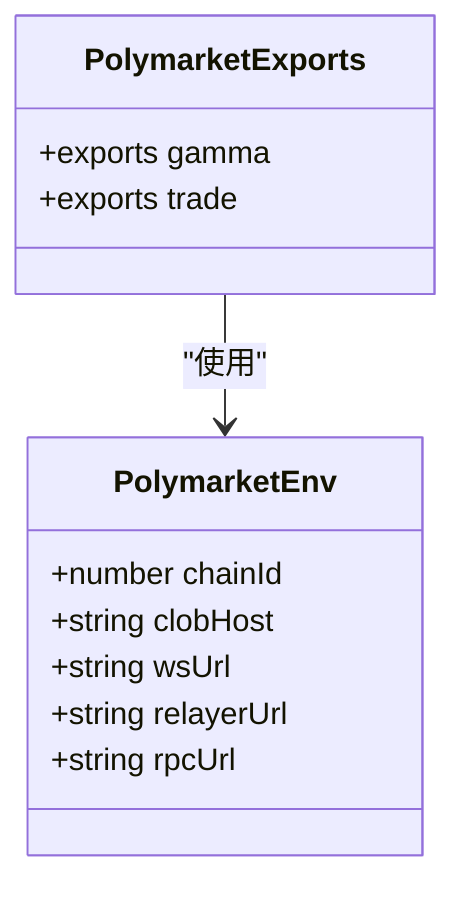
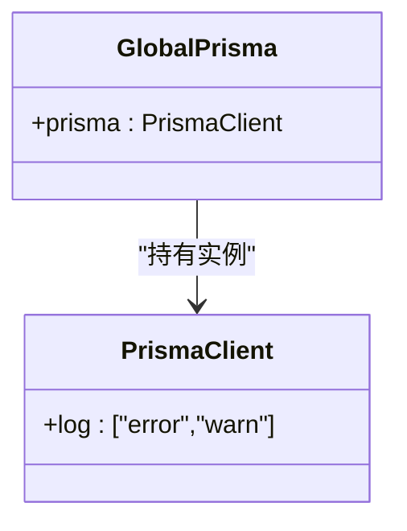
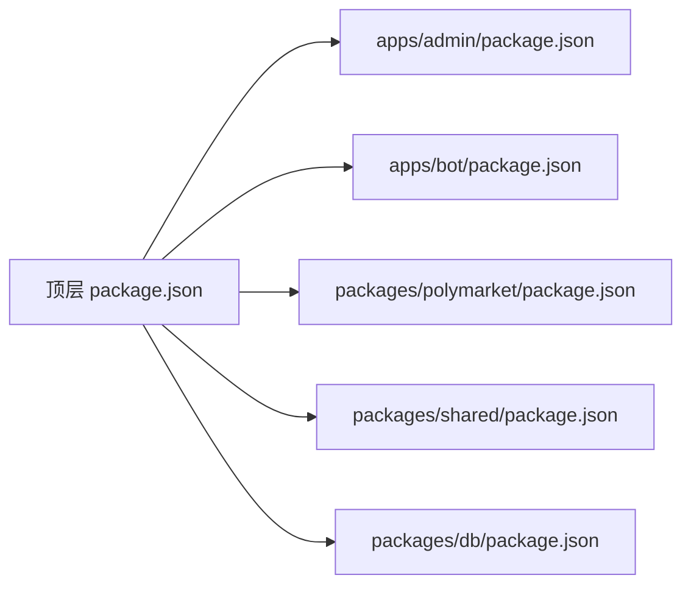

# 扩展开发

<cite>
**本文引用的文件**
- [README.md](file://README.md)
- [package.json](file://package.json)
- [.qoder 目录](file://.qoder)
- [packages/polymarket/src/index.ts](file://packages/polymarket/src/index.ts)
- [packages/shared/src/index.ts](file://packages/shared/src/index.ts)
- [packages/db/src/index.ts](file://packages/db/src/index.ts)
- [apps/admin/app/api/bind/confirm/route.ts](file://apps/admin/app/api/bind/confirm/route.ts)
- [apps/bot/src/index.ts](file://apps/bot/src/index.ts)
- [apps/admin/lib/utils.ts](file://apps/admin/lib/utils.ts)
</cite>

## 目录
1. [简介](#简介)
2. [项目结构](#项目结构)
3. [核心组件](#核心组件)
4. [架构总览](#架构总览)
5. [详细组件分析](#详细组件分析)
6. [依赖分析](#依赖分析)
7. [性能考虑](#性能考虑)
8. [故障排查指南](#故障排查指南)
9. [结论](#结论)
10. [附录](#附录)

## 简介
本指南面向希望为 CryptoPulse 项目进行扩展开发的贡献者，聚焦于插件系统架构与扩展点、AI 助手集成、多语言支持与通知渠道扩展、自定义功能开发方法、共享包的使用与扩展、最佳实践、配置系统扩展、测试与部署策略，以及社区贡献与开源协作规范。文档基于仓库现有代码与目录结构进行分析，并提供可操作的扩展路径与图示。

## 项目结构
项目采用多工作区（workspaces）组织，包含两个应用与三个共享包：
- 应用层
  - 管理后台应用（Next.js）
  - Telegram Bot 应用（grammy）
- 共享包层
  - @cryptopulse/polymarket：链上交互与交易相关能力
  - @cryptopulse/shared：跨应用共享的类型与校验（如语言、Telegram ID）
  - @cryptopulse/db：数据库客户端与连接管理

图表来源
- [package.json](file://package.json#L1-L18)
- [packages/polymarket/src/index.ts](file://packages/polymarket/src/index.ts#L1-L11)
- [packages/shared/src/index.ts](file://packages/shared/src/index.ts#L1-L9)
- [packages/db/src/index.ts](file://packages/db/src/index.ts#L1-L13)

章节来源
- [README.md](file://README.md#L1-L65)
- [package.json](file://package.json#L1-L18)

## 核心组件
- 插件与扩展点
  - 基于工作区的模块化设计，通过独立包实现功能解耦，便于新增插件模块而不影响主应用。
  - 管理后台与 Bot 应用分别通过各自路由与命令入口接入共享能力。
- 配置系统
  - Bot 应用通过环境变量驱动，管理后台通过 Next.js 配置与中间件控制访问。
  - 数据库通过 Prisma 客户端统一管理，支持迁移与生成。
- 多语言与通知
  - 共享包提供语言枚举与校验，Bot 可读取用户语言码用于本地化。
  - Bot 提供通知与交互（InlineKeyboard），可扩展为多种通知渠道。

章节来源
- [apps/bot/src/index.ts](file://apps/bot/src/index.ts#L1-L156)
- [apps/admin/app/api/bind/confirm/route.ts](file://apps/admin/app/api/bind/confirm/route.ts#L1-L91)
- [packages/shared/src/index.ts](file://packages/shared/src/index.ts#L1-L9)
- [packages/db/src/index.ts](file://packages/db/src/index.ts#L1-L13)

## 架构总览
下图展示了应用与共享包之间的依赖关系，以及 Bot 与管理后台的关键交互点。

图表来源
- [apps/bot/src/index.ts](file://apps/bot/src/index.ts#L1-L156)
- [apps/admin/app/api/bind/confirm/route.ts](file://apps/admin/app/api/bind/confirm/route.ts#L1-L91)
- [packages/polymarket/src/index.ts](file://packages/polymarket/src/index.ts#L1-L11)
- [packages/shared/src/index.ts](file://packages/shared/src/index.ts#L1-L9)
- [packages/db/src/index.ts](file://packages/db/src/index.ts#L1-L13)

## 详细组件分析

### Bot 应用：命令与回调处理
Bot 应用以命令与回调查询为核心扩展点，支持绑定、搜索、交易、持仓等场景。扩展方式：
- 新增命令：在命令注册处添加新的命令处理器。
- 新增回调：在回调查询注册处添加新的模式匹配与处理逻辑。
- 新增消息处理：在文本消息监听器中扩展新的意图识别与处理。

图表来源
- [apps/bot/src/index.ts](file://apps/bot/src/index.ts#L45-L101)
- [apps/admin/app/api/bind/confirm/route.ts](file://apps/admin/app/api/bind/confirm/route.ts#L48-L83)

章节来源
- [apps/bot/src/index.ts](file://apps/bot/src/index.ts#L1-L156)

### 管理后台 API：绑定确认流程
管理后台提供绑定码确认接口，包含请求体校验、过期与重复检查、事务写入与错误处理。该流程是扩展绑定相关功能（如多地址、安全地址、资金地址）的理想入口。

图表来源
- [apps/admin/app/api/bind/confirm/route.ts](file://apps/admin/app/api/bind/confirm/route.ts#L21-L89)

章节来源
- [apps/admin/app/api/bind/confirm/route.ts](file://apps/admin/app/api/bind/confirm/route.ts#L1-L91)

### 共享包：类型与校验
共享包提供语言枚举与校验、Telegram ID 校验等基础能力，便于在多个应用间复用。

图表来源
- [packages/shared/src/index.ts](file://packages/shared/src/index.ts#L1-L9)

章节来源
- [packages/shared/src/index.ts](file://packages/shared/src/index.ts#L1-L9)

### 链上交互与交易：Polymarket 包
Polymarket 包导出交易与 Gamma 相关能力，并暴露环境配置类型，便于在 Bot 中注入链上参数。

图表来源
- [packages/polymarket/src/index.ts](file://packages/polymarket/src/index.ts#L1-L11)

章节来源
- [packages/polymarket/src/index.ts](file://packages/polymarket/src/index.ts#L1-L11)

### 数据库客户端：Prisma
数据库客户端通过全局缓存避免重复实例化，提供统一的错误与警告日志级别。

图表来源
- [packages/db/src/index.ts](file://packages/db/src/index.ts#L1-L13)

章节来源
- [packages/db/src/index.ts](file://packages/db/src/index.ts#L1-L13)

## 依赖分析
- 工作区与脚本
  - 顶层 package.json 定义了工作区与常用脚本，便于统一开发与测试。
- 包依赖
  - Bot 应用依赖共享包与 Polymarket 包，实现链上交互与本地化。
  - 管理后台依赖共享包与数据库包，实现绑定确认与数据持久化。

图表来源
- [package.json](file://package.json#L1-L18)

章节来源
- [package.json](file://package.json#L1-L18)

## 性能考虑
- 模块化与懒加载
  - 将大型功能拆分为独立包，按需引入，减少主应用启动时间。
- 缓存与连接池
  - 数据库客户端采用全局缓存，避免重复初始化；合理配置连接池与超时。
- 并发与事务
  - 对高并发写入场景使用事务包裹，确保一致性与原子性。
- 本地化与渲染
  - 管理后台使用 Tailwind CSS 工具类合并，减少样式体积与计算。

章节来源
- [packages/db/src/index.ts](file://packages/db/src/index.ts#L1-L13)
- [apps/admin/lib/utils.ts](file://apps/admin/lib/utils.ts#L1-L8)

## 故障排查指南
- Bot 运行异常
  - 检查环境变量是否正确设置，查看错误捕获日志定位问题。
- 绑定流程失败
  - 确认 DATABASE_URL 是否可用，检查请求体格式与必填字段，关注过期与重复绑定码状态。
- 数据库问题
  - 确认 Prisma 引擎镜像与网络可达性，必要时使用镜像源加速下载。

章节来源
- [apps/bot/src/index.ts](file://apps/bot/src/index.ts#L150-L152)
- [apps/admin/app/api/bind/confirm/route.ts](file://apps/admin/app/api/bind/confirm/route.ts#L22-L31)
- [README.md](file://README.md#L13-L18)

## 结论
CryptoPulse 项目通过工作区与共享包实现了清晰的模块化架构，Bot 与管理后台分别承担交互与管理职责。围绕共享包、链上交互与数据库客户端，开发者可以安全地扩展 AI 助手、多语言支持与通知渠道。建议遵循接口稳定、版本兼容与测试先行的原则，确保扩展的可维护性与可演进性。

## 附录

### 插件系统与扩展点
- 插件边界
  - 以独立包形式提供能力，避免与主应用紧耦合。
- 扩展点
  - Bot 命令与回调查询注册处、管理后台 API 路由、共享包类型与校验。
- AI 助手集成
  - 建议在 Bot 中新增命令或回调处理，调用 AI 服务并返回结构化消息。
- 多语言支持
  - 基于共享包的语言枚举与校验，Bot 读取用户语言码进行本地化。
- 通知渠道扩展
  - 在 Bot 中增加通知发送逻辑，支持多种渠道（邮件、Webhook 等）。

章节来源
- [apps/bot/src/index.ts](file://apps/bot/src/index.ts#L1-L156)
- [packages/shared/src/index.ts](file://packages/shared/src/index.ts#L1-L9)

### 自定义功能开发方法
- 新模块添加
  - 在 packages 下新增包，导出稳定接口；在 apps 中按需引入。
- 现有功能修改
  - 通过共享包统一变更类型与校验，减少重复修改。
- 第三方集成
  - 通过环境变量与配置文件注入，保持对外部依赖的抽象。

章节来源
- [packages/polymarket/src/index.ts](file://packages/polymarket/src/index.ts#L1-L11)
- [packages/shared/src/index.ts](file://packages/shared/src/index.ts#L1-L9)

### 共享包使用与扩展
- 工具函数
  - 在共享包中封装通用工具，如样式合并函数，供多个应用复用。
- 类型定义
  - 使用 Zod 校验请求体与配置，保证类型安全。
- 通用组件
  - 在管理后台组件库中沉淀通用 UI 组件，提升一致性。

章节来源
- [apps/admin/lib/utils.ts](file://apps/admin/lib/utils.ts#L1-L8)
- [packages/shared/src/index.ts](file://packages/shared/src/index.ts#L1-L9)

### 最佳实践
- 模块化设计
  - 以包为单位划分功能，明确依赖方向。
- 接口定义
  - 对外暴露稳定的类型与接口，内部实现可演进。
- 版本兼容
  - 严格遵循语义化版本，发布前进行回归测试。

### AI 助手系统集成
- 智能代理
  - 在 Bot 中新增命令或回调，对接外部 LLM 服务，返回结构化市场分析。
- 规则引擎
  - 基于现有回调查询扩展规则匹配，触发自动化动作。
- 技能模块
  - 将具体技能封装为独立包，按需启用与禁用。

说明：AI 助手、规则引擎与技能模块的 YAML 配置文件在仓库中不存在，建议在 .qoder 目录下按约定创建相应文件，并在 Bot 中按需加载。

章节来源
- [.qoder 目录](file://.qoder)

### 配置系统扩展
- 动态配置
  - 通过环境变量与共享包校验，确保配置合法。
- 热重载
  - 对于 Bot，可通过重启进程或在开发模式下调整配置；管理后台通过 Next.js 热更新。
- 配置验证
  - 使用 Zod 对请求体与配置进行强类型校验。

章节来源
- [apps/admin/app/api/bind/confirm/route.ts](file://apps/admin/app/api/bind/confirm/route.ts#L14-L43)
- [packages/shared/src/index.ts](file://packages/shared/src/index.ts#L1-L9)

### 测试策略与部署
- 测试策略
  - 单元测试覆盖共享包与核心逻辑；集成测试覆盖 Bot 与管理后台 API；端到端测试覆盖绑定流程。
- 部署方法
  - 使用 Docker Compose 进行本地编排；生产环境建议使用容器编排平台与数据库托管服务。

章节来源
- [README.md](file://README.md#L41-L65)

### 社区贡献指南与开源协作
- 提交规范
  - 使用清晰的提交信息与分支命名；在 PR 中描述变更动机与影响范围。
- 代码审查
  - 优先审查接口稳定性与类型安全；关注性能与安全性。
- 文档与版本
  - 更新相关文档与 CHANGELOG；遵循语义化版本发布。