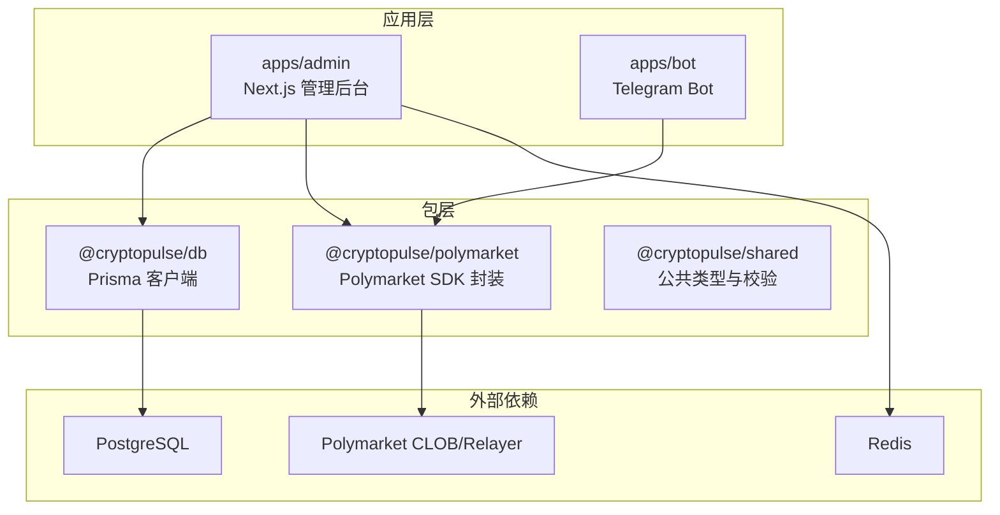
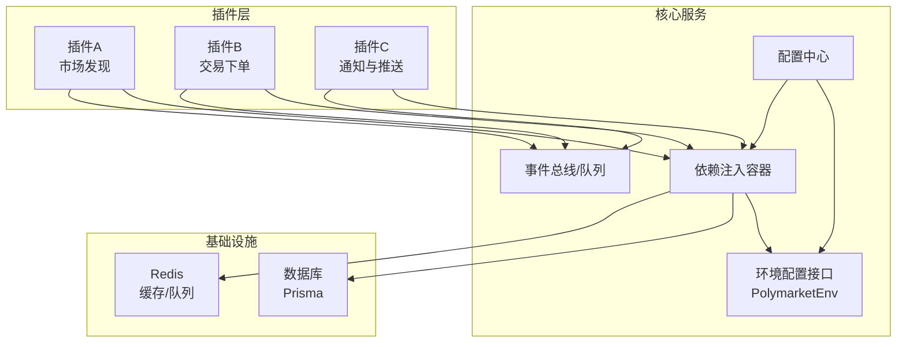
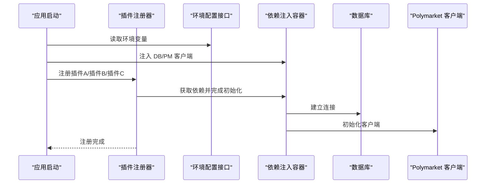
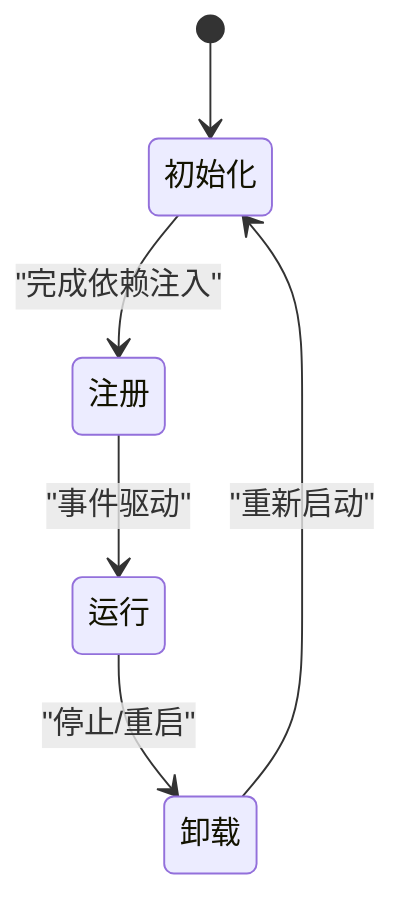
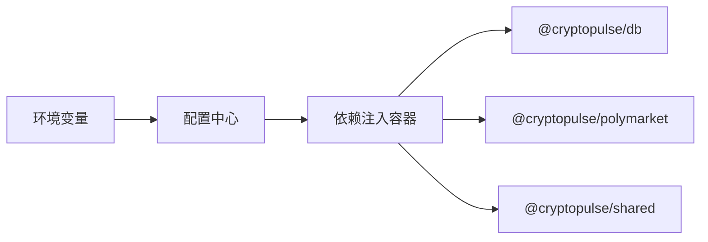
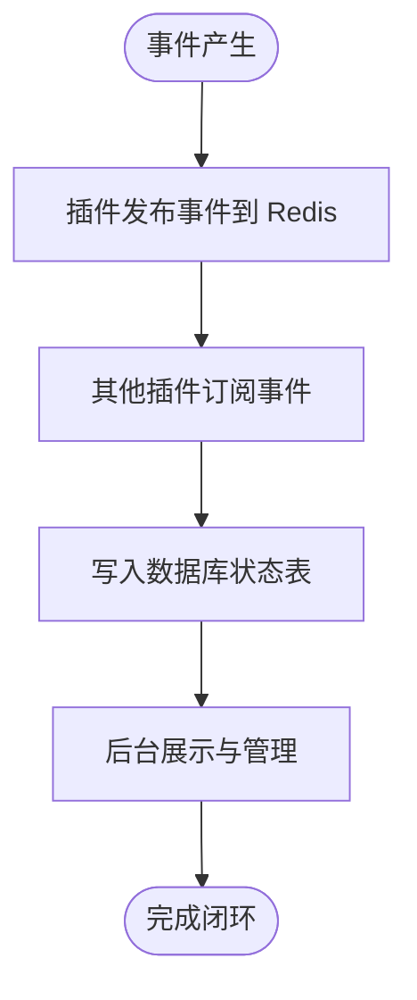
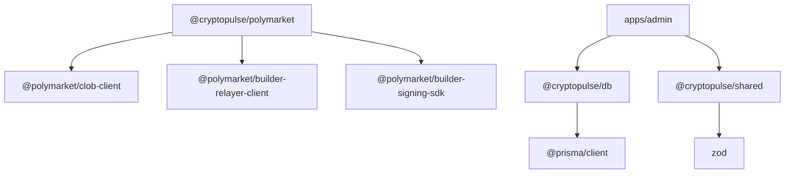

# 插件系统架构

<cite>
**本文档引用的文件**
- [README.md](file://README.md)
- [设计文档](file://specs/cryptopulse/design.md)
- [需求文档](file://specs/cryptopulse/requirements.md)
- [实施计划](file://specs/cryptopulse/tasks.md)
- [packages/polymarket/src/index.ts](file://packages/polymarket/src/index.ts)
- [packages/db/src/index.ts](file://packages/db/src/index.ts)
- [packages/shared/src/index.ts](file://packages/shared/src/index.ts)
- [apps/admin/app/api/bind/confirm/route.ts](file://apps/admin/app/api/bind/confirm/route.ts)
- [apps/admin/next.config.ts](file://apps/admin/next.config.ts)
- [apps/admin/tsconfig.json](file://apps/admin/tsconfig.json)
- [packages/polymarket/package.json](file://packages/polymarket/package.json)
- [packages/db/package.json](file://packages/db/package.json)
- [packages/shared/package.json](file://packages/shared/package.json)
</cite>

## 目录
1. [引言](#引言)
2. [项目结构](#项目结构)
3. [核心组件](#核心组件)
4. [架构总览](#架构总览)
5. [详细组件分析](#详细组件分析)
6. [依赖关系分析](#依赖关系分析)
7. [性能考量](#性能考量)
8. [故障排查指南](#故障排查指南)
9. [结论](#结论)
10. [附录](#附录)

## 引言
本文件面向 CryptoPulse 项目的插件系统，系统性阐述其架构设计、加载机制、生命周期管理与依赖注入方式，明确插件接口定义、注册流程与调用机制，说明插件间通信、事件系统与状态管理，解释配置管理、热重载机制与版本兼容性处理，并提供从接口设计到打包发布的完整开发流程与最佳实践。

## 项目结构
项目采用 monorepo 多应用组织方式，核心模块与应用边界清晰：
- 应用层
  - apps/admin：Next.js 管理后台与 Web Dashboard
  - apps/bot：Telegram Bot 进程
- 包层
  - packages/polymarket：Polymarket SDK 封装（CLOB、Relayer、Builder 签名）
  - packages/db：Prisma 客户端与数据库访问
  - packages/shared：公共类型、校验与工具
- 规划与文档
  - specs/cryptopulse：设计、需求、任务与运营检查清单

图示来源
- [apps/admin/next.config.ts](file://apps/admin/next.config.ts#L1-L29)
- [packages/polymarket/src/index.ts](file://packages/polymarket/src/index.ts#L1-L11)
- [packages/db/src/index.ts](file://packages/db/src/index.ts#L1-L13)
- [packages/shared/src/index.ts](file://packages/shared/src/index.ts#L1-L9)

章节来源
- [README.md](file://README.md#L1-L65)
- [apps/admin/next.config.ts](file://apps/admin/next.config.ts#L1-L29)
- [packages/polymarket/src/index.ts](file://packages/polymarket/src/index.ts#L1-L11)
- [packages/db/src/index.ts](file://packages/db/src/index.ts#L1-L13)
- [packages/shared/src/index.ts](file://packages/shared/src/index.ts#L1-L9)

## 核心组件
- Polymarket SDK 封装（@cryptopulse/polymarket）
  - 暴露交易、行情与 Builder 签名能力，统一环境配置接口，便于插件按需装配
- 数据库访问（@cryptopulse/db）
  - 单实例 PrismaClient，全局缓存避免重复连接，提供稳定的数据访问层
- 公共类型与校验（@cryptopulse/shared）
  - 定义通用类型（如语言、TelegramId）与 Zod 校验，保障插件间数据契约一致性
- 管理后台 API（apps/admin）
  - Next.js 路由处理器与 Server Actions，承载插件配置、事件发布与状态管理入口

章节来源
- [packages/polymarket/src/index.ts](file://packages/polymarket/src/index.ts#L1-L11)
- [packages/db/src/index.ts](file://packages/db/src/index.ts#L1-L13)
- [packages/shared/src/index.ts](file://packages/shared/src/index.ts#L1-L9)
- [apps/admin/app/api/bind/confirm/route.ts](file://apps/admin/app/api/bind/confirm/route.ts#L1-L52)

## 架构总览
插件系统围绕“可插拔能力 + 统一环境 + 事件驱动”的理念构建：
- 插件接口：通过统一的环境配置接口与能力抽象，实现跨插件的一致性
- 生命周期：初始化、注册、运行、卸载阶段清晰分离
- 依赖注入：通过包层（@cryptopulse/*）与应用层路由，按需注入数据库、Polymarket 客户端与共享校验
- 事件系统：以 Redis 与队列为核心，结合数据库状态表，实现跨插件事件发布与消费
- 配置管理：集中于环境变量与应用配置，插件通过标准化接口读取与变更

图示来源
- [packages/polymarket/src/index.ts](file://packages/polymarket/src/index.ts#L3-L9)
- [packages/db/src/index.ts](file://packages/db/src/index.ts#L5-L11)
- [apps/admin/app/api/bind/confirm/route.ts](file://apps/admin/app/api/bind/confirm/route.ts#L21-L52)

## 详细组件分析

### 插件接口定义与注册流程
- 接口定义
  - 环境配置接口：统一暴露链 ID、CLOB 主机、WebSocket 地址、Relayer 地址与 RPC 地址，便于插件按需装配
  - 类型与校验：通过共享包提供语言、TelegramId 等类型与 Zod 校验，保证插件间数据契约一致
- 注册流程
  - 应用启动时，读取环境变量与配置中心，构造插件所需的依赖（数据库、Polymarket 客户端）
  - 插件在初始化阶段声明所需能力与事件订阅，完成注册
- 调用机制
  - 插件通过依赖注入容器获取数据库与 Polymarket 客户端，按需发起查询、订阅与交易

图示来源
- [packages/polymarket/src/index.ts](file://packages/polymarket/src/index.ts#L3-L9)
- [packages/db/src/index.ts](file://packages/db/src/index.ts#L5-L11)
- [apps/admin/app/api/bind/confirm/route.ts](file://apps/admin/app/api/bind/confirm/route.ts#L21-L52)

章节来源
- [packages/polymarket/src/index.ts](file://packages/polymarket/src/index.ts#L1-L11)
- [packages/shared/src/index.ts](file://packages/shared/src/index.ts#L1-L9)
- [packages/db/src/index.ts](file://packages/db/src/index.ts#L1-L13)

### 生命周期管理
- 初始化阶段
  - 读取环境变量与配置中心，构造数据库与 Polymarket 客户端
  - 插件注册自身能力与事件订阅
- 运行阶段
  - 插件根据事件与配置执行业务逻辑，读写数据库与 Redis
- 卸载阶段
  - 释放数据库连接、关闭 Polymarket 订阅与清理事件监听

图示来源
- [packages/db/src/index.ts](file://packages/db/src/index.ts#L5-L11)
- [packages/polymarket/src/index.ts](file://packages/polymarket/src/index.ts#L3-L9)

章节来源
- [packages/db/src/index.ts](file://packages/db/src/index.ts#L1-L13)
- [packages/polymarket/src/index.ts](file://packages/polymarket/src/index.ts#L1-L11)

### 依赖注入与配置管理
- 依赖注入
  - 数据库：通过全局单例 PrismaClient 提供稳定连接
  - Polymarket 客户端：通过 @cryptopulse/polymarket 统一工厂创建
  - 共享校验：通过 @cryptopulse/shared 提供类型与 Zod 校验
- 配置管理
  - 环境变量集中管理敏感配置（如数据库 URL、Redis、Polymarket 凭据）
  - 应用配置（如 Next.js transpilePackages、serverActions 体限制）在应用层统一

图示来源
- [packages/db/src/index.ts](file://packages/db/src/index.ts#L5-L11)
- [packages/polymarket/src/index.ts](file://packages/polymarket/src/index.ts#L1-L11)
- [packages/shared/src/index.ts](file://packages/shared/src/index.ts#L1-L9)
- [apps/admin/next.config.ts](file://apps/admin/next.config.ts#L3-L5)

章节来源
- [packages/db/src/index.ts](file://packages/db/src/index.ts#L1-L13)
- [packages/polymarket/src/index.ts](file://packages/polymarket/src/index.ts#L1-L11)
- [packages/shared/src/index.ts](file://packages/shared/src/index.ts#L1-L9)
- [apps/admin/next.config.ts](file://apps/admin/next.config.ts#L1-L29)

### 插件间通信、事件系统与状态管理
- 事件系统
  - 以 Redis 作为事件总线与队列，插件发布/订阅事件，实现松耦合通信
  - 数据库用于持久化状态表（如 PushJob、Alert、CopyTradeEvent 等），确保状态可追踪
- 状态管理
  - 插件通过数据库写入状态，配合后台 API 与 Server Actions 进行管理与审计
  - WebSocket 与轮询结合，保障实时性与降级容错

图示来源
- [specs/cryptopulse/design.md](file://specs/cryptopulse/design.md#L100-L111)
- [apps/admin/app/api/bind/confirm/route.ts](file://apps/admin/app/api/bind/confirm/route.ts#L21-L52)

章节来源
- [specs/cryptopulse/design.md](file://specs/cryptopulse/design.md#L94-L111)
- [apps/admin/app/api/bind/confirm/route.ts](file://apps/admin/app/api/bind/confirm/route.ts#L1-L52)

### 热重载机制与版本兼容性处理
- 热重载
  - 应用层通过 Next.js 的 watchOptions 与 transpilePackages 配置，提升开发体验
  - 插件层通过模块化与依赖注入，避免全局状态影响热重载稳定性
- 版本兼容性
  - 通过包层版本管理（packages/*/package.json）与语义化版本约束，确保插件与 SDK 的兼容
  - 环境变量与配置中心作为灰度与回滚的手段，降低升级风险

章节来源
- [apps/admin/next.config.ts](file://apps/admin/next.config.ts#L1-L29)
- [packages/polymarket/package.json](file://packages/polymarket/package.json#L1-L23)
- [packages/db/package.json](file://packages/db/package.json#L1-L22)
- [packages/shared/package.json](file://packages/shared/package.json#L1-L19)

### 插件开发标准流程
- 接口设计
  - 基于统一的 PolymarketEnv 与共享类型，定义插件输入输出契约
- 实现与测试
  - 使用 Zod 校验请求参数，确保输入合法性
  - 单元测试覆盖核心逻辑，集成测试模拟 Polymarket 客户端
- 配置与部署
  - 通过环境变量注入敏感配置，应用层配置 Next.js 与打包选项
  - 使用 Docker Compose 进行本地与生产部署

章节来源
- [packages/shared/src/index.ts](file://packages/shared/src/index.ts#L1-L9)
- [apps/admin/app/api/bind/confirm/route.ts](file://apps/admin/app/api/bind/confirm/route.ts#L14-L43)
- [apps/admin/next.config.ts](file://apps/admin/next.config.ts#L1-L29)
- [README.md](file://README.md#L1-L65)

## 依赖关系分析
- 包层依赖
  - @cryptopulse/polymarket 依赖 Polymarket 官方 SDK，提供统一客户端工厂
  - @cryptopulse/db 依赖 Prisma Client，提供全局单例
  - @cryptopulse/shared 依赖 Zod，提供类型与校验
- 应用层依赖
  - apps/admin 依赖 @cryptopulse/db 与 @cryptopulse/shared，Next.js 配置 transpilePackages 以加速开发

图示来源
- [packages/polymarket/package.json](file://packages/polymarket/package.json#L11-L16)
- [packages/db/package.json](file://packages/db/package.json#L13-L14)
- [packages/shared/package.json](file://packages/shared/package.json#L11-L12)
- [apps/admin/next.config.ts](file://apps/admin/next.config.ts#L4-L4)

章节来源
- [packages/polymarket/package.json](file://packages/polymarket/package.json#L1-L23)
- [packages/db/package.json](file://packages/db/package.json#L1-L22)
- [packages/shared/package.json](file://packages/shared/package.json#L1-L19)
- [apps/admin/next.config.ts](file://apps/admin/next.config.ts#L1-L29)

## 性能考量
- 缓存与实时性
  - 优先使用 Polymarket WebSocket 订阅，降级时采用轮询 + Redis 缓存
- 限流与退避
  - 对 Polymarket/Relayer 调用实现指数退避与限流，避免上游限流
- 前端体积与构建
  - Next.js 配置 serverActions 体大小限制与 transpilePackages，减少打包体积与编译时间

章节来源
- [specs/cryptopulse/design.md](file://specs/cryptopulse/design.md#L94-L98)
- [specs/cryptopulse/design.md](file://specs/cryptopulse/design.md#L152-L153)
- [apps/admin/next.config.ts](file://apps/admin/next.config.ts#L5-L8)

## 故障排查指南
- 数据库不可用
  - 现象：API 返回数据库不可用错误
  - 排查：检查 DATABASE_URL 是否正确，确认 Prisma 客户端初始化是否成功
- 请求体解析失败
  - 现象：API 返回无效 JSON 错误
  - 排查：确认请求头 Content-Type 与 JSON 结构，使用 Zod 校验
- 绑定流程异常
  - 现象：绑定码不存在或重复使用
  - 排查：确认 BindCode 表状态与过期时间，检查 usedAt 字段

章节来源
- [apps/admin/app/api/bind/confirm/route.ts](file://apps/admin/app/api/bind/confirm/route.ts#L21-L52)
- [test/bind-confirm.test.ts](file://test/bind-confirm.test.ts#L41-L88)

## 结论
CryptoPulse 的插件系统以统一的环境配置接口、清晰的生命周期与依赖注入为核心，结合 Redis 事件总线与数据库状态表，实现了可扩展、可观测与可维护的插件生态。通过严格的配置管理、热重载与版本兼容策略，以及完善的测试与故障排查流程，确保插件在开发与生产环境中稳定运行。

## 附录
- 开发与发布清单
  - 接口设计与契约评审
  - 单元测试与集成测试
  - 环境变量与配置中心校验
  - Docker Compose 部署与健康检查
- 最佳实践
  - 严格使用 Zod 校验输入
  - 通过环境变量管理敏感配置
  - 使用 WebSocket 优先、轮询降级策略
  - 事件驱动与状态持久化并行