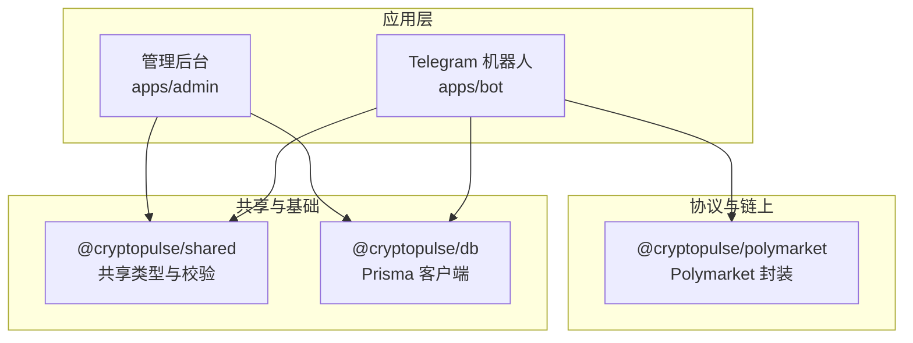
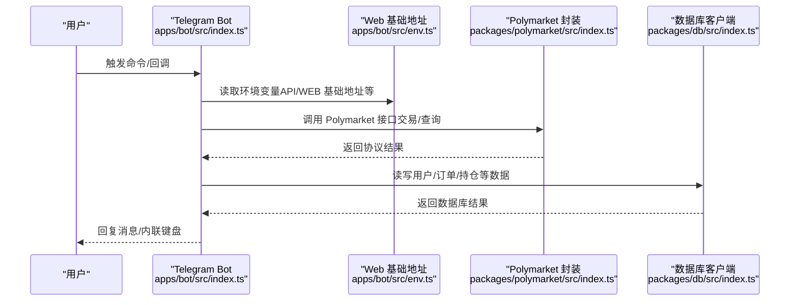
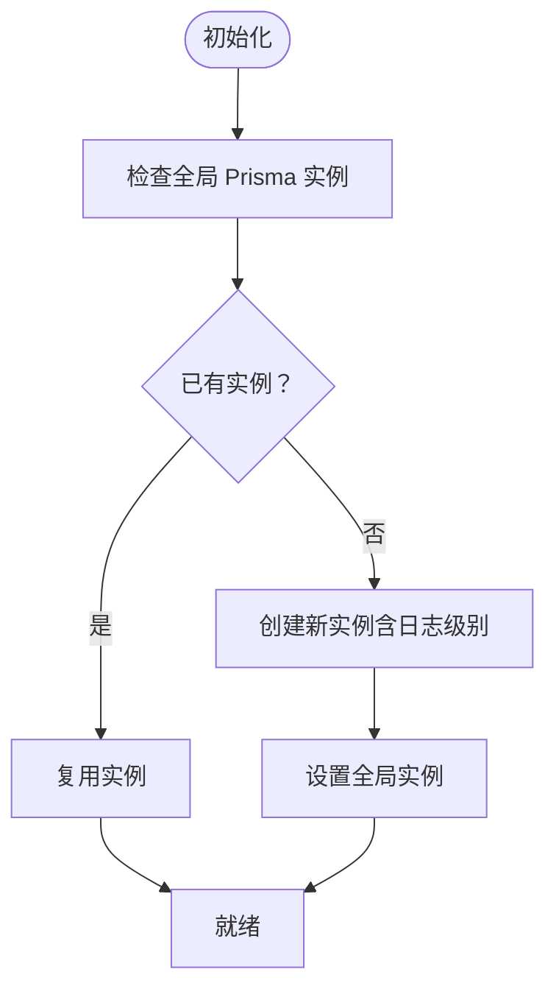
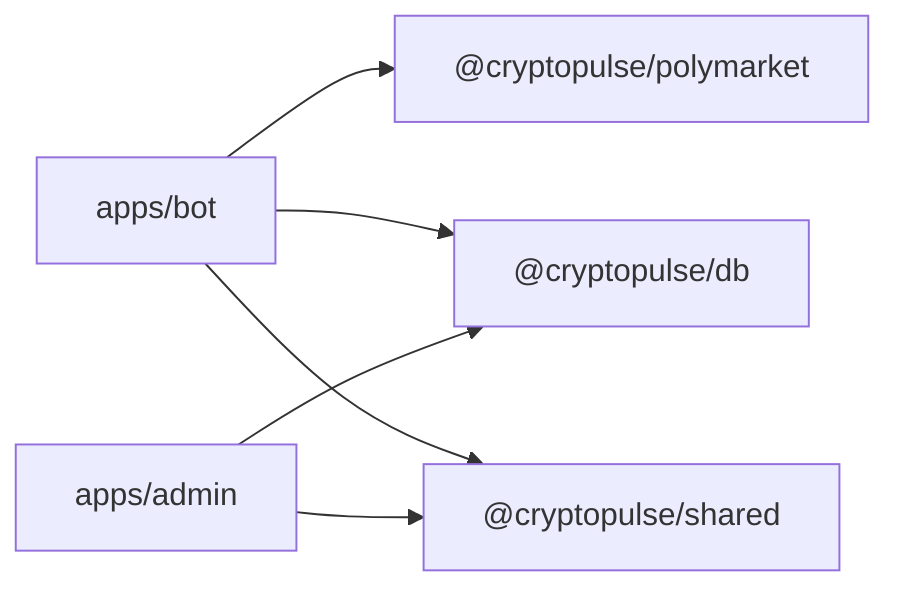

# 第三方集成

<cite>
**本文引用的文件**
- [README.md](file://README.md)
- [packages/polymarket/src/index.ts](file://packages/polymarket/src/index.ts)
- [packages/polymarket/package.json](file://packages/polymarket/package.json)
- [packages/db/src/index.ts](file://packages/db/src/index.ts)
- [packages/db/package.json](file://packages/db/package.json)
- [packages/shared/src/index.ts](file://packages/shared/src/index.ts)
- [apps/admin/package.json](file://apps/admin/package.json)
- [apps/bot/src/env.ts](file://apps/bot/src/env.ts)
- [apps/bot/src/index.ts](file://apps/bot/src/index.ts)
</cite>

## 目录
1. [简介](#简介)
2. [项目结构](#项目结构)
3. [核心组件](#核心组件)
4. [架构总览](#架构总览)
5. [详细组件分析](#详细组件分析)
6. [依赖分析](#依赖分析)
7. [性能考量](#性能考量)
8. [故障排查指南](#故障排查指南)
9. [结论](#结论)
10. [附录](#附录)

## 简介
本指南面向希望为 CryptoPulse 项目进行第三方集成的开发者，重点覆盖以下方面：
- 如何扩展对 Polymarket 协议的支持（协议客户端、交易与行情接口）
- 如何新增数据库连接器（Prisma）与区块链节点接入（以 Ethers/Viem 生态为例）
- 如何通过适配器模式与抽象层设计提升集成的灵活性与可维护性
- 认证机制扩展（OAuth、API 密钥、会话管理）的实践路径
- 数据同步与缓存策略（增量更新、冲突解决、一致性保障）
- 监控与日志（指标采集、错误上报、性能追踪）
- 安全考虑（数据加密、访问控制、审计日志）
- 集成测试与模拟环境搭建

## 项目结构
项目采用多包工作区（monorepo）组织方式，核心模块如下：
- packages/polymarket：Polymarket 协议相关封装与导出
- packages/db：数据库客户端（Prisma）与全局实例
- packages/shared：共享类型与校验（Zod）
- apps/admin：管理后台（Next.js）
- apps/bot：Telegram 机器人（Grammy）

图表来源
- [apps/admin/package.json](file://apps/admin/package.json#L1-L42)
- [apps/bot/src/index.ts](file://apps/bot/src/index.ts#L1-L156)
- [packages/db/src/index.ts](file://packages/db/src/index.ts#L1-L13)
- [packages/polymarket/src/index.ts](file://packages/polymarket/src/index.ts#L1-L11)
- [packages/shared/src/index.ts](file://packages/shared/src/index.ts#L1-L9)

章节来源
- [README.md](file://README.md#L1-L65)
- [apps/admin/package.json](file://apps/admin/package.json#L1-L42)
- [apps/bot/src/index.ts](file://apps/bot/src/index.ts#L1-L156)
- [packages/db/src/index.ts](file://packages/db/src/index.ts#L1-L13)
- [packages/polymarket/src/index.ts](file://packages/polymarket/src/index.ts#L1-L11)
- [packages/shared/src/index.ts](file://packages/shared/src/index.ts#L1-L9)

## 核心组件
- Polymarket 协议封装：导出交易与行情相关能力，并定义链上环境配置（链 ID、CLOB 主机、WebSocket、Relayer、RPC）。
- 数据库连接器：基于 Prisma 的全局客户端实例，支持日志级别配置。
- 共享类型与校验：统一语言与 Telegram ID 等类型定义，便于跨包复用。
- 机器人与管理后台：通过环境变量驱动，分别对接 Web 基础地址、API 地址与可选的数据库/Redis 连接。

章节来源
- [packages/polymarket/src/index.ts](file://packages/polymarket/src/index.ts#L1-L11)
- [packages/db/src/index.ts](file://packages/db/src/index.ts#L1-L13)
- [packages/shared/src/index.ts](file://packages/shared/src/index.ts#L1-L9)
- [apps/bot/src/env.ts](file://apps/bot/src/env.ts#L1-L14)
- [apps/bot/src/index.ts](file://apps/bot/src/index.ts#L1-L156)

## 架构总览
下图展示了从 Telegram 机器人到 Polymarket 协议与数据库的调用关系，以及环境变量与共享类型的参与。

图表来源
- [apps/bot/src/index.ts](file://apps/bot/src/index.ts#L1-L156)
- [apps/bot/src/env.ts](file://apps/bot/src/env.ts#L1-L14)
- [packages/polymarket/src/index.ts](file://packages/polymarket/src/index.ts#L1-L11)
- [packages/db/src/index.ts](file://packages/db/src/index.ts#L1-L13)

## 详细组件分析

### Polymarket 协议扩展
目标：为 Polymarket CLOB、Relayer、WebSocket 与 RPC 提供统一的适配器与抽象层，便于替换与扩展。

- 现状与扩展点
  - 当前导出包含 Gamma 与 Trade 能力，并定义 Polymarket 环境配置对象，用于注入链 ID、CLOB 主机、WebSocket、Relayer、RPC 等。
  - 可在此基础上新增适配器类，封装不同版本的客户端 SDK，统一对外接口，屏蔽底层差异。
  - 对于 WebSocket 与 RPC，建议引入连接池与重连策略，结合背压与超时控制。

- 适配器模式设计要点
  - 抽象接口：定义统一的 Market、Order、Portfolio、Trade 等操作接口。
  - 实现分层：按版本/供应商拆分具体实现，如 Builder、Viem 等。
  - 配置注入：通过环境配置对象注入链上参数，便于切换网络与节点。
  - 错误映射：将底层异常转换为统一的业务异常，便于上层处理。

- 与现有代码的对应关系
  - 环境配置对象与导出项位于协议封装入口。
  - 机器人与管理后台通过环境变量与 Web 基础地址间接调用协议能力。

章节来源
- [packages/polymarket/src/index.ts](file://packages/polymarket/src/index.ts#L1-L11)
- [packages/polymarket/package.json](file://packages/polymarket/package.json#L1-L23)
- [apps/bot/src/env.ts](file://apps/bot/src/env.ts#L1-L14)
- [apps/bot/src/index.ts](file://apps/bot/src/index.ts#L1-L156)

### 数据库连接器扩展（Prisma）
目标：在现有 Prisma 客户端基础上，扩展新的模型与迁移，或引入其他数据库适配器。

- 现状
  - 全局 PrismaClient 实例，带日志级别配置，避免重复连接。
  - 通过工作区脚本生成与迁移数据库结构。

- 扩展策略
  - 新增模型：在 schema 中定义新表/索引，保持字段命名与约束一致。
  - 迁移管理：使用 Prisma 迁移脚本，确保本地与生产一致。
  - 事务与并发：在高并发场景下使用事务包裹关键操作，必要时引入连接池参数优化。
  - 多数据库适配：若需引入其他数据库，建议通过 Repository/DAO 抽象层隔离差异。

图表来源
- [packages/db/src/index.ts](file://packages/db/src/index.ts#L1-L13)

章节来源
- [packages/db/src/index.ts](file://packages/db/src/index.ts#L1-L13)
- [packages/db/package.json](file://packages/db/package.json#L1-L22)
- [README.md](file://README.md#L26-L40)

### 区块链节点接入（Ethers/Viem）
目标：在 Polymarket 适配器中接入 Viem/Ethers，实现链上交互与事件监听。

- 现状
  - 协议封装依赖 viem 与 Polymarket 官方客户端 SDK。
  - 环境配置包含 RPC URL，可用于连接节点。

- 接入建议
  - 使用 Viem 的 Public Client、Wallet Client 与 WebSocket Transport，分别处理只读查询、签名与实时事件。
  - 引入多节点轮询与故障转移，提高可用性。
  - 对链上事件与交易回执进行幂等处理与重放保护。

章节来源
- [packages/polymarket/package.json](file://packages/polymarket/package.json#L1-L23)
- [packages/polymarket/src/index.ts](file://packages/polymarket/src/index.ts#L1-L11)

### 认证机制扩展（OAuth、API 密钥、会话）
目标：在管理后台与机器人之间建立安全的认证与会话体系。

- 现状
  - 管理后台通过环境变量控制访问令牌（生产环境需设置），开发环境可直接访问。
  - 机器人侧通过 Telegram Bot Token 与可选的 Bot API Token 进行鉴权。

- 扩展建议
  - OAuth：在管理后台引入 OAuth 登录（如 Google/OAuth2），返回短期访问令牌与刷新令牌，存储于受保护的会话或安全 Cookie。
  - API 密钥：为外部系统提供 API 密钥，支持按功能维度授权与限额控制。
  - 会话管理：使用安全的会话存储（如 Redis），设置过期时间与刷新策略，防止 CSRF/XSS 攻击。
  - 管理后台中间件：在 Next.js 中间件中统一校验访问令牌与权限，拒绝未授权请求。

章节来源
- [README.md](file://README.md#L41-L57)
- [apps/admin/package.json](file://apps/admin/package.json#L1-L42)
- [apps/bot/src/env.ts](file://apps/bot/src/env.ts#L1-L14)

### 数据同步与缓存策略
目标：在 Polymarket 行情、订单与用户数据之间建立高效、一致的数据流。

- 增量更新
  - 行情：基于 WebSocket 事件与轮询相结合，仅拉取自上次更新以来的变化。
  - 订单与持仓：监听链上事件与 Relayer 回调，合并本地状态，避免重复处理。

- 冲突解决
  - 版本号/时间戳：为每条记录附加版本或时间戳，冲突时以最新为准或触发人工介入。
  - 幂等键：对关键操作（下单、撤单）使用幂等键，避免重复执行。

- 一致性保证
  - 事务写入：在数据库写入与缓存更新之间使用事务，或采用最终一致性 + 补偿机制。
  - 缓存策略：热点数据使用 Redis，设置合理 TTL；长尾数据使用数据库冷备。

- 缓存层建议
  - L1：进程内缓存（短期高频读取）
  - L2：Redis（共享与持久化）
  - L3：数据库（最终一致性）

章节来源
- [packages/db/src/index.ts](file://packages/db/src/index.ts#L1-L13)
- [packages/polymarket/src/index.ts](file://packages/polymarket/src/index.ts#L1-L11)

### 监控与日志集成
目标：构建可观测性体系，覆盖指标采集、错误上报与性能追踪。

- 指标采集
  - 机器人：统计命令调用次数、响应延迟、失败率。
  - 协议层：记录请求耗时、重试次数、节点可用性。
  - 数据库：慢查询、连接数、错误码分布。

- 错误报告
  - 结构化日志：统一字段（时间、级别、模块、上下文、堆栈）。
  - 上报平台：接入 Sentry 或自建上报服务，区分严重度与告警。

- 性能追踪
  - 链路追踪：为关键请求打点（Bot -> API -> Polymarket -> DB），定位瓶颈。
  - 基准测试：对高频接口进行压力测试，设定 SLO/SLO。

章节来源
- [apps/bot/src/index.ts](file://apps/bot/src/index.ts#L150-L152)

### 安全考虑
目标：在第三方集成中落实数据加密、访问控制与审计日志。

- 数据加密
  - 传输加密：TLS 1.3，强制 HTTPS。
  - 存储加密：敏感字段（API 密钥、私钥）使用 KMS 加密存储，最小化明文暴露面。
  - 会话加密：Cookie 使用 HttpOnly、Secure、SameSite 属性。

- 访问控制
  - 最小权限：为外部服务分配最小 API 权限与作用域。
  - IP 白名单：对关键接口启用来源限制。
  - 速率限制：对公共接口实施速率限制，防滥用。

- 审计日志
  - 记录关键操作（登录、绑定、下单、撤单、资金变动）的时间、主体、目标与结果。
  - 日志脱敏：避免记录完整密钥与敏感参数。

章节来源
- [apps/bot/src/env.ts](file://apps/bot/src/env.ts#L1-L14)
- [apps/admin/package.json](file://apps/admin/package.json#L1-L42)

### 集成测试与模拟环境
目标：在本地与 CI 中快速验证第三方集成的正确性与稳定性。

- 测试策略
  - 单元测试：对适配器与 DAO 进行隔离测试，使用 Mock 与 Stub。
  - 集成测试：使用 Docker Compose 启动 Postgres 与 Redis，模拟真实环境。
  - 端到端测试：Playwright 覆盖管理后台与机器人关键流程。

- 模拟环境
  - 使用 Testcontainers 或 Docker Compose 启动数据库与缓存服务。
  - 通过环境变量切换到测试网或本地节点，避免污染主网数据。

章节来源
- [README.md](file://README.md#L1-L65)
- [apps/admin/package.json](file://apps/admin/package.json#L1-L42)

## 依赖分析
- 包依赖
  - apps/admin 依赖 @cryptopulse/db 与 @cryptopulse/shared
  - apps/bot 依赖 @cryptopulse/db、@cryptopulse/polymarket、@cryptopulse/shared
  - packages/polymarket 依赖 viem 与 Polymarket 官方客户端 SDK
  - packages/db 依赖 @prisma/client 与 prisma 工具链

图表来源
- [apps/bot/package.json](file://apps/bot/package.json#L1-L26)
- [apps/admin/package.json](file://apps/admin/package.json#L1-L42)
- [packages/polymarket/package.json](file://packages/polymarket/package.json#L1-L23)
- [packages/db/package.json](file://packages/db/package.json#L1-L22)

章节来源
- [apps/bot/package.json](file://apps/bot/package.json#L1-L26)
- [apps/admin/package.json](file://apps/admin/package.json#L1-L42)
- [packages/polymarket/package.json](file://packages/polymarket/package.json#L1-L23)
- [packages/db/package.json](file://packages/db/package.json#L1-L22)

## 性能考量
- 连接与资源
  - 数据库：复用 Prisma 实例，合理设置连接池大小与超时。
  - Polymarket：WebSocket 与 RPC 使用连接池与重连策略，避免阻塞主线程。
- 缓存与批处理
  - 批量写入与批量查询，减少往返次数。
  - 合理设置缓存 TTL，避免陈旧数据影响用户体验。
- 监控与告警
  - 关键指标（QPS、P95/P99、错误率、重试率）纳入告警阈值。

## 故障排查指南
- 常见问题
  - 数据库连接失败：检查 DATABASE_URL 与网络连通性，确认 Prisma 实例是否被正确复用。
  - Polymarket 请求异常：核对链 ID、CLOB 主机、Relayer 与 RPC 配置，查看协议层日志。
  - 机器人无法启动：检查 TELEGRAM_BOT_TOKEN、API_BASE_URL、WEB_BASE_URL 是否正确。
- 日志与追踪
  - 机器人错误捕获与日志输出，便于定位异常。
  - 在关键路径埋点，结合链路追踪定位慢调用。

章节来源
- [packages/db/src/index.ts](file://packages/db/src/index.ts#L1-L13)
- [packages/polymarket/src/index.ts](file://packages/polymarket/src/index.ts#L1-L11)
- [apps/bot/src/env.ts](file://apps/bot/src/env.ts#L1-L14)
- [apps/bot/src/index.ts](file://apps/bot/src/index.ts#L150-L152)

## 结论
通过适配器与抽象层设计，CryptoPulse 可以灵活地集成 Polymarket 协议、数据库与区块链节点；借助完善的认证、缓存与监控体系，能够满足生产级的可用性与安全性要求。建议在新增第三方服务时遵循本文的设计原则与最佳实践，确保扩展的可维护性与可演进性。

## 附录
- 快速检查清单
  - 环境变量齐全且通过 Zod 校验
  - 数据库迁移与 Prisma 生成已完成
  - Polymarket 网络配置正确
  - 缓存与数据库一致性策略明确
  - 监控与日志已接入
  - 集成测试与模拟环境准备就绪