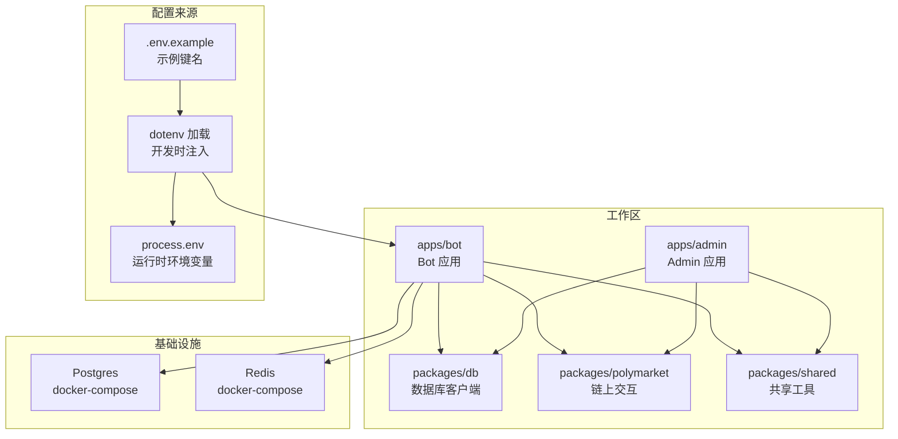
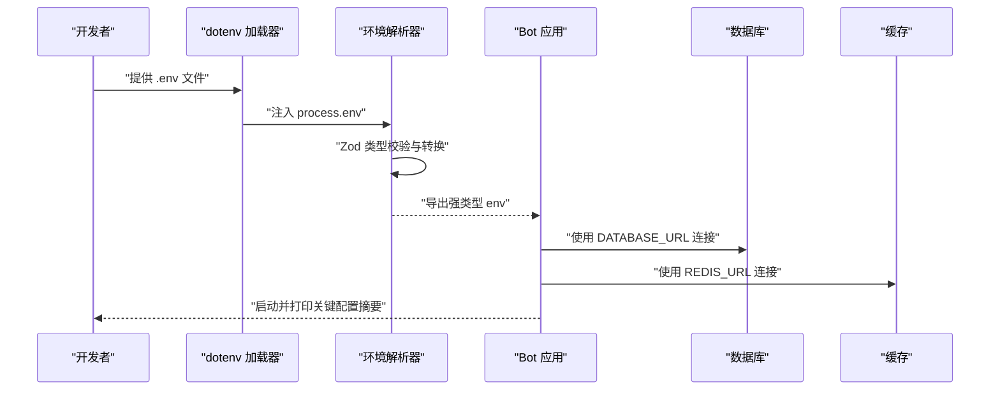
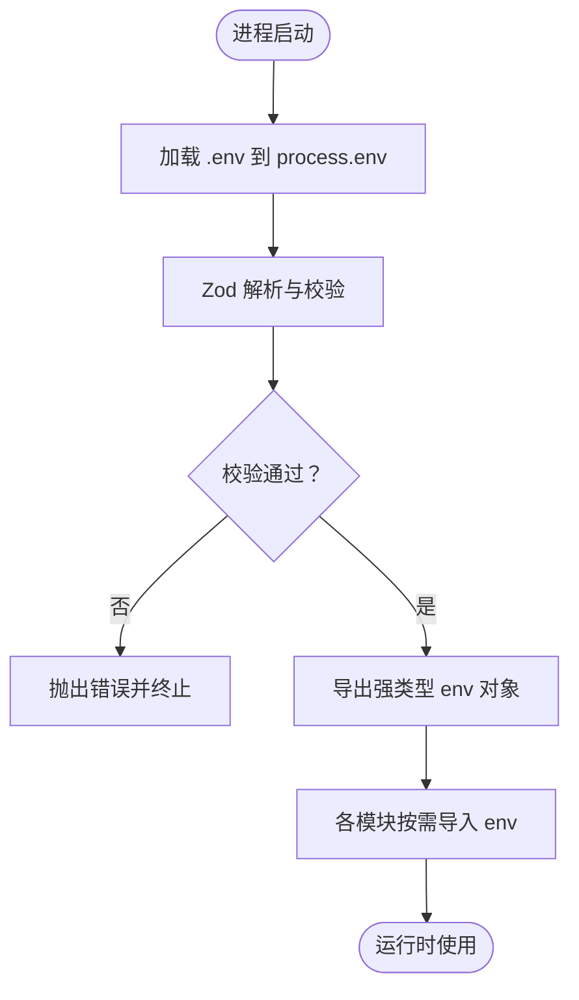
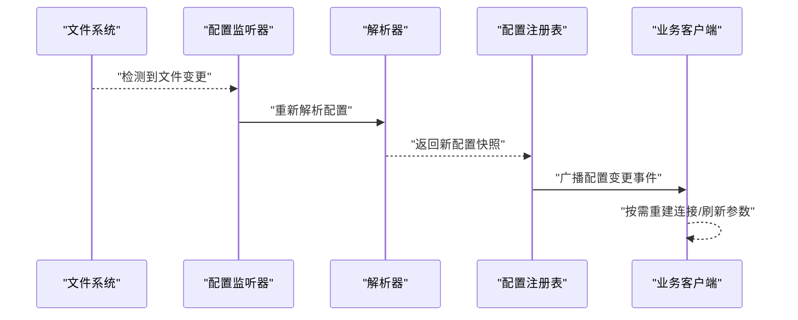
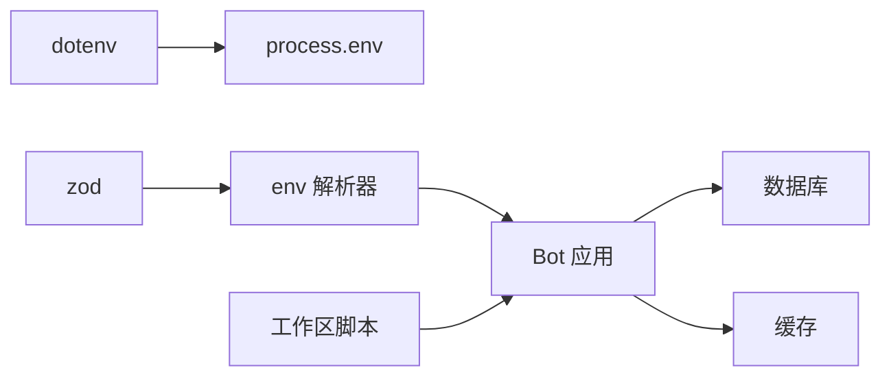

# 配置系统扩展

<cite>
**本文引用的文件**
- [apps/bot/src/env.ts](file://apps/bot/src/env.ts)
- [apps/bot/src/index.ts](file://apps/bot/src/index.ts)
- [.env.example](file://.env.example)
- [docker-compose.yml](file://docker-compose.yml)
- [package.json](file://package.json)
- [apps/bot/package.json](file://apps/bot/package.json)
- [apps/admin/package.json](file://apps/admin/package.json)
- [packages/db/src/index.ts](file://packages/db/src/index.ts)
- [specs/cryptopulse/design.md](file://specs/cryptopulse/design.md)
</cite>

## 目录
1. [引言](#引言)
2. [项目结构](#项目结构)
3. [核心组件](#核心组件)
4. [架构总览](#架构总览)
5. [详细组件分析](#详细组件分析)
6. [依赖关系分析](#依赖关系分析)
7. [性能考量](#性能考量)
8. [故障排查指南](#故障排查指南)
9. [结论](#结论)
10. [附录](#附录)

## 引言
本指南面向 CryptoPulse 项目的配置系统扩展，目标是建立一套可扩展、可维护、安全且可观测的配置体系。内容涵盖配置层次与优先级、动态配置与热重载、类型与验证、加密与敏感信息保护、迁移与版本管理、以及监控与审计等。文档以现有代码为依据，结合仓库中的示例与依赖，给出可落地的实施建议。

## 项目结构
当前项目采用多包工作区结构，核心应用位于 apps 目录，共享库位于 packages 目录。配置相关的关键位置如下：
- 环境变量样例：根目录提供示例文件，定义了数据库、缓存、第三方服务等关键键名
- 应用层配置：Bot 应用通过独立的环境模块进行解析与导出
- 数据库与缓存：通过 docker-compose 提供 Postgres 与 Redis 的本地开发环境
- 工作区脚本：统一的开发与构建脚本，便于在多包环境中管理配置加载

图表来源
- [apps/bot/src/env.ts](file://apps/bot/src/env.ts#L1-L14)
- [apps/bot/src/index.ts](file://apps/bot/src/index.ts#L1-L156)
- [.env.example](file://.env.example#L1-L43)
- [docker-compose.yml](file://docker-compose.yml#L1-L24)
- [package.json](file://package.json#L1-L18)

章节来源
- [package.json](file://package.json#L1-L18)
- [.env.example](file://.env.example#L1-L43)
- [docker-compose.yml](file://docker-compose.yml#L1-L24)

## 核心组件
- 环境变量解析器（Bot 应用）：使用类型库对 process.env 进行严格校验与转换，导出强类型化的 env 对象
- 示例配置文件：提供所有受支持的配置键名与用途说明，作为团队约定与初始模板
- 基础设施编排：通过 docker-compose 提供数据库与缓存服务，简化本地与 CI 环境的一致性
- 工作区脚本：统一的开发与构建命令，便于在多包环境下集中管理配置加载

章节来源
- [apps/bot/src/env.ts](file://apps/bot/src/env.ts#L1-L14)
- [.env.example](file://.env.example#L1-L43)
- [docker-compose.yml](file://docker-compose.yml#L1-L24)
- [package.json](file://package.json#L1-L18)

## 架构总览
下图展示了配置从“声明到生效”的整体流程，包括环境变量、配置文件与运行时参数的协同：

图表来源
- [apps/bot/src/env.ts](file://apps/bot/src/env.ts#L1-L14)
- [apps/bot/src/index.ts](file://apps/bot/src/index.ts#L1-L156)
- [.env.example](file://.env.example#L1-L43)

## 详细组件分析

### 组件一：环境变量解析与类型校验
- 设计要点
  - 使用类型库对 process.env 进行一次性解析，输出强类型对象
  - 对必填项进行非空校验，对 URL 类型进行格式校验
  - 可选项允许缺失，便于在不同环境灵活覆盖
- 关键行为
  - 启动即校验，失败时尽早暴露问题
  - 将字符串环境变量转换为应用期望的类型
- 安全与一致性
  - 通过统一入口访问配置，避免散落的 process.env 字符串
  - 与示例文件保持键名一致，减少遗漏

图表来源
- [apps/bot/src/env.ts](file://apps/bot/src/env.ts#L1-L14)

章节来源
- [apps/bot/src/env.ts](file://apps/bot/src/env.ts#L1-L14)

### 组件二：配置层次与优先级机制
- 层次划分
  - 最低优先级：示例配置文件（提供键名与默认注释）
  - 中优先级：.env 文件（本地开发覆盖示例）
  - 最高优先级：系统环境变量（CI/容器/主机覆盖 .env）
- 优先级执行顺序
  - dotenv 在应用入口加载，将键值注入 process.env
  - Zod 解析器读取最终的 process.env，形成不可变的 env 对象
- 实践建议
  - 本地开发使用 .env；CI/容器使用系统环境变量
  - 不同环境（开发/测试/生产）使用不同的 .env 文件并通过环境变量覆盖

章节来源
- [.env.example](file://.env.example#L1-L43)
- [apps/bot/src/index.ts](file://apps/bot/src/index.ts#L1-L156)

### 组件三：动态配置与热重载
- 当前状态
  - Bot 应用在启动时一次性解析并导出 env，未实现运行时热重载
- 可行方案
  - 文件监听：监听 .env 或配置文件变化，触发重新解析与回调
  - 运行时参数：通过 CLI 参数或管理接口覆盖特定键值
  - 状态同步：将新配置写入内存映射，通知订阅者更新连接池、客户端等
- 注意事项
  - 对数据库与缓存连接，需要优雅关闭旧连接并重建
  - 对第三方 SDK，需确认其是否支持运行时参数更新

图表来源
- [apps/bot/src/env.ts](file://apps/bot/src/env.ts#L1-L14)

章节来源
- [apps/bot/src/env.ts](file://apps/bot/src/env.ts#L1-L14)

### 组件四：配置验证与类型检查
- 现状
  - 使用类型库对 process.env 进行一次性校验，失败即终止
- 建议增强
  - 增加运行时增量校验：对关键配置（如数据库、缓存）在首次使用前做连通性探测
  - 增加配置摘要日志：启动时打印生效的配置摘要，便于审计
  - 增加配置白名单：仅允许白名单内的键参与解析，防止误传

章节来源
- [apps/bot/src/env.ts](file://apps/bot/src/env.ts#L1-L14)

### 组件五：配置模板与最佳实践
- 开发环境
  - 使用 .env.example 作为模板，本地 .env 覆盖必要键
  - 通过 docker-compose 启动 Postgres 与 Redis，确保本地一致性
- 测试环境
  - 使用独立的 .env.test，通过环境变量覆盖关键键
  - 使用只读数据库账号与专用缓存实例
- 生产环境
  - 通过平台（如容器编排）注入环境变量，不提交 .env
  - 对敏感键启用密钥管理服务（见后续加密章节）

章节来源
- [.env.example](file://.env.example#L1-L43)
- [docker-compose.yml](file://docker-compose.yml#L1-L24)
- [specs/cryptopulse/design.md](file://specs/cryptopulse/design.md#L162-L167)

### 组件六：加密存储与敏感信息保护
- 建议方案
  - 密钥管理：使用平台提供的密钥管理服务（如 AWS Secrets Manager、HashiCorp Vault）
  - 运行时解密：在应用启动阶段解密并注入 process.env
  - 最小权限：仅授予应用所需的最小密钥权限
  - 禁止明文存储：禁止在代码库中出现明文敏感信息
- 与现有结构的衔接
  - 在 dotenv 加载之后、Zod 解析之前执行解密逻辑
  - 对解密失败进行严格处理，阻止应用启动

章节来源
- [apps/bot/src/env.ts](file://apps/bot/src/env.ts#L1-L14)

### 组件七：配置迁移与版本管理
- 版本化策略
  - 为配置文件引入版本号字段，用于标识配置结构
  - 在升级时提供迁移脚本，自动将旧配置转换为新结构
- 渐进式变更
  - 新增键时标记为可选，兼容旧版本
  - 逐步淘汰旧键并在未来版本移除
- 回滚策略
  - 保留最近 N 次配置快照，支持一键回滚
  - 在 CI 中增加配置兼容性检查

章节来源
- [apps/bot/src/env.ts](file://apps/bot/src/env.ts#L1-L14)

### 组件八：监控与调试工具
- 配置审计
  - 启动时打印生效配置摘要（排除敏感键）
  - 记录配置变更事件（时间、操作者、变更前后对比）
- 变更追踪
  - 为配置变更建立变更日志，记录来源（文件/环境变量/运行时参数）
  - 对关键配置变更进行告警
- 调试辅助
  - 提供配置查看接口（仅限管理端）
  - 支持临时覆盖参数以便快速定位问题

章节来源
- [apps/bot/src/index.ts](file://apps/bot/src/index.ts#L1-L156)

## 依赖关系分析
- Bot 应用依赖 dotenv 与 zod，前者负责将 .env 注入 process.env，后者负责类型校验
- 数据库与缓存通过 docker-compose 提供，Bot 应用在启动时连接
- 工作区脚本统一管理开发与构建流程，便于在多包环境中集中控制配置加载

图表来源
- [apps/bot/src/env.ts](file://apps/bot/src/env.ts#L1-L14)
- [apps/bot/src/index.ts](file://apps/bot/src/index.ts#L1-L156)
- [package.json](file://package.json#L1-L18)

章节来源
- [apps/bot/package.json](file://apps/bot/package.json#L1-L26)
- [apps/admin/package.json](file://apps/admin/package.json#L1-L42)
- [package.json](file://package.json#L1-L18)

## 性能考量
- 启动时一次性解析配置，避免运行时重复 IO
- 对数据库与缓存连接采用连接池，减少频繁重建
- 对外部服务调用增加超时与重试策略，避免阻塞启动

## 故障排查指南
- 启动失败（类型校验错误）
  - 检查 .env 是否缺少必填键或格式不正确
  - 对照示例文件核对键名与格式
- 连接失败（数据库/缓存）
  - 确认 docker-compose 服务已启动
  - 检查 DATABASE_URL/REDIS_URL 是否可达
- 动态配置未生效
  - 确认监听器已启用且文件路径正确
  - 检查注册表是否收到新配置快照

章节来源
- [apps/bot/src/env.ts](file://apps/bot/src/env.ts#L1-L14)
- [apps/bot/src/index.ts](file://apps/bot/src/index.ts#L1-L156)
- [docker-compose.yml](file://docker-compose.yml#L1-L24)

## 结论
通过在现有基础上引入动态配置、加密存储、版本管理与可观测性能力，CryptoPulse 的配置系统将具备更强的适应性与安全性。建议分阶段推进：先完善类型与验证，再引入热重载与审计，最后接入密钥管理与迁移工具链。

## 附录
- 配置键清单（来自示例文件）
  - 核心：NODE_ENV
  - 数据库与缓存：DATABASE_URL、REDIS_URL
  - Telegram：TELEGRAM_BOT_TOKEN、BOT_API_TOKEN、TELEGRAM_TEST_GROUP_ID
  - Web 基础：API_BASE_URL、WEB_BASE_URL
  - Polymarket：POLYMARKET_CHAIN_ID、POLYMARKET_CLOB_HOST、POLYMARKET_WS_URL、POLYMARKET_RELAYER_URL、POLYMARKET_RPC_URL
  - Builder：POLY_BUILDER_API_KEY、POLY_BUILDER_SECRET、POLY_BUILDER_PASSPHRASE、SIGNING_TOKEN
  - 登录：PRIVY_APP_ID、PRIVY_APP_SECRET、MAGIC_PUBLISHABLE_KEY、MAGIC_SECRET_KEY
  - 观测：SENTRY_DSN

章节来源
- [.env.example](file://.env.example#L1-L43)