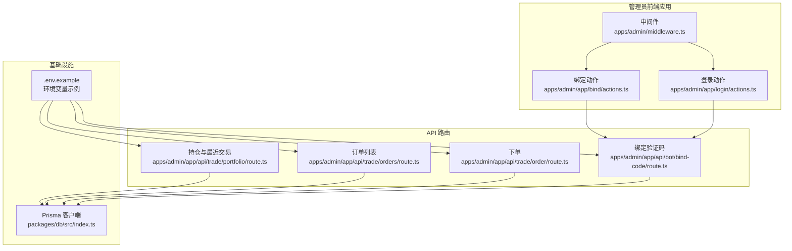
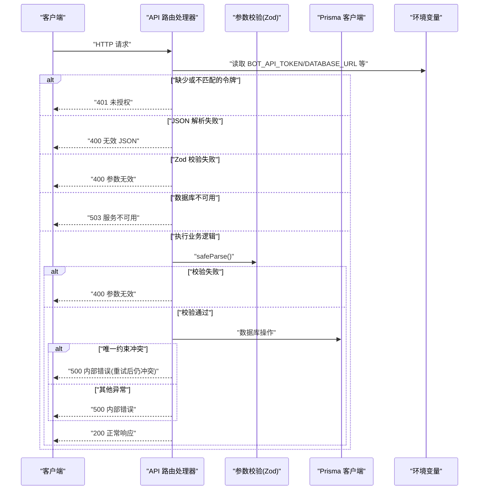
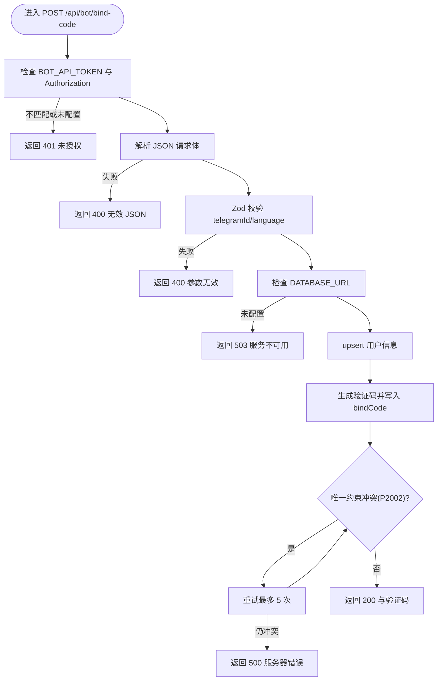
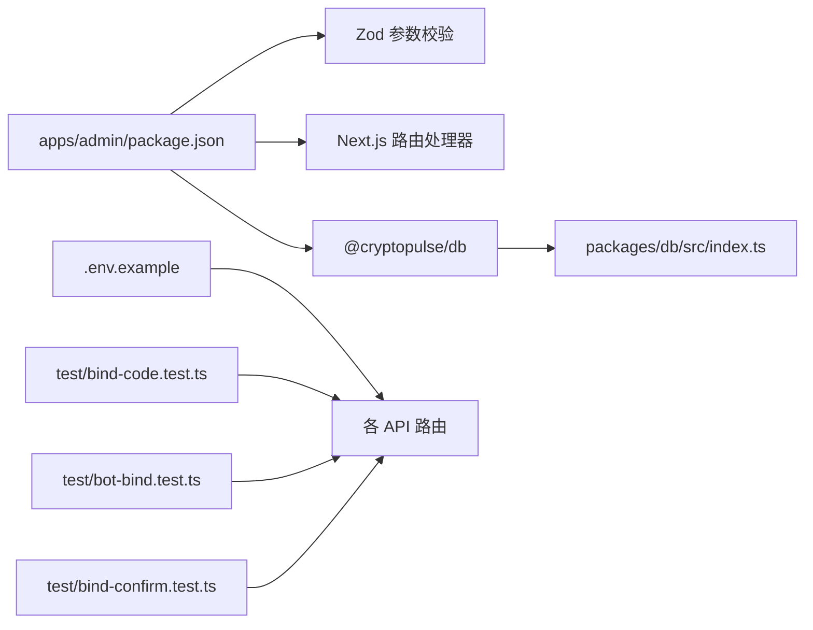

# API 错误处理

<cite>
**本文引用的文件**
- [apps/admin/middleware.ts](file://apps/admin/middleware.ts)
- [apps/admin/app/api/bot/bind-code/route.ts](file://apps/admin/app/api/bot/bind-code/route.ts)
- [apps/admin/app/api/trade/order/route.ts](file://apps/admin/app/api/trade/order/route.ts)
- [apps/admin/app/api/trade/orders/route.ts](file://apps/admin/app/api/trade/orders/route.ts)
- [apps/admin/app/api/trade/portfolio/route.ts](file://apps/admin/app/api/trade/portfolio/route.ts)
- [apps/admin/app/login/actions.ts](file://apps/admin/app/login/actions.ts)
- [apps/admin/app/bind/actions.ts](file://apps/admin/app/bind/actions.ts)
- [packages/db/src/index.ts](file://packages/db/src/index.ts)
- [apps/admin/package.json](file://apps/admin/package.json)
- [.env.example](file://.env.example)
- [test/bot-bind.test.ts](file://test/bot-bind.test.ts)
- [test/bind-code.test.ts](file://test/bind-code.test.ts)
- [test/bind-confirm.test.ts](file://test/bind-confirm.test.ts)
- [apps/bot/src/env.ts](file://apps/bot/src/env.ts)
</cite>

## 目录
1. [简介](#简介)
2. [项目结构](#项目结构)
3. [核心组件](#核心组件)
4. [架构总览](#架构总览)
5. [详细组件分析](#详细组件分析)
6. [依赖关系分析](#依赖关系分析)
7. [性能考量](#性能考量)
8. [故障排除指南](#故障排除指南)
9. [结论](#结论)
10. [附录](#附录)

## 简介
本指南聚焦于 CryptoPulse 项目的 API 错误处理与排障实践，覆盖常见 HTTP 错误（400、401、404、500、503）的成因与解决路径；请求参数验证（Zod）失败的排查步骤；响应时间过长的分析与优化建议；中间件认证与权限校验问题；API 版本兼容性问题；以及错误日志与调试技巧。内容基于仓库中实际实现与测试用例进行归纳总结，便于开发者快速定位与修复问题。

## 项目结构
CryptoPulse 的 API 主要位于 Next.js 应用的 app/api 路径下，采用路由处理器（Route Handlers）形式暴露 REST 接口。认证与权限通过环境变量与中间件共同控制，数据库访问由共享包 @cryptopulse/db 提供的 Prisma 客户端统一管理。

图表来源
- [apps/admin/middleware.ts](file://apps/admin/middleware.ts#L1-L23)
- [apps/admin/app/login/actions.ts](file://apps/admin/app/login/actions.ts#L1-L29)
- [apps/admin/app/bind/actions.ts](file://apps/admin/app/bind/actions.ts#L1-L90)
- [apps/admin/app/api/bot/bind-code/route.ts](file://apps/admin/app/api/bot/bind-code/route.ts#L1-L105)
- [apps/admin/app/api/trade/order/route.ts](file://apps/admin/app/api/trade/order/route.ts#L1-L94)
- [apps/admin/app/api/trade/orders/route.ts](file://apps/admin/app/api/trade/orders/route.ts#L1-L74)
- [apps/admin/app/api/trade/portfolio/route.ts](file://apps/admin/app/api/trade/portfolio/route.ts#L1-L80)
- [packages/db/src/index.ts](file://packages/db/src/index.ts#L1-L13)
- [.env.example](file://.env.example#L1-L43)

章节来源
- [apps/admin/middleware.ts](file://apps/admin/middleware.ts#L1-L23)
- [apps/admin/app/api/bot/bind-code/route.ts](file://apps/admin/app/api/bot/bind-code/route.ts#L1-L105)
- [apps/admin/app/api/trade/order/route.ts](file://apps/admin/app/api/trade/order/route.ts#L1-L94)
- [apps/admin/app/api/trade/orders/route.ts](file://apps/admin/app/api/trade/orders/route.ts#L1-L74)
- [apps/admin/app/api/trade/portfolio/route.ts](file://apps/admin/app/api/trade/portfolio/route.ts#L1-L80)
- [packages/db/src/index.ts](file://packages/db/src/index.ts#L1-L13)
- [.env.example](file://.env.example#L1-L43)

## 核心组件
- 中间件与认证
  - 管理后台中间件负责拦截 /admin/* 请求，校验 admin_token Cookie 与 ADMIN_TOKEN 环境变量，不匹配则重定向到登录页。
  - 登录动作根据 ADMIN_TOKEN 设置安全 Cookie，允许访问受保护页面。
- API 路由与参数校验
  - 绑定验证码接口：校验 Bearer Token、JSON 体、Zod 模式；生成唯一验证码并落库，处理 Prisma 唯一约束冲突。
  - 下单接口：校验 Bearer Token、JSON 体、用户绑定状态；按模式写入订单记录。
  - 订单列表与持仓接口：校验查询参数、Zod 模式；查询数据库并返回聚合结果。
- 数据库与日志
  - 全局复用 Prisma 客户端，开启错误与警告日志，便于定位问题。

章节来源
- [apps/admin/middleware.ts](file://apps/admin/middleware.ts#L1-L23)
- [apps/admin/app/login/actions.ts](file://apps/admin/app/login/actions.ts#L1-L29)
- [apps/admin/app/api/bot/bind-code/route.ts](file://apps/admin/app/api/bot/bind-code/route.ts#L1-L105)
- [apps/admin/app/api/trade/order/route.ts](file://apps/admin/app/api/trade/order/route.ts#L1-L94)
- [apps/admin/app/api/trade/orders/route.ts](file://apps/admin/app/api/trade/orders/route.ts#L1-L74)
- [apps/admin/app/api/trade/portfolio/route.ts](file://apps/admin/app/api/trade/portfolio/route.ts#L1-L80)
- [packages/db/src/index.ts](file://packages/db/src/index.ts#L1-L13)

## 架构总览
以下序列图展示了典型 API 请求从发起到响应的关键流程与错误点位。

图表来源
- [apps/admin/app/api/bot/bind-code/route.ts](file://apps/admin/app/api/bot/bind-code/route.ts#L34-L103)
- [apps/admin/app/api/trade/order/route.ts](file://apps/admin/app/api/trade/order/route.ts#L16-L93)
- [apps/admin/app/api/trade/orders/route.ts](file://apps/admin/app/api/trade/orders/route.ts#L18-L72)
- [apps/admin/app/api/trade/portfolio/route.ts](file://apps/admin/app/api/trade/portfolio/route.ts#L17-L79)
- [packages/db/src/index.ts](file://packages/db/src/index.ts#L1-L13)

## 详细组件分析

### 组件 A：绑定验证码 API（/api/bot/bind-code）
- 功能要点
  - Bearer Token 校验：若生产环境未配置 BOT_API_TOKEN 或提供的令牌不匹配，返回 401。
  - 请求体解析：JSON 解析失败返回 400。
  - Zod 校验：telegramId、language 等字段校验失败返回 400。
  - 数据库可用性：未配置 DATABASE_URL 返回 503。
  - 用户 upsert：语言字段可选更新。
  - 验证码生成：循环尝试创建，遇到唯一约束冲突（Prisma P2002）自动重试最多 5 次；最终仍冲突返回 500。
  - 异常兜底：其他数据库或导入异常返回 500。
- 关键错误码与触发条件
  - 400：无效 JSON、参数无效（Zod）、用户未绑定（下单接口）。
  - 401：令牌缺失或不匹配。
  - 500：数据库写入失败、导入 Prisma 失败、验证码生成多次冲突。
  - 503：DATABASE_URL 未配置。

图表来源
- [apps/admin/app/api/bot/bind-code/route.ts](file://apps/admin/app/api/bot/bind-code/route.ts#L34-L103)

章节来源
- [apps/admin/app/api/bot/bind-code/route.ts](file://apps/admin/app/api/bot/bind-code/route.ts#L1-L105)

### 组件 B：下单 API（/api/trade/order）
- 功能要点
  - Bearer Token 校验：令牌不匹配返回 401。
  - 请求体解析与 Zod 校验：失败返回 400。
  - 数据库可用性检查：未配置 DATABASE_URL 返回 503。
  - 用户绑定检查：未绑定或缺少链上地址返回 400。
  - 按模式写入订单：支持模拟与真实两种模式，返回标准化结果。
  - 异常捕获：统一返回 500。
- 关键错误码
  - 400：无效 JSON、参数无效、用户未绑定。
  - 401：令牌不匹配。
  - 500：数据库异常、导入 Prisma 失败。
  - 503：DATABASE_URL 未配置。

章节来源
- [apps/admin/app/api/trade/order/route.ts](file://apps/admin/app/api/trade/order/route.ts#L1-L94)

### 组件 C：订单列表 API（/api/trade/orders）
- 功能要点
  - Bearer Token 校验：不匹配返回 401。
  - 查询参数 Zod 校验：telegramId、limit 校验失败返回 400。
  - 分页与排序：按时间倒序取前 N 条。
  - 异常捕获：统一返回 500。

章节来源
- [apps/admin/app/api/trade/orders/route.ts](file://apps/admin/app/api/trade/orders/route.ts#L1-L74)

### 组件 D：持仓与最近交易 API（/api/trade/portfolio）
- 功能要点
  - Bearer Token 校验：不匹配返回 401。
  - 查询参数 Zod 校验：telegramId 校验失败返回 400。
  - 聚合逻辑：按市场+结果索引合并多笔订单，计算净头寸；返回最近交易快照。
  - 异常捕获：统一返回 500。

章节来源
- [apps/admin/app/api/trade/portfolio/route.ts](file://apps/admin/app/api/trade/portfolio/route.ts#L1-L80)

### 组件 E：中间件与登录（/admin/* 与登录）
- 功能要点
  - 中间件：拦截 /admin/*，校验 admin_token Cookie 与 ADMIN_TOKEN，不匹配则重定向至登录页。
  - 登录动作：校验 ADMIN_TOKEN，成功设置安全 Cookie 后跳转后台首页。
- 关键错误码
  - 302：重定向（登录失败或未登录）。

章节来源
- [apps/admin/middleware.ts](file://apps/admin/middleware.ts#L1-L23)
- [apps/admin/app/login/actions.ts](file://apps/admin/app/login/actions.ts#L1-L29)

## 依赖关系分析
- 运行时与依赖
  - Next.js 15、Zod 用于参数校验、Prisma 客户端作为 ORM。
- 环境变量
  - BOT_API_TOKEN：API 调用令牌。
  - DATABASE_URL：PostgreSQL 连接串。
  - ADMIN_TOKEN：管理后台登录令牌。
  - NODE_ENV：影响中间件与令牌校验行为。
- 测试与验证
  - 单测覆盖了令牌缺失、令牌不匹配、成功场景与数据库异常等分支。

图表来源
- [apps/admin/package.json](file://apps/admin/package.json#L1-L42)
- [packages/db/src/index.ts](file://packages/db/src/index.ts#L1-L13)
- [.env.example](file://.env.example#L1-L43)
- [test/bind-code.test.ts](file://test/bind-code.test.ts#L1-L88)
- [test/bot-bind.test.ts](file://test/bot-bind.test.ts#L1-L48)
- [test/bind-confirm.test.ts](file://test/bind-confirm.test.ts#L1-L112)

章节来源
- [apps/admin/package.json](file://apps/admin/package.json#L1-L42)
- [packages/db/src/index.ts](file://packages/db/src/index.ts#L1-L13)
- [.env.example](file://.env.example#L1-L43)
- [test/bind-code.test.ts](file://test/bind-code.test.ts#L1-L88)
- [test/bot-bind.test.ts](file://test/bot-bind.test.ts#L1-L48)
- [test/bind-confirm.test.ts](file://test/bind-confirm.test.ts#L1-L112)

## 性能考量
- 数据库查询优化
  - 使用合适的 where 条件与排序（如按时间倒序），避免全表扫描。
  - 对高频查询建立必要索引（例如 telegramId、createdAt 等）。
- 缓存策略
  - 对热点数据（如用户绑定状态、常用查询结果）引入缓存层（如 Redis），减少数据库压力。
- 日志与可观测性
  - 开启 Prisma 错误与警告日志，结合 SENTRY_DSN（如启用）收集异常。
- 模式与并发
  - 在高并发场景下，注意唯一约束冲突的重试次数与退避策略，避免雪崩。

[本节为通用指导，无需特定文件来源]

## 故障排除指南

### 常见 HTTP 错误状态码与诊断
- 400（Bad Request）
  - 触发原因
    - 请求体非 JSON 或 JSON 结构不合法。
    - Zod 校验失败（字段类型、范围、枚举不匹配）。
    - 用户未绑定或缺少链上地址（下单接口）。
  - 排查步骤
    - 确认 Content-Type 为 application/json。
    - 核对请求体字段类型与范围是否满足 Zod 定义。
    - 对于下单接口，确认用户已在数据库中存在且具备链上地址。
  - 参考实现位置
    - [apps/admin/app/api/bot/bind-code/route.ts](file://apps/admin/app/api/bot/bind-code/route.ts#L50-L60)
    - [apps/admin/app/api/trade/order/route.ts](file://apps/admin/app/api/trade/order/route.ts#L25-L35)
    - [apps/admin/app/api/trade/order/route.ts](file://apps/admin/app/api/trade/order/route.ts#L55-L57)
- 401（Unauthorized）
  - 触发原因
    - Authorization 头缺失或不匹配 BOT_API_TOKEN。
    - 生产环境未配置 BOT_API_TOKEN。
  - 排查步骤
    - 确认 Authorization: Bearer <TOKEN> 是否正确设置。
    - 检查 BOT_API_TOKEN 是否与后端一致。
    - 确认 NODE_ENV 与部署环境配置。
  - 参考实现位置
    - [apps/admin/app/api/bot/bind-code/route.ts](file://apps/admin/app/api/bot/bind-code/route.ts#L35-L44)
    - [apps/admin/app/api/trade/order/route.ts](file://apps/admin/app/api/trade/order/route.ts#L17-L23)
- 404（Not Found）
  - 触发原因
    - 绑定确认接口找不到验证码记录。
  - 排查步骤
    - 确认验证码是否存在、未被使用、未过期。
  - 参考实现位置
    - [test/bind-confirm.test.ts](file://test/bind-confirm.test.ts#L33-L48)
- 500（Internal Server Error）
  - 触发原因
    - 数据库写入失败、Prisma 导入失败、验证码生成多次冲突。
  - 排查步骤
    - 查看服务端日志（Prisma 错误/警告）。
    - 检查数据库连接与权限。
    - 对唯一约束冲突增加重试与退避策略。
  - 参考实现位置
    - [apps/admin/app/api/bot/bind-code/route.ts](file://apps/admin/app/api/bot/bind-code/route.ts#L99-L102)
    - [apps/admin/app/api/trade/order/route.ts](file://apps/admin/app/api/trade/order/route.ts#L89-L92)
- 503（Service Unavailable）
  - 触发原因
    - 未配置 DATABASE_URL。
  - 排查步骤
    - 检查 DATABASE_URL 是否在环境变量中正确设置。
  - 参考实现位置
    - [apps/admin/app/api/bot/bind-code/route.ts](file://apps/admin/app/api/bot/bind-code/route.ts#L46-L48)
    - [apps/admin/app/api/trade/order/route.ts](file://apps/admin/app/api/trade/order/route.ts#L39-L41)

章节来源
- [apps/admin/app/api/bot/bind-code/route.ts](file://apps/admin/app/api/bot/bind-code/route.ts#L34-L103)
- [apps/admin/app/api/trade/order/route.ts](file://apps/admin/app/api/trade/order/route.ts#L16-L93)
- [test/bind-confirm.test.ts](file://test/bind-confirm.test.ts#L33-L48)

### API 请求参数验证失败排查（Zod）
- 症状
  - 接口返回 400，错误信息为 invalid_body 或 invalid_query。
- 排查步骤
  - 对照路由中的 Zod Schema，逐项核对请求体/查询参数的类型、长度、取值范围与必填性。
  - 使用最小化请求体复现问题，逐步添加字段定位具体问题字段。
  - 参考各路由的 Schema 定义：
    - 绑定验证码：telegramId 必须为正整数，language 可选字符串。
    - 下单：telegramId、marketId、outcomeIndex、amount、side。
    - 订单列表：telegramId 必须为正整数，limit 为 1~100 的整数。
    - 持仓：telegramId 必须为正整数。
- 参考实现位置
  - [apps/admin/app/api/bot/bind-code/route.ts](file://apps/admin/app/api/bot/bind-code/route.ts#L7-L10)
  - [apps/admin/app/api/trade/order/route.ts](file://apps/admin/app/api/trade/order/route.ts#L8-L14)
  - [apps/admin/app/api/trade/orders/route.ts](file://apps/admin/app/api/trade/orders/route.ts#L7-L10)
  - [apps/admin/app/api/trade/portfolio/route.ts](file://apps/admin/app/api/trade/portfolio/route.ts#L7-L9)

章节来源
- [apps/admin/app/api/bot/bind-code/route.ts](file://apps/admin/app/api/bot/bind-code/route.ts#L7-L10)
- [apps/admin/app/api/trade/order/route.ts](file://apps/admin/app/api/trade/order/route.ts#L8-L14)
- [apps/admin/app/api/trade/orders/route.ts](file://apps/admin/app/api/trade/orders/route.ts#L7-L10)
- [apps/admin/app/api/trade/portfolio/route.ts](file://apps/admin/app/api/trade/portfolio/route.ts#L7-L9)

### API 响应时间过长分析
- 可能原因
  - 数据库查询未命中索引、复杂聚合逻辑（如持仓统计）。
  - 缺少缓存层导致重复计算。
- 分析方法
  - 使用数据库 EXPLAIN/EXPLAIN ANALYZE 分析慢查询。
  - 评估 Prisma 查询是否可以拆分或加索引。
  - 对热点数据引入缓存（如 Redis），降低数据库负载。
- 参考实现位置
  - [apps/admin/app/api/trade/portfolio/route.ts](file://apps/admin/app/api/trade/portfolio/route.ts#L42-L59)

章节来源
- [apps/admin/app/api/trade/portfolio/route.ts](file://apps/admin/app/api/trade/portfolio/route.ts#L42-L59)

### 中间件与权限问题（认证失败/权限验证）
- 症状
  - 访问 /admin/* 页面被重定向到 /login。
- 排查步骤
  - 确认 ADMIN_TOKEN 已设置且与登录表单提交的值一致。
  - 检查浏览器 Cookie 中 admin_token 是否正确设置（httpOnly、secure、sameSite、path）。
  - 在开发环境（NODE_ENV 非 production）下，若 ADMIN_TOKEN 为空则放行。
- 参考实现位置
  - [apps/admin/middleware.ts](file://apps/admin/middleware.ts#L3-L16)
  - [apps/admin/app/login/actions.ts](file://apps/admin/app/login/actions.ts#L6-L26)

章节来源
- [apps/admin/middleware.ts](file://apps/admin/middleware.ts#L1-L23)
- [apps/admin/app/login/actions.ts](file://apps/admin/app/login/actions.ts#L1-L29)

### API 版本兼容性问题
- 现状
  - 代码中未显式声明 API 版本号，版本兼容性主要通过请求体/查询参数的字段存在性与类型约束体现。
- 建议
  - 在路由层增加 Accept 或自定义版本头，以便未来演进。
  - 保持向后兼容：新增字段默认可选，避免破坏旧客户端。
  - 通过测试用例覆盖不同版本字段组合，确保稳定性。

[本小节为通用建议，无需特定文件来源]

### API 错误日志与调试技巧
- 日志与监控
  - Prisma 已开启错误与警告日志，可在服务端查看数据库相关错误。
  - 如启用 Sentry，可通过 SENTRY_DSN 收集运行时异常。
- 调试技巧
  - 使用最小化请求体复现问题，逐步缩小范围。
  - 在本地开发环境关闭 ADMIN_TOKEN 限制以快速验证前端交互。
  - 利用测试用例作为“行为规范”，对比期望与实际响应。
- 参考实现位置
  - [packages/db/src/index.ts](file://packages/db/src/index.ts#L7-L9)
  - [.env.example](file://.env.example#L41-L43)
  - [test/bot-bind.test.ts](file://test/bot-bind.test.ts#L10-L26)

章节来源
- [packages/db/src/index.ts](file://packages/db/src/index.ts#L1-L13)
- [.env.example](file://.env.example#L1-L43)
- [test/bot-bind.test.ts](file://test/bot-bind.test.ts#L1-L48)

## 结论
本指南基于 CryptoPulse 项目现有实现，系统梳理了 API 错误处理的关键点与排障流程。通过明确各路由的错误码触发条件、参数校验规则、数据库与中间件约束，开发者可快速定位问题并采取针对性优化措施。建议在后续迭代中补充 API 版本控制与更完善的可观测性配置，持续提升系统的稳定性与可维护性。

[本节为总结，无需特定文件来源]

## 附录
- 环境变量清单（关键项）
  - BOT_API_TOKEN：API 调用令牌。
  - DATABASE_URL：数据库连接串。
  - ADMIN_TOKEN：管理后台登录令牌。
  - NODE_ENV：运行环境。
  - SENTRY_DSN：可选，用于错误上报。
- 参考实现位置
  - [.env.example](file://.env.example#L1-L43)
  - [apps/bot/src/env.ts](file://apps/bot/src/env.ts#L1-L13)

章节来源
- [.env.example](file://.env.example#L1-L43)
- [apps/bot/src/env.ts](file://apps/bot/src/env.ts#L1-L13)