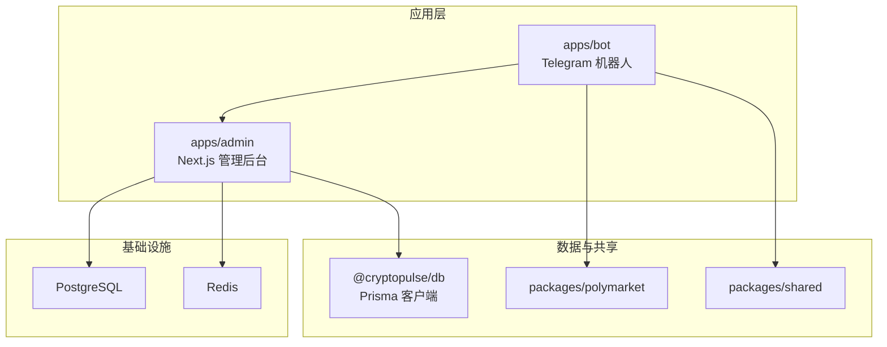
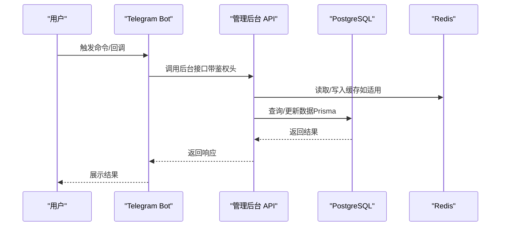
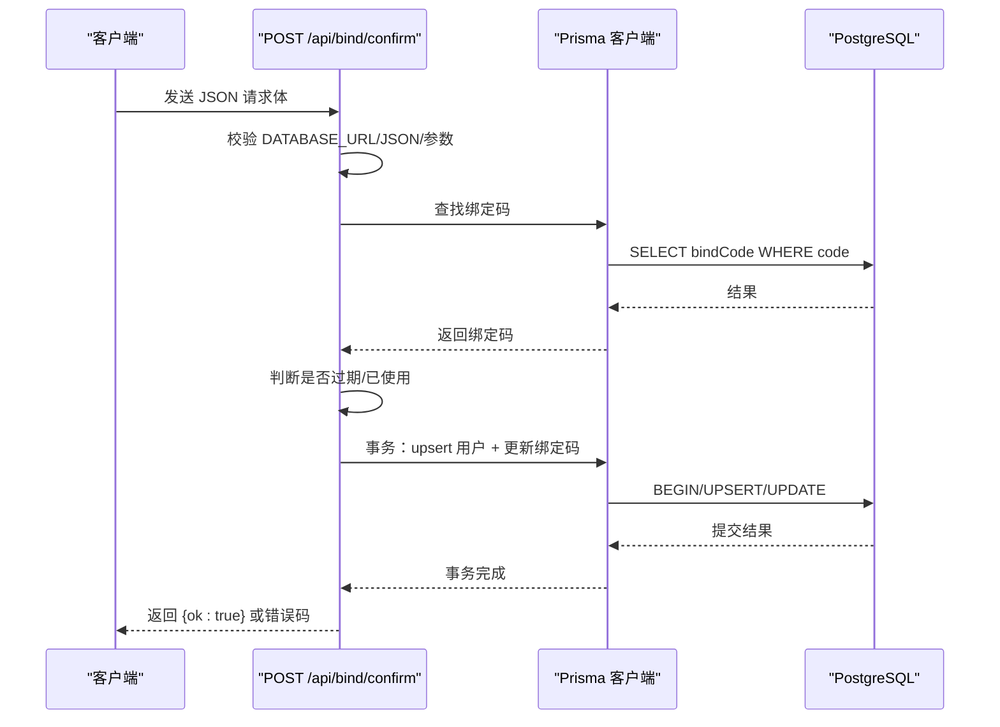
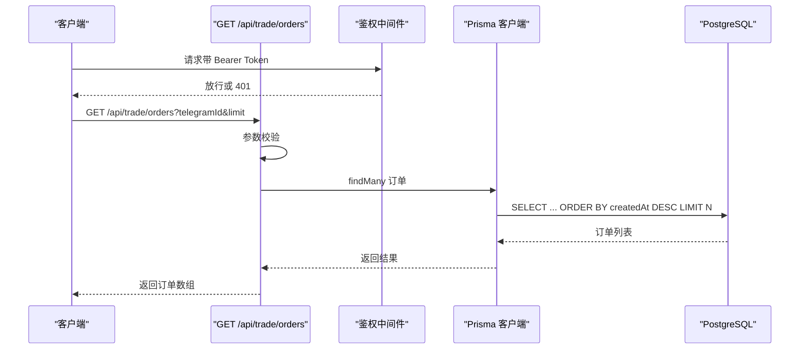
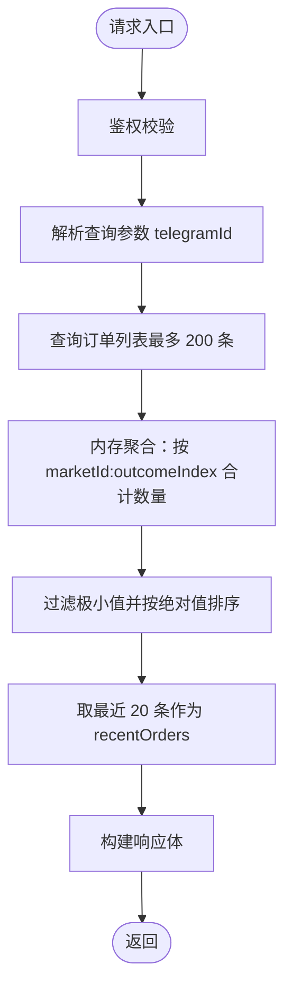
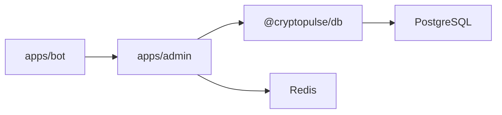

# 性能优化

<cite>
**本文引用的文件**
- [README.md](file://README.md)
- [package.json](file://package.json)
- [docker-compose.yml](file://docker-compose.yml)
- [apps/admin/next.config.ts](file://apps/admin/next.config.ts)
- [apps/admin/middleware.ts](file://apps/admin/middleware.ts)
- [apps/admin/app/api/bind/confirm/route.ts](file://apps/admin/app/api/bind/confirm/route.ts)
- [apps/admin/app/api/trade/portfolio/route.ts](file://apps/admin/app/api/trade/portfolio/route.ts)
- [apps/admin/app/api/trade/orders/route.ts](file://apps/admin/app/api/trade/orders/route.ts)
- [apps/admin/app/bind/actions.ts](file://apps/admin/app/bind/actions.ts)
- [packages/db/package.json](file://packages/db/package.json)
- [packages/db/prisma/schema.prisma](file://packages/db/prisma/schema.prisma)
- [apps/bot/src/index.ts](file://apps/bot/src/index.ts)
</cite>

## 目录
1. [简介](#简介)
2. [项目结构](#项目结构)
3. [核心组件](#核心组件)
4. [架构总览](#架构总览)
5. [详细组件分析](#详细组件分析)
6. [依赖关系分析](#依赖关系分析)
7. [性能注意事项](#性能注意事项)
8. [故障排除指南](#故障排除指南)
9. [结论](#结论)
10. [附录](#附录)

## 简介
本指南面向 CryptoPulse 项目的性能优化与故障排除，聚焦以下方面：
- 识别系统性能瓶颈：CPU 使用率过高、内存泄漏、磁盘 I/O 问题
- 数据库查询性能优化：索引优化、查询计划分析、连接池调优
- 前端性能优化：代码分割、懒加载、缓存策略
- Next.js 应用性能优化：静态生成、增量静态再生、预渲染配置
- Polymarket API 调用优化与批量请求处理策略
- 性能监控工具：指标采集、基准测试、压力测试
- 缓存策略：Redis 缓存与浏览器缓存配置与优化

## 项目结构
项目采用多包工作区（monorepo）组织，包含：
- apps/admin：Next.js 管理后台应用
- apps/bot：Telegram 机器人应用
- packages/db：基于 Prisma 的数据库模型与客户端
- packages/polymarket、packages/shared：共享模块与 Polymarket 相关能力（当前仓库未包含具体实现）

图表来源
- [package.json](file://package.json#L1-L18)
- [apps/admin/next.config.ts](file://apps/admin/next.config.ts#L1-L30)
- [packages/db/package.json](file://packages/db/package.json#L1-L22)
- [docker-compose.yml](file://docker-compose.yml#L1-L24)

章节来源
- [README.md](file://README.md#L1-L65)
- [package.json](file://package.json#L1-L18)
- [docker-compose.yml](file://docker-compose.yml#L1-L24)

## 核心组件
- Next.js 管理后台（apps/admin）
  - 中间件用于鉴权与路由控制
  - API 路由处理绑定确认、交易订单与组合查询等业务
  - 构建配置启用实验性功能与打包优化
- 机器人应用（apps/bot）
  - 基于 grammy 的 Telegram Bot，负责用户交互与调用管理后台 API
- 数据层（packages/db）
  - Prisma schema 定义用户、绑定码、交易订单等模型
  - 提供 Prisma 客户端供应用层使用

章节来源
- [apps/admin/middleware.ts](file://apps/admin/middleware.ts#L1-L23)
- [apps/admin/app/api/bind/confirm/route.ts](file://apps/admin/app/api/bind/confirm/route.ts#L1-L91)
- [apps/admin/app/api/trade/orders/route.ts](file://apps/admin/app/api/trade/orders/route.ts#L1-L74)
- [apps/admin/app/api/trade/portfolio/route.ts](file://apps/admin/app/api/trade/portfolio/route.ts#L1-L80)
- [apps/admin/next.config.ts](file://apps/admin/next.config.ts#L1-L30)
- [packages/db/prisma/schema.prisma](file://packages/db/prisma/schema.prisma#L1-L56)
- [apps/bot/src/index.ts](file://apps/bot/src/index.ts#L1-L156)

## 架构总览
下图展示了从 Telegram 用户到管理后台 API，再到数据库与缓存的整体调用链路。

图表来源
- [apps/bot/src/index.ts](file://apps/bot/src/index.ts#L1-L156)
- [apps/admin/app/api/trade/orders/route.ts](file://apps/admin/app/api/trade/orders/route.ts#L1-L74)
- [packages/db/prisma/schema.prisma](file://packages/db/prisma/schema.prisma#L1-L56)
- [docker-compose.yml](file://docker-compose.yml#L1-L24)

## 详细组件分析

### 组件一：绑定确认 API（bind/confirm）
该 API 处理绑定码校验与用户地址信息的 upsert，涉及事务与多表更新，是典型的高并发写入场景。

图表来源
- [apps/admin/app/api/bind/confirm/route.ts](file://apps/admin/app/api/bind/confirm/route.ts#L1-L91)
- [packages/db/prisma/schema.prisma](file://packages/db/prisma/schema.prisma#L10-L34)

章节来源
- [apps/admin/app/api/bind/confirm/route.ts](file://apps/admin/app/api/bind/confirm/route.ts#L1-L91)
- [apps/admin/app/bind/actions.ts](file://apps/admin/app/bind/actions.ts#L1-L90)

### 组件二：交易订单查询 API（trade/orders）
该 API 支持分页与授权校验，返回用户最近的交易订单列表。

图表来源
- [apps/admin/app/api/trade/orders/route.ts](file://apps/admin/app/api/trade/orders/route.ts#L1-L74)
- [packages/db/prisma/schema.prisma](file://packages/db/prisma/schema.prisma#L36-L54)

章节来源
- [apps/admin/app/api/trade/orders/route.ts](file://apps/admin/app/api/trade/orders/route.ts#L1-L74)

### 组件三：交易组合查询 API（trade/portfolio）
该 API 返回用户的持仓汇总与最近订单，包含内存中的聚合逻辑。

图表来源
- [apps/admin/app/api/trade/portfolio/route.ts](file://apps/admin/app/api/trade/portfolio/route.ts#L1-L80)

章节来源
- [apps/admin/app/api/trade/portfolio/route.ts](file://apps/admin/app/api/trade/portfolio/route.ts#L1-L80)

### 组件四：Next.js 构建与运行配置
- 实验性配置：启用服务端动作的请求体大小限制
- Webpack 忽略项：减少无关文件监听，降低开发时 I/O 压力
- 包转译：对共享包进行编译以提升兼容性

章节来源
- [apps/admin/next.config.ts](file://apps/admin/next.config.ts#L1-L30)

### 组件五：中间件鉴权
- 对 /admin 路径进行鉴权拦截，生产环境强制校验 Cookie 令牌
- 开发环境可无令牌访问，便于调试

章节来源
- [apps/admin/middleware.ts](file://apps/admin/middleware.ts#L1-L23)

### 组件六：数据库模型与索引
- 用户模型：以 telegramId 为主键，具备语言、地址字段与时间戳
- 绑定码模型：code 唯一键，关联用户
- 交易订单模型：具备复合索引，支持按 telegramId+createdAt、marketId+outcomeIndex 查询

章节来源
- [packages/db/prisma/schema.prisma](file://packages/db/prisma/schema.prisma#L10-L54)

## 依赖关系分析
- 应用依赖
  - apps/admin 依赖 @cryptopulse/db 提供的 Prisma 客户端
  - apps/bot 通过管理后台 API 间接依赖数据库与缓存
- 数据库与缓存
  - PostgreSQL 用于持久化用户、绑定码与交易订单
  - Redis 用于会话/缓存（容器已部署）

图表来源
- [apps/admin/next.config.ts](file://apps/admin/next.config.ts#L1-L30)
- [packages/db/package.json](file://packages/db/package.json#L1-L22)
- [docker-compose.yml](file://docker-compose.yml#L1-L24)

章节来源
- [package.json](file://package.json#L1-L18)
- [docker-compose.yml](file://docker-compose.yml#L1-L24)

## 性能注意事项
- 数据库查询
  - 已有复合索引，建议结合 EXPLAIN/EXPLAIN ANALYZE 分析高频查询路径
  - 控制单次查询返回量（如 orders 接口的 take/limit），避免一次性拉取大量数据
- 连接池与事务
  - Prisma 默认连接池适配生产环境，建议根据并发与 QPS 调整最大连接数与空闲连接数
  - 将高并发写入（如绑定确认）放入事务，确保一致性的同时注意锁竞争
- 缓存策略
  - Redis 可用于热点数据（如用户最近订单、市场概览）短期缓存，设置合理过期时间
  - 浏览器端可利用 HTTP 缓存头与 ETag/If-None-Match 减少重复请求
- 前端性能
  - 使用代码分割与动态导入，延迟加载非首屏组件
  - 图片与静态资源开启压缩与合适的格式（WebP/AVIF），并配置 CDN
- Next.js 优化
  - 静态生成（SSG）与增量静态再生（ISR）用于内容类页面
  - 预渲染与服务端渲染（SSR）用于需要实时数据的页面
  - 关闭不必要的实验特性，仅启用确有收益的功能
- Polymarket API 调用
  - 合理设置超时与重试退避，避免阻塞主线程
  - 对批量请求进行分批与去重，合并相同请求
- 监控与压测
  - 使用性能指标（CPU、内存、GC、QPS、P95/P99 延迟、错误率）
  - 基准测试与压力测试验证容量与瓶颈点

## 故障排除指南

### 1. CPU 使用率过高
- 症状
  - API 响应变慢、进程 CPU 占用高
- 排查步骤
  - 使用性能分析工具定位热点函数（如 Node.js Profiler）
  - 检查是否存在大循环或高复杂度计算（如 portfolio 接口的内存聚合）
  - 关注数据库慢查询与锁等待
- 优化建议
  - 将内存聚合逻辑迁移至数据库侧（如使用 SQL 聚合）
  - 限制单次查询返回条目上限
  - 引入 Redis 缓存热点数据，减少重复计算

章节来源
- [apps/admin/app/api/trade/portfolio/route.ts](file://apps/admin/app/api/trade/portfolio/route.ts#L49-L59)

### 2. 内存泄漏
- 症状
  - RSS 持续增长、频繁 GC、OOM
- 排查步骤
  - 使用堆快照对比，定位未释放对象
  - 检查长生命周期对象（全局缓存、定时器、事件监听）
- 优化建议
  - 清理定时器与事件监听
  - 控制缓存大小与过期策略，避免无限增长
  - 对大对象进行分页处理，避免一次性加载

### 3. 磁盘 I/O 问题
- 症状
  - 磁盘读写飙升、IOPS 抖动
- 排查步骤
  - 监控 PostgreSQL WAL 与表扫描情况
  - 检查是否存在全表扫描或缺少索引导致的 I/O
- 优化建议
  - 为高频查询列建立合适索引（参考现有复合索引）
  - 使用只读副本分担读负载
  - 合理设置数据库缓冲区与共享内存

### 4. 数据库查询性能优化
- 索引优化
  - 已有按 telegramId+createdAt、marketId+outcomeIndex 的索引
  - 针对高频查询条件补充覆盖索引，减少回表
- 查询计划分析
  - 使用 EXPLAIN/EXPLAIN ANALYZE 分析慢查询
  - 关注排序与过滤成本，必要时调整索引顺序
- 连接池调优
  - 根据并发与 QPS 调整最大连接数、空闲连接数与超时
  - 避免长事务，及时提交或回滚

章节来源
- [packages/db/prisma/schema.prisma](file://packages/db/prisma/schema.prisma#L52-L54)

### 5. 前端性能优化
- 代码分割与懒加载
  - 对非首屏组件使用动态导入
  - 将第三方库拆分，避免主包过大
- 缓存策略
  - HTTP 缓存头与 ETag
  - 浏览器存储（localStorage/sessionStorage）缓存轻量数据
- 图片与静态资源
  - 使用现代格式与压缩
  - 配置 CDN 与缓存策略

### 6. Next.js 应用性能优化
- 静态生成（SSG）与增量静态再生（ISR）
  - 对内容稳定页面使用 SSG/ISR，降低 SSR 压力
- 预渲染与服务端渲染（SSR）
  - 对需要实时数据的页面使用 SSR，并开启 React 缓存
- 构建与运行
  - 保持 next.config.ts 的实验性配置最小化
  - 使用包转译与忽略无关文件，减少开发时 I/O

章节来源
- [apps/admin/next.config.ts](file://apps/admin/next.config.ts#L1-L30)

### 7. Polymarket API 调用优化与批量请求
- 超时与重试
  - 设置合理超时与指数退避重试
- 批量请求
  - 合并相同请求，分批发送，避免重复调用
- 缓存
  - 对相同查询结果进行短期缓存，减少外部依赖压力

章节来源
- [apps/bot/src/index.ts](file://apps/bot/src/index.ts#L1-L156)

### 8. 性能监控与压测
- 指标采集
  - CPU、内存、GC、QPS、P95/P99 延迟、错误率
- 基准测试
  - 使用压测工具模拟峰值流量，识别瓶颈
- 压力测试
  - 逐步加压，观察系统在极限下的表现与恢复能力

### 9. 缓存策略配置与优化
- Redis 缓存
  - 热点数据短期缓存，设置过期时间与淘汰策略
  - 使用命名空间隔离不同业务数据
- 浏览器缓存
  - 合理设置 Cache-Control、ETag
  - 对静态资源启用长期缓存与版本化

## 结论
本指南从系统架构、数据库设计、API 行为与前端配置等多个维度出发，提供了针对 CryptoPulse 项目的性能优化与故障排除实践。建议优先解决数据库索引缺失与查询范围过大问题，配合缓存与连接池调优，再结合前端与 Next.js 的工程化优化，最终形成完整的性能保障体系。

## 附录
- 环境与依赖
  - Node.js 20+、PostgreSQL 14+、Redis 6+
  - Prisma 客户端与数据库迁移脚本
- 运行与开发
  - 管理后台本地运行与 Telegram Bot 运行方式
  - Docker Compose 提供 Postgres 与 Redis 服务

章节来源
- [README.md](file://README.md#L1-L65)
- [docker-compose.yml](file://docker-compose.yml#L1-L24)
- [packages/db/package.json](file://packages/db/package.json#L1-L22)