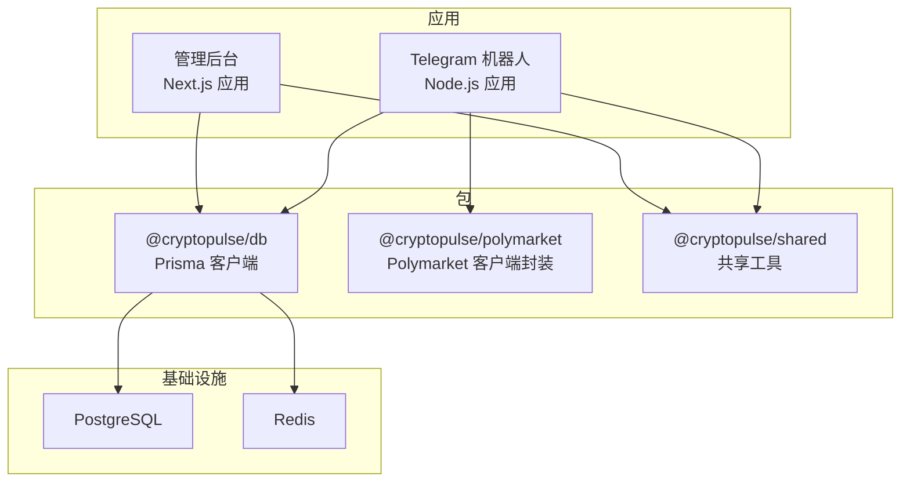
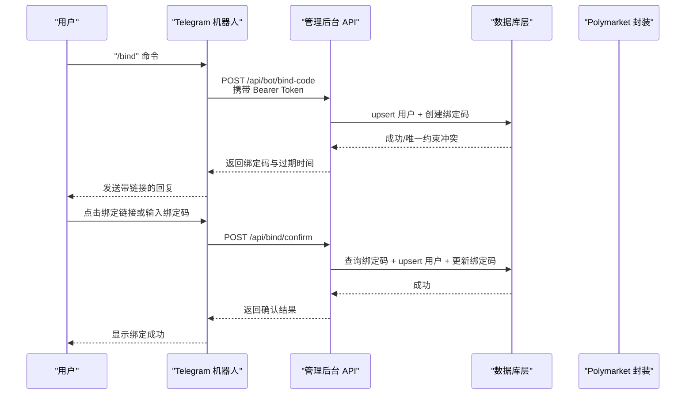
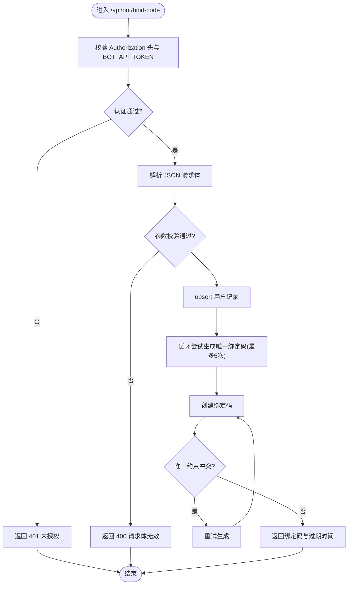
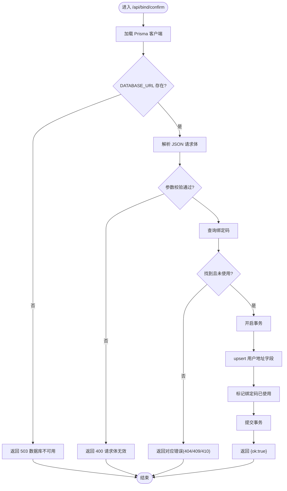
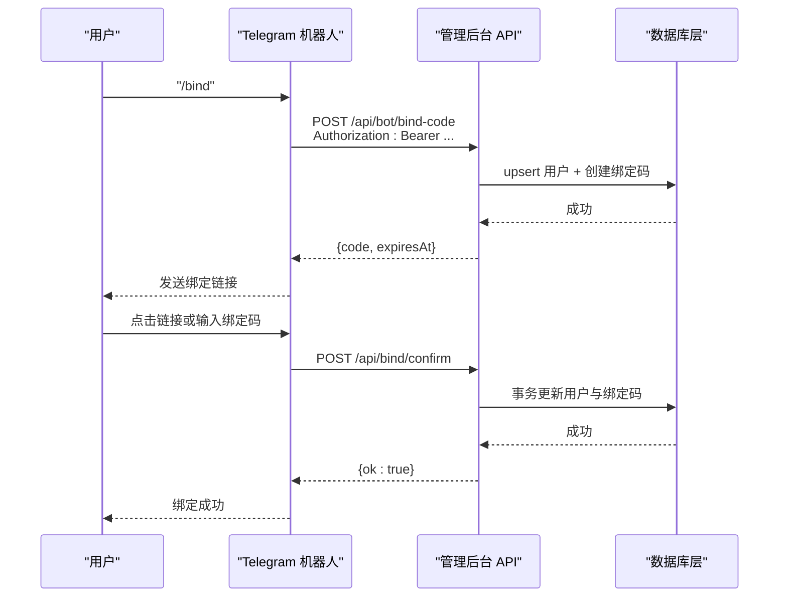
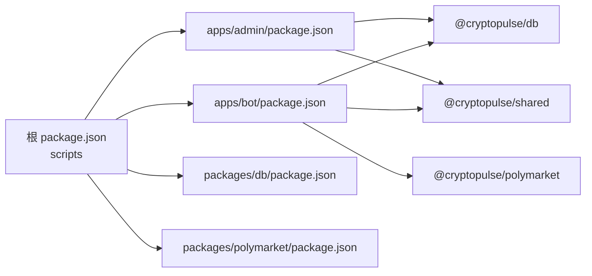

# 故障排除

<cite>
**本文引用的文件**
- [README.md](file://README.md)
- [.env.example](file://.env.example)
- [docker-compose.yml](file://docker-compose.yml)
- [package.json](file://package.json)
- [apps/admin/package.json](file://apps/admin/package.json)
- [apps/bot/package.json](file://apps/bot/package.json)
- [packages/db/package.json](file://packages/db/package.json)
- [packages/polymarket/package.json](file://packages/polymarket/package.json)
- [apps/admin/app/api/bind/confirm/route.ts](file://apps/admin/app/api/bind/confirm/route.ts)
- [apps/admin/app/api/bot/bind-code/route.ts](file://apps/admin/app/api/bot/bind-code/route.ts)
- [apps/admin/middleware.ts](file://apps/admin/middleware.ts)
- [packages/db/src/index.ts](file://packages/db/src/index.ts)
- [packages/polymarket/src/index.ts](file://packages/polymarket/src/index.ts)
- [apps/bot/src/env.ts](file://apps/bot/src/env.ts)
- [apps/bot/src/index.ts](file://apps/bot/src/index.ts)
</cite>

## 目录
1. [简介](#简介)
2. [项目结构](#项目结构)
3. [核心组件](#核心组件)
4. [架构总览](#架构总览)
5. [详细组件分析](#详细组件分析)
6. [依赖关系分析](#依赖关系分析)
7. [性能考虑](#性能考虑)
8. [故障排除指南](#故障排除指南)
9. [结论](#结论)
10. [附录](#附录)

## 简介
本指南面向 CryptoPulse 预测机器人项目的运维与开发人员，聚焦于常见问题的诊断与解决，覆盖环境配置、数据库连接、API 调用错误、日志分析、性能优化、系统监控与告警、网络连接（防火墙、代理、DNS）、第三方服务集成（Polymarket API、Telegram Bot API、区块链网络）以及调试与开发环境排障。文档以仓库现有代码与配置为依据，提供可操作的排查步骤与最佳实践。

## 项目结构
项目采用多包工作区（monorepo）组织方式，包含管理后台（Next.js）、Telegram 机器人（Node.js）、数据库层（Prisma）、Polymarket 交互封装等模块，并通过 Docker Compose 提供本地 Postgres 与 Redis 服务。

图表来源
- [package.json](file://package.json#L1-L18)
- [apps/admin/package.json](file://apps/admin/package.json#L1-L42)
- [apps/bot/package.json](file://apps/bot/package.json#L1-L26)
- [packages/db/package.json](file://packages/db/package.json#L1-L22)
- [packages/polymarket/package.json](file://packages/polymarket/package.json#L1-L23)
- [docker-compose.yml](file://docker-compose.yml#L1-L24)

章节来源
- [package.json](file://package.json#L1-L18)
- [docker-compose.yml](file://docker-compose.yml#L1-L24)

## 核心组件
- 管理后台 API：负责绑定确认、生成绑定码、用户与绑定码数据持久化。
- Telegram 机器人：处理命令、回调、搜索、下单、查询持仓等。
- 数据库层：统一的 Prisma 客户端，集中日志级别与连接管理。
- Polymarket 封装：暴露链 ID、CLOB 主机、WS、Relayer、RPC 等环境配置类型。

章节来源
- [apps/admin/app/api/bind/confirm/route.ts](file://apps/admin/app/api/bind/confirm/route.ts#L1-L91)
- [apps/admin/app/api/bot/bind-code/route.ts](file://apps/admin/app/api/bot/bind-code/route.ts#L1-L105)
- [apps/bot/src/index.ts](file://apps/bot/src/index.ts#L1-L156)
- [packages/db/src/index.ts](file://packages/db/src/index.ts#L1-L13)
- [packages/polymarket/src/index.ts](file://packages/polymarket/src/index.ts#L1-L11)

## 架构总览
下图展示了从 Telegram 用户到管理后台 API、数据库与 Polymarket 的典型调用路径，以及机器人侧的错误捕获与日志输出。

图表来源
- [apps/bot/src/index.ts](file://apps/bot/src/index.ts#L57-L89)
- [apps/admin/app/api/bot/bind-code/route.ts](file://apps/admin/app/api/bot/bind-code/route.ts#L34-L102)
- [apps/admin/app/api/bind/confirm/route.ts](file://apps/admin/app/api/bind/confirm/route.ts#L21-L88)
- [packages/db/src/index.ts](file://packages/db/src/index.ts#L1-L13)

## 详细组件分析

### 组件 A：绑定流程 API（管理后台）
- 功能要点
  - 生成绑定码：校验授权头、upsert 用户、循环尝试生成唯一绑定码、设置过期时间。
  - 绑定确认：校验绑定码存在性、是否已使用、是否过期，事务更新用户与绑定码。
- 关键错误码
  - 未设置数据库连接：返回服务不可用。
  - Prisma 不可用：返回服务不可用。
  - JSON 解析失败：返回请求体无效。
  - 参数校验失败：返回请求体无效。
  - 绑定码不存在/已使用/已过期：返回对应状态。
  - 其他异常：返回服务器内部错误。
- 性能与可靠性
  - 绑定码生成包含最多五次重试以规避唯一约束冲突。
  - 使用数据库事务保证用户与绑定码状态一致性。

图表来源
- [apps/admin/app/api/bot/bind-code/route.ts](file://apps/admin/app/api/bot/bind-code/route.ts#L34-L102)

章节来源
- [apps/admin/app/api/bot/bind-code/route.ts](file://apps/admin/app/api/bot/bind-code/route.ts#L1-L105)

图表来源
- [apps/admin/app/api/bind/confirm/route.ts](file://apps/admin/app/api/bind/confirm/route.ts#L21-L88)

章节来源
- [apps/admin/app/api/bind/confirm/route.ts](file://apps/admin/app/api/bind/confirm/route.ts#L1-L91)

### 组件 B：Telegram 机器人
- 功能要点
  - 命令与回调处理：/start、/search、/portfolio、gen_bind、分类浏览、事件详情、购买与下单、取消订单、查看持仓。
  - 绑定流程：向管理后台发起生成绑定码请求，构造网页绑定链接并发送给用户。
  - 错误捕获：全局捕获机器人运行时错误并记录日志。
- 关键配置
  - TELEGRAM_BOT_TOKEN、API_BASE_URL、WEB_BASE_URL、BOT_API_TOKEN、DATABASE_URL、REDIS_URL。
- 可能问题
  - 缺少 TELEGRAM_BOT_TOKEN 导致无法启动。
  - API_BASE_URL/WEB_BASE_URL 不可达导致绑定链接失效。
  - 机器人命令响应慢或失败，检查网络与日志。

图表来源
- [apps/bot/src/index.ts](file://apps/bot/src/index.ts#L57-L89)
- [apps/admin/app/api/bot/bind-code/route.ts](file://apps/admin/app/api/bot/bind-code/route.ts#L34-L102)
- [apps/admin/app/api/bind/confirm/route.ts](file://apps/admin/app/api/bind/confirm/route.ts#L21-L88)

章节来源
- [apps/bot/src/index.ts](file://apps/bot/src/index.ts#L1-L156)
- [apps/bot/src/env.ts](file://apps/bot/src/env.ts#L1-L14)

### 组件 C：数据库层（Prisma）
- 日志级别
  - 默认启用 error 与 warn 级别日志，便于定位异常与警告。
- 连接与生命周期
  - 使用全局单例模式避免重复实例化，减少资源消耗。
- 常见问题
  - DATABASE_URL 为空或格式错误导致 Prisma 初始化失败。
  - 迁移未部署或版本不一致导致连接异常。

章节来源
- [packages/db/src/index.ts](file://packages/db/src/index.ts#L1-L13)

### 组件 D：Polymarket 封装
- 职责
  - 暴露 Polymarket 环境配置类型（chainId、clobHost、wsUrl、relayerUrl、rpcUrl），便于上层读取。
- 常见问题
  - POLYMARKET_* 环境变量缺失或错误导致客户端初始化失败。
  - RPC 地址不可达或 WS 订阅失败影响实时行情与下单。

章节来源
- [packages/polymarket/src/index.ts](file://packages/polymarket/src/index.ts#L1-L11)

## 依赖关系分析
- 工作区脚本
  - 通过根目录脚本统一启动管理后台与机器人，便于联调。
- 包依赖
  - 管理后台依赖数据库与共享包；机器人依赖数据库、Polymarket 封装与共享包。
- 外部服务
  - Postgres 与 Redis 通过 Docker Compose 提供；Polymarket 服务由外部提供。

图表来源
- [package.json](file://package.json#L8-L15)
- [apps/admin/package.json](file://apps/admin/package.json#L14-L24)
- [apps/bot/package.json](file://apps/bot/package.json#L12-L18)

章节来源
- [package.json](file://package.json#L1-L18)
- [apps/admin/package.json](file://apps/admin/package.json#L1-L42)
- [apps/bot/package.json](file://apps/bot/package.json#L1-L26)
- [packages/db/package.json](file://packages/db/package.json#L1-L22)
- [packages/polymarket/package.json](file://packages/polymarket/package.json#L1-L23)

## 性能考虑
- 数据库查询优化
  - 绑定码查询与 upsert 操作应确保在 code 与 telegramId 上建立索引（Prisma 模型层面）。
  - 事务内批量写入减少往返次数，降低锁竞争。
- 缓存策略
  - 对热点搜索结果与分类列表进行短期缓存（Redis），降低 Polymarket API 压力与延迟。
  - 机器人消息去抖与合并回复，减少 Telegram API 调用频率。
- 网络延迟处理
  - 为外部 API（Polymarket、Telegram）设置合理的超时与重试策略，避免阻塞主线程。
  - 使用连接池与并发限制控制数据库与外部服务的负载。
- 日志与可观测性
  - 启用 SENTRY_DSN（如需）收集前端与后端异常，结合服务端日志定位性能瓶颈。

## 故障排除指南

### 环境配置问题
- 症状
  - 启动时报错缺少环境变量或连接字符串无效。
- 排查步骤
  - 复制示例环境文件并按需填写：参考示例文件中的各项配置项。
  - 确认 NODE_ENV、DATABASE_URL、REDIS_URL、TELEGRAM_BOT_TOKEN、API_BASE_URL、WEB_BASE_URL、POLYMARKET_* 等均正确设置。
  - 若使用 Docker Compose，确认容器已启动且端口映射正常。
- 相关文件
  - 示例环境变量与默认值：[.env.example](file://.env.example#L1-L43)
  - Docker Compose 服务定义：[docker-compose.yml](file://docker-compose.yml#L1-L24)

章节来源
- [.env.example](file://.env.example#L1-L43)
- [docker-compose.yml](file://docker-compose.yml#L1-L24)

### 数据库连接问题
- 症状
  - API 返回“数据库不可用”或 Prisma 初始化失败。
- 排查步骤
  - 确认 DATABASE_URL 正确指向可用的 PostgreSQL 实例（本地或远程）。
  - 若首次运行，先生成 Prisma 客户端并执行迁移。
  - 查看 Prisma 日志级别是否包含 error/warn，定位具体错误。
- 相关文件
  - Prisma 客户端初始化与日志级别：[packages/db/src/index.ts](file://packages/db/src/index.ts#L1-L13)
  - 管理后台 API 中对 DATABASE_URL 的检查与错误返回：[apps/admin/app/api/bot/bind-code/route.ts](file://apps/admin/app/api/bot/bind-code/route.ts#L46-L48)、[apps/admin/app/api/bind/confirm/route.ts](file://apps/admin/app/api/bind/confirm/route.ts#L22-L24)

章节来源
- [packages/db/src/index.ts](file://packages/db/src/index.ts#L1-L13)
- [apps/admin/app/api/bot/bind-code/route.ts](file://apps/admin/app/api/bot/bind-code/route.ts#L46-L48)
- [apps/admin/app/api/bind/confirm/route.ts](file://apps/admin/app/api/bind/confirm/route.ts#L22-L24)

### API 调用错误
- 症状
  - 生成绑定码或确认绑定返回 4xx/5xx 错误。
- 排查步骤
  - 校验 Authorization 头与 BOT_API_TOKEN 是否匹配；生产环境未设置 TOKEN 将拒绝访问。
  - 检查请求体 JSON 格式与字段校验是否通过。
  - 绑定码是否存在、是否已使用、是否过期。
  - 事务执行失败时回滚并返回服务器错误。
- 相关文件
  - 绑定码生成接口：[apps/admin/app/api/bot/bind-code/route.ts](file://apps/admin/app/api/bot/bind-code/route.ts#L34-L102)
  - 绑定确认接口：[apps/admin/app/api/bind/confirm/route.ts](file://apps/admin/app/api/bind/confirm/route.ts#L21-L88)

章节来源
- [apps/admin/app/api/bot/bind-code/route.ts](file://apps/admin/app/api/bot/bind-code/route.ts#L1-L105)
- [apps/admin/app/api/bind/confirm/route.ts](file://apps/admin/app/api/bind/confirm/route.ts#L1-L91)

### 错误日志分析方法
- 日志级别
  - Prisma 默认记录 error 与 warn，有助于快速发现异常与警告。
- 关键信息
  - 绑定流程：关注绑定码生成重试、唯一约束冲突、事务提交状态。
  - 机器人：关注命令处理、回调查询、错误捕获与日志输出。
- 排查步骤
  - 结合 API 返回的错误码与服务端日志定位问题。
  - 使用 SENTRY_DSN（如启用）收集前端与后端异常，统一检索。
- 相关文件
  - Prisma 日志配置：[packages/db/src/index.ts](file://packages/db/src/index.ts#L7-L9)
  - 机器人错误捕获：[apps/bot/src/index.ts](file://apps/bot/src/index.ts#L150-L152)

章节来源
- [packages/db/src/index.ts](file://packages/db/src/index.ts#L1-L13)
- [apps/bot/src/index.ts](file://apps/bot/src/index.ts#L150-L152)

### 性能问题识别与优化
- 识别手段
  - 观察 API 响应时间与错误率，定位慢查询与高并发场景。
  - 监控数据库连接数、Redis 命中率与外部 API 延迟。
- 优化建议
  - 为高频查询字段建立索引；合并事务写入；引入 Redis 缓存热点数据。
  - 为外部 API 设置超时与指数退避重试；限制并发与队列长度。
- 相关文件
  - 绑定码生成的重试逻辑与事务写入：[apps/admin/app/api/bot/bind-code/route.ts](file://apps/admin/app/api/bot/bind-code/route.ts#L83-L97)、[apps/admin/app/api/bot/bind-code/route.ts](file://apps/admin/app/api/bot/bind-code/route.ts#L72-L79)
  - 绑定确认事务：[apps/admin/app/api/bind/confirm/route.ts](file://apps/admin/app/api/bind/confirm/route.ts#L64-L83)

章节来源
- [apps/admin/app/api/bot/bind-code/route.ts](file://apps/admin/app/api/bot/bind-code/route.ts#L72-L97)
- [apps/admin/app/api/bind/confirm/route.ts](file://apps/admin/app/api/bind/confirm/route.ts#L64-L83)

### 系统监控与告警配置
- 关键指标
  - API 响应时间与错误率、数据库连接数、Redis 命中率、外部服务可用性。
- 异常检测
  - 基于日志与 SENTRY 收集的异常进行阈值告警。
- 自动恢复
  - 重启失败的服务容器；重试失败的任务；降级非关键功能。
- 相关文件
  - SENTRY_DSN 配置项：[.env.example](file://.env.example#L41-L43)

章节来源
- [.env.example](file://.env.example#L41-L43)

### 网络连接问题排查
- 防火墙与代理
  - 确认本地/服务器出站流量允许访问 Polymarket 服务域名与端口。
  - 如需，配置代理以绕过网络限制。
- 代理设置
  - 为 Prisma 引擎下载设置镜像源（参考根 README 的说明）。
- DNS 解析
  - 使用 nslookup/dig 检查域名解析；必要时更换 DNS 服务器。
- 相关文件
  - Prisma 引擎镜像说明：[README.md](file://README.md#L13-L18)

章节来源
- [README.md](file://README.md#L13-L18)

### 第三方服务集成问题
- Polymarket API
  - 确认 POLYMARKET_* 环境变量正确，尤其是链 ID、CLOB 主机、WS、Relayer、RPC。
  - 检查 RPC 与 WS 是否可达，关注订阅与请求超时。
- Telegram Bot API
  - 确认 TELEGRAM_BOT_TOKEN 有效；检查 API_BASE_URL/WEB_BASE_URL 可达。
  - 关注机器人命令与回调处理日志，定位失败原因。
- 区块链网络连接
  - 校验 RPC URL 可用性；必要时切换至备用节点。
- 相关文件
  - 环境变量定义：[.env.example](file://.env.example#L18-L31)
  - 机器人环境校验：[apps/bot/src/env.ts](file://apps/bot/src/env.ts#L3-L10)
  - Polymarket 类型导出：[packages/polymarket/src/index.ts](file://packages/polymarket/src/index.ts#L3-L9)

章节来源
- [.env.example](file://.env.example#L18-L31)
- [apps/bot/src/env.ts](file://apps/bot/src/env.ts#L1-L14)
- [packages/polymarket/src/index.ts](file://packages/polymarket/src/index.ts#L1-L11)

### 调试工具与开发环境排障
- 开发脚本
  - 使用根脚本统一启动管理后台与机器人，便于联调。
- 端口与路由
  - 管理后台默认端口 3000；确认未被占用。
- 管理员鉴权
  - 开发环境未设置 ADMIN_TOKEN 时可直接访问管理后台；生产环境必须设置。
- 相关文件
  - 根脚本与端口：[package.json](file://package.json#L8-L15)、[apps/admin/package.json](file://apps/admin/package.json#L6-L8)
  - 管理员中间件：[apps/admin/middleware.ts](file://apps/admin/middleware.ts#L1-L23)

章节来源
- [package.json](file://package.json#L8-L15)
- [apps/admin/package.json](file://apps/admin/package.json#L6-L8)
- [apps/admin/middleware.ts](file://apps/admin/middleware.ts#L1-L23)

## 结论
本指南基于仓库现有代码与配置，提供了从环境配置、数据库连接、API 调用、日志分析到性能优化、监控告警与网络/第三方服务问题的系统化排障方法。建议在开发与生产环境中持续完善日志与监控体系，结合缓存与重试策略提升稳定性与用户体验。

## 附录
- 快速检查清单
  - 环境变量齐全且格式正确（DATABASE_URL、REDIS_URL、TELEGRAM_BOT_TOKEN、API_BASE_URL、WEB_BASE_URL、POLYMARKET_*）。
  - Prisma 客户端生成与迁移已执行。
  - Docker Compose 服务已启动且端口映射正常。
  - 管理后台中间件与管理员令牌配置符合当前环境。
  - 机器人命令与回调日志可追踪，错误被捕获并记录。
  - 外部服务（Polymarket、Telegram）可访问，必要时配置代理与 DNS。