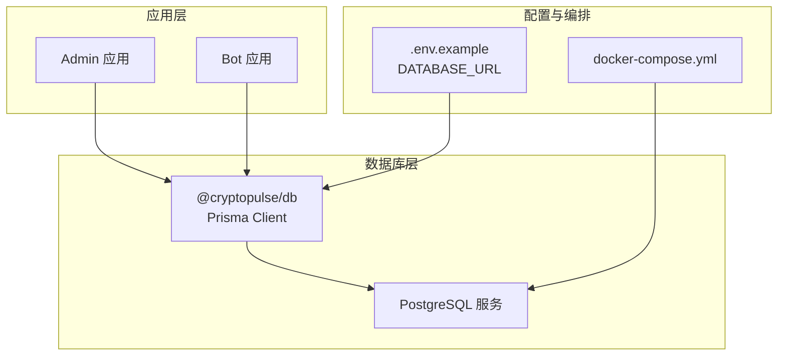
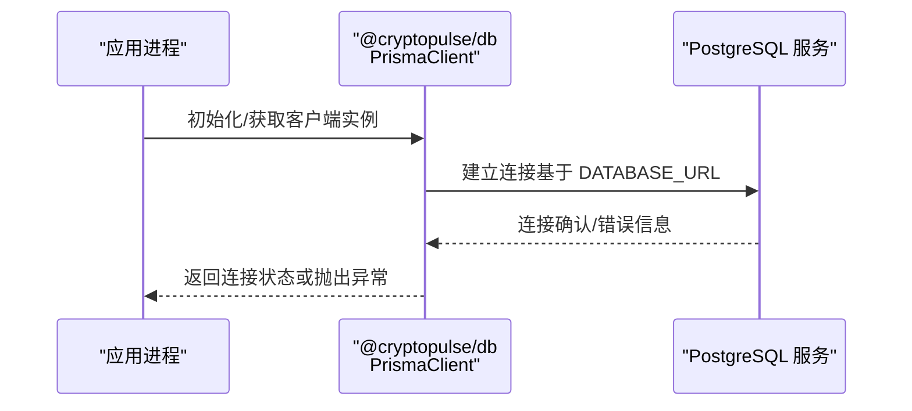
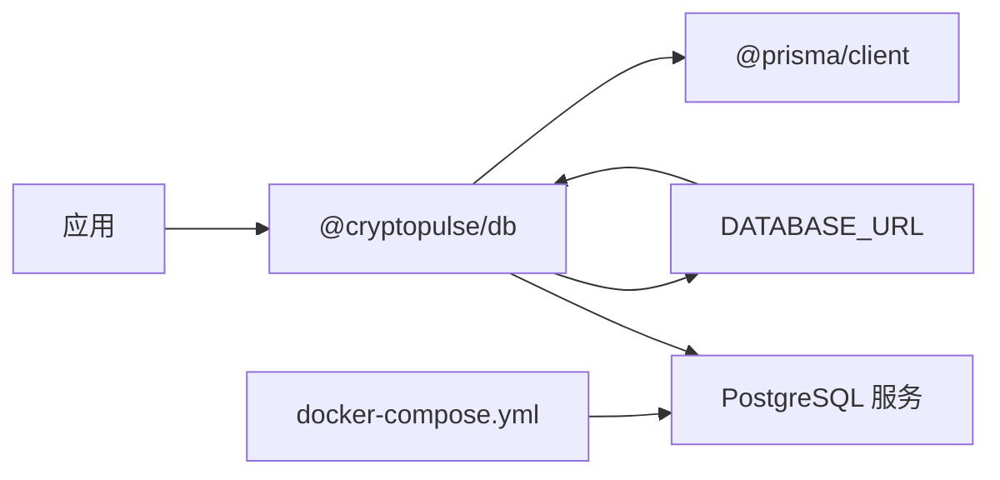

# 数据库连接问题

<cite>
**本文档引用的文件**
- [packages/db/src/index.ts](file://packages/db/src/index.ts)
- [packages/db/package.json](file://packages/db/package.json)
- [.env.example](file://.env.example)
- [docker-compose.yml](file://docker-compose.yml)
- [packages/db/prisma/migrations/migration_lock.toml](file://packages/db/prisma/migrations/migration_lock.toml)
</cite>

## 目录
1. [简介](#简介)
2. [项目结构](#项目结构)
3. [核心组件](#核心组件)
4. [架构总览](#架构总览)
5. [详细组件分析](#详细组件分析)
6. [依赖关系分析](#依赖关系分析)
7. [性能考虑](#性能考虑)
8. [故障排除指南](#故障排除指南)
9. [结论](#结论)

## 简介
本指南聚焦于 CryptoPulse 项目的数据库连接问题排查与修复，涵盖连接字符串格式、网络连通性、认证失败等常见问题；解释 Prisma ORM 连接池与超时参数的调优思路；提供数据库服务可用性检查方法（连接测试与健康检查）；说明迁移失败的诊断与修复流程；并给出 PostgreSQL 重启与权限配置的故障排除步骤，以及数据库性能监控与慢查询分析的实践建议。

## 项目结构
CryptoPulse 使用 monorepo 结构组织，数据库相关逻辑集中在 @cryptopulse/db 包中，通过 Prisma Client 提供统一的数据访问层。环境变量 DATABASE_URL 指定数据库连接信息，开发环境通过 docker-compose 启动本地 Postgres 与 Redis 服务。

**图表来源**
- [packages/db/src/index.ts](file://packages/db/src/index.ts#L1-L13)
- [.env.example](file://.env.example#L5-L6)
- [docker-compose.yml](file://docker-compose.yml#L1-L24)

**章节来源**
- [packages/db/src/index.ts](file://packages/db/src/index.ts#L1-L13)
- [.env.example](file://.env.example#L5-L6)
- [docker-compose.yml](file://docker-compose.yml#L1-L24)

## 核心组件
- 数据库客户端：@cryptopulse/db 包导出全局唯一的 PrismaClient 实例，用于执行数据库操作。
- 连接配置：通过环境变量 DATABASE_URL 提供连接字符串，包含协议、用户名、密码、主机、端口与数据库名。
- 开发环境：docker-compose 提供本地 Postgres 与 Redis 服务，默认账号密码与数据库名在 compose 文件中定义。
- 迁移锁：Prisma 迁移锁文件标识当前数据库提供商为 PostgreSQL。

**章节来源**
- [packages/db/src/index.ts](file://packages/db/src/index.ts#L1-L13)
- [.env.example](file://.env.example#L5-L6)
- [docker-compose.yml](file://docker-compose.yml#L2-L11)
- [packages/db/prisma/migrations/migration_lock.toml](file://packages/db/prisma/migrations/migration_lock.toml#L1-L2)

## 架构总览
下图展示了应用如何通过 Prisma Client 访问数据库，并由 docker-compose 提供本地 Postgres 服务支撑。

**图表来源**
- [packages/db/src/index.ts](file://packages/db/src/index.ts#L5-L11)
- [.env.example](file://.env.example#L5-L6)
- [docker-compose.yml](file://docker-compose.yml#L2-L11)

## 详细组件分析

### Prisma Client 初始化与日志
- 全局单例模式：通过全局对象缓存 PrismaClient 实例，避免重复初始化。
- 日志级别：启用 error 与 warn 级别日志，便于定位连接与执行异常。
- 连接字符串来源：从环境变量 DATABASE_URL 注入，确保与 docker-compose 中的 Postgres 配置一致。

**章节来源**
- [packages/db/src/index.ts](file://packages/db/src/index.ts#L1-L13)
- [.env.example](file://.env.example#L5-L6)

### 连接字符串格式校验清单
- 协议：必须为 postgresql://（或 postgres://），与 Prisma 文档一致。
- 用户名与密码：需与 docker-compose 中 POSTGRES_USER 与 POSTGRES_PASSWORD 对应。
- 主机与端口：默认 5432，需与 docker-compose 映射一致。
- 数据库名：需与 POSTGRES_DB 一致。
- 特殊字符：如密码包含特殊字符，需进行 URL 编码。

**章节来源**
- [.env.example](file://.env.example#L5-L6)
- [docker-compose.yml](file://docker-compose.yml#L4-L7)

### 迁移锁与迁移流程
- 迁移锁文件：标识当前数据库提供商为 PostgreSQL，防止多厂商混用导致的迁移冲突。
- 迁移命令：通过 @cryptopulse/db 包中的脚本触发 Prisma 迁移流程。

**章节来源**
- [packages/db/prisma/migrations/migration_lock.toml](file://packages/db/prisma/migrations/migration_lock.toml#L1-L2)
- [packages/db/package.json](file://packages/db/package.json#L10-L11)

## 依赖关系分析
- 应用对 @cryptopulse/db 的依赖：通过导入 PrismaClient 实例进行数据访问。
- @cryptopulse/db 对 Prisma 的依赖：使用 @prisma/client 作为运行时客户端。
- 环境变量对连接的影响：DATABASE_URL 决定连接目标与凭据。
- docker-compose 对服务可用性的保障：提供本地 Postgres 与 Redis。

**图表来源**
- [packages/db/src/index.ts](file://packages/db/src/index.ts#L1-L13)
- [packages/db/package.json](file://packages/db/package.json#L13-L14)
- [.env.example](file://.env.example#L5-L6)
- [docker-compose.yml](file://docker-compose.yml#L2-L11)

**章节来源**
- [packages/db/src/index.ts](file://packages/db/src/index.ts#L1-L13)
- [packages/db/package.json](file://packages/db/package.json#L13-L14)
- [.env.example](file://.env.example#L5-L6)
- [docker-compose.yml](file://docker-compose.yml#L2-L11)

## 性能考虑
- 连接池与超时：Prisma Client 默认行为受底层驱动影响，生产环境建议结合数据库与应用负载评估连接池大小与超时参数。
- 查询优化：优先使用索引字段进行过滤与排序，避免全表扫描；定期分析慢查询。
- 监控指标：关注连接数、查询耗时、重试次数与错误率，结合数据库自带的性能视图与日志进行分析。

[本节为通用指导，无需列出具体文件来源]

## 故障排除指南

### 一、连接字符串格式错误
- 症状：启动时报错提示连接 URL 不合法或无法解析。
- 排查步骤：
  - 检查 DATABASE_URL 是否以 postgresql:// 开头。
  - 确认用户名、密码、主机、端口、数据库名拼写正确。
  - 若密码包含特殊字符，确保已进行 URL 编码。
  - 与 docker-compose 中的 POSTGRES_USER/PASSWORD/DB 名称保持一致。
- 修复建议：修正 .env 中的 DATABASE_URL，确保与 docker-compose 配置一致。

**章节来源**
- [.env.example](file://.env.example#L5-L6)
- [docker-compose.yml](file://docker-compose.yml#L4-L7)

### 二、网络连接问题
- 症状：连接超时、拒绝连接或无法解析主机名。
- 排查步骤：
  - 使用本地回环地址验证：确保主机为 localhost 或 127.0.0.1。
  - 检查端口映射：确认宿主机 5432 已映射到容器内 5432。
  - 使用 telnet/nc 或数据库客户端工具测试连通性。
- 修复建议：启动 docker-compose 并确认端口映射正常；如需远程访问，请调整 compose 与防火墙策略。

**章节来源**
- [docker-compose.yml](file://docker-compose.yml#L8-L11)

### 三、认证失败
- 症状：登录被拒、密码错误或权限不足。
- 排查步骤：
  - 对照 docker-compose 中的 POSTGRES_USER 与 POSTGRES_PASSWORD。
  - 确认 DATABASE_URL 中的用户名与密码与之匹配。
  - 尝试使用 psql 或其他客户端直接连接，验证凭据。
- 修复建议：统一 .env 与 compose 文件中的凭据；必要时重置数据库或重建用户。

**章节来源**
- [docker-compose.yml](file://docker-compose.yml#L5-L6)
- [.env.example](file://.env.example#L5-L6)

### 四、Prisma 连接池与超时参数调优
- 当前实现：@cryptopulse/db 未显式传入连接池与超时参数，使用 Prisma 客户端默认行为。
- 调优建议（通用实践）：
  - max_wait_time：控制获取连接的最大等待时间，避免请求长时间阻塞。
  - connection_timeout：控制建立连接的超时时间，防止网络抖动导致的长时间占用。
  - 连接池大小：根据并发请求数与数据库承载能力设定，避免过大导致资源争用。
- 注意事项：上述参数通常由数据库驱动或连接池库管理，修改前请参考所用驱动的文档与最佳实践。

**章节来源**
- [packages/db/src/index.ts](file://packages/db/src/index.ts#L7-L9)

### 五、数据库服务可用性检查
- 连接测试脚本（示例思路）：
  - 在应用启动阶段增加一次最小化查询（如 SELECT 1），捕获异常并记录日志。
  - 将连接测试封装为独立模块，在 CI/CD 中作为预检步骤。
- 健康检查命令（示例思路）：
  - 使用 psql 连接数据库并执行简单查询，返回非零退出码表示不可用。
  - 在 docker-compose 中添加 healthcheck，周期性探测端口与服务状态。

**章节来源**
- [packages/db/src/index.ts](file://packages/db/src/index.ts#L1-L13)

### 六、迁移失败诊断与修复
- 常见原因：
  - 迁移锁文件与实际数据库提供商不匹配。
  - 迁移文件冲突或版本号重复。
  - 数据库版本与迁移脚本不兼容。
- 诊断步骤：
  - 检查 migration_lock.toml 的 provider 字段是否为 postgresql。
  - 查看迁移目录中的文件命名与版本号，确保唯一且顺序正确。
  - 对比数据库中 _prisma_migrations 表与迁移文件是否一致。
- 修复建议：
  - 如存在冲突，按顺序重放或回滚到最近一次成功的迁移。
  - 必要时备份数据库后重置迁移历史（仅限开发环境）。

**章节来源**
- [packages/db/prisma/migrations/migration_lock.toml](file://packages/db/prisma/migrations/migration_lock.toml#L1-L2)
- [packages/db/package.json](file://packages/db/package.json#L10-L11)

### 七、PostgreSQL 服务重启与权限配置
- 重启服务：
  - 通过 docker-compose 重启 Postgres 容器，验证端口与数据卷挂载。
  - 如需强制重启，先停止再启动相应服务。
- 权限配置：
  - 确保 DATABASE_URL 中的用户具备数据库访问权限。
  - 如需新增用户或授权，可在容器内执行 SQL 命令或通过迁移脚本完成。

**章节来源**
- [docker-compose.yml](file://docker-compose.yml#L2-L11)
- [.env.example](file://.env.example#L5-L6)

### 八、数据库性能监控与慢查询分析
- 性能监控：
  - 使用数据库自带的统计视图与日志，关注连接数、查询耗时与错误率。
  - 结合应用侧埋点，记录关键路径的数据库耗时。
- 慢查询分析：
  - 打开慢查询日志阈值，定位执行时间长的语句。
  - 分析执行计划，补充缺失索引或重构复杂查询。
  - 对高频写入场景，评估批量写入与事务边界设计。

**章节来源**
- [packages/db/src/index.ts](file://packages/db/src/index.ts#L8-L8)

## 结论
本指南围绕 CryptoPulse 项目的数据库连接问题提供了系统化的排查路径：从连接字符串、网络连通性与认证失败入手，结合 Prisma Client 的日志与默认行为，给出迁移失败的诊断与修复方法，并补充了 PostgreSQL 重启与权限配置、性能监控与慢查询分析的实操建议。建议在开发与生产环境中均保留最小化连接测试与健康检查机制，以便快速定位与恢复数据库服务异常。