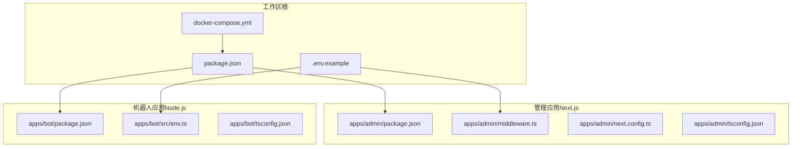
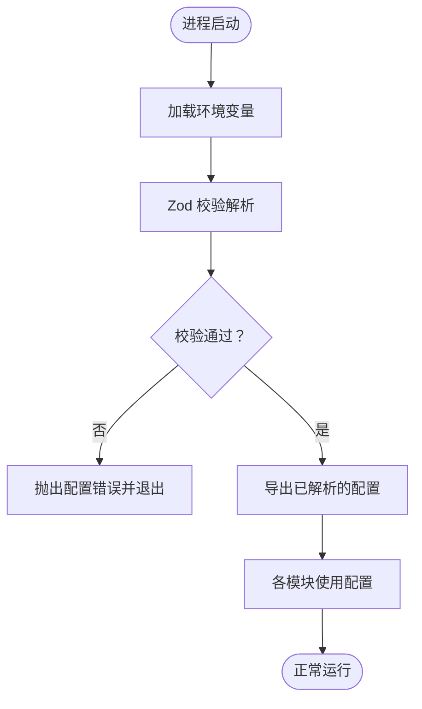
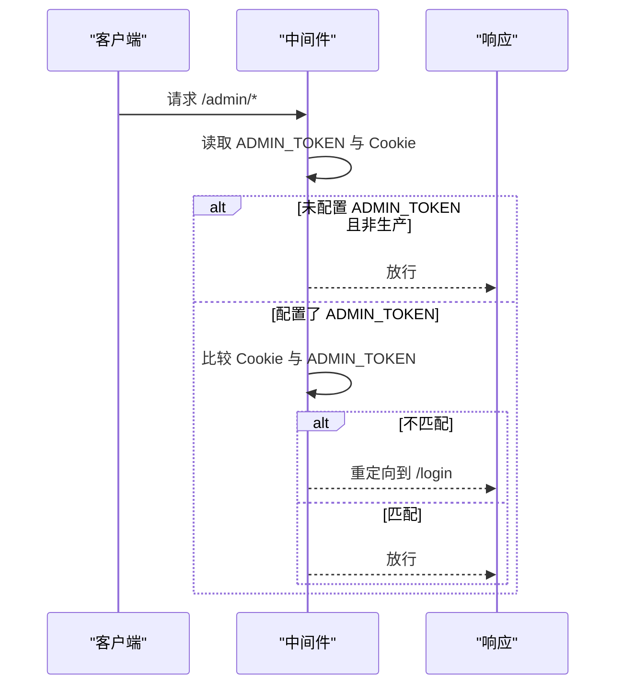
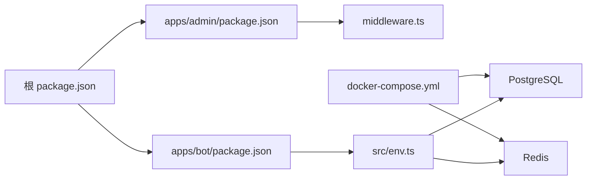

# 环境配置问题

<cite>
**本文引用的文件**
- [.env.example](file://.env.example)
- [docker-compose.yml](file://docker-compose.yml)
- [package.json](file://package.json)
- [apps/admin/package.json](file://apps/admin/package.json)
- [apps/bot/package.json](file://apps/bot/package.json)
- [apps/bot/src/env.ts](file://apps/bot/src/env.ts)
- [apps/admin/middleware.ts](file://apps/admin/middleware.ts)
- [apps/admin/next.config.ts](file://apps/admin/next.config.ts)
- [apps/admin/tsconfig.json](file://apps/admin/tsconfig.json)
- [apps/bot/tsconfig.json](file://apps/bot/tsconfig.json)
- [specs/cryptopulse/ops-checklist.md](file://specs/cryptopulse/ops-checklist.md)
</cite>

## 目录
1. [简介](#简介)
2. [项目结构](#项目结构)
3. [核心组件](#核心组件)
4. [架构总览](#架构总览)
5. [详细组件分析](#详细组件分析)
6. [依赖关系分析](#依赖关系分析)
7. [性能考虑](#性能考虑)
8. [故障排除指南](#故障排除指南)
9. [结论](#结论)
10. [附录](#附录)

## 简介
本指南聚焦于 CryptoPulse 项目的环境配置问题排查，覆盖以下关键主题：
- 常见环境变量配置错误及正确设置方法（DATABASE_URL、ADMIN_TOKEN、TELEGRAM_BOT_TOKEN 等）
- Docker 容器启动失败的常见原因与解决方案（端口冲突、卷挂载、网络配置）
- 开发与生产环境的差异化配置要点（环境变量差异、数据库连接池、缓存设置）
- Node.js 版本兼容性问题的排查与修复
- 环境配置验证工具与检查清单

## 项目结构
该项目采用多包工作区（monorepo）组织方式，包含前端管理应用、机器人应用以及共享/数据库等包。关键配置文件分布如下：
- 全局环境示例：.env.example
- 容器编排：docker-compose.yml
- 工作区根脚本与工作空间定义：package.json
- 管理应用（Next.js）：apps/admin/package.json、middleware.ts、next.config.ts、tsconfig.json
- 机器人应用（Node.js）：apps/bot/package.json、src/env.ts、tsconfig.json



图表来源
- [package.json](file://package.json#L1-L18)
- [.env.example](file://.env.example#L1-L43)
- [docker-compose.yml](file://docker-compose.yml#L1-L24)
- [apps/admin/package.json](file://apps/admin/package.json#L1-L42)
- [apps/admin/middleware.ts](file://apps/admin/middleware.ts#L1-L23)
- [apps/admin/next.config.ts](file://apps/admin/next.config.ts#L1-L30)
- [apps/admin/tsconfig.json](file://apps/admin/tsconfig.json#L1-L28)
- [apps/bot/package.json](file://apps/bot/package.json#L1-L26)
- [apps/bot/src/env.ts](file://apps/bot/src/env.ts#L1-L14)
- [apps/bot/tsconfig.json](file://apps/bot/tsconfig.json#L1-L10)

章节来源
- [package.json](file://package.json#L1-L18)
- [.env.example](file://.env.example#L1-L43)
- [docker-compose.yml](file://docker-compose.yml#L1-L24)

## 核心组件
- 环境变量解析与校验（机器人应用）
  - 机器人应用使用强类型校验库对关键环境变量进行解析与校验，确保运行时可用性。
- 管理应用中间件（ADMIN_TOKEN 与登录拦截）
  - 管理应用通过中间件读取 ADMIN_TOKEN 并与 Cookie 进行比对，非生产环境在未配置 TOKEN 时放行。
- 数据库与缓存（PostgreSQL 与 Redis）
  - docker-compose 提供默认的 PostgreSQL 与 Redis 服务，便于本地开发与测试。

章节来源
- [apps/bot/src/env.ts](file://apps/bot/src/env.ts#L1-L14)
- [apps/admin/middleware.ts](file://apps/admin/middleware.ts#L1-L23)
- [docker-compose.yml](file://docker-compose.yml#L1-L24)

## 架构总览
下图展示了环境配置在系统中的关键作用：管理应用与机器人应用分别从环境变量中读取配置；数据库与缓存由容器编排统一提供；开发与生产环境在 ADMIN_TOKEN、数据库连接字符串等方面存在差异。

```mermaid
graph TB
subgraph "运行时"
AdminApp["管理应用Next.js"]
BotApp["机器人应用Node.js"]
DB["PostgreSQL"]
Cache["Redis"]
end
Env["环境变量"]
Compose["Docker Compose"]
Env --> AdminApp
Env --> BotApp
Compose --> DB
Compose --> Cache
DB <- --> AdminApp
Cache <- --> BotApp
```

图表来源
- [apps/admin/middleware.ts](file://apps/admin/middleware.ts#L1-L23)
- [apps/bot/src/env.ts](file://apps/bot/src/env.ts#L1-L14)
- [docker-compose.yml](file://docker-compose.yml#L1-L24)

## 详细组件分析

### 环境变量解析与校验（机器人应用）
- 关键点
  - 强类型校验：对 TELEGRAM_BOT_TOKEN、API_BASE_URL、WEB_BASE_URL 等进行必填与格式校验；对 DATABASE_URL、REDIS_URL 提供可选支持。
  - 解析时机：在应用启动时一次性解析并缓存，后续模块直接使用。
- 常见错误
  - 缺少必填项导致启动失败
  - URL 格式不合法导致解析失败
  - 可选项未配置但被业务逻辑误用



图表来源
- [apps/bot/src/env.ts](file://apps/bot/src/env.ts#L1-L14)

章节来源
- [apps/bot/src/env.ts](file://apps/bot/src/env.ts#L1-L14)

### 管理应用中间件与 ADMIN_TOKEN
- 关键点
  - 读取 ADMIN_TOKEN 与 Cookie 中的 admin_token 进行匹配。
  - 非生产环境在未配置 ADMIN_TOKEN 时放行，便于本地调试。
  - 匹配失败时重定向到登录页。
- 常见错误
  - 未设置 ADMIN_TOKEN 导致无法访问受保护路由
  - Cookie 名称不一致导致鉴权失败
  - 生产环境未设置 ADMIN_TOKEN 导致无法访问后台



图表来源
- [apps/admin/middleware.ts](file://apps/admin/middleware.ts#L1-L23)

章节来源
- [apps/admin/middleware.ts](file://apps/admin/middleware.ts#L1-L23)

### 数据库与缓存（PostgreSQL 与 Redis）
- 关键点
  - docker-compose 默认暴露端口并持久化数据卷，便于本地快速启动。
  - 管理应用与机器人应用通过 DATABASE_URL 与 REDIS_URL 连接服务。
- 常见错误
  - 端口占用导致容器启动失败
  - 卷挂载权限问题导致数据无法持久化
  - URL 格式错误导致连接失败

章节来源
- [docker-compose.yml](file://docker-compose.yml#L1-L24)
- [.env.example](file://.env.example#L4-L11)

### 开发与生产环境差异
- 环境变量差异
  - 管理应用在非生产环境允许未配置 ADMIN_TOKEN 放行，生产环境必须配置。
  - 示例文件提供开发阶段默认值，生产环境需替换为安全配置。
- 数据库连接池与缓存
  - 连接池参数通常在应用代码中配置；缓存键空间与过期策略需结合业务设计。
- Node.js 版本
  - 工作区与应用的构建工具链对 Node.js 版本有要求，需满足各包的 engines 字段与运行时需求。

章节来源
- [apps/admin/middleware.ts](file://apps/admin/middleware.ts#L7-L9)
- [.env.example](file://.env.example#L2-L11)
- [apps/admin/package.json](file://apps/admin/package.json#L26-L39)
- [apps/bot/package.json](file://apps/bot/package.json#L20-L23)

## 依赖关系分析
- 工作区与应用
  - 根 package.json 定义工作空间与通用脚本，管理应用与机器人应用分别维护自身依赖与脚本。
- 应用与配置
  - 管理应用依赖中间件与 Next.js 配置；机器人应用依赖 dotenv 与 Zod 进行环境解析。
- 容器与服务
  - docker-compose 提供数据库与缓存服务，应用通过环境变量连接。



图表来源
- [package.json](file://package.json#L1-L18)
- [apps/admin/package.json](file://apps/admin/package.json#L1-L42)
- [apps/bot/package.json](file://apps/bot/package.json#L1-L26)
- [apps/admin/middleware.ts](file://apps/admin/middleware.ts#L1-L23)
- [apps/bot/src/env.ts](file://apps/bot/src/env.ts#L1-L14)
- [docker-compose.yml](file://docker-compose.yml#L1-L24)

章节来源
- [package.json](file://package.json#L1-L18)
- [apps/admin/package.json](file://apps/admin/package.json#L1-L42)
- [apps/bot/package.json](file://apps/bot/package.json#L1-L26)
- [apps/admin/middleware.ts](file://apps/admin/middleware.ts#L1-L23)
- [apps/bot/src/env.ts](file://apps/bot/src/env.ts#L1-L14)
- [docker-compose.yml](file://docker-compose.yml#L1-L24)

## 性能考虑
- 数据库连接池
  - 合理设置最大连接数、空闲超时与连接生命周期，避免高并发下的连接争用。
- 缓存命中率
  - 为热点数据设置合适的过期时间，减少数据库压力。
- 网络与 I/O
  - 将数据库与缓存部署在同一主机或低延迟网络内，降低 RTT。
- 日志与可观测性
  - 在生产环境启用结构化日志与指标采集，便于定位性能瓶颈。

## 故障排除指南

### 一、常见环境变量配置错误与修复
- DATABASE_URL
  - 错误表现：应用启动时报数据库连接失败或迁移失败。
  - 排查要点：
    - 确认数据库服务已通过 docker-compose 启动且端口未被占用。
    - 检查连接字符串格式是否符合预期（协议、主机、端口、数据库名、凭据）。
    - 确认数据库已初始化且具备相应权限。
  - 修复建议：
    - 使用 docker-compose 暴露的默认端口与凭据进行连接。
    - 如需自定义，请同步修改示例文件与部署环境。
- ADMIN_TOKEN
  - 错误表现：访问 /admin/* 返回登录页或 403。
  - 排查要点：
    - 确认环境变量已设置且与 Cookie 中的 admin_token 一致。
    - 非生产环境未配置 ADMIN_TOKEN 会自动放行，生产环境必须配置。
  - 修复建议：
    - 在生产环境设置安全的随机令牌，并确保前端写入同名 Cookie。
- TELEGRAM_BOT_TOKEN
  - 错误表现：机器人无法接收消息或发送失败。
  - 排查要点：
    - 确认令牌有效且未过期。
    - 确认 API_BASE_URL 与 WEB_BASE_URL 为可访问的公网地址（生产环境）。
  - 修复建议：
    - 重新生成 Telegram Bot Token 并更新环境变量。
    - 生产环境使用域名与 HTTPS，确保 webhook 与回调可达。

章节来源
- [.env.example](file://.env.example#L4-L11)
- [apps/admin/middleware.ts](file://apps/admin/middleware.ts#L4-L14)
- [apps/bot/src/env.ts](file://apps/bot/src/env.ts#L4-L6)

### 二、Docker 容器启动失败
- 端口冲突
  - 现象：容器启动报端口占用。
  - 排查：检查宿主机 5432（PostgreSQL）、6379（Redis）端口是否被占用。
  - 修复：释放端口或调整 docker-compose 映射端口。
- 卷挂载问题
  - 现象：容器启动成功但无数据持久化。
  - 排查：确认数据卷目录权限与路径正确。
  - 修复：修正权限或更换卷路径。
- 网络配置错误
  - 现象：应用无法连接数据库或缓存。
  - 排查：确认容器网络模式与服务间通信正常。
  - 修复：使用默认网络或自定义网络并确保服务名可达。

章节来源
- [docker-compose.yml](file://docker-compose.yml#L8-L18)

### 三、开发与生产环境配置差异
- 环境变量差异
  - 开发：示例文件提供默认值，便于本地调试。
  - 生产：必须替换为安全配置，严格限制敏感信息泄露。
- 数据库连接池与缓存
  - 生产环境应根据流量峰值调整连接池大小与缓存策略。
- Node.js 版本兼容性
  - 工作区与应用对 Node.js 版本有要求，需满足各包的 engines 字段与运行时需求。
  - 建议使用版本管理工具（如 nvm）锁定 Node.js 版本，避免 CI/CD 与本地差异。

章节来源
- [.env.example](file://.env.example#L2-L11)
- [apps/admin/package.json](file://apps/admin/package.json#L26-L39)
- [apps/bot/package.json](file://apps/bot/package.json#L20-L23)

### 四、环境配置验证工具与检查清单
- 验证工具
  - 机器人应用：启动时进行 Zod 校验，若配置不合法会立即失败，便于快速发现错误。
  - 管理应用：中间件在请求进入受保护路由前进行鉴权，失败则重定向到登录页。
- 检查清单
  - 必备项：DATABASE_URL、TELEGRAM_BOT_TOKEN、API_BASE_URL、WEB_BASE_URL。
  - 安全项：ADMIN_TOKEN、SIGNING_TOKEN（仅服务端可访问）。
  - 生产项：域名与 HTTPS、数据库只读账号、最小权限原则。
  - 运行项：容器健康检查、端口可达性、卷权限。

章节来源
- [apps/bot/src/env.ts](file://apps/bot/src/env.ts#L3-L10)
- [apps/admin/middleware.ts](file://apps/admin/middleware.ts#L4-L14)
- [specs/cryptopulse/ops-checklist.md](file://specs/cryptopulse/ops-checklist.md#L5-L9)

## 结论
- 环境变量是系统稳定运行的关键，务必在开发与生产环境分别进行严格的配置校验。
- 使用 docker-compose 可快速搭建数据库与缓存服务，但需关注端口、卷与网络配置。
- 通过中间件与强类型环境解析，可以在早期发现配置问题，降低线上风险。
- 建议建立标准化的上线检查清单与自动化验证流程，确保每次发布前配置正确。

## 附录
- 关键文件索引
  - 环境示例：.env.example
  - 容器编排：docker-compose.yml
  - 工作区脚本：package.json
  - 管理应用：apps/admin/package.json、middleware.ts、next.config.ts、tsconfig.json
  - 机器人应用：apps/bot/package.json、src/env.ts、tsconfig.json
  - 上线检查清单：specs/cryptopulse/ops-checklist.md