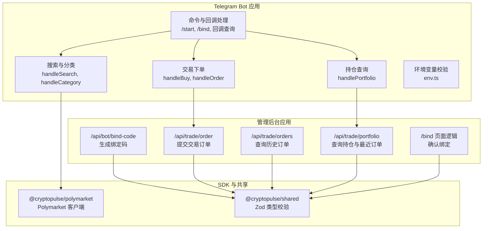
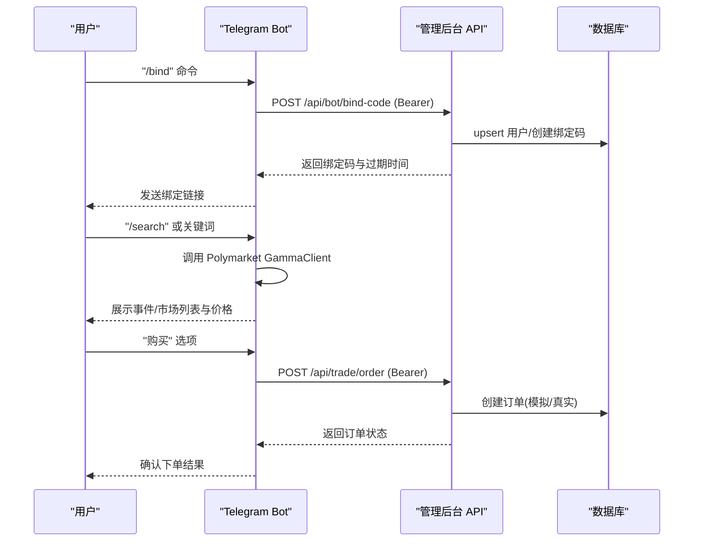
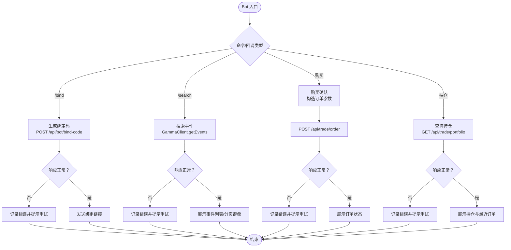
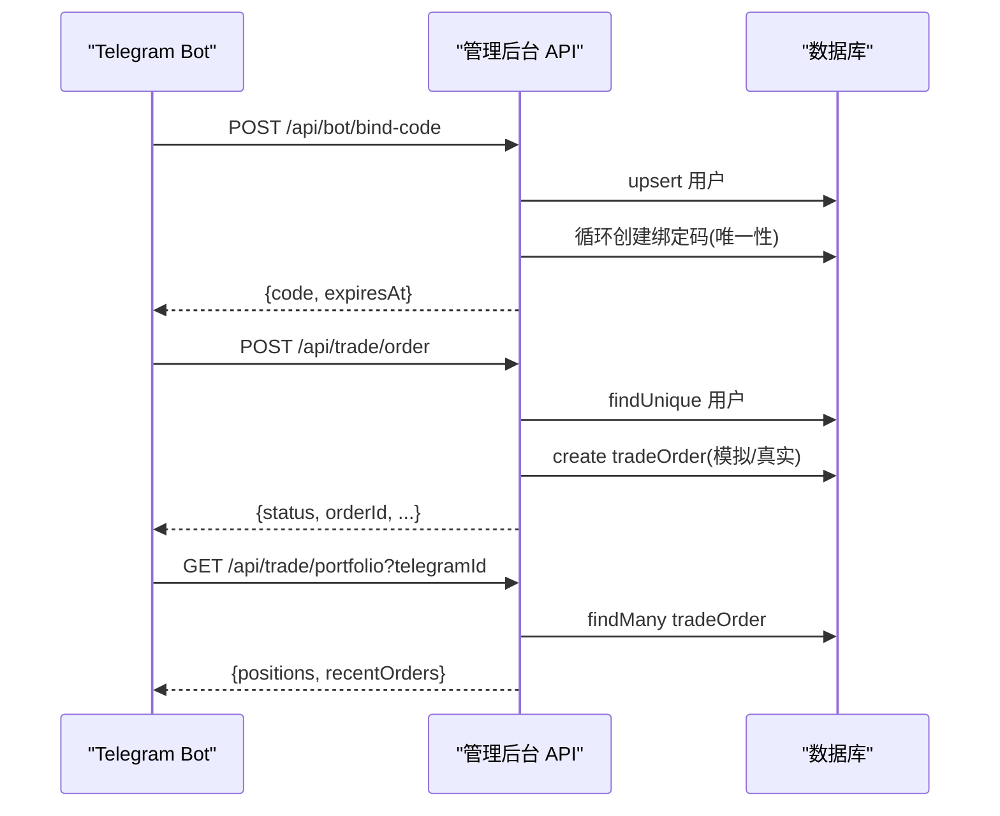
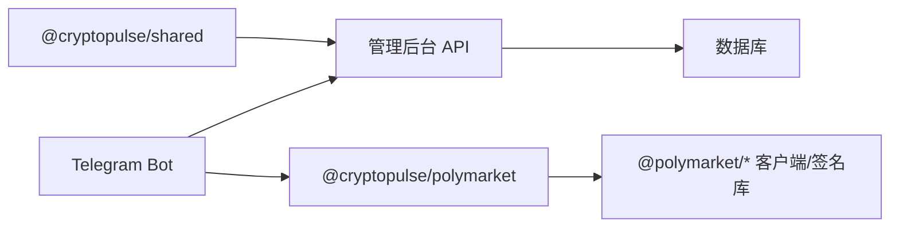

# 第三方集成问题

<cite>
**本文引用的文件**
- [README.md](file://README.md)
- [package.json](file://package.json)
- [.env.example](file://.env.example)
- [apps/admin/app/api/bot/bind-code/route.ts](file://apps/admin/app/api/bot/bind-code/route.ts)
- [apps/admin/app/api/trade/order/route.ts](file://apps/admin/app/api/trade/order/route.ts)
- [apps/admin/app/api/trade/orders/route.ts](file://apps/admin/app/api/trade/orders/route.ts)
- [apps/admin/app/api/trade/portfolio/route.ts](file://apps/admin/app/api/trade/portfolio/route.ts)
- [apps/admin/app/bind/actions.ts](file://apps/admin/app/bind/actions.ts)
- [apps/bot/src/index.ts](file://apps/bot/src/index.ts)
- [apps/bot/src/env.ts](file://apps/bot/src/env.ts)
- [apps/bot/src/bind.ts](file://apps/bot/src/bind.ts)
- [apps/bot/src/search.ts](file://apps/bot/src/search.ts)
- [apps/bot/src/trade.ts](file://apps/bot/src/trade.ts)
- [apps/bot/src/portfolio.ts](file://apps/bot/src/portfolio.ts)
- [packages/polymarket/package.json](file://packages/polymarket/package.json)
- [packages/shared/package.json](file://packages/shared/package.json)
</cite>

## 目录
1. [简介](#简介)
2. [项目结构](#项目结构)
3. [核心组件](#核心组件)
4. [架构总览](#架构总览)
5. [详细组件分析](#详细组件分析)
6. [依赖关系分析](#依赖关系分析)
7. [性能考量](#性能考量)
8. [故障排除指南](#故障排除指南)
9. [结论](#结论)
10. [附录](#附录)

## 简介
本指南聚焦于 CryptoPulse 项目在第三方集成方面的常见问题与排障方法，覆盖以下方面：
- Polymarket 协议集成：API 调用失败、交易执行错误、数据同步问题
- Telegram Bot API 集成：webhook 配置、消息接收失败、认证问题
- 区块链网络连接：RPC 节点连接失败、网络延迟、交易确认问题
- 外部服务依赖：API 限流、服务不可用、证书验证问题
- 降级与容错：配置与策略
- 集成测试与模拟环境：本地测试与验证

## 项目结构
项目采用多包工作区布局，包含管理后台应用、Telegram Bot 应用以及共享与 Polymarket SDK 包。Polymarket SDK 封装了与 Polymarket 生态交互所需的客户端与签名工具。

图表来源
- [apps/admin/app/api/bot/bind-code/route.ts](file://apps/admin/app/api/bot/bind-code/route.ts#L1-L105)
- [apps/admin/app/api/trade/order/route.ts](file://apps/admin/app/api/trade/order/route.ts#L1-L94)
- [apps/admin/app/api/trade/orders/route.ts](file://apps/admin/app/api/trade/orders/route.ts#L1-L74)
- [apps/admin/app/api/trade/portfolio/route.ts](file://apps/admin/app/api/trade/portfolio/route.ts#L1-L80)
- [apps/admin/app/bind/actions.ts](file://apps/admin/app/bind/actions.ts#L1-L90)
- [apps/bot/src/index.ts](file://apps/bot/src/index.ts#L1-L156)
- [apps/bot/src/search.ts](file://apps/bot/src/search.ts#L1-L233)
- [apps/bot/src/trade.ts](file://apps/bot/src/trade.ts#L1-L118)
- [apps/bot/src/portfolio.ts](file://apps/bot/src/portfolio.ts#L1-L76)
- [apps/bot/src/env.ts](file://apps/bot/src/env.ts#L1-L14)
- [packages/polymarket/package.json](file://packages/polymarket/package.json#L1-L23)
- [packages/shared/package.json](file://packages/shared/package.json#L1-L19)

章节来源
- [README.md](file://README.md#L1-L65)
- [package.json](file://package.json#L1-L18)

## 核心组件
- 管理后台 API
  - 绑定码生成接口：负责生成一次性绑定码并写入数据库，带 Bearer Token 校验与 Prisma 约束冲突处理。
  - 交易下单接口：接收用户下单请求，根据 TRADE_MODE 决定模拟或真实执行，并持久化订单。
  - 历史订单查询接口：按 telegramId 查询最近订单列表。
  - 持仓查询接口：聚合用户持仓并返回最近订单快照。
  - 绑定页面逻辑：校验绑定码、过期时间与是否已使用，事务更新用户与绑定码状态。
- Telegram Bot
  - 命令与回调路由：处理 /start、/bind、分类浏览、搜索、购买确认等。
  - 搜索与分类：调用 Polymarket GammaClient 获取事件与市场数据。
  - 交易下单：通过 Bot 发起对管理后台 /api/trade/order 的请求。
  - 持仓查询：通过 Bot 发起对管理后台 /api/trade/portfolio 的请求。
  - 环境变量校验：确保 Telegram Bot Token、API 基础地址、Web 基础地址、可选的 Bot API Token、数据库与缓存等环境变量合法。
- Polymarket SDK
  - 依赖 @polymarket/clob-client、@polymarket/builder-relayer-client、@polymarket/builder-signing-sdk、viem 等，用于与 Polymarket CLOB、Relayer 与签名服务交互。

章节来源
- [apps/admin/app/api/bot/bind-code/route.ts](file://apps/admin/app/api/bot/bind-code/route.ts#L1-L105)
- [apps/admin/app/api/trade/order/route.ts](file://apps/admin/app/api/trade/order/route.ts#L1-L94)
- [apps/admin/app/api/trade/orders/route.ts](file://apps/admin/app/api/trade/orders/route.ts#L1-L74)
- [apps/admin/app/api/trade/portfolio/route.ts](file://apps/admin/app/api/trade/portfolio/route.ts#L1-L80)
- [apps/admin/app/bind/actions.ts](file://apps/admin/app/bind/actions.ts#L1-L90)
- [apps/bot/src/index.ts](file://apps/bot/src/index.ts#L1-L156)
- [apps/bot/src/env.ts](file://apps/bot/src/env.ts#L1-L14)
- [apps/bot/src/bind.ts](file://apps/bot/src/bind.ts#L1-L39)
- [apps/bot/src/search.ts](file://apps/bot/src/search.ts#L1-L233)
- [apps/bot/src/trade.ts](file://apps/bot/src/trade.ts#L1-L118)
- [apps/bot/src/portfolio.ts](file://apps/bot/src/portfolio.ts#L1-L76)
- [packages/polymarket/package.json](file://packages/polymarket/package.json#L1-L23)

## 架构总览
Bot 作为入口，通过命令与回调触发搜索、下单与查询；下单与查询均通过 Bot API Token 访问管理后台 API；管理后台 API 与数据库交互并根据 TRADE_MODE 决定是否进行真实交易。

图表来源
- [apps/bot/src/index.ts](file://apps/bot/src/index.ts#L1-L156)
- [apps/bot/src/bind.ts](file://apps/bot/src/bind.ts#L1-L39)
- [apps/bot/src/search.ts](file://apps/bot/src/search.ts#L1-L233)
- [apps/bot/src/trade.ts](file://apps/bot/src/trade.ts#L1-L118)
- [apps/admin/app/api/bot/bind-code/route.ts](file://apps/admin/app/api/bot/bind-code/route.ts#L1-L105)
- [apps/admin/app/api/trade/order/route.ts](file://apps/admin/app/api/trade/order/route.ts#L1-L94)

## 详细组件分析

### 组件 A：Bot 与 Polymarket 集成
- 关键职责
  - 命令与回调路由：解析 /start、/bind、分类、搜索、购买等指令与回调。
  - 搜索与分类：调用 GammaClient 获取事件与市场数据，支持分页与热门/最新排序。
  - 交易下单：校验用户绑定状态，构造下单请求并调用管理后台 /api/trade/order。
  - 持仓查询：调用管理后台 /api/trade/portfolio 并格式化输出。
  - 环境变量校验：确保必要环境变量存在且合法。
- 错误处理
  - 搜索/分类/详情异常捕获并回复用户“请稍后重试”。
  - 下单与查询响应非 OK 时解析错误并提示。
  - 绑定码生成失败时抛出带状态码与摘要的错误，Bot 统一记录并提示用户重试。

图表来源
- [apps/bot/src/index.ts](file://apps/bot/src/index.ts#L1-L156)
- [apps/bot/src/bind.ts](file://apps/bot/src/bind.ts#L1-L39)
- [apps/bot/src/search.ts](file://apps/bot/src/search.ts#L1-L233)
- [apps/bot/src/trade.ts](file://apps/bot/src/trade.ts#L1-L118)
- [apps/bot/src/portfolio.ts](file://apps/bot/src/portfolio.ts#L1-L76)

章节来源
- [apps/bot/src/index.ts](file://apps/bot/src/index.ts#L1-L156)
- [apps/bot/src/search.ts](file://apps/bot/src/search.ts#L1-L233)
- [apps/bot/src/trade.ts](file://apps/bot/src/trade.ts#L1-L118)
- [apps/bot/src/portfolio.ts](file://apps/bot/src/portfolio.ts#L1-L76)
- [apps/bot/src/env.ts](file://apps/bot/src/env.ts#L1-L14)

### 组件 B：管理后台 API 与数据库交互
- 绑定码生成
  - Bearer Token 校验；数据库可用性检查；Zod 参数校验；Prisma upsert 用户；循环生成唯一绑定码并插入，处理唯一约束冲突。
- 交易下单
  - Bearer Token 校验；Zod 参数校验；数据库可用性检查；查询用户绑定状态；根据 TRADE_MODE 写入模拟或待处理订单。
- 历史订单与持仓查询
  - Bearer Token 校验；Zod 查询参数校验；数据库可用性检查；历史订单按时间倒序取限制条数；持仓聚合与最近订单快照。
- 绑定页面逻辑
  - Zod 参数校验；数据库可用性检查；查找绑定码并校验过期与是否已使用；事务更新用户与绑定码状态。

图表来源
- [apps/admin/app/api/bot/bind-code/route.ts](file://apps/admin/app/api/bot/bind-code/route.ts#L1-L105)
- [apps/admin/app/api/trade/order/route.ts](file://apps/admin/app/api/trade/order/route.ts#L1-L94)
- [apps/admin/app/api/trade/portfolio/route.ts](file://apps/admin/app/api/trade/portfolio/route.ts#L1-L80)
- [apps/admin/app/bind/actions.ts](file://apps/admin/app/bind/actions.ts#L1-L90)

章节来源
- [apps/admin/app/api/bot/bind-code/route.ts](file://apps/admin/app/api/bot/bind-code/route.ts#L1-L105)
- [apps/admin/app/api/trade/order/route.ts](file://apps/admin/app/api/trade/order/route.ts#L1-L94)
- [apps/admin/app/api/trade/orders/route.ts](file://apps/admin/app/api/trade/orders/route.ts#L1-L74)
- [apps/admin/app/api/trade/portfolio/route.ts](file://apps/admin/app/api/trade/portfolio/route.ts#L1-L80)
- [apps/admin/app/bind/actions.ts](file://apps/admin/app/bind/actions.ts#L1-L90)

## 依赖关系分析
- Bot 依赖 Polymarket SDK 提供的 GammaClient 进行事件与市场查询。
- Bot 与管理后台 API 之间通过 Bearer Token 进行鉴权。
- 管理后台 API 依赖 Prisma 访问数据库。
- Polymarket SDK 依赖 @polymarket/clob-client、@polymarket/builder-relayer-client、@polymarket/builder-signing-sdk、viem 等库。

图表来源
- [apps/bot/src/search.ts](file://apps/bot/src/search.ts#L1-L233)
- [apps/bot/src/trade.ts](file://apps/bot/src/trade.ts#L1-L118)
- [apps/admin/app/api/bot/bind-code/route.ts](file://apps/admin/app/api/bot/bind-code/route.ts#L1-L105)
- [packages/polymarket/package.json](file://packages/polymarket/package.json#L1-L23)
- [packages/shared/package.json](file://packages/shared/package.json#L1-L19)

章节来源
- [packages/polymarket/package.json](file://packages/polymarket/package.json#L1-L23)
- [packages/shared/package.json](file://packages/shared/package.json#L1-L19)

## 性能考量
- Bot 搜索与分类默认每页 5 条，避免一次性返回过多内容导致消息体积过大。
- 管理后台订单查询默认限制条数，减少数据库压力与响应体积。
- 交易模式由 TRADE_MODE 控制，开发阶段可启用模拟模式以降低对外部系统的依赖与风险。
- 建议在高并发场景下增加缓存层与限流策略，避免 Polymarket API 与 Relayer 的瞬时压力。

## 故障排除指南

### Polymarket 协议集成问题
- 症状：搜索不到市场、价格显示为空、购买按钮不可用
  - 排查要点
    - 确认 GammaClient 初始化与网络可达性
    - 检查 Polymarket CLOB 主机、WS 与 Relayer 地址配置
    - 核对链 ID 与 RPC URL 是否匹配目标链
  - 解决方案
    - 切换到稳定网络或使用代理
    - 更新 POLYMARKET_* 环境变量至可用地址
    - 在本地或 CI 中添加超时与重试策略
- 症状：下单后订单状态长时间为 PENDING
  - 排查要点
    - 核对 TRADE_MODE 是否为 mock
    - 检查 Bot API Token 与管理后台 API 的授权头
    - 确认数据库连接与 Prisma 可用
  - 解决方案
    - 将 TRADE_MODE 设为真实模式并配置 Builder 签名相关密钥
    - 确保 Relayer 与签名服务可用
- 症状：绑定码生成失败或重复
  - 排查要点
    - 检查 Prisma 唯一约束冲突处理
    - 核对数据库连接与表结构
  - 解决方案
    - 重试生成绑定码，确保唯一性处理逻辑生效

章节来源
- [apps/bot/src/search.ts](file://apps/bot/src/search.ts#L1-L233)
- [apps/bot/src/trade.ts](file://apps/bot/src/trade.ts#L1-L118)
- [apps/admin/app/api/bot/bind-code/route.ts](file://apps/admin/app/api/bot/bind-code/route.ts#L1-L105)
- [apps/admin/app/api/trade/order/route.ts](file://apps/admin/app/api/trade/order/route.ts#L1-L94)
- [.env.example](file://.env.example#L18-L28)

### Telegram Bot API 集成问题
- 症状：webhook 配置无效、消息接收失败
  - 排查要点
    - 确认 TELEGRAM_BOT_TOKEN 与 WEBHOOK 地址正确
    - 检查 Bot 能否访问 API 基础地址
    - 核对域名证书与 TLS 配置
  - 解决方案
    - 使用 HTTPS 且证书有效
    - 在 BotFather 中正确配置 webhook
- 症状：命令与回调无响应
  - 排查要点
    - 检查 Bot 启动日志与异常捕获
    - 确认回调查询正则匹配与消息文本处理
  - 解决方案
    - 修复回调处理器中的正则与参数解析
    - 增加重试与降级策略
- 症状：认证失败（401）
  - 排查要点
    - 核对 BOT_API_TOKEN 是否与请求头一致
    - 确认管理后台与 Bot 的令牌配置一致
  - 解决方案
    - 在 .env 中设置一致的 BOT_API_TOKEN
    - 检查请求头 Authorization 的格式

章节来源
- [apps/bot/src/index.ts](file://apps/bot/src/index.ts#L1-L156)
- [apps/bot/src/env.ts](file://apps/bot/src/env.ts#L1-L14)
- [apps/admin/app/api/bot/bind-code/route.ts](file://apps/admin/app/api/bot/bind-code/route.ts#L1-L105)
- [apps/admin/app/api/trade/order/route.ts](file://apps/admin/app/api/trade/order/route.ts#L1-L94)
- [apps/admin/app/api/trade/portfolio/route.ts](file://apps/admin/app/api/trade/portfolio/route.ts#L1-L80)

### 区块链网络连接问题
- 症状：RPC 节点连接失败、交易确认慢
  - 排查要点
    - 检查 POLYMARKET_RPC_URL 与链 ID 是否匹配
    - 核对网络延迟与节点可用性
  - 解决方案
    - 切换到备用 RPC 节点
    - 在 Relayer 与签名服务侧增加重试与熔断
- 症状：Relayer/Builder 交互失败
  - 排查要点
    - 核对 POLY_BUILDER_* 与 SIGNING_TOKEN
    - 检查 Relayer URL 与签名服务可达性
  - 解决方案
    - 更新密钥与令牌
    - 在 SDK 层引入指数退避与熔断

章节来源
- [.env.example](file://.env.example#L18-L31)
- [packages/polymarket/package.json](file://packages/polymarket/package.json#L1-L23)

### 外部服务依赖问题
- 症状：API 限流、服务不可用、证书验证失败
  - 排查要点
    - 检查 Polymarket API 与 Relayer 的限流阈值
    - 核对系统时间与证书有效期
  - 解决方案
    - 引入重试、退避与队列限速
    - 使用受信 CA 与有效证书
    - 在 SDK 与 Bot 层增加降级路径（如缓存与离线模式）

章节来源
- [apps/bot/src/search.ts](file://apps/bot/src/search.ts#L1-L233)
- [apps/bot/src/trade.ts](file://apps/bot/src/trade.ts#L1-L118)
- [packages/polymarket/package.json](file://packages/polymarket/package.json#L1-L23)

### 降级与容错配置
- 交易模式降级
  - 将 TRADE_MODE 设置为 mock，使下单直接返回模拟状态，便于测试与演示
- 缓存与回退
  - 对 Polymarket 数据进行短期缓存，避免频繁调用
  - 在 Bot 与 API 层增加超时与重试策略
- 熔断与告警
  - 当外部服务连续失败达到阈值时触发熔断，停止进一步调用并上报监控

章节来源
- [apps/admin/app/api/trade/order/route.ts](file://apps/admin/app/api/trade/order/route.ts#L61-L76)

### 集成测试与模拟环境搭建
- 环境准备
  - 复制并配置 .env 示例文件，设置数据库、Redis、Bot Token、API/Web 基础地址
  - 初始化数据库迁移与 Prisma 生成
- 本地运行
  - 启动管理后台与 Bot 应用，分别监听不同端口
- 测试步骤
  - 在 Bot 中发送 /bind 生成绑定码并完成绑定
  - 使用 /search 搜索市场并点击购买，观察下单与订单状态
  - 使用 /portfolio 查看持仓与最近订单
- 模拟与隔离
  - 在开发环境将 TRADE_MODE 设为 mock，避免真实交易
  - 使用 Playwright 或其他 E2E 工具编写端到端测试脚本

章节来源
- [README.md](file://README.md#L1-L65)
- [package.json](file://package.json#L1-L18)
- [apps/admin/app/bind/actions.ts](file://apps/admin/app/bind/actions.ts#L1-L90)

## 结论
本指南从 Bot 与管理后台 API 的交互入手，结合 Polymarket SDK 的使用，系统梳理了第三方集成的常见问题与排障方法。通过明确的环境变量、认证与数据流设计，配合降级与容错策略，可在本地与生产环境中稳定地集成 Polymarket 与 Telegram Bot。建议在生产部署中完善监控、限流与熔断机制，并持续优化用户体验与系统韧性。

## 附录
- 关键环境变量参考
  - 数据库与缓存：DATABASE_URL、REDIS_URL
  - Telegram：TELEGRAM_BOT_TOKEN、BOT_API_TOKEN、TELEGRAM_TEST_GROUP_ID、API_BASE_URL、WEB_BASE_URL
  - Polymarket：POLYMARKET_CHAIN_ID、POLYMARKET_CLOB_HOST、POLYMARKET_WS_URL、POLYMARKET_RELAYER_URL、POLYMARKET_RPC_URL、POLY_BUILDER_*、SIGNING_TOKEN
- 常见错误码与含义
  - 400：请求体或查询参数无效
  - 401：未授权（Bot API Token 不匹配）
  - 503：数据库不可用
  - 500：服务器内部错误

章节来源
- [.env.example](file://.env.example#L1-L43)
- [apps/admin/app/api/bot/bind-code/route.ts](file://apps/admin/app/api/bot/bind-code/route.ts#L34-L44)
- [apps/admin/app/api/trade/order/route.ts](file://apps/admin/app/api/trade/order/route.ts#L16-L23)
- [apps/admin/app/api/trade/portfolio/route.ts](file://apps/admin/app/api/trade/portfolio/route.ts#L17-L22)