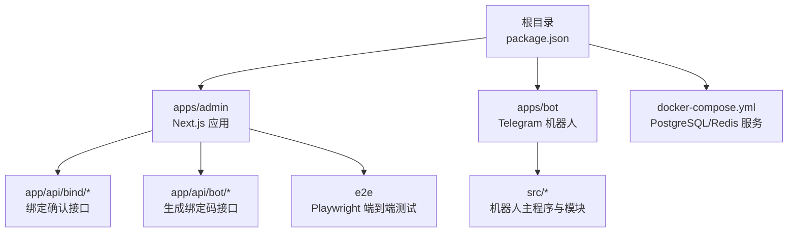
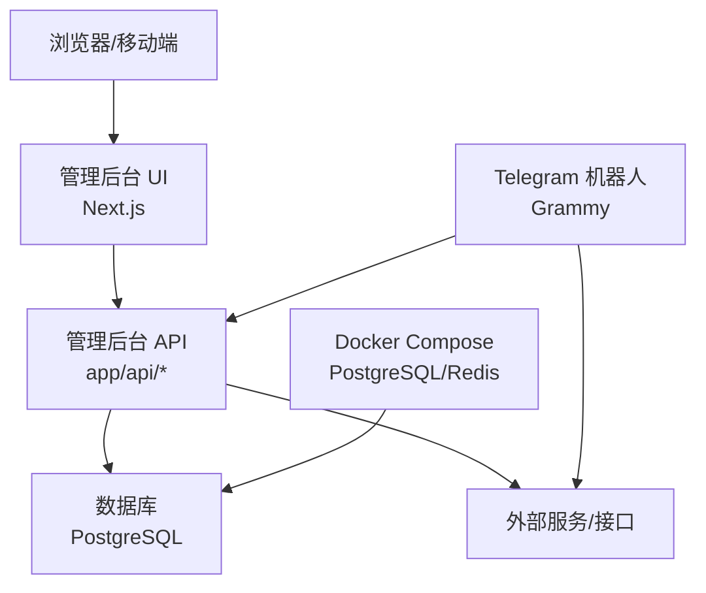
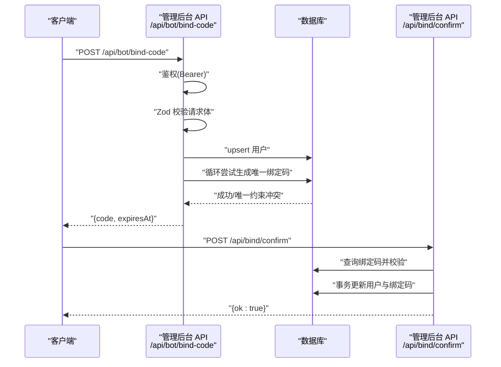
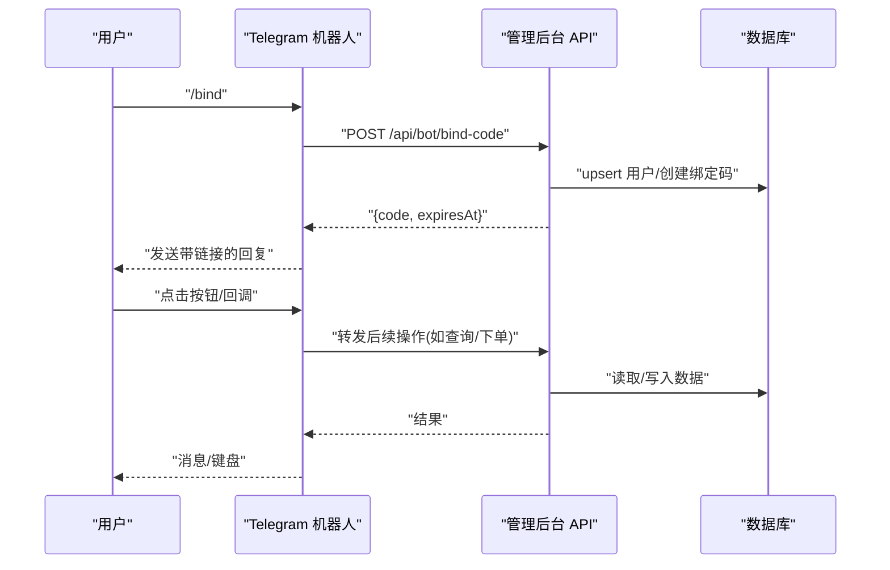
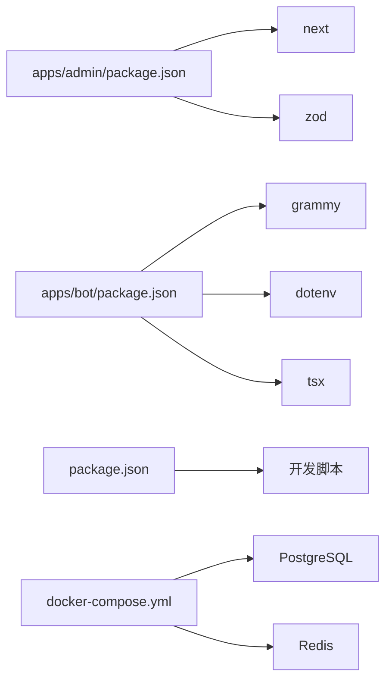

# 调试工具和技巧

<cite>
**本文引用的文件**
- [package.json](file://package.json)
- [README.md](file://README.md)
- [docker-compose.yml](file://docker-compose.yml)
- [apps/admin/package.json](file://apps/admin/package.json)
- [apps/admin/tsconfig.json](file://apps/admin/tsconfig.json)
- [apps/admin/playwright.config.ts](file://apps/admin/playwright.config.ts)
- [apps/admin/app/api/bind/confirm/route.ts](file://apps/admin/app/api/bind/confirm/route.ts)
- [apps/admin/app/api/bot/bind-code/route.ts](file://apps/admin/app/api/bot/bind-code/route.ts)
- [apps/admin/lib/utils.ts](file://apps/admin/lib/utils.ts)
- [apps/bot/package.json](file://apps/bot/package.json)
- [apps/bot/tsconfig.json](file://apps/bot/tsconfig.json)
- [apps/bot/src/index.ts](file://apps/bot/src/index.ts)
- [apps/bot/src/env.ts](file://apps/bot/src/env.ts)
</cite>

## 目录
1. [简介](#简介)
2. [项目结构](#项目结构)
3. [核心组件](#核心组件)
4. [架构总览](#架构总览)
5. [详细组件分析](#详细组件分析)
6. [依赖分析](#依赖分析)
7. [性能考虑](#性能考虑)
8. [故障排除指南](#故障排除指南)
9. [结论](#结论)
10. [附录](#附录)

## 简介
本指南面向 CryptoPulse 项目开发者，聚焦于开发与生产环境下的调试与故障排除实践。内容涵盖：
- 开发环境调试配置：TypeScript 调试器设置、断点调试、变量监视
- 日志系统使用：日志级别、格式化与轮转策略
- 浏览器开发者工具：网络请求分析、性能分析、内存泄漏检测
- Node.js 应用调试：进程调试、堆栈跟踪、异步操作调试
- 测试驱动开发调试：单元测试、集成测试与端到端测试的故障排除
- 生产环境诊断：远程调试、性能分析、错误追踪
- 监控与告警：配置与使用建议，帮助快速定位问题

## 项目结构
项目采用多包工作区布局，包含管理后台应用、Telegram 机器人应用以及共享与数据库相关包。开发脚本通过根目录的 npm 工作区统一调度。

图表来源
- [package.json](file://package.json#L1-L18)
- [apps/admin/package.json](file://apps/admin/package.json#L1-L42)
- [apps/bot/package.json](file://apps/bot/package.json#L1-L26)
- [docker-compose.yml](file://docker-compose.yml#L1-L24)

章节来源
- [package.json](file://package.json#L1-L18)
- [README.md](file://README.md#L1-L65)

## 核心组件
- 管理后台（Next.js）：提供绑定码生成、用户绑定确认等 API，使用 Zod 进行请求体校验，异常路径返回明确的错误码，便于调试与排障。
- Telegram 机器人（Grammy）：处理命令与回调查询，调用外部 API 生成绑定码，集中错误捕获与日志输出。
- 端到端测试（Playwright）：配置了超时、trace 保留与多浏览器项目，便于定位 UI 行为问题。
- 开发脚本与工具链：根脚本统一启动各子应用，TS 配置启用增量编译与 NodeNext 模块解析，便于调试与类型检查。

章节来源
- [apps/admin/app/api/bot/bind-code/route.ts](file://apps/admin/app/api/bot/bind-code/route.ts#L1-L105)
- [apps/admin/app/api/bind/confirm/route.ts](file://apps/admin/app/api/bind/confirm/route.ts#L1-L91)
- [apps/bot/src/index.ts](file://apps/bot/src/index.ts#L1-L156)
- [apps/admin/playwright.config.ts](file://apps/admin/playwright.config.ts#L1-L23)
- [apps/admin/tsconfig.json](file://apps/admin/tsconfig.json#L1-L28)
- [apps/bot/tsconfig.json](file://apps/bot/tsconfig.json#L1-L10)

## 架构总览
下图展示了从浏览器到管理后台 API，再到数据库与外部服务的典型请求链路，以及机器人与 Web 基础设施的交互。

图表来源
- [apps/admin/app/api/bot/bind-code/route.ts](file://apps/admin/app/api/bot/bind-code/route.ts#L1-L105)
- [apps/admin/app/api/bind/confirm/route.ts](file://apps/admin/app/api/bind/confirm/route.ts#L1-L91)
- [apps/bot/src/index.ts](file://apps/bot/src/index.ts#L1-L156)
- [docker-compose.yml](file://docker-compose.yml#L1-L24)

## 详细组件分析

### 管理后台 API：绑定码生成与绑定确认
- 绑定码生成接口负责鉴权、请求体校验、去重约束处理与事务写入，异常分支返回明确状态码，便于前端与调试工具定位问题。
- 绑定确认接口负责校验绑定码有效性、过期与重复使用，随后进行用户信息更新与绑定码标记，事务保证一致性。

图表来源
- [apps/admin/app/api/bot/bind-code/route.ts](file://apps/admin/app/api/bot/bind-code/route.ts#L1-L105)
- [apps/admin/app/api/bind/confirm/route.ts](file://apps/admin/app/api/bind/confirm/route.ts#L1-L91)

章节来源
- [apps/admin/app/api/bot/bind-code/route.ts](file://apps/admin/app/api/bot/bind-code/route.ts#L1-L105)
- [apps/admin/app/api/bind/confirm/route.ts](file://apps/admin/app/api/bind/confirm/route.ts#L1-L91)

### Telegram 机器人：命令与回调处理
- 机器人入口加载环境变量并注册命令与回调查询处理器，集中错误捕获，便于定位异常。
- 关键流程包括生成绑定码、事件详情、买卖下单与组合查询，均通过回调与命令分发。

图表来源
- [apps/bot/src/index.ts](file://apps/bot/src/index.ts#L1-L156)
- [apps/admin/app/api/bot/bind-code/route.ts](file://apps/admin/app/api/bot/bind-code/route.ts#L1-L105)

章节来源
- [apps/bot/src/index.ts](file://apps/bot/src/index.ts#L1-L156)
- [apps/bot/src/env.ts](file://apps/bot/src/env.ts#L1-L14)

### 端到端测试：Playwright 配置与调试
- Playwright 配置包含超时、trace 保留、多浏览器项目与内置 webServer 启动，便于在失败时获取完整上下文。
- 建议在调试时开启更详细的 trace 并结合浏览器开发者工具分析网络与性能。

章节来源
- [apps/admin/playwright.config.ts](file://apps/admin/playwright.config.ts#L1-L23)

## 依赖分析
- 管理后台依赖 Next.js、Zod、Tailwind 等，TS 配置启用增量编译与 NodeNext 模块解析，提升开发体验与类型安全。
- 机器人应用依赖 Grammy、dotenv、Zod，使用 tsx watch 实现热重载，便于快速迭代。
- Docker Compose 提供 PostgreSQL 与 Redis 的本地服务，便于离线调试与数据持久化。

图表来源
- [apps/admin/package.json](file://apps/admin/package.json#L1-L42)
- [apps/bot/package.json](file://apps/bot/package.json#L1-L26)
- [package.json](file://package.json#L1-L18)
- [docker-compose.yml](file://docker-compose.yml#L1-L24)

章节来源
- [apps/admin/tsconfig.json](file://apps/admin/tsconfig.json#L1-L28)
- [apps/bot/tsconfig.json](file://apps/bot/tsconfig.json#L1-L10)
- [package.json](file://package.json#L1-L18)
- [docker-compose.yml](file://docker-compose.yml#L1-L24)

## 性能考虑
- 管理后台 API 中对绑定码生成采用循环重试与唯一约束处理，避免死循环并降低冲突概率。
- 机器人侧对回调与命令进行分发，减少主线程阻塞；建议在处理耗时任务时引入队列或异步处理。
- 端到端测试配置了合理的超时与 trace，有助于在复杂场景下定位性能瓶颈。

章节来源
- [apps/admin/app/api/bot/bind-code/route.ts](file://apps/admin/app/api/bot/bind-code/route.ts#L83-L97)
- [apps/bot/src/index.ts](file://apps/bot/src/index.ts#L150-L152)

## 故障排除指南

### 开发环境调试配置
- TypeScript 调试器设置
  - 管理后台：启用增量编译与 NodeNext 模块解析，便于断点与类型检查。
  - 机器人：使用 tsx watch 实现源码监听与自动重启，结合源映射定位问题。
- 断点调试与变量监视
  - 在管理后台 API 的关键分支（鉴权、请求体解析、数据库事务）设置断点，观察参数与中间状态。
  - 在机器人命令与回调处理函数内设置断点，验证用户输入与外部 API 返回。
- 日志级别与格式化
  - 建议在开发阶段输出结构化日志（JSON），包含时间戳、级别、模块与上下文 ID，便于检索与聚合。

章节来源
- [apps/admin/tsconfig.json](file://apps/admin/tsconfig.json#L1-L28)
- [apps/bot/tsconfig.json](file://apps/bot/tsconfig.json#L1-L10)
- [apps/bot/src/index.ts](file://apps/bot/src/index.ts#L150-L152)

### 浏览器开发者工具使用技巧
- 网络请求分析
  - 使用 Network 面板查看 API 请求/响应、状态码与耗时，结合断点与控制台日志定位异常。
- 性能分析
  - 使用 Performance 面板录制交互过程，识别长任务与渲染热点。
- 内存泄漏检测
  - 使用 Memory 面板快照对比，排查未释放的定时器、事件监听器与闭包引用。

### Node.js 应用调试方法
- 进程调试
  - 使用内置 inspector 或 VS Code 调试器附加到 Node 进程，设置条件断点与并发断点。
- 堆栈跟踪
  - 在捕获异常处打印堆栈，结合源映射定位到原始 TS 源码位置。
- 异步操作调试
  - 使用 Promise 链与 async/await 的断点，关注微任务队列与事件循环状态。

### 测试驱动开发调试技巧
- 单元测试调试
  - 使用根脚本统一运行测试，结合断点与覆盖率报告定位失败用例。
- 集成测试
  - 在 API 层设置断点，验证鉴权、校验与数据库事务是否按预期执行。
- 端到端测试
  - 利用 Playwright trace 在失败时回放交互，结合浏览器开发者工具分析页面行为。

章节来源
- [package.json](file://package.json#L14-L14)
- [apps/admin/playwright.config.ts](file://apps/admin/playwright.config.ts#L1-L23)

### 生产环境诊断
- 远程调试
  - 在允许的环境中启用调试端口，配合源映射与日志聚合系统进行远端诊断。
- 性能分析
  - 使用性能探针与采样工具识别慢请求与资源瓶颈。
- 错误追踪
  - 结合结构化日志与错误追踪平台，建立告警与回溯机制。

### 监控与告警配置与使用
- 建议指标
  - API 响应时间与错误率、数据库连接数与锁等待、机器人消息处理速率与失败率。
- 告警策略
  - 针对错误率突增、响应时间超阈值与数据库异常设置分级告警。
- 可观测性
  - 将日志、指标与追踪统一接入平台，确保跨服务关联与快速定位。

## 结论
通过完善的开发调试配置、结构化日志与可观测性体系，以及针对不同层级（浏览器、Node.js、测试）的调试策略，可以显著提升 CryptoPulse 项目的开发效率与稳定性。建议在团队内标准化调试流程与工具使用，并持续优化监控与告警策略以覆盖关键业务路径。

## 附录

### 常见问题与排查清单
- 环境变量缺失
  - 确认机器人与管理后台所需的令牌与数据库连接字符串均已正确设置。
- 数据库不可用
  - 检查本地/远程数据库连通性与迁移状态，必要时重新执行迁移。
- 绑定码冲突
  - 关注唯一约束冲突处理逻辑，必要时调整生成算法或重试策略。
- 端到端测试失败
  - 查看 trace 文件与浏览器开发者工具，确认页面交互与 API 响应符合预期。

章节来源
- [apps/bot/src/env.ts](file://apps/bot/src/env.ts#L1-L14)
- [apps/admin/app/api/bot/bind-code/route.ts](file://apps/admin/app/api/bot/bind-code/route.ts#L46-L48)
- [apps/admin/playwright.config.ts](file://apps/admin/playwright.config.ts#L8-L10)