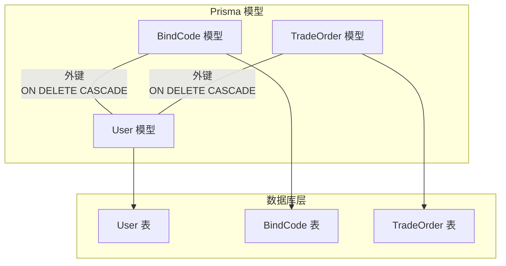
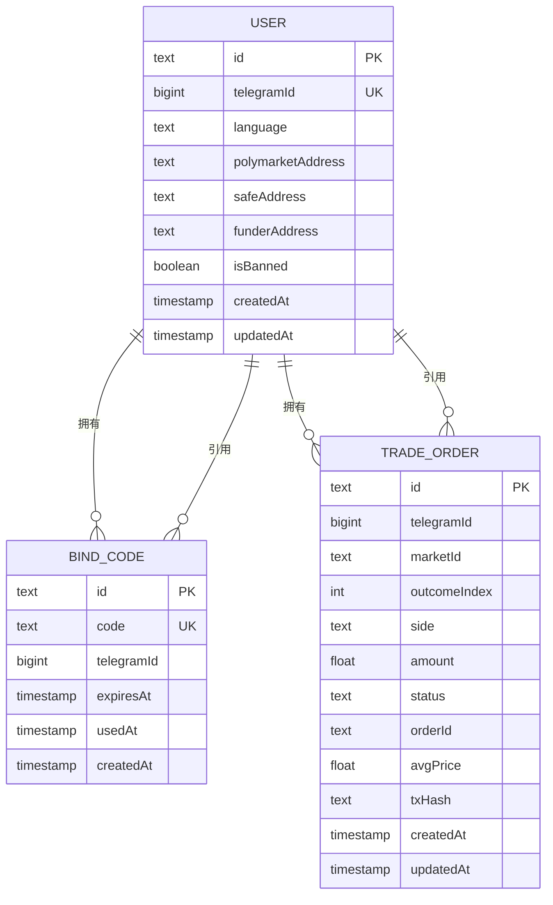
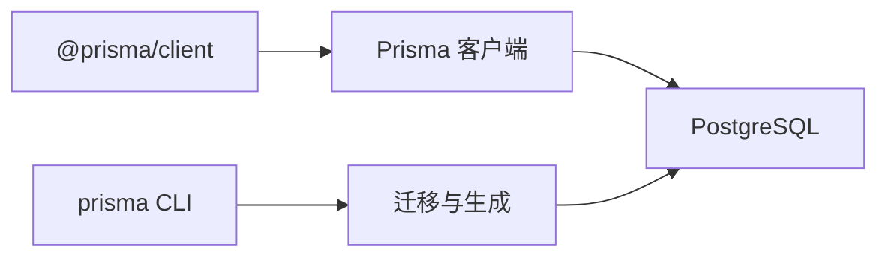

# 实体关系

<cite>
**本文档引用的文件**
- [README.md](file://README.md)
- [schema.prisma](file://packages/db/prisma/schema.prisma)
- [0001_init/migration.sql](file://packages/db/prisma/migrations/0001_init/migration.sql)
- [0002_trade_order/migration.sql](file://packages/db/prisma/migrations/0002_trade_order/migration.sql)
- [db 包配置](file://packages/db/package.json)
</cite>

## 目录
1. [简介](#简介)
2. [项目结构](#项目结构)
3. [核心组件](#核心组件)
4. [架构总览](#架构总览)
5. [详细组件分析](#详细组件分析)
6. [依赖分析](#依赖分析)
7. [性能考量](#性能考量)
8. [故障排查指南](#故障排查指南)
9. [结论](#结论)
10. [附录](#附录)

## 简介
本文件聚焦于 CryptoPulse 项目的数据库实体关系设计，基于 Prisma 模型与迁移脚本进行系统化梳理。文档将阐明用户、绑定码与交易订单三者之间的关系建模，解释一对一、一对多、外键约束与级联行为，并给出 ERD 图、索引与查询最佳实践、以及一致性与事务处理策略建议。

## 项目结构
数据库相关的核心位于 packages/db 下，包含：
- Prisma 模型定义：用于声明实体、字段、关系与索引
- 迁移脚本：用于在 PostgreSQL 中创建表、索引与外键约束
- 包配置：定义 Prisma 工具链与客户端依赖

图表来源
- [schema.prisma](file://packages/db/prisma/schema.prisma#L10-L54)
- [0001_init/migration.sql](file://packages/db/prisma/migrations/0001_init/migration.sql#L4-L38)
- [0002_trade_order/migration.sql](file://packages/db/prisma/migrations/0002_trade_order/migration.sql#L1-L22)

章节来源
- [README.md](file://README.md#L1-L65)
- [db 包配置](file://packages/db/package.json#L1-L22)

## 核心组件
- 用户（User）
  - 主键：id
  - 唯一键：telegramId
  - 关系：一对多（一个用户可拥有多个绑定码与交易订单）
- 绑定码（BindCode）
  - 主键：id
  - 唯一键：code
  - 外键：telegramId 引用 User.telegramId
  - 级联：删除时级联删除（ON DELETE CASCADE）
- 交易订单（TradeOrder）
  - 主键：id
  - 外键：telegramId 引用 User.telegramId
  - 索引：复合索引（telegramId, createdAt）、（marketId, outcomeIndex）
  - 级联：删除时级联删除（ON DELETE CASCADE）

章节来源
- [schema.prisma](file://packages/db/prisma/schema.prisma#L10-L54)
- [0001_init/migration.sql](file://packages/db/prisma/migrations/0001_init/migration.sql#L4-L38)
- [0002_trade_order/migration.sql](file://packages/db/prisma/migrations/0002_trade_order/migration.sql#L1-L22)

## 架构总览
下图展示了实体间的关系与参照完整性约束：

图表来源
- [schema.prisma](file://packages/db/prisma/schema.prisma#L10-L54)
- [0001_init/migration.sql](file://packages/db/prisma/migrations/0001_init/migration.sql#L4-L38)
- [0002_trade_order/migration.sql](file://packages/db/prisma/migrations/0002_trade_order/migration.sql#L1-L22)

## 详细组件分析

### 用户（User）实体
- 身份标识
  - id：主键，全局唯一
  - telegramId：业务唯一键，用于关联绑定码与交易订单
- 配置与状态
  - language：默认语言
  - polymarketAddress/safeAddress/funderAddress：钱包地址字段
  - isBanned：封禁标记
- 时间戳
  - createdAt/updatedAt：自动维护
- 关系
  - 一对多：与 BindCode、TradeOrder 建立一对多关系

章节来源
- [schema.prisma](file://packages/db/prisma/schema.prisma#L10-L23)
- [0001_init/migration.sql](file://packages/db/prisma/migrations/0001_init/migration.sql#L4-L17)

### 绑定码（BindCode）实体
- 标识与约束
  - id：主键
  - code：业务唯一键
  - telegramId：外键，引用 User.telegramId
- 生命周期
  - expiresAt：过期时间
  - usedAt：使用时间（可空）
- 约束与级联
  - 外键约束：ON DELETE CASCADE，ON UPDATE CASCADE
- 关系
  - 多对一：与 User 建立多对一关系（一个用户可有多个绑定码）

章节来源
- [schema.prisma](file://packages/db/prisma/schema.prisma#L25-L34)
- [0001_init/migration.sql](file://packages/db/prisma/migrations/0001_init/migration.sql#L19-L38)

### 交易订单（TradeOrder）实体
- 标识与约束
  - id：主键
  - telegramId：外键，引用 User.telegramId
- 交易元数据
  - marketId/outcomeIndex：市场与结果索引
  - side/amount：方向与数量
  - status：默认 PENDING
  - orderId/avgPrice/txHash：链上交互追踪字段
- 索引
  - 复合索引（telegramId, createdAt）：支持按用户与时间排序查询
  - 复合索引（marketId, outcomeIndex）：支持按市场与结果维度聚合
- 约束与级联
  - 外键约束：ON DELETE CASCADE，ON UPDATE CASCADE
- 关系
  - 多对一：与 User 建立多对一关系（一个用户可有多笔订单）

章节来源
- [schema.prisma](file://packages/db/prisma/schema.prisma#L36-L54)
- [0002_trade_order/migration.sql](file://packages/db/prisma/migrations/0002_trade_order/migration.sql#L1-L22)

### 关系与基数
- User → BindCode：一对多（1 对 n）
- User → TradeOrder：一对多（1 对 n）
- BindCode ← User：多对一（n 对 1）
- TradeOrder ← User：多对一（n 对 1）
- 关系类型均为外键约束实现，确保参照完整性

章节来源
- [schema.prisma](file://packages/db/prisma/schema.prisma#L21-L22)
- [schema.prisma](file://packages/db/prisma/schema.prisma#L50-L51)

### 外键约束与参照完整性
- User_telegramId：唯一键，保证 telegramId 的全局唯一性
- BindCode_telegramId_fkey：外键，引用 User.telegramId，ON DELETE CASCADE
- TradeOrder_telegramId_fkey：外键，引用 User.telegramId，ON DELETE CASCADE
- 参照完整性保障：删除 User 会级联删除其所有绑定码与交易订单，避免悬挂引用

章节来源
- [0001_init/migration.sql](file://packages/db/prisma/migrations/0001_init/migration.sql#L31-L38)
- [0002_trade_order/migration.sql](file://packages/db/prisma/migrations/0002_trade_order/migration.sql#L22)

### 级联操作（CASCADE）说明
- 删除级联（ON DELETE CASCADE）
  - 当删除 User 时，系统自动删除其所有 BindCode 与 TradeOrder
  - 适用场景：用户注销或清理历史数据
  - 影响：删除操作可能产生批量副作用，应谨慎执行
- 更新级联（ON UPDATE CASCADE）
  - 当 User.telegramId 更新时，外键列也会同步更新
  - 适用场景：业务上 telegramId 不应变更；若确实需要，可启用以保持一致性
  - 影响：可能触发大量外键更新，需评估性能

章节来源
- [schema.prisma](file://packages/db/prisma/schema.prisma#L33)
- [schema.prisma](file://packages/db/prisma/schema.prisma#L50)
- [0001_init/migration.sql](file://packages/db/prisma/migrations/0001_init/migration.sql#L38)
- [0002_trade_order/migration.sql](file://packages/db/prisma/migrations/0002_trade_order/migration.sql#L22)

### 关系表设计模式与规范化
- 设计模式
  - 采用“中心实体 + 外键”模式：User 为中心实体，BindCode 与 TradeOrder 通过 telegramId 外键关联
  - 通过唯一键（telegramId、code）保证业务唯一性
- 规范化考虑
  - 第二范式：非主属性完全依赖于主键（满足）
  - 第三范式：消除传递依赖（满足）
  - 适度冗余：如 telegramId 在多个表中重复出现，便于查询与连接，但通过外键约束保证一致性
- 建议
  - 若未来出现跨用户共享资源的需求，可引入中间表或独立实体，避免过度依赖外键重复

章节来源
- [schema.prisma](file://packages/db/prisma/schema.prisma#L10-L54)
- [0001_init/migration.sql](file://packages/db/prisma/migrations/0001_init/migration.sql#L4-L38)
- [0002_trade_order/migration.sql](file://packages/db/prisma/migrations/0002_trade_order/migration.sql#L1-L22)

### 关系查询最佳实践与性能优化
- 查询建议
  - 按用户查询：优先使用 telegramId 与 createdAt 复合索引，减少排序成本
  - 按市场维度统计：利用 marketId 与 outcomeIndex 复合索引进行分组与过滤
- 性能优化
  - 选择性索引：在高选择性的列组合上建立复合索引（如 telegramId, createdAt）
  - 避免全表扫描：针对高频过滤条件（status、marketId）建立索引
  - 分页与限制：对大结果集使用分页与 LIMIT，避免一次性返回过多数据
- 事务与一致性
  - 写入顺序：先写入 User，再写入 BindCode/TradeOrder，确保外键存在
  - 批量操作：使用事务包裹批量插入/更新，保证原子性
  - 并发控制：对关键写路径加锁或使用乐观锁策略，避免竞态

章节来源
- [schema.prisma](file://packages/db/prisma/schema.prisma#L52-L53)
- [0002_trade_order/migration.sql](file://packages/db/prisma/migrations/0002_trade_order/migration.sql#L18-L20)

## 依赖分析
- Prisma 客户端与工具链
  - 依赖：@prisma/client、prisma
  - 作用：生成类型安全的数据库客户端、管理迁移
- 数据源
  - 数据库：PostgreSQL
  - 连接字符串：通过 DATABASE_URL 环境变量配置

图表来源
- [db 包配置](file://packages/db/package.json#L13-L19)

章节来源
- [db 包配置](file://packages/db/package.json#L1-L22)
- [README.md](file://README.md#L20-L33)

## 性能考量
- 索引策略
  - 已有索引：User.telegramId（唯一）、BindCode.code（唯一）、TradeOrder.telegramId+createdAt、TradeOrder.marketId+outcomeIndex
  - 建议：根据实际查询模式补充覆盖索引或局部索引
- 写入性能
  - 批量插入：合并 SQL 请求，减少往返
  - 并发写入：合理拆分热点字段，降低锁竞争
- 读取性能
  - 利用复合索引进行范围查询与等值查询
  - 避免 SELECT *，仅取必要字段
- 缓存策略
  - 对高频只读数据（如用户基础信息）引入缓存层，减轻数据库压力

## 故障排查指南
- 常见问题
  - 外键冲突：尝试插入或更新时违反外键约束
    - 排查：确认 User 是否已存在且 telegramId 正确
  - 级联删除影响过大：误删用户导致大量订单被删除
    - 排查：检查删除前是否具备回滚方案
  - 查询性能差：未命中索引或缺少合适的复合索引
    - 排查：使用 EXPLAIN/ANALYZE 分析执行计划
- 诊断步骤
  - 核对迁移版本：确保 schema 与数据库一致
  - 检查唯一键冲突：确认 telegramId 与 code 的唯一性
  - 验证索引使用：确认查询条件与索引匹配

章节来源
- [0001_init/migration.sql](file://packages/db/prisma/migrations/0001_init/migration.sql#L31-L38)
- [0002_trade_order/migration.sql](file://packages/db/prisma/migrations/0002_trade_order/migration.sql#L18-L22)

## 结论
本设计以 User 为核心实体，通过外键与唯一键约束实现清晰的一对多关系，结合复合索引与级联删除策略，在保证参照完整性的同时兼顾了查询效率与运维便利。建议在后续演进中持续监控查询模式，动态优化索引与事务策略，确保系统在高并发下的稳定性与一致性。

## 附录
- 初始化与迁移命令参考
  - 生成客户端与部署迁移：参见 README 中的数据库初始化说明
- 环境变量
  - DATABASE_URL：指向可用的 PostgreSQL 数据库

章节来源
- [README.md](file://README.md#L26-L33)