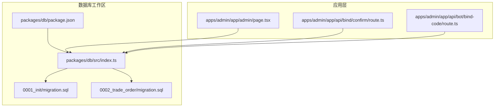
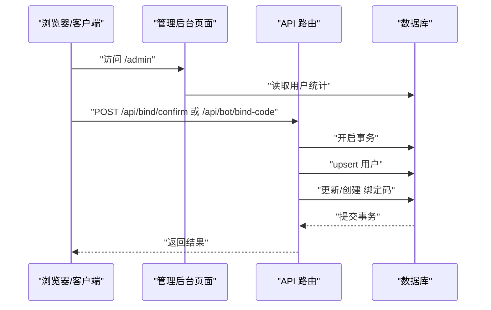
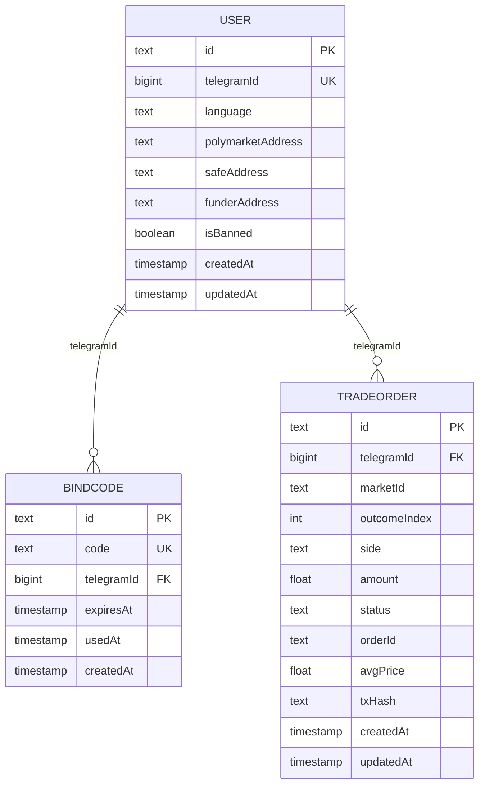
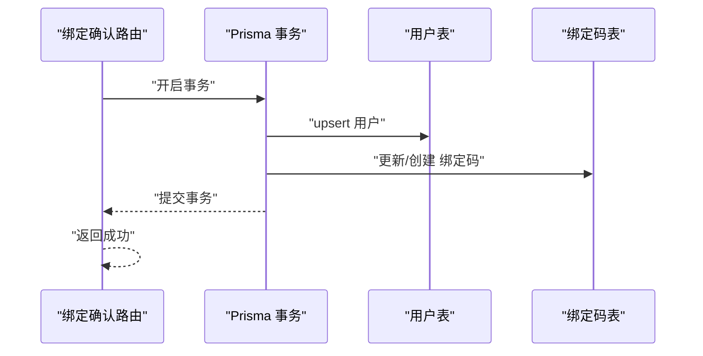
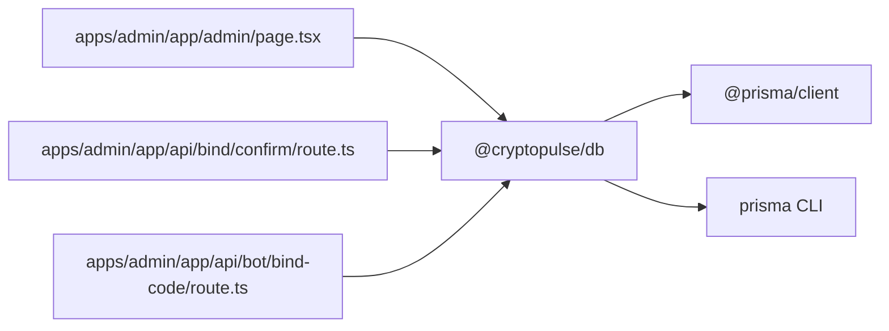

# 数据完整性

<cite>
**本文引用的文件**
- [packages/db/src/index.ts](file://packages/db/src/index.ts)
- [packages/db/package.json](file://packages/db/package.json)
- [packages/db/prisma/migrations/0001_init/migration.sql](file://packages/db/prisma/migrations/0001_init/migration.sql)
- [packages/db/prisma/migrations/0002_trade_order/migration.sql](file://packages/db/prisma/migrations/0002_trade_order/migration.sql)
- [apps/admin/app/api/bind/confirm/route.ts](file://apps/admin/app/api/bind/confirm/route.ts)
- [apps/admin/app/api/bot/bind-code/route.ts](file://apps/admin/app/api/bot/bind-code/route.ts)
- [apps/admin/app/admin/page.tsx](file://apps/admin/app/admin/page.tsx)
- [README.md](file://README.md)
</cite>

## 目录
1. [简介](#简介)
2. [项目结构](#项目结构)
3. [核心组件](#核心组件)
4. [架构总览](#架构总览)
5. [详细组件分析](#详细组件分析)
6. [依赖关系分析](#依赖关系分析)
7. [性能考量](#性能考量)
8. [故障排查指南](#故障排查指南)
9. [结论](#结论)
10. [附录](#附录)

## 简介
本文件聚焦于 CryptoPulse 项目的数据库数据完整性保障体系，围绕以下主题展开：实体完整性、参照完整性、域完整性设计与实现；触发器、存储过程与约束检查的使用场景；事务处理与 ACID 特性保证；数据验证规则与业务规则约束；数据质量控制；备份与恢复策略（全量、增量、时间点恢复）；并发控制与死锁预防；以及数据迁移与版本升级的一致性保障方案。本文严格基于仓库中实际存在的数据库迁移脚本与应用层事务使用示例进行说明。

## 项目结构
项目采用 Monorepo 结构，数据库相关逻辑集中在 packages/db 工作区，通过 Prisma 进行模式管理与迁移。应用层通过 @cryptopulse/db 包注入 Prisma 客户端，并在关键业务流程中使用事务确保一致性。

**图表来源**
- [packages/db/package.json](file://packages/db/package.json#L1-L21)
- [packages/db/src/index.ts](file://packages/db/src/index.ts#L1-L12)
- [packages/db/prisma/migrations/0001_init/migration.sql](file://packages/db/prisma/migrations/0001_init/migration.sql#L1-L40)
- [packages/db/prisma/migrations/0002_trade_order/migration.sql](file://packages/db/prisma/migrations/0002_trade_order/migration.sql#L1-L24)
- [apps/admin/app/admin/page.tsx](file://apps/admin/app/admin/page.tsx#L6-L8)
- [apps/admin/app/api/bind/confirm/route.ts](file://apps/admin/app/api/bind/confirm/route.ts#L63-L78)
- [apps/admin/app/api/bot/bind-code/route.ts](file://apps/admin/app/api/bot/bind-code/route.ts#L71-L85)

**章节来源**
- [README.md](file://README.md#L26-L39)
- [packages/db/package.json](file://packages/db/package.json#L1-L21)

## 核心组件
- 数据库客户端封装：通过 @cryptopulse/db 提供全局单例 PrismaClient，避免重复连接与资源泄漏。
- 迁移与模式：使用 Prisma 迁移脚本定义表结构、主键、唯一索引与外键约束。
- 应用层事务：在绑定确认与机器人绑定码流程中使用 Prisma 事务，确保多步写入原子性。
- 访问入口：管理后台与 API 路由通过 @cryptopulse/db 获取 Prisma 实例执行查询与更新。

**章节来源**
- [packages/db/src/index.ts](file://packages/db/src/index.ts#L1-L12)
- [apps/admin/app/admin/page.tsx](file://apps/admin/app/admin/page.tsx#L6-L8)
- [apps/admin/app/api/bind/confirm/route.ts](file://apps/admin/app/api/bind/confirm/route.ts#L63-L78)
- [apps/admin/app/api/bot/bind-code/route.ts](file://apps/admin/app/api/bot/bind-code/route.ts#L71-L85)

## 架构总览
下图展示了应用层如何通过 @cryptopulse/db 访问数据库，以及事务在关键流程中的作用。

**图表来源**
- [apps/admin/app/admin/page.tsx](file://apps/admin/app/admin/page.tsx#L6-L8)
- [apps/admin/app/api/bind/confirm/route.ts](file://apps/admin/app/api/bind/confirm/route.ts#L63-L78)
- [apps/admin/app/api/bot/bind-code/route.ts](file://apps/admin/app/api/bot/bind-code/route.ts#L71-L85)

## 详细组件分析

### 表结构与完整性约束
- 用户表（User）
  - 主键：id
  - 唯一约束：telegramId
  - 默认值与非空：language、createdAt、updatedAt 等
  - 域完整性：布尔字段 isBanned、文本字段 language 等
- 绑定码表（BindCode）
  - 主键：id
  - 唯一约束：code
  - 外键：telegramId 引用 User.telegramId，级联删除与更新
- 交易订单表（TradeOrder）
  - 主键：id
  - 复合索引：(telegramId, createdAt)、(marketId, outcomeIndex)
  - 外键：telegramId 引用 User.telegramId，级联删除与更新
  - 默认值与非空：status、createdAt、updatedAt 等

**图表来源**
- [packages/db/prisma/migrations/0001_init/migration.sql](file://packages/db/prisma/migrations/0001_init/migration.sql#L5-L38)
- [packages/db/prisma/migrations/0002_trade_order/migration.sql](file://packages/db/prisma/migrations/0002_trade_order/migration.sql#L1-L23)

**章节来源**
- [packages/db/prisma/migrations/0001_init/migration.sql](file://packages/db/prisma/migrations/0001_init/migration.sql#L1-L40)
- [packages/db/prisma/migrations/0002_trade_order/migration.sql](file://packages/db/prisma/migrations/0002_trade_order/migration.sql#L1-L24)

### 触发器、存储过程与约束检查
- 当前仓库未发现显式的触发器或存储过程定义。
- 完整性主要通过：
  - 表级约束：主键、唯一索引、外键、默认值与非空约束
  - 应用层事务：确保跨表写入的原子性
- 建议：如需复杂校验或审计，可在数据库层面引入触发器与存储过程，并在应用层通过 Prisma 的自定义 SQL 接口调用。

**章节来源**
- [packages/db/prisma/migrations/0001_init/migration.sql](file://packages/db/prisma/migrations/0001_init/migration.sql#L16-L38)
- [packages/db/prisma/migrations/0002_trade_order/migration.sql](file://packages/db/prisma/migrations/0002_trade_order/migration.sql#L15-L23)

### 事务处理与 ACID 保证
- 原子性：绑定确认流程使用 Prisma 事务，将 upsert 用户与更新绑定码合并为单一事务，任一步失败整体回滚。
- 一致性：外键与唯一约束确保引用与业务一致。
- 隔离性：PostgreSQL 默认隔离级别配合 Prisma 事务，避免脏读与不可重复读。
- 持久性：数据库提交后持久化，结合备份策略保障。

**图表来源**
- [apps/admin/app/api/bind/confirm/route.ts](file://apps/admin/app/api/bind/confirm/route.ts#L63-L78)

**章节来源**
- [apps/admin/app/api/bind/confirm/route.ts](file://apps/admin/app/api/bind/confirm/route.ts#L63-L78)

### 数据验证规则、业务规则约束与质量控制
- 验证规则
  - 唯一性：telegramId（用户）、code（绑定码）
  - 参照完整性：绑定码与交易订单均外键关联用户 telegramId
  - 默认值与非空：语言、创建/更新时间戳、订单状态等
- 业务规则
  - 绑定码过期时间与使用状态字段用于业务控制
  - 订单状态默认 PENDING，后续由外部系统更新
- 质量控制
  - 应用层事务保证跨表写入一致性
  - Prisma 客户端类型安全减少运行时错误

**章节来源**
- [packages/db/prisma/migrations/0001_init/migration.sql](file://packages/db/prisma/migrations/0001_init/migration.sql#L31-L38)
- [packages/db/prisma/migrations/0002_trade_order/migration.sql](file://packages/db/prisma/migrations/0002_trade_order/migration.sql#L18-L23)
- [apps/admin/app/api/bot/bind-code/route.ts](file://apps/admin/app/api/bot/bind-code/route.ts#L71-L85)

### 并发控制与死锁预防
- 并发控制
  - 使用 Prisma 事务包裹高冲突写操作，降低并发冲突概率
  - 复合索引优化常见查询路径，减少锁竞争
- 死锁预防
  - 统一写入顺序（先用户后绑定码/订单）
  - 缩短事务持续时间，避免长时间持有锁
  - 对热点数据增加只读副本或缓存（Redis）分流读压力

**章节来源**
- [packages/db/prisma/migrations/0002_trade_order/migration.sql](file://packages/db/prisma/migrations/0002_trade_order/migration.sql#L18-L23)
- [apps/admin/app/api/bind/confirm/route.ts](file://apps/admin/app/api/bind/confirm/route.ts#L63-L78)

### 数据备份与恢复策略
- 全量备份
  - 使用数据库导出工具生成完整快照，定期归档
- 增量备份
  - 基于 WAL 日志的增量备份，缩短 RPO
- 时间点恢复（PITR）
  - 结合全量与增量备份，定位到任意时间点进行恢复
- 运维建议
  - 制定备份窗口与验证流程
  - 在测试环境演练恢复流程，确保可恢复性

[本节为通用运维建议，不直接分析具体文件]

### 数据迁移与版本升级一致性
- 迁移策略
  - 使用 Prisma 迁移脚本管理结构变更，确保多环境一致
  - 变更前先在测试环境执行迁移，验证约束与索引
- 升级一致性
  - 通过事务保证关键写入的原子性
  - 对历史数据进行预校验与清洗，避免违反新约束

**章节来源**
- [README.md](file://README.md#L26-L39)
- [packages/db/package.json](file://packages/db/package.json#L8-L12)

## 依赖关系分析
- @cryptopulse/db 作为数据库客户端包，被管理后台与 API 路由共同依赖
- Prisma 作为 ORM 与迁移工具，负责生成客户端与执行迁移
- 应用层通过事务协调多个数据写入，确保一致性

**图表来源**
- [apps/admin/app/admin/page.tsx](file://apps/admin/app/admin/page.tsx#L6-L8)
- [apps/admin/app/api/bind/confirm/route.ts](file://apps/admin/app/api/bind/confirm/route.ts#L63-L78)
- [apps/admin/app/api/bot/bind-code/route.ts](file://apps/admin/app/api/bot/bind-code/route.ts#L71-L85)
- [packages/db/src/index.ts](file://packages/db/src/index.ts#L1-L12)
- [packages/db/package.json](file://packages/db/package.json#L8-L12)

**章节来源**
- [packages/db/src/index.ts](file://packages/db/src/index.ts#L1-L12)
- [packages/db/package.json](file://packages/db/package.json#L1-L21)

## 性能考量
- 索引优化：复合索引提升查询效率，降低锁竞争
- 事务粒度：尽量缩小事务范围，减少锁持有时间
- 连接池：Prisma 默认连接池配置满足一般场景，必要时根据负载调整
- 监控：启用 Prisma 日志与数据库慢查询日志，识别瓶颈

[本节提供通用指导，不直接分析具体文件]

## 故障排查指南
- 数据库不可用
  - API 路由对数据库连接失败进行统一错误响应，便于快速定位
- 事务异常
  - 检查事务包裹的多步写入是否满足外键与唯一约束
  - 关注并发写入导致的锁等待与重试
- 迁移失败
  - 查看 Prisma 迁移日志，确认目标数据库版本与迁移脚本匹配

**章节来源**
- [apps/admin/app/api/bind/confirm/route.ts](file://apps/admin/app/api/bind/confirm/route.ts#L22-L29)
- [apps/admin/app/api/bot/bind-code/route.ts](file://apps/admin/app/api/bot/bind-code/route.ts#L46-L67)
- [README.md](file://README.md#L26-L39)

## 结论
CryptoPulse 项目通过 Prisma 迁移脚本实现了明确的实体、参照与域完整性约束，并在关键业务流程中使用事务确保 ACID 一致性。结合索引优化与合理的并发控制策略，系统在现有代码范围内具备良好的数据完整性保障能力。建议后续在数据库层面引入必要的触发器与存储过程以增强复杂业务规则与审计能力，并完善备份与恢复演练，确保生产环境的高可靠运行。

## 附录
- 初始化迁移脚本：定义用户、绑定码与交易订单表结构及约束
- 交易订单迁移脚本：新增索引与外键，优化查询与一致性
- 应用层事务示例：绑定确认与机器人绑定码流程

**章节来源**
- [packages/db/prisma/migrations/0001_init/migration.sql](file://packages/db/prisma/migrations/0001_init/migration.sql#L1-L40)
- [packages/db/prisma/migrations/0002_trade_order/migration.sql](file://packages/db/prisma/migrations/0002_trade_order/migration.sql#L1-L24)
- [apps/admin/app/api/bind/confirm/route.ts](file://apps/admin/app/api/bind/confirm/route.ts#L63-L78)
- [apps/admin/app/api/bot/bind-code/route.ts](file://apps/admin/app/api/bot/bind-code/route.ts#L71-L85)