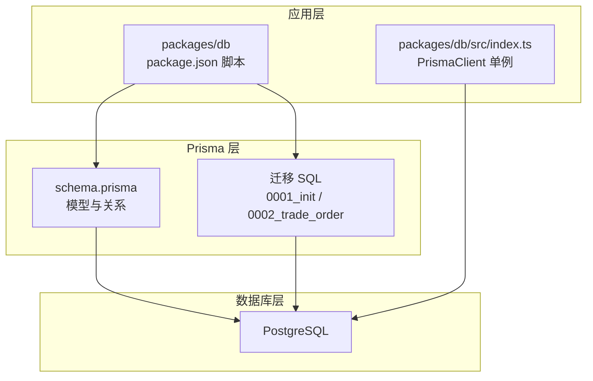
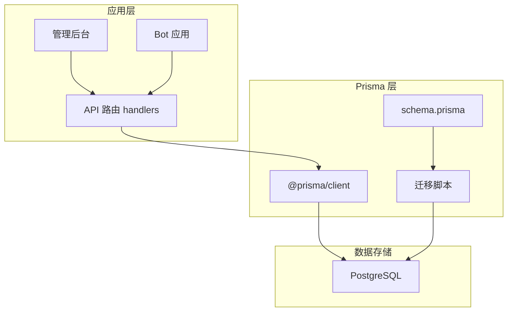
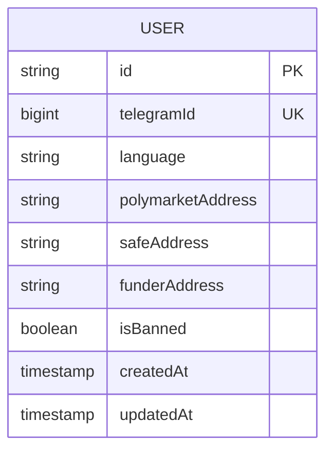
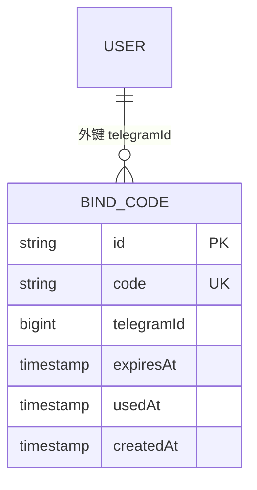
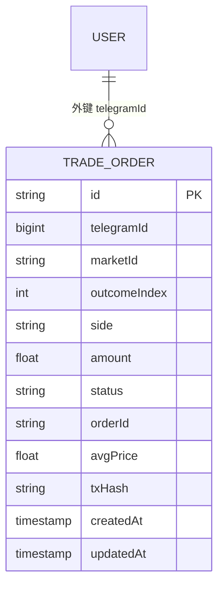
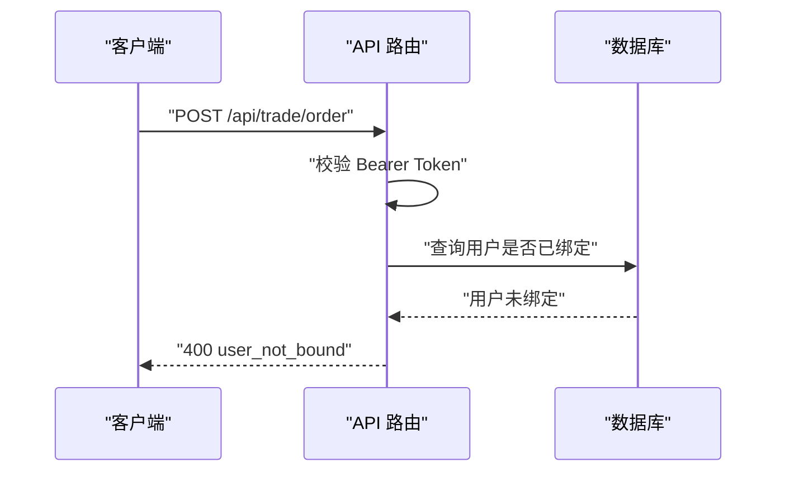
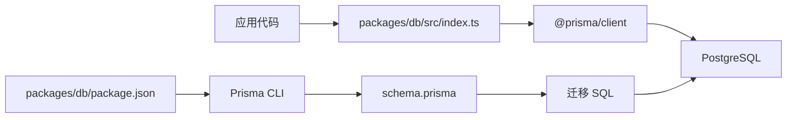

# 数据库设计

<cite>
**本文引用的文件**
- [packages/db/prisma/schema.prisma](file://packages/db/prisma/schema.prisma)
- [packages/db/prisma/migrations/0001_init/migration.sql](file://packages/db/prisma/migrations/0001_init/migration.sql)
- [packages/db/prisma/migrations/0002_trade_order/migration.sql](file://packages/db/prisma/migrations/0002_trade_order/migration.sql)
- [packages/db/src/index.ts](file://packages/db/src/index.ts)
- [packages/db/package.json](file://packages/db/package.json)
- [specs/cryptopulse/design.md](file://specs/cryptopulse/design.md)
- [README.md](file://README.md)
- [test/trade-order.test.ts](file://test/trade-order.test.ts)
</cite>

## 目录
1. [简介](#简介)
2. [项目结构](#项目结构)
3. [核心组件](#核心组件)
4. [架构总览](#架构总览)
5. [详细组件分析](#详细组件分析)
6. [依赖分析](#依赖分析)
7. [性能考量](#性能考量)
8. [故障排查指南](#故障排查指南)
9. [结论](#结论)
10. [附录](#附录)

## 简介
本文件面向 CryptoPulse 项目的数据库设计，基于 Prisma Schema 与迁移脚本，系统梳理用户、绑定码、订单等核心实体的数据模型、关系与约束，解释主键、外键、索引策略及数据完整性保障机制。同时结合设计文档与测试用例，说明数据访问模式、查询优化策略、迁移与版本管理、备份恢复思路以及缓存与一致性保障。

## 项目结构
数据库相关代码集中在 packages/db 包内，采用 Prisma 管理 schema 与迁移，通过 Prisma Client 在应用层访问数据库。核心文件包括：
- Prisma Schema：定义模型、关系与索引
- 初始迁移：创建用户与绑定码表，建立唯一索引与外键
- 订单迁移：创建订单表，添加复合索引与外键
- 数据库访问封装：全局 Prisma Client 单例
- 项目脚本：生成客户端与执行迁移

图表来源
- [packages/db/prisma/schema.prisma](file://packages/db/prisma/schema.prisma#L1-L56)
- [packages/db/prisma/migrations/0001_init/migration.sql](file://packages/db/prisma/migrations/0001_init/migration.sql#L1-L40)
- [packages/db/prisma/migrations/0002_trade_order/migration.sql](file://packages/db/prisma/migrations/0002_trade_order/migration.sql#L1-L24)
- [packages/db/src/index.ts](file://packages/db/src/index.ts#L1-L13)
- [packages/db/package.json](file://packages/db/package.json#L1-L22)

章节来源
- [packages/db/prisma/schema.prisma](file://packages/db/prisma/schema.prisma#L1-L56)
- [packages/db/prisma/migrations/0001_init/migration.sql](file://packages/db/prisma/migrations/0001_init/migration.sql#L1-L40)
- [packages/db/prisma/migrations/0002_trade_order/migration.sql](file://packages/db/prisma/migrations/0002_trade_order/migration.sql#L1-L24)
- [packages/db/src/index.ts](file://packages/db/src/index.ts#L1-L13)
- [packages/db/package.json](file://packages/db/package.json#L1-L22)
- [README.md](file://README.md#L20-L40)

## 核心组件
本节聚焦于核心实体模型与关系，涵盖用户、绑定码、订单三张表，说明字段定义、数据类型、主键/外键与索引策略，并解释业务规则与数据完整性保障。

- 用户表（User）
  - 主键：字符串类型，使用 Prisma 默认 cuid()
  - 标识：telegramId（BigInt，唯一）
  - 语言：字符串，默认 zh-CN
  - 地址字段：polymarketAddress、safeAddress、funderAddress（字符串，可空）
  - 状态：isBanned（布尔，默认 false）
  - 时间戳：createdAt、updatedAt（DateTime）
  - 关系：一对多，关联绑定码与订单
  - 约束：telegramId 唯一

- 绑定码表（BindCode）
  - 主键：字符串类型，使用 Prisma 默认 cuid()
  - 字段：code（字符串，唯一）、telegramId（BigInt）、expiresAt（DateTime）、usedAt（DateTime，可空）、createdAt（DateTime）
  - 关系：与 User 通过 telegramId 建立外键，删除级联
  - 约束：code 唯一；外键指向 User.telegramId

- 订单表（TradeOrder）
  - 主键：字符串类型，使用 Prisma 默认 cuid()
  - 标识：telegramId（BigInt）、marketId（字符串）、outcomeIndex（整数）、side（字符串）
  - 金额与价格：amount（浮点）、avgPrice（浮点，可空）
  - 状态：status（字符串，默认 PENDING）、orderId（字符串，可空）、txHash（字符串，可空）
  - 时间戳：createdAt、updatedAt（DateTime）
  - 关系：与 User 通过 telegramId 建立外键，删除级联
  - 索引：复合索引（telegramId, createdAt）、（marketId, outcomeIndex）

章节来源
- [packages/db/prisma/schema.prisma](file://packages/db/prisma/schema.prisma#L10-L54)
- [packages/db/prisma/migrations/0001_init/migration.sql](file://packages/db/prisma/migrations/0001_init/migration.sql#L4-L38)
- [packages/db/prisma/migrations/0002_trade_order/migration.sql](file://packages/db/prisma/migrations/0002_trade_order/migration.sql#L1-L23)

## 架构总览
下图展示数据库层与应用层交互，以及 Prisma 在其中的角色：通过 schema 定义模型与关系，通过迁移脚本在数据库中落地结构，通过 Prisma Client 在应用中进行数据访问。

图表来源
- [packages/db/prisma/schema.prisma](file://packages/db/prisma/schema.prisma#L1-L8)
- [packages/db/prisma/migrations/0001_init/migration.sql](file://packages/db/prisma/migrations/0001_init/migration.sql#L1-L40)
- [packages/db/prisma/migrations/0002_trade_order/migration.sql](file://packages/db/prisma/migrations/0002_trade_order/migration.sql#L1-L24)
- [packages/db/src/index.ts](file://packages/db/src/index.ts#L1-L13)

## 详细组件分析

### 用户表（User）
- 设计要点
  - 使用字符串主键与 cuid() 默认值，便于跨系统引用与分布式场景
  - telegramId 作为外部标识符且唯一，用于与订单与绑定码关联
  - 地址字段可空，支持多种钱包形态（EOA/Safe/可选资助者）
  - isBanned 控制用户状态，便于风控与审计
- 约束与索引
  - telegramId 唯一索引（迁移脚本中定义）
- 业务规则
  - 用户必须先完成绑定（存在绑定码记录）才能进行下单等关键操作（见测试用例）

图表来源
- [packages/db/prisma/schema.prisma](file://packages/db/prisma/schema.prisma#L10-L23)
- [packages/db/prisma/migrations/0001_init/migration.sql](file://packages/db/prisma/migrations/0001_init/migration.sql#L4-L17)

章节来源
- [packages/db/prisma/schema.prisma](file://packages/db/prisma/schema.prisma#L10-L23)
- [packages/db/prisma/migrations/0001_init/migration.sql](file://packages/db/prisma/migrations/0001_init/migration.sql#L4-L17)

### 绑定码表（BindCode）
- 设计要点
  - code 唯一，用于一次性绑定流程
  - expiresAt 控制有效期，usedAt 记录使用时间
  - 与 User 通过 telegramId 建立外键，删除级联，确保用户删除时清理绑定码
- 约束与索引
  - code 唯一索引（迁移脚本中定义）
  - 外键约束指向 User.telegramId（迁移脚本中定义）

图表来源
- [packages/db/prisma/schema.prisma](file://packages/db/prisma/schema.prisma#L25-L34)
- [packages/db/prisma/migrations/0001_init/migration.sql](file://packages/db/prisma/migrations/0001_init/migration.sql#L19-L38)

章节来源
- [packages/db/prisma/schema.prisma](file://packages/db/prisma/schema.prisma#L25-L34)
- [packages/db/prisma/migrations/0001_init/migration.sql](file://packages/db/prisma/migrations/0001_init/migration.sql#L19-L38)

### 订单表（TradeOrder）
- 设计要点
  - 以字符串主键与 cuid() 默认值统一主键风格
  - 标识字段包含 marketId、outcomeIndex、side，便于按市场与方向聚合统计
  - amount 与 avgPrice 支持浮点，满足金融数值精度需求
  - status 默认 PENDING，支持后续状态机演进
  - orderId、txHash 记录链上结果，便于对账与回溯
- 索引策略
  - (telegramId, createdAt)：按用户维度查询历史订单
  - (marketId, outcomeIndex)：按市场与方向快速定位订单
- 约束
  - 外键约束指向 User.telegramId（迁移脚本中定义）

图表来源
- [packages/db/prisma/schema.prisma](file://packages/db/prisma/schema.prisma#L36-L54)
- [packages/db/prisma/migrations/0002_trade_order/migration.sql](file://packages/db/prisma/migrations/0002_trade_order/migration.sql#L1-L23)

章节来源
- [packages/db/prisma/schema.prisma](file://packages/db/prisma/schema.prisma#L36-L54)
- [packages/db/prisma/migrations/0002_trade_order/migration.sql](file://packages/db/prisma/migrations/0002_trade_order/migration.sql#L1-L23)

### 数据访问与业务规则
- 认证与授权
  - 订单接口需要有效 Bearer Token，未绑定用户会返回错误（见测试用例）
  - 管理后台使用 ADMIN_TOKEN 保护高权限入口
- 数据完整性
  - 用户必须先绑定（存在绑定码记录）方可下单
  - 删除用户时，绑定码与订单通过外键级联删除，避免悬挂数据

图表来源
- [test/trade-order.test.ts](file://test/trade-order.test.ts#L50-L78)
- [specs/cryptopulse/design.md](file://specs/cryptopulse/design.md#L146-L153)

章节来源
- [test/trade-order.test.ts](file://test/trade-order.test.ts#L50-L78)
- [specs/cryptopulse/design.md](file://specs/cryptopulse/design.md#L146-L153)

## 依赖分析
- 外部依赖
  - PostgreSQL：数据持久化
  - Prisma：ORM 与迁移管理
  - @prisma/client：运行时客户端
- 内部依赖
  - packages/db/src/index.ts 提供全局 PrismaClient 单例，避免重复实例化
  - packages/db/package.json 中定义 prisma:generate 与 prisma:migrate 脚本，驱动 schema 与迁移

图表来源
- [packages/db/src/index.ts](file://packages/db/src/index.ts#L1-L13)
- [packages/db/package.json](file://packages/db/package.json#L8-L12)
- [packages/db/prisma/schema.prisma](file://packages/db/prisma/schema.prisma#L1-L8)

章节来源
- [packages/db/src/index.ts](file://packages/db/src/index.ts#L1-L13)
- [packages/db/package.json](file://packages/db/package.json#L8-L12)
- [packages/db/prisma/schema.prisma](file://packages/db/prisma/schema.prisma#L1-L8)

## 性能考量
- 索引策略
  - 订单表针对高频查询维度建立复合索引：(telegramId, createdAt) 与 (marketId, outcomeIndex)，有助于分页与聚合查询
- 查询优化建议
  - 按用户查询订单时优先使用 (telegramId, createdAt) 复合索引
  - 按市场与方向聚合时使用 (marketId, outcomeIndex) 复合索引
- 写入优化
  - 使用字符串主键与 cuid() 降低热点冲突风险
  - 批量写入时注意事务边界，避免长时间持有锁
- 缓存与一致性
  - 设计文档指出使用 Redis 缓存公共数据与实时行情，数据库负责强一致业务数据
  - 本地缓存表（如 positions_cache）用于聚合链上与 CLOB 数据，需配合定时刷新与一致性校验

章节来源
- [packages/db/prisma/migrations/0002_trade_order/migration.sql](file://packages/db/prisma/migrations/0002_trade_order/migration.sql#L18-L20)
- [specs/cryptopulse/design.md](file://specs/cryptopulse/design.md#L94-L111)

## 故障排查指南
- 认证失败
  - 症状：返回 401
  - 排查：确认请求头 Authorization 是否携带正确 Bearer Token
- 未绑定用户下单
  - 症状：返回 400 user_not_bound
  - 排查：确认用户是否存在绑定码记录；若不存在，引导用户先完成绑定流程
- 迁移问题
  - 症状：迁移失败或版本不一致
  - 排查：使用 prisma migrate deploy 或 prisma migrate dev --name init；检查 migration_lock.toml 与 schema.prisma

章节来源
- [test/trade-order.test.ts](file://test/trade-order.test.ts#L50-L78)
- [README.md](file://README.md#L26-L40)

## 结论
本数据库设计以 Prisma 为核心，围绕用户、绑定码与订单三大实体构建，采用字符串主键与 cuid() 统一风格，通过唯一索引与外键约束保障数据完整性。迁移脚本清晰地将 schema 落地到 PostgreSQL，配合应用层的认证与授权策略，形成可扩展、可维护的业务数据层。结合 Redis 缓存与本地缓存表，可进一步提升读性能与实时性。

## 附录

### 数据库初始化与迁移流程
- 初始化数据库
  - 设置 DATABASE_URL 指向可用的 PostgreSQL
  - 生成 Prisma 客户端并执行迁移
- 开发环境
  - 使用 prisma:migrate 生成初始迁移
- 生产环境
  - 使用 prisma migrate deploy 部署迁移

章节来源
- [README.md](file://README.md#L26-L40)
- [packages/db/package.json](file://packages/db/package.json#L8-L12)