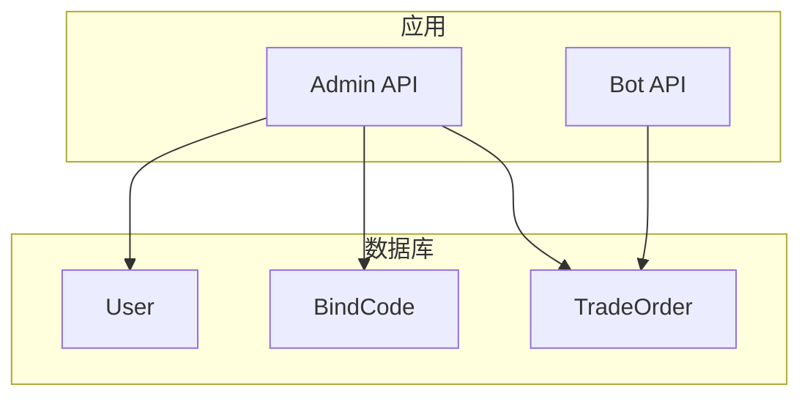
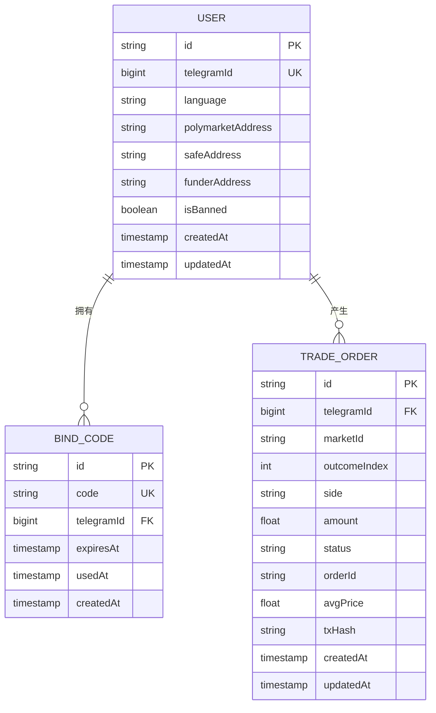
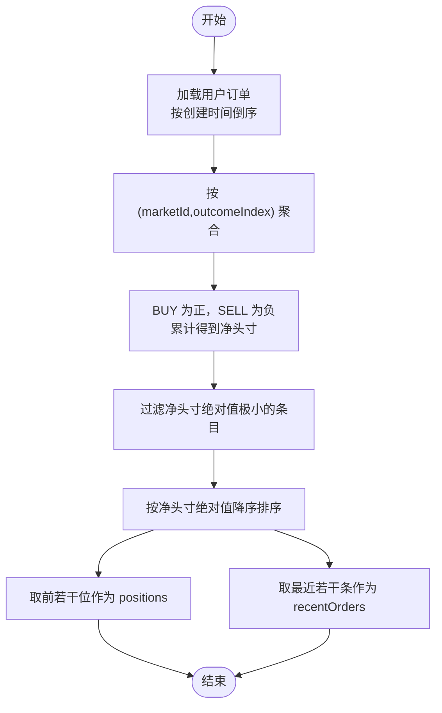
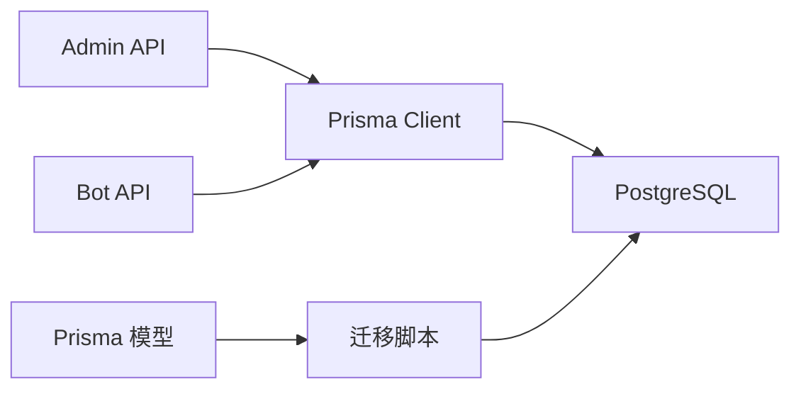

# 数据模型

<cite>
**本文引用的文件**
- [schema.prisma](file://packages/db/prisma/schema.prisma)
- [0001_init/migration.sql](file://packages/db/prisma/migrations/0001_init/migration.sql)
- [0002_trade_order/migration.sql](file://packages/db/prisma/migrations/0002_trade_order/migration.sql)
- [route.ts（绑定码）](file://apps/admin/app/api/bot/bind-code/route.ts)
- [route.ts（下单）](file://apps/admin/app/api/trade/order/route.ts)
- [route.ts（仓位）](file://apps/admin/app/api/trade/portfolio/route.ts)
- [portfolio.ts（机器人）](file://apps/bot/src/portfolio.ts)
- [index.ts（Prisma 客户端）](file://packages/db/src/index.ts)
- [design.md](file://specs/cryptopulse/design.md)
- [trade-portfolio.test.ts](file://test/trade-portfolio.test.ts)
</cite>

## 目录
1. [简介](#简介)
2. [项目结构](#项目结构)
3. [核心组件](#核心组件)
4. [架构总览](#架构总览)
5. [详细组件分析](#详细组件分析)
6. [依赖分析](#依赖分析)
7. [性能考量](#性能考量)
8. [故障排查指南](#故障排查指南)
9. [结论](#结论)
10. [附录](#附录)

## 简介
本文件系统化梳理 CryptoPulse 项目的数据库数据模型，聚焦核心实体及其关系，覆盖字段定义、约束、索引、外键、业务规则与性能影响。重点实体包括：User（用户）、BindCode（绑定码）、TradeOrder（订单）。同时结合现有代码与测试，说明“仓位”聚合逻辑与对外暴露的 API 行为。

## 项目结构
数据库模型由 Prisma 模型定义与迁移脚本共同构成，配合 Admin 与 Bot 两套 API 实现数据访问与业务处理。

图表来源
- [schema.prisma](file://packages/db/prisma/schema.prisma#L10-L54)
- [route.ts（绑定码）](file://apps/admin/app/api/bot/bind-code/route.ts#L72-L99)
- [route.ts（下单）](file://apps/admin/app/api/trade/order/route.ts#L50-L77)
- [route.ts（仓位）](file://apps/admin/app/api/trade/portfolio/route.ts#L42-L74)

章节来源
- [schema.prisma](file://packages/db/prisma/schema.prisma#L1-L56)
- [0001_init/migration.sql](file://packages/db/prisma/migrations/0001_init/migration.sql#L1-L40)
- [0002_trade_order/migration.sql](file://packages/db/prisma/migrations/0002_trade_order/migration.sql#L1-L24)

## 核心组件
本节从字段、类型、约束、默认值、主键/外键、索引等方面逐项解析核心实体。

- User（用户）
  - 字段与类型
    - id：字符串，主键，Prisma 默认使用全局唯一标识符生成器
    - telegramId：整数，唯一索引，作为外部键关联 BindCode 与 TradeOrder
    - language：字符串，默认值 zh-CN
    - polymarketAddress、safeAddress、funderAddress：字符串（可空）
    - isBanned：布尔，默认值 false
    - createdAt、updatedAt：时间戳，默认值与更新时间戳行为由 Prisma 定义
  - 约束与默认值
    - 主键：id
    - 唯一性：telegramId
    - 默认值：language、isBanned、createdAt、updatedAt
  - 外键关系
    - 间接通过 telegramId 与 BindCode、TradeOrder 建立一对多关系
  - 关系
    - 与 BindCode：一对多
    - 与 TradeOrder：一对多

- BindCode（绑定码）
  - 字段与类型
    - id：字符串，主键
    - code：字符串，唯一索引
    - telegramId：整数，外键，引用 User.telegramId
    - expiresAt：时间戳
    - usedAt：时间戳（可空）
    - createdAt：时间戳，默认值
  - 约束与默认值
    - 主键：id
    - 唯一性：code
    - 外键：telegramId → User.telegramId（级联删除）
    - 默认值：createdAt
  - 业务规则
    - 绑定码生成后带过期时间，用于绑定 Telegram 用户与钱包地址
    - 生成过程包含冲突重试（唯一约束冲突时重新生成）

- TradeOrder（订单）
  - 字段与类型
    - id：字符串，主键
    - telegramId：整数，外键，引用 User.telegramId
    - marketId：字符串
    - outcomeIndex：整数
    - side：字符串（枚举：BUY/SELL）
    - amount：浮点数
    - status：字符串，默认值 PENDING
    - orderId：字符串（可空）
    - avgPrice：浮点数（可空）
    - txHash：字符串（可空）
    - createdAt、updatedAt：时间戳，默认值与更新时间戳行为由 Prisma 定义
  - 约束与默认值
    - 主键：id
    - 外键：telegramId → User.telegramId（级联删除）
    - 默认值：status、createdAt、updatedAt
  - 索引
    - 复合索引：(telegramId, createdAt)
    - 复合索引：(marketId, outcomeIndex)
  - 业务规则
    - 下单 API 会校验用户是否已绑定钱包地址，否则拒绝下单
    - 支持模拟模式与真实模式，状态与部分字段根据模式填充

- Portfolio（仓位）说明
  - 当前数据库模型未直接提供名为 Portfolio 的表；“仓位”由 TradeOrder 订单数据聚合计算得出
  - 聚合逻辑
    - 以 (marketId, outcomeIndex) 为维度，按 BUY/SELL 方向累加 amount 得到净头寸
    - 过滤掉净头寸绝对值极小（小于阈值）的条目
    - 按净头寸绝对值降序排序
  - 输出结构
    - positions：按市场与选项聚合后的净头寸列表
    - recentOrders：最近订单快照（截取若干条）

章节来源
- [schema.prisma](file://packages/db/prisma/schema.prisma#L10-L54)
- [0001_init/migration.sql](file://packages/db/prisma/migrations/0001_init/migration.sql#L5-L38)
- [0002_trade_order/migration.sql](file://packages/db/prisma/migrations/0002_trade_order/migration.sql#L1-L23)
- [route.ts（绑定码）](file://apps/admin/app/api/bot/bind-code/route.ts#L72-L99)
- [route.ts（下单）](file://apps/admin/app/api/trade/order/route.ts#L50-L77)
- [route.ts（仓位）](file://apps/admin/app/api/trade/portfolio/route.ts#L42-L74)
- [portfolio.ts（机器人）](file://apps/bot/src/portfolio.ts#L28-L38)
- [trade-portfolio.test.ts](file://test/trade-portfolio.test.ts#L49-L94)

## 架构总览
下图展示实体关系与关键业务流程：

图表来源
- [schema.prisma](file://packages/db/prisma/schema.prisma#L10-L54)
- [0001_init/migration.sql](file://packages/db/prisma/migrations/0001_init/migration.sql#L5-L38)
- [0002_trade_order/migration.sql](file://packages/db/prisma/migrations/0002_trade_order/migration.sql#L1-L23)

## 详细组件分析

### User（用户）实体
- 主键设计
  - 使用全局唯一标识符生成器，确保跨服务一致性与安全性
- 唯一性约束
  - telegramId 唯一，保证一个 Telegram 用户仅一条记录
- 默认值与时间戳
  - language 默认 zh-CN；createdAt 默认当前时间；updatedAt 自动更新
- 外键关系
  - 通过 telegramId 与 BindCode、TradeOrder 建立一对多关系
- 业务规则
  - 下单前需检查用户是否存在且已绑定钱包地址

章节来源
- [schema.prisma](file://packages/db/prisma/schema.prisma#L10-L23)
- [route.ts（下单）](file://apps/admin/app/api/trade/order/route.ts#L50-L57)

### BindCode（绑定码）实体
- 主键设计
  - 使用全局唯一标识符生成器
- 唯一性约束
  - code 唯一，避免重复绑定
- 外键关系
  - telegramId 引用 User.telegramId，删除用户时级联删除绑定码
- 生成流程
  - 生成随机绑定码，若唯一约束冲突则重试最多若干次
  - 设置过期时间（示例为 10 分钟）
- 业务规则
  - 绑定码用于将 Telegram 用户与钱包地址建立关联

章节来源
- [schema.prisma](file://packages/db/prisma/schema.prisma#L25-L34)
- [0001_init/migration.sql](file://packages/db/prisma/migrations/0001_init/migration.sql#L20-L38)
- [route.ts（绑定码）](file://apps/admin/app/api/bot/bind-code/route.ts#L72-L99)

### TradeOrder（订单）实体
- 主键设计
  - 使用全局唯一标识符生成器
- 默认值与时间戳
  - status 默认 PENDING；createdAt 默认当前时间；updatedAt 自动更新
- 外键关系
  - telegramId 引用 User.telegramId，删除用户时级联删除订单
- 索引设计
  - (telegramId, createdAt)：加速按用户与时间的查询
  - (marketId, outcomeIndex)：加速按市场与选项的查询
- 业务规则
  - 下单前校验用户绑定状态
  - 支持模拟模式与真实模式，状态与部分字段按模式填充

章节来源
- [schema.prisma](file://packages/db/prisma/schema.prisma#L36-L54)
- [0002_trade_order/migration.sql](file://packages/db/prisma/migrations/0002_trade_order/migration.sql#L1-L23)
- [route.ts（下单）](file://apps/admin/app/api/trade/order/route.ts#L50-L77)

### Portfolio（仓位）聚合逻辑
- 聚合维度
  - 以 (marketId, outcomeIndex) 为键，按 BUY/SELL 方向累加 amount
- 过滤与排序
  - 过滤掉净头寸绝对值极小的条目
  - 按净头寸绝对值降序排序
- 输出
  - positions：聚合后的净头寸列表
  - recentOrders：最近订单快照（截取若干条）

图表来源
- [route.ts（仓位）](file://apps/admin/app/api/trade/portfolio/route.ts#L42-L74)
- [portfolio.ts（机器人）](file://apps/bot/src/portfolio.ts#L28-L38)
- [trade-portfolio.test.ts](file://test/trade-portfolio.test.ts#L49-L94)

章节来源
- [route.ts（仓位）](file://apps/admin/app/api/trade/portfolio/route.ts#L42-L74)
- [portfolio.ts（机器人）](file://apps/bot/src/portfolio.ts#L28-L38)
- [trade-portfolio.test.ts](file://test/trade-portfolio.test.ts#L49-L94)

## 依赖分析
- 模型与迁移
  - Prisma 模型定义了实体、关系与索引；迁移脚本在数据库层面落地
- 应用层依赖
  - Admin API 与 Bot API 通过 Prisma 客户端访问数据库
  - 业务逻辑在路由层完成：绑定码生成、下单、仓位聚合
- 外部依赖
  - Prisma Client（全局实例）
  - 环境变量：DATABASE_URL、BOT_API_TOKEN 等

图表来源
- [index.ts（Prisma 客户端）](file://packages/db/src/index.ts#L1-L13)
- [schema.prisma](file://packages/db/prisma/schema.prisma#L1-L8)
- [0001_init/migration.sql](file://packages/db/prisma/migrations/0001_init/migration.sql#L1-L40)
- [0002_trade_order/migration.sql](file://packages/db/prisma/migrations/0002_trade_order/migration.sql#L1-L24)

章节来源
- [index.ts（Prisma 客户端）](file://packages/db/src/index.ts#L1-L13)
- [schema.prisma](file://packages/db/prisma/schema.prisma#L1-L8)

## 性能考量
- 索引设计
  - (telegramId, createdAt)：适合按用户查询最新订单或分页场景
  - (marketId, outcomeIndex)：适合按市场与选项聚合或筛选
- 聚合复杂度
  - 仓位聚合在应用层进行，时间复杂度 O(n)，空间复杂度 O(k)（k 为不同 (marketId,outcomeIndex) 的组合数）
- I/O 与锁
  - 绑定码生成存在唯一约束冲突重试，建议控制并发与重试次数
- 建议
  - 若订单量持续增长，可考虑在数据库侧维护“PositionCache”表以减少聚合开销（参考设计文档提及的 PositionCache）

章节来源
- [0002_trade_order/migration.sql](file://packages/db/prisma/migrations/0002_trade_order/migration.sql#L18-L20)
- [route.ts（仓位）](file://apps/admin/app/api/trade/portfolio/route.ts#L42-L74)
- [design.md](file://specs/cryptopulse/design.md#L113-L126)

## 故障排查指南
- 认证失败
  - 现象：返回 unauthorized
  - 排查：确认 Authorization 头与 BOT_API_TOKEN 是否一致
- 数据库不可用
  - 现象：返回 database_unavailable 或 prisma_unavailable
  - 排查：检查 DATABASE_URL 是否正确配置
- 参数校验失败
  - 现象：返回 invalid_query 或 invalid_body
  - 排查：核对查询参数与请求体格式（如 telegramId、marketId、amount、side 等）
- 用户未绑定
  - 现象：下单时报 user_not_bound
  - 排查：确认用户已在数据库中存在且已绑定钱包地址
- 绑定码生成冲突
  - 现象：code_generation_failed
  - 排查：唯一约束冲突导致重试失败，检查 code 唯一性与重试上限

章节来源
- [route.ts（绑定码）](file://apps/admin/app/api/bot/bind-code/route.ts#L34-L103)
- [route.ts（下单）](file://apps/admin/app/api/trade/order/route.ts#L16-L93)
- [route.ts（仓位）](file://apps/admin/app/api/trade/portfolio/route.ts#L17-L78)

## 结论
本数据模型以 User、BindCode、TradeOrder 为核心，通过 Prisma 与迁移脚本在数据库层面落地，配合 Admin 与 Bot API 实现绑定、下单与仓位聚合等关键业务。当前未直接提供 Portfolio 表，但通过 TradeOrder 订单聚合即可满足“仓位”需求。建议在生产环境中评估引入 PositionCache 表以优化聚合性能，并完善字段级业务规则与索引策略以支撑高并发场景。

## 附录
- 设计文档中的最小表集合与 API 列表可作为补充参考
- 测试用例展示了仓位聚合与下单流程的关键行为

章节来源
- [design.md](file://specs/cryptopulse/design.md#L113-L138)
- [trade-portfolio.test.ts](file://test/trade-portfolio.test.ts#L49-L94)