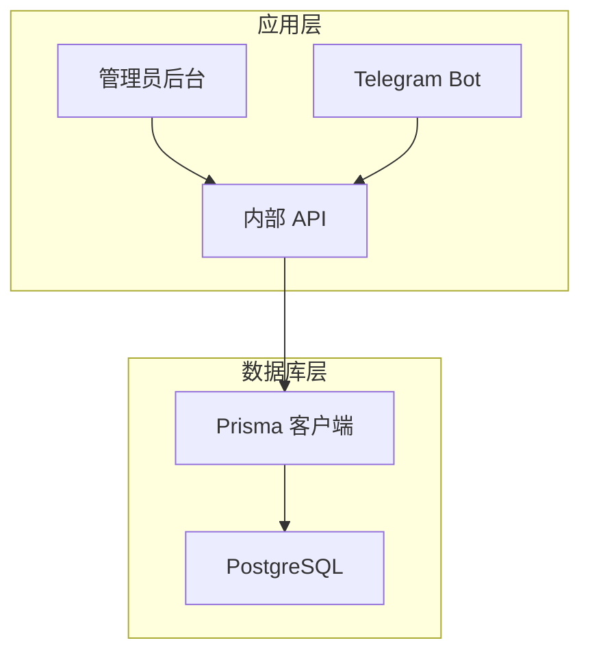
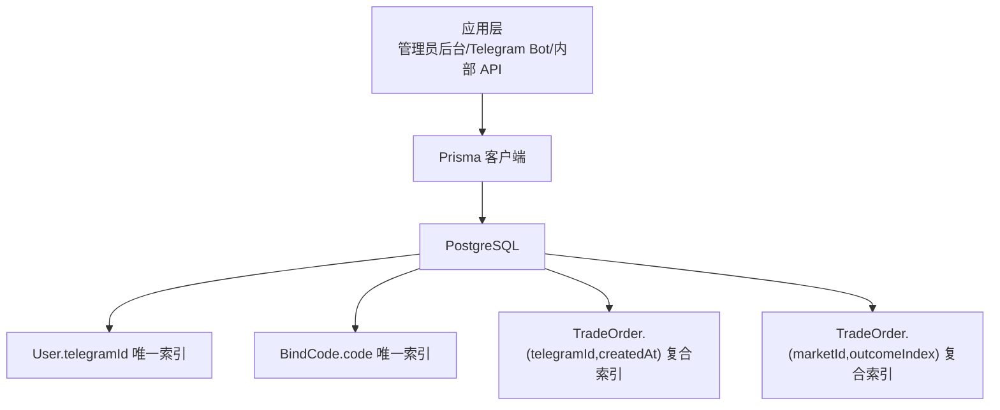
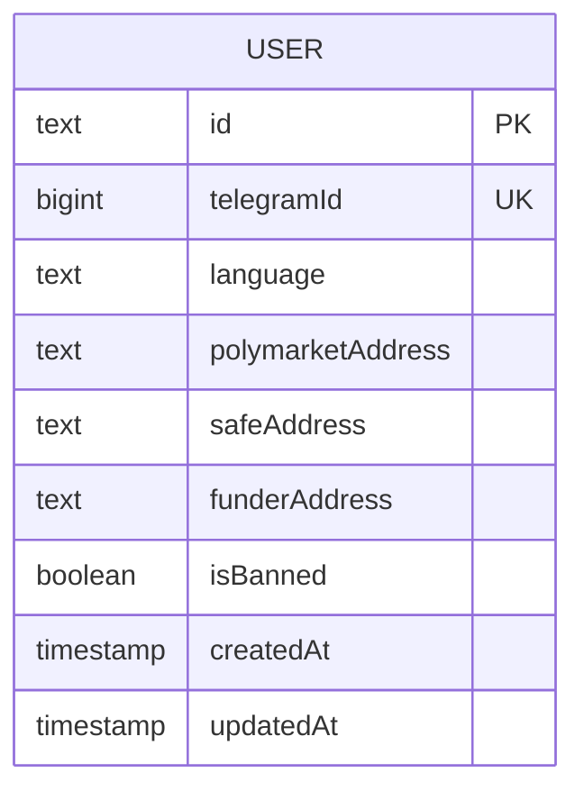
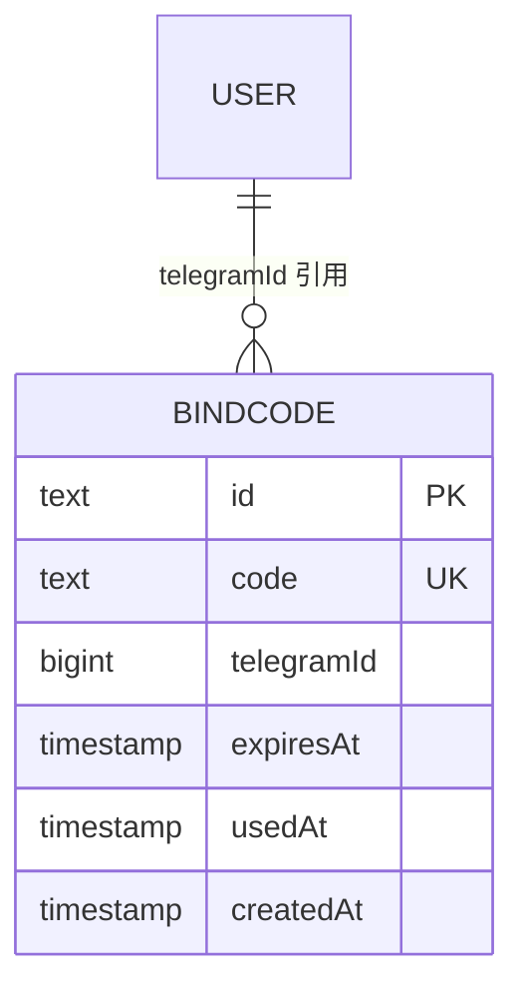
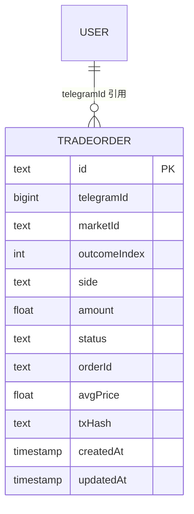
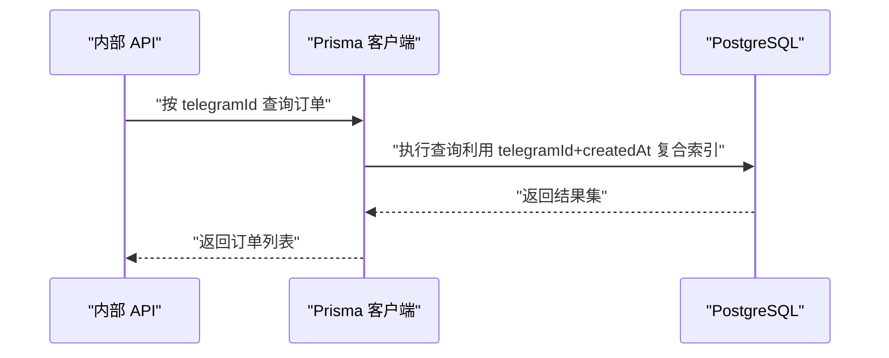
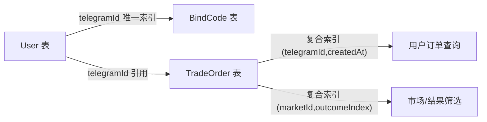

# 索引策略

<cite>
**本文引用的文件**
- [packages/db/prisma/schema.prisma](file://packages/db/prisma/schema.prisma)
- [packages/db/prisma/migrations/0001_init/migration.sql](file://packages/db/prisma/migrations/0001_init/migration.sql)
- [packages/db/prisma/migrations/0002_trade_order/migration.sql](file://packages/db/prisma/migrations/0002_trade_order/migration.sql)
- [specs/cryptopulse/design.md](file://specs/cryptopulse/design.md)
</cite>

## 目录
1. [简介](#简介)
2. [项目结构](#项目结构)
3. [核心组件](#核心组件)
4. [架构总览](#架构总览)
5. [详细组件分析](#详细组件分析)
6. [依赖分析](#依赖分析)
7. [性能考量](#性能考量)
8. [故障排查指南](#故障排查指南)
9. [结论](#结论)
10. [附录](#附录)

## 简介
本文件围绕 CryptoPulse 项目的数据库索引策略展开，结合现有 Prisma 模型与迁移脚本，系统梳理主键索引、唯一索引、复合索引、部分索引等设计原则与实践建议。重点解释索引选择与查询模式、写入性能与存储开销之间的平衡，覆盖索引使用情况分析、查询计划优化、索引维护与重建策略、分区表与全局索引的设计考虑，以及索引对并发性能与锁机制的影响。

## 项目结构
CryptoPulse 的数据库层采用 PostgreSQL + Prisma 架构，核心数据模型与索引定义集中在 Prisma schema 中，迁移脚本用于创建表结构与索引。根据设计文档，业务表包括用户、绑定码、交易订单等，这些表构成了索引策略的基础。

**章节来源**
- [packages/db/prisma/schema.prisma](file://packages/db/prisma/schema.prisma#L1-L56)
- [specs/cryptopulse/design.md](file://specs/cryptopulse/design.md#L113-L126)

## 核心组件
- 用户表（User）：主键为 id，唯一索引覆盖 telegramId，便于按 Telegram 标识快速检索与去重。
- 绑定码表（BindCode）：主键为 id，唯一索引覆盖 code，确保一次性绑定码的唯一性。
- 交易订单表（TradeOrder）：主键为 id，复合索引覆盖 (telegramId, createdAt) 与 (marketId, outcomeIndex)，支撑用户订单分页与市场/结果维度的筛选。

上述索引均来自 Prisma 模型定义与迁移脚本，体现了以查询模式驱动的索引设计思路。

**章节来源**
- [packages/db/prisma/schema.prisma](file://packages/db/prisma/schema.prisma#L10-L54)
- [packages/db/prisma/migrations/0001_init/migration.sql](file://packages/db/prisma/migrations/0001_init/migration.sql#L5-L39)
- [packages/db/prisma/migrations/0002_trade_order/migration.sql](file://packages/db/prisma/migrations/0002_trade_order/migration.sql#L1-L24)

## 架构总览
下图展示了数据库索引在整体架构中的位置与作用：应用层通过 Prisma 访问 PostgreSQL，索引直接影响查询性能与并发表现。

**图表来源**
- [packages/db/prisma/schema.prisma](file://packages/db/prisma/schema.prisma#L10-L54)
- [packages/db/prisma/migrations/0001_init/migration.sql](file://packages/db/prisma/migrations/0001_init/migration.sql#L31-L35)
- [packages/db/prisma/migrations/0002_trade_order/migration.sql](file://packages/db/prisma/migrations/0002_trade_order/migration.sql#L18-L20)

**章节来源**
- [packages/db/prisma/schema.prisma](file://packages/db/prisma/schema.prisma#L1-L56)
- [packages/db/prisma/migrations/0001_init/migration.sql](file://packages/db/prisma/migrations/0001_init/migration.sql#L1-L40)
- [packages/db/prisma/migrations/0002_trade_order/migration.sql](file://packages/db/prisma/migrations/0002_trade_order/migration.sql#L1-L24)

## 详细组件分析

### 用户表（User）索引策略
- 主键索引：id 字段为主键，保证每条记录唯一性与行定位效率。
- 唯一索引：telegramId 字段建立唯一索引，确保用户 Telegram 标识的唯一性，支持按 telegramId 快速查找与去重。
- 设计原则：
  - 以唯一性约束保障业务一致性；
  - 以主键索引支撑外键关联与范围扫描；
  - 保持索引数量与写入成本平衡，避免冗余索引。

**图表来源**
- [packages/db/prisma/migrations/0001_init/migration.sql](file://packages/db/prisma/migrations/0001_init/migration.sql#L5-L17)

**章节来源**
- [packages/db/prisma/migrations/0001_init/migration.sql](file://packages/db/prisma/migrations/0001_init/migration.sql#L5-L17)
- [packages/db/prisma/schema.prisma](file://packages/db/prisma/schema.prisma#L10-L23)

### 绑定码表（BindCode）索引策略
- 主键索引：id 字段为主键，保证记录唯一性。
- 唯一索引：code 字段建立唯一索引，确保一次性绑定码不可重复使用。
- 设计原则：
  - 唯一索引用于强一致的业务校验；
  - 与 User 表通过 telegramId 建立外键关系，支持级联删除与更新。

**图表来源**
- [packages/db/prisma/migrations/0001_init/migration.sql](file://packages/db/prisma/migrations/0001_init/migration.sql#L20-L39)
- [packages/db/prisma/schema.prisma](file://packages/db/prisma/schema.prisma#L25-L34)

**章节来源**
- [packages/db/prisma/migrations/0001_init/migration.sql](file://packages/db/prisma/migrations/0001_init/migration.sql#L20-L39)
- [packages/db/prisma/schema.prisma](file://packages/db/prisma/schema.prisma#L25-L34)

### 交易订单表（TradeOrder）索引策略
- 主键索引：id 字段为主键。
- 复合索引：
  - (telegramId, createdAt)：支撑按用户维度的时间序列查询与分页；
  - (marketId, outcomeIndex)：支撑按市场与结果维度的筛选与聚合。
- 设计原则：
  - 复合索引顺序遵循查询过滤与排序需求；
  - 通过索引覆盖常见查询模式，减少回表与排序成本。

**图表来源**
- [packages/db/prisma/migrations/0002_trade_order/migration.sql](file://packages/db/prisma/migrations/0002_trade_order/migration.sql#L1-L24)
- [packages/db/prisma/schema.prisma](file://packages/db/prisma/schema.prisma#L36-L54)

**章节来源**
- [packages/db/prisma/migrations/0002_trade_order/migration.sql](file://packages/db/prisma/migrations/0002_trade_order/migration.sql#L1-L24)
- [packages/db/prisma/schema.prisma](file://packages/db/prisma/schema.prisma#L36-L54)

### 查询模式与索引匹配
- 用户维度查询：按 telegramId 查找用户订单，适合使用 (telegramId, createdAt) 复合索引。
- 市场维度查询：按 marketId 与 outcomeIndex 筛选，适合使用 (marketId, outcomeIndex) 复合索引。
- 唯一性约束：User.telegramId 与 BindCode.code 的唯一索引确保业务一致性与高效查找。

**图表来源**
- [packages/db/prisma/schema.prisma](file://packages/db/prisma/schema.prisma#L36-L54)
- [packages/db/prisma/migrations/0002_trade_order/migration.sql](file://packages/db/prisma/migrations/0002_trade_order/migration.sql#L18-L20)

**章节来源**
- [packages/db/prisma/schema.prisma](file://packages/db/prisma/schema.prisma#L36-L54)
- [packages/db/prisma/migrations/0002_trade_order/migration.sql](file://packages/db/prisma/migrations/0002_trade_order/migration.sql#L18-L20)

### 索引设计原则与权衡
- 查询模式优先：索引应紧密贴合高频查询的过滤与排序字段。
- 写入成本控制：索引越多，INSERT/UPDATE/DELETE 成本越高，需在读写之间取得平衡。
- 存储开销：唯一索引与复合索引会增加存储空间，需结合数据分布评估。
- 覆盖索引：在允许的情况下，尽量通过索引覆盖查询所需字段，避免回表。

**章节来源**
- [packages/db/prisma/schema.prisma](file://packages/db/prisma/schema.prisma#L10-L54)
- [packages/db/prisma/migrations/0001_init/migration.sql](file://packages/db/prisma/migrations/0001_init/migration.sql#L31-L35)
- [packages/db/prisma/migrations/0002_trade_order/migration.sql](file://packages/db/prisma/migrations/0002_trade_order/migration.sql#L18-L20)

### 索引使用情况分析与查询计划优化
- 建议使用 EXPLAIN/EXPLAIN ANALYZE 分析关键查询的执行计划，确认是否命中预期索引。
- 对于范围查询与排序组合，优先将过滤字段放在复合索引前半部分，排序字段放在后半部分。
- 避免在索引列上使用函数或表达式，防止索引失效；如需基于表达式查询，可考虑函数索引（见后续分区与函数索引说明）。

**章节来源**
- [specs/cryptopulse/design.md](file://specs/cryptopulse/design.md#L113-L126)

### 索引维护策略与定期重建建议
- 统计信息更新：定期运行 ANALYZE/VACUUM（或使用数据库提供的维护命令）以保持查询计划质量。
- 索引碎片整理：当索引页面碎片较多时，可考虑重建索引（REINDEX）以恢复性能。
- 监控策略：建立索引使用率与写入延迟的监控指标，异常时及时调整索引策略。

**章节来源**
- [packages/db/prisma/schema.prisma](file://packages/db/prisma/schema.prisma#L1-L8)

### 分区表与全局索引的设计考虑
- 分区策略：对于超大表（如历史订单），可按时间分区（如按月/季度），降低扫描范围。
- 全局索引：分区表通常需要全局索引以支持跨分区查询；若查询集中在分区键上，可考虑局部索引提升性能。
- 与现有复合索引的关系：若引入分区，需评估现有 (telegramId, createdAt) 与 (marketId, outcomeIndex) 是否仍适用，必要时调整索引顺序或新增分区键相关索引。

**章节来源**
- [specs/cryptopulse/design.md](file://specs/cryptopulse/design.md#L113-L126)
- [packages/db/prisma/migrations/0002_trade_order/migration.sql](file://packages/db/prisma/migrations/0002_trade_order/migration.sql#L18-L20)

### 索引对并发性能与锁机制的影响
- 并发写入：索引会增加写入时的锁竞争与 I/O 开销，建议在业务低峰期执行大规模 DDL（如重建索引）。
- 锁粒度：PostgreSQL 在写入时会对索引页加锁，索引越多，锁竞争越明显。
- 读写分离：在读多写少场景，可通过只读副本承载读请求，减轻主库索引压力。

**章节来源**
- [packages/db/prisma/schema.prisma](file://packages/db/prisma/schema.prisma#L1-L8)

## 依赖分析
- 外键依赖：BindCode 与 TradeOrder 通过 telegramId 引用 User，索引的存在有助于外键约束检查与级联操作。
- 查询依赖：TradeOrder 的复合索引直接服务于按用户与市场的典型查询。

**图表来源**
- [packages/db/prisma/migrations/0001_init/migration.sql](file://packages/db/prisma/migrations/0001_init/migration.sql#L37-L39)
- [packages/db/prisma/migrations/0002_trade_order/migration.sql](file://packages/db/prisma/migrations/0002_trade_order/migration.sql#L22-L23)
- [packages/db/prisma/schema.prisma](file://packages/db/prisma/schema.prisma#L36-L54)

**章节来源**
- [packages/db/prisma/migrations/0001_init/migration.sql](file://packages/db/prisma/migrations/0001_init/migration.sql#L37-L39)
- [packages/db/prisma/migrations/0002_trade_order/migration.sql](file://packages/db/prisma/migrations/0002_trade_order/migration.sql#L22-L23)
- [packages/db/prisma/schema.prisma](file://packages/db/prisma/schema.prisma#L36-L54)

## 性能考量
- 查询模式：优先为最频繁的过滤与排序字段建立索引，避免在索引列上使用函数或表达式。
- 写入性能：减少不必要的索引，合并相似查询条件，避免过度索引化。
- 存储开销：唯一索引与复合索引会占用额外空间，需结合数据分布与访问模式评估。
- 覆盖索引：在允许的情况下，尽量通过索引覆盖查询所需字段，减少回表与排序成本。
- 分区与函数索引：对于复杂查询（如日期范围、表达式过滤），可考虑分区表与函数索引，但需权衡维护成本。

**章节来源**
- [packages/db/prisma/schema.prisma](file://packages/db/prisma/schema.prisma#L10-L54)
- [specs/cryptopulse/design.md](file://specs/cryptopulse/design.md#L113-L126)

## 故障排查指南
- 索引未命中：使用 EXPLAIN/EXPLAIN ANALYZE 检查执行计划，确认 WHERE 条件与 ORDER BY 是否能利用现有索引。
- 写入性能下降：检查索引数量与大小，评估是否需要合并或删除冗余索引。
- 唯一约束冲突：唯一索引冲突会导致插入失败，需在应用层或数据库层处理重复值。
- 外键约束问题：检查外键引用字段是否具备合适索引，避免级联操作时的锁等待。

**章节来源**
- [packages/db/prisma/migrations/0001_init/migration.sql](file://packages/db/prisma/migrations/0001_init/migration.sql#L31-L35)
- [packages/db/prisma/migrations/0002_trade_order/migration.sql](file://packages/db/prisma/migrations/0002_trade_order/migration.sql#L18-L20)

## 结论
CryptoPulse 当前的索引策略以查询模式为核心，通过主键索引、唯一索引与复合索引覆盖了用户标识、绑定码与交易订单的关键查询路径。建议在保持现有索引优势的基础上，持续监控查询计划与写入性能，结合业务增长趋势评估是否引入分区表、函数索引等高级特性，并制定定期维护与重建策略，确保索引在读写性能与存储成本之间取得最优平衡。

## 附录
- 相关设计文档：数据库表概览与业务模块映射，明确了 Alert、PushJob、Order、PositionCache、CopyTradeConfig、CopyTradeEvent、AiOutput 等表的字段与用途，为未来索引扩展提供参考。

**章节来源**
- [specs/cryptopulse/design.md](file://specs/cryptopulse/design.md#L113-L126)