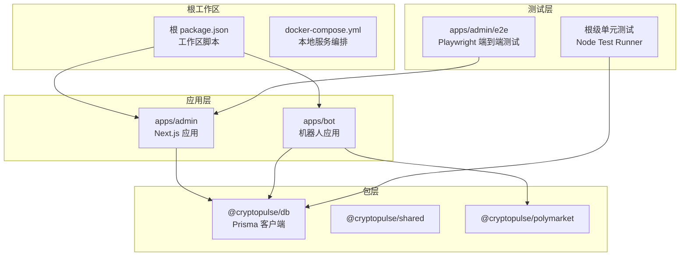
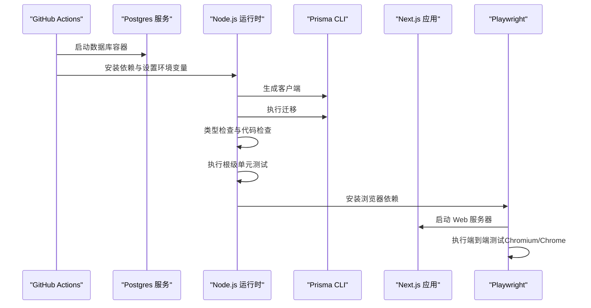
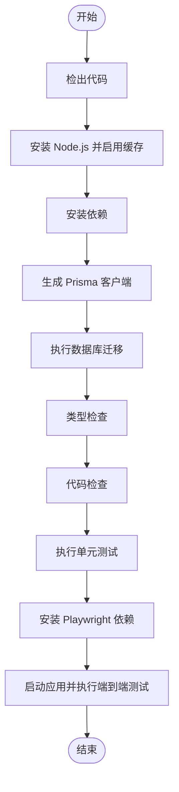
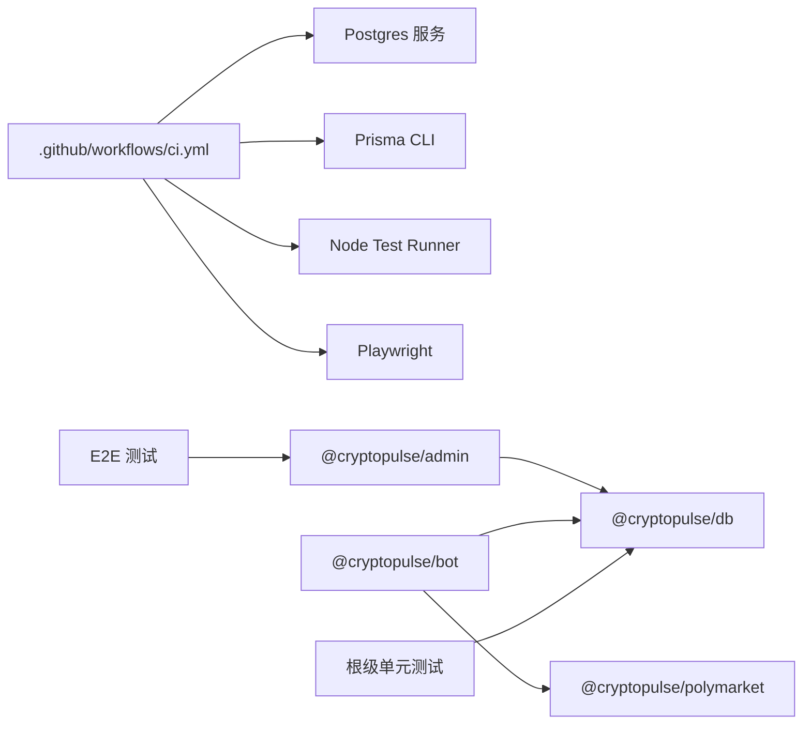

# CI/CD 测试流程

<cite>
**本文档引用的文件**
- [.github/workflows/ci.yml](file://.github/workflows/ci.yml)
- [package.json](file://package.json)
- [apps/admin/playwright.config.ts](file://apps/admin/playwright.config.ts)
- [apps/admin/package.json](file://apps/admin/package.json)
- [docker-compose.yml](file://docker-compose.yml)
- [packages/db/package.json](file://packages/db/package.json)
- [test/bind-code.test.ts](file://test/bind-code.test.ts)
- [test/bot-bind.test.ts](file://test/bot-bind.test.ts)
- [test/trade-order.test.ts](file://test/trade-order.test.ts)
- [test/trade-portfolio.test.ts](file://test/trade-portfolio.test.ts)
- [apps/admin/e2e/bind.e2e.spec.ts](file://apps/admin/e2e/bind.e2e.spec.ts)
</cite>

## 目录
1. [简介](#简介)
2. [项目结构](#项目结构)
3. [核心组件](#核心组件)
4. [架构总览](#架构总览)
5. [详细组件分析](#详细组件分析)
6. [依赖关系分析](#依赖关系分析)
7. [性能考虑](#性能考虑)
8. [故障排除指南](#故障排除指南)
9. [结论](#结论)

## 简介
本文件面向 CryptoPulse 项目的 CI/CD 测试流程，系统性阐述 GitHub Actions 工作流的配置与执行流程，覆盖测试自动化的触发条件、执行环境与并行策略；解释持续集成中的测试阶段划分（代码检查、单元测试、集成测试与端到端测试）及其执行顺序；提供具体配置示例以展示如何在流水线中集成各类测试；说明测试结果收集与报告机制（测试覆盖率统计与失败重试策略），以及测试环境管理与测试数据隔离策略。

## 项目结构
项目采用 monorepo 结构，包含以下关键目录：
- 根目录：工作区脚本与根级配置
- apps/admin：Next.js 管理端应用，包含 e2e 测试与 Playwright 配置
- apps/bot：机器人应用，包含业务逻辑测试
- packages/db：数据库与 Prisma 客户端
- test：根级 Node Test Runner 单元测试
- .github/workflows：GitHub Actions 工作流定义

图表来源
- [package.json](file://package.json#L1-L18)
- [apps/admin/package.json](file://apps/admin/package.json#L1-L42)
- [apps/bot/package.json](file://apps/bot/package.json#L1-L26)
- [packages/db/package.json](file://packages/db/package.json#L1-L22)

章节来源
- [package.json](file://package.json#L1-L18)
- [apps/admin/package.json](file://apps/admin/package.json#L1-L42)
- [apps/bot/package.json](file://apps/bot/package.json#L1-L26)
- [packages/db/package.json](file://packages/db/package.json#L1-L22)
- [docker-compose.yml](file://docker-compose.yml#L1-L24)

## 核心组件
- GitHub Actions 工作流：定义触发条件、执行环境与测试步骤
- Node Test Runner：运行根级单元测试
- Prisma：数据库客户端与迁移工具
- Playwright：端到端测试框架，支持 Chromium 与 Chrome 项目
- Next.js 应用：提供 Web 服务器用于 E2E 测试
- Monorepo 脚本：通过工作区脚本统一管理多包构建与测试

章节来源
- [.github/workflows/ci.yml](file://.github/workflows/ci.yml#L1-L46)
- [package.json](file://package.json#L8-L15)
- [apps/admin/playwright.config.ts](file://apps/admin/playwright.config.ts#L1-L23)
- [apps/admin/package.json](file://apps/admin/package.json#L5-L12)

## 架构总览
CI 流水线在 Ubuntu 环境中执行，使用 Postgres 作为数据库服务，通过 Prisma 生成客户端并部署迁移。流水线按顺序执行类型检查、代码检查、单元测试与端到端测试，确保从静态检查到端到端验证的完整覆盖。

图表来源
- [.github/workflows/ci.yml](file://.github/workflows/ci.yml#L10-L44)
- [apps/admin/playwright.config.ts](file://apps/admin/playwright.config.ts#L15-L20)

章节来源
- [.github/workflows/ci.yml](file://.github/workflows/ci.yml#L1-L46)
- [apps/admin/playwright.config.ts](file://apps/admin/playwright.config.ts#L1-L23)

## 详细组件分析

### GitHub Actions 工作流配置
- 触发条件：推送至 main 分支与拉取请求
- 运行环境：ubuntu-latest
- 服务依赖：Postgres 16，健康检查与端口映射
- 环境变量：数据库连接串、机器人 API Token、E2E 基础 URL
- 步骤顺序：检出代码、安装 Node.js、安装依赖、生成 Prisma 客户端、执行迁移、类型检查、代码检查、执行单元测试、安装 Playwright 依赖、启动应用并执行端到端测试

图表来源
- [.github/workflows/ci.yml](file://.github/workflows/ci.yml#L30-L44)

章节来源
- [.github/workflows/ci.yml](file://.github/workflows/ci.yml#L1-L46)

### 测试阶段划分与执行顺序
- 代码检查：Next.js 代码检查
- 单元测试：Node Test Runner 执行根级测试与机器人测试
- 集成测试：通过 Prisma 访问数据库，验证 API 行为
- 端到端测试：Playwright 在 Chromium 与 Chrome 项目中执行

章节来源
- [.github/workflows/ci.yml](file://.github/workflows/ci.yml#L38-L43)
- [apps/admin/package.json](file://apps/admin/package.json#L9-L11)
- [test/bind-code.test.ts](file://test/bind-code.test.ts#L1-L88)
- [test/trade-order.test.ts](file://test/trade-order.test.ts#L1-L107)
- [apps/admin/e2e/bind.e2e.spec.ts](file://apps/admin/e2e/bind.e2e.spec.ts#L1-L74)

### 测试环境管理
- 数据库：Postgres 16，使用健康检查确保可用性
- Web 服务器：Next.js 应用在 E2E 测试期间启动
- 环境变量：数据库连接串、机器人 API Token、E2E 基础 URL
- 本地化约束：单元测试对 DATABASE_URL 进行本地地址校验，避免误连生产库

章节来源
- [.github/workflows/ci.yml](file://.github/workflows/ci.yml#L11-L28)
- [apps/admin/playwright.config.ts](file://apps/admin/playwright.config.ts#L7-L20)
- [test/bind-code.test.ts](file://test/bind-code.test.ts#L7-L13)
- [test/trade-order.test.ts](file://test/trade-order.test.ts#L17-L20)

### 测试数据隔离策略
- 单元测试：每个测试前后清理相关数据（如删除特定 telegramId 的用户与绑定码）
- 端到端测试：使用临时数据并在测试结束后清理
- 本地开发与 CI 区分：通过 DATABASE_URL 本地地址校验，避免在非本地环境执行数据库相关测试

章节来源
- [test/bind-code.test.ts](file://test/bind-code.test.ts#L21-L25)
- [test/trade-order.test.ts](file://test/trade-order.test.ts#L44-L48)
- [apps/admin/e2e/bind.e2e.spec.ts](file://apps/admin/e2e/bind.e2e.spec.ts#L44-L72)

### 测试结果收集与报告机制
- 单元测试：Node Test Runner 输出测试结果
- 端到端测试：Playwright 支持失败时保留 trace，便于问题复现
- 覆盖率统计：当前配置未启用覆盖率统计，可在后续扩展

章节来源
- [apps/admin/playwright.config.ts](file://apps/admin/playwright.config.ts#L9-L9)
- [apps/admin/package.json](file://apps/admin/package.json#L11-L11)

### 失败重试策略
- 当前工作流未配置失败重试策略
- 可在需要时为关键步骤添加重试逻辑，例如数据库迁移或网络不稳定导致的安装失败

章节来源
- [.github/workflows/ci.yml](file://.github/workflows/ci.yml#L1-L46)

### 并行测试策略
- Playwright 项目：同时运行 Chromium 与 Chrome 项目，提升覆盖率与兼容性
- 单元测试：Node Test Runner 默认串行执行，可通过并行参数优化（需在后续配置）

章节来源
- [apps/admin/playwright.config.ts](file://apps/admin/playwright.config.ts#L11-L14)
- [package.json](file://package.json#L14-L14)

## 依赖关系分析
- 工作流依赖 Postgres 服务与 Prisma CLI
- 应用层依赖数据库包与共享包
- 测试层依赖数据库包与应用层 API

图表来源
- [.github/workflows/ci.yml](file://.github/workflows/ci.yml#L11-L44)
- [apps/admin/package.json](file://apps/admin/package.json#L13-L24)
- [apps/bot/package.json](file://apps/bot/package.json#L12-L19)
- [packages/db/package.json](file://packages/db/package.json#L13-L19)

章节来源
- [.github/workflows/ci.yml](file://.github/workflows/ci.yml#L1-L46)
- [apps/admin/package.json](file://apps/admin/package.json#L1-L42)
- [apps/bot/package.json](file://apps/bot/package.json#L1-L26)
- [packages/db/package.json](file://packages/db/package.json#L1-L22)

## 性能考虑
- 使用 Node.js 缓存加速依赖安装
- 仅在必要时安装浏览器依赖，避免不必要的下载
- 将类型检查与代码检查前置，尽早发现错误
- 通过并行项目（Chromium/Chrome）提升端到端测试效率

章节来源
- [.github/workflows/ci.yml](file://.github/workflows/ci.yml#L32-L34)
- [apps/admin/playwright.config.ts](file://apps/admin/playwright.config.ts#L11-L14)

## 故障排除指南
- 数据库连接失败：检查 Postgres 服务健康检查与端口映射
- 端到端测试超时：调整 Playwright 超时配置与 Web 服务器启动时间
- 单元测试跳过：当 DATABASE_URL 非本地地址时，测试会跳过以保护生产数据
- 依赖安装失败：确认 Node.js 版本与缓存策略

章节来源
- [.github/workflows/ci.yml](file://.github/workflows/ci.yml#L20-L24)
- [apps/admin/playwright.config.ts](file://apps/admin/playwright.config.ts#L5-L6)
- [test/bind-code.test.ts](file://test/bind-code.test.ts#L7-L13)

## 结论
当前 CI/CD 流水线已实现从静态检查到端到端测试的完整覆盖，具备良好的可维护性与扩展性。建议后续增强覆盖率统计与失败重试策略，进一步提升测试质量与稳定性。