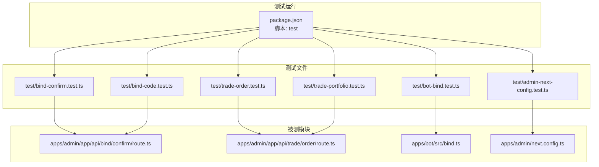
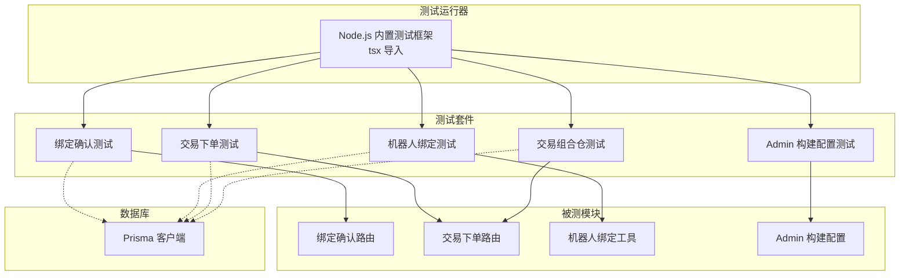
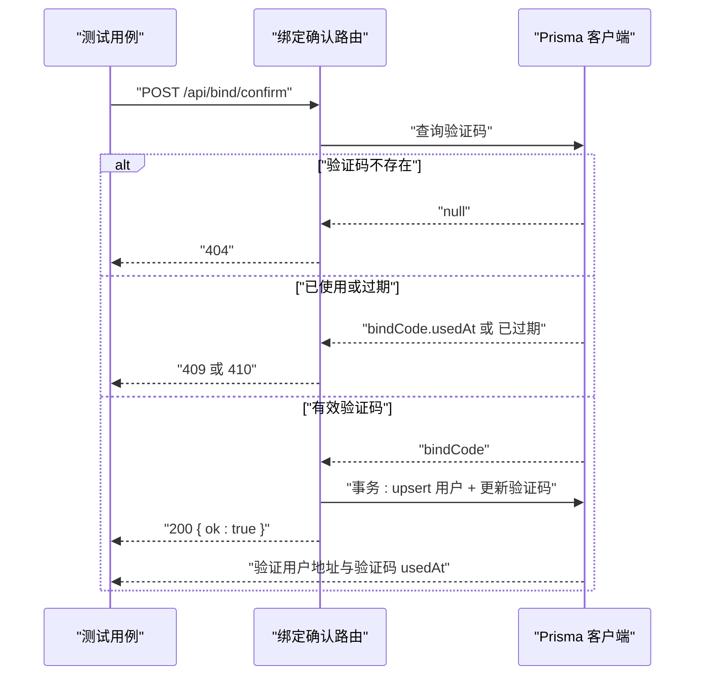
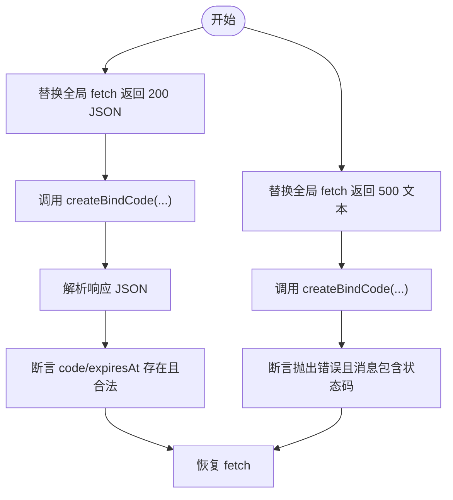
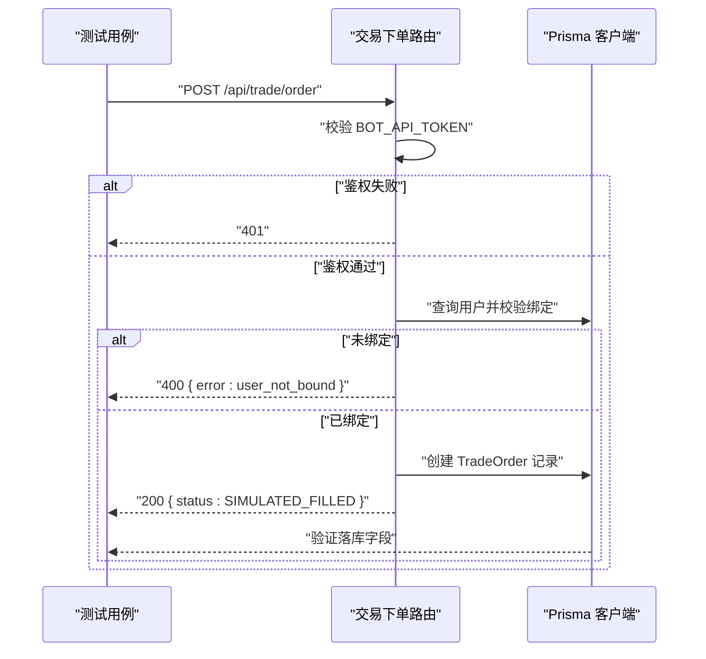
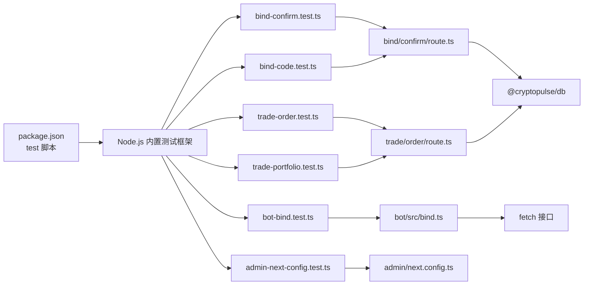

# 单元测试

<cite>
**本文引用的文件**
- [package.json](file://package.json)
- [.env.example](file://.env.example)
- [apps/admin/next.config.ts](file://apps/admin/next.config.ts)
- [apps/admin/app/api/bind/confirm/route.ts](file://apps/admin/app/api/bind/confirm/route.ts)
- [apps/admin/app/api/trade/order/route.ts](file://apps/admin/app/api/trade/order/route.ts)
- [apps/bot/src/bind.ts](file://apps/bot/src/bind.ts)
- [test/bind-confirm.test.ts](file://test/bind-confirm.test.ts)
- [test/bind-code.test.ts](file://test/bind-code.test.ts)
- [test/trade-order.test.ts](file://test/trade-order.test.ts)
- [test/trade-portfolio.test.ts](file://test/trade-portfolio.test.ts)
- [test/bot-bind.test.ts](file://test/bot-bind.test.ts)
- [test/admin-next-config.test.ts](file://test/admin-next-config.test.ts)
</cite>

## 目录
1. [简介](#简介)
2. [项目结构](#项目结构)
3. [核心组件](#核心组件)
4. [架构总览](#架构总览)
5. [详细组件分析](#详细组件分析)
6. [依赖分析](#依赖分析)
7. [性能考虑](#性能考虑)
8. [故障排查指南](#故障排查指南)
9. [结论](#结论)
10. [附录](#附录)

## 简介
本文件面向 CryptoPulse 项目，系统化梳理基于 Node.js 内置测试框架的单元测试实践，覆盖测试生命周期钩子（test、beforeEach、afterEach）、测试设计原则（边界条件、异常处理、数据验证）、测试示例（绑定确认、交易下单、机器人绑定等），以及测试数据准备与清理机制（本地数据库校验、Prisma 数据落库与回滚）。同时给出测试覆盖率建议与最佳实践，帮助开发者在不牺牲可维护性的前提下提升质量与效率。

## 项目结构
- 测试入口与运行方式：通过根目录脚本统一执行 Node.js 内置测试框架，使用 tsx 导入以支持 TypeScript 文件直接运行。
- 测试文件分布：位于仓库根目录的 test 目录，按功能模块划分，分别对应绑定、交易、机器人等子系统。
- 关键被测模块：Next.js App Router 路由处理器（绑定确认、交易下单、交易组合仓查询）、机器人侧绑定工具函数、Admin 应用构建配置等。

图表来源
- [package.json](file://package.json#L14-L14)
- [test/bind-confirm.test.ts](file://test/bind-confirm.test.ts#L1-L112)
- [test/bind-code.test.ts](file://test/bind-code.test.ts#L1-L88)
- [test/trade-order.test.ts](file://test/trade-order.test.ts#L1-L107)
- [test/trade-portfolio.test.ts](file://test/trade-portfolio.test.ts#L1-L96)
- [test/bot-bind.test.ts](file://test/bot-bind.test.ts#L1-L48)
- [test/admin-next-config.test.ts](file://test/admin-next-config.test.ts#L1-L20)
- [apps/admin/app/api/bind/confirm/route.ts](file://apps/admin/app/api/bind/confirm/route.ts#L1-L91)
- [apps/admin/app/api/trade/order/route.ts](file://apps/admin/app/api/trade/order/route.ts#L1-L94)
- [apps/bot/src/bind.ts](file://apps/bot/src/bind.ts#L1-L39)
- [apps/admin/next.config.ts](file://apps/admin/next.config.ts#L1-L30)

章节来源
- [package.json](file://package.json#L1-L18)
- [test/bind-confirm.test.ts](file://test/bind-confirm.test.ts#L1-L112)
- [test/bind-code.test.ts](file://test/bind-code.test.ts#L1-L88)
- [test/trade-order.test.ts](file://test/trade-order.test.ts#L1-L107)
- [test/trade-portfolio.test.ts](file://test/trade-portfolio.test.ts#L1-L96)
- [test/bot-bind.test.ts](file://test/bot-bind.test.ts#L1-L48)
- [test/admin-next-config.test.ts](file://test/admin-next-config.test.ts#L1-L20)
- [apps/admin/app/api/bind/confirm/route.ts](file://apps/admin/app/api/bind/confirm/route.ts#L1-L91)
- [apps/admin/app/api/trade/order/route.ts](file://apps/admin/app/api/trade/order/route.ts#L1-L94)
- [apps/bot/src/bind.ts](file://apps/bot/src/bind.ts#L1-L39)
- [apps/admin/next.config.ts](file://apps/admin/next.config.ts#L1-L30)

## 核心组件
- Node.js 内置测试框架：使用 test、beforeEach、afterEach 等生命周期钩子组织测试；assert 严格断言确保行为正确性。
- 测试数据准备与清理：
  - 本地数据库校验：通过 DATABASE_URL 判断是否为本地地址，非本地则跳过测试，避免误伤生产或 CI 环境。
  - beforeEach/afterEach：在每个测试前后进行必要的数据库初始化与清理，保证测试隔离与幂等。
- API 端点测试：对 Next.js App Router 路由处理器进行端到端测试，构造 Request 对象，调用导出的 HTTP 方法（如 POST/GET），断言响应状态码与 JSON 结果。
- 业务逻辑与工具函数测试：对机器人侧绑定工具函数进行行为与异常路径验证，包括网络请求模拟与错误消息格式断言。
- 构建配置测试：对 Admin 应用的 Webpack 忽略规则进行断言，确保开发体验与性能。

章节来源
- [test/bind-confirm.test.ts](file://test/bind-confirm.test.ts#L1-L112)
- [test/bind-code.test.ts](file://test/bind-code.test.ts#L1-L88)
- [test/trade-order.test.ts](file://test/trade-order.test.ts#L1-L107)
- [test/trade-portfolio.test.ts](file://test/trade-portfolio.test.ts#L1-L96)
- [test/bot-bind.test.ts](file://test/bot-bind.test.ts#L1-L48)
- [test/admin-next-config.test.ts](file://test/admin-next-config.test.ts#L1-L20)

## 架构总览
下图展示了测试运行与被测模块之间的关系，以及测试数据准备与清理的关键节点。

图表来源
- [package.json](file://package.json#L14-L14)
- [test/bind-confirm.test.ts](file://test/bind-confirm.test.ts#L1-L112)
- [test/bot-bind.test.ts](file://test/bot-bind.test.ts#L1-L48)
- [test/trade-order.test.ts](file://test/trade-order.test.ts#L1-L107)
- [test/trade-portfolio.test.ts](file://test/trade-portfolio.test.ts#L1-L96)
- [test/admin-next-config.test.ts](file://test/admin-next-config.test.ts#L1-L20)
- [apps/admin/app/api/bind/confirm/route.ts](file://apps/admin/app/api/bind/confirm/route.ts#L1-L91)
- [apps/admin/app/api/trade/order/route.ts](file://apps/admin/app/api/trade/order/route.ts#L1-L94)
- [apps/bot/src/bind.ts](file://apps/bot/src/bind.ts#L1-L39)
- [apps/admin/next.config.ts](file://apps/admin/next.config.ts#L1-L30)

## 详细组件分析

### 绑定确认测试（bind/confirm）
- 目标：验证绑定确认流程的鉴权、验证码存在性、过期与重复使用控制、成功绑定后的用户地址写入与验证码标记。
- 关键点：
  - 本地数据库校验：若 DATABASE_URL 非本地地址则跳过测试。
  - beforeEach：确保用户存在（upsert）。
  - afterEach：删除验证码与用户记录，保持干净状态。
  - 边界与异常：验证码不存在返回 404；重复使用返回 409；过期返回 410；非法 JSON 或体结构返回 400。
  - 数据验证：成功绑定后，用户地址字段更新，验证码 usedAt 被标记。

图表来源
- [test/bind-confirm.test.ts](file://test/bind-confirm.test.ts#L18-L83)
- [apps/admin/app/api/bind/confirm/route.ts](file://apps/admin/app/api/bind/confirm/route.ts#L47-L88)

章节来源
- [test/bind-confirm.test.ts](file://test/bind-confirm.test.ts#L1-L112)
- [apps/admin/app/api/bind/confirm/route.ts](file://apps/admin/app/api/bind/confirm/route.ts#L1-L91)

### 机器人绑定测试（bot bind）
- 目标：验证机器人侧绑定码生成工具的行为与异常处理。
- 关键点：
  - 网络请求模拟：通过替换全局 fetch 返回指定状态码与内容，验证错误消息中包含状态码。
  - 成功路径：断言返回的 code 与 expiresAt 合法性。
  - 可读性：formatExpiresIn 在缺省参数时返回可读文案。

图表来源
- [test/bot-bind.test.ts](file://test/bot-bind.test.ts#L10-L26)
- [apps/bot/src/bind.ts](file://apps/bot/src/bind.ts#L3-L30)

章节来源
- [test/bot-bind.test.ts](file://test/bot-bind.test.ts#L1-L48)
- [apps/bot/src/bind.ts](file://apps/bot/src/bind.ts#L1-L39)

### 交易下单测试（trade/order）
- 目标：验证交易下单的鉴权、用户绑定检查、Mock 模式下的订单创建与落库。
- 关键点：
  - 本地数据库校验与表准备：确保 TradeOrder 表存在。
  - 环境变量：BOT_API_TOKEN 与 TRADE_MODE 的设置影响鉴权与模式行为。
  - 边界与异常：鉴权失败返回 401；未绑定用户返回 400；数据库不可用返回 503；服务异常返回 500。
  - 数据验证：Mock 模式下返回 SIMULATED_FILLED，落库字段完整。

图表来源
- [test/trade-order.test.ts](file://test/trade-order.test.ts#L37-L105)
- [apps/admin/app/api/trade/order/route.ts](file://apps/admin/app/api/trade/order/route.ts#L16-L93)

章节来源
- [test/trade-order.test.ts](file://test/trade-order.test.ts#L1-L107)
- [apps/admin/app/api/trade/order/route.ts](file://apps/admin/app/api/trade/order/route.ts#L1-L94)

### 交易组合仓测试（trade/portfolio）
- 目标：验证组合仓汇总与最近订单查询接口。
- 关键点：
  - 本地数据库校验与表准备。
  - 环境变量：BOT_API_TOKEN 设置为测试令牌。
  - 数据验证：断言 positions 与 recentOrders 的数量与关键字段。

章节来源
- [test/trade-portfolio.test.ts](file://test/trade-portfolio.test.ts#L1-L96)
- [apps/admin/app/api/trade/order/route.ts](file://apps/admin/app/api/trade/order/route.ts#L1-L94)

### 绑定码生成测试（bot/bind-code）
- 目标：验证机器人绑定码生成端点的鉴权与落库行为。
- 关键点：
  - 生产环境未配置 BOT_API_TOKEN 时返回 401。
  - 鉴权失败返回 401。
  - 成功返回 10 字母数字验证码与合法的 expiresAt，并落库 BindCode。

章节来源
- [test/bind-code.test.ts](file://test/bind-code.test.ts#L1-L88)
- [apps/admin/app/api/bind/confirm/route.ts](file://apps/admin/app/api/bind/confirm/route.ts#L1-L91)

### Admin 构建配置测试（admin-next-config）
- 目标：验证 Admin 应用的 Webpack 忽略规则是否包含系统目录。
- 关键点：
  - 断言 webpack 配置函数存在。
  - 断言 watchOptions.ignored 中包含特定系统目录片段。

章节来源
- [test/admin-next-config.test.ts](file://test/admin-next-config.test.ts#L1-L20)
- [apps/admin/next.config.ts](file://apps/admin/next.config.ts#L10-L25)

## 依赖分析
- 测试运行依赖：package.json 中的 test 脚本通过 tsx 导入，使测试文件可直接运行。
- 被测模块依赖：各路由处理器依赖 @cryptopulse/db 提供的 Prisma 客户端；机器人工具依赖浏览器/Node fetch 接口；Admin 构建配置依赖 Next.js webpack 钩子。
- 环境变量依赖：绑定与交易模块均依赖 DATABASE_URL、BOT_API_TOKEN、TRADE_MODE 等环境变量。

图表来源
- [package.json](file://package.json#L14-L14)
- [test/bind-confirm.test.ts](file://test/bind-confirm.test.ts#L4-L4)
- [test/bot-bind.test.ts](file://test/bot-bind.test.ts#L4-L4)
- [test/trade-order.test.ts](file://test/trade-order.test.ts#L4-L4)
- [test/trade-portfolio.test.ts](file://test/trade-portfolio.test.ts#L4-L4)
- [test/bind-code.test.ts](file://test/bind-code.test.ts#L4-L4)
- [test/admin-next-config.test.ts](file://test/admin-next-config.test.ts#L4-L4)
- [apps/admin/app/api/bind/confirm/route.ts](file://apps/admin/app/api/bind/confirm/route.ts#L28-L28)
- [apps/admin/app/api/trade/order/route.ts](file://apps/admin/app/api/trade/order/route.ts#L45-L45)
- [apps/bot/src/bind.ts](file://apps/bot/src/bind.ts#L16-L16)
- [apps/admin/next.config.ts](file://apps/admin/next.config.ts#L1-L30)

章节来源
- [package.json](file://package.json#L1-L18)
- [apps/admin/app/api/bind/confirm/route.ts](file://apps/admin/app/api/bind/confirm/route.ts#L1-L91)
- [apps/admin/app/api/trade/order/route.ts](file://apps/admin/app/api/trade/order/route.ts#L1-L94)
- [apps/bot/src/bind.ts](file://apps/bot/src/bind.ts#L1-L39)
- [apps/admin/next.config.ts](file://apps/admin/next.config.ts#L1-L30)

## 性能考虑
- 测试隔离：通过 beforeEach/afterEach 清理数据库，避免跨用例干扰，减少重跑成本。
- 本地数据库优先：通过 DATABASE_URL 校验仅在本地运行，避免 CI/生产环境误触发。
- Mock 模式：交易模块支持 TRADE_MODE=mock，减少真实链上交互带来的延迟与不确定性。
- 环境变量最小化：仅在必要时设置 BOT_API_TOKEN、TRADE_MODE，降低测试启动开销。

## 故障排查指南
- 数据库不可用或非本地：当 DATABASE_URL 为空或非 localhost 时，测试会跳过并输出原因。请检查 .env.example 中的 DATABASE_URL 是否指向本地数据库。
- 鉴权失败：确认 BOT_API_TOKEN 设置正确且 Authorization 头格式为 Bearer Token。
- 交易下单返回 400：检查用户是否已绑定 polymarketAddress。
- 交易下单返回 503：确认 @cryptopulse/db 可正常导入，Prisma 客户端可用。
- 机器人绑定失败：检查 fetch 模拟是否正确返回期望的状态码与响应体；错误消息中应包含状态码以便定位问题。

章节来源
- [test/bind-confirm.test.ts](file://test/bind-confirm.test.ts#L7-L13)
- [test/bind-code.test.ts](file://test/bind-code.test.ts#L27-L47)
- [test/trade-order.test.ts](file://test/trade-order.test.ts#L50-L61)
- [apps/admin/app/api/bind/confirm/route.ts](file://apps/admin/app/api/bind/confirm/route.ts#L22-L31)
- [apps/admin/app/api/trade/order/route.ts](file://apps/admin/app/api/trade/order/route.ts#L39-L48)
- [apps/bot/src/bind.ts](file://apps/bot/src/bind.ts#L22-L29)

## 结论
本项目采用 Node.js 内置测试框架，结合 Prisma 与 Next.js App Router，实现了对绑定、交易、机器人工具与构建配置的全面单元测试。通过严格的生命周期管理、环境变量与数据库校验、以及详尽的边界与异常场景覆盖，测试体系在保障质量的同时兼顾了可维护性与可扩展性。建议持续完善覆盖率并引入更细粒度的工具函数与路由层测试，以进一步提升稳定性。

## 附录
- 测试覆盖率建议
  - 覆盖率目标：核心路由与工具函数达到 80%+ 行覆盖率，关键分支与异常路径 100%。
  - 工具函数：机器人绑定工具与路由处理器均应有独立测试用例。
  - 数据库：确保每次测试后清理，避免脏数据影响后续用例。
- 最佳实践
  - 使用 beforeEach/afterEach 进行最小化状态准备与清理。
  - 将环境变量与外部依赖（如 fetch）通过替换全局对象的方式进行可控模拟。
  - 对 JSON 解析、Zod 校验、Prisma 事务等关键路径进行显式断言。
  - 仅在本地运行涉及数据库的测试，避免 CI/生产环境风险。