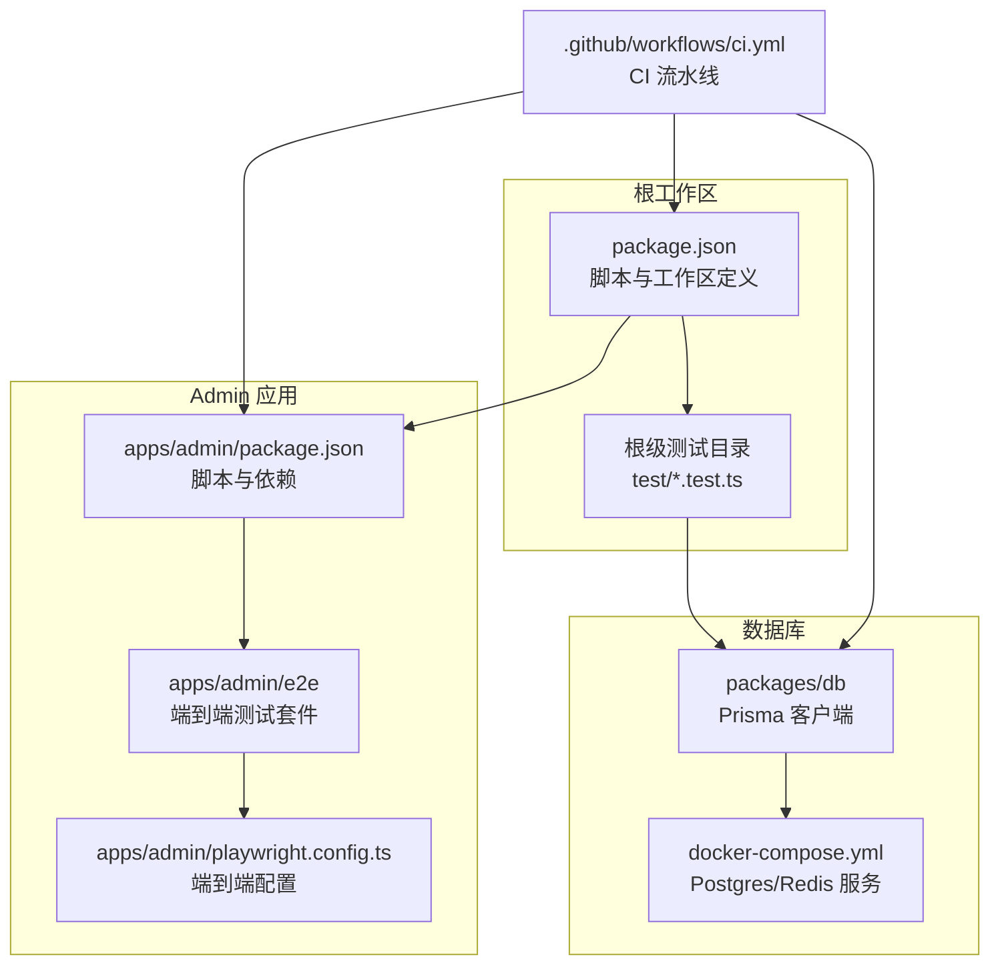
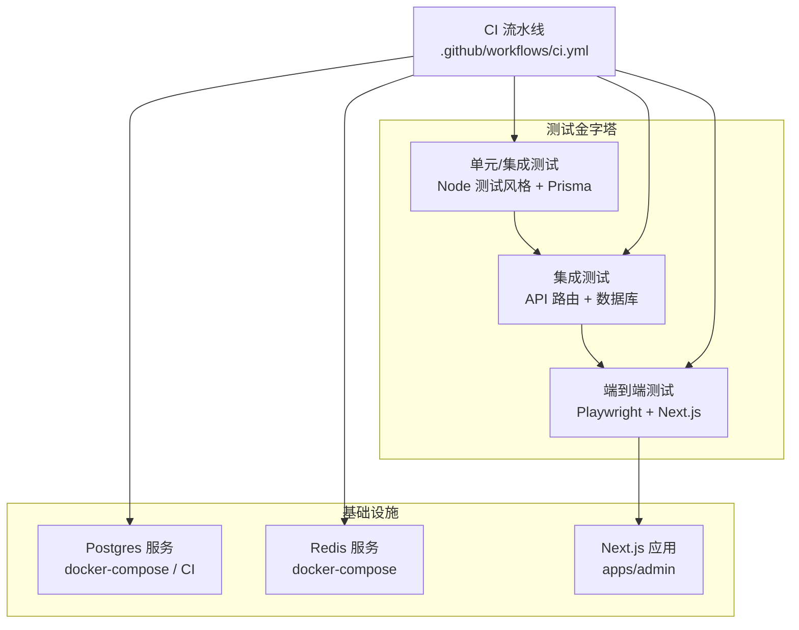
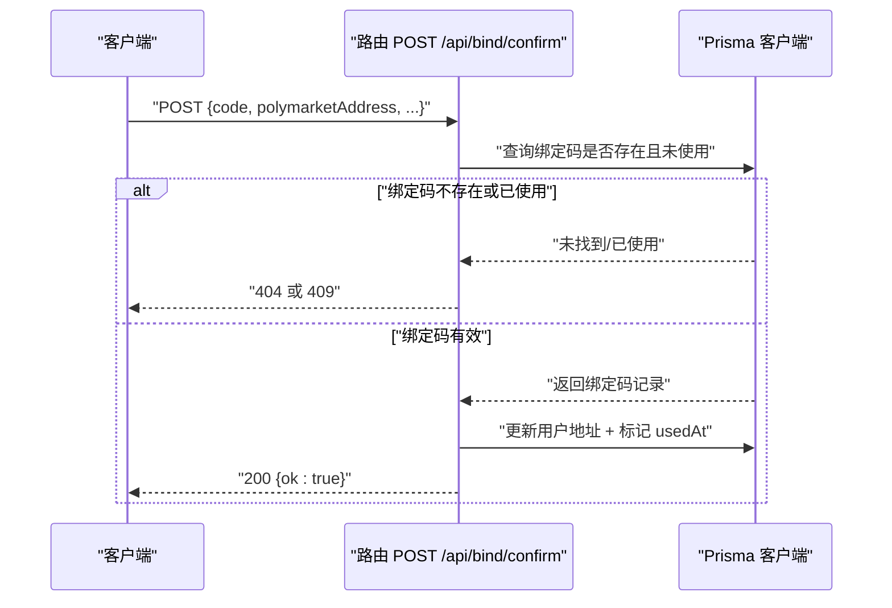
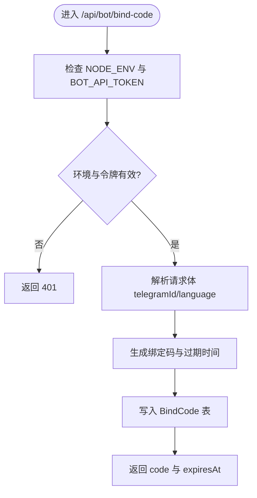
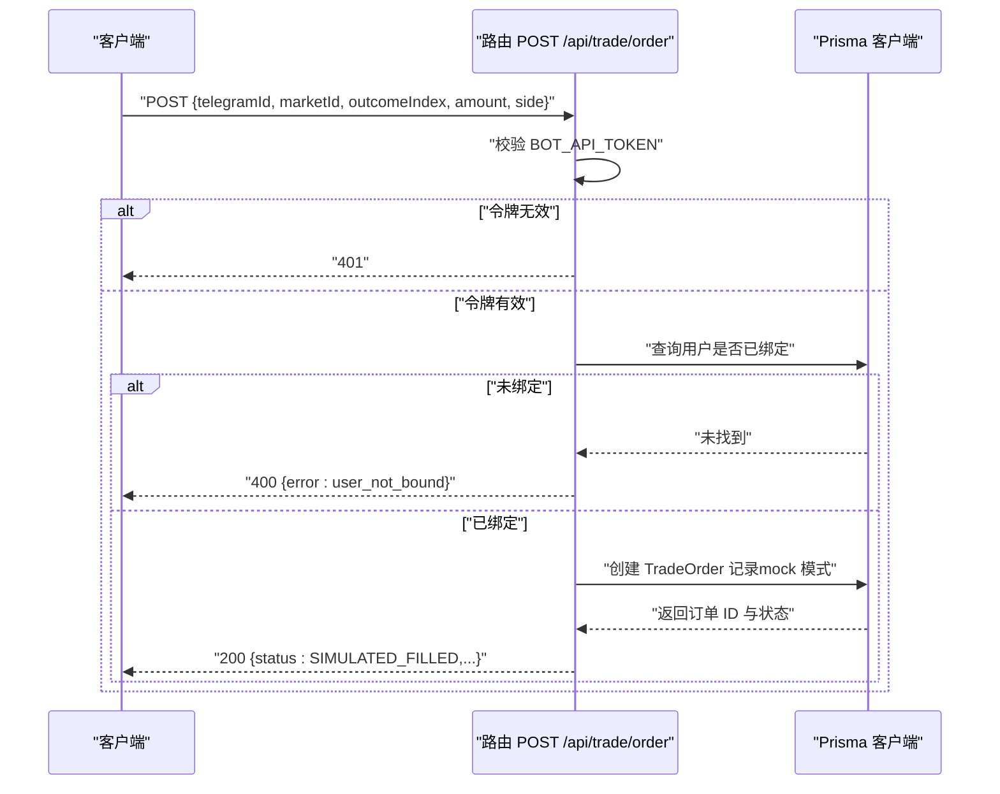
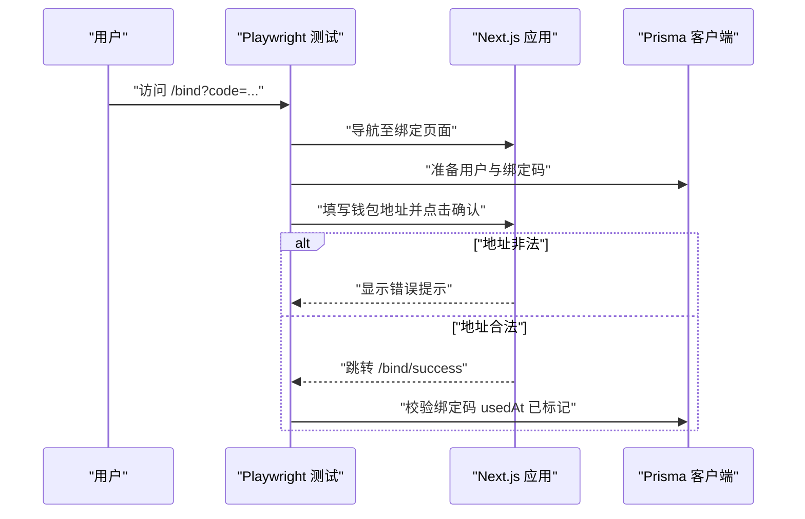
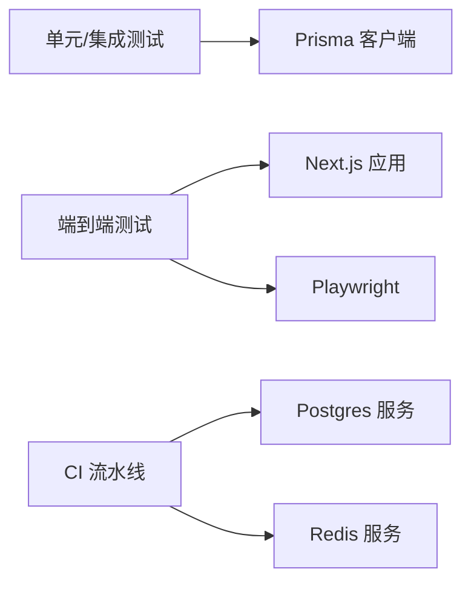

# 测试指南

<cite>
**本文引用的文件**
- [.github/workflows/ci.yml](file://.github/workflows/ci.yml)
- [package.json](file://package.json)
- [apps/admin/package.json](file://apps/admin/package.json)
- [apps/admin/playwright.config.ts](file://apps/admin/playwright.config.ts)
- [apps/admin/e2e/bind.e2e.spec.ts](file://apps/admin/e2e/bind.e2e.spec.ts)
- [apps/admin/lib/utils.ts](file://apps/admin/lib/utils.ts)
- [test/bind-confirm.test.ts](file://test/bind-confirm.test.ts)
- [test/bind-code.test.ts](file://test/bind-code.test.ts)
- [test/bot-bind.test.ts](file://test/bot-bind.test.ts)
- [test/trade-order.test.ts](file://test/trade-order.test.ts)
- [test/trade-portfolio.test.ts](file://test/trade-portfolio.test.ts)
- [test/admin-next-config.test.ts](file://test/admin-next-config.test.ts)
- [docker-compose.yml](file://docker-compose.yml)
- [packages/db/src/index.ts](file://packages/db/src/index.ts)
</cite>

## 目录
1. [引言](#引言)
2. [项目结构](#项目结构)
3. [核心组件](#核心组件)
4. [架构总览](#架构总览)
5. [详细组件分析](#详细组件分析)
6. [依赖关系分析](#依赖关系分析)
7. [性能考虑](#性能考虑)
8. [故障排查指南](#故障排查指南)
9. [结论](#结论)
10. [附录](#附录)

## 引言
本测试指南面向 CryptoPulse 项目，系统化阐述测试策略与测试金字塔（单元测试、集成测试、端到端测试），并结合当前仓库中的 Jest 风格测试、Playwright 端到端测试与 CI 自动化流水线，给出可落地的实施方法。文档覆盖测试框架选择与配置、测试用例设计原则（边界条件、异常处理、性能）、测试数据准备与管理、持续集成与自动化流程、覆盖率与质量门禁建议以及性能/负载/压力测试实践。

## 项目结构
项目采用多工作区（workspaces）组织，核心测试分布在根级测试目录与应用层（apps/admin）的 e2e 目录中。测试类型与分布如下：
- 单元/集成测试（Node 内置测试框架风格）：位于根级 test 目录，覆盖 API 路由与业务逻辑。
- 端到端测试（Playwright）：位于 apps/admin/e2e，覆盖用户交互流程。
- 工具函数测试：位于根级 test 目录，验证通用工具模块。
- CI 流水线：位于 .github/workflows，负责数据库初始化、类型检查、静态检查、单元测试与端到端测试执行。

图表来源
- [package.json](file://package.json#L1-L18)
- [apps/admin/package.json](file://apps/admin/package.json#L1-L42)
- [apps/admin/playwright.config.ts](file://apps/admin/playwright.config.ts#L1-L23)
- [apps/admin/e2e/bind.e2e.spec.ts](file://apps/admin/e2e/bind.e2e.spec.ts#L1-L74)
- [docker-compose.yml](file://docker-compose.yml#L1-L24)
- [.github/workflows/ci.yml](file://.github/workflows/ci.yml#L1-L46)

章节来源
- [package.json](file://package.json#L1-L18)
- [apps/admin/package.json](file://apps/admin/package.json#L1-L42)
- [apps/admin/playwright.config.ts](file://apps/admin/playwright.config.ts#L1-L23)
- [apps/admin/e2e/bind.e2e.spec.ts](file://apps/admin/e2e/bind.e2e.spec.ts#L1-L74)
- [docker-compose.yml](file://docker-compose.yml#L1-L24)
- [.github/workflows/ci.yml](file://.github/workflows/ci.yml#L1-L46)

## 核心组件
- 测试框架与运行器
  - 根级测试采用 Node 内置测试导入方式，通过根级脚本统一执行。
  - 端到端测试采用 Playwright，配置了 Chromium 与 Chrome 项目，支持 WebServer 启动与超时控制。
- 数据层与测试隔离
  - 使用 Prisma 客户端连接 Postgres；测试通过环境变量限制仅在本地数据库运行，避免污染生产数据。
  - 通过 beforeEach/afterEach 清理测试数据，确保测试可重复性。
- CI 与自动化
  - GitHub Actions 在 Ubuntu 上启动 Postgres 服务，注入 DATABASE_URL 等环境变量，执行类型检查、静态检查、单元测试与端到端测试。
  - 端到端测试前安装浏览器依赖并以 Chromium 项目运行。

章节来源
- [package.json](file://package.json#L8-L15)
- [apps/admin/package.json](file://apps/admin/package.json#L11-L11)
- [apps/admin/playwright.config.ts](file://apps/admin/playwright.config.ts#L1-L23)
- [test/bind-confirm.test.ts](file://test/bind-confirm.test.ts#L1-L112)
- [test/bind-code.test.ts](file://test/bind-code.test.ts#L1-L88)
- [test/trade-order.test.ts](file://test/trade-order.test.ts#L1-L107)
- [test/trade-portfolio.test.ts](file://test/trade-portfolio.test.ts#L1-L96)
- [.github/workflows/ci.yml](file://.github/workflows/ci.yml#L1-L46)

## 架构总览
下图展示了测试金字塔在本项目中的落地：从底层的单元/集成测试到上层的端到端测试，配合 CI 的自动化执行与数据库服务。

图表来源
- [.github/workflows/ci.yml](file://.github/workflows/ci.yml#L11-L28)
- [docker-compose.yml](file://docker-compose.yml#L1-L24)
- [apps/admin/package.json](file://apps/admin/package.json#L11-L11)
- [apps/admin/playwright.config.ts](file://apps/admin/playwright.config.ts#L15-L20)

## 详细组件分析

### 绑定确认测试（bind/confirm）
目标：验证绑定码确认接口在不同场景下的行为，包括不存在绑定码、重复使用、成功绑定等。
- 关键断言点
  - 不存在绑定码返回 404。
  - 成功绑定后用户地址更新且绑定码标记为已使用。
  - 重复使用同一绑定码返回 409。
- 数据准备与清理
  - beforeEach 创建用户；afterEach 删除绑定码与用户记录。
  - 通过环境变量限制仅在本地数据库运行，避免跨环境污染。
- 设计要点
  - 边界条件：空地址、非法地址格式、过期时间附近。
  - 异常处理：网络错误、数据库异常、鉴权失败。
  - 性能：单次请求与数据库写入，关注响应时间与并发下的稳定性。

图表来源
- [test/bind-confirm.test.ts](file://test/bind-confirm.test.ts#L33-L83)
- [packages/db/src/index.ts](file://packages/db/src/index.ts#L1-L12)

章节来源
- [test/bind-confirm.test.ts](file://test/bind-confirm.test.ts#L1-L112)

### 绑定码生成测试（bot/bind-code）
目标：验证机器人端绑定码生成接口的鉴权、参数校验与数据库落库。
- 关键断言点
  - 生产环境未配置令牌返回 401。
  - 鉴权失败返回 401。
  - 成功返回符合格式的 code 与合法的 expiresAt，并落库 BindCode。
- 设计要点
  - 边界条件：language 参数、telegramId 合法性。
  - 异常处理：令牌缺失、令牌错误、数据库写入失败。
  - 可靠性：幂等性与重复调用的处理。

图表来源
- [test/bind-code.test.ts](file://test/bind-code.test.ts#L27-L86)

章节来源
- [test/bind-code.test.ts](file://test/bind-code.test.ts#L1-L88)

### 机器人绑定码生成逻辑测试（bot-bind）
目标：验证机器人侧绑定码生成工具函数的行为，包括错误透传与成功解析。
- 关键断言点
  - formatExpiresIn 缺省值可读。
  - createBindCode 失败时抛出包含状态码的错误。
  - createBindCode 成功解析 code/expiresAt。
- 设计要点
  - 使用全局 fetch 替换进行可控的 HTTP 响应模拟。
  - 断言错误消息中包含状态码，便于上层处理。

章节来源
- [test/bot-bind.test.ts](file://test/bot-bind.test.ts#L1-L48)

### 交易下单测试（trade/order）
目标：验证交易下单接口在鉴权、用户绑定状态与模拟模式下的行为。
- 关键断言点
  - 鉴权失败返回 401。
  - 未绑定用户返回 400（错误码 user_not_bound）。
  - mock 模式下创建订单并返回 SIMULATED_FILLED，同时落库 TradeOrder。
- 设计要点
  - 边界条件：amount、outcomeIndex、side 合法性。
  - 异常处理：数据库表不存在时自动创建、网络错误、令牌错误。
  - 性能：批量写入与查询优化，关注高并发下单场景。

图表来源
- [test/trade-order.test.ts](file://test/trade-order.test.ts#L50-L105)
- [packages/db/src/index.ts](file://packages/db/src/index.ts#L1-L12)

章节来源
- [test/trade-order.test.ts](file://test/trade-order.test.ts#L1-L107)

### 交易组合测试（trade/portfolio）
目标：验证交易组合接口返回仓位汇总与最近订单。
- 关键断言点
  - 返回 positions 与 recentOrders，positions 中 amount 合计正确。
  - 最近订单数量满足预期。
- 设计要点
  - 边界条件：无订单、多市场/多 outcomeIndex。
  - 异常处理：权限不足、数据库异常。

章节来源
- [test/trade-portfolio.test.ts](file://test/trade-portfolio.test.ts#L1-L96)

### Admin Next 配置测试
目标：验证 Next 配置中 watchOptions.ignored 是否包含常见系统目录忽略项。
- 关键断言点
  - webpack 函数存在。
  - watchOptions.ignored 包含指定系统目录关键字。

章节来源
- [test/admin-next-config.test.ts](file://test/admin-next-config.test.ts#L1-L20)

### 端到端测试（Playwright）
目标：验证绑定流程的用户界面行为，包括无 code 展示、无效地址提示、成功绑定后的跳转与提示。
- 关键断言点
  - 无 code 时页面展示步骤与输入框。
  - 无效地址输入触发友好错误提示。
  - 成功绑定后跳转成功页并显示下一步提示。
- 设计要点
  - 使用 Prisma 在测试前后准备与清理数据。
  - 通过环境变量控制 baseURL，支持本地与 CI 执行。

图表来源
- [apps/admin/e2e/bind.e2e.spec.ts](file://apps/admin/e2e/bind.e2e.spec.ts#L12-L72)
- [apps/admin/playwright.config.ts](file://apps/admin/playwright.config.ts#L1-L23)

章节来源
- [apps/admin/e2e/bind.e2e.spec.ts](file://apps/admin/e2e/bind.e2e.spec.ts#L1-L74)
- [apps/admin/playwright.config.ts](file://apps/admin/playwright.config.ts#L1-L23)

### 工具函数测试（UI 工具类）
目标：验证 UI 工具函数 cn 的合并逻辑。
- 关键断言点
  - cn 返回合并后的类名字符串。

章节来源
- [apps/admin/lib/utils.ts](file://apps/admin/lib/utils.ts#L1-L8)

## 依赖关系分析
- 测试耦合与内聚
  - 单元/集成测试对 Prisma 的直接依赖较高，需通过环境变量限制数据库范围，保证测试隔离。
  - 端到端测试依赖 Next.js 应用与 Playwright 配置，WebServer 启动与 baseURL 控制是关键。
- 外部依赖与集成点
  - Postgres 作为测试数据库，CI 与本地开发均依赖 docker-compose 或 GitHub Actions 服务。
  - Redis 作为缓存服务，可用于性能测试与缓存相关功能验证。
- 循环依赖
  - 当前测试文件之间无循环依赖，测试与被测模块通过导出的路由与工具函数进行解耦。

图表来源
- [packages/db/src/index.ts](file://packages/db/src/index.ts#L1-L12)
- [apps/admin/package.json](file://apps/admin/package.json#L11-L11)
- [apps/admin/playwright.config.ts](file://apps/admin/playwright.config.ts#L15-L20)
- [.github/workflows/ci.yml](file://.github/workflows/ci.yml#L11-L28)
- [docker-compose.yml](file://docker-compose.yml#L1-L24)

章节来源
- [packages/db/src/index.ts](file://packages/db/src/index.ts#L1-L12)
- [apps/admin/package.json](file://apps/admin/package.json#L1-L42)
- [apps/admin/playwright.config.ts](file://apps/admin/playwright.config.ts#L1-L23)
- [.github/workflows/ci.yml](file://.github/workflows/ci.yml#L1-L46)
- [docker-compose.yml](file://docker-compose.yml#L1-L24)

## 性能考虑
- 单元/集成测试
  - 使用内存数据库或本地 Postgres 实例，避免网络延迟影响。
  - 对高频调用的 API 进行基准测试，记录响应时间阈值。
- 端到端测试
  - 控制并发与重试策略，避免浏览器实例过多导致资源耗尽。
  - 使用 trace 保留失败时的调试信息，便于定位性能瓶颈。
- 数据准备
  - 批量插入测试数据，减少多次往返开销。
  - 使用事务或一次性清理策略，避免测试间相互干扰。
- CI 性能
  - 缓存依赖与 Prisma 生成产物，缩短构建时间。
  - 将端到端测试拆分为多个项目并行执行（如 Chromium 与 Chrome）。

## 故障排查指南
- 数据库相关
  - 症状：测试跳过或失败，提示 DATABASE_URL 未设置或非本地地址。
  - 排查：确认 DATABASE_URL 指向本地 Postgres，或在 CI 环境中使用 GitHub Services 注入。
  - 参考：各测试文件中的 ensureLocalDb 检查逻辑。
- 鉴权失败
  - 症状：401 返回。
  - 排查：核对 BOT_API_TOKEN 设置与 Authorization 头格式；检查生产环境令牌强制要求。
- 端到端失败
  - 症状：页面元素不可见或 URL 不匹配。
  - 排查：确认 baseURL、WebServer 启动命令与端口；查看 trace 文件。
- CI 失败
  - 症状：Prisma 迁移失败或类型检查报错。
  - 排查：确认 Prisma 生成与迁移步骤顺序；检查 Node 版本与缓存命中情况。

章节来源
- [test/bind-confirm.test.ts](file://test/bind-confirm.test.ts#L7-L13)
- [test/bind-code.test.ts](file://test/bind-code.test.ts#L27-L47)
- [apps/admin/playwright.config.ts](file://apps/admin/playwright.config.ts#L7-L20)
- [.github/workflows/ci.yml](file://.github/workflows/ci.yml#L35-L44)

## 结论
本测试指南基于现有代码与配置，给出了面向 CryptoPulse 项目的测试策略与实施路径。通过单元/集成测试保障核心逻辑与 API 行为，借助 Playwright 端到端测试覆盖用户关键路径，并以 CI 流水线实现自动化与可重复性。建议在现有基础上逐步引入覆盖率统计、质量门禁与性能/负载/压力测试，以进一步提升软件质量与交付效率。

## 附录

### 测试框架与配置
- Node 测试导入
  - 通过根级脚本统一执行测试，便于与工作区管理集成。
- Playwright 配置
  - 支持 Chromium 与 Chrome 项目，设置 baseURL 与 trace 保留策略。
  - WebServer 启动命令与超时控制，确保端到端测试稳定性。

章节来源
- [package.json](file://package.json#L14-L14)
- [apps/admin/playwright.config.ts](file://apps/admin/playwright.config.ts#L1-L23)
- [apps/admin/package.json](file://apps/admin/package.json#L11-L11)

### 测试用例设计原则
- 边界条件
  - 输入为空、非法格式、越界数值、时间临界点（过期时间附近）。
- 异常处理
  - 网络错误、数据库异常、鉴权失败、权限不足。
- 性能
  - 响应时间阈值、并发下单吞吐、数据库索引与查询优化。

### 测试数据准备与管理
- 数据库
  - 使用 Prisma 客户端在测试前后准备与清理数据，确保隔离与可重复。
  - 通过环境变量限制数据库范围，避免跨环境污染。
- 模拟服务
  - 使用全局 fetch 替换模拟外部服务响应，便于断言错误与成功路径。
- Fixtures
  - 在测试文件中集中管理常用数据构造逻辑，减少重复代码。

章节来源
- [test/bind-confirm.test.ts](file://test/bind-confirm.test.ts#L18-L31)
- [test/bind-code.test.ts](file://test/bind-code.test.ts#L21-L25)
- [test/bot-bind.test.ts](file://test/bot-bind.test.ts#L10-L26)

### 持续集成与自动化
- CI 步骤
  - 拉取代码、安装依赖、生成 Prisma 客户端、部署迁移、类型检查、静态检查、执行测试、安装浏览器并运行端到端测试。
- 环境变量
  - DATABASE_URL、BOT_API_TOKEN、E2E_BASE_URL 等关键变量在 CI 中注入。
- 服务依赖
  - Postgres 与 Redis 通过 docker-compose 或 GitHub Services 提供。

章节来源
- [.github/workflows/ci.yml](file://.github/workflows/ci.yml#L1-L46)
- [docker-compose.yml](file://docker-compose.yml#L1-L24)

### 覆盖率、质量门禁与报告
- 覆盖率要求（建议）
  - 语句覆盖率、分支覆盖率、函数覆盖率、行覆盖率不低于 80%。
- 质量门禁（建议）
  - 未达标的分支禁止合并；CI 中增加覆盖率检查步骤。
- 报告生成（建议）
  - 单元测试输出 JUnit/XML 报告；端到端测试输出 HTML 报告与 trace 文件归档。

### 性能/负载/压力测试（建议）
- 性能测试
  - 使用基准测试记录关键 API 的响应时间与内存占用。
- 负载测试
  - 使用工具模拟多用户并发下单，观察数据库与应用的瓶颈。
- 压力测试
  - 逐步提升并发与请求速率，直至系统出现错误或性能显著下降，记录拐点。