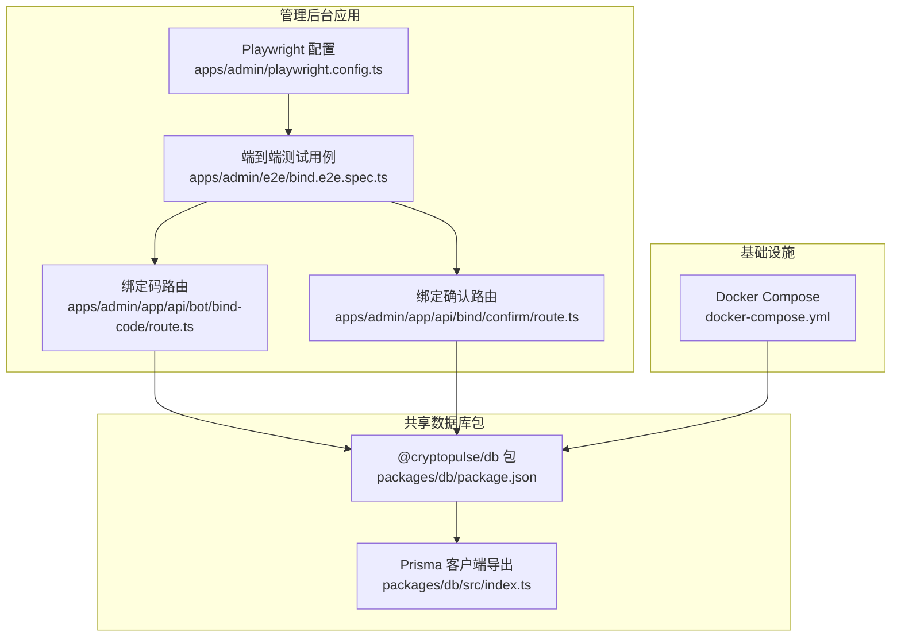
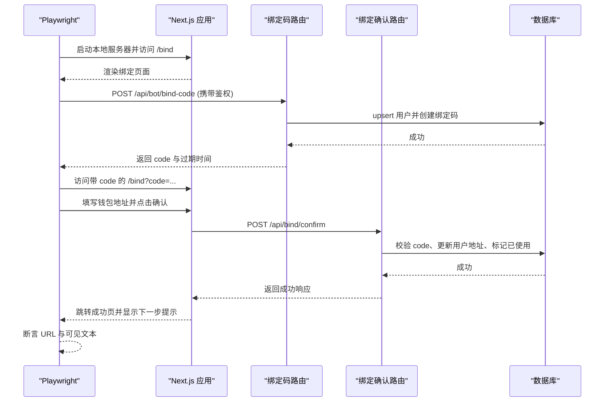
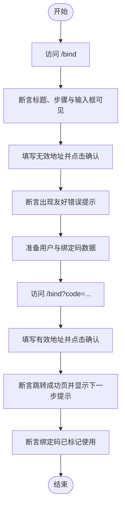
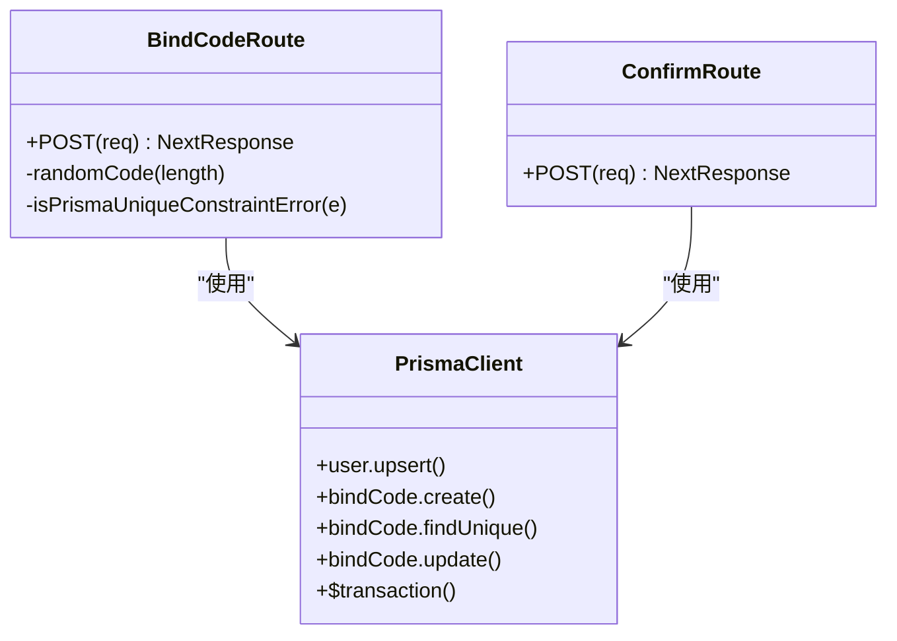
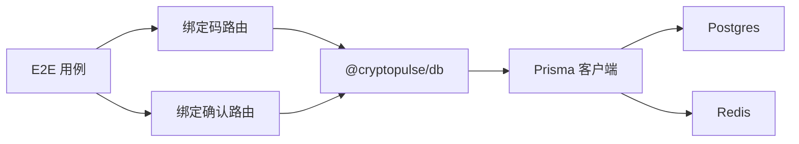

# 端到端测试

<cite>
**本文引用的文件**
- [apps/admin/playwright.config.ts](file://apps/admin/playwright.config.ts)
- [apps/admin/e2e/bind.e2e.spec.ts](file://apps/admin/e2e/bind.e2e.spec.ts)
- [apps/admin/package.json](file://apps/admin/package.json)
- [apps/admin/app/api/bot/bind-code/route.ts](file://apps/admin/app/api/bot/bind-code/route.ts)
- [apps/admin/app/api/bind/confirm/route.ts](file://apps/admin/app/api/bind/confirm/route.ts)
- [packages/db/src/index.ts](file://packages/db/src/index.ts)
- [packages/db/package.json](file://packages/db/package.json)
- [docker-compose.yml](file://docker-compose.yml)
- [test/bind-code.test.ts](file://test/bind-code.test.ts)
- [test/bind-confirm.test.ts](file://test/bind-confirm.test.ts)
- [test/bot-bind.test.ts](file://test/bot-bind.test.ts)
</cite>

## 目录
1. [简介](#简介)
2. [项目结构](#项目结构)
3. [核心组件](#核心组件)
4. [架构总览](#架构总览)
5. [详细组件分析](#详细组件分析)
6. [依赖关系分析](#依赖关系分析)
7. [性能考虑](#性能考虑)
8. [故障排查指南](#故障排查指南)
9. [结论](#结论)
10. [附录](#附录)

## 简介
本文件面向 CryptoPulse 项目的端到端测试体系，系统性阐述 Playwright 测试框架在应用中的配置与使用方法，覆盖浏览器自动化、页面对象模式、测试断言、用户场景驱动的测试设计（绑定流程、UI 交互、完整业务流程），以及测试环境配置（测试数据库、本地服务器启动、测试数据准备）。同时提供测试报告生成、截图与视频录制等高级功能的实践建议。

## 项目结构
本项目采用多包工作区结构，端到端测试位于管理后台应用内，测试配置集中于 Playwright 配置文件，测试用例位于 e2e 目录；数据库访问通过共享包提供的 Prisma 客户端完成；服务端 API 路由负责绑定码签发与绑定确认逻辑。

图表来源
- [apps/admin/playwright.config.ts](file://apps/admin/playwright.config.ts#L1-L22)
- [apps/admin/e2e/bind.e2e.spec.ts](file://apps/admin/e2e/bind.e2e.spec.ts#L1-L74)
- [apps/admin/app/api/bot/bind-code/route.ts](file://apps/admin/app/api/bot/bind-code/route.ts#L1-L105)
- [apps/admin/app/api/bind/confirm/route.ts](file://apps/admin/app/api/bind/confirm/route.ts#L1-L91)
- [packages/db/src/index.ts](file://packages/db/src/index.ts#L1-L12)
- [packages/db/package.json](file://packages/db/package.json#L1-L22)
- [docker-compose.yml](file://docker-compose.yml#L1-L24)

章节来源
- [apps/admin/playwright.config.ts](file://apps/admin/playwright.config.ts#L1-L22)
- [apps/admin/e2e/bind.e2e.spec.ts](file://apps/admin/e2e/bind.e2e.spec.ts#L1-L74)
- [apps/admin/package.json](file://apps/admin/package.json#L1-L42)
- [packages/db/src/index.ts](file://packages/db/src/index.ts#L1-L12)
- [docker-compose.yml](file://docker-compose.yml#L1-L24)

## 核心组件
- Playwright 测试配置：定义测试目录、超时、浏览器项目、自动启动 Web 服务器与追踪策略。
- 端到端测试用例：基于页面对象模式，验证绑定流程的关键用户路径与断言。
- 服务端 API 路由：提供绑定码签发与绑定确认的业务逻辑，供 E2E 用例调用。
- 数据库客户端：通过共享包暴露 Prisma 客户端，用于测试数据准备与清理。
- Docker Compose：提供 Postgres 与 Redis 的本地测试数据库与缓存环境。

章节来源
- [apps/admin/playwright.config.ts](file://apps/admin/playwright.config.ts#L1-L22)
- [apps/admin/e2e/bind.e2e.spec.ts](file://apps/admin/e2e/bind.e2e.spec.ts#L1-L74)
- [apps/admin/app/api/bot/bind-code/route.ts](file://apps/admin/app/api/bot/bind-code/route.ts#L1-L105)
- [apps/admin/app/api/bind/confirm/route.ts](file://apps/admin/app/api/bind/confirm/route.ts#L1-L91)
- [packages/db/src/index.ts](file://packages/db/src/index.ts#L1-L12)
- [docker-compose.yml](file://docker-compose.yml#L1-L24)

## 架构总览
下图展示了端到端测试的典型执行流：Playwright 启动 Next.js 开发服务器，加载管理后台页面，模拟用户操作（输入、点击），并与服务端 API 交互，最终断言页面状态与数据库结果。

图表来源
- [apps/admin/playwright.config.ts](file://apps/admin/playwright.config.ts#L15-L20)
- [apps/admin/e2e/bind.e2e.spec.ts](file://apps/admin/e2e/bind.e2e.spec.ts#L44-L72)
- [apps/admin/app/api/bot/bind-code/route.ts](file://apps/admin/app/api/bot/bind-code/route.ts#L34-L103)
- [apps/admin/app/api/bind/confirm/route.ts](file://apps/admin/app/api/bind/confirm/route.ts#L21-L89)

## 详细组件分析

### Playwright 配置与运行
- 测试目录与超时：指定测试目录、整体超时与断言超时，确保稳定与可读性。
- 浏览器项目：定义 Chromium 与 Chrome 两种项目，便于跨浏览器验证。
- 自动启动 Web 服务器：通过 npm 脚本启动 Next.js 应用，复用现有进程以提升效率。
- 追踪策略：失败时保留 trace，便于问题定位与回放。

章节来源
- [apps/admin/playwright.config.ts](file://apps/admin/playwright.config.ts#L1-L22)
- [apps/admin/package.json](file://apps/admin/package.json#L5-L11)

### 页面对象模式与断言
- 页面对象：在用例中直接使用 page 对象进行导航、交互与断言，符合 Playwright 推荐实践。
- 断言类型：包含可见性断言、URL 断言与文本断言，覆盖 UI 正常与异常路径。
- 数据库前置条件：在测试前通过 Prisma 创建用户与绑定码，确保业务流程可重现。

章节来源
- [apps/admin/e2e/bind.e2e.spec.ts](file://apps/admin/e2e/bind.e2e.spec.ts#L12-L18)
- [apps/admin/e2e/bind.e2e.spec.ts](file://apps/admin/e2e/bind.e2e.spec.ts#L20-L42)
- [apps/admin/e2e/bind.e2e.spec.ts](file://apps/admin/e2e/bind.e2e.spec.ts#L44-L72)

### 绑定流程测试设计
- 场景一：无 code 时展示步骤与输入框，验证初始 UI。
- 场景二：填写无效地址触发友好错误提示，验证前端校验与错误反馈。
- 场景三：提交成功后跳转成功页并提示下一步，验证后端处理与数据库标记。

图表来源
- [apps/admin/e2e/bind.e2e.spec.ts](file://apps/admin/e2e/bind.e2e.spec.ts#L12-L18)
- [apps/admin/e2e/bind.e2e.spec.ts](file://apps/admin/e2e/bind.e2e.spec.ts#L20-L42)
- [apps/admin/e2e/bind.e2e.spec.ts](file://apps/admin/e2e/bind.e2e.spec.ts#L44-L72)

章节来源
- [apps/admin/e2e/bind.e2e.spec.ts](file://apps/admin/e2e/bind.e2e.spec.ts#L1-L74)

### 服务端 API 与数据库交互
- 绑定码签发路由：鉴权校验、请求体校验、用户 upsert、随机唯一绑定码生成与入库。
- 绑定确认路由：校验 code 存在性、是否已使用、是否过期，事务性更新用户地址并标记使用。
- 数据库客户端：全局单例 Prisma 客户端，避免重复连接与资源泄漏。

图表来源
- [apps/admin/app/api/bot/bind-code/route.ts](file://apps/admin/app/api/bot/bind-code/route.ts#L34-L103)
- [apps/admin/app/api/bind/confirm/route.ts](file://apps/admin/app/api/bind/confirm/route.ts#L21-L89)
- [packages/db/src/index.ts](file://packages/db/src/index.ts#L1-L12)

章节来源
- [apps/admin/app/api/bot/bind-code/route.ts](file://apps/admin/app/api/bot/bind-code/route.ts#L1-L105)
- [apps/admin/app/api/bind/confirm/route.ts](file://apps/admin/app/api/bind/confirm/route.ts#L1-L91)
- [packages/db/src/index.ts](file://packages/db/src/index.ts#L1-L12)

### 测试数据准备与清理
- 本地数据库检查：仅在 DATABASE_URL 指向本地时执行 E2E，避免误伤生产或远程数据库。
- 测试前准备：通过 Prisma 创建用户与绑定码，确保业务流程可重现。
- 测试后清理：删除临时绑定码与用户，保持测试环境干净。

章节来源
- [apps/admin/e2e/bind.e2e.spec.ts](file://apps/admin/e2e/bind.e2e.spec.ts#L4-L10)
- [apps/admin/e2e/bind.e2e.spec.ts](file://apps/admin/e2e/bind.e2e.spec.ts#L24-L33)
- [apps/admin/e2e/bind.e2e.spec.ts](file://apps/admin/e2e/bind.e2e.spec.ts#L48-L57)
- [apps/admin/e2e/bind.e2e.spec.ts](file://apps/admin/e2e/bind.e2e.spec.ts#L67-L72)

### 测试环境配置
- 测试数据库：通过 Docker Compose 启动 Postgres 与 Redis，提供稳定的本地数据库与缓存。
- 本地服务器：Playwright 在测试期间启动 Next.js 应用，支持复用现有进程以减少冷启动开销。
- 环境变量：通过 DATABASE_URL 指定数据库连接，通过 BOT_API_TOKEN 控制绑定码签发路由的鉴权行为。

章节来源
- [docker-compose.yml](file://docker-compose.yml#L1-L24)
- [apps/admin/playwright.config.ts](file://apps/admin/playwright.config.ts#L15-L20)
- [apps/admin/app/api/bot/bind-code/route.ts](file://apps/admin/app/api/bot/bind-code/route.ts#L34-L44)

### 测试报告、截图与视频录制
- 追踪与回放：配置文件启用失败时保留 trace，便于问题复盘。
- 截图与视频：Playwright 支持在失败时自动生成截图与视频，建议结合 CI 使用以提升可观察性。
- 报告生成：Playwright 内置多种报告格式，可在 CI 中上传报告以便团队查看。

章节来源
- [apps/admin/playwright.config.ts](file://apps/admin/playwright.config.ts#L9-L9)

## 依赖关系分析
- 组件耦合：E2E 用例依赖 Next.js 应用与服务端 API 路由；API 路由依赖共享数据库包；数据库包依赖 Prisma 客户端。
- 外部依赖：Playwright、Next.js、Prisma、Postgres、Redis。
- 可能的循环依赖：当前结构清晰，未发现循环依赖迹象。

图表来源
- [apps/admin/e2e/bind.e2e.spec.ts](file://apps/admin/e2e/bind.e2e.spec.ts#L1-L74)
- [apps/admin/app/api/bot/bind-code/route.ts](file://apps/admin/app/api/bot/bind-code/route.ts#L1-L105)
- [apps/admin/app/api/bind/confirm/route.ts](file://apps/admin/app/api/bind/confirm/route.ts#L1-L91)
- [packages/db/src/index.ts](file://packages/db/src/index.ts#L1-L12)
- [docker-compose.yml](file://docker-compose.yml#L1-L24)

章节来源
- [apps/admin/e2e/bind.e2e.spec.ts](file://apps/admin/e2e/bind.e2e.spec.ts#L1-L74)
- [apps/admin/app/api/bot/bind-code/route.ts](file://apps/admin/app/api/bot/bind-code/route.ts#L1-L105)
- [apps/admin/app/api/bind/confirm/route.ts](file://apps/admin/app/api/bind/confirm/route.ts#L1-L91)
- [packages/db/src/index.ts](file://packages/db/src/index.ts#L1-L12)
- [docker-compose.yml](file://docker-compose.yml#L1-L24)

## 性能考虑
- 服务器复用：通过复用现有进程启动 Next.js 应用，减少冷启动时间。
- 超时设置：合理设置整体与断言超时，平衡稳定性与执行速度。
- 浏览器项目：同时运行 Chromium 与 Chrome 项目，有助于早期发现兼容性问题。
- 数据库幂等：在测试前后进行数据准备与清理，避免重复数据影响性能与一致性。

章节来源
- [apps/admin/playwright.config.ts](file://apps/admin/playwright.config.ts#L15-L20)
- [apps/admin/playwright.config.ts](file://apps/admin/playwright.config.ts#L5-L6)
- [apps/admin/playwright.config.ts](file://apps/admin/playwright.config.ts#L11-L14)

## 故障排查指南
- 数据库连接问题：检查 DATABASE_URL 是否指向本地地址，避免在非本地数据库上执行 E2E。
- 服务器启动失败：确认本地端口未被占用，或调整端口；检查 Next.js 构建产物与依赖安装。
- 鉴权失败：确认 BOT_API_TOKEN 已正确设置，且请求头 Authorization 与之匹配。
- 绑定码冲突：路由内部对唯一约束冲突有重试机制，若仍失败，检查代码生成逻辑与数据库索引。
- Trace 回放：利用 Playwright Trace Viewer 打开失败时生成的 trace 文件，逐步回放问题。

章节来源
- [apps/admin/e2e/bind.e2e.spec.ts](file://apps/admin/e2e/bind.e2e.spec.ts#L4-L10)
- [apps/admin/playwright.config.ts](file://apps/admin/playwright.config.ts#L15-L20)
- [apps/admin/app/api/bot/bind-code/route.ts](file://apps/admin/app/api/bot/bind-code/route.ts#L34-L44)
- [apps/admin/app/api/bot/bind-code/route.ts](file://apps/admin/app/api/bot/bind-code/route.ts#L83-L97)

## 结论
本项目通过 Playwright 实现了覆盖关键用户路径的端到端测试，结合服务端 API 与共享数据库包，确保绑定流程的完整性与可靠性。通过 Docker Compose 提供稳定的测试环境，配合追踪、截图与视频录制能力，能够高效定位问题并持续改进用户体验。建议在 CI 中集成报告与回放能力，进一步提升测试可观测性与协作效率。

## 附录
- 相关单测参考：项目中还包含针对绑定码签发与绑定确认的单测，可作为 E2E 补充验证与边界条件覆盖的参考。
- 单测文件路径：
  - [test/bind-code.test.ts](file://test/bind-code.test.ts#L1-L88)
  - [test/bind-confirm.test.ts](file://test/bind-confirm.test.ts#L1-L112)
  - [test/bot-bind.test.ts](file://test/bot-bind.test.ts#L1-L48)

章节来源
- [test/bind-code.test.ts](file://test/bind-code.test.ts#L1-L88)
- [test/bind-confirm.test.ts](file://test/bind-confirm.test.ts#L1-L112)
- [test/bot-bind.test.ts](file://test/bot-bind.test.ts#L1-L48)