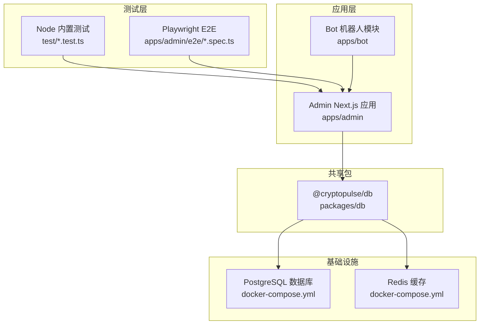
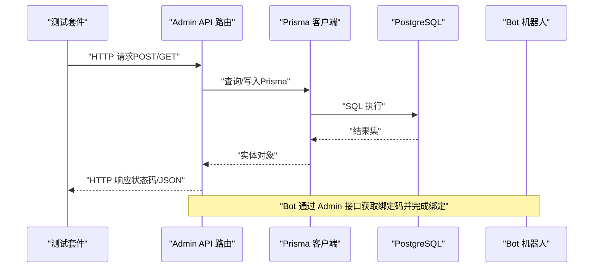
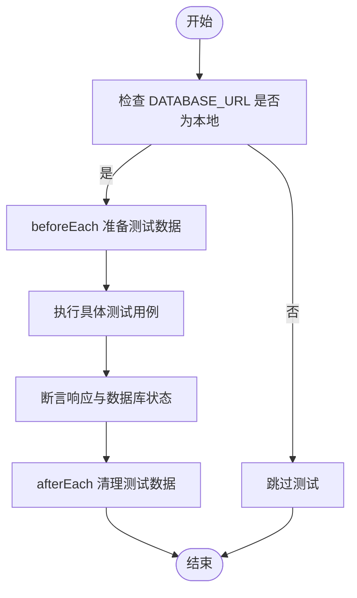
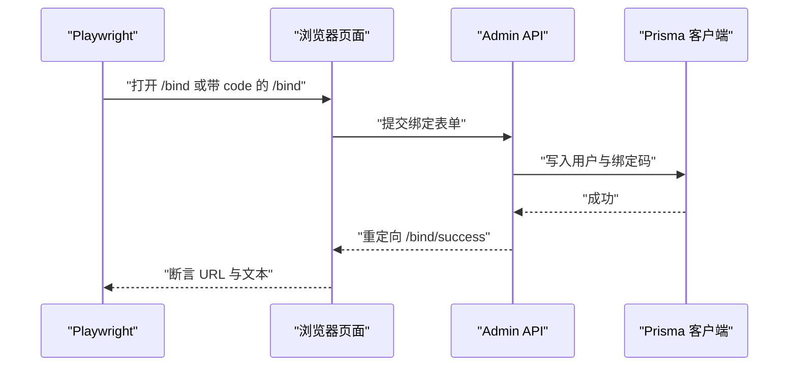
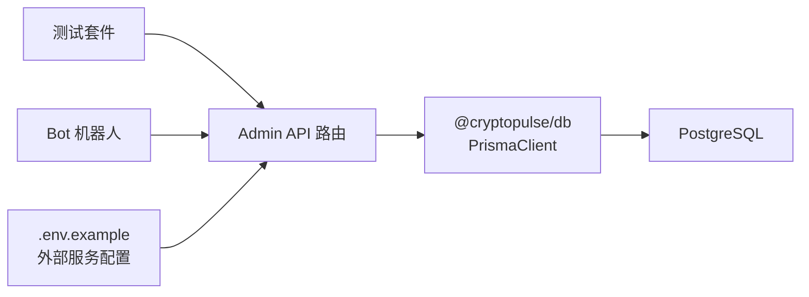

# 集成测试

<cite>
**本文引用的文件**
- [test/admin-next-config.test.ts](file://test/admin-next-config.test.ts)
- [test/bind-code.test.ts](file://test/bind-code.test.ts)
- [test/bind-confirm.test.ts](file://test/bind-confirm.test.ts)
- [test/bot-bind.test.ts](file://test/bot-bind.test.ts)
- [test/trade-order.test.ts](file://test/trade-order.test.ts)
- [test/trade-portfolio.test.ts](file://test/trade-portfolio.test.ts)
- [apps/admin/playwright.config.ts](file://apps/admin/playwright.config.ts)
- [apps/admin/e2e/bind.e2e.spec.ts](file://apps/admin/e2e/bind.e2e.spec.ts)
- [docker-compose.yml](file://docker-compose.yml)
- [.env.example](file://.env.example)
- [apps/admin/next.config.ts](file://apps/admin/next.config.ts)
- [packages/db/src/index.ts](file://packages/db/src/index.ts)
- [packages/db/package.json](file://packages/db/package.json)
</cite>

## 目录
1. [简介](#简介)
2. [项目结构](#项目结构)
3. [核心组件](#核心组件)
4. [架构总览](#架构总览)
5. [详细组件分析](#详细组件分析)
6. [依赖关系分析](#依赖关系分析)
7. [性能考量](#性能考量)
8. [故障排查指南](#故障排查指南)
9. [结论](#结论)
10. [附录](#附录)

## 简介
本文件面向 CryptoPulse 项目的集成测试，系统化梳理数据库集成测试、API 集成测试与外部服务集成测试的策略与实践。文档覆盖测试环境搭建（本地数据库与缓存）、测试数据隔离与清理、Next.js 配置验证、以及典型场景的端到端测试流程，帮助开发者在保证测试稳定性的同时提升回归效率。

## 项目结构
项目采用多包与多应用的组织方式：
- packages/db：数据库客户端封装与 Prisma 客户端初始化
- apps/admin：Next.js 应用，包含 API 路由、前端页面与 E2E 测试
- apps/bot：机器人侧业务逻辑（与 Admin API 的交互）
- test：Node 内置测试套件，覆盖 Admin API 与 Next 配置
- docker-compose.yml：本地数据库与缓存服务编排
- .env.example：开发期环境变量模板

图表来源
- [docker-compose.yml](file://docker-compose.yml#L1-L24)
- [packages/db/src/index.ts](file://packages/db/src/index.ts#L1-L12)
- [apps/admin/playwright.config.ts](file://apps/admin/playwright.config.ts#L1-L23)
- [test/bind-code.test.ts](file://test/bind-code.test.ts#L1-L88)

章节来源
- [docker-compose.yml](file://docker-compose.yml#L1-L24)
- [.env.example](file://.env.example#L1-L43)

## 核心组件
- 数据库客户端与连接
  - 使用 Prisma Client 连接 PostgreSQL，全局单例避免重复连接
  - 在测试中通过 DATABASE_URL 环境变量指向本地数据库
- Admin API 集成测试
  - 绑定码生成、绑定确认、交易下单与组合查询等路由的集成测试
  - 通过 Node 内置测试框架发起 Request 并断言响应状态与数据库落库结果
- Bot 与 Admin 的集成
  - 机器人侧调用 Admin 的绑定码接口，测试其错误处理与响应解析
- E2E 端到端测试
  - Playwright 驱动浏览器访问 Admin 页面，验证绑定流程的 UI 行为与数据库联动
- Next.js 配置验证
  - 对 Admin 应用的 Webpack 忽略规则进行断言，确保开发体验与构建稳定性

章节来源
- [packages/db/src/index.ts](file://packages/db/src/index.ts#L1-L12)
- [test/bind-code.test.ts](file://test/bind-code.test.ts#L1-L88)
- [test/bind-confirm.test.ts](file://test/bind-confirm.test.ts#L1-L112)
- [test/trade-order.test.ts](file://test/trade-order.test.ts#L1-L107)
- [test/trade-portfolio.test.ts](file://test/trade-portfolio.test.ts#L1-L96)
- [test/bot-bind.test.ts](file://test/bot-bind.test.ts#L1-L48)
- [apps/admin/e2e/bind.e2e.spec.ts](file://apps/admin/e2e/bind.e2e.spec.ts#L1-L74)
- [apps/admin/next.config.ts](file://apps/admin/next.config.ts#L1-L30)
- [test/admin-next-config.test.ts](file://test/admin-next-config.test.ts#L1-L20)

## 架构总览
下图展示了集成测试的关键路径：测试驱动请求进入 Admin API，经由 Prisma 访问数据库，部分场景还涉及外部链上服务或机器人侧调用。

图表来源
- [test/bind-code.test.ts](file://test/bind-code.test.ts#L1-L88)
- [test/bind-confirm.test.ts](file://test/bind-confirm.test.ts#L1-L112)
- [test/trade-order.test.ts](file://test/trade-order.test.ts#L1-L107)
- [test/bot-bind.test.ts](file://test/bot-bind.test.ts#L1-L48)
- [packages/db/src/index.ts](file://packages/db/src/index.ts#L1-L12)

## 详细组件分析

### 数据库集成测试策略
- 测试前置条件
  - 仅在 DATABASE_URL 指向本地地址时执行，避免误连生产库
  - 通过环境变量控制鉴权令牌与交易模式（如 mock）
- 数据隔离与清理
  - 使用 BigInt 类型的 telegramId 作为测试标识，避免与真实用户冲突
  - 每个测试用例在 beforeEach 中准备最小必要数据，在 afterEach 清理
  - 针对特定表（如 TradeOrder）在测试前动态创建，确保测试环境一致性
- 典型场景
  - 绑定码生成：校验鉴权失败返回 401；成功生成后落库并校验字段格式与唯一性
  - 绑定确认：校验 code 不存在、重复使用等边界情况；成功后更新用户与绑定码状态
  - 交易下单：mock 模式下创建订单并断言返回状态与数据库落盘
  - 组合查询：统计持仓与最近订单，断言聚合结果正确

图表来源
- [test/bind-code.test.ts](file://test/bind-code.test.ts#L7-L25)
- [test/bind-confirm.test.ts](file://test/bind-confirm.test.ts#L18-L31)
- [test/trade-order.test.ts](file://test/trade-order.test.ts#L17-L48)
- [test/trade-portfolio.test.ts](file://test/trade-portfolio.test.ts#L17-L47)

章节来源
- [test/bind-code.test.ts](file://test/bind-code.test.ts#L1-L88)
- [test/bind-confirm.test.ts](file://test/bind-confirm.test.ts#L1-L112)
- [test/trade-order.test.ts](file://test/trade-order.test.ts#L1-L107)
- [test/trade-portfolio.test.ts](file://test/trade-portfolio.test.ts#L1-L96)

### API 集成测试示例

#### 绑定码测试（bind-code）
- 场景要点
  - 生产环境未配置 BOT_API_TOKEN 时返回 401
  - 鉴权失败返回 401
  - 成功生成绑定码并落库，校验 code 格式与过期时间
- 断言清单
  - 响应状态码
  - JSON 结构中的 code 与 expiresAt 字段
  - 数据库中 BindCode 条目存在且未被使用

章节来源
- [test/bind-code.test.ts](file://test/bind-code.test.ts#L27-L86)

#### 绑定确认测试（bind-confirm）
- 场景要点
  - code 不存在返回 404
  - 成功绑定后更新用户地址并标记绑定码已使用
  - 重复使用同一 code 返回 409
- 断言清单
  - 响应状态码与 JSON 结果
  - 用户地址字段更新
  - 绑定码 usedAt 字段非空

章节来源
- [test/bind-confirm.test.ts](file://test/bind-confirm.test.ts#L33-L83)

#### 机器人绑定测试（bot-bind）
- 场景要点
  - 机器人侧调用 Admin 接口生成绑定码
  - 模拟 fetch 返回 500，验证错误消息包含状态码
  - 正常返回时解析 code 与 expiresAt
- 断言清单
  - 错误消息包含“bind_code_failed:500”
  - 返回对象包含 code 与 expiresAt

章节来源
- [test/bot-bind.test.ts](file://test/bot-bind.test.ts#L10-L46)

#### 交易订单测试（trade-order）
- 场景要点
  - 鉴权失败返回 401
  - 未绑定用户返回 400（user_not_bound）
  - mock 模式下创建订单并返回 SIMULATED_FILLED
- 断言清单
  - 响应状态码与 JSON 字段
  - 数据库中 TradeOrder 条目存在且字段匹配

章节来源
- [test/trade-order.test.ts](file://test/trade-order.test.ts#L50-L105)

#### 组合查询测试（trade-portfolio）
- 场景要点
  - 查询用户持仓与最近订单，断言聚合结果
- 断言清单
  - positions 数组长度与金额合计
  - recentOrders 数量与字段存在性

章节来源
- [test/trade-portfolio.test.ts](file://test/trade-portfolio.test.ts#L49-L94)

### 外部服务集成测试策略
- 外部依赖
  - Polymarket 链上服务（CLOB、WS、Relayer、RPC）在 .env.example 中定义
  - 机器人侧通过 Admin API 获取绑定码，间接与外部链交互
- 测试建议
  - 使用 mock 模式（TRADE_MODE=mock）隔离外部链依赖
  - 在 CI 中通过 Docker Compose 启动数据库与缓存，确保测试环境一致
  - 对于链上交互，优先在单元测试中注入假实现，集成测试聚焦于 API 协议与数据库一致性

章节来源
- [.env.example](file://.env.example#L18-L28)
- [test/trade-order.test.ts](file://test/trade-order.test.ts#L37-L42)

### E2E 端到端测试（Playwright）
- 测试范围
  - 绑定流程：无 code 展示步骤、输入非法地址提示、成功绑定跳转与落库
- 环境配置
  - Playwright 通过 webServer 命令启动 Admin 应用，自动复用已有进程
  - 支持多浏览器项目（Chromium/Chrome），便于跨浏览器验证
- 断言清单
  - 页面元素可见性
  - URL 跳转正则匹配
  - 绑定码 usedAt 字段非空

图表来源
- [apps/admin/playwright.config.ts](file://apps/admin/playwright.config.ts#L15-L20)
- [apps/admin/e2e/bind.e2e.spec.ts](file://apps/admin/e2e/bind.e2e.spec.ts#L12-L72)

章节来源
- [apps/admin/playwright.config.ts](file://apps/admin/playwright.config.ts#L1-L23)
- [apps/admin/e2e/bind.e2e.spec.ts](file://apps/admin/e2e/bind.e2e.spec.ts#L1-L74)

### Next.js 配置测试（Webpack 忽略项）
- 目标
  - 验证 Admin 应用的 Webpack 忽略规则是否包含系统目录，减少不必要的文件监听开销
- 断言清单
  - Webpack 配置函数存在
  - watchOptions.ignored 包含关键系统目录字符串

章节来源
- [apps/admin/next.config.ts](file://apps/admin/next.config.ts#L10-L25)
- [test/admin-next-config.test.ts](file://test/admin-next-config.test.ts#L6-L18)

## 依赖关系分析
- 组件耦合
  - Admin API 依赖 @cryptopulse/db 提供的 Prisma 客户端
  - 测试通过统一的 DATABASE_URL 连接本地数据库，避免与生产数据耦合
  - Bot 与 Admin 通过 HTTP 接口交互，降低直接耦合度
- 外部依赖
  - Polymarket 相关服务在 .env.example 中集中配置
  - Redis 用于缓存（如会话、限流），Docker Compose 提供本地实例

图表来源
- [packages/db/src/index.ts](file://packages/db/src/index.ts#L1-L12)
- [.env.example](file://.env.example#L18-L28)
- [test/bind-code.test.ts](file://test/bind-code.test.ts#L4-L5)

章节来源
- [packages/db/src/index.ts](file://packages/db/src/index.ts#L1-L12)
- [packages/db/package.json](file://packages/db/package.json#L1-L22)
- [.env.example](file://.env.example#L1-L43)

## 性能考量
- 开发体验
  - Next.js Webpack 忽略系统目录，减少热更新扫描范围，提升本地开发速度
- 测试性能
  - 使用 mock 模式（TRADE_MODE=mock）避免链上交互带来的延迟
  - Docker Compose 提供稳定的数据库与缓存，减少网络抖动影响
- 数据库优化
  - 在测试中尽量使用小批量写入与精准清理，避免大事务阻塞

章节来源
- [apps/admin/next.config.ts](file://apps/admin/next.config.ts#L10-L25)
- [test/trade-order.test.ts](file://test/trade-order.test.ts#L37-L42)
- [docker-compose.yml](file://docker-compose.yml#L1-L24)

## 故障排查指南
- 数据库连接问题
  - 症状：测试跳过或报错
  - 排查：确认 DATABASE_URL 指向本地地址；检查 docker-compose 是否正常运行
- 鉴权失败
  - 症状：401 响应
  - 排查：核对 BOT_API_TOKEN 设置；确认 NODE_ENV 与授权头格式
- 绑定码与绑定状态异常
  - 症状：code 不存在、重复使用返回 404/409
  - 排查：检查测试数据是否按序清理；确认 Prisma 查询条件
- E2E 页面行为不符
  - 症状：元素不可见或 URL 不匹配
  - 排查：确认 webServer 已启动；检查 base URL 与浏览器项目配置

章节来源
- [test/bind-code.test.ts](file://test/bind-code.test.ts#L27-L47)
- [test/bind-confirm.test.ts](file://test/bind-confirm.test.ts#L33-L48)
- [apps/admin/playwright.config.ts](file://apps/admin/playwright.config.ts#L15-L20)

## 结论
本集成测试体系以数据库为中心，结合 Admin API、Bot 与 E2E 测试，形成从协议到 UI 的完整闭环。通过严格的环境约束、数据隔离与清理机制，确保测试稳定可靠。建议在持续集成中固定使用 Docker Compose 提供的数据库与缓存，配合 mock 模式隔离外部依赖，进一步提升回归效率与可维护性。

## 附录

### 测试环境搭建与配置
- 启动本地数据库与缓存
  - 使用 docker-compose 启动 PostgreSQL 与 Redis
- 设置环境变量
  - 参考 .env.example，确保 DATABASE_URL、REDIS_URL、BOT_API_TOKEN 等配置正确
- 运行测试
  - Node 内置测试：在根目录执行测试脚本
  - E2E 测试：在 apps/admin 目录下执行 Playwright 命令

章节来源
- [docker-compose.yml](file://docker-compose.yml#L1-L24)
- [.env.example](file://.env.example#L1-L43)
- [apps/admin/package.json](file://apps/admin/package.json#L5-L11)